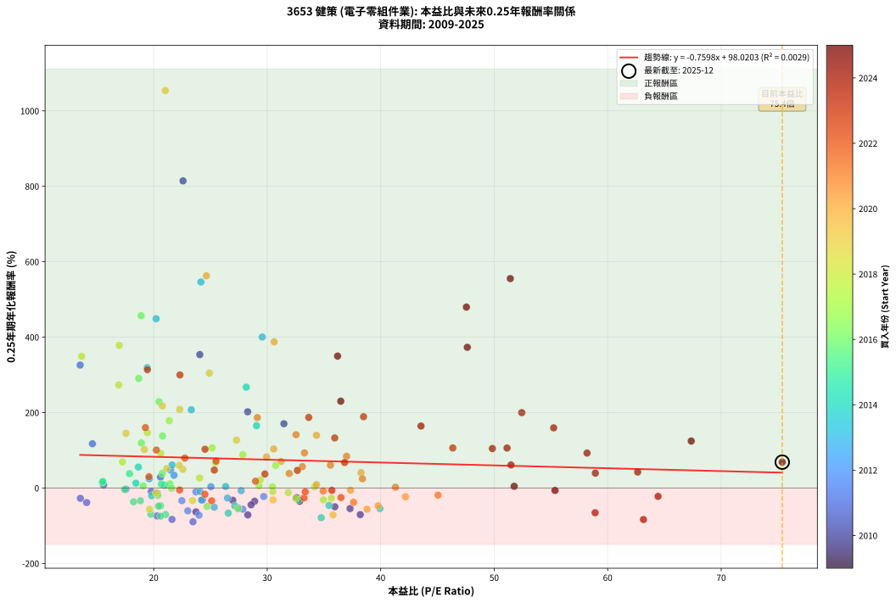
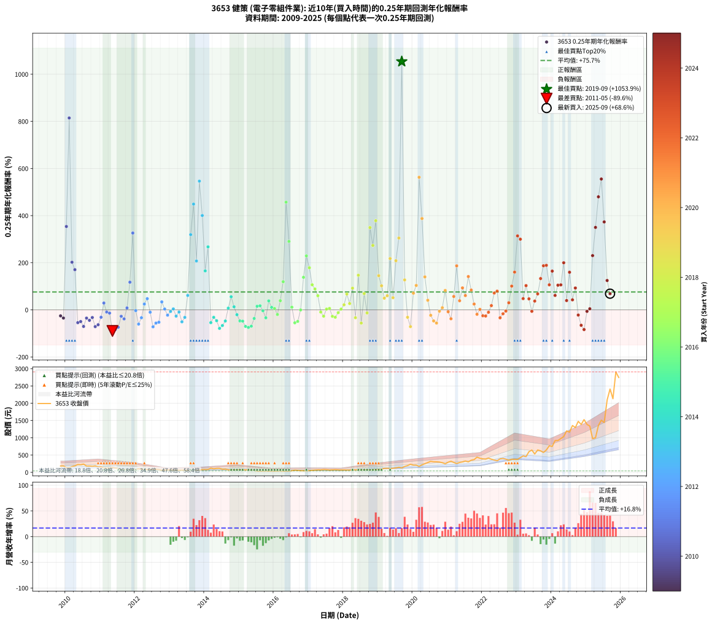

# 3653 健策 - 本益比與未來報酬率分析

!!! info "報告資訊"
    - **股票代號**: 3653
    - **公司名稱**: 健策
    - **產業別**: 電子零組件業
    - **分析期間**: 2009-2025 (191 個數據點)
    - **資料來源**: Type 12 (ShowMonthlyK_ChartFlow) 月收盤價與本益比
    - **報酬率口徑**: 含現金股利 (簡化: 年度合計，假設每年7/1入帳)
    - **報告生成時間**: 2026-01-05 00:57:08 CST

## 📈 視覺化圖表

### 圖表1: 本益比 vs 未來報酬率關係

*圖表1：3653 健策 本益比與0.25年期未來報酬率關係 (2009-2025)*

### 圖表2: 歷年買入時點的0.25年期實際報酬率

*圖表2：3653 健策 歷年買入時點的0.25年期實際報酬率 (2009-2025)*

## 📍 買點訊號說明

本報告提供兩種買點提示訊號（顯示於圖表2的股價子圖中）：

### ▲ 小綠色三角形（回測驗證）
- **計算方式**: 使用全部歷史資料計算本益比第25百分位數
- **用途**: 事後驗證，顯示歷史上哪些時點確實為低估區
- **限制**: 當下無法判斷，僅供回測參考
- **特性**: 後見之明（Look-Ahead Bias）

### ▲ 小橘色三角形（即時訊號）
- **計算方式**: 使用截至當月的過去5年資料計算本益比第25百分位數
- **用途**: 實際投資決策，當時即可判斷
- **優勢**: 可操作性強，符合實務需求
- **特性**: 無後見之明，滾動窗口計算

!!! tip "如何使用兩種訊號"
    - **綠色▲** 幫助理解歷史估值機會，驗證策略有效性
    - **橘色▲** 可作為實際買進參考，但仍需搭配基本面分析
    - 兩種訊號重疊時，表示即時判斷與事後驗證一致，信心度較高
    - 僅有綠色▲時，表示當時無法判斷（需要未來資料才能確認）
    - 僅有橘色▲時，表示即時判斷為買點，但事後可能不是最佳時機

## 📊 估值分析摘要

| 指標 | 數值 |
|:---:|:---:|
| **目前本益比** (2025-09) | **75.38 倍** |
| **歷史平均本益比** | 29.31 倍 |
| **估值水準** | 🔴 相對高估 |
| **預期0.25年年化報酬率** | **+40.75%** |
| **歷史平均報酬率** | +75.75% |
| **相關係數 (R²)** | 0.0029 |
| **趨勢線斜率** | -0.7598 |

!!! abstract "核心洞察"
    目前本益比顯著高於歷史平均，預期未來報酬率可能較低

    根據歷史數據回測，3653 健策 在目前本益比 **75.4倍** 的估值水準下，
    預期未來0.25年年化報酬率約為 **+40.7%**。

    **重要提醒**: 本分析基於歷史數據統計，實際報酬率會受到公司基本面變化、產業趨勢、
    總體經濟環境等多重因素影響。R² = 0.00 表示本益比可解釋約 0.3% 的報酬率變異。

## 📈 歷史估值統計

### 最佳買點 (最高報酬率)

| 項目 | 數值 |
|:---:|:---:|
| 起始時間 | 2019-09 |
| 當時本益比 | 21.02 倍 |
| 起始價格 | 127.5 元 |
| 0.25年後價格 | 234.5 元 |
| **0.25年年化報酬率** | **+1053.89%** |

### 最差買點 (最低報酬率)

| 項目 | 數值 |
|:---:|:---:|
| 起始時間 | 2011-05 |
| 當時本益比 | 23.46 倍 |
| 起始價格 | 140.0 元 |
| 0.25年後價格 | 75.2 元 |
| **0.25年年化報酬率** | **-89.58%** |

## 🎯 投資啟示

### 本益比與報酬率關係

趨勢線方程式: **y = -0.7598x + 98.0203**

!!! warning "強負相關"
    本益比與未來報酬率呈現強負相關。在高本益比時期買入，未來報酬率顯著較低；
    在低本益比時期買入，未來報酬率顯著較高。**估值紀律至關重要**。

### 估值區間建議

基於歷史數據分析:

- **🟢 低估區** (P/E < 23.5): 預期報酬率較高，可考慮增加持股
- **🟡 合理區** (P/E 23.5-35.2): 預期報酬率符合長期趨勢，正常持有
- **🔴 高估區** (P/E > 35.2): 預期報酬率較低，可考慮減碼或觀望

!!! danger "風險提示"
    - 過去表現不代表未來結果
    - 本分析假設公司基本面無重大結構性變化
    - 產業環境劇變可能使歷史規律失效
    - 應結合公司財報、產業趨勢、總體經濟等多重因素綜合判斷

!!! success "長期投資觀點"
    歷史數據顯示，在合理或低估的估值水準買入並長期持有，
    往往能獲得較佳的投資報酬。**耐心等待好價格**是價值投資的核心原則。

## 📊 數據品質

- **資料來源**: GoodInfo.tw Type 12 (ShowMonthlyK_ChartFlow)
- **資料頻率**: 月度收盤價與本益比
- **回測期間**: 2009-2025
- **數據點數量**: 191 個 (每個點代表一次0.25年期回測)

### 計算方法說明

1. **0.25年期年化報酬率**:
   - 對每個歷史時點，計算其後0.25年的實際投資報酬率
   - 期末價值(不含股利): 期末價格
   - 期末價值(含現金股利): 期末價格 + 持有期間內的現金股利合計 (簡化: 年度合計，假設每年7/1入帳)
   - 公式: 年化報酬率 = [(期末價值/期初價格)^(1/年數) - 1] × 100%

2. **本益比 (P/E Ratio)**:
   - 使用當時的月收盤價與EPS計算
   - 資料來源: Type 12 月度河流圖本益比數據

3. **趨勢線 (Linear Regression)**:
   - 使用最小平方法擬合線性趨勢線
   - R²值衡量本益比對報酬率的解釋能力

---

*本報告由 Stock Analysis System v1.9.0 自動生成*
*數據更新時間: 2026-01-05 00:57:08 CST*

## 📋 月度回測明細表

（每一列對應時間線圖中的一個買入點；可用來對照 SVG 圖上的每個點。）

| 買入月份 | 賣出月份 | 回測期限_年 | 實際持有年數 | 買入本益比_倍 | 買入收盤價_元 | 賣出收盤價_元 | 現金股利合計_元 | 總報酬率_pct | 年化報酬率_pct |
| --- | --- | --- | --- | --- | --- | --- | --- | --- | --- |
| 2009-11 | 2010-03 | 0.25 | 0.329 | 32.59 | 183.50 | 166.50 | 0.00 | -9.26 | -25.61 |
| 2009-12 | 2010-03 | 0.25 | 0.246 | 32.86 | 185.00 | 166.50 | 0.00 | -10.00 | -34.79 |
| 2010-01 | 2010-05 | 0.25 | 0.329 | 24.06 | 137.50 | 226.00 | 0.00 | +64.36 | +353.79 |
| 2010-02 | 2010-05 | 0.25 | 0.246 | 22.58 | 131.00 | 226.00 | 0.00 | +72.52 | +814.46 |
| 2010-03 | 2010-07 | 0.25 | 0.334 | 28.28 | 166.50 | 238.00 | 2.88 | +44.68 | +202.13 |
| 2010-04 | 2010-07 | 0.25 | 0.249 | 31.47 | 188.00 | 238.00 | 2.88 | +28.13 | +170.45 |
| 2010-05 | 2010-08 | 0.25 | 0.252 | 37.30 | 226.00 | 182.50 | 2.88 | -17.97 | -54.46 |
| 2010-06 | 2010-09 | 0.25 | 0.252 | 35.96 | 221.00 | 183.00 | 2.88 | -15.89 | -49.69 |
| 2010-07 | 2010-10 | 0.25 | 0.252 | 38.20 | 238.00 | 175.00 | 0.00 | -26.47 | -70.50 |
| 2010-08 | 2010-12 | 0.25 | 0.334 | 28.89 | 182.50 | 158.00 | 0.00 | -13.42 | -35.05 |
| 2010-09 | 2010-12 | 0.25 | 0.249 | 28.58 | 183.00 | 158.00 | 0.00 | -13.66 | -44.54 |
| 2010-10 | 2011-01 | 0.25 | 0.252 | 26.97 | 175.00 | 158.50 | 0.00 | -9.43 | -32.51 |
| 2010-11 | 2011-03 | 0.25 | 0.329 | 28.29 | 186.00 | 123.50 | 0.00 | -33.60 | -71.25 |
| 2010-12 | 2011-03 | 0.25 | 0.246 | 23.72 | 158.00 | 123.50 | 0.00 | -21.84 | -63.20 |
| 2011-01 | 2011-05 | 0.25 | 0.329 | 24.30 | 158.50 | 140.00 | 0.00 | -11.67 | -31.46 |
| 2011-02 | 2011-05 | 0.25 | 0.246 | 20.60 | 131.50 | 140.00 | 0.00 | +6.46 | +28.94 |
| 2011-03 | 2011-07 | 0.25 | 0.334 | 19.78 | 123.50 | 115.50 | 4.00 | -3.24 | -9.39 |
| 2011-04 | 2011-07 | 0.25 | 0.249 | 20.31 | 124.00 | 115.50 | 4.00 | -3.63 | -13.79 |
| 2011-05 | 2011-08 | 0.25 | 0.252 | 23.46 | 140.00 | 75.20 | 4.00 | -43.43 | -89.58 |
| 2011-06 | 2011-09 | 0.25 | 0.252 | 21.61 | 126.00 | 76.30 | 4.00 | -36.27 | -83.28 |
| 2011-07 | 2011-10 | 0.25 | 0.252 | 20.29 | 115.50 | 82.20 | 0.00 | -28.83 | -74.08 |
| 2011-08 | 2011-12 | 0.25 | 0.334 | 13.54 | 75.20 | 67.60 | 0.00 | -10.11 | -27.31 |
| 2011-09 | 2011-12 | 0.25 | 0.249 | 14.09 | 76.30 | 67.60 | 0.00 | -11.40 | -38.49 |
| 2011-10 | 2012-01 | 0.25 | 0.252 | 15.58 | 82.20 | 83.80 | 0.00 | +1.95 | +7.95 |
| 2011-11 | 2012-03 | 0.25 | 0.331 | 14.60 | 75.00 | 97.00 | 0.00 | +29.33 | +117.37 |
| 2011-12 | 2012-03 | 0.25 | 0.249 | 13.52 | 67.60 | 97.00 | 0.00 | +43.49 | +326.04 |
| 2012-01 | 2012-05 | 0.25 | 0.331 | 17.56 | 83.80 | 82.90 | 0.00 | -1.07 | -3.21 |
| 2012-02 | 2012-05 | 0.25 | 0.249 | 23.00 | 104.50 | 82.90 | 0.00 | -20.67 | -60.52 |
| 2012-03 | 2012-07 | 0.25 | 0.334 | 22.48 | 97.00 | 81.60 | 3.02 | -12.77 | -33.57 |
| 2012-04 | 2012-07 | 0.25 | 0.249 | 19.60 | 80.10 | 81.60 | 3.02 | +5.64 | +24.62 |
| 2012-05 | 2012-08 | 0.25 | 0.252 | 21.49 | 82.90 | 88.40 | 3.02 | +10.27 | +47.43 |
| 2012-06 | 2012-09 | 0.25 | 0.252 | 23.72 | 86.10 | 80.80 | 3.02 | -2.65 | -10.13 |
| 2012-07 | 2012-10 | 0.25 | 0.252 | 23.99 | 81.60 | 59.20 | 0.00 | -27.45 | -72.03 |
| 2012-08 | 2012-12 | 0.25 | 0.334 | 27.86 | 88.40 | 67.10 | 0.00 | -24.10 | -56.19 |
| 2012-09 | 2012-12 | 0.25 | 0.249 | 27.44 | 80.80 | 67.10 | 0.00 | -16.96 | -52.56 |
| 2012-10 | 2013-01 | 0.25 | 0.252 | 21.79 | 59.20 | 63.70 | 0.00 | +7.60 | +33.76 |
| 2012-11 | 2013-03 | 0.25 | 0.329 | 25.04 | 62.30 | 63.00 | 0.00 | +1.12 | +3.46 |
| 2012-12 | 2013-03 | 0.25 | 0.246 | 29.69 | 67.10 | 63.00 | 0.00 | -6.11 | -22.58 |
| 2013-01 | 2013-05 | 0.25 | 0.329 | 27.71 | 63.70 | 62.20 | 0.00 | -2.35 | -7.00 |
| 2013-02 | 2013-05 | 0.25 | 0.246 | 26.34 | 61.60 | 62.20 | 0.00 | +0.97 | +4.01 |
| 2013-03 | 2013-07 | 0.25 | 0.334 | 26.50 | 63.00 | 54.80 | 2.01 | -9.83 | -26.63 |
| 2013-04 | 2013-07 | 0.25 | 0.249 | 24.08 | 58.20 | 54.80 | 2.01 | -2.39 | -9.25 |
| 2013-05 | 2013-08 | 0.25 | 0.252 | 25.33 | 62.20 | 50.00 | 2.01 | -16.38 | -50.86 |
| 2013-06 | 2013-09 | 0.25 | 0.252 | 24.21 | 60.40 | 52.80 | 2.01 | -9.26 | -32.00 |
| 2013-07 | 2013-10 | 0.25 | 0.252 | 21.62 | 54.80 | 61.80 | 0.00 | +12.77 | +61.17 |
| 2013-08 | 2013-12 | 0.25 | 0.334 | 19.43 | 50.00 | 80.70 | 0.00 | +61.40 | +319.21 |
| 2013-09 | 2013-12 | 0.25 | 0.249 | 20.21 | 52.80 | 80.70 | 0.00 | +52.84 | +448.89 |
| 2013-10 | 2014-01 | 0.25 | 0.252 | 23.31 | 61.80 | 82.00 | 0.00 | +32.69 | +207.35 |
| 2013-11 | 2014-03 | 0.25 | 0.329 | 24.16 | 65.00 | 120.00 | 0.00 | +84.62 | +546.33 |
| 2013-12 | 2014-03 | 0.25 | 0.246 | 29.56 | 80.70 | 120.00 | 0.00 | +48.70 | +400.36 |
| 2014-01 | 2014-05 | 0.25 | 0.329 | 29.06 | 82.00 | 113.00 | 0.00 | +37.80 | +165.39 |
| 2014-02 | 2014-05 | 0.25 | 0.246 | 28.15 | 82.00 | 113.00 | 0.00 | +37.80 | +267.44 |
| 2014-03 | 2014-07 | 0.25 | 0.334 | 39.93 | 120.00 | 89.60 | 2.70 | -23.08 | -54.42 |
| 2014-04 | 2014-07 | 0.25 | 0.249 | 32.78 | 101.50 | 89.60 | 2.70 | -9.06 | -31.71 |
| 2014-05 | 2014-08 | 0.25 | 0.252 | 35.44 | 113.00 | 94.00 | 2.70 | -14.42 | -46.12 |
| 2014-06 | 2014-09 | 0.25 | 0.252 | 34.76 | 114.00 | 74.60 | 2.70 | -32.19 | -78.61 |
| 2014-07 | 2014-10 | 0.25 | 0.252 | 26.57 | 89.60 | 68.00 | 0.00 | -24.11 | -66.55 |
| 2014-08 | 2014-12 | 0.25 | 0.334 | 27.14 | 94.00 | 75.90 | 0.00 | -19.26 | -47.29 |
| 2014-09 | 2014-12 | 0.25 | 0.249 | 20.98 | 74.60 | 75.90 | 0.00 | +1.74 | +7.18 |
| 2014-10 | 2015-01 | 0.25 | 0.252 | 18.65 | 68.00 | 76.00 | 0.00 | +11.76 | +55.52 |
| 2014-11 | 2015-03 | 0.25 | 0.329 | 18.43 | 68.90 | 71.70 | 0.00 | +4.06 | +12.89 |
| 2014-12 | 2015-03 | 0.25 | 0.246 | 19.82 | 75.90 | 71.70 | 0.00 | -5.53 | -20.63 |
| 2015-01 | 2015-05 | 0.25 | 0.329 | 20.60 | 76.00 | 61.70 | 0.00 | -18.82 | -46.98 |
| 2015-02 | 2015-05 | 0.25 | 0.246 | 20.43 | 72.50 | 61.70 | 0.00 | -14.90 | -48.04 |
| 2015-03 | 2015-07 | 0.25 | 0.334 | 21.04 | 71.70 | 44.00 | 3.80 | -33.33 | -70.30 |
| 2015-04 | 2015-07 | 0.25 | 0.249 | 20.60 | 67.30 | 44.00 | 3.80 | -28.97 | -74.67 |
| 2015-05 | 2015-08 | 0.25 | 0.252 | 19.74 | 61.70 | 41.95 | 3.80 | -25.85 | -69.50 |
| 2015-06 | 2015-09 | 0.25 | 0.252 | 18.22 | 54.40 | 44.70 | 3.80 | -10.85 | -36.60 |
| 2015-07 | 2015-10 | 0.25 | 0.252 | 15.47 | 44.00 | 45.60 | 0.00 | +3.64 | +15.24 |
| 2015-08 | 2015-12 | 0.25 | 0.334 | 15.52 | 41.95 | 44.25 | 0.00 | +5.48 | +17.33 |
| 2015-09 | 2015-12 | 0.25 | 0.249 | 17.44 | 44.70 | 44.25 | 0.00 | -1.01 | -3.98 |
| 2015-10 | 2016-01 | 0.25 | 0.252 | 18.83 | 45.60 | 41.10 | 0.00 | -9.87 | -33.80 |
| 2015-11 | 2016-03 | 0.25 | 0.331 | 17.87 | 40.75 | 45.35 | 0.00 | +11.29 | +38.11 |
| 2015-12 | 2016-03 | 0.25 | 0.249 | 20.68 | 44.25 | 45.35 | 0.00 | +2.49 | +10.36 |
| 2016-01 | 2016-05 | 0.25 | 0.331 | 19.07 | 41.10 | 41.85 | 0.00 | +1.82 | +5.61 |
| 2016-02 | 2016-05 | 0.25 | 0.249 | 20.37 | 44.20 | 41.85 | 0.00 | -5.32 | -19.69 |
| 2016-03 | 2016-07 | 0.25 | 0.334 | 20.76 | 45.35 | 48.10 | 2.50 | +11.58 | +38.81 |
| 2016-04 | 2016-07 | 0.25 | 0.249 | 18.91 | 41.60 | 48.10 | 2.50 | +21.63 | +119.48 |
| 2016-05 | 2016-08 | 0.25 | 0.252 | 18.89 | 41.85 | 62.00 | 2.50 | +54.12 | +456.98 |
| 2016-06 | 2016-09 | 0.25 | 0.252 | 18.68 | 41.65 | 56.20 | 2.50 | +40.94 | +290.52 |
| 2016-07 | 2016-10 | 0.25 | 0.252 | 21.43 | 48.10 | 49.40 | 0.00 | +2.70 | +11.17 |
| 2016-08 | 2016-12 | 0.25 | 0.334 | 27.43 | 62.00 | 47.50 | 0.00 | -23.39 | -54.96 |
| 2016-09 | 2016-12 | 0.25 | 0.249 | 24.70 | 56.20 | 47.50 | 0.00 | -15.48 | -49.09 |
| 2016-10 | 2017-01 | 0.25 | 0.252 | 21.57 | 49.40 | 49.35 | 0.00 | -0.10 | -0.40 |
| 2016-11 | 2017-03 | 0.25 | 0.329 | 20.78 | 47.90 | 63.70 | 0.00 | +32.99 | +138.14 |
| 2016-12 | 2017-03 | 0.25 | 0.246 | 20.47 | 47.50 | 63.70 | 0.00 | +34.11 | +229.02 |
| 2017-01 | 2017-05 | 0.25 | 0.329 | 21.37 | 49.35 | 69.10 | 0.00 | +40.02 | +178.59 |
| 2017-02 | 2017-05 | 0.25 | 0.246 | 25.15 | 57.80 | 69.10 | 0.00 | +19.55 | +106.41 |
| 2017-03 | 2017-07 | 0.25 | 0.334 | 27.85 | 63.70 | 76.70 | 2.00 | +23.55 | +88.34 |
| 2017-04 | 2017-07 | 0.25 | 0.249 | 30.75 | 70.00 | 76.70 | 2.00 | +12.43 | +60.03 |
| 2017-05 | 2017-08 | 0.25 | 0.252 | 30.50 | 69.10 | 65.40 | 2.00 | -2.46 | -9.42 |
| 2017-06 | 2017-09 | 0.25 | 0.252 | 35.65 | 80.40 | 72.30 | 2.00 | -7.59 | -26.89 |
| 2017-07 | 2017-10 | 0.25 | 0.252 | 34.18 | 76.70 | 77.30 | 0.00 | +0.78 | +3.14 |
| 2017-08 | 2017-12 | 0.25 | 0.334 | 29.28 | 65.40 | 66.70 | 0.00 | +1.99 | +6.07 |
| 2017-09 | 2017-12 | 0.25 | 0.249 | 32.53 | 72.30 | 66.70 | 0.00 | -7.75 | -27.64 |
| 2017-10 | 2018-01 | 0.25 | 0.252 | 34.95 | 77.30 | 70.30 | 0.00 | -9.06 | -31.40 |
| 2017-11 | 2018-03 | 0.25 | 0.329 | 31.85 | 70.10 | 67.20 | 0.00 | -4.14 | -12.07 |
| 2017-12 | 2018-03 | 0.25 | 0.246 | 30.46 | 66.70 | 67.20 | 0.00 | +0.75 | +3.08 |
| 2018-01 | 2018-05 | 0.25 | 0.329 | 29.39 | 70.30 | 74.90 | 0.00 | +6.54 | +21.28 |
| 2018-02 | 2018-05 | 0.25 | 0.246 | 25.45 | 66.00 | 74.90 | 0.00 | +13.48 | +67.09 |
| 2018-03 | 2018-07 | 0.25 | 0.334 | 24.04 | 67.20 | 70.70 | 2.00 | +8.18 | +26.56 |
| 2018-04 | 2018-07 | 0.25 | 0.249 | 20.62 | 61.80 | 70.70 | 2.00 | +17.64 | +91.93 |
| 2018-05 | 2018-08 | 0.25 | 0.252 | 23.42 | 74.90 | 65.60 | 2.00 | -9.75 | -33.44 |
| 2018-06 | 2018-09 | 0.25 | 0.252 | 19.44 | 66.10 | 81.00 | 2.00 | +25.57 | +146.92 |
| 2018-07 | 2018-10 | 0.25 | 0.252 | 19.63 | 70.70 | 57.40 | 0.00 | -18.81 | -56.28 |
| 2018-08 | 2018-12 | 0.25 | 0.334 | 17.25 | 65.60 | 78.20 | 0.00 | +19.21 | +69.22 |
| 2018-09 | 2018-12 | 0.25 | 0.249 | 20.22 | 81.00 | 78.20 | 0.00 | -3.46 | -13.17 |
| 2018-10 | 2019-01 | 0.25 | 0.252 | 13.65 | 57.40 | 83.80 | 0.00 | +45.99 | +349.18 |
| 2018-11 | 2019-03 | 0.25 | 0.329 | 16.92 | 74.60 | 115.00 | 0.00 | +54.16 | +273.34 |
| 2018-12 | 2019-03 | 0.25 | 0.246 | 16.96 | 78.20 | 115.00 | 0.00 | +47.06 | +378.34 |
| 2019-01 | 2019-05 | 0.25 | 0.329 | 17.56 | 83.80 | 112.50 | 0.00 | +34.25 | +145.09 |
| 2019-02 | 2019-05 | 0.25 | 0.246 | 19.18 | 94.60 | 112.50 | 0.00 | +18.92 | +102.04 |
| 2019-03 | 2019-07 | 0.25 | 0.334 | 22.57 | 115.00 | 128.00 | 3.53 | +14.37 | +49.49 |
| 2019-04 | 2019-07 | 0.25 | 0.249 | 22.26 | 117.00 | 128.00 | 3.53 | +12.42 | +59.97 |
| 2019-05 | 2019-08 | 0.25 | 0.252 | 20.76 | 112.50 | 147.00 | 3.53 | +33.80 | +217.75 |
| 2019-06 | 2019-09 | 0.25 | 0.252 | 21.15 | 118.00 | 127.50 | 3.53 | +11.04 | +51.55 |
| 2019-07 | 2019-10 | 0.25 | 0.252 | 22.29 | 128.00 | 170.00 | 0.00 | +32.81 | +208.51 |
| 2019-08 | 2019-12 | 0.25 | 0.334 | 24.90 | 147.00 | 234.50 | 0.00 | +59.52 | +304.79 |
| 2019-09 | 2019-12 | 0.25 | 0.249 | 21.02 | 127.50 | 234.50 | 0.00 | +83.92 | +1053.89 |
| 2019-10 | 2020-01 | 0.25 | 0.252 | 27.30 | 170.00 | 209.00 | 0.00 | +22.94 | +127.04 |
| 2019-11 | 2020-03 | 0.25 | 0.331 | 30.52 | 195.00 | 172.00 | 0.00 | -11.79 | -31.54 |
| 2019-12 | 2020-03 | 0.25 | 0.249 | 35.80 | 234.50 | 172.00 | 0.00 | -26.65 | -71.18 |
| 2020-01 | 2020-05 | 0.25 | 0.331 | 31.23 | 209.00 | 249.50 | 0.00 | +19.38 | +70.69 |
| 2020-02 | 2020-05 | 0.25 | 0.249 | 30.57 | 209.00 | 249.50 | 0.00 | +19.38 | +103.59 |
| 2020-03 | 2020-07 | 0.25 | 0.334 | 24.64 | 172.00 | 318.50 | 5.00 | +88.08 | +562.75 |
| 2020-04 | 2020-07 | 0.25 | 0.249 | 30.61 | 218.00 | 318.50 | 5.00 | +48.39 | +387.56 |
| 2020-05 | 2020-08 | 0.25 | 0.252 | 34.34 | 249.50 | 306.00 | 5.00 | +24.65 | +139.83 |
| 2020-06 | 2020-09 | 0.25 | 0.252 | 38.27 | 283.50 | 304.00 | 5.00 | +8.99 | +40.77 |
| 2020-07 | 2020-10 | 0.25 | 0.252 | 42.18 | 318.50 | 298.00 | 0.00 | -6.44 | -23.21 |
| 2020-08 | 2020-12 | 0.25 | 0.334 | 39.77 | 306.00 | 247.50 | 0.00 | -19.12 | -47.02 |
| 2020-09 | 2020-12 | 0.25 | 0.249 | 38.79 | 304.00 | 247.50 | 0.00 | -18.59 | -56.19 |
| 2020-10 | 2021-01 | 0.25 | 0.252 | 37.34 | 298.00 | 293.50 | 0.00 | -1.51 | -5.86 |
| 2020-11 | 2021-03 | 0.25 | 0.329 | 34.34 | 279.00 | 287.00 | 0.00 | +2.87 | +8.99 |
| 2020-12 | 2021-03 | 0.25 | 0.246 | 29.94 | 247.50 | 287.00 | 0.00 | +15.96 | +82.38 |
| 2021-01 | 2021-05 | 0.25 | 0.329 | 34.93 | 293.50 | 285.50 | 0.00 | -2.73 | -8.07 |
| 2021-02 | 2021-05 | 0.25 | 0.246 | 37.61 | 321.00 | 285.50 | 0.00 | -11.06 | -37.85 |
| 2021-03 | 2021-07 | 0.25 | 0.334 | 33.10 | 287.00 | 327.50 | 6.00 | +16.20 | +56.76 |
| 2021-04 | 2021-07 | 0.25 | 0.249 | 29.13 | 256.50 | 327.50 | 6.00 | +30.02 | +186.82 |
| 2021-05 | 2021-08 | 0.25 | 0.252 | 31.94 | 285.50 | 304.00 | 6.00 | +8.58 | +38.66 |
| 2021-06 | 2021-09 | 0.25 | 0.252 | 33.28 | 302.00 | 350.50 | 6.00 | +18.05 | +93.22 |
| 2021-07 | 2021-10 | 0.25 | 0.252 | 35.57 | 327.50 | 369.00 | 0.00 | +12.67 | +60.59 |
| 2021-08 | 2021-12 | 0.25 | 0.334 | 32.54 | 304.00 | 408.00 | 0.00 | +34.21 | +141.31 |
| 2021-09 | 2021-12 | 0.25 | 0.249 | 36.99 | 350.50 | 408.00 | 0.00 | +16.41 | +83.99 |
| 2021-10 | 2022-01 | 0.25 | 0.252 | 38.39 | 369.00 | 390.00 | 0.00 | +5.69 | +24.58 |
| 2021-11 | 2022-03 | 0.25 | 0.329 | 45.05 | 439.00 | 410.00 | 0.00 | -6.61 | -18.78 |
| 2021-12 | 2022-03 | 0.25 | 0.246 | 41.30 | 408.00 | 410.00 | 0.00 | +0.49 | +2.00 |
| 2022-01 | 2022-05 | 0.25 | 0.329 | 36.50 | 390.00 | 354.50 | 0.00 | -9.10 | -25.21 |
| 2022-02 | 2022-05 | 0.25 | 0.246 | 33.25 | 382.00 | 354.50 | 0.00 | -7.20 | -26.16 |
| 2022-03 | 2022-07 | 0.25 | 0.334 | 33.35 | 410.00 | 389.50 | 6.00 | -3.54 | -10.22 |
| 2022-04 | 2022-07 | 0.25 | 0.249 | 28.97 | 379.50 | 389.50 | 6.00 | +4.22 | +18.02 |
| 2022-05 | 2022-08 | 0.25 | 0.252 | 25.49 | 354.50 | 400.00 | 6.00 | +14.53 | +71.34 |
| 2022-06 | 2022-09 | 0.25 | 0.252 | 22.74 | 334.50 | 381.50 | 6.00 | +15.84 | +79.30 |
| 2022-07 | 2022-10 | 0.25 | 0.252 | 25.10 | 389.50 | 351.00 | 0.00 | -9.88 | -33.85 |
| 2022-08 | 2022-12 | 0.25 | 0.334 | 24.51 | 400.00 | 376.50 | 0.00 | -5.88 | -16.58 |
| 2022-09 | 2022-12 | 0.25 | 0.249 | 22.28 | 381.50 | 376.50 | 0.00 | -1.31 | -5.16 |
| 2022-10 | 2023-01 | 0.25 | 0.252 | 19.58 | 351.00 | 375.00 | 0.00 | +6.84 | +30.03 |
| 2022-11 | 2023-03 | 0.25 | 0.329 | 20.23 | 379.00 | 476.50 | 0.00 | +25.73 | +100.73 |
| 2022-12 | 2023-03 | 0.25 | 0.246 | 19.27 | 376.50 | 476.50 | 0.00 | +26.56 | +160.11 |
| 2023-01 | 2023-05 | 0.25 | 0.329 | 19.44 | 375.00 | 598.00 | 0.00 | +59.47 | +313.88 |
| 2023-02 | 2023-05 | 0.25 | 0.246 | 22.31 | 425.00 | 598.00 | 0.00 | +40.71 | +299.85 |
| 2023-03 | 2023-07 | 0.25 | 0.334 | 25.34 | 476.50 | 531.00 | 11.66 | +13.88 | +47.59 |
| 2023-04 | 2023-07 | 0.25 | 0.249 | 24.52 | 455.00 | 531.00 | 11.66 | +19.27 | +102.82 |
| 2023-05 | 2023-08 | 0.25 | 0.252 | 32.66 | 598.00 | 647.00 | 11.66 | +10.14 | +46.75 |
| 2023-06 | 2023-09 | 0.25 | 0.252 | 35.70 | 645.00 | 623.00 | 11.66 | -1.60 | -6.21 |
| 2023-07 | 2023-10 | 0.25 | 0.252 | 29.80 | 531.00 | 575.00 | 0.00 | +8.29 | +37.17 |
| 2023-08 | 2023-12 | 0.25 | 0.334 | 36.82 | 647.00 | 769.00 | 0.00 | +18.86 | +67.73 |
| 2023-09 | 2023-12 | 0.25 | 0.249 | 35.95 | 623.00 | 769.00 | 0.00 | +23.43 | +132.81 |
| 2023-10 | 2024-01 | 0.25 | 0.252 | 33.66 | 575.00 | 750.00 | 0.00 | +30.43 | +187.16 |
| 2023-11 | 2024-03 | 0.25 | 0.331 | 38.49 | 648.00 | 921.00 | 0.00 | +42.13 | +189.00 |
| 2023-12 | 2024-03 | 0.25 | 0.249 | 46.35 | 769.00 | 921.00 | 0.00 | +19.77 | +106.26 |
| 2024-01 | 2024-05 | 0.25 | 0.331 | 43.55 | 750.00 | 1035.00 | 0.00 | +38.00 | +164.39 |
| 2024-02 | 2024-05 | 0.25 | 0.249 | 51.48 | 919.00 | 1035.00 | 0.00 | +12.62 | +61.14 |
| 2024-03 | 2024-07 | 0.25 | 0.334 | 49.84 | 921.00 | 1160.00 | 9.86 | +27.02 | +104.63 |
| 2024-04 | 2024-07 | 0.25 | 0.249 | 51.13 | 977.00 | 1160.00 | 9.86 | +19.74 | +106.07 |
| 2024-05 | 2024-08 | 0.25 | 0.252 | 52.43 | 1035.00 | 1355.00 | 9.86 | +31.87 | +199.91 |
| 2024-06 | 2024-09 | 0.25 | 0.252 | 58.91 | 1200.00 | 1295.00 | 9.86 | +8.74 | +39.46 |
| 2024-07 | 2024-10 | 0.25 | 0.252 | 55.24 | 1160.00 | 1475.00 | 0.00 | +27.16 | +159.55 |
| 2024-08 | 2024-12 | 0.25 | 0.334 | 62.64 | 1355.00 | 1525.00 | 0.00 | +12.55 | +42.45 |
| 2024-09 | 2024-12 | 0.25 | 0.249 | 58.18 | 1295.00 | 1525.00 | 0.00 | +17.76 | +92.74 |
| 2024-10 | 2025-01 | 0.25 | 0.252 | 64.44 | 1475.00 | 1385.00 | 0.00 | -6.10 | -22.12 |
| 2024-11 | 2025-03 | 0.25 | 0.329 | 58.89 | 1385.00 | 976.00 | 0.00 | -29.53 | -65.54 |
| 2024-12 | 2025-03 | 0.25 | 0.246 | 63.15 | 1525.00 | 976.00 | 0.00 | -36.00 | -83.65 |
| 2025-01 | 2025-05 | 0.25 | 0.329 | 55.36 | 1385.00 | 1355.00 | 0.00 | -2.17 | -6.45 |
| 2025-02 | 2025-05 | 0.25 | 0.246 | 51.76 | 1340.00 | 1355.00 | 0.00 | +1.12 | +4.62 |
| 2025-03 | 2025-07 | 0.25 | 0.334 | 36.48 | 976.00 | 1440.00 | 14.50 | +49.03 | +230.16 |
| 2025-04 | 2025-07 | 0.25 | 0.249 | 36.20 | 1000.00 | 1440.00 | 14.50 | +45.45 | +349.87 |
| 2025-05 | 2025-08 | 0.25 | 0.252 | 47.55 | 1355.00 | 2095.00 | 14.50 | +55.68 | +479.72 |
| 2025-06 | 2025-09 | 0.25 | 0.252 | 51.42 | 1510.00 | 2410.00 | 14.50 | +60.56 | +555.29 |
| 2025-07 | 2025-10 | 0.25 | 0.252 | 47.63 | 1440.00 | 2130.00 | 0.00 | +47.92 | +373.14 |
| 2025-08 | 2025-12 | 0.25 | 0.334 | 67.36 | 2095.00 | 2745.00 | 0.00 | +31.03 | +124.57 |
| 2025-09 | 2025-12 | 0.25 | 0.249 | 75.38 | 2410.00 | 2745.00 | 0.00 | +13.90 | +68.61 |
