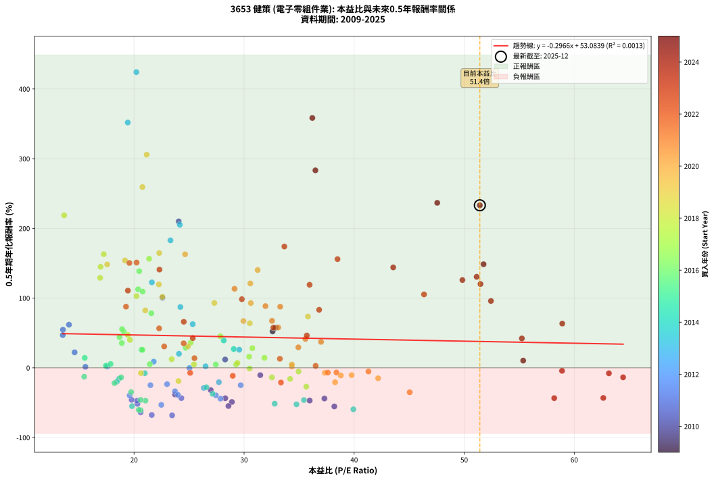
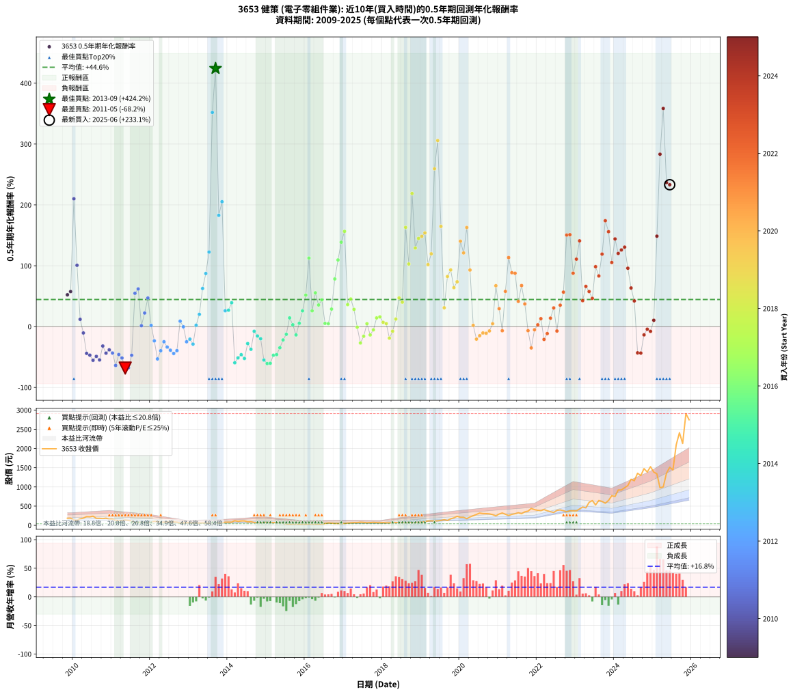

# 3653 健策 - 本益比與未來報酬率分析

!!! info "報告資訊"
    - **股票代號**: 3653
    - **公司名稱**: 健策
    - **產業別**: 電子零組件業
    - **分析期間**: 2009-2025 (188 個數據點)
    - **資料來源**: Type 12 (ShowMonthlyK_ChartFlow) 月收盤價與本益比
    - **報酬率口徑**: 含現金股利 (簡化: 年度合計，假設每年7/1入帳)
    - **報告生成時間**: 2026-01-22 23:28:53 CST

## 📈 視覺化圖表

### 圖表1: 本益比 vs 未來報酬率關係

*圖表1：3653 健策 本益比與0.5年期未來報酬率關係 (2009-2025)*

### 圖表2: 歷年買入時點的0.5年期實際報酬率

*圖表2：3653 健策 歷年買入時點的0.5年期實際報酬率 (2009-2025)*

## 📍 買點訊號說明

本報告提供兩種買點提示訊號（顯示於圖表2的股價子圖中）：

### ▲ 小綠色三角形（回測驗證）
- **計算方式**: 使用全部歷史資料計算本益比第25百分位數
- **用途**: 事後驗證，顯示歷史上哪些時點確實為低估區
- **限制**: 當下無法判斷，僅供回測參考
- **特性**: 後見之明（Look-Ahead Bias）

### ▲ 小橘色三角形（即時訊號）
- **計算方式**: 使用截至當月的過去5年資料計算本益比第25百分位數
- **用途**: 實際投資決策，當時即可判斷
- **優勢**: 可操作性強，符合實務需求
- **特性**: 無後見之明，滾動窗口計算

!!! tip "如何使用兩種訊號"
    - **綠色▲** 幫助理解歷史估值機會，驗證策略有效性
    - **橘色▲** 可作為實際買進參考，但仍需搭配基本面分析
    - 兩種訊號重疊時，表示即時判斷與事後驗證一致，信心度較高
    - 僅有綠色▲時，表示當時無法判斷（需要未來資料才能確認）
    - 僅有橘色▲時，表示即時判斷為買點，但事後可能不是最佳時機

## 📊 估值分析摘要

| 指標 | 數值 |
|:---:|:---:|
| **目前本益比** (2025-06) | **51.42 倍** |
| **歷史平均本益比** | 28.77 倍 |
| **估值水準** | 🔴 相對高估 |
| **預期0.5年年化報酬率** | **+37.83%** |
| **歷史平均報酬率** | +44.55% |
| **相關係數 (R²)** | 0.0013 |
| **趨勢線斜率** | -0.2966 |

!!! abstract "核心洞察"
    目前本益比顯著高於歷史平均，預期未來報酬率可能較低

    根據歷史數據回測，3653 健策 在目前本益比 **51.4倍** 的估值水準下，
    預期未來0.5年年化報酬率約為 **+37.8%**。

    **重要提醒**: 本分析基於歷史數據統計，實際報酬率會受到公司基本面變化、產業趨勢、
    總體經濟環境等多重因素影響。R² = 0.00 表示本益比可解釋約 0.1% 的報酬率變異。

## 📈 歷史估值統計

### 最佳買點 (最高報酬率)

| 項目 | 數值 |
|:---:|:---:|
| 起始時間 | 2013-09 |
| 當時本益比 | 20.21 倍 |
| 起始價格 | 52.8 元 |
| 0.5年後價格 | 120.0 元 |
| **0.5年年化報酬率** | **+424.20%** |

### 最差買點 (最低報酬率)

| 項目 | 數值 |
|:---:|:---:|
| 起始時間 | 2011-05 |
| 當時本益比 | 23.46 倍 |
| 起始價格 | 140.0 元 |
| 0.5年後價格 | 67.6 元 |
| **0.5年年化報酬率** | **-68.16%** |

## 🎯 投資啟示

### 本益比與報酬率關係

趨勢線方程式: **y = -0.2966x + 53.0839**

!!! note "負相關"
    本益比與未來報酬率呈現負相關。較低的本益比通常帶來較高的未來報酬率，
    但相關性不算非常強。**估值仍是重要參考指標之一**。

### 估值區間建議

基於歷史數據分析:

- **🟢 低估區** (P/E < 23.0): 預期報酬率較高，可考慮增加持股
- **🟡 合理區** (P/E 23.0-34.5): 預期報酬率符合長期趨勢，正常持有
- **🔴 高估區** (P/E > 34.5): 預期報酬率較低，可考慮減碼或觀望

!!! danger "風險提示"
    - 過去表現不代表未來結果
    - 本分析假設公司基本面無重大結構性變化
    - 產業環境劇變可能使歷史規律失效
    - 應結合公司財報、產業趨勢、總體經濟等多重因素綜合判斷

!!! success "長期投資觀點"
    歷史數據顯示，在合理或低估的估值水準買入並長期持有，
    往往能獲得較佳的投資報酬。**耐心等待好價格**是價值投資的核心原則。

## 📊 數據品質

- **資料來源**: GoodInfo.tw Type 12 (ShowMonthlyK_ChartFlow)
- **資料頻率**: 月度收盤價與本益比
- **回測期間**: 2009-2025
- **數據點數量**: 188 個 (每個點代表一次0.5年期回測)

### 計算方法說明

1. **0.5年期年化報酬率**:
   - 對每個歷史時點，計算其後0.5年的實際投資報酬率
   - 期末價值(不含股利): 期末價格
   - 期末價值(含現金股利): 期末價格 + 持有期間內的現金股利合計 (簡化: 年度合計，假設每年7/1入帳)
   - 公式: 年化報酬率 = [(期末價值/期初價格)^(1/年數) - 1] × 100%

2. **本益比 (P/E Ratio)**:
   - 使用當時的月收盤價與EPS計算
   - 資料來源: Type 12 月度河流圖本益比數據

3. **趨勢線 (Linear Regression)**:
   - 使用最小平方法擬合線性趨勢線
   - R²值衡量本益比對報酬率的解釋能力

---

*本報告由 Stock Analysis System v1.9.0 自動生成*
*數據更新時間: 2026-01-22 23:28:53 CST*

## 📋 月度回測明細表

（每一列對應時間線圖中的一個買入點；可用來對照 SVG 圖上的每個點。）

| 買入月份 | 賣出月份 | 回測期限_年 | 實際持有年數 | 買入本益比_倍 | 買入收盤價_元 | 賣出收盤價_元 | 現金股利合計_元 | 總報酬率_pct | 年化報酬率_pct |
| --- | --- | --- | --- | --- | --- | --- | --- | --- | --- |
| 2009-11 | 2010-05 | 0.5 | 0.496 | 32.59 | 183.50 | 226.00 | 0.00 | +23.16 | +52.25 |
| 2009-12 | 2010-07 | 0.5 | 0.580 | 32.86 | 185.00 | 238.00 | 2.88 | +30.21 | +57.58 |
| 2010-01 | 2010-07 | 0.5 | 0.496 | 24.06 | 137.50 | 238.00 | 2.88 | +75.19 | +210.02 |
| 2010-02 | 2010-08 | 0.5 | 0.498 | 22.58 | 131.00 | 182.50 | 2.88 | +41.52 | +100.74 |
| 2010-03 | 2010-10 | 0.5 | 0.586 | 28.28 | 166.50 | 175.00 | 2.88 | +6.84 | +11.95 |
| 2010-04 | 2010-10 | 0.5 | 0.501 | 31.47 | 188.00 | 175.00 | 2.88 | -5.38 | -10.45 |
| 2010-05 | 2010-12 | 0.5 | 0.586 | 37.30 | 226.00 | 158.00 | 2.88 | -28.81 | -44.01 |
| 2010-06 | 2010-12 | 0.5 | 0.501 | 35.96 | 221.00 | 158.00 | 2.88 | -27.20 | -46.93 |
| 2010-07 | 2011-01 | 0.5 | 0.504 | 38.20 | 238.00 | 158.50 | 0.00 | -33.40 | -55.38 |
| 2010-08 | 2011-03 | 0.5 | 0.580 | 28.89 | 182.50 | 123.50 | 0.00 | -32.33 | -48.97 |
| 2010-09 | 2011-03 | 0.5 | 0.496 | 28.58 | 183.00 | 123.50 | 0.00 | -32.51 | -54.78 |
| 2010-10 | 2011-05 | 0.5 | 0.580 | 26.97 | 175.00 | 140.00 | 0.00 | -20.00 | -31.92 |
| 2010-11 | 2011-05 | 0.5 | 0.496 | 28.29 | 186.00 | 140.00 | 0.00 | -24.73 | -43.63 |
| 2010-12 | 2011-07 | 0.5 | 0.580 | 23.72 | 158.00 | 115.50 | 4.00 | -24.37 | -38.19 |
| 2011-01 | 2011-07 | 0.5 | 0.496 | 24.30 | 158.50 | 115.50 | 4.00 | -24.61 | -43.44 |
| 2011-02 | 2011-08 | 0.5 | 0.498 | 20.60 | 131.50 | 75.20 | 4.00 | -39.77 | -63.85 |
| 2011-03 | 2011-10 | 0.5 | 0.586 | 19.78 | 123.50 | 82.20 | 4.00 | -30.20 | -45.87 |
| 2011-04 | 2011-10 | 0.5 | 0.501 | 20.31 | 124.00 | 82.20 | 4.00 | -30.48 | -51.60 |
| 2011-05 | 2011-12 | 0.5 | 0.586 | 23.46 | 140.00 | 67.60 | 4.00 | -48.86 | -68.16 |
| 2011-06 | 2011-12 | 0.5 | 0.501 | 21.61 | 126.00 | 67.60 | 4.00 | -43.17 | -67.63 |
| 2011-07 | 2012-01 | 0.5 | 0.504 | 20.29 | 115.50 | 83.80 | 0.00 | -27.45 | -47.11 |
| 2011-08 | 2012-03 | 0.5 | 0.583 | 13.54 | 75.20 | 97.00 | 0.00 | +28.99 | +54.73 |
| 2011-09 | 2012-03 | 0.5 | 0.498 | 14.09 | 76.30 | 97.00 | 0.00 | +27.13 | +61.89 |
| 2011-10 | 2012-05 | 0.5 | 0.583 | 15.58 | 82.20 | 82.90 | 0.00 | +0.85 | +1.46 |
| 2011-11 | 2012-05 | 0.5 | 0.498 | 14.60 | 75.00 | 82.90 | 0.00 | +10.53 | +22.26 |
| 2011-12 | 2012-07 | 0.5 | 0.583 | 13.52 | 67.60 | 81.60 | 3.02 | +25.17 | +46.96 |
| 2012-01 | 2012-07 | 0.5 | 0.498 | 17.56 | 83.80 | 81.60 | 3.02 | +0.97 | +1.96 |
| 2012-02 | 2012-08 | 0.5 | 0.501 | 23.00 | 104.50 | 88.40 | 3.02 | -12.52 | -23.43 |
| 2012-03 | 2012-10 | 0.5 | 0.586 | 22.48 | 97.00 | 59.20 | 3.02 | -35.86 | -53.14 |
| 2012-04 | 2012-10 | 0.5 | 0.501 | 19.60 | 80.10 | 59.20 | 3.02 | -22.33 | -39.61 |
| 2012-05 | 2012-12 | 0.5 | 0.586 | 21.49 | 82.90 | 67.10 | 3.02 | -15.42 | -24.86 |
| 2012-06 | 2012-12 | 0.5 | 0.501 | 23.72 | 86.10 | 67.10 | 3.02 | -18.57 | -33.63 |
| 2012-07 | 2013-01 | 0.5 | 0.504 | 23.99 | 81.60 | 63.70 | 0.00 | -21.94 | -38.83 |
| 2012-08 | 2013-03 | 0.5 | 0.580 | 27.86 | 88.40 | 63.00 | 0.00 | -28.73 | -44.21 |
| 2012-09 | 2013-03 | 0.5 | 0.496 | 27.44 | 80.80 | 63.00 | 0.00 | -22.03 | -39.48 |
| 2012-10 | 2013-05 | 0.5 | 0.580 | 21.79 | 59.20 | 62.20 | 0.00 | +5.07 | +8.89 |
| 2012-11 | 2013-05 | 0.5 | 0.496 | 25.04 | 62.30 | 62.20 | 0.00 | -0.16 | -0.32 |
| 2012-12 | 2013-07 | 0.5 | 0.580 | 29.69 | 67.10 | 54.80 | 2.01 | -15.34 | -24.94 |
| 2013-01 | 2013-07 | 0.5 | 0.496 | 27.71 | 63.70 | 54.80 | 2.01 | -10.82 | -20.63 |
| 2013-02 | 2013-08 | 0.5 | 0.498 | 26.34 | 61.60 | 50.00 | 2.01 | -15.57 | -28.80 |
| 2013-03 | 2013-10 | 0.5 | 0.586 | 26.50 | 63.00 | 61.80 | 2.01 | +1.28 | +2.20 |
| 2013-04 | 2013-10 | 0.5 | 0.501 | 24.08 | 58.20 | 61.80 | 2.01 | +9.64 | +20.16 |
| 2013-05 | 2013-12 | 0.5 | 0.586 | 25.33 | 62.20 | 80.70 | 2.01 | +32.97 | +62.64 |
| 2013-06 | 2013-12 | 0.5 | 0.501 | 24.21 | 60.40 | 80.70 | 2.01 | +36.94 | +87.27 |
| 2013-07 | 2014-01 | 0.5 | 0.504 | 21.62 | 54.80 | 82.00 | 0.00 | +49.64 | +122.56 |
| 2013-08 | 2014-03 | 0.5 | 0.580 | 19.43 | 50.00 | 120.00 | 0.00 | +140.00 | +351.92 |
| 2013-09 | 2014-03 | 0.5 | 0.496 | 20.21 | 52.80 | 120.00 | 0.00 | +127.27 | +424.20 |
| 2013-10 | 2014-05 | 0.5 | 0.580 | 23.31 | 61.80 | 113.00 | 0.00 | +82.85 | +182.85 |
| 2013-11 | 2014-05 | 0.5 | 0.496 | 24.16 | 65.00 | 113.00 | 0.00 | +73.85 | +205.24 |
| 2013-12 | 2014-07 | 0.5 | 0.580 | 29.56 | 80.70 | 89.60 | 2.70 | +14.37 | +26.04 |
| 2014-01 | 2014-07 | 0.5 | 0.496 | 29.06 | 82.00 | 89.60 | 2.70 | +12.56 | +26.97 |
| 2014-02 | 2014-08 | 0.5 | 0.498 | 28.15 | 82.00 | 94.00 | 2.70 | +17.93 | +39.22 |
| 2014-03 | 2014-10 | 0.5 | 0.586 | 39.93 | 120.00 | 68.00 | 2.70 | -41.08 | -59.46 |
| 2014-04 | 2014-10 | 0.5 | 0.501 | 32.78 | 101.50 | 68.00 | 2.70 | -30.34 | -51.41 |
| 2014-05 | 2014-12 | 0.5 | 0.586 | 35.44 | 113.00 | 75.90 | 2.70 | -30.44 | -46.18 |
| 2014-06 | 2014-12 | 0.5 | 0.501 | 34.76 | 114.00 | 75.90 | 2.70 | -31.05 | -52.39 |
| 2014-07 | 2015-01 | 0.5 | 0.504 | 26.57 | 89.60 | 76.00 | 0.00 | -15.18 | -27.88 |
| 2014-08 | 2015-03 | 0.5 | 0.580 | 27.14 | 94.00 | 71.70 | 0.00 | -23.72 | -37.28 |
| 2014-09 | 2015-03 | 0.5 | 0.496 | 20.98 | 74.60 | 71.70 | 0.00 | -3.89 | -7.69 |
| 2014-10 | 2015-05 | 0.5 | 0.580 | 18.65 | 68.00 | 61.70 | 0.00 | -9.26 | -15.42 |
| 2014-11 | 2015-05 | 0.5 | 0.496 | 18.43 | 68.90 | 61.70 | 0.00 | -10.45 | -19.97 |
| 2014-12 | 2015-07 | 0.5 | 0.580 | 19.82 | 75.90 | 44.00 | 3.80 | -37.02 | -54.92 |
| 2015-01 | 2015-07 | 0.5 | 0.496 | 20.60 | 76.00 | 44.00 | 3.80 | -37.11 | -60.77 |
| 2015-02 | 2015-08 | 0.5 | 0.498 | 20.43 | 72.50 | 41.95 | 3.80 | -36.90 | -60.31 |
| 2015-03 | 2015-10 | 0.5 | 0.586 | 21.04 | 71.70 | 45.60 | 3.80 | -31.10 | -47.05 |
| 2015-04 | 2015-10 | 0.5 | 0.501 | 20.60 | 67.30 | 45.60 | 3.80 | -26.60 | -46.05 |
| 2015-05 | 2015-12 | 0.5 | 0.586 | 19.74 | 61.70 | 44.25 | 3.80 | -22.12 | -34.74 |
| 2015-06 | 2015-12 | 0.5 | 0.501 | 18.22 | 54.40 | 44.25 | 3.80 | -11.67 | -21.94 |
| 2015-07 | 2016-01 | 0.5 | 0.504 | 15.47 | 44.00 | 41.10 | 0.00 | -6.59 | -12.66 |
| 2015-08 | 2016-03 | 0.5 | 0.583 | 15.52 | 41.95 | 45.35 | 0.00 | +8.10 | +14.30 |
| 2015-09 | 2016-03 | 0.5 | 0.498 | 17.44 | 44.70 | 45.35 | 0.00 | +1.45 | +2.94 |
| 2015-10 | 2016-05 | 0.5 | 0.583 | 18.83 | 45.60 | 41.85 | 0.00 | -8.22 | -13.68 |
| 2015-11 | 2016-05 | 0.5 | 0.498 | 17.87 | 40.75 | 41.85 | 0.00 | +2.70 | +5.49 |
| 2015-12 | 2016-07 | 0.5 | 0.583 | 20.68 | 44.25 | 48.10 | 2.50 | +14.35 | +25.85 |
| 2016-01 | 2016-07 | 0.5 | 0.498 | 19.07 | 41.10 | 48.10 | 2.50 | +23.11 | +51.79 |
| 2016-02 | 2016-08 | 0.5 | 0.501 | 20.37 | 44.20 | 62.00 | 2.50 | +45.93 | +112.62 |
| 2016-03 | 2016-10 | 0.5 | 0.586 | 20.76 | 45.35 | 49.40 | 2.50 | +14.44 | +25.89 |
| 2016-04 | 2016-10 | 0.5 | 0.501 | 18.91 | 41.60 | 49.40 | 2.50 | +24.76 | +55.51 |
| 2016-05 | 2016-12 | 0.5 | 0.586 | 18.89 | 41.85 | 47.50 | 2.50 | +19.47 | +35.48 |
| 2016-06 | 2016-12 | 0.5 | 0.501 | 18.68 | 41.65 | 47.50 | 2.50 | +20.05 | +44.01 |
| 2016-07 | 2017-01 | 0.5 | 0.504 | 21.43 | 48.10 | 49.35 | 0.00 | +2.60 | +5.22 |
| 2016-08 | 2017-03 | 0.5 | 0.580 | 27.43 | 62.00 | 63.70 | 0.00 | +2.74 | +4.77 |
| 2016-09 | 2017-03 | 0.5 | 0.496 | 24.70 | 56.20 | 63.70 | 0.00 | +13.35 | +28.76 |
| 2016-10 | 2017-05 | 0.5 | 0.580 | 21.57 | 49.40 | 69.10 | 0.00 | +39.88 | +78.28 |
| 2016-11 | 2017-05 | 0.5 | 0.496 | 20.78 | 47.90 | 69.10 | 0.00 | +44.26 | +109.48 |
| 2016-12 | 2017-07 | 0.5 | 0.580 | 20.47 | 47.50 | 76.70 | 2.00 | +65.68 | +138.67 |
| 2017-01 | 2017-07 | 0.5 | 0.496 | 21.37 | 49.35 | 76.70 | 2.00 | +59.47 | +156.46 |
| 2017-02 | 2017-08 | 0.5 | 0.498 | 25.15 | 57.80 | 65.40 | 2.00 | +16.61 | +36.12 |
| 2017-03 | 2017-10 | 0.5 | 0.586 | 27.85 | 63.70 | 77.30 | 2.00 | +24.49 | +45.34 |
| 2017-04 | 2017-10 | 0.5 | 0.501 | 30.75 | 70.00 | 77.30 | 2.00 | +13.29 | +28.27 |
| 2017-05 | 2017-12 | 0.5 | 0.586 | 30.50 | 69.10 | 66.70 | 2.00 | -0.58 | -0.99 |
| 2017-06 | 2017-12 | 0.5 | 0.501 | 35.65 | 80.40 | 66.70 | 2.00 | -14.55 | -26.94 |
| 2017-07 | 2018-01 | 0.5 | 0.504 | 34.18 | 76.70 | 70.30 | 0.00 | -8.34 | -15.88 |
| 2017-08 | 2018-03 | 0.5 | 0.580 | 29.28 | 65.40 | 67.20 | 0.00 | +2.75 | +4.79 |
| 2017-09 | 2018-03 | 0.5 | 0.496 | 32.53 | 72.30 | 67.20 | 0.00 | -7.05 | -13.72 |
| 2017-10 | 2018-05 | 0.5 | 0.580 | 34.95 | 77.30 | 74.90 | 0.00 | -3.10 | -5.29 |
| 2017-11 | 2018-05 | 0.5 | 0.496 | 31.85 | 70.10 | 74.90 | 0.00 | +6.85 | +14.30 |
| 2017-12 | 2018-07 | 0.5 | 0.580 | 30.46 | 66.70 | 70.70 | 2.00 | +9.00 | +16.00 |
| 2018-01 | 2018-07 | 0.5 | 0.496 | 29.39 | 70.30 | 70.70 | 2.00 | +3.41 | +7.01 |
| 2018-02 | 2018-08 | 0.5 | 0.498 | 25.45 | 66.00 | 65.60 | 2.00 | +2.42 | +4.92 |
| 2018-03 | 2018-10 | 0.5 | 0.586 | 24.04 | 67.20 | 57.40 | 2.00 | -11.61 | -18.99 |
| 2018-04 | 2018-10 | 0.5 | 0.501 | 20.62 | 61.80 | 57.40 | 2.00 | -3.88 | -7.60 |
| 2018-05 | 2018-12 | 0.5 | 0.586 | 23.42 | 74.90 | 78.20 | 2.00 | +7.08 | +12.38 |
| 2018-06 | 2018-12 | 0.5 | 0.501 | 19.44 | 66.10 | 78.20 | 2.00 | +21.33 | +47.10 |
| 2018-07 | 2019-01 | 0.5 | 0.504 | 19.63 | 70.70 | 83.80 | 0.00 | +18.53 | +40.13 |
| 2018-08 | 2019-03 | 0.5 | 0.580 | 17.25 | 65.60 | 115.00 | 0.00 | +75.30 | +163.04 |
| 2018-09 | 2019-03 | 0.5 | 0.496 | 20.22 | 81.00 | 115.00 | 0.00 | +41.98 | +102.84 |
| 2018-10 | 2019-05 | 0.5 | 0.580 | 13.65 | 57.40 | 112.50 | 0.00 | +95.99 | +218.78 |
| 2018-11 | 2019-05 | 0.5 | 0.496 | 16.92 | 74.60 | 112.50 | 0.00 | +50.80 | +129.10 |
| 2018-12 | 2019-07 | 0.5 | 0.580 | 16.96 | 78.20 | 128.00 | 3.53 | +68.19 | +144.93 |
| 2019-01 | 2019-07 | 0.5 | 0.496 | 17.56 | 83.80 | 128.00 | 3.53 | +56.95 | +148.35 |
| 2019-02 | 2019-08 | 0.5 | 0.498 | 19.18 | 94.60 | 147.00 | 3.53 | +59.12 | +154.00 |
| 2019-03 | 2019-10 | 0.5 | 0.586 | 22.57 | 115.00 | 170.00 | 3.53 | +50.89 | +101.81 |
| 2019-04 | 2019-10 | 0.5 | 0.501 | 22.26 | 117.00 | 170.00 | 3.53 | +48.31 | +119.62 |
| 2019-05 | 2019-12 | 0.5 | 0.586 | 20.76 | 112.50 | 234.50 | 3.53 | +111.58 | +259.35 |
| 2019-06 | 2019-12 | 0.5 | 0.501 | 21.15 | 118.00 | 234.50 | 3.53 | +101.72 | +305.74 |
| 2019-07 | 2020-01 | 0.5 | 0.504 | 22.29 | 128.00 | 209.00 | 0.00 | +63.28 | +164.66 |
| 2019-08 | 2020-03 | 0.5 | 0.583 | 24.90 | 147.00 | 172.00 | 0.00 | +17.01 | +30.91 |
| 2019-09 | 2020-03 | 0.5 | 0.498 | 21.02 | 127.50 | 172.00 | 0.00 | +34.90 | +82.36 |
| 2019-10 | 2020-05 | 0.5 | 0.583 | 27.30 | 170.00 | 249.50 | 0.00 | +46.76 | +93.07 |
| 2019-11 | 2020-05 | 0.5 | 0.498 | 30.52 | 195.00 | 249.50 | 0.00 | +27.95 | +63.99 |
| 2019-12 | 2020-07 | 0.5 | 0.583 | 35.80 | 234.50 | 318.50 | 5.00 | +37.95 | +73.62 |
| 2020-01 | 2020-07 | 0.5 | 0.498 | 31.23 | 209.00 | 318.50 | 5.00 | +54.78 | +140.30 |
| 2020-02 | 2020-08 | 0.5 | 0.501 | 30.57 | 209.00 | 306.00 | 5.00 | +48.80 | +121.07 |
| 2020-03 | 2020-10 | 0.5 | 0.586 | 24.64 | 172.00 | 298.00 | 5.00 | +76.16 | +162.86 |
| 2020-04 | 2020-10 | 0.5 | 0.501 | 30.61 | 218.00 | 298.00 | 5.00 | +38.99 | +92.92 |
| 2020-05 | 2020-12 | 0.5 | 0.586 | 34.34 | 249.50 | 247.50 | 5.00 | +1.20 | +2.06 |
| 2020-06 | 2020-12 | 0.5 | 0.501 | 38.27 | 283.50 | 247.50 | 5.00 | -10.93 | -20.64 |
| 2020-07 | 2021-01 | 0.5 | 0.504 | 42.18 | 318.50 | 293.50 | 0.00 | -7.85 | -14.98 |
| 2020-08 | 2021-03 | 0.5 | 0.580 | 39.77 | 306.00 | 287.00 | 0.00 | -6.21 | -10.46 |
| 2020-09 | 2021-03 | 0.5 | 0.496 | 38.79 | 304.00 | 287.00 | 0.00 | -5.59 | -10.96 |
| 2020-10 | 2021-05 | 0.5 | 0.580 | 37.34 | 298.00 | 285.50 | 0.00 | -4.19 | -7.12 |
| 2020-11 | 2021-05 | 0.5 | 0.496 | 34.34 | 279.00 | 285.50 | 0.00 | +2.33 | +4.76 |
| 2020-12 | 2021-07 | 0.5 | 0.580 | 29.94 | 247.50 | 327.50 | 6.00 | +34.75 | +67.17 |
| 2021-01 | 2021-07 | 0.5 | 0.496 | 34.93 | 293.50 | 327.50 | 6.00 | +13.63 | +29.41 |
| 2021-02 | 2021-08 | 0.5 | 0.498 | 37.61 | 321.00 | 304.00 | 6.00 | -3.43 | -6.76 |
| 2021-03 | 2021-10 | 0.5 | 0.586 | 33.10 | 287.00 | 369.00 | 6.00 | +30.66 | +57.85 |
| 2021-04 | 2021-10 | 0.5 | 0.501 | 29.13 | 256.50 | 369.00 | 6.00 | +46.20 | +113.41 |
| 2021-05 | 2021-12 | 0.5 | 0.586 | 31.94 | 285.50 | 408.00 | 6.00 | +45.01 | +88.57 |
| 2021-06 | 2021-12 | 0.5 | 0.501 | 33.28 | 302.00 | 408.00 | 6.00 | +37.09 | +87.68 |
| 2021-07 | 2022-01 | 0.5 | 0.504 | 35.57 | 327.50 | 390.00 | 0.00 | +19.08 | +41.44 |
| 2021-08 | 2022-03 | 0.5 | 0.580 | 32.54 | 304.00 | 410.00 | 0.00 | +34.87 | +67.42 |
| 2021-09 | 2022-03 | 0.5 | 0.496 | 36.99 | 350.50 | 410.00 | 0.00 | +16.98 | +37.22 |
| 2021-10 | 2022-05 | 0.5 | 0.580 | 38.39 | 369.00 | 354.50 | 0.00 | -3.93 | -6.67 |
| 2021-11 | 2022-05 | 0.5 | 0.496 | 45.05 | 439.00 | 354.50 | 0.00 | -19.25 | -35.04 |
| 2021-12 | 2022-07 | 0.5 | 0.580 | 41.30 | 408.00 | 389.50 | 6.00 | -3.06 | -5.22 |
| 2022-01 | 2022-07 | 0.5 | 0.496 | 36.50 | 390.00 | 389.50 | 6.00 | +1.41 | +2.86 |
| 2022-02 | 2022-08 | 0.5 | 0.498 | 33.25 | 382.00 | 400.00 | 6.00 | +6.28 | +13.01 |
| 2022-03 | 2022-10 | 0.5 | 0.586 | 33.35 | 410.00 | 351.00 | 6.00 | -12.93 | -21.04 |
| 2022-04 | 2022-10 | 0.5 | 0.501 | 28.97 | 379.50 | 351.00 | 6.00 | -5.93 | -11.49 |
| 2022-05 | 2022-12 | 0.5 | 0.586 | 25.49 | 354.50 | 376.50 | 6.00 | +7.90 | +13.85 |
| 2022-06 | 2022-12 | 0.5 | 0.501 | 22.74 | 334.50 | 376.50 | 6.00 | +14.35 | +30.68 |
| 2022-07 | 2023-01 | 0.5 | 0.504 | 25.10 | 389.50 | 375.00 | 0.00 | -3.72 | -7.25 |
| 2022-08 | 2023-03 | 0.5 | 0.580 | 24.51 | 400.00 | 476.50 | 0.00 | +19.12 | +35.19 |
| 2022-09 | 2023-03 | 0.5 | 0.496 | 22.28 | 381.50 | 476.50 | 0.00 | +24.90 | +56.63 |
| 2022-10 | 2023-05 | 0.5 | 0.580 | 19.58 | 351.00 | 598.00 | 0.00 | +70.37 | +150.42 |
| 2022-11 | 2023-05 | 0.5 | 0.496 | 20.23 | 379.00 | 598.00 | 0.00 | +57.78 | +151.00 |
| 2022-12 | 2023-07 | 0.5 | 0.580 | 19.27 | 376.50 | 531.00 | 11.66 | +44.13 | +87.73 |
| 2023-01 | 2023-07 | 0.5 | 0.496 | 19.44 | 375.00 | 531.00 | 11.66 | +44.71 | +110.80 |
| 2023-02 | 2023-08 | 0.5 | 0.498 | 22.31 | 425.00 | 647.00 | 11.66 | +54.98 | +140.91 |
| 2023-03 | 2023-10 | 0.5 | 0.586 | 25.34 | 476.50 | 575.00 | 11.66 | +23.12 | +42.61 |
| 2023-04 | 2023-10 | 0.5 | 0.501 | 24.52 | 455.00 | 575.00 | 11.66 | +28.94 | +66.07 |
| 2023-05 | 2023-12 | 0.5 | 0.586 | 32.66 | 598.00 | 769.00 | 11.66 | +30.55 | +57.61 |
| 2023-06 | 2023-12 | 0.5 | 0.501 | 35.70 | 645.00 | 769.00 | 11.66 | +21.03 | +46.37 |
| 2023-07 | 2024-01 | 0.5 | 0.504 | 29.80 | 531.00 | 750.00 | 0.00 | +41.24 | +98.47 |
| 2023-08 | 2024-03 | 0.5 | 0.583 | 36.82 | 647.00 | 921.00 | 0.00 | +42.35 | +83.22 |
| 2023-09 | 2024-03 | 0.5 | 0.498 | 35.95 | 623.00 | 921.00 | 0.00 | +47.83 | +119.13 |
| 2023-10 | 2024-05 | 0.5 | 0.583 | 33.66 | 575.00 | 1035.00 | 0.00 | +80.00 | +173.99 |
| 2023-11 | 2024-05 | 0.5 | 0.498 | 38.49 | 648.00 | 1035.00 | 0.00 | +59.72 | +155.93 |
| 2023-12 | 2024-07 | 0.5 | 0.583 | 46.35 | 769.00 | 1160.00 | 9.86 | +52.13 | +105.33 |
| 2024-01 | 2024-07 | 0.5 | 0.498 | 43.55 | 750.00 | 1160.00 | 9.86 | +55.98 | +144.04 |
| 2024-02 | 2024-08 | 0.5 | 0.501 | 51.48 | 919.00 | 1355.00 | 9.86 | +48.52 | +120.21 |
| 2024-03 | 2024-10 | 0.5 | 0.586 | 49.84 | 921.00 | 1475.00 | 9.86 | +61.22 | +125.96 |
| 2024-04 | 2024-10 | 0.5 | 0.501 | 51.13 | 977.00 | 1475.00 | 9.86 | +51.98 | +130.59 |
| 2024-05 | 2024-12 | 0.5 | 0.586 | 52.43 | 1035.00 | 1525.00 | 9.86 | +48.30 | +95.92 |
| 2024-06 | 2024-12 | 0.5 | 0.501 | 58.91 | 1200.00 | 1525.00 | 9.86 | +27.90 | +63.43 |
| 2024-07 | 2025-01 | 0.5 | 0.504 | 55.24 | 1160.00 | 1385.00 | 0.00 | +19.40 | +42.18 |
| 2024-08 | 2025-03 | 0.5 | 0.580 | 62.64 | 1355.00 | 976.00 | 0.00 | -27.97 | -43.18 |
| 2024-09 | 2025-03 | 0.5 | 0.496 | 58.18 | 1295.00 | 976.00 | 0.00 | -24.63 | -43.49 |
| 2024-10 | 2025-05 | 0.5 | 0.580 | 64.44 | 1475.00 | 1355.00 | 0.00 | -8.14 | -13.60 |
| 2024-11 | 2025-05 | 0.5 | 0.496 | 58.89 | 1385.00 | 1355.00 | 0.00 | -2.17 | -4.32 |
| 2024-12 | 2025-07 | 0.5 | 0.580 | 63.15 | 1525.00 | 1440.00 | 14.50 | -4.62 | -7.83 |
| 2025-01 | 2025-07 | 0.5 | 0.496 | 55.36 | 1385.00 | 1440.00 | 14.50 | +5.02 | +10.38 |
| 2025-02 | 2025-08 | 0.5 | 0.498 | 51.76 | 1340.00 | 2095.00 | 14.50 | +57.43 | +148.60 |
| 2025-03 | 2025-10 | 0.5 | 0.586 | 36.48 | 976.00 | 2130.00 | 14.50 | +119.72 | +283.27 |
| 2025-04 | 2025-10 | 0.5 | 0.501 | 36.20 | 1000.00 | 2130.00 | 14.50 | +114.45 | +358.45 |
| 2025-05 | 2025-12 | 0.5 | 0.586 | 47.55 | 1355.00 | 2745.00 | 14.50 | +103.65 | +236.67 |
| 2025-06 | 2025-12 | 0.5 | 0.501 | 51.42 | 1510.00 | 2745.00 | 14.50 | +82.75 | +233.15 |
