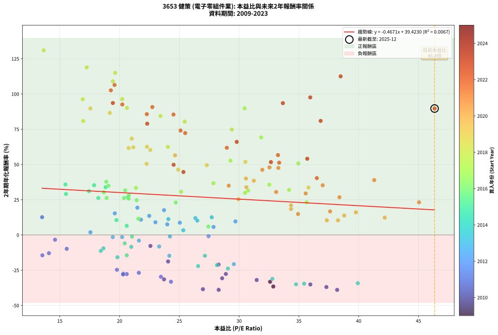
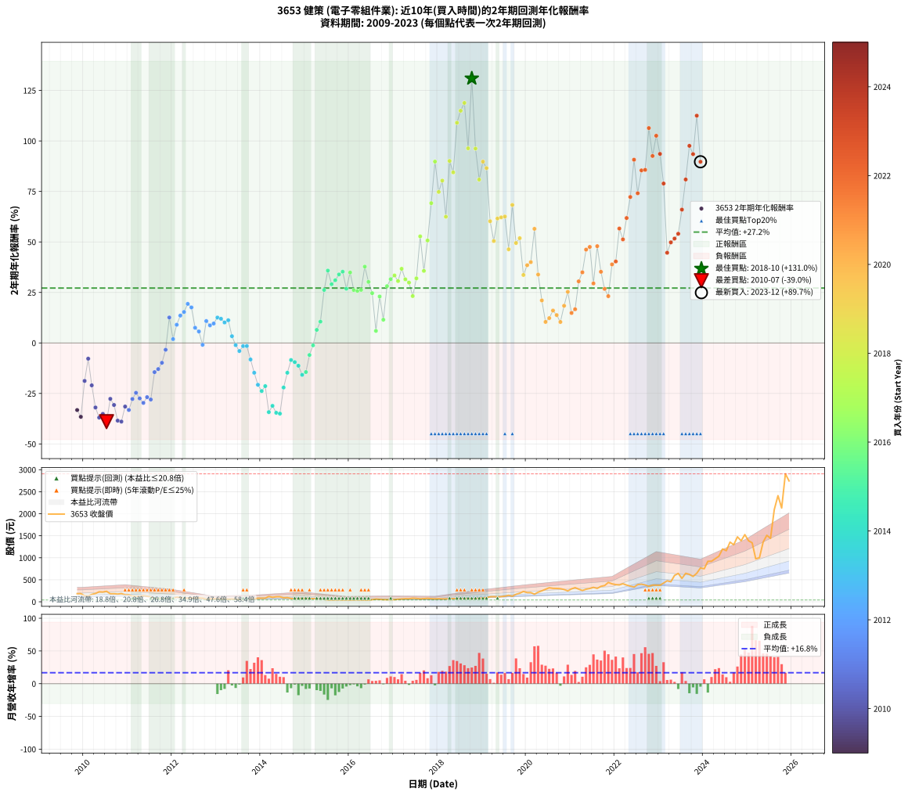

# 3653 健策 - 本益比與未來報酬率分析

!!! info "報告資訊"
    - **股票代號**: 3653
    - **公司名稱**: 健策
    - **產業別**: 電子零組件業
    - **分析期間**: 2009-2023 (170 個數據點)
    - **資料來源**: Type 12 (ShowMonthlyK_ChartFlow) 月收盤價與本益比
    - **報酬率口徑**: 含現金股利 (簡化: 年度合計，假設每年7/1入帳)
    - **報告生成時間**: 2026-01-06 18:56:56 CST

## 📈 視覺化圖表

### 圖表1: 本益比 vs 未來報酬率關係

*圖表1：3653 健策 本益比與2年期未來報酬率關係 (2009-2023)*

### 圖表2: 歷年買入時點的2年期實際報酬率

*圖表2：3653 健策 歷年買入時點的2年期實際報酬率 (2009-2023)*

## 📍 買點訊號說明

本報告提供兩種買點提示訊號（顯示於圖表2的股價子圖中）：

### ▲ 小綠色三角形（回測驗證）
- **計算方式**: 使用全部歷史資料計算本益比第25百分位數
- **用途**: 事後驗證，顯示歷史上哪些時點確實為低估區
- **限制**: 當下無法判斷，僅供回測參考
- **特性**: 後見之明（Look-Ahead Bias）

### ▲ 小橘色三角形（即時訊號）
- **計算方式**: 使用截至當月的過去5年資料計算本益比第25百分位數
- **用途**: 實際投資決策，當時即可判斷
- **優勢**: 可操作性強，符合實務需求
- **特性**: 無後見之明，滾動窗口計算

!!! tip "如何使用兩種訊號"
    - **綠色▲** 幫助理解歷史估值機會，驗證策略有效性
    - **橘色▲** 可作為實際買進參考，但仍需搭配基本面分析
    - 兩種訊號重疊時，表示即時判斷與事後驗證一致，信心度較高
    - 僅有綠色▲時，表示當時無法判斷（需要未來資料才能確認）
    - 僅有橘色▲時，表示即時判斷為買點，但事後可能不是最佳時機

## 📊 估值分析摘要

| 指標 | 數值 |
|:---:|:---:|
| **目前本益比** (2023-12) | **46.35 倍** |
| **歷史平均本益比** | 26.23 倍 |
| **估值水準** | 🔴 相對高估 |
| **預期2年年化報酬率** | **+17.77%** |
| **歷史平均報酬率** | +27.17% |
| **相關係數 (R²)** | 0.0067 |
| **趨勢線斜率** | -0.4671 |

!!! abstract "核心洞察"
    目前本益比顯著高於歷史平均，預期未來報酬率可能較低

    根據歷史數據回測，3653 健策 在目前本益比 **46.4倍** 的估值水準下，
    預期未來2年年化報酬率約為 **+17.8%**。

    **重要提醒**: 本分析基於歷史數據統計，實際報酬率會受到公司基本面變化、產業趨勢、
    總體經濟環境等多重因素影響。R² = 0.01 表示本益比可解釋約 0.7% 的報酬率變異。

## 📈 歷史估值統計

### 最佳買點 (最高報酬率)

| 項目 | 數值 |
|:---:|:---:|
| 起始時間 | 2018-10 |
| 當時本益比 | 13.65 倍 |
| 起始價格 | 57.4 元 |
| 2年後價格 | 298.0 元 |
| **2年年化報酬率** | **+130.96%** |

### 最差買點 (最低報酬率)

| 項目 | 數值 |
|:---:|:---:|
| 起始時間 | 2010-07 |
| 當時本益比 | 38.20 倍 |
| 起始價格 | 238.0 元 |
| 2年後價格 | 81.6 元 |
| **2年年化報酬率** | **-38.96%** |

## 🎯 投資啟示

### 本益比與報酬率關係

趨勢線方程式: **y = -0.4671x + 39.4230**

!!! note "負相關"
    本益比與未來報酬率呈現負相關。較低的本益比通常帶來較高的未來報酬率，
    但相關性不算非常強。**估值仍是重要參考指標之一**。

### 估值區間建議

基於歷史數據分析:

- **🟢 低估區** (P/E < 21.0): 預期報酬率較高，可考慮增加持股
- **🟡 合理區** (P/E 21.0-31.5): 預期報酬率符合長期趨勢，正常持有
- **🔴 高估區** (P/E > 31.5): 預期報酬率較低，可考慮減碼或觀望

!!! danger "風險提示"
    - 過去表現不代表未來結果
    - 本分析假設公司基本面無重大結構性變化
    - 產業環境劇變可能使歷史規律失效
    - 應結合公司財報、產業趨勢、總體經濟等多重因素綜合判斷

!!! success "長期投資觀點"
    歷史數據顯示，在合理或低估的估值水準買入並長期持有，
    往往能獲得較佳的投資報酬。**耐心等待好價格**是價值投資的核心原則。

## 📊 數據品質

- **資料來源**: GoodInfo.tw Type 12 (ShowMonthlyK_ChartFlow)
- **資料頻率**: 月度收盤價與本益比
- **回測期間**: 2009-2023
- **數據點數量**: 170 個 (每個點代表一次2年期回測)

### 計算方法說明

1. **2年期年化報酬率**:
   - 對每個歷史時點，計算其後2年的實際投資報酬率
   - 期末價值(不含股利): 期末價格
   - 期末價值(含現金股利): 期末價格 + 持有期間內的現金股利合計 (簡化: 年度合計，假設每年7/1入帳)
   - 公式: 年化報酬率 = [(期末價值/期初價格)^(1/年數) - 1] × 100%

2. **本益比 (P/E Ratio)**:
   - 使用當時的月收盤價與EPS計算
   - 資料來源: Type 12 月度河流圖本益比數據

3. **趨勢線 (Linear Regression)**:
   - 使用最小平方法擬合線性趨勢線
   - R²值衡量本益比對報酬率的解釋能力

---

*本報告由 Stock Analysis System v1.9.0 自動生成*
*數據更新時間: 2026-01-06 18:56:56 CST*

## 📋 月度回測明細表

（每一列對應時間線圖中的一個買入點；可用來對照 SVG 圖上的每個點。）

| 買入月份 | 賣出月份 | 回測期限_年 | 實際持有年數 | 買入本益比_倍 | 買入收盤價_元 | 賣出收盤價_元 | 現金股利合計_元 | 總報酬率_pct | 年化報酬率_pct |
| --- | --- | --- | --- | --- | --- | --- | --- | --- | --- |
| 2009-11 | 2011-11 | 2 | 1.999 | 32.59 | 183.50 | 75.00 | 6.88 | -55.38 | -33.22 |
| 2009-12 | 2011-12 | 2 | 1.999 | 32.86 | 185.00 | 67.60 | 6.88 | -59.74 | -36.57 |
| 2010-01 | 2012-01 | 2 | 1.999 | 24.06 | 137.50 | 83.80 | 6.88 | -34.05 | -18.80 |
| 2010-02 | 2012-02 | 2 | 1.999 | 22.58 | 131.00 | 104.50 | 6.88 | -14.97 | -7.80 |
| 2010-03 | 2012-03 | 2 | 2.001 | 28.28 | 166.50 | 97.00 | 6.88 | -37.61 | -21.00 |
| 2010-04 | 2012-04 | 2 | 2.001 | 31.47 | 188.00 | 80.10 | 6.88 | -53.73 | -31.96 |
| 2010-05 | 2012-05 | 2 | 2.001 | 37.30 | 226.00 | 82.90 | 6.88 | -60.27 | -36.95 |
| 2010-06 | 2012-06 | 2 | 2.001 | 35.96 | 221.00 | 86.10 | 6.88 | -57.93 | -35.12 |
| 2010-07 | 2012-07 | 2 | 2.001 | 38.20 | 238.00 | 81.60 | 7.02 | -62.77 | -38.96 |
| 2010-08 | 2012-08 | 2 | 2.001 | 28.89 | 182.50 | 88.40 | 7.02 | -47.72 | -27.68 |
| 2010-09 | 2012-09 | 2 | 2.001 | 28.58 | 183.00 | 80.80 | 7.02 | -52.01 | -30.71 |
| 2010-10 | 2012-10 | 2 | 2.001 | 26.97 | 175.00 | 59.20 | 7.02 | -62.16 | -38.47 |
| 2010-11 | 2012-11 | 2 | 2.001 | 28.29 | 186.00 | 62.30 | 7.02 | -62.73 | -38.93 |
| 2010-12 | 2012-12 | 2 | 2.001 | 23.72 | 158.00 | 67.10 | 7.02 | -53.09 | -31.49 |
| 2011-01 | 2013-01 | 2 | 2.001 | 24.30 | 158.50 | 63.70 | 7.02 | -55.38 | -33.19 |
| 2011-02 | 2013-02 | 2 | 2.001 | 20.60 | 131.50 | 61.60 | 7.02 | -47.82 | -27.75 |
| 2011-03 | 2013-03 | 2 | 2.001 | 19.78 | 123.50 | 63.00 | 7.02 | -43.31 | -24.69 |
| 2011-04 | 2013-04 | 2 | 2.001 | 20.31 | 124.00 | 58.20 | 7.02 | -47.41 | -27.46 |
| 2011-05 | 2013-05 | 2 | 2.001 | 23.46 | 140.00 | 62.20 | 7.02 | -50.56 | -29.67 |
| 2011-06 | 2013-06 | 2 | 2.001 | 21.61 | 126.00 | 60.40 | 7.02 | -46.50 | -26.84 |
| 2011-07 | 2013-07 | 2 | 2.001 | 20.29 | 115.50 | 54.80 | 5.02 | -48.20 | -28.01 |
| 2011-08 | 2013-08 | 2 | 2.001 | 13.54 | 75.20 | 50.00 | 5.02 | -26.83 | -14.45 |
| 2011-09 | 2013-09 | 2 | 2.001 | 14.09 | 76.30 | 52.80 | 5.02 | -24.21 | -12.94 |
| 2011-10 | 2013-10 | 2 | 2.001 | 15.58 | 82.20 | 61.80 | 5.02 | -18.71 | -9.83 |
| 2011-11 | 2013-11 | 2 | 2.001 | 14.60 | 75.00 | 65.00 | 5.02 | -6.63 | -3.37 |
| 2011-12 | 2013-12 | 2 | 2.001 | 13.52 | 67.60 | 80.70 | 5.02 | +26.81 | +12.60 |
| 2012-01 | 2014-01 | 2 | 2.001 | 17.56 | 83.80 | 82.00 | 5.02 | +3.85 | +1.90 |
| 2012-02 | 2014-03 | 2 | 2.081 | 23.00 | 104.50 | 120.00 | 5.02 | +19.64 | +9.00 |
| 2012-03 | 2014-03 | 2 | 1.999 | 22.48 | 97.00 | 120.00 | 5.02 | +28.89 | +13.54 |
| 2012-04 | 2014-04 | 2 | 1.999 | 19.60 | 80.10 | 101.50 | 5.02 | +32.99 | +15.33 |
| 2012-05 | 2014-05 | 2 | 1.999 | 21.49 | 82.90 | 113.00 | 5.02 | +42.37 | +19.33 |
| 2012-06 | 2014-06 | 2 | 1.999 | 23.72 | 86.10 | 114.00 | 5.02 | +38.24 | +17.59 |
| 2012-07 | 2014-07 | 2 | 1.999 | 23.99 | 81.60 | 89.60 | 4.71 | +15.57 | +7.51 |
| 2012-08 | 2014-08 | 2 | 1.999 | 27.86 | 88.40 | 94.00 | 4.71 | +11.66 | +5.67 |
| 2012-09 | 2014-09 | 2 | 1.999 | 27.44 | 80.80 | 74.60 | 4.71 | -1.85 | -0.93 |
| 2012-10 | 2014-10 | 2 | 1.999 | 21.79 | 59.20 | 68.00 | 4.71 | +22.82 | +10.83 |
| 2012-11 | 2014-11 | 2 | 1.999 | 25.04 | 62.30 | 68.90 | 4.71 | +18.15 | +8.70 |
| 2012-12 | 2014-12 | 2 | 1.999 | 29.69 | 67.10 | 75.90 | 4.71 | +20.13 | +9.61 |
| 2013-01 | 2015-01 | 2 | 1.999 | 27.71 | 63.70 | 76.00 | 4.71 | +26.70 | +12.57 |
| 2013-02 | 2015-02 | 2 | 1.999 | 26.34 | 61.60 | 72.50 | 4.71 | +25.34 | +11.96 |
| 2013-03 | 2015-03 | 2 | 1.999 | 26.50 | 63.00 | 71.70 | 4.71 | +21.28 | +10.14 |
| 2013-04 | 2015-04 | 2 | 1.999 | 24.08 | 58.20 | 67.30 | 4.71 | +23.73 | +11.24 |
| 2013-05 | 2015-05 | 2 | 1.999 | 25.33 | 62.20 | 61.70 | 4.71 | +6.77 | +3.33 |
| 2013-06 | 2015-06 | 2 | 1.999 | 24.21 | 60.40 | 54.40 | 4.71 | -2.14 | -1.08 |
| 2013-07 | 2015-07 | 2 | 1.999 | 21.62 | 54.80 | 44.00 | 6.50 | -7.85 | -4.01 |
| 2013-08 | 2015-08 | 2 | 1.999 | 19.43 | 50.00 | 41.95 | 6.50 | -3.10 | -1.56 |
| 2013-09 | 2015-09 | 2 | 1.999 | 20.21 | 52.80 | 44.70 | 6.50 | -3.03 | -1.53 |
| 2013-10 | 2015-10 | 2 | 1.999 | 23.31 | 61.80 | 45.60 | 6.50 | -15.70 | -8.19 |
| 2013-11 | 2015-11 | 2 | 1.999 | 24.16 | 65.00 | 40.75 | 6.50 | -27.31 | -14.75 |
| 2013-12 | 2015-12 | 2 | 1.999 | 29.56 | 80.70 | 44.25 | 6.50 | -37.11 | -20.71 |
| 2014-01 | 2016-01 | 2 | 1.999 | 29.06 | 82.00 | 41.10 | 6.50 | -41.95 | -23.82 |
| 2014-02 | 2016-02 | 2 | 1.999 | 28.15 | 82.00 | 44.20 | 6.50 | -38.17 | -21.38 |
| 2014-03 | 2016-03 | 2 | 2.001 | 39.93 | 120.00 | 45.35 | 6.50 | -56.79 | -34.25 |
| 2014-04 | 2016-04 | 2 | 2.001 | 32.78 | 101.50 | 41.60 | 6.50 | -52.61 | -31.14 |
| 2014-05 | 2016-05 | 2 | 2.001 | 35.44 | 113.00 | 41.85 | 6.50 | -57.21 | -34.57 |
| 2014-06 | 2016-06 | 2 | 2.001 | 34.76 | 114.00 | 41.65 | 6.50 | -57.76 | -34.99 |
| 2014-07 | 2016-07 | 2 | 2.001 | 26.57 | 89.60 | 48.10 | 6.30 | -39.29 | -22.07 |
| 2014-08 | 2016-08 | 2 | 2.001 | 27.14 | 94.00 | 62.00 | 6.30 | -27.34 | -14.75 |
| 2014-09 | 2016-09 | 2 | 2.001 | 20.98 | 74.60 | 56.20 | 6.30 | -16.22 | -8.46 |
| 2014-10 | 2016-10 | 2 | 2.001 | 18.65 | 68.00 | 49.40 | 6.30 | -18.09 | -9.49 |
| 2014-11 | 2016-11 | 2 | 2.001 | 18.43 | 68.90 | 47.90 | 6.30 | -21.34 | -11.30 |
| 2014-12 | 2016-12 | 2 | 2.001 | 19.82 | 75.90 | 47.50 | 6.30 | -29.12 | -15.80 |
| 2015-01 | 2017-01 | 2 | 2.001 | 20.60 | 76.00 | 49.35 | 6.30 | -26.78 | -14.42 |
| 2015-02 | 2017-02 | 2 | 2.001 | 20.43 | 72.50 | 57.80 | 6.30 | -11.59 | -5.97 |
| 2015-03 | 2017-03 | 2 | 2.001 | 21.04 | 71.70 | 63.70 | 6.30 | -2.37 | -1.19 |
| 2015-04 | 2017-04 | 2 | 2.001 | 20.60 | 67.30 | 70.00 | 6.30 | +13.37 | +6.47 |
| 2015-05 | 2017-05 | 2 | 2.001 | 19.74 | 61.70 | 69.10 | 6.30 | +22.20 | +10.54 |
| 2015-06 | 2017-06 | 2 | 2.001 | 18.22 | 54.40 | 80.40 | 6.30 | +59.38 | +26.22 |
| 2015-07 | 2017-07 | 2 | 2.001 | 15.47 | 44.00 | 76.70 | 4.50 | +84.55 | +35.82 |
| 2015-08 | 2017-08 | 2 | 2.001 | 15.52 | 41.95 | 65.40 | 4.50 | +66.63 | +29.06 |
| 2015-09 | 2017-09 | 2 | 2.001 | 17.44 | 44.70 | 72.30 | 4.50 | +71.81 | +31.05 |
| 2015-10 | 2017-10 | 2 | 2.001 | 18.83 | 45.60 | 77.30 | 4.50 | +79.39 | +33.91 |
| 2015-11 | 2017-11 | 2 | 2.001 | 17.87 | 40.75 | 70.10 | 4.50 | +83.07 | +35.27 |
| 2015-12 | 2017-12 | 2 | 2.001 | 20.68 | 44.25 | 66.70 | 4.50 | +60.90 | +26.83 |
| 2016-01 | 2018-01 | 2 | 2.001 | 19.07 | 41.10 | 70.30 | 4.50 | +82.00 | +34.88 |
| 2016-02 | 2018-03 | 2 | 2.081 | 20.37 | 44.20 | 67.20 | 4.50 | +62.22 | +26.17 |
| 2016-03 | 2018-03 | 2 | 1.999 | 20.76 | 45.35 | 67.20 | 4.50 | +58.10 | +25.76 |
| 2016-04 | 2018-04 | 2 | 1.999 | 18.91 | 41.60 | 61.80 | 4.50 | +59.37 | +26.26 |
| 2016-05 | 2018-05 | 2 | 1.999 | 18.89 | 41.85 | 74.90 | 4.50 | +89.73 | +37.77 |
| 2016-06 | 2018-06 | 2 | 1.999 | 18.68 | 41.65 | 66.10 | 4.50 | +69.51 | +30.22 |
| 2016-07 | 2018-07 | 2 | 1.999 | 21.43 | 48.10 | 70.70 | 4.00 | +55.30 | +24.64 |
| 2016-08 | 2018-08 | 2 | 1.999 | 27.43 | 62.00 | 65.60 | 4.00 | +12.26 | +5.96 |
| 2016-09 | 2018-09 | 2 | 1.999 | 24.70 | 56.20 | 81.00 | 4.00 | +51.25 | +23.00 |
| 2016-10 | 2018-10 | 2 | 1.999 | 21.57 | 49.40 | 57.40 | 4.00 | +24.29 | +11.49 |
| 2016-11 | 2018-11 | 2 | 1.999 | 20.78 | 47.90 | 74.60 | 4.00 | +64.09 | +28.12 |
| 2016-12 | 2018-12 | 2 | 1.999 | 20.47 | 47.50 | 78.20 | 4.00 | +73.05 | +31.57 |
| 2017-01 | 2019-01 | 2 | 1.999 | 21.37 | 49.35 | 83.80 | 4.00 | +77.91 | +33.41 |
| 2017-02 | 2019-02 | 2 | 1.999 | 25.15 | 57.80 | 94.60 | 4.00 | +70.59 | +30.63 |
| 2017-03 | 2019-03 | 2 | 1.999 | 27.85 | 63.70 | 115.00 | 4.00 | +86.81 | +36.71 |
| 2017-04 | 2019-04 | 2 | 1.999 | 30.75 | 70.00 | 117.00 | 4.00 | +72.86 | +31.50 |
| 2017-05 | 2019-05 | 2 | 1.999 | 30.50 | 69.10 | 112.50 | 4.00 | +68.60 | +29.87 |
| 2017-06 | 2019-06 | 2 | 1.999 | 35.65 | 80.40 | 118.00 | 4.00 | +51.74 | +23.20 |
| 2017-07 | 2019-07 | 2 | 1.999 | 34.18 | 76.70 | 128.00 | 5.53 | +74.09 | +31.97 |
| 2017-08 | 2019-08 | 2 | 1.999 | 29.28 | 65.40 | 147.00 | 5.53 | +133.22 | +52.76 |
| 2017-09 | 2019-09 | 2 | 1.999 | 32.53 | 72.30 | 127.50 | 5.53 | +83.99 | +35.67 |
| 2017-10 | 2019-10 | 2 | 1.999 | 34.95 | 77.30 | 170.00 | 5.53 | +127.07 | +50.73 |
| 2017-11 | 2019-11 | 2 | 1.999 | 31.85 | 70.10 | 195.00 | 5.53 | +186.06 | +69.19 |
| 2017-12 | 2019-12 | 2 | 1.999 | 30.46 | 66.70 | 234.50 | 5.53 | +259.86 | +89.78 |
| 2018-01 | 2020-01 | 2 | 1.999 | 29.39 | 70.30 | 209.00 | 5.53 | +205.16 | +74.76 |
| 2018-02 | 2020-02 | 2 | 1.999 | 25.45 | 66.00 | 209.00 | 5.53 | +225.04 | +80.36 |
| 2018-03 | 2020-03 | 2 | 2.001 | 24.04 | 67.20 | 172.00 | 5.53 | +164.18 | +62.48 |
| 2018-04 | 2020-04 | 2 | 2.001 | 20.62 | 61.80 | 218.00 | 5.53 | +261.70 | +90.10 |
| 2018-05 | 2020-05 | 2 | 2.001 | 23.42 | 74.90 | 249.50 | 5.53 | +240.49 | +84.45 |
| 2018-06 | 2020-06 | 2 | 2.001 | 19.44 | 66.10 | 283.50 | 5.53 | +337.26 | +109.00 |
| 2018-07 | 2020-07 | 2 | 2.001 | 19.63 | 70.70 | 318.50 | 8.53 | +362.56 | +114.96 |
| 2018-08 | 2020-08 | 2 | 2.001 | 17.25 | 65.60 | 306.00 | 8.53 | +379.46 | +118.85 |
| 2018-09 | 2020-09 | 2 | 2.001 | 20.22 | 81.00 | 304.00 | 8.53 | +285.84 | +96.34 |
| 2018-10 | 2020-10 | 2 | 2.001 | 13.65 | 57.40 | 298.00 | 8.53 | +434.02 | +130.96 |
| 2018-11 | 2020-11 | 2 | 2.001 | 16.92 | 74.60 | 279.00 | 8.53 | +285.43 | +96.23 |
| 2018-12 | 2020-12 | 2 | 2.001 | 16.96 | 78.20 | 247.50 | 8.53 | +227.40 | +80.87 |
| 2019-01 | 2021-01 | 2 | 2.001 | 17.56 | 83.80 | 293.50 | 8.53 | +260.42 | +89.76 |
| 2019-02 | 2021-02 | 2 | 2.001 | 19.18 | 94.60 | 321.00 | 8.53 | +248.34 | +86.56 |
| 2019-03 | 2021-03 | 2 | 2.001 | 22.57 | 115.00 | 287.00 | 8.53 | +156.98 | +60.25 |
| 2019-04 | 2021-04 | 2 | 2.001 | 22.26 | 117.00 | 256.50 | 8.53 | +126.52 | +50.46 |
| 2019-05 | 2021-05 | 2 | 2.001 | 20.76 | 112.50 | 285.50 | 8.53 | +161.36 | +61.61 |
| 2019-06 | 2021-06 | 2 | 2.001 | 21.15 | 118.00 | 302.00 | 8.53 | +163.16 | +62.17 |
| 2019-07 | 2021-07 | 2 | 2.001 | 22.29 | 128.00 | 327.50 | 11.00 | +164.45 | +62.57 |
| 2019-08 | 2021-08 | 2 | 2.001 | 24.90 | 147.00 | 304.00 | 11.00 | +114.29 | +46.35 |
| 2019-09 | 2021-09 | 2 | 2.001 | 21.02 | 127.50 | 350.50 | 11.00 | +183.53 | +68.32 |
| 2019-10 | 2021-10 | 2 | 2.001 | 27.30 | 170.00 | 369.00 | 11.00 | +123.53 | +49.47 |
| 2019-11 | 2021-11 | 2 | 2.001 | 30.52 | 195.00 | 439.00 | 11.00 | +130.77 | +51.87 |
| 2019-12 | 2021-12 | 2 | 2.001 | 35.80 | 234.50 | 408.00 | 11.00 | +78.68 | +33.64 |
| 2020-01 | 2022-01 | 2 | 2.001 | 31.23 | 209.00 | 390.00 | 11.00 | +91.87 | +38.49 |
| 2020-02 | 2022-03 | 2 | 2.081 | 30.57 | 209.00 | 410.00 | 11.00 | +101.44 | +40.01 |
| 2020-03 | 2022-03 | 2 | 1.999 | 24.64 | 172.00 | 410.00 | 11.00 | +144.77 | +56.50 |
| 2020-04 | 2022-04 | 2 | 1.999 | 30.61 | 218.00 | 379.50 | 11.00 | +79.13 | +33.87 |
| 2020-05 | 2022-05 | 2 | 1.999 | 34.34 | 249.50 | 354.50 | 11.00 | +46.49 | +21.05 |
| 2020-06 | 2022-06 | 2 | 1.999 | 38.27 | 283.50 | 334.50 | 11.00 | +21.87 | +10.40 |
| 2020-07 | 2022-07 | 2 | 1.999 | 42.18 | 318.50 | 389.50 | 12.00 | +26.06 | +12.28 |
| 2020-08 | 2022-08 | 2 | 1.999 | 39.77 | 306.00 | 400.00 | 12.00 | +34.64 | +16.05 |
| 2020-09 | 2022-09 | 2 | 1.999 | 38.79 | 304.00 | 381.50 | 12.00 | +29.44 | +13.78 |
| 2020-10 | 2022-10 | 2 | 1.999 | 37.34 | 298.00 | 351.00 | 12.00 | +21.81 | +10.38 |
| 2020-11 | 2022-11 | 2 | 1.999 | 34.34 | 279.00 | 379.00 | 12.00 | +40.14 | +18.40 |
| 2020-12 | 2022-12 | 2 | 1.999 | 29.94 | 247.50 | 376.50 | 12.00 | +56.97 | +25.31 |
| 2021-01 | 2023-01 | 2 | 1.999 | 34.93 | 293.50 | 375.00 | 12.00 | +31.86 | +14.84 |
| 2021-02 | 2023-02 | 2 | 1.999 | 37.61 | 321.00 | 425.00 | 12.00 | +36.14 | +16.69 |
| 2021-03 | 2023-03 | 2 | 1.999 | 33.10 | 287.00 | 476.50 | 12.00 | +70.21 | +30.49 |
| 2021-04 | 2023-04 | 2 | 1.999 | 29.13 | 256.50 | 455.00 | 12.00 | +82.07 | +34.96 |
| 2021-05 | 2023-05 | 2 | 1.999 | 31.94 | 285.50 | 598.00 | 12.00 | +113.66 | +46.21 |
| 2021-06 | 2023-06 | 2 | 1.999 | 33.28 | 302.00 | 645.00 | 12.00 | +117.55 | +47.53 |
| 2021-07 | 2023-07 | 2 | 1.999 | 35.57 | 327.50 | 531.00 | 17.66 | +67.53 | +29.46 |
| 2021-08 | 2023-08 | 2 | 1.999 | 32.54 | 304.00 | 647.00 | 17.66 | +118.64 | +47.90 |
| 2021-09 | 2023-09 | 2 | 1.999 | 36.99 | 350.50 | 623.00 | 17.66 | +82.78 | +35.23 |
| 2021-10 | 2023-10 | 2 | 1.999 | 38.39 | 369.00 | 575.00 | 17.66 | +60.61 | +26.75 |
| 2021-11 | 2023-11 | 2 | 1.999 | 45.05 | 439.00 | 648.00 | 17.66 | +51.63 | +23.16 |
| 2021-12 | 2023-12 | 2 | 1.999 | 41.30 | 408.00 | 769.00 | 17.66 | +92.81 | +38.89 |
| 2022-01 | 2024-01 | 2 | 1.999 | 36.50 | 390.00 | 750.00 | 17.66 | +96.84 | +40.33 |
| 2022-02 | 2024-02 | 2 | 1.999 | 33.25 | 382.00 | 919.00 | 17.66 | +145.20 | +56.64 |
| 2022-03 | 2024-03 | 2 | 2.001 | 33.35 | 410.00 | 921.00 | 17.66 | +128.94 | +51.27 |
| 2022-04 | 2024-04 | 2 | 2.001 | 28.97 | 379.50 | 977.00 | 17.66 | +162.10 | +61.84 |
| 2022-05 | 2024-05 | 2 | 2.001 | 25.49 | 354.50 | 1035.00 | 17.66 | +196.94 | +72.26 |
| 2022-06 | 2024-06 | 2 | 2.001 | 22.74 | 334.50 | 1200.00 | 17.66 | +264.02 | +90.71 |
| 2022-07 | 2024-07 | 2 | 2.001 | 25.10 | 389.50 | 1160.00 | 21.52 | +203.34 | +74.10 |
| 2022-08 | 2024-08 | 2 | 2.001 | 24.51 | 400.00 | 1355.00 | 21.52 | +244.13 | +85.43 |
| 2022-09 | 2024-09 | 2 | 2.001 | 22.28 | 381.50 | 1295.00 | 21.52 | +245.09 | +85.69 |
| 2022-10 | 2024-10 | 2 | 2.001 | 19.58 | 351.00 | 1475.00 | 21.52 | +326.36 | +106.38 |
| 2022-11 | 2024-11 | 2 | 2.001 | 20.23 | 379.00 | 1385.00 | 21.52 | +271.11 | +92.56 |
| 2022-12 | 2024-12 | 2 | 2.001 | 19.27 | 376.50 | 1525.00 | 21.52 | +310.76 | +102.57 |
| 2023-01 | 2025-01 | 2 | 2.001 | 19.44 | 375.00 | 1385.00 | 21.52 | +275.07 | +93.58 |
| 2023-02 | 2025-02 | 2 | 2.001 | 22.31 | 425.00 | 1340.00 | 21.52 | +220.36 | +78.91 |
| 2023-03 | 2025-03 | 2 | 2.001 | 25.34 | 476.50 | 976.00 | 21.52 | +109.34 | +44.65 |
| 2023-04 | 2025-04 | 2 | 2.001 | 24.52 | 455.00 | 1000.00 | 21.52 | +124.51 | +49.79 |
| 2023-05 | 2025-05 | 2 | 2.001 | 32.66 | 598.00 | 1355.00 | 21.52 | +130.19 | +51.68 |
| 2023-06 | 2025-06 | 2 | 2.001 | 35.70 | 645.00 | 1510.00 | 21.52 | +137.44 | +54.05 |
| 2023-07 | 2025-07 | 2 | 2.001 | 29.80 | 531.00 | 1440.00 | 24.36 | +175.77 | +66.01 |
| 2023-08 | 2025-08 | 2 | 2.001 | 36.82 | 647.00 | 2095.00 | 24.36 | +227.57 | +80.91 |
| 2023-09 | 2025-09 | 2 | 2.001 | 35.95 | 623.00 | 2410.00 | 24.36 | +290.75 | +97.58 |
| 2023-10 | 2025-10 | 2 | 2.001 | 33.66 | 575.00 | 2130.00 | 24.36 | +274.67 | +93.48 |
| 2023-11 | 2025-11 | 2 | 2.001 | 38.49 | 648.00 | 2905.00 | 24.36 | +352.06 | +112.51 |
| 2023-12 | 2025-12 | 2 | 2.001 | 46.35 | 769.00 | 2745.00 | 24.36 | +260.12 | +89.69 |
