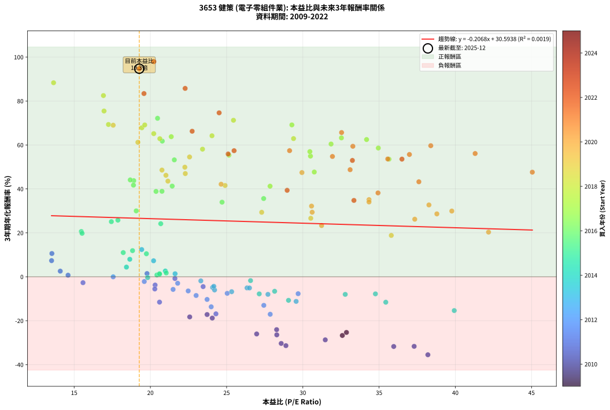

# 3653 健策 - 本益比與未來報酬率分析

!!! info "報告資訊"
    - **股票代號**: 3653
    - **公司名稱**: 健策
    - **產業別**: 電子零組件業
    - **分析期間**: 2009-2022 (158 個數據點)
    - **資料來源**: Type 12 (ShowMonthlyK_ChartFlow) 月收盤價與本益比
    - **報酬率口徑**: 含現金股利 (簡化: 年度合計，假設每年7/1入帳)
    - **報告生成時間**: 2026-01-06 00:59:19 CST

## 📈 視覺化圖表

### 圖表1: 本益比 vs 未來報酬率關係

*圖表1：3653 健策 本益比與3年期未來報酬率關係 (2009-2022)*

### 圖表2: 歷年買入時點的3年期實際報酬率

*圖表2：3653 健策 歷年買入時點的3年期實際報酬率 (2009-2022)*

## 📍 買點訊號說明

本報告提供兩種買點提示訊號（顯示於圖表2的股價子圖中）：

### ▲ 小綠色三角形（回測驗證）
- **計算方式**: 使用全部歷史資料計算本益比第25百分位數
- **用途**: 事後驗證，顯示歷史上哪些時點確實為低估區
- **限制**: 當下無法判斷，僅供回測參考
- **特性**: 後見之明（Look-Ahead Bias）

### ▲ 小橘色三角形（即時訊號）
- **計算方式**: 使用截至當月的過去5年資料計算本益比第25百分位數
- **用途**: 實際投資決策，當時即可判斷
- **優勢**: 可操作性強，符合實務需求
- **特性**: 無後見之明，滾動窗口計算

!!! tip "如何使用兩種訊號"
    - **綠色▲** 幫助理解歷史估值機會，驗證策略有效性
    - **橘色▲** 可作為實際買進參考，但仍需搭配基本面分析
    - 兩種訊號重疊時，表示即時判斷與事後驗證一致，信心度較高
    - 僅有綠色▲時，表示當時無法判斷（需要未來資料才能確認）
    - 僅有橘色▲時，表示即時判斷為買點，但事後可能不是最佳時機

## 📊 估值分析摘要

| 指標 | 數值 |
|:---:|:---:|
| **目前本益比** (2022-12) | **19.27 倍** |
| **歷史平均本益比** | 25.81 倍 |
| **估值水準** | 🟢 相對低估 |
| **預期3年年化報酬率** | **+26.61%** |
| **歷史平均報酬率** | +25.25% |
| **相關係數 (R²)** | 0.0019 |
| **趨勢線斜率** | -0.2068 |

!!! abstract "核心洞察"
    目前本益比顯著低於歷史平均，預期未來報酬率可能較高

    根據歷史數據回測，3653 健策 在目前本益比 **19.3倍** 的估值水準下，
    預期未來3年年化報酬率約為 **+26.6%**。

    **重要提醒**: 本分析基於歷史數據統計，實際報酬率會受到公司基本面變化、產業趨勢、
    總體經濟環境等多重因素影響。R² = 0.00 表示本益比可解釋約 0.2% 的報酬率變異。

## 📈 歷史估值統計

### 最佳買點 (最高報酬率)

| 項目 | 數值 |
|:---:|:---:|
| 起始時間 | 2022-11 |
| 當時本益比 | 20.23 倍 |
| 起始價格 | 379.0 元 |
| 3年後價格 | 2905.0 元 |
| **3年年化報酬率** | **+97.95%** |

### 最差買點 (最低報酬率)

| 項目 | 數值 |
|:---:|:---:|
| 起始時間 | 2010-07 |
| 當時本益比 | 38.20 倍 |
| 起始價格 | 238.0 元 |
| 3年後價格 | 54.8 元 |
| **3年年化報酬率** | **-35.51%** |

## 🎯 投資啟示

### 本益比與報酬率關係

趨勢線方程式: **y = -0.2068x + 30.5938**

!!! note "負相關"
    本益比與未來報酬率呈現負相關。較低的本益比通常帶來較高的未來報酬率，
    但相關性不算非常強。**估值仍是重要參考指標之一**。

### 估值區間建議

基於歷史數據分析:

- **🟢 低估區** (P/E < 20.7): 預期報酬率較高，可考慮增加持股
- **🟡 合理區** (P/E 20.7-31.0): 預期報酬率符合長期趨勢，正常持有
- **🔴 高估區** (P/E > 31.0): 預期報酬率較低，可考慮減碼或觀望

!!! danger "風險提示"
    - 過去表現不代表未來結果
    - 本分析假設公司基本面無重大結構性變化
    - 產業環境劇變可能使歷史規律失效
    - 應結合公司財報、產業趨勢、總體經濟等多重因素綜合判斷

!!! success "長期投資觀點"
    歷史數據顯示，在合理或低估的估值水準買入並長期持有，
    往往能獲得較佳的投資報酬。**耐心等待好價格**是價值投資的核心原則。

## 📊 數據品質

- **資料來源**: GoodInfo.tw Type 12 (ShowMonthlyK_ChartFlow)
- **資料頻率**: 月度收盤價與本益比
- **回測期間**: 2009-2022
- **數據點數量**: 158 個 (每個點代表一次3年期回測)

### 計算方法說明

1. **3年期年化報酬率**:
   - 對每個歷史時點，計算其後3年的實際投資報酬率
   - 期末價值(不含股利): 期末價格
   - 期末價值(含現金股利): 期末價格 + 持有期間內的現金股利合計 (簡化: 年度合計，假設每年7/1入帳)
   - 公式: 年化報酬率 = [(期末價值/期初價格)^(1/年數) - 1] × 100%

2. **本益比 (P/E Ratio)**:
   - 使用當時的月收盤價與EPS計算
   - 資料來源: Type 12 月度河流圖本益比數據

3. **趨勢線 (Linear Regression)**:
   - 使用最小平方法擬合線性趨勢線
   - R²值衡量本益比對報酬率的解釋能力

---

*本報告由 Stock Analysis System v1.9.0 自動生成*
*數據更新時間: 2026-01-06 00:59:19 CST*

## 📋 月度回測明細表

（每一列對應時間線圖中的一個買入點；可用來對照 SVG 圖上的每個點。）

| 買入月份 | 賣出月份 | 回測期限_年 | 實際持有年數 | 買入本益比_倍 | 買入收盤價_元 | 賣出收盤價_元 | 現金股利合計_元 | 總報酬率_pct | 年化報酬率_pct |
| --- | --- | --- | --- | --- | --- | --- | --- | --- | --- |
| 2009-11 | 2012-11 | 3 | 3.001 | 32.59 | 183.50 | 62.30 | 9.90 | -60.65 | -26.72 |
| 2009-12 | 2012-12 | 3 | 3.001 | 32.86 | 185.00 | 67.10 | 9.90 | -58.38 | -25.33 |
| 2010-01 | 2013-01 | 3 | 3.001 | 24.06 | 137.50 | 63.70 | 9.90 | -46.47 | -18.80 |
| 2010-02 | 2013-02 | 3 | 3.001 | 22.58 | 131.00 | 61.60 | 9.90 | -45.42 | -18.27 |
| 2010-03 | 2013-03 | 3 | 3.001 | 28.28 | 166.50 | 63.00 | 9.90 | -56.22 | -24.06 |
| 2010-04 | 2013-04 | 3 | 3.001 | 31.47 | 188.00 | 58.20 | 9.90 | -63.78 | -28.71 |
| 2010-05 | 2013-05 | 3 | 3.001 | 37.30 | 226.00 | 62.20 | 9.90 | -68.10 | -31.66 |
| 2010-06 | 2013-06 | 3 | 3.001 | 35.96 | 221.00 | 60.40 | 9.90 | -68.19 | -31.73 |
| 2010-07 | 2013-07 | 3 | 3.001 | 38.20 | 238.00 | 54.80 | 9.02 | -73.18 | -35.51 |
| 2010-08 | 2013-08 | 3 | 3.001 | 28.89 | 182.50 | 50.00 | 9.02 | -67.66 | -31.35 |
| 2010-09 | 2013-09 | 3 | 3.001 | 28.58 | 183.00 | 52.80 | 9.02 | -66.22 | -30.35 |
| 2010-10 | 2013-10 | 3 | 3.001 | 26.97 | 175.00 | 61.80 | 9.02 | -59.53 | -26.03 |
| 2010-11 | 2013-11 | 3 | 3.001 | 28.29 | 186.00 | 65.00 | 9.02 | -60.20 | -26.44 |
| 2010-12 | 2013-12 | 3 | 3.001 | 23.72 | 158.00 | 80.70 | 9.02 | -43.21 | -17.19 |
| 2011-01 | 2014-01 | 3 | 3.001 | 24.30 | 158.50 | 82.00 | 9.02 | -42.57 | -16.88 |
| 2011-02 | 2014-02 | 3 | 3.001 | 20.60 | 131.50 | 82.00 | 9.02 | -30.78 | -11.54 |
| 2011-03 | 2014-03 | 3 | 3.001 | 19.78 | 123.50 | 120.00 | 9.02 | +4.47 | +1.47 |
| 2011-04 | 2014-04 | 3 | 3.001 | 20.31 | 124.00 | 101.50 | 9.02 | -10.87 | -3.76 |
| 2011-05 | 2014-05 | 3 | 3.001 | 23.46 | 140.00 | 113.00 | 9.02 | -12.84 | -4.48 |
| 2011-06 | 2014-06 | 3 | 3.001 | 21.61 | 126.00 | 114.00 | 9.02 | -2.36 | -0.79 |
| 2011-07 | 2014-07 | 3 | 3.001 | 20.29 | 115.50 | 89.60 | 7.72 | -15.74 | -5.55 |
| 2011-08 | 2014-08 | 3 | 3.001 | 13.54 | 75.20 | 94.00 | 7.72 | +35.27 | +10.59 |
| 2011-09 | 2014-09 | 3 | 3.001 | 14.09 | 76.30 | 74.60 | 7.72 | +7.90 | +2.56 |
| 2011-10 | 2014-10 | 3 | 3.001 | 15.58 | 82.20 | 68.00 | 7.72 | -7.88 | -2.70 |
| 2011-11 | 2014-11 | 3 | 3.001 | 14.60 | 75.00 | 68.90 | 7.72 | +2.17 | +0.72 |
| 2011-12 | 2014-12 | 3 | 3.001 | 13.52 | 67.60 | 75.90 | 7.72 | +23.70 | +7.35 |
| 2012-01 | 2015-01 | 3 | 3.001 | 17.56 | 83.80 | 76.00 | 7.72 | -0.09 | -0.03 |
| 2012-02 | 2015-03 | 3 | 3.080 | 23.00 | 104.50 | 71.70 | 7.72 | -24.00 | -8.52 |
| 2012-03 | 2015-03 | 3 | 2.998 | 22.48 | 97.00 | 71.70 | 7.72 | -18.12 | -6.45 |
| 2012-04 | 2015-04 | 3 | 2.998 | 19.60 | 80.10 | 67.30 | 7.72 | -6.34 | -2.16 |
| 2012-05 | 2015-05 | 3 | 2.998 | 21.49 | 82.90 | 61.70 | 7.72 | -16.26 | -5.75 |
| 2012-06 | 2015-06 | 3 | 2.998 | 23.72 | 86.10 | 54.40 | 7.72 | -27.85 | -10.32 |
| 2012-07 | 2015-07 | 3 | 2.998 | 23.99 | 81.60 | 44.00 | 8.51 | -35.65 | -13.67 |
| 2012-08 | 2015-08 | 3 | 2.998 | 27.86 | 88.40 | 41.95 | 8.51 | -42.92 | -17.06 |
| 2012-09 | 2015-09 | 3 | 2.998 | 27.44 | 80.80 | 44.70 | 8.51 | -34.15 | -13.01 |
| 2012-10 | 2015-10 | 3 | 2.998 | 21.79 | 59.20 | 45.60 | 8.51 | -8.60 | -2.95 |
| 2012-11 | 2015-11 | 3 | 2.998 | 25.04 | 62.30 | 40.75 | 8.51 | -20.93 | -7.54 |
| 2012-12 | 2015-12 | 3 | 2.998 | 29.69 | 67.10 | 44.25 | 8.51 | -21.37 | -7.71 |
| 2013-01 | 2016-01 | 3 | 2.998 | 27.71 | 63.70 | 41.10 | 8.51 | -22.12 | -8.00 |
| 2013-02 | 2016-02 | 3 | 2.998 | 26.34 | 61.60 | 44.20 | 8.51 | -14.43 | -5.07 |
| 2013-03 | 2016-03 | 3 | 3.001 | 26.50 | 63.00 | 45.35 | 8.51 | -14.51 | -5.09 |
| 2013-04 | 2016-04 | 3 | 3.001 | 24.08 | 58.20 | 41.60 | 8.51 | -13.90 | -4.87 |
| 2013-05 | 2016-05 | 3 | 3.001 | 25.33 | 62.20 | 41.85 | 8.51 | -19.04 | -6.80 |
| 2013-06 | 2016-06 | 3 | 3.001 | 24.21 | 60.40 | 41.65 | 8.51 | -16.96 | -6.00 |
| 2013-07 | 2016-07 | 3 | 3.001 | 21.62 | 54.80 | 48.10 | 9.00 | +4.20 | +1.38 |
| 2013-08 | 2016-08 | 3 | 3.001 | 19.43 | 50.00 | 62.00 | 9.00 | +42.00 | +12.40 |
| 2013-09 | 2016-09 | 3 | 3.001 | 20.21 | 52.80 | 56.20 | 9.00 | +23.48 | +7.28 |
| 2013-10 | 2016-10 | 3 | 3.001 | 23.31 | 61.80 | 49.40 | 9.00 | -5.50 | -1.87 |
| 2013-11 | 2016-11 | 3 | 3.001 | 24.16 | 65.00 | 47.90 | 9.00 | -12.46 | -4.34 |
| 2013-12 | 2016-12 | 3 | 3.001 | 29.56 | 80.70 | 47.50 | 9.00 | -29.99 | -11.20 |
| 2014-01 | 2017-01 | 3 | 3.001 | 29.06 | 82.00 | 49.35 | 9.00 | -28.84 | -10.72 |
| 2014-02 | 2017-02 | 3 | 3.001 | 28.15 | 82.00 | 57.80 | 9.00 | -18.54 | -6.60 |
| 2014-03 | 2017-03 | 3 | 3.001 | 39.93 | 120.00 | 63.70 | 9.00 | -39.42 | -15.38 |
| 2014-04 | 2017-04 | 3 | 3.001 | 32.78 | 101.50 | 70.00 | 9.00 | -22.17 | -8.01 |
| 2014-05 | 2017-05 | 3 | 3.001 | 35.44 | 113.00 | 69.10 | 9.00 | -30.88 | -11.58 |
| 2014-06 | 2017-06 | 3 | 3.001 | 34.76 | 114.00 | 80.40 | 9.00 | -21.58 | -7.78 |
| 2014-07 | 2017-07 | 3 | 3.001 | 26.57 | 89.60 | 76.70 | 8.30 | -5.13 | -1.74 |
| 2014-08 | 2017-08 | 3 | 3.001 | 27.14 | 94.00 | 65.40 | 8.30 | -21.60 | -7.79 |
| 2014-09 | 2017-09 | 3 | 3.001 | 20.98 | 74.60 | 72.30 | 8.30 | +8.04 | +2.61 |
| 2014-10 | 2017-10 | 3 | 3.001 | 18.65 | 68.00 | 77.30 | 8.30 | +25.88 | +7.97 |
| 2014-11 | 2017-11 | 3 | 3.001 | 18.43 | 68.90 | 70.10 | 8.30 | +13.79 | +4.40 |
| 2014-12 | 2017-12 | 3 | 3.001 | 19.82 | 75.90 | 66.70 | 8.30 | -1.19 | -0.40 |
| 2015-01 | 2018-01 | 3 | 3.001 | 20.60 | 76.00 | 70.30 | 8.30 | +3.42 | +1.13 |
| 2015-02 | 2018-02 | 3 | 3.001 | 20.43 | 72.50 | 66.00 | 8.30 | +2.48 | +0.82 |
| 2015-03 | 2018-03 | 3 | 3.001 | 21.04 | 71.70 | 67.20 | 8.30 | +5.30 | +1.74 |
| 2015-04 | 2018-04 | 3 | 3.001 | 20.60 | 67.30 | 61.80 | 8.30 | +4.16 | +1.37 |
| 2015-05 | 2018-05 | 3 | 3.001 | 19.74 | 61.70 | 74.90 | 8.30 | +34.85 | +10.48 |
| 2015-06 | 2018-06 | 3 | 3.001 | 18.22 | 54.40 | 66.10 | 8.30 | +36.76 | +11.00 |
| 2015-07 | 2018-07 | 3 | 3.001 | 15.47 | 44.00 | 70.70 | 6.50 | +75.45 | +20.61 |
| 2015-08 | 2018-08 | 3 | 3.001 | 15.52 | 41.95 | 65.60 | 6.50 | +71.87 | +19.78 |
| 2015-09 | 2018-09 | 3 | 3.001 | 17.44 | 44.70 | 81.00 | 6.50 | +95.75 | +25.09 |
| 2015-10 | 2018-10 | 3 | 3.001 | 18.83 | 45.60 | 57.40 | 6.50 | +40.13 | +11.90 |
| 2015-11 | 2018-11 | 3 | 3.001 | 17.87 | 40.75 | 74.60 | 6.50 | +99.02 | +25.78 |
| 2015-12 | 2018-12 | 3 | 3.001 | 20.68 | 44.25 | 78.20 | 6.50 | +91.41 | +24.16 |
| 2016-01 | 2019-01 | 3 | 3.001 | 19.07 | 41.10 | 83.80 | 6.50 | +119.71 | +29.99 |
| 2016-02 | 2019-03 | 3 | 3.080 | 20.37 | 44.20 | 115.00 | 6.50 | +174.89 | +38.86 |
| 2016-03 | 2019-03 | 3 | 2.998 | 20.76 | 45.35 | 115.00 | 6.50 | +167.92 | +38.92 |
| 2016-04 | 2019-04 | 3 | 2.998 | 18.91 | 41.60 | 117.00 | 6.50 | +196.88 | +43.76 |
| 2016-05 | 2019-05 | 3 | 2.998 | 18.89 | 41.85 | 112.50 | 6.50 | +184.35 | +41.71 |
| 2016-06 | 2019-06 | 3 | 2.998 | 18.68 | 41.65 | 118.00 | 6.50 | +198.92 | +44.09 |
| 2016-07 | 2019-07 | 3 | 2.998 | 21.43 | 48.10 | 128.00 | 7.53 | +181.76 | +41.27 |
| 2016-08 | 2019-08 | 3 | 2.998 | 27.43 | 62.00 | 147.00 | 7.53 | +149.24 | +35.61 |
| 2016-09 | 2019-09 | 3 | 2.998 | 24.70 | 56.20 | 127.50 | 7.53 | +140.26 | +33.96 |
| 2016-10 | 2019-10 | 3 | 2.998 | 21.57 | 49.40 | 170.00 | 7.53 | +259.37 | +53.22 |
| 2016-11 | 2019-11 | 3 | 2.998 | 20.78 | 47.90 | 195.00 | 7.53 | +322.81 | +61.76 |
| 2016-12 | 2019-12 | 3 | 2.998 | 20.47 | 47.50 | 234.50 | 7.53 | +409.53 | +72.14 |
| 2017-01 | 2020-01 | 3 | 2.998 | 21.37 | 49.35 | 209.00 | 7.53 | +338.76 | +63.77 |
| 2017-02 | 2020-02 | 3 | 2.998 | 25.15 | 57.80 | 209.00 | 7.53 | +274.62 | +55.36 |
| 2017-03 | 2020-03 | 3 | 3.001 | 27.85 | 63.70 | 172.00 | 7.53 | +181.83 | +41.24 |
| 2017-04 | 2020-04 | 3 | 3.001 | 30.75 | 70.00 | 218.00 | 7.53 | +222.18 | +47.68 |
| 2017-05 | 2020-05 | 3 | 3.001 | 30.50 | 69.10 | 249.50 | 7.53 | +271.97 | +54.93 |
| 2017-06 | 2020-06 | 3 | 3.001 | 35.65 | 80.40 | 283.50 | 7.53 | +261.98 | +53.53 |
| 2017-07 | 2020-07 | 3 | 3.001 | 34.18 | 76.70 | 318.50 | 10.53 | +328.98 | +62.47 |
| 2017-08 | 2020-08 | 3 | 3.001 | 29.28 | 65.40 | 306.00 | 10.53 | +383.99 | +69.13 |
| 2017-09 | 2020-09 | 3 | 3.001 | 32.53 | 72.30 | 304.00 | 10.53 | +335.03 | +63.23 |
| 2017-10 | 2020-10 | 3 | 3.001 | 34.95 | 77.30 | 298.00 | 10.53 | +299.13 | +58.61 |
| 2017-11 | 2020-11 | 3 | 3.001 | 31.85 | 70.10 | 279.00 | 10.53 | +313.02 | +60.43 |
| 2017-12 | 2020-12 | 3 | 3.001 | 30.46 | 66.70 | 247.50 | 10.53 | +286.85 | +56.96 |
| 2018-01 | 2021-01 | 3 | 3.001 | 29.39 | 70.30 | 293.50 | 10.53 | +332.47 | +62.91 |
| 2018-02 | 2021-02 | 3 | 3.001 | 25.45 | 66.00 | 321.00 | 10.53 | +402.32 | +71.24 |
| 2018-03 | 2021-03 | 3 | 3.001 | 24.04 | 67.20 | 287.00 | 10.53 | +342.75 | +64.19 |
| 2018-04 | 2021-04 | 3 | 3.001 | 20.62 | 61.80 | 256.50 | 10.53 | +332.08 | +62.86 |
| 2018-05 | 2021-05 | 3 | 3.001 | 23.42 | 74.90 | 285.50 | 10.53 | +295.23 | +58.09 |
| 2018-06 | 2021-06 | 3 | 3.001 | 19.44 | 66.10 | 302.00 | 10.53 | +372.81 | +67.82 |
| 2018-07 | 2021-07 | 3 | 3.001 | 19.63 | 70.70 | 327.50 | 14.53 | +383.78 | +69.11 |
| 2018-08 | 2021-08 | 3 | 3.001 | 17.25 | 65.60 | 304.00 | 14.53 | +385.56 | +69.32 |
| 2018-09 | 2021-09 | 3 | 3.001 | 20.22 | 81.00 | 350.50 | 14.53 | +350.65 | +65.16 |
| 2018-10 | 2021-10 | 3 | 3.001 | 13.65 | 57.40 | 369.00 | 14.53 | +568.17 | +88.32 |
| 2018-11 | 2021-11 | 3 | 3.001 | 16.92 | 74.60 | 439.00 | 14.53 | +507.95 | +82.49 |
| 2018-12 | 2021-12 | 3 | 3.001 | 16.96 | 78.20 | 408.00 | 14.53 | +440.32 | +75.45 |
| 2019-01 | 2022-01 | 3 | 3.001 | 17.56 | 83.80 | 390.00 | 14.53 | +382.73 | +68.99 |
| 2019-02 | 2022-02 | 3 | 3.001 | 19.18 | 94.60 | 382.00 | 14.53 | +319.16 | +61.22 |
| 2019-03 | 2022-03 | 3 | 3.001 | 22.57 | 115.00 | 410.00 | 14.53 | +269.16 | +54.53 |
| 2019-04 | 2022-04 | 3 | 3.001 | 22.26 | 117.00 | 379.50 | 14.53 | +236.78 | +49.88 |
| 2019-05 | 2022-05 | 3 | 3.001 | 20.76 | 112.50 | 354.50 | 14.53 | +228.03 | +48.57 |
| 2019-06 | 2022-06 | 3 | 3.001 | 21.15 | 118.00 | 334.50 | 14.53 | +195.79 | +43.53 |
| 2019-07 | 2022-07 | 3 | 3.001 | 22.29 | 128.00 | 389.50 | 17.00 | +217.58 | +46.98 |
| 2019-08 | 2022-08 | 3 | 3.001 | 24.90 | 147.00 | 400.00 | 17.00 | +183.67 | +41.55 |
| 2019-09 | 2022-09 | 3 | 3.001 | 21.02 | 127.50 | 381.50 | 17.00 | +212.55 | +46.20 |
| 2019-10 | 2022-10 | 3 | 3.001 | 27.30 | 170.00 | 351.00 | 17.00 | +116.47 | +29.35 |
| 2019-11 | 2022-11 | 3 | 3.001 | 30.52 | 195.00 | 379.00 | 17.00 | +103.08 | +26.63 |
| 2019-12 | 2022-12 | 3 | 3.001 | 35.80 | 234.50 | 376.50 | 17.00 | +67.80 | +18.83 |
| 2020-01 | 2023-01 | 3 | 3.001 | 31.23 | 209.00 | 375.00 | 17.00 | +87.56 | +23.32 |
| 2020-02 | 2023-03 | 3 | 3.080 | 30.57 | 209.00 | 476.50 | 17.00 | +136.12 | +32.17 |
| 2020-03 | 2023-03 | 3 | 2.998 | 24.64 | 172.00 | 476.50 | 17.00 | +186.92 | +42.13 |
| 2020-04 | 2023-04 | 3 | 2.998 | 30.61 | 218.00 | 455.00 | 17.00 | +116.51 | +29.39 |
| 2020-05 | 2023-05 | 3 | 2.998 | 34.34 | 249.50 | 598.00 | 17.00 | +146.49 | +35.11 |
| 2020-06 | 2023-06 | 3 | 2.998 | 38.27 | 283.50 | 645.00 | 17.00 | +133.51 | +32.69 |
| 2020-07 | 2023-07 | 3 | 2.998 | 42.18 | 318.50 | 531.00 | 23.66 | +74.15 | +20.33 |
| 2020-08 | 2023-08 | 3 | 2.998 | 39.77 | 306.00 | 647.00 | 23.66 | +119.17 | +29.92 |
| 2020-09 | 2023-09 | 3 | 2.998 | 38.79 | 304.00 | 623.00 | 23.66 | +112.72 | +28.63 |
| 2020-10 | 2023-10 | 3 | 2.998 | 37.34 | 298.00 | 575.00 | 23.66 | +100.89 | +26.20 |
| 2020-11 | 2023-11 | 3 | 2.998 | 34.34 | 279.00 | 648.00 | 23.66 | +140.74 | +34.05 |
| 2020-12 | 2023-12 | 3 | 2.998 | 29.94 | 247.50 | 769.00 | 23.66 | +220.27 | +47.44 |
| 2021-01 | 2024-01 | 3 | 2.998 | 34.93 | 293.50 | 750.00 | 23.66 | +163.60 | +38.17 |
| 2021-02 | 2024-02 | 3 | 2.998 | 37.61 | 321.00 | 919.00 | 23.66 | +193.66 | +43.24 |
| 2021-03 | 2024-03 | 3 | 3.001 | 33.10 | 287.00 | 921.00 | 23.66 | +229.15 | +48.74 |
| 2021-04 | 2024-04 | 3 | 3.001 | 29.13 | 256.50 | 977.00 | 23.66 | +290.12 | +57.41 |
| 2021-05 | 2024-05 | 3 | 3.001 | 31.94 | 285.50 | 1035.00 | 23.66 | +270.81 | +54.77 |
| 2021-06 | 2024-06 | 3 | 3.001 | 33.28 | 302.00 | 1200.00 | 23.66 | +305.18 | +59.41 |
| 2021-07 | 2024-07 | 3 | 3.001 | 35.57 | 327.50 | 1160.00 | 27.51 | +262.60 | +53.61 |
| 2021-08 | 2024-08 | 3 | 3.001 | 32.54 | 304.00 | 1355.00 | 27.51 | +354.77 | +65.66 |
| 2021-09 | 2024-09 | 3 | 3.001 | 36.99 | 350.50 | 1295.00 | 27.51 | +277.32 | +55.67 |
| 2021-10 | 2024-10 | 3 | 3.001 | 38.39 | 369.00 | 1475.00 | 27.51 | +307.18 | +59.67 |
| 2021-11 | 2024-11 | 3 | 3.001 | 45.05 | 439.00 | 1385.00 | 27.51 | +221.76 | +47.62 |
| 2021-12 | 2024-12 | 3 | 3.001 | 41.30 | 408.00 | 1525.00 | 27.51 | +280.52 | +56.10 |
| 2022-01 | 2025-01 | 3 | 3.001 | 36.50 | 390.00 | 1385.00 | 27.51 | +262.18 | +53.56 |
| 2022-02 | 2025-02 | 3 | 3.001 | 33.25 | 382.00 | 1340.00 | 27.51 | +257.99 | +52.96 |
| 2022-03 | 2025-03 | 3 | 3.001 | 33.35 | 410.00 | 976.00 | 27.51 | +144.76 | +34.76 |
| 2022-04 | 2025-04 | 3 | 3.001 | 28.97 | 379.50 | 1000.00 | 27.51 | +170.75 | +39.37 |
| 2022-05 | 2025-05 | 3 | 3.001 | 25.49 | 354.50 | 1355.00 | 27.51 | +289.99 | +57.39 |
| 2022-06 | 2025-06 | 3 | 3.001 | 22.74 | 334.50 | 1510.00 | 27.51 | +359.64 | +66.25 |
| 2022-07 | 2025-07 | 3 | 3.001 | 25.10 | 389.50 | 1440.00 | 36.02 | +278.95 | +55.89 |
| 2022-08 | 2025-08 | 3 | 3.001 | 24.51 | 400.00 | 2095.00 | 36.02 | +432.75 | +74.63 |
| 2022-09 | 2025-09 | 3 | 3.001 | 22.28 | 381.50 | 2410.00 | 36.02 | +541.16 | +85.75 |
| 2022-10 | 2025-10 | 3 | 3.001 | 19.58 | 351.00 | 2130.00 | 36.02 | +517.10 | +83.40 |
| 2022-11 | 2025-11 | 3 | 3.001 | 20.23 | 379.00 | 2905.00 | 36.02 | +675.99 | +97.95 |
| 2022-12 | 2025-12 | 3 | 3.001 | 19.27 | 376.50 | 2745.00 | 36.02 | +638.65 | +94.72 |
