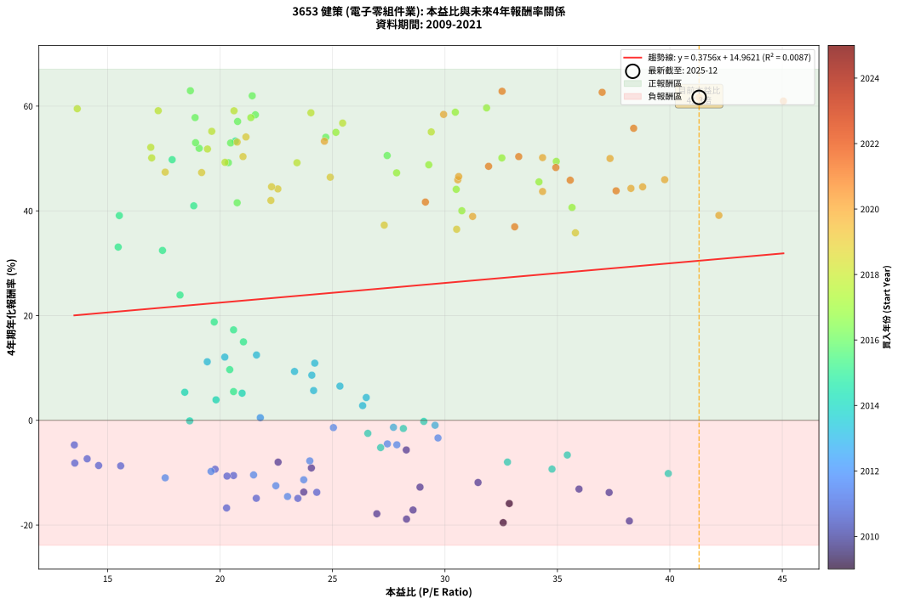
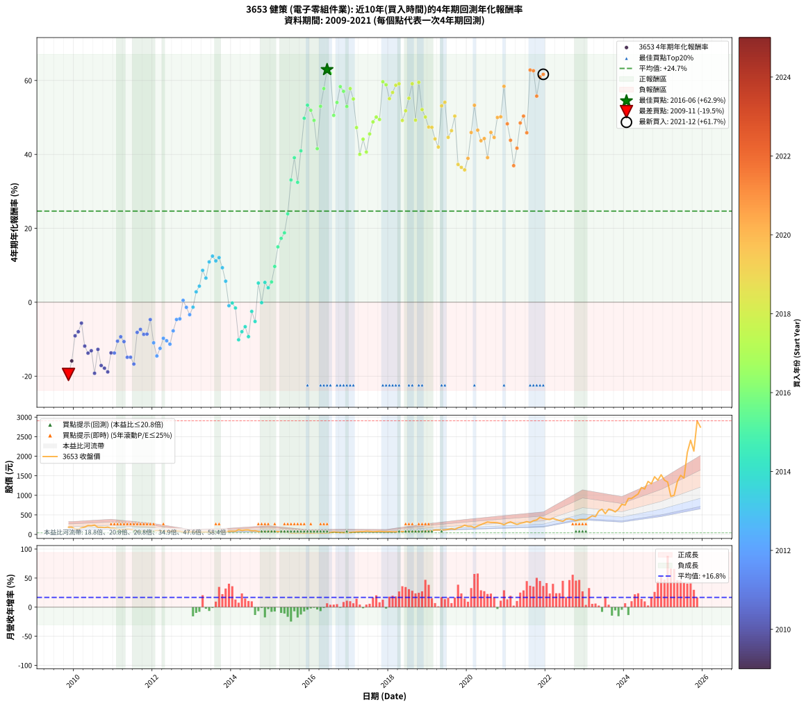

# 3653 健策 - 本益比與未來報酬率分析

!!! info "報告資訊"
    - **股票代號**: 3653
    - **公司名稱**: 健策
    - **產業別**: 電子零組件業
    - **分析期間**: 2009-2021 (146 個數據點)
    - **資料來源**: Type 12 (ShowMonthlyK_ChartFlow) 月收盤價與本益比
    - **報酬率口徑**: 含現金股利 (簡化: 年度合計，假設每年7/1入帳)
    - **報告生成時間**: 2026-01-13 01:00:28 CST

## 📈 視覺化圖表

### 圖表1: 本益比 vs 未來報酬率關係

*圖表1：3653 健策 本益比與4年期未來報酬率關係 (2009-2021)*

### 圖表2: 歷年買入時點的4年期實際報酬率

*圖表2：3653 健策 歷年買入時點的4年期實際報酬率 (2009-2021)*

## 📍 買點訊號說明

本報告提供兩種買點提示訊號（顯示於圖表2的股價子圖中）：

### ▲ 小綠色三角形（回測驗證）
- **計算方式**: 使用全部歷史資料計算本益比第25百分位數
- **用途**: 事後驗證，顯示歷史上哪些時點確實為低估區
- **限制**: 當下無法判斷，僅供回測參考
- **特性**: 後見之明（Look-Ahead Bias）

### ▲ 小橘色三角形（即時訊號）
- **計算方式**: 使用截至當月的過去5年資料計算本益比第25百分位數
- **用途**: 實際投資決策，當時即可判斷
- **優勢**: 可操作性強，符合實務需求
- **特性**: 無後見之明，滾動窗口計算

!!! tip "如何使用兩種訊號"
    - **綠色▲** 幫助理解歷史估值機會，驗證策略有效性
    - **橘色▲** 可作為實際買進參考，但仍需搭配基本面分析
    - 兩種訊號重疊時，表示即時判斷與事後驗證一致，信心度較高
    - 僅有綠色▲時，表示當時無法判斷（需要未來資料才能確認）
    - 僅有橘色▲時，表示即時判斷為買點，但事後可能不是最佳時機

## 📊 估值分析摘要

| 指標 | 數值 |
|:---:|:---:|
| **目前本益比** (2021-12) | **41.30 倍** |
| **歷史平均本益比** | 25.80 倍 |
| **估值水準** | 🔴 相對高估 |
| **預期4年年化報酬率** | **+30.47%** |
| **歷史平均報酬率** | +24.65% |
| **相關係數 (R²)** | 0.0087 |
| **趨勢線斜率** | 0.3756 |

!!! abstract "核心洞察"
    目前本益比顯著高於歷史平均，預期未來報酬率可能較低

    根據歷史數據回測，3653 健策 在目前本益比 **41.3倍** 的估值水準下，
    預期未來4年年化報酬率約為 **+30.5%**。

    **重要提醒**: 本分析基於歷史數據統計，實際報酬率會受到公司基本面變化、產業趨勢、
    總體經濟環境等多重因素影響。R² = 0.01 表示本益比可解釋約 0.9% 的報酬率變異。

## 📈 歷史估值統計

### 最佳買點 (最高報酬率)

| 項目 | 數值 |
|:---:|:---:|
| 起始時間 | 2016-06 |
| 當時本益比 | 18.68 倍 |
| 起始價格 | 41.6 元 |
| 4年後價格 | 283.5 元 |
| **4年年化報酬率** | **+62.93%** |

### 最差買點 (最低報酬率)

| 項目 | 數值 |
|:---:|:---:|
| 起始時間 | 2009-11 |
| 當時本益比 | 32.59 倍 |
| 起始價格 | 183.5 元 |
| 4年後價格 | 65.0 元 |
| **4年年化報酬率** | **-19.54%** |

## 🎯 投資啟示

### 本益比與報酬率關係

趨勢線方程式: **y = 0.3756x + 14.9621**

!!! info "弱相關或正相關"
    本益比與未來報酬率相關性較弱。這可能表示該股票的報酬率更多受到
    公司成長性、產業趨勢等因素影響，而非估值水準。**需綜合考量多項指標**。

### 估值區間建議

基於歷史數據分析:

- **🟢 低估區** (P/E < 20.6): 預期報酬率較高，可考慮增加持股
- **🟡 合理區** (P/E 20.6-31.0): 預期報酬率符合長期趨勢，正常持有
- **🔴 高估區** (P/E > 31.0): 預期報酬率較低，可考慮減碼或觀望

!!! danger "風險提示"
    - 過去表現不代表未來結果
    - 本分析假設公司基本面無重大結構性變化
    - 產業環境劇變可能使歷史規律失效
    - 應結合公司財報、產業趨勢、總體經濟等多重因素綜合判斷

!!! success "長期投資觀點"
    歷史數據顯示，在合理或低估的估值水準買入並長期持有，
    往往能獲得較佳的投資報酬。**耐心等待好價格**是價值投資的核心原則。

## 📊 數據品質

- **資料來源**: GoodInfo.tw Type 12 (ShowMonthlyK_ChartFlow)
- **資料頻率**: 月度收盤價與本益比
- **回測期間**: 2009-2021
- **數據點數量**: 146 個 (每個點代表一次4年期回測)

### 計算方法說明

1. **4年期年化報酬率**:
   - 對每個歷史時點，計算其後4年的實際投資報酬率
   - 期末價值(不含股利): 期末價格
   - 期末價值(含現金股利): 期末價格 + 持有期間內的現金股利合計 (簡化: 年度合計，假設每年7/1入帳)
   - 公式: 年化報酬率 = [(期末價值/期初價格)^(1/年數) - 1] × 100%

2. **本益比 (P/E Ratio)**:
   - 使用當時的月收盤價與EPS計算
   - 資料來源: Type 12 月度河流圖本益比數據

3. **趨勢線 (Linear Regression)**:
   - 使用最小平方法擬合線性趨勢線
   - R²值衡量本益比對報酬率的解釋能力

---

*本報告由 Stock Analysis System v1.9.0 自動生成*
*數據更新時間: 2026-01-13 01:00:28 CST*

## 📋 月度回測明細表

（每一列對應時間線圖中的一個買入點；可用來對照 SVG 圖上的每個點。）

| 買入月份 | 賣出月份 | 回測期限_年 | 實際持有年數 | 買入本益比_倍 | 買入收盤價_元 | 賣出收盤價_元 | 現金股利合計_元 | 總報酬率_pct | 年化報酬率_pct |
| --- | --- | --- | --- | --- | --- | --- | --- | --- | --- |
| 2009-11 | 2013-11 | 4 | 4.000 | 32.59 | 183.50 | 65.00 | 11.91 | -58.09 | -19.54 |
| 2009-12 | 2013-12 | 4 | 4.000 | 32.86 | 185.00 | 80.70 | 11.91 | -49.94 | -15.89 |
| 2010-01 | 2014-01 | 4 | 4.000 | 24.06 | 137.50 | 82.00 | 11.91 | -31.70 | -9.09 |
| 2010-02 | 2014-02 | 4 | 4.000 | 22.58 | 131.00 | 82.00 | 11.91 | -28.31 | -7.98 |
| 2010-03 | 2014-03 | 4 | 4.000 | 28.28 | 166.50 | 120.00 | 11.91 | -20.78 | -5.66 |
| 2010-04 | 2014-04 | 4 | 4.000 | 31.47 | 188.00 | 101.50 | 11.91 | -39.68 | -11.87 |
| 2010-05 | 2014-05 | 4 | 4.000 | 37.30 | 226.00 | 113.00 | 11.91 | -44.73 | -13.78 |
| 2010-06 | 2014-06 | 4 | 4.000 | 35.96 | 221.00 | 114.00 | 11.91 | -43.03 | -13.12 |
| 2010-07 | 2014-07 | 4 | 4.000 | 38.20 | 238.00 | 89.60 | 11.72 | -57.43 | -19.22 |
| 2010-08 | 2014-08 | 4 | 4.000 | 28.89 | 182.50 | 94.00 | 11.72 | -42.07 | -12.76 |
| 2010-09 | 2014-09 | 4 | 4.000 | 28.58 | 183.00 | 74.60 | 11.72 | -52.83 | -17.13 |
| 2010-10 | 2014-10 | 4 | 4.000 | 26.97 | 175.00 | 68.00 | 11.72 | -54.44 | -17.84 |
| 2010-11 | 2014-11 | 4 | 4.000 | 28.29 | 186.00 | 68.90 | 11.72 | -56.65 | -18.86 |
| 2010-12 | 2014-12 | 4 | 4.000 | 23.72 | 158.00 | 75.90 | 11.72 | -44.54 | -13.70 |
| 2011-01 | 2015-01 | 4 | 4.000 | 24.30 | 158.50 | 76.00 | 11.72 | -44.65 | -13.75 |
| 2011-02 | 2015-02 | 4 | 4.000 | 20.60 | 131.50 | 72.50 | 11.72 | -35.95 | -10.54 |
| 2011-03 | 2015-03 | 4 | 4.000 | 19.78 | 123.50 | 71.70 | 11.72 | -32.45 | -9.34 |
| 2011-04 | 2015-04 | 4 | 4.000 | 20.31 | 124.00 | 67.30 | 11.72 | -36.27 | -10.65 |
| 2011-05 | 2015-05 | 4 | 4.000 | 23.46 | 140.00 | 61.70 | 11.72 | -47.55 | -14.90 |
| 2011-06 | 2015-06 | 4 | 4.000 | 21.61 | 126.00 | 54.40 | 11.72 | -47.52 | -14.89 |
| 2011-07 | 2015-07 | 4 | 4.000 | 20.29 | 115.50 | 44.00 | 11.52 | -51.93 | -16.73 |
| 2011-08 | 2015-08 | 4 | 4.000 | 13.54 | 75.20 | 41.95 | 11.52 | -28.89 | -8.17 |
| 2011-09 | 2015-09 | 4 | 4.000 | 14.09 | 76.30 | 44.70 | 11.52 | -26.31 | -7.35 |
| 2011-10 | 2015-10 | 4 | 4.000 | 15.58 | 82.20 | 45.60 | 11.52 | -30.51 | -8.70 |
| 2011-11 | 2015-11 | 4 | 4.000 | 14.60 | 75.00 | 40.75 | 11.52 | -30.30 | -8.63 |
| 2011-12 | 2015-12 | 4 | 4.000 | 13.52 | 67.60 | 44.25 | 11.52 | -17.49 | -4.69 |
| 2012-01 | 2016-01 | 4 | 4.000 | 17.56 | 83.80 | 41.10 | 11.52 | -37.20 | -10.98 |
| 2012-02 | 2016-02 | 4 | 4.000 | 23.00 | 104.50 | 44.20 | 11.52 | -46.68 | -14.55 |
| 2012-03 | 2016-03 | 4 | 4.000 | 22.48 | 97.00 | 45.35 | 11.52 | -41.37 | -12.49 |
| 2012-04 | 2016-04 | 4 | 4.000 | 19.60 | 80.10 | 41.60 | 11.52 | -33.68 | -9.76 |
| 2012-05 | 2016-05 | 4 | 4.000 | 21.49 | 82.90 | 41.85 | 11.52 | -35.62 | -10.42 |
| 2012-06 | 2016-06 | 4 | 4.000 | 23.72 | 86.10 | 41.65 | 11.52 | -38.24 | -11.35 |
| 2012-07 | 2016-07 | 4 | 4.000 | 23.99 | 81.60 | 48.10 | 11.01 | -27.56 | -7.74 |
| 2012-08 | 2016-08 | 4 | 4.000 | 27.86 | 88.40 | 62.00 | 11.01 | -17.41 | -4.67 |
| 2012-09 | 2016-09 | 4 | 4.000 | 27.44 | 80.80 | 56.20 | 11.01 | -16.82 | -4.50 |
| 2012-10 | 2016-10 | 4 | 4.000 | 21.79 | 59.20 | 49.40 | 11.01 | +2.04 | +0.51 |
| 2012-11 | 2016-11 | 4 | 4.000 | 25.04 | 62.30 | 47.90 | 11.01 | -5.44 | -1.39 |
| 2012-12 | 2016-12 | 4 | 4.000 | 29.69 | 67.10 | 47.50 | 11.01 | -12.80 | -3.37 |
| 2013-01 | 2017-01 | 4 | 4.000 | 27.71 | 63.70 | 49.35 | 11.01 | -5.24 | -1.34 |
| 2013-02 | 2017-02 | 4 | 4.000 | 26.34 | 61.60 | 57.80 | 11.01 | +11.70 | +2.81 |
| 2013-03 | 2017-03 | 4 | 4.000 | 26.50 | 63.00 | 63.70 | 11.01 | +18.59 | +4.35 |
| 2013-04 | 2017-04 | 4 | 4.000 | 24.08 | 58.20 | 70.00 | 11.01 | +39.19 | +8.62 |
| 2013-05 | 2017-05 | 4 | 4.000 | 25.33 | 62.20 | 69.10 | 11.01 | +28.79 | +6.53 |
| 2013-06 | 2017-06 | 4 | 4.000 | 24.21 | 60.40 | 80.40 | 11.01 | +51.34 | +10.91 |
| 2013-07 | 2017-07 | 4 | 4.000 | 21.62 | 54.80 | 76.70 | 11.00 | +60.04 | +12.47 |
| 2013-08 | 2017-08 | 4 | 4.000 | 19.43 | 50.00 | 65.40 | 11.00 | +52.80 | +11.18 |
| 2013-09 | 2017-09 | 4 | 4.000 | 20.21 | 52.80 | 72.30 | 11.00 | +57.77 | +12.07 |
| 2013-10 | 2017-10 | 4 | 4.000 | 23.31 | 61.80 | 77.30 | 11.00 | +42.88 | +9.33 |
| 2013-11 | 2017-11 | 4 | 4.000 | 24.16 | 65.00 | 70.10 | 11.00 | +24.77 | +5.69 |
| 2013-12 | 2017-12 | 4 | 4.000 | 29.56 | 80.70 | 66.70 | 11.00 | -3.72 | -0.94 |
| 2014-01 | 2018-01 | 4 | 4.000 | 29.06 | 82.00 | 70.30 | 11.00 | -0.85 | -0.21 |
| 2014-02 | 2018-02 | 4 | 4.000 | 28.15 | 82.00 | 66.00 | 11.00 | -6.10 | -1.56 |
| 2014-03 | 2018-03 | 4 | 4.000 | 39.93 | 120.00 | 67.20 | 11.00 | -34.83 | -10.15 |
| 2014-04 | 2018-04 | 4 | 4.000 | 32.78 | 101.50 | 61.80 | 11.00 | -28.28 | -7.97 |
| 2014-05 | 2018-05 | 4 | 4.000 | 35.44 | 113.00 | 74.90 | 11.00 | -23.98 | -6.63 |
| 2014-06 | 2018-06 | 4 | 4.000 | 34.76 | 114.00 | 66.10 | 11.00 | -32.37 | -9.31 |
| 2014-07 | 2018-07 | 4 | 4.000 | 26.57 | 89.60 | 70.70 | 10.30 | -9.60 | -2.49 |
| 2014-08 | 2018-08 | 4 | 4.000 | 27.14 | 94.00 | 65.60 | 10.30 | -19.26 | -5.21 |
| 2014-09 | 2018-09 | 4 | 4.000 | 20.98 | 74.60 | 81.00 | 10.30 | +22.39 | +5.18 |
| 2014-10 | 2018-10 | 4 | 4.000 | 18.65 | 68.00 | 57.40 | 10.30 | -0.44 | -0.11 |
| 2014-11 | 2018-11 | 4 | 4.000 | 18.43 | 68.90 | 74.60 | 10.30 | +23.22 | +5.36 |
| 2014-12 | 2018-12 | 4 | 4.000 | 19.82 | 75.90 | 78.20 | 10.30 | +16.60 | +3.91 |
| 2015-01 | 2019-01 | 4 | 4.000 | 20.60 | 76.00 | 83.80 | 10.30 | +23.82 | +5.49 |
| 2015-02 | 2019-02 | 4 | 4.000 | 20.43 | 72.50 | 94.60 | 10.30 | +44.69 | +9.68 |
| 2015-03 | 2019-03 | 4 | 4.000 | 21.04 | 71.70 | 115.00 | 10.30 | +74.76 | +14.98 |
| 2015-04 | 2019-04 | 4 | 4.000 | 20.60 | 67.30 | 117.00 | 10.30 | +89.15 | +17.27 |
| 2015-05 | 2019-05 | 4 | 4.000 | 19.74 | 61.70 | 112.50 | 10.30 | +99.03 | +18.78 |
| 2015-06 | 2019-06 | 4 | 4.000 | 18.22 | 54.40 | 118.00 | 10.30 | +135.85 | +23.92 |
| 2015-07 | 2019-07 | 4 | 4.000 | 15.47 | 44.00 | 128.00 | 10.03 | +213.70 | +33.08 |
| 2015-08 | 2019-08 | 4 | 4.000 | 15.52 | 41.95 | 147.00 | 10.03 | +274.32 | +39.09 |
| 2015-09 | 2019-09 | 4 | 4.000 | 17.44 | 44.70 | 127.50 | 10.03 | +207.67 | +32.44 |
| 2015-10 | 2019-10 | 4 | 4.000 | 18.83 | 45.60 | 170.00 | 10.03 | +294.80 | +40.96 |
| 2015-11 | 2019-11 | 4 | 4.000 | 17.87 | 40.75 | 195.00 | 10.03 | +403.14 | +49.77 |
| 2015-12 | 2019-12 | 4 | 4.000 | 20.68 | 44.25 | 234.50 | 10.03 | +452.61 | +53.32 |
| 2016-01 | 2020-01 | 4 | 4.000 | 19.07 | 41.10 | 209.00 | 10.03 | +432.91 | +51.94 |
| 2016-02 | 2020-02 | 4 | 4.000 | 20.37 | 44.20 | 209.00 | 10.03 | +395.54 | +49.20 |
| 2016-03 | 2020-03 | 4 | 4.000 | 20.76 | 45.35 | 172.00 | 10.03 | +301.38 | +41.54 |
| 2016-04 | 2020-04 | 4 | 4.000 | 18.91 | 41.60 | 218.00 | 10.03 | +448.14 | +53.01 |
| 2016-05 | 2020-05 | 4 | 4.000 | 18.89 | 41.85 | 249.50 | 10.03 | +520.14 | +57.81 |
| 2016-06 | 2020-06 | 4 | 4.000 | 18.68 | 41.65 | 283.50 | 10.03 | +604.75 | +62.93 |
| 2016-07 | 2020-07 | 4 | 4.000 | 21.43 | 48.10 | 318.50 | 12.53 | +588.21 | +61.97 |
| 2016-08 | 2020-08 | 4 | 4.000 | 27.43 | 62.00 | 306.00 | 12.53 | +413.75 | +50.55 |
| 2016-09 | 2020-09 | 4 | 4.000 | 24.70 | 56.20 | 304.00 | 12.53 | +463.22 | +54.05 |
| 2016-10 | 2020-10 | 4 | 4.000 | 21.57 | 49.40 | 298.00 | 12.53 | +528.60 | +58.34 |
| 2016-11 | 2020-11 | 4 | 4.000 | 20.78 | 47.90 | 279.00 | 12.53 | +508.62 | +57.07 |
| 2016-12 | 2020-12 | 4 | 4.000 | 20.47 | 47.50 | 247.50 | 12.53 | +447.43 | +52.96 |
| 2017-01 | 2021-01 | 4 | 4.000 | 21.37 | 49.35 | 293.50 | 12.53 | +520.12 | +57.80 |
| 2017-02 | 2021-02 | 4 | 4.000 | 25.15 | 57.80 | 321.00 | 12.53 | +477.04 | +54.99 |
| 2017-03 | 2021-03 | 4 | 4.000 | 27.85 | 63.70 | 287.00 | 12.53 | +370.22 | +47.26 |
| 2017-04 | 2021-04 | 4 | 4.000 | 30.75 | 70.00 | 256.50 | 12.53 | +284.33 | +40.02 |
| 2017-05 | 2021-05 | 4 | 4.000 | 30.50 | 69.10 | 285.50 | 12.53 | +331.30 | +44.11 |
| 2017-06 | 2021-06 | 4 | 4.000 | 35.65 | 80.40 | 302.00 | 12.53 | +291.20 | +40.64 |
| 2017-07 | 2021-07 | 4 | 4.000 | 34.18 | 76.70 | 327.50 | 16.53 | +348.54 | +45.53 |
| 2017-08 | 2021-08 | 4 | 4.000 | 29.28 | 65.40 | 304.00 | 16.53 | +390.11 | +48.79 |
| 2017-09 | 2021-09 | 4 | 4.000 | 32.53 | 72.30 | 350.50 | 16.53 | +407.65 | +50.10 |
| 2017-10 | 2021-10 | 4 | 4.000 | 34.95 | 77.30 | 369.00 | 16.53 | +398.74 | +49.44 |
| 2017-11 | 2021-11 | 4 | 4.000 | 31.85 | 70.10 | 439.00 | 16.53 | +549.83 | +59.66 |
| 2017-12 | 2021-12 | 4 | 4.000 | 30.46 | 66.70 | 408.00 | 16.53 | +536.48 | +58.83 |
| 2018-01 | 2022-01 | 4 | 4.000 | 29.39 | 70.30 | 390.00 | 16.53 | +478.28 | +55.07 |
| 2018-02 | 2022-02 | 4 | 4.000 | 25.45 | 66.00 | 382.00 | 16.53 | +503.83 | +56.76 |
| 2018-03 | 2022-03 | 4 | 4.000 | 24.04 | 67.20 | 410.00 | 16.53 | +534.72 | +58.72 |
| 2018-04 | 2022-04 | 4 | 4.000 | 20.62 | 61.80 | 379.50 | 16.53 | +540.82 | +59.11 |
| 2018-05 | 2022-05 | 4 | 4.000 | 23.42 | 74.90 | 354.50 | 16.53 | +395.37 | +49.19 |
| 2018-06 | 2022-06 | 4 | 4.000 | 19.44 | 66.10 | 334.50 | 16.53 | +431.06 | +51.80 |
| 2018-07 | 2022-07 | 4 | 4.000 | 19.63 | 70.70 | 389.50 | 20.53 | +479.95 | +55.18 |
| 2018-08 | 2022-08 | 4 | 4.000 | 17.25 | 65.60 | 400.00 | 20.53 | +541.05 | +59.12 |
| 2018-09 | 2022-09 | 4 | 4.000 | 20.22 | 81.00 | 381.50 | 20.53 | +396.33 | +49.26 |
| 2018-10 | 2022-10 | 4 | 4.000 | 13.65 | 57.40 | 351.00 | 20.53 | +547.26 | +59.50 |
| 2018-11 | 2022-11 | 4 | 4.000 | 16.92 | 74.60 | 379.00 | 20.53 | +435.56 | +52.13 |
| 2018-12 | 2022-12 | 4 | 4.000 | 16.96 | 78.20 | 376.50 | 20.53 | +407.71 | +50.11 |
| 2019-01 | 2023-01 | 4 | 4.000 | 17.56 | 83.80 | 375.00 | 20.53 | +371.99 | +47.40 |
| 2019-02 | 2023-02 | 4 | 4.000 | 19.18 | 94.60 | 425.00 | 20.53 | +370.96 | +47.31 |
| 2019-03 | 2023-03 | 4 | 4.000 | 22.57 | 115.00 | 476.50 | 20.53 | +332.20 | +44.19 |
| 2019-04 | 2023-04 | 4 | 4.000 | 22.26 | 117.00 | 455.00 | 20.53 | +306.43 | +41.99 |
| 2019-05 | 2023-05 | 4 | 4.000 | 20.76 | 112.50 | 598.00 | 20.53 | +449.80 | +53.13 |
| 2019-06 | 2023-06 | 4 | 4.000 | 21.15 | 118.00 | 645.00 | 20.53 | +464.01 | +54.11 |
| 2019-07 | 2023-07 | 4 | 4.000 | 22.29 | 128.00 | 531.00 | 28.66 | +337.23 | +44.60 |
| 2019-08 | 2023-08 | 4 | 4.000 | 24.90 | 147.00 | 647.00 | 28.66 | +359.63 | +46.42 |
| 2019-09 | 2023-09 | 4 | 4.000 | 21.02 | 127.50 | 623.00 | 28.66 | +411.10 | +50.36 |
| 2019-10 | 2023-10 | 4 | 4.000 | 27.30 | 170.00 | 575.00 | 28.66 | +255.09 | +37.27 |
| 2019-11 | 2023-11 | 4 | 4.000 | 30.52 | 195.00 | 648.00 | 28.66 | +247.00 | +36.48 |
| 2019-12 | 2023-12 | 4 | 4.000 | 35.80 | 234.50 | 769.00 | 28.66 | +240.15 | +35.81 |
| 2020-01 | 2024-01 | 4 | 4.000 | 31.23 | 209.00 | 750.00 | 28.66 | +272.56 | +38.93 |
| 2020-02 | 2024-02 | 4 | 4.000 | 30.57 | 209.00 | 919.00 | 28.66 | +353.42 | +45.92 |
| 2020-03 | 2024-03 | 4 | 4.000 | 24.64 | 172.00 | 921.00 | 28.66 | +452.13 | +53.29 |
| 2020-04 | 2024-04 | 4 | 4.000 | 30.61 | 218.00 | 977.00 | 28.66 | +361.31 | +46.55 |
| 2020-05 | 2024-05 | 4 | 4.000 | 34.34 | 249.50 | 1035.00 | 28.66 | +326.32 | +43.69 |
| 2020-06 | 2024-06 | 4 | 4.000 | 38.27 | 283.50 | 1200.00 | 28.66 | +333.39 | +44.28 |
| 2020-07 | 2024-07 | 4 | 4.000 | 42.18 | 318.50 | 1160.00 | 33.51 | +274.73 | +39.13 |
| 2020-08 | 2024-08 | 4 | 4.000 | 39.77 | 306.00 | 1355.00 | 33.51 | +353.76 | +45.95 |
| 2020-09 | 2024-09 | 4 | 4.000 | 38.79 | 304.00 | 1295.00 | 33.51 | +337.01 | +44.58 |
| 2020-10 | 2024-10 | 4 | 4.000 | 37.34 | 298.00 | 1475.00 | 33.51 | +406.21 | +50.00 |
| 2020-11 | 2024-11 | 4 | 4.000 | 34.34 | 279.00 | 1385.00 | 33.51 | +408.43 | +50.16 |
| 2020-12 | 2024-12 | 4 | 4.000 | 29.94 | 247.50 | 1525.00 | 33.51 | +529.70 | +58.41 |
| 2021-01 | 2025-01 | 4 | 4.000 | 34.93 | 293.50 | 1385.00 | 33.51 | +383.31 | +48.27 |
| 2021-02 | 2025-02 | 4 | 4.000 | 37.61 | 321.00 | 1340.00 | 33.51 | +327.89 | +43.82 |
| 2021-03 | 2025-03 | 4 | 4.000 | 33.10 | 287.00 | 976.00 | 33.51 | +251.75 | +36.95 |
| 2021-04 | 2025-04 | 4 | 4.000 | 29.13 | 256.50 | 1000.00 | 33.51 | +302.93 | +41.68 |
| 2021-05 | 2025-05 | 4 | 4.000 | 31.94 | 285.50 | 1355.00 | 33.51 | +386.34 | +48.50 |
| 2021-06 | 2025-06 | 4 | 4.000 | 33.28 | 302.00 | 1510.00 | 33.51 | +411.10 | +50.36 |
| 2021-07 | 2025-07 | 4 | 4.000 | 35.57 | 327.50 | 1440.00 | 42.01 | +352.52 | +45.85 |
| 2021-08 | 2025-08 | 4 | 4.000 | 32.54 | 304.00 | 2095.00 | 42.01 | +602.96 | +62.83 |
| 2021-09 | 2025-09 | 4 | 4.000 | 36.99 | 350.50 | 2410.00 | 42.01 | +599.58 | +62.63 |
| 2021-10 | 2025-10 | 4 | 4.000 | 38.39 | 369.00 | 2130.00 | 42.01 | +488.62 | +55.76 |
| 2021-11 | 2025-11 | 4 | 4.000 | 45.05 | 439.00 | 2905.00 | 42.01 | +571.30 | +60.96 |
| 2021-12 | 2025-12 | 4 | 4.000 | 41.30 | 408.00 | 2745.00 | 42.01 | +583.09 | +61.67 |
