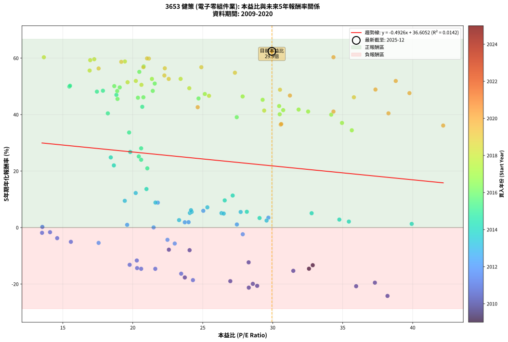
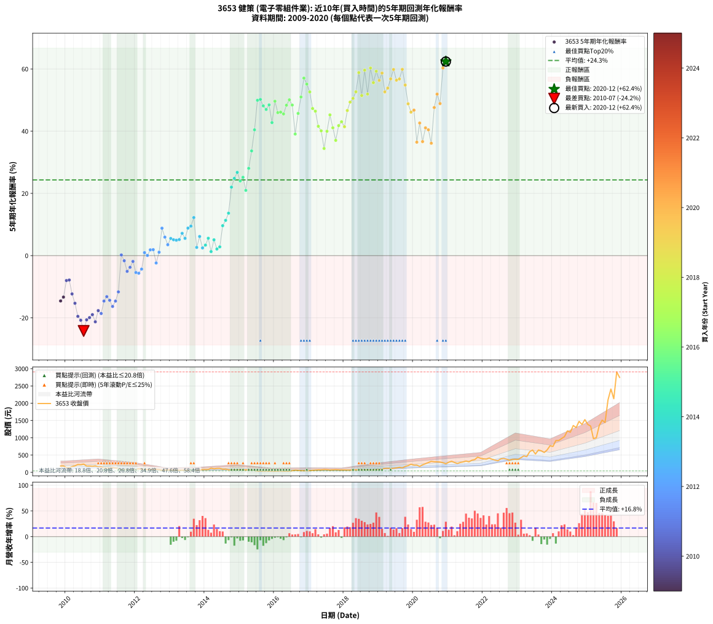

# 3653 健策 - 本益比與未來報酬率分析

!!! info "報告資訊"
    - **股票代號**: 3653
    - **公司名稱**: 健策
    - **產業別**: 電子零組件業
    - **分析期間**: 2009-2020 (134 個數據點)
    - **資料來源**: Type 12 (ShowMonthlyK_ChartFlow) 月收盤價與本益比
    - **報酬率口徑**: 含現金股利 (簡化: 年度合計，假設每年7/1入帳)
    - **報告生成時間**: 2026-01-13 13:45:08 CST

## 📈 視覺化圖表

### 圖表1: 本益比 vs 未來報酬率關係

*圖表1：3653 健策 本益比與5年期未來報酬率關係 (2009-2020)*

### 圖表2: 歷年買入時點的5年期實際報酬率

*圖表2：3653 健策 歷年買入時點的5年期實際報酬率 (2009-2020)*

## 📍 買點訊號說明

本報告提供兩種買點提示訊號（顯示於圖表2的股價子圖中）：

### ▲ 小綠色三角形（回測驗證）
- **計算方式**: 使用全部歷史資料計算本益比第25百分位數
- **用途**: 事後驗證，顯示歷史上哪些時點確實為低估區
- **限制**: 當下無法判斷，僅供回測參考
- **特性**: 後見之明（Look-Ahead Bias）

### ▲ 小橘色三角形（即時訊號）
- **計算方式**: 使用截至當月的過去5年資料計算本益比第25百分位數
- **用途**: 實際投資決策，當時即可判斷
- **優勢**: 可操作性強，符合實務需求
- **特性**: 無後見之明，滾動窗口計算

!!! tip "如何使用兩種訊號"
    - **綠色▲** 幫助理解歷史估值機會，驗證策略有效性
    - **橘色▲** 可作為實際買進參考，但仍需搭配基本面分析
    - 兩種訊號重疊時，表示即時判斷與事後驗證一致，信心度較高
    - 僅有綠色▲時，表示當時無法判斷（需要未來資料才能確認）
    - 僅有橘色▲時，表示即時判斷為買點，但事後可能不是最佳時機

## 📊 估值分析摘要

| 指標 | 數值 |
|:---:|:---:|
| **目前本益比** (2020-12) | **29.94 倍** |
| **歷史平均本益比** | 24.91 倍 |
| **估值水準** | 🔴 相對高估 |
| **預期5年年化報酬率** | **+21.86%** |
| **歷史平均報酬率** | +24.34% |
| **相關係數 (R²)** | 0.0142 |
| **趨勢線斜率** | -0.4926 |

!!! abstract "核心洞察"
    目前本益比顯著高於歷史平均，預期未來報酬率可能較低

    根據歷史數據回測，3653 健策 在目前本益比 **29.9倍** 的估值水準下，
    預期未來5年年化報酬率約為 **+21.9%**。

    **重要提醒**: 本分析基於歷史數據統計，實際報酬率會受到公司基本面變化、產業趨勢、
    總體經濟環境等多重因素影響。R² = 0.01 表示本益比可解釋約 1.4% 的報酬率變異。

## 📈 歷史估值統計

### 最佳買點 (最高報酬率)

| 項目 | 數值 |
|:---:|:---:|
| 起始時間 | 2020-12 |
| 當時本益比 | 29.94 倍 |
| 起始價格 | 247.5 元 |
| 5年後價格 | 2745.0 元 |
| **5年年化報酬率** | **+62.38%** |

### 最差買點 (最低報酬率)

| 項目 | 數值 |
|:---:|:---:|
| 起始時間 | 2010-07 |
| 當時本益比 | 38.20 倍 |
| 起始價格 | 238.0 元 |
| 5年後價格 | 44.0 元 |
| **5年年化報酬率** | **-24.21%** |

## 🎯 投資啟示

### 本益比與報酬率關係

趨勢線方程式: **y = -0.4926x + 36.6052**

!!! note "負相關"
    本益比與未來報酬率呈現負相關。較低的本益比通常帶來較高的未來報酬率，
    但相關性不算非常強。**估值仍是重要參考指標之一**。

### 估值區間建議

基於歷史數據分析:

- **🟢 低估區** (P/E < 19.9): 預期報酬率較高，可考慮增加持股
- **🟡 合理區** (P/E 19.9-29.9): 預期報酬率符合長期趨勢，正常持有
- **🔴 高估區** (P/E > 29.9): 預期報酬率較低，可考慮減碼或觀望

!!! danger "風險提示"
    - 過去表現不代表未來結果
    - 本分析假設公司基本面無重大結構性變化
    - 產業環境劇變可能使歷史規律失效
    - 應結合公司財報、產業趨勢、總體經濟等多重因素綜合判斷

!!! success "長期投資觀點"
    歷史數據顯示，在合理或低估的估值水準買入並長期持有，
    往往能獲得較佳的投資報酬。**耐心等待好價格**是價值投資的核心原則。

## 📊 數據品質

- **資料來源**: GoodInfo.tw Type 12 (ShowMonthlyK_ChartFlow)
- **資料頻率**: 月度收盤價與本益比
- **回測期間**: 2009-2020
- **數據點數量**: 134 個 (每個點代表一次5年期回測)

### 計算方法說明

1. **5年期年化報酬率**:
   - 對每個歷史時點，計算其後5年的實際投資報酬率
   - 期末價值(不含股利): 期末價格
   - 期末價值(含現金股利): 期末價格 + 持有期間內的現金股利合計 (簡化: 年度合計，假設每年7/1入帳)
   - 公式: 年化報酬率 = [(期末價值/期初價格)^(1/年數) - 1] × 100%

2. **本益比 (P/E Ratio)**:
   - 使用當時的月收盤價與EPS計算
   - 資料來源: Type 12 月度河流圖本益比數據

3. **趨勢線 (Linear Regression)**:
   - 使用最小平方法擬合線性趨勢線
   - R²值衡量本益比對報酬率的解釋能力

---

*本報告由 Stock Analysis System v1.9.0 自動生成*
*數據更新時間: 2026-01-13 13:45:08 CST*

## 📋 月度回測明細表

（每一列對應時間線圖中的一個買入點；可用來對照 SVG 圖上的每個點。）

| 買入月份 | 賣出月份 | 回測期限_年 | 實際持有年數 | 買入本益比_倍 | 買入收盤價_元 | 賣出收盤價_元 | 現金股利合計_元 | 總報酬率_pct | 年化報酬率_pct |
| --- | --- | --- | --- | --- | --- | --- | --- | --- | --- |
| 2009-11 | 2014-11 | 5 | 4.999 | 32.59 | 183.50 | 68.90 | 14.61 | -54.49 | -14.57 |
| 2009-12 | 2014-12 | 5 | 4.999 | 32.86 | 185.00 | 75.90 | 14.61 | -51.08 | -13.32 |
| 2010-01 | 2015-01 | 5 | 4.999 | 24.06 | 137.50 | 76.00 | 14.61 | -34.10 | -8.00 |
| 2010-02 | 2015-02 | 5 | 4.999 | 22.58 | 131.00 | 72.50 | 14.61 | -33.50 | -7.84 |
| 2010-03 | 2015-03 | 5 | 4.999 | 28.28 | 166.50 | 71.70 | 14.61 | -48.16 | -12.32 |
| 2010-04 | 2015-04 | 5 | 4.999 | 31.47 | 188.00 | 67.30 | 14.61 | -56.43 | -15.31 |
| 2010-05 | 2015-05 | 5 | 4.999 | 37.30 | 226.00 | 61.70 | 14.61 | -66.23 | -19.52 |
| 2010-06 | 2015-06 | 5 | 4.999 | 35.96 | 221.00 | 54.40 | 14.61 | -68.77 | -20.77 |
| 2010-07 | 2015-07 | 5 | 4.999 | 38.20 | 238.00 | 44.00 | 15.52 | -74.99 | -24.21 |
| 2010-08 | 2015-08 | 5 | 4.999 | 28.89 | 182.50 | 41.95 | 15.52 | -68.51 | -20.64 |
| 2010-09 | 2015-09 | 5 | 4.999 | 28.58 | 183.00 | 44.70 | 15.52 | -67.09 | -19.93 |
| 2010-10 | 2015-10 | 5 | 4.999 | 26.97 | 175.00 | 45.60 | 15.52 | -65.07 | -18.97 |
| 2010-11 | 2015-11 | 5 | 4.999 | 28.29 | 186.00 | 40.75 | 15.52 | -69.75 | -21.27 |
| 2010-12 | 2015-12 | 5 | 4.999 | 23.72 | 158.00 | 44.25 | 15.52 | -62.17 | -17.67 |
| 2011-01 | 2016-01 | 5 | 4.999 | 24.30 | 158.50 | 41.10 | 15.52 | -64.28 | -18.61 |
| 2011-02 | 2016-02 | 5 | 4.999 | 20.60 | 131.50 | 44.20 | 15.52 | -54.58 | -14.60 |
| 2011-03 | 2016-03 | 5 | 5.002 | 19.78 | 123.50 | 45.35 | 15.52 | -50.71 | -13.19 |
| 2011-04 | 2016-04 | 5 | 5.002 | 20.31 | 124.00 | 41.60 | 15.52 | -53.93 | -14.35 |
| 2011-05 | 2016-05 | 5 | 5.002 | 23.46 | 140.00 | 41.85 | 15.52 | -59.02 | -16.33 |
| 2011-06 | 2016-06 | 5 | 5.002 | 21.61 | 126.00 | 41.65 | 15.52 | -54.62 | -14.61 |
| 2011-07 | 2016-07 | 5 | 5.002 | 20.29 | 115.50 | 48.10 | 14.02 | -46.21 | -11.66 |
| 2011-08 | 2016-08 | 5 | 5.002 | 13.54 | 75.20 | 62.00 | 14.02 | +1.10 | +0.22 |
| 2011-09 | 2016-09 | 5 | 5.002 | 14.09 | 76.30 | 56.20 | 14.02 | -7.96 | -1.65 |
| 2011-10 | 2016-10 | 5 | 5.002 | 15.58 | 82.20 | 49.40 | 14.02 | -22.84 | -5.05 |
| 2011-11 | 2016-11 | 5 | 5.002 | 14.60 | 75.00 | 47.90 | 14.02 | -17.43 | -3.76 |
| 2011-12 | 2016-12 | 5 | 5.002 | 13.52 | 67.60 | 47.50 | 14.02 | -8.99 | -1.87 |
| 2012-01 | 2017-01 | 5 | 5.002 | 17.56 | 83.80 | 49.35 | 14.02 | -24.37 | -5.43 |
| 2012-02 | 2017-03 | 5 | 5.081 | 23.00 | 104.50 | 63.70 | 14.02 | -25.62 | -5.66 |
| 2012-03 | 2017-03 | 5 | 4.999 | 22.48 | 97.00 | 63.70 | 14.02 | -19.87 | -4.33 |
| 2012-04 | 2017-04 | 5 | 4.999 | 19.60 | 80.10 | 70.00 | 14.02 | +4.90 | +0.96 |
| 2012-05 | 2017-05 | 5 | 4.999 | 21.49 | 82.90 | 69.10 | 14.02 | +0.27 | +0.05 |
| 2012-06 | 2017-06 | 5 | 4.999 | 23.72 | 86.10 | 80.40 | 14.02 | +9.67 | +1.86 |
| 2012-07 | 2017-07 | 5 | 4.999 | 23.99 | 81.60 | 76.70 | 13.01 | +9.94 | +1.91 |
| 2012-08 | 2017-08 | 5 | 4.999 | 27.86 | 88.40 | 65.40 | 13.01 | -11.30 | -2.37 |
| 2012-09 | 2017-09 | 5 | 4.999 | 27.44 | 80.80 | 72.30 | 13.01 | +5.58 | +1.09 |
| 2012-10 | 2017-10 | 5 | 4.999 | 21.79 | 59.20 | 77.30 | 13.01 | +52.55 | +8.81 |
| 2012-11 | 2017-11 | 5 | 4.999 | 25.04 | 62.30 | 70.10 | 13.01 | +33.40 | +5.93 |
| 2012-12 | 2017-12 | 5 | 4.999 | 29.69 | 67.10 | 66.70 | 13.01 | +18.79 | +3.50 |
| 2013-01 | 2018-01 | 5 | 4.999 | 27.71 | 63.70 | 70.30 | 13.01 | +30.78 | +5.51 |
| 2013-02 | 2018-02 | 5 | 4.999 | 26.34 | 61.60 | 66.00 | 13.01 | +28.26 | +5.10 |
| 2013-03 | 2018-03 | 5 | 4.999 | 26.50 | 63.00 | 67.20 | 13.01 | +27.32 | +4.95 |
| 2013-04 | 2018-04 | 5 | 4.999 | 24.08 | 58.20 | 61.80 | 13.01 | +28.54 | +5.15 |
| 2013-05 | 2018-05 | 5 | 4.999 | 25.33 | 62.20 | 74.90 | 13.01 | +41.33 | +7.16 |
| 2013-06 | 2018-06 | 5 | 4.999 | 24.21 | 60.40 | 66.10 | 13.01 | +30.98 | +5.55 |
| 2013-07 | 2018-07 | 5 | 4.999 | 21.62 | 54.80 | 70.70 | 13.00 | +52.74 | +8.84 |
| 2013-08 | 2018-08 | 5 | 4.999 | 19.43 | 50.00 | 65.60 | 13.00 | +57.20 | +9.47 |
| 2013-09 | 2018-09 | 5 | 4.999 | 20.21 | 52.80 | 81.00 | 13.00 | +78.03 | +12.23 |
| 2013-10 | 2018-10 | 5 | 4.999 | 23.31 | 61.80 | 57.40 | 13.00 | +13.92 | +2.64 |
| 2013-11 | 2018-11 | 5 | 4.999 | 24.16 | 65.00 | 74.60 | 13.00 | +34.77 | +6.15 |
| 2013-12 | 2018-12 | 5 | 4.999 | 29.56 | 80.70 | 78.20 | 13.00 | +13.01 | +2.48 |
| 2014-01 | 2019-01 | 5 | 4.999 | 29.06 | 82.00 | 83.80 | 13.00 | +18.05 | +3.37 |
| 2014-02 | 2019-02 | 5 | 4.999 | 28.15 | 82.00 | 94.60 | 13.00 | +31.22 | +5.59 |
| 2014-03 | 2019-03 | 5 | 4.999 | 39.93 | 120.00 | 115.00 | 13.00 | +6.67 | +1.30 |
| 2014-04 | 2019-04 | 5 | 4.999 | 32.78 | 101.50 | 117.00 | 13.00 | +28.08 | +5.07 |
| 2014-05 | 2019-05 | 5 | 4.999 | 35.44 | 113.00 | 112.50 | 13.00 | +11.06 | +2.12 |
| 2014-06 | 2019-06 | 5 | 4.999 | 34.76 | 114.00 | 118.00 | 13.00 | +14.91 | +2.82 |
| 2014-07 | 2019-07 | 5 | 4.999 | 26.57 | 89.60 | 128.00 | 13.83 | +58.29 | +9.62 |
| 2014-08 | 2019-08 | 5 | 4.999 | 27.14 | 94.00 | 147.00 | 13.83 | +71.09 | +11.34 |
| 2014-09 | 2019-09 | 5 | 4.999 | 20.98 | 74.60 | 127.50 | 13.83 | +89.45 | +13.63 |
| 2014-10 | 2019-10 | 5 | 4.999 | 18.65 | 68.00 | 170.00 | 13.83 | +170.34 | +22.01 |
| 2014-11 | 2019-11 | 5 | 4.999 | 18.43 | 68.90 | 195.00 | 13.83 | +203.09 | +24.83 |
| 2014-12 | 2019-12 | 5 | 4.999 | 19.82 | 75.90 | 234.50 | 13.83 | +227.18 | +26.76 |
| 2015-01 | 2020-01 | 5 | 4.999 | 20.60 | 76.00 | 209.00 | 13.83 | +193.19 | +24.01 |
| 2015-02 | 2020-02 | 5 | 4.999 | 20.43 | 72.50 | 209.00 | 13.83 | +207.35 | +25.18 |
| 2015-03 | 2020-03 | 5 | 5.002 | 21.04 | 71.70 | 172.00 | 13.83 | +159.17 | +20.97 |
| 2015-04 | 2020-04 | 5 | 5.002 | 20.60 | 67.30 | 218.00 | 13.83 | +244.47 | +28.05 |
| 2015-05 | 2020-05 | 5 | 5.002 | 19.74 | 61.70 | 249.50 | 13.83 | +326.79 | +33.66 |
| 2015-06 | 2020-06 | 5 | 5.002 | 18.22 | 54.40 | 283.50 | 13.83 | +446.56 | +40.43 |
| 2015-07 | 2020-07 | 5 | 5.002 | 15.47 | 44.00 | 318.50 | 15.03 | +658.02 | +49.92 |
| 2015-08 | 2020-08 | 5 | 5.002 | 15.52 | 41.95 | 306.00 | 15.03 | +665.26 | +50.21 |
| 2015-09 | 2020-09 | 5 | 5.002 | 17.44 | 44.70 | 304.00 | 15.03 | +613.71 | +48.13 |
| 2015-10 | 2020-10 | 5 | 5.002 | 18.83 | 45.60 | 298.00 | 15.03 | +586.46 | +46.98 |
| 2015-11 | 2020-11 | 5 | 5.002 | 17.87 | 40.75 | 279.00 | 15.03 | +621.54 | +48.45 |
| 2015-12 | 2020-12 | 5 | 5.002 | 20.68 | 44.25 | 247.50 | 15.03 | +493.28 | +42.75 |
| 2016-01 | 2021-01 | 5 | 5.002 | 19.07 | 41.10 | 293.50 | 15.03 | +650.68 | +49.63 |
| 2016-02 | 2021-03 | 5 | 5.081 | 20.37 | 44.20 | 287.00 | 15.03 | +583.32 | +45.97 |
| 2016-03 | 2021-03 | 5 | 4.999 | 20.76 | 45.35 | 287.00 | 15.03 | +565.99 | +46.12 |
| 2016-04 | 2021-04 | 5 | 4.999 | 18.91 | 41.60 | 256.50 | 15.03 | +552.71 | +45.53 |
| 2016-05 | 2021-05 | 5 | 4.999 | 18.89 | 41.85 | 285.50 | 15.03 | +618.11 | +48.34 |
| 2016-06 | 2021-06 | 5 | 4.999 | 18.68 | 41.65 | 302.00 | 15.03 | +661.17 | +50.08 |
| 2016-07 | 2021-07 | 5 | 4.999 | 21.43 | 48.10 | 327.50 | 18.53 | +619.40 | +48.39 |
| 2016-08 | 2021-08 | 5 | 4.999 | 27.43 | 62.00 | 304.00 | 18.53 | +420.21 | +39.08 |
| 2016-09 | 2021-09 | 5 | 4.999 | 24.70 | 56.20 | 350.50 | 18.53 | +556.64 | +45.71 |
| 2016-10 | 2021-10 | 5 | 4.999 | 21.57 | 49.40 | 369.00 | 18.53 | +684.47 | +50.99 |
| 2016-11 | 2021-11 | 5 | 4.999 | 20.78 | 47.90 | 439.00 | 18.53 | +855.18 | +57.05 |
| 2016-12 | 2021-12 | 5 | 4.999 | 20.47 | 47.50 | 408.00 | 18.53 | +797.96 | +55.12 |
| 2017-01 | 2022-01 | 5 | 4.999 | 21.37 | 49.35 | 390.00 | 18.53 | +727.82 | +52.62 |
| 2017-02 | 2022-02 | 5 | 4.999 | 25.15 | 57.80 | 382.00 | 18.53 | +592.96 | +47.29 |
| 2017-03 | 2022-03 | 5 | 4.999 | 27.85 | 63.70 | 410.00 | 18.53 | +572.73 | +46.42 |
| 2017-04 | 2022-04 | 5 | 4.999 | 30.75 | 70.00 | 379.50 | 18.53 | +468.61 | +41.57 |
| 2017-05 | 2022-05 | 5 | 4.999 | 30.50 | 69.10 | 354.50 | 18.53 | +439.84 | +40.11 |
| 2017-06 | 2022-06 | 5 | 4.999 | 35.65 | 80.40 | 334.50 | 18.53 | +339.09 | +34.44 |
| 2017-07 | 2022-07 | 5 | 4.999 | 34.18 | 76.70 | 389.50 | 22.53 | +437.19 | +39.97 |
| 2017-08 | 2022-08 | 5 | 4.999 | 29.28 | 65.40 | 400.00 | 22.53 | +546.06 | +45.24 |
| 2017-09 | 2022-09 | 5 | 4.999 | 32.53 | 72.30 | 381.50 | 22.53 | +458.82 | +41.08 |
| 2017-10 | 2022-10 | 5 | 4.999 | 34.95 | 77.30 | 351.00 | 22.53 | +383.22 | +37.04 |
| 2017-11 | 2022-11 | 5 | 4.999 | 31.85 | 70.10 | 379.00 | 22.53 | +472.79 | +41.78 |
| 2017-12 | 2022-12 | 5 | 4.999 | 30.46 | 66.70 | 376.50 | 22.53 | +498.24 | +43.02 |
| 2018-01 | 2023-01 | 5 | 4.999 | 29.39 | 70.30 | 375.00 | 22.53 | +465.47 | +41.42 |
| 2018-02 | 2023-02 | 5 | 4.999 | 25.45 | 66.00 | 425.00 | 22.53 | +578.07 | +46.65 |
| 2018-03 | 2023-03 | 5 | 4.999 | 24.04 | 67.20 | 476.50 | 22.53 | +642.60 | +49.34 |
| 2018-04 | 2023-04 | 5 | 4.999 | 20.62 | 61.80 | 455.00 | 22.53 | +672.70 | +50.53 |
| 2018-05 | 2023-05 | 5 | 4.999 | 23.42 | 74.90 | 598.00 | 22.53 | +728.47 | +52.64 |
| 2018-06 | 2023-06 | 5 | 4.999 | 19.44 | 66.10 | 645.00 | 22.53 | +909.87 | +58.81 |
| 2018-07 | 2023-07 | 5 | 4.999 | 19.63 | 70.70 | 531.00 | 32.19 | +696.59 | +51.45 |
| 2018-08 | 2023-08 | 5 | 4.999 | 17.25 | 65.60 | 647.00 | 32.19 | +935.34 | +59.60 |
| 2018-09 | 2023-09 | 5 | 4.999 | 20.22 | 81.00 | 623.00 | 32.19 | +708.87 | +51.92 |
| 2018-10 | 2023-10 | 5 | 4.999 | 13.65 | 57.40 | 575.00 | 32.19 | +957.82 | +60.29 |
| 2018-11 | 2023-11 | 5 | 4.999 | 16.92 | 74.60 | 648.00 | 32.19 | +811.78 | +55.60 |
| 2018-12 | 2023-12 | 5 | 4.999 | 16.96 | 78.20 | 769.00 | 32.19 | +924.53 | +59.27 |
| 2019-01 | 2024-01 | 5 | 4.999 | 17.56 | 83.80 | 750.00 | 32.19 | +833.40 | +56.33 |
| 2019-02 | 2024-02 | 5 | 4.999 | 19.18 | 94.60 | 919.00 | 32.19 | +905.48 | +58.67 |
| 2019-03 | 2024-03 | 5 | 5.002 | 22.57 | 115.00 | 921.00 | 32.19 | +728.86 | +52.62 |
| 2019-04 | 2024-04 | 5 | 5.002 | 22.26 | 117.00 | 977.00 | 32.19 | +762.55 | +53.84 |
| 2019-05 | 2024-05 | 5 | 5.002 | 20.76 | 112.50 | 1035.00 | 32.19 | +848.61 | +56.80 |
| 2019-06 | 2024-06 | 5 | 5.002 | 21.15 | 118.00 | 1200.00 | 32.19 | +944.23 | +59.84 |
| 2019-07 | 2024-07 | 5 | 5.002 | 22.29 | 128.00 | 1160.00 | 38.51 | +836.34 | +56.39 |
| 2019-08 | 2024-08 | 5 | 5.002 | 24.90 | 147.00 | 1355.00 | 38.51 | +847.97 | +56.78 |
| 2019-09 | 2024-09 | 5 | 5.002 | 21.02 | 127.50 | 1295.00 | 38.51 | +945.89 | +59.89 |
| 2019-10 | 2024-10 | 5 | 5.002 | 27.30 | 170.00 | 1475.00 | 38.51 | +790.30 | +54.82 |
| 2019-11 | 2024-11 | 5 | 5.002 | 30.52 | 195.00 | 1385.00 | 38.51 | +630.01 | +48.80 |
| 2019-12 | 2024-12 | 5 | 5.002 | 35.80 | 234.50 | 1525.00 | 38.51 | +566.74 | +46.12 |
| 2020-01 | 2025-01 | 5 | 5.002 | 31.23 | 209.00 | 1385.00 | 38.51 | +581.11 | +46.75 |
| 2020-02 | 2025-03 | 5 | 5.081 | 30.57 | 209.00 | 976.00 | 38.51 | +385.41 | +36.47 |
| 2020-03 | 2025-03 | 5 | 4.999 | 24.64 | 172.00 | 976.00 | 38.51 | +489.83 | +42.62 |
| 2020-04 | 2025-04 | 5 | 4.999 | 30.61 | 218.00 | 1000.00 | 38.51 | +376.38 | +36.65 |
| 2020-05 | 2025-05 | 5 | 4.999 | 34.34 | 249.50 | 1355.00 | 38.51 | +458.52 | +41.07 |
| 2020-06 | 2025-06 | 5 | 4.999 | 38.27 | 283.50 | 1510.00 | 38.51 | +446.21 | +40.44 |
| 2020-07 | 2025-07 | 5 | 4.999 | 42.18 | 318.50 | 1440.00 | 48.01 | +367.19 | +36.12 |
| 2020-08 | 2025-08 | 5 | 4.999 | 39.77 | 306.00 | 2095.00 | 48.01 | +600.33 | +47.60 |
| 2020-09 | 2025-09 | 5 | 4.999 | 38.79 | 304.00 | 2410.00 | 48.01 | +708.56 | +51.90 |
| 2020-10 | 2025-10 | 5 | 4.999 | 37.34 | 298.00 | 2130.00 | 48.01 | +630.88 | +48.86 |
| 2020-11 | 2025-11 | 5 | 4.999 | 34.34 | 279.00 | 2905.00 | 48.01 | +958.43 | +60.31 |
| 2020-12 | 2025-12 | 5 | 4.999 | 29.94 | 247.50 | 2745.00 | 48.01 | +1028.49 | +62.38 |
