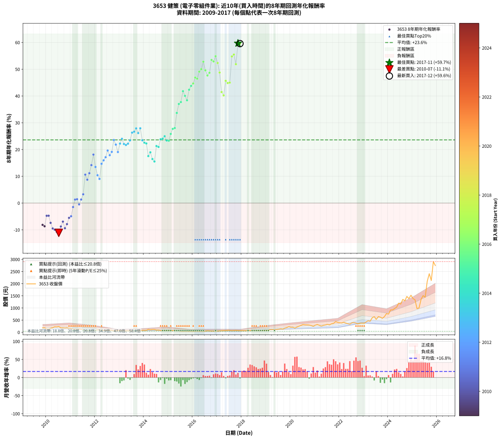

# 3653 健策 - 本益比與未來報酬率分析

!!! info "報告資訊"
    - **股票代號**: 3653
    - **公司名稱**: 健策
    - **產業別**: 電子零組件業
    - **分析期間**: 2009-2017 (98 個數據點)
    - **資料來源**: Type 12 (ShowMonthlyK_ChartFlow) 月收盤價與本益比
    - **報酬率口徑**: 含現金股利 (簡化: 年度合計，假設每年7/1入帳)
    - **報告生成時間**: 2026-01-05 21:04:10 CST

## 📈 視覺化圖表

### 圖表1: 本益比 vs 未來報酬率關係

*圖表1：3653 健策 本益比與8年期未來報酬率關係 (2009-2017)*

### 圖表2: 歷年買入時點的8年期實際報酬率

*圖表2：3653 健策 歷年買入時點的8年期實際報酬率 (2009-2017)*

## 📍 買點訊號說明

本報告提供兩種買點提示訊號（顯示於圖表2的股價子圖中）：

### ▲ 小綠色三角形（回測驗證）
- **計算方式**: 使用全部歷史資料計算本益比第25百分位數
- **用途**: 事後驗證，顯示歷史上哪些時點確實為低估區
- **限制**: 當下無法判斷，僅供回測參考
- **特性**: 後見之明（Look-Ahead Bias）

### ▲ 小橘色三角形（即時訊號）
- **計算方式**: 使用截至當月的過去5年資料計算本益比第25百分位數
- **用途**: 實際投資決策，當時即可判斷
- **優勢**: 可操作性強，符合實務需求
- **特性**: 無後見之明，滾動窗口計算

!!! tip "如何使用兩種訊號"
    - **綠色▲** 幫助理解歷史估值機會，驗證策略有效性
    - **橘色▲** 可作為實際買進參考，但仍需搭配基本面分析
    - 兩種訊號重疊時，表示即時判斷與事後驗證一致，信心度較高
    - 僅有綠色▲時，表示當時無法判斷（需要未來資料才能確認）
    - 僅有橘色▲時，表示即時判斷為買點，但事後可能不是最佳時機

## 📊 估值分析摘要

| 指標 | 數值 |
|:---:|:---:|
| **目前本益比** (2017-12) | **30.46 倍** |
| **歷史平均本益比** | 24.42 倍 |
| **估值水準** | 🔴 相對高估 |
| **預期8年年化報酬率** | **+20.42%** |
| **歷史平均報酬率** | +23.61% |
| **相關係數 (R²)** | 0.0252 |
| **趨勢線斜率** | -0.5284 |

!!! abstract "核心洞察"
    目前本益比顯著高於歷史平均，預期未來報酬率可能較低

    根據歷史數據回測，3653 健策 在目前本益比 **30.5倍** 的估值水準下，
    預期未來8年年化報酬率約為 **+20.4%**。

    **重要提醒**: 本分析基於歷史數據統計，實際報酬率會受到公司基本面變化、產業趨勢、
    總體經濟環境等多重因素影響。R² = 0.03 表示本益比可解釋約 2.5% 的報酬率變異。

## 📈 歷史估值統計

### 最佳買點 (最高報酬率)

| 項目 | 數值 |
|:---:|:---:|
| 起始時間 | 2017-11 |
| 當時本益比 | 31.85 倍 |
| 起始價格 | 70.1 元 |
| 8年後價格 | 2905.0 元 |
| **8年年化報酬率** | **+59.68%** |

### 最差買點 (最低報酬率)

| 項目 | 數值 |
|:---:|:---:|
| 起始時間 | 2010-07 |
| 當時本益比 | 38.20 倍 |
| 起始價格 | 238.0 元 |
| 8年後價格 | 70.7 元 |
| **8年年化報酬率** | **-11.12%** |

## 🎯 投資啟示

### 本益比與報酬率關係

趨勢線方程式: **y = -0.5284x + 36.5154**

!!! warning "強負相關"
    本益比與未來報酬率呈現強負相關。在高本益比時期買入，未來報酬率顯著較低；
    在低本益比時期買入，未來報酬率顯著較高。**估值紀律至關重要**。

### 估值區間建議

基於歷史數據分析:

- **🟢 低估區** (P/E < 19.5): 預期報酬率較高，可考慮增加持股
- **🟡 合理區** (P/E 19.5-29.3): 預期報酬率符合長期趨勢，正常持有
- **🔴 高估區** (P/E > 29.3): 預期報酬率較低，可考慮減碼或觀望

!!! danger "風險提示"
    - 過去表現不代表未來結果
    - 本分析假設公司基本面無重大結構性變化
    - 產業環境劇變可能使歷史規律失效
    - 應結合公司財報、產業趨勢、總體經濟等多重因素綜合判斷

!!! success "長期投資觀點"
    歷史數據顯示，在合理或低估的估值水準買入並長期持有，
    往往能獲得較佳的投資報酬。**耐心等待好價格**是價值投資的核心原則。

## 📊 數據品質

- **資料來源**: GoodInfo.tw Type 12 (ShowMonthlyK_ChartFlow)
- **資料頻率**: 月度收盤價與本益比
- **回測期間**: 2009-2017
- **數據點數量**: 98 個 (每個點代表一次8年期回測)

### 計算方法說明

1. **8年期年化報酬率**:
   - 對每個歷史時點，計算其後8年的實際投資報酬率
   - 期末價值(不含股利): 期末價格
   - 期末價值(含現金股利): 期末價格 + 持有期間內的現金股利合計 (簡化: 年度合計，假設每年7/1入帳)
   - 公式: 年化報酬率 = [(期末價值/期初價格)^(1/年數) - 1] × 100%

2. **本益比 (P/E Ratio)**:
   - 使用當時的月收盤價與EPS計算
   - 資料來源: Type 12 月度河流圖本益比數據

3. **趨勢線 (Linear Regression)**:
   - 使用最小平方法擬合線性趨勢線
   - R²值衡量本益比對報酬率的解釋能力

---

*本報告由 Stock Analysis System v1.9.0 自動生成*
*數據更新時間: 2026-01-05 21:04:10 CST*

## 📋 月度回測明細表

（每一列對應時間線圖中的一個買入點；可用來對照 SVG 圖上的每個點。）

| 買入月份 | 賣出月份 | 回測期限_年 | 實際持有年數 | 買入本益比_倍 | 買入收盤價_元 | 賣出收盤價_元 | 現金股利合計_元 | 總報酬率_pct | 年化報酬率_pct |
| --- | --- | --- | --- | --- | --- | --- | --- | --- | --- |
| 2009-11 | 2017-11 | 8 | 8.000 | 32.59 | 183.50 | 70.10 | 22.91 | -49.31 | -8.14 |
| 2009-12 | 2017-12 | 8 | 8.000 | 32.86 | 185.00 | 66.70 | 22.91 | -51.56 | -8.66 |
| 2010-01 | 2018-01 | 8 | 8.000 | 24.06 | 137.50 | 70.30 | 22.91 | -32.21 | -4.74 |
| 2010-02 | 2018-02 | 8 | 8.000 | 22.58 | 131.00 | 66.00 | 22.91 | -32.13 | -4.73 |
| 2010-03 | 2018-03 | 8 | 8.000 | 28.28 | 166.50 | 67.20 | 22.91 | -45.88 | -7.39 |
| 2010-04 | 2018-04 | 8 | 8.000 | 31.47 | 188.00 | 61.80 | 22.91 | -54.94 | -9.48 |
| 2010-05 | 2018-05 | 8 | 8.000 | 37.30 | 226.00 | 74.90 | 22.91 | -56.72 | -9.94 |
| 2010-06 | 2018-06 | 8 | 8.000 | 35.96 | 221.00 | 66.10 | 22.91 | -59.72 | -10.75 |
| 2010-07 | 2018-07 | 8 | 8.000 | 38.20 | 238.00 | 70.70 | 22.02 | -61.04 | -11.12 |
| 2010-08 | 2018-08 | 8 | 8.000 | 28.89 | 182.50 | 65.60 | 22.02 | -51.99 | -8.76 |
| 2010-09 | 2018-09 | 8 | 8.000 | 28.58 | 183.00 | 81.00 | 22.02 | -43.70 | -6.93 |
| 2010-10 | 2018-10 | 8 | 8.000 | 26.97 | 175.00 | 57.40 | 22.02 | -54.61 | -9.40 |
| 2010-11 | 2018-11 | 8 | 8.000 | 28.29 | 186.00 | 74.60 | 22.02 | -48.05 | -7.86 |
| 2010-12 | 2018-12 | 8 | 8.000 | 23.72 | 158.00 | 78.20 | 22.02 | -36.57 | -5.53 |
| 2011-01 | 2019-01 | 8 | 8.000 | 24.30 | 158.50 | 83.80 | 22.02 | -33.23 | -4.92 |
| 2011-02 | 2019-02 | 8 | 8.000 | 20.60 | 131.50 | 94.60 | 22.02 | -11.31 | -1.49 |
| 2011-03 | 2019-03 | 8 | 8.000 | 19.78 | 123.50 | 115.00 | 22.02 | +10.95 | +1.31 |
| 2011-04 | 2019-04 | 8 | 8.000 | 20.31 | 124.00 | 117.00 | 22.02 | +12.12 | +1.44 |
| 2011-05 | 2019-05 | 8 | 8.000 | 23.46 | 140.00 | 112.50 | 22.02 | -3.91 | -0.50 |
| 2011-06 | 2019-06 | 8 | 8.000 | 21.61 | 126.00 | 118.00 | 22.02 | +11.13 | +1.33 |
| 2011-07 | 2019-07 | 8 | 8.000 | 20.29 | 115.50 | 128.00 | 21.55 | +29.48 | +3.28 |
| 2011-08 | 2019-08 | 8 | 8.000 | 13.54 | 75.20 | 147.00 | 21.55 | +124.14 | +10.62 |
| 2011-09 | 2019-09 | 8 | 8.000 | 14.09 | 76.30 | 127.50 | 21.55 | +95.35 | +8.73 |
| 2011-10 | 2019-10 | 8 | 8.000 | 15.58 | 82.20 | 170.00 | 21.55 | +133.03 | +11.15 |
| 2011-11 | 2019-11 | 8 | 8.000 | 14.60 | 75.00 | 195.00 | 21.55 | +188.74 | +14.17 |
| 2011-12 | 2019-12 | 8 | 8.000 | 13.52 | 67.60 | 234.50 | 21.55 | +278.78 | +18.11 |
| 2012-01 | 2020-01 | 8 | 8.000 | 17.56 | 83.80 | 209.00 | 21.55 | +175.12 | +13.49 |
| 2012-02 | 2020-02 | 8 | 8.000 | 23.00 | 104.50 | 209.00 | 21.55 | +120.62 | +10.40 |
| 2012-03 | 2020-03 | 8 | 8.000 | 22.48 | 97.00 | 172.00 | 21.55 | +99.54 | +9.02 |
| 2012-04 | 2020-04 | 8 | 8.000 | 19.60 | 80.10 | 218.00 | 21.55 | +199.07 | +14.68 |
| 2012-05 | 2020-05 | 8 | 8.000 | 21.49 | 82.90 | 249.50 | 21.55 | +226.96 | +15.96 |
| 2012-06 | 2020-06 | 8 | 8.000 | 23.72 | 86.10 | 283.50 | 21.55 | +254.30 | +17.13 |
| 2012-07 | 2020-07 | 8 | 8.000 | 23.99 | 81.60 | 318.50 | 23.54 | +319.16 | +19.62 |
| 2012-08 | 2020-08 | 8 | 8.000 | 27.86 | 88.40 | 306.00 | 23.54 | +272.78 | +17.88 |
| 2012-09 | 2020-09 | 8 | 8.000 | 27.44 | 80.80 | 304.00 | 23.54 | +305.37 | +19.12 |
| 2012-10 | 2020-10 | 8 | 8.000 | 21.79 | 59.20 | 298.00 | 23.54 | +443.14 | +23.56 |
| 2012-11 | 2020-11 | 8 | 8.000 | 25.04 | 62.30 | 279.00 | 23.54 | +385.61 | +21.84 |
| 2012-12 | 2020-12 | 8 | 8.000 | 29.69 | 67.10 | 247.50 | 23.54 | +303.93 | +19.07 |
| 2013-01 | 2021-01 | 8 | 8.000 | 27.71 | 63.70 | 293.50 | 23.54 | +397.70 | +22.21 |
| 2013-02 | 2021-02 | 8 | 8.000 | 26.34 | 61.60 | 321.00 | 23.54 | +459.31 | +24.01 |
| 2013-03 | 2021-03 | 8 | 8.000 | 26.50 | 63.00 | 287.00 | 23.54 | +392.92 | +22.07 |
| 2013-04 | 2021-04 | 8 | 8.000 | 24.08 | 58.20 | 256.50 | 23.54 | +381.16 | +21.70 |
| 2013-05 | 2021-05 | 8 | 8.000 | 25.33 | 62.20 | 285.50 | 23.54 | +396.84 | +22.19 |
| 2013-06 | 2021-06 | 8 | 8.000 | 24.21 | 60.40 | 302.00 | 23.54 | +438.97 | +23.44 |
| 2013-07 | 2021-07 | 8 | 8.000 | 21.62 | 54.80 | 327.50 | 27.53 | +547.86 | +26.31 |
| 2013-08 | 2021-08 | 8 | 8.000 | 19.43 | 50.00 | 304.00 | 27.53 | +563.06 | +26.68 |
| 2013-09 | 2021-09 | 8 | 8.000 | 20.21 | 52.80 | 350.50 | 27.53 | +615.96 | +27.90 |
| 2013-10 | 2021-10 | 8 | 8.000 | 23.31 | 61.80 | 369.00 | 27.53 | +541.63 | +26.16 |
| 2013-11 | 2021-11 | 8 | 8.000 | 24.16 | 65.00 | 439.00 | 27.53 | +617.74 | +27.94 |
| 2013-12 | 2021-12 | 8 | 8.000 | 29.56 | 80.70 | 408.00 | 27.53 | +439.69 | +23.46 |
| 2014-01 | 2022-01 | 8 | 8.000 | 29.06 | 82.00 | 390.00 | 27.53 | +409.18 | +22.56 |
| 2014-02 | 2022-02 | 8 | 8.000 | 28.15 | 82.00 | 382.00 | 27.53 | +399.43 | +22.27 |
| 2014-03 | 2022-03 | 8 | 8.000 | 39.93 | 120.00 | 410.00 | 27.53 | +264.61 | +17.55 |
| 2014-04 | 2022-04 | 8 | 8.000 | 32.78 | 101.50 | 379.50 | 27.53 | +301.01 | +18.96 |
| 2014-05 | 2022-05 | 8 | 8.000 | 35.44 | 113.00 | 354.50 | 27.53 | +238.08 | +16.45 |
| 2014-06 | 2022-06 | 8 | 8.000 | 34.76 | 114.00 | 334.50 | 27.53 | +217.57 | +15.54 |
| 2014-07 | 2022-07 | 8 | 8.000 | 26.57 | 89.60 | 389.50 | 30.83 | +369.11 | +21.31 |
| 2014-08 | 2022-08 | 8 | 8.000 | 27.14 | 94.00 | 400.00 | 30.83 | +358.33 | +20.96 |
| 2014-09 | 2022-09 | 8 | 8.000 | 20.98 | 74.60 | 381.50 | 30.83 | +452.72 | +23.83 |
| 2014-10 | 2022-10 | 8 | 8.000 | 18.65 | 68.00 | 351.00 | 30.83 | +461.51 | +24.07 |
| 2014-11 | 2022-11 | 8 | 8.000 | 18.43 | 68.90 | 379.00 | 30.83 | +494.81 | +24.97 |
| 2014-12 | 2022-12 | 8 | 8.000 | 19.82 | 75.90 | 376.50 | 30.83 | +436.66 | +23.37 |
| 2015-01 | 2023-01 | 8 | 8.000 | 20.60 | 76.00 | 375.00 | 30.83 | +433.98 | +23.29 |
| 2015-02 | 2023-02 | 8 | 8.000 | 20.43 | 72.50 | 425.00 | 30.83 | +528.73 | +25.84 |
| 2015-03 | 2023-03 | 8 | 8.000 | 21.04 | 71.70 | 476.50 | 30.83 | +607.57 | +27.71 |
| 2015-04 | 2023-04 | 8 | 8.000 | 20.60 | 67.30 | 455.00 | 30.83 | +621.88 | +28.03 |
| 2015-05 | 2023-05 | 8 | 8.000 | 19.74 | 61.70 | 598.00 | 30.83 | +919.17 | +33.67 |
| 2015-06 | 2023-06 | 8 | 8.000 | 18.22 | 54.40 | 645.00 | 30.83 | +1142.33 | +37.02 |
| 2015-07 | 2023-07 | 8 | 8.000 | 15.47 | 44.00 | 531.00 | 38.69 | +1194.74 | +37.73 |
| 2015-08 | 2023-08 | 8 | 8.000 | 15.52 | 41.95 | 647.00 | 38.69 | +1534.53 | +41.80 |
| 2015-09 | 2023-09 | 8 | 8.000 | 17.44 | 44.70 | 623.00 | 38.69 | +1380.28 | +40.05 |
| 2015-10 | 2023-10 | 8 | 8.000 | 18.83 | 45.60 | 575.00 | 38.69 | +1245.80 | +38.40 |
| 2015-11 | 2023-11 | 8 | 8.000 | 17.87 | 40.75 | 648.00 | 38.69 | +1585.12 | +42.34 |
| 2015-12 | 2023-12 | 8 | 8.000 | 20.68 | 44.25 | 769.00 | 38.69 | +1725.28 | +43.77 |
| 2016-01 | 2024-01 | 8 | 8.000 | 19.07 | 41.10 | 750.00 | 38.69 | +1818.94 | +44.67 |
| 2016-02 | 2024-02 | 8 | 8.000 | 20.37 | 44.20 | 919.00 | 38.69 | +2066.71 | +46.88 |
| 2016-03 | 2024-03 | 8 | 8.000 | 20.76 | 45.35 | 921.00 | 38.69 | +2016.18 | +46.45 |
| 2016-04 | 2024-04 | 8 | 8.000 | 18.91 | 41.60 | 977.00 | 38.69 | +2341.55 | +49.09 |
| 2016-05 | 2024-05 | 8 | 8.000 | 18.89 | 41.85 | 1035.00 | 38.69 | +2465.56 | +50.02 |
| 2016-06 | 2024-06 | 8 | 8.000 | 18.68 | 41.65 | 1200.00 | 38.69 | +2874.04 | +52.82 |
| 2016-07 | 2024-07 | 8 | 8.000 | 21.43 | 48.10 | 1160.00 | 46.04 | +2407.36 | +49.59 |
| 2016-08 | 2024-08 | 8 | 8.000 | 27.43 | 62.00 | 1355.00 | 46.04 | +2159.74 | +47.66 |
| 2016-09 | 2024-09 | 8 | 8.000 | 24.70 | 56.20 | 1295.00 | 46.04 | +2286.19 | +48.67 |
| 2016-10 | 2024-10 | 8 | 8.000 | 21.57 | 49.40 | 1475.00 | 46.04 | +2979.03 | +53.48 |
| 2016-11 | 2024-11 | 8 | 8.000 | 20.78 | 47.90 | 1385.00 | 46.04 | +2887.56 | +52.90 |
| 2016-12 | 2024-12 | 8 | 8.000 | 20.47 | 47.50 | 1525.00 | 46.04 | +3207.45 | +54.86 |
| 2017-01 | 2025-01 | 8 | 8.000 | 21.37 | 49.35 | 1385.00 | 46.04 | +2799.78 | +52.33 |
| 2017-02 | 2025-02 | 8 | 8.000 | 25.15 | 57.80 | 1340.00 | 46.04 | +2297.99 | +48.76 |
| 2017-03 | 2025-03 | 8 | 8.000 | 27.85 | 63.70 | 976.00 | 46.04 | +1504.46 | +41.47 |
| 2017-04 | 2025-04 | 8 | 8.000 | 30.75 | 70.00 | 1000.00 | 46.04 | +1394.34 | +40.22 |
| 2017-05 | 2025-05 | 8 | 8.000 | 30.50 | 69.10 | 1355.00 | 46.04 | +1927.56 | +45.67 |
| 2017-06 | 2025-06 | 8 | 8.000 | 35.65 | 80.40 | 1510.00 | 46.04 | +1835.37 | +44.83 |
| 2017-07 | 2025-07 | 8 | 8.000 | 34.18 | 76.70 | 1440.00 | 58.54 | +1853.77 | +45.00 |
| 2017-08 | 2025-08 | 8 | 8.000 | 29.28 | 65.40 | 2095.00 | 58.54 | +3192.88 | +54.77 |
| 2017-09 | 2025-09 | 8 | 8.000 | 32.53 | 72.30 | 2410.00 | 58.54 | +3314.30 | +55.48 |
| 2017-10 | 2025-10 | 8 | 8.000 | 34.95 | 77.30 | 2130.00 | 58.54 | +2731.23 | +51.88 |
| 2017-11 | 2025-11 | 8 | 8.000 | 31.85 | 70.10 | 2905.00 | 58.54 | +4127.59 | +59.68 |
| 2017-12 | 2025-12 | 8 | 8.000 | 30.46 | 66.70 | 2745.00 | 58.54 | +4103.21 | +59.57 |
