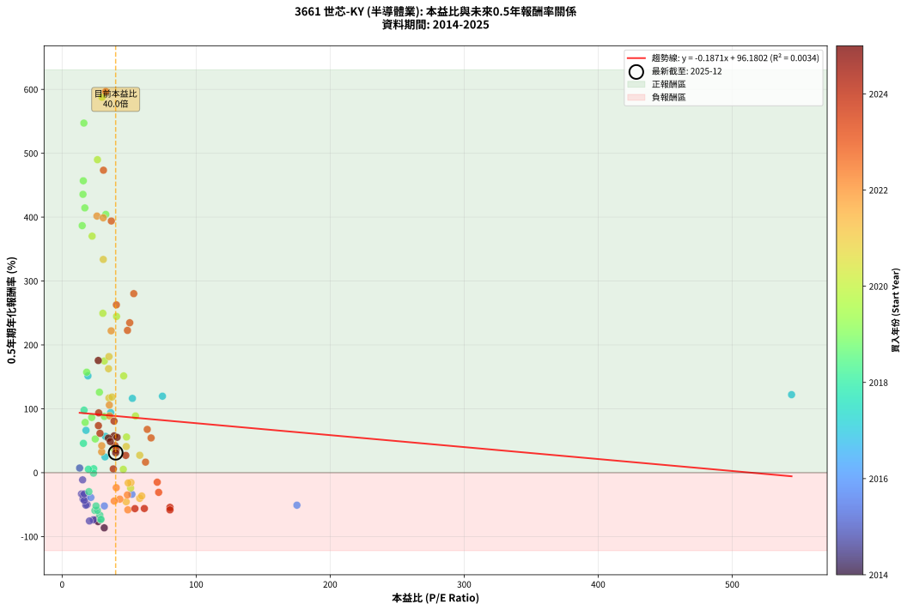
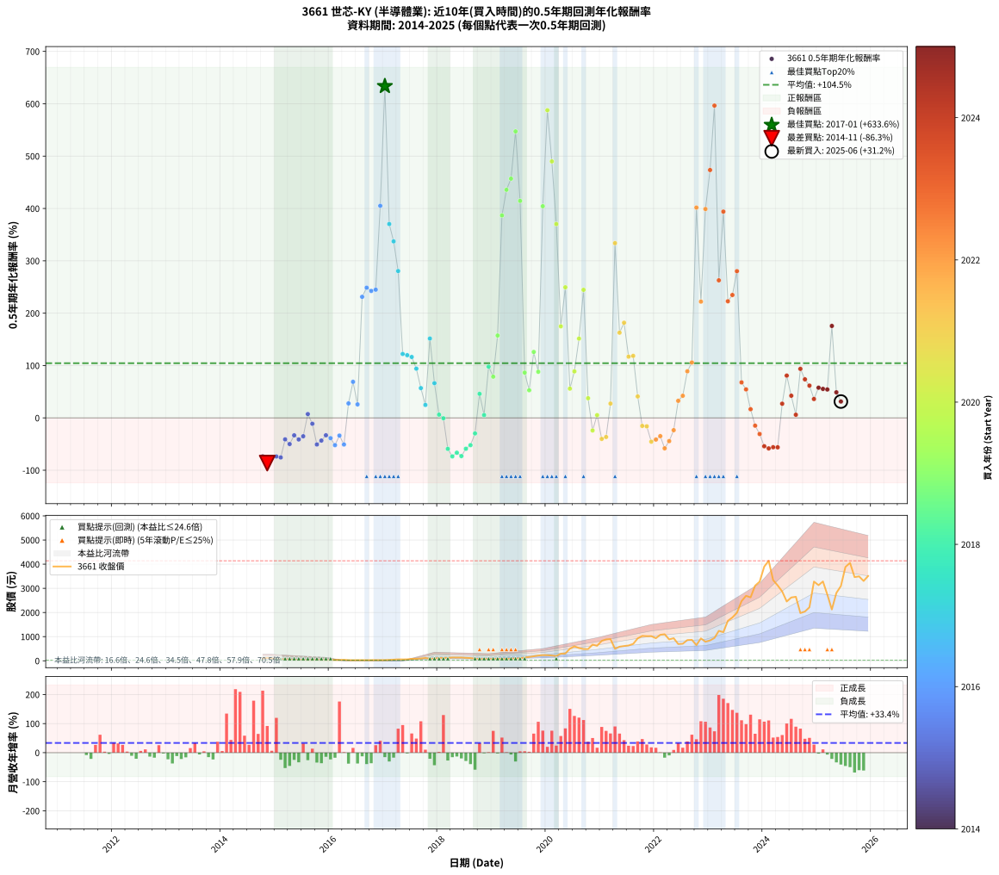

# 3661 世芯-KY - 本益比與未來報酬率分析

!!! info "報告資訊"
    - **股票代號**: 3661
    - **公司名稱**: 世芯-KY
    - **產業別**: 半導體業
    - **分析期間**: 2014-2025 (129 個數據點)
    - **資料來源**: Type 12 (ShowMonthlyK_ChartFlow) 月收盤價與本益比
    - **報酬率口徑**: 含現金股利 (簡化: 年度合計，假設每年7/1入帳)
    - **報告生成時間**: 2026-01-12 21:09:58 CST

## 📈 視覺化圖表

### 圖表1: 本益比 vs 未來報酬率關係

*圖表1：3661 世芯-KY 本益比與0.5年期未來報酬率關係 (2014-2025)*

### 圖表2: 歷年買入時點的0.5年期實際報酬率

*圖表2：3661 世芯-KY 歷年買入時點的0.5年期實際報酬率 (2014-2025)*

## 📍 買點訊號說明

本報告提供兩種買點提示訊號（顯示於圖表2的股價子圖中）：

### ▲ 小綠色三角形（回測驗證）
- **計算方式**: 使用全部歷史資料計算本益比第25百分位數
- **用途**: 事後驗證，顯示歷史上哪些時點確實為低估區
- **限制**: 當下無法判斷，僅供回測參考
- **特性**: 後見之明（Look-Ahead Bias）

### ▲ 小橘色三角形（即時訊號）
- **計算方式**: 使用截至當月的過去5年資料計算本益比第25百分位數
- **用途**: 實際投資決策，當時即可判斷
- **優勢**: 可操作性強，符合實務需求
- **特性**: 無後見之明，滾動窗口計算

!!! tip "如何使用兩種訊號"
    - **綠色▲** 幫助理解歷史估值機會，驗證策略有效性
    - **橘色▲** 可作為實際買進參考，但仍需搭配基本面分析
    - 兩種訊號重疊時，表示即時判斷與事後驗證一致，信心度較高
    - 僅有綠色▲時，表示當時無法判斷（需要未來資料才能確認）
    - 僅有橘色▲時，表示即時判斷為買點，但事後可能不是最佳時機

## 📊 估值分析摘要

| 指標 | 數值 |
|:---:|:---:|
| **目前本益比** (2025-06) | **39.95 倍** |
| **歷史平均本益比** | 40.79 倍 |
| **估值水準** | 🟡 合理範圍 |
| **預期0.5年年化報酬率** | **+88.71%** |
| **歷史平均報酬率** | +104.47% |
| **相關係數 (R²)** | 0.0034 |
| **趨勢線斜率** | -0.1871 |

!!! abstract "核心洞察"
    目前本益比接近歷史平均，預期報酬率符合長期趨勢

    根據歷史數據回測，3661 世芯-KY 在目前本益比 **40.0倍** 的估值水準下，
    預期未來0.5年年化報酬率約為 **+88.7%**。

    **重要提醒**: 本分析基於歷史數據統計，實際報酬率會受到公司基本面變化、產業趨勢、
    總體經濟環境等多重因素影響。R² = 0.00 表示本益比可解釋約 0.3% 的報酬率變異。

## 📈 歷史估值統計

### 最佳買點 (最高報酬率)

| 項目 | 數值 |
|:---:|:---:|
| 起始時間 | 2017-01 |
| 當時本益比 | nan 倍 |
| 起始價格 | 29.8 元 |
| 0.5年後價格 | 80.0 元 |
| **0.5年年化報酬率** | **+633.58%** |

### 最差買點 (最低報酬率)

| 項目 | 數值 |
|:---:|:---:|
| 起始時間 | 2014-11 |
| 當時本益比 | 31.43 倍 |
| 起始價格 | 118.5 元 |
| 0.5年後價格 | 44.2 元 |
| **0.5年年化報酬率** | **-86.33%** |

## 🎯 投資啟示

### 本益比與報酬率關係

趨勢線方程式: **y = -0.1871x + 96.1802**

!!! note "負相關"
    本益比與未來報酬率呈現負相關。較低的本益比通常帶來較高的未來報酬率，
    但相關性不算非常強。**估值仍是重要參考指標之一**。

### 估值區間建議

基於歷史數據分析:

- **🟢 低估區** (P/E < 32.6): 預期報酬率較高，可考慮增加持股
- **🟡 合理區** (P/E 32.6-49.0): 預期報酬率符合長期趨勢，正常持有
- **🔴 高估區** (P/E > 49.0): 預期報酬率較低，可考慮減碼或觀望

!!! danger "風險提示"
    - 過去表現不代表未來結果
    - 本分析假設公司基本面無重大結構性變化
    - 產業環境劇變可能使歷史規律失效
    - 應結合公司財報、產業趨勢、總體經濟等多重因素綜合判斷

!!! success "長期投資觀點"
    歷史數據顯示，在合理或低估的估值水準買入並長期持有，
    往往能獲得較佳的投資報酬。**耐心等待好價格**是價值投資的核心原則。

## 📊 數據品質

- **資料來源**: GoodInfo.tw Type 12 (ShowMonthlyK_ChartFlow)
- **資料頻率**: 月度收盤價與本益比
- **回測期間**: 2014-2025
- **數據點數量**: 129 個 (每個點代表一次0.5年期回測)

### 計算方法說明

1. **0.5年期年化報酬率**:
   - 對每個歷史時點，計算其後0.5年的實際投資報酬率
   - 期末價值(不含股利): 期末價格
   - 期末價值(含現金股利): 期末價格 + 持有期間內的現金股利合計 (簡化: 年度合計，假設每年7/1入帳)
   - 公式: 年化報酬率 = [(期末價值/期初價格)^(1/年數) - 1] × 100%

2. **本益比 (P/E Ratio)**:
   - 使用當時的月收盤價與EPS計算
   - 資料來源: Type 12 月度河流圖本益比數據

3. **趨勢線 (Linear Regression)**:
   - 使用最小平方法擬合線性趨勢線
   - R²值衡量本益比對報酬率的解釋能力

---

*本報告由 Stock Analysis System v1.9.0 自動生成*
*數據更新時間: 2026-01-12 21:09:58 CST*

## 📋 月度回測明細表

（每一列對應時間線圖中的一個買入點；可用來對照 SVG 圖上的每個點。）

| 買入月份 | 賣出月份 | 回測期限_年 | 實際持有年數 | 買入本益比_倍 | 買入收盤價_元 | 賣出收盤價_元 | 現金股利合計_元 | 總報酬率_pct | 年化報酬率_pct |
| --- | --- | --- | --- | --- | --- | --- | --- | --- | --- |
| 2014-10 | 2015-05 | 0.5 | 0.580 | 25.44 | 95.90 | 44.20 | 0.00 | -53.91 | -73.67 |
| 2014-11 | 2015-05 | 0.5 | 0.496 | 31.43 | 118.50 | 44.20 | 0.00 | -62.70 | -86.33 |
| 2014-12 | 2015-07 | 0.5 | 0.580 | 26.79 | 101.00 | 42.90 | 0.66 | -56.88 | -76.52 |
| 2015-01 | 2015-07 | 0.5 | 0.496 | 23.29 | 84.50 | 42.90 | 0.66 | -48.45 | -73.74 |
| 2015-02 | 2015-08 | 0.5 | 0.498 | 20.36 | 71.00 | 34.50 | 0.66 | -50.48 | -75.60 |
| 2015-03 | 2015-10 | 0.5 | 0.586 | 17.22 | 57.60 | 41.60 | 0.66 | -26.64 | -41.06 |
| 2015-04 | 2015-10 | 0.5 | 0.501 | 18.67 | 59.80 | 41.60 | 0.66 | -29.34 | -50.00 |
| 2015-05 | 2015-12 | 0.5 | 0.586 | 14.44 | 44.20 | 34.20 | 0.66 | -21.14 | -33.33 |
| 2015-06 | 2015-12 | 0.5 | 0.501 | 15.58 | 45.50 | 34.20 | 0.66 | -23.39 | -41.25 |
| 2015-07 | 2016-01 | 0.5 | 0.504 | 15.44 | 42.90 | 34.50 | 0.00 | -19.58 | -35.12 |
| 2015-08 | 2016-03 | 0.5 | 0.583 | 13.08 | 34.50 | 35.95 | 0.00 | +4.20 | +7.31 |
| 2015-09 | 2016-03 | 0.5 | 0.498 | 15.29 | 38.15 | 35.95 | 0.00 | -5.77 | -11.24 |
| 2015-10 | 2016-05 | 0.5 | 0.583 | 17.68 | 41.60 | 27.50 | 0.00 | -33.89 | -50.82 |
| 2015-11 | 2016-05 | 0.5 | 0.498 | 16.50 | 36.50 | 27.50 | 0.00 | -24.66 | -43.35 |
| 2015-12 | 2016-07 | 0.5 | 0.583 | 16.52 | 34.20 | 26.55 | 0.47 | -20.98 | -33.22 |
| 2016-01 | 2016-07 | 0.5 | 0.498 | 21.43 | 34.50 | 26.55 | 0.47 | -21.67 | -38.75 |
| 2016-02 | 2016-08 | 0.5 | 0.501 | 31.52 | 36.25 | 24.60 | 0.47 | -30.83 | -52.08 |
| 2016-03 | 2016-10 | 0.5 | 0.586 | 52.10 | 35.95 | 27.75 | 0.47 | -21.49 | -33.83 |
| 2016-04 | 2016-10 | 0.5 | 0.501 | 175.20 | 40.30 | 27.75 | 0.47 | -29.97 | -50.88 |
| 2016-05 | 2016-12 | 0.5 | 0.586 |  | 27.50 | 31.25 | 0.47 | +15.36 | +27.62 |
| 2016-06 | 2016-12 | 0.5 | 0.501 |  | 24.40 | 31.25 | 0.47 | +30.02 | +68.86 |
| 2016-07 | 2017-01 | 0.5 | 0.504 |  | 26.55 | 29.80 | 0.00 | +12.24 | +25.76 |
| 2016-08 | 2017-03 | 0.5 | 0.580 |  | 24.60 | 49.30 | 0.00 | +100.41 | +231.25 |
| 2016-09 | 2017-03 | 0.5 | 0.496 |  | 26.55 | 49.30 | 0.00 | +85.69 | +248.65 |
| 2016-10 | 2017-05 | 0.5 | 0.580 |  | 27.75 | 56.70 | 0.00 | +104.32 | +242.49 |
| 2016-11 | 2017-05 | 0.5 | 0.496 |  | 30.70 | 56.70 | 0.00 | +84.69 | +244.88 |
| 2016-12 | 2017-07 | 0.5 | 0.580 |  | 31.25 | 80.00 | 0.00 | +156.00 | +405.07 |
| 2017-01 | 2017-07 | 0.5 | 0.496 |  | 29.80 | 80.00 | 0.00 | +168.46 | +633.58 |
| 2017-02 | 2017-08 | 0.5 | 0.498 |  | 37.45 | 81.00 | 0.00 | +116.29 | +370.29 |
| 2017-03 | 2017-10 | 0.5 | 0.586 |  | 49.30 | 117.00 | 0.00 | +137.32 | +337.14 |
| 2017-04 | 2017-10 | 0.5 | 0.501 |  | 59.90 | 117.00 | 0.00 | +95.33 | +280.48 |
| 2017-05 | 2017-12 | 0.5 | 0.586 | 544.30 | 56.70 | 90.50 | 0.00 | +59.61 | +122.12 |
| 2017-06 | 2017-12 | 0.5 | 0.501 | 74.85 | 61.00 | 90.50 | 0.00 | +48.36 | +119.75 |
| 2017-07 | 2018-01 | 0.5 | 0.504 | 52.43 | 80.00 | 118.00 | 0.00 | +47.50 | +116.30 |
| 2017-08 | 2018-03 | 0.5 | 0.580 | 36.21 | 81.00 | 119.00 | 0.00 | +46.91 | +94.01 |
| 2017-09 | 2018-03 | 0.5 | 0.496 | 32.30 | 95.20 | 119.00 | 0.00 | +25.00 | +56.88 |
| 2017-10 | 2018-05 | 0.5 | 0.580 | 31.98 | 117.00 | 133.00 | 0.00 | +13.68 | +24.71 |
| 2017-11 | 2018-05 | 0.5 | 0.496 | 19.27 | 84.20 | 133.00 | 0.00 | +57.96 | +151.56 |
| 2017-12 | 2018-07 | 0.5 | 0.580 | 17.81 | 90.50 | 120.50 | 1.07 | +34.33 | +66.27 |
| 2018-01 | 2018-07 | 0.5 | 0.496 | 23.56 | 118.00 | 120.50 | 1.07 | +3.02 | +6.19 |
| 2018-02 | 2018-08 | 0.5 | 0.498 | 23.40 | 115.50 | 114.00 | 1.07 | -0.37 | -0.75 |
| 2018-03 | 2018-10 | 0.5 | 0.586 | 24.46 | 119.00 | 69.30 | 1.07 | -40.87 | -59.21 |
| 2018-04 | 2018-10 | 0.5 | 0.501 | 28.58 | 137.00 | 69.30 | 1.07 | -48.64 | -73.55 |
| 2018-05 | 2018-12 | 0.5 | 0.586 | 28.17 | 133.00 | 69.00 | 1.07 | -47.32 | -66.51 |
| 2018-06 | 2018-12 | 0.5 | 0.501 | 29.03 | 135.00 | 69.00 | 1.07 | -48.10 | -72.99 |
| 2018-07 | 2019-01 | 0.5 | 0.504 | 26.32 | 120.50 | 76.90 | 0.00 | -36.18 | -59.00 |
| 2018-08 | 2019-03 | 0.5 | 0.580 | 25.30 | 114.00 | 74.40 | 0.00 | -34.74 | -52.06 |
| 2018-09 | 2019-03 | 0.5 | 0.496 | 19.98 | 88.60 | 74.40 | 0.00 | -16.03 | -29.71 |
| 2018-10 | 2019-05 | 0.5 | 0.580 | 15.88 | 69.30 | 86.30 | 0.00 | +24.53 | +45.93 |
| 2018-11 | 2019-05 | 0.5 | 0.496 | 19.60 | 84.10 | 86.30 | 0.00 | +2.62 | +5.35 |
| 2018-12 | 2019-07 | 0.5 | 0.580 | 16.35 | 69.00 | 101.00 | 1.53 | +48.59 | +97.85 |
| 2019-01 | 2019-07 | 0.5 | 0.496 | 17.21 | 76.90 | 101.00 | 1.53 | +33.33 | +78.69 |
| 2019-02 | 2019-08 | 0.5 | 0.498 | 18.34 | 86.50 | 137.00 | 1.53 | +60.15 | +157.31 |
| 2019-03 | 2019-10 | 0.5 | 0.586 | 14.98 | 74.40 | 186.50 | 1.53 | +152.73 | +386.68 |
| 2019-04 | 2019-10 | 0.5 | 0.501 | 15.56 | 81.10 | 186.50 | 1.53 | +131.85 | +435.69 |
| 2019-05 | 2019-12 | 0.5 | 0.586 | 15.80 | 86.30 | 234.50 | 1.53 | +173.50 | +456.91 |
| 2019-06 | 2019-12 | 0.5 | 0.501 | 16.22 | 92.60 | 234.50 | 1.53 | +154.89 | +547.21 |
| 2019-07 | 2020-01 | 0.5 | 0.504 | 16.95 | 101.00 | 230.50 | 0.00 | +128.22 | +414.45 |
| 2019-08 | 2020-03 | 0.5 | 0.583 | 22.07 | 137.00 | 197.00 | 0.00 | +43.80 | +86.42 |
| 2019-09 | 2020-03 | 0.5 | 0.498 | 24.71 | 159.50 | 197.00 | 0.00 | +23.51 | +52.77 |
| 2019-10 | 2020-05 | 0.5 | 0.583 | 27.82 | 186.50 | 300.00 | 0.00 | +60.86 | +125.95 |
| 2019-11 | 2020-05 | 0.5 | 0.498 | 31.50 | 219.00 | 300.00 | 0.00 | +36.99 | +88.06 |
| 2019-12 | 2020-07 | 0.5 | 0.583 | 32.57 | 234.50 | 599.00 | 3.45 | +156.91 | +404.29 |
| 2020-01 | 2020-07 | 0.5 | 0.498 | 29.80 | 230.50 | 599.00 | 3.45 | +161.37 | +587.65 |
| 2020-02 | 2020-08 | 0.5 | 0.501 | 26.37 | 218.00 | 527.00 | 3.45 | +143.33 | +489.92 |
| 2020-03 | 2020-10 | 0.5 | 0.586 | 22.38 | 197.00 | 484.50 | 3.45 | +147.69 | +370.24 |
| 2020-04 | 2020-10 | 0.5 | 0.501 | 31.49 | 294.00 | 484.50 | 3.45 | +65.97 | +174.89 |
| 2020-05 | 2020-12 | 0.5 | 0.586 | 30.39 | 300.00 | 621.00 | 3.45 | +108.15 | +249.46 |
| 2020-06 | 2020-12 | 0.5 | 0.501 | 48.05 | 500.00 | 621.00 | 3.45 | +24.89 | +55.83 |
| 2020-07 | 2021-01 | 0.5 | 0.504 | 54.76 | 599.00 | 825.00 | 0.00 | +37.73 | +88.79 |
| 2020-08 | 2021-03 | 0.5 | 0.580 | 45.93 | 527.00 | 900.00 | 0.00 | +70.78 | +151.45 |
| 2020-09 | 2021-03 | 0.5 | 0.496 | 40.60 | 487.50 | 900.00 | 0.00 | +84.62 | +244.60 |
| 2020-10 | 2021-05 | 0.5 | 0.580 | 38.63 | 484.50 | 583.00 | 0.00 | +20.33 | +37.55 |
| 2020-11 | 2021-05 | 0.5 | 0.496 | 51.09 | 668.00 | 583.00 | 0.00 | -12.72 | -24.02 |
| 2020-12 | 2021-07 | 0.5 | 0.580 | 45.63 | 621.00 | 633.00 | 6.69 | +3.01 | +5.24 |
| 2021-01 | 2021-07 | 0.5 | 0.496 | 57.88 | 825.00 | 633.00 | 6.69 | -22.46 | -40.15 |
| 2021-02 | 2021-08 | 0.5 | 0.498 | 59.40 | 885.00 | 699.00 | 6.69 | -20.26 | -36.52 |
| 2021-03 | 2021-10 | 0.5 | 0.586 | 57.91 | 900.00 | 1030.00 | 6.69 | +15.19 | +27.29 |
| 2021-04 | 2021-10 | 0.5 | 0.501 | 30.70 | 497.00 | 1030.00 | 6.69 | +108.59 | +333.79 |
| 2021-05 | 2021-12 | 0.5 | 0.586 | 34.64 | 583.00 | 1020.00 | 6.69 | +76.10 | +162.71 |
| 2021-06 | 2021-12 | 0.5 | 0.501 | 34.96 | 611.00 | 1020.00 | 6.69 | +68.03 | +181.76 |
| 2021-07 | 2022-01 | 0.5 | 0.504 | 34.94 | 633.00 | 935.00 | 0.00 | +47.71 | +116.91 |
| 2021-08 | 2022-03 | 0.5 | 0.580 | 37.25 | 699.00 | 1100.00 | 0.00 | +57.37 | +118.40 |
| 2021-09 | 2022-03 | 0.5 | 0.496 | 47.82 | 928.00 | 1100.00 | 0.00 | +18.53 | +40.93 |
| 2021-10 | 2022-05 | 0.5 | 0.580 | 51.37 | 1030.00 | 935.00 | 0.00 | -9.22 | -15.36 |
| 2021-11 | 2022-05 | 0.5 | 0.496 | 49.29 | 1020.00 | 935.00 | 0.00 | -8.33 | -16.10 |
| 2021-12 | 2022-07 | 0.5 | 0.580 | 47.80 | 1020.00 | 706.00 | 11.35 | -29.67 | -45.47 |
| 2022-01 | 2022-07 | 0.5 | 0.496 | 43.08 | 935.00 | 706.00 | 11.35 | -23.28 | -41.42 |
| 2022-02 | 2022-08 | 0.5 | 0.498 | 48.72 | 1075.00 | 857.00 | 11.35 | -19.22 | -34.85 |
| 2022-03 | 2022-10 | 0.5 | 0.586 | 49.05 | 1100.00 | 649.00 | 11.35 | -39.97 | -58.15 |
| 2022-04 | 2022-10 | 0.5 | 0.501 | 38.88 | 886.00 | 649.00 | 11.35 | -25.47 | -44.38 |
| 2022-05 | 2022-12 | 0.5 | 0.586 | 40.38 | 935.00 | 788.00 | 11.35 | -14.51 | -23.47 |
| 2022-06 | 2022-12 | 0.5 | 0.501 | 29.51 | 694.00 | 788.00 | 11.35 | +15.18 | +32.59 |
| 2022-07 | 2023-01 | 0.5 | 0.504 | 29.57 | 706.00 | 843.00 | 0.00 | +19.41 | +42.20 |
| 2022-08 | 2023-03 | 0.5 | 0.580 | 35.35 | 857.00 | 1240.00 | 0.00 | +44.69 | +88.98 |
| 2022-09 | 2023-03 | 0.5 | 0.496 | 35.24 | 867.00 | 1240.00 | 0.00 | +43.02 | +105.87 |
| 2022-10 | 2023-05 | 0.5 | 0.580 | 26.00 | 649.00 | 1655.00 | 0.00 | +155.01 | +401.70 |
| 2022-11 | 2023-05 | 0.5 | 0.496 | 36.60 | 927.00 | 1655.00 | 0.00 | +78.53 | +222.07 |
| 2022-12 | 2023-07 | 0.5 | 0.580 | 30.67 | 788.00 | 1990.00 | 13.06 | +154.20 | +398.95 |
| 2023-01 | 2023-07 | 0.5 | 0.496 | 30.84 | 843.00 | 1990.00 | 13.06 | +137.61 | +473.43 |
| 2023-02 | 2023-08 | 0.5 | 0.498 | 32.57 | 944.00 | 2470.00 | 13.06 | +163.04 | +596.49 |
| 2023-03 | 2023-10 | 0.5 | 0.586 | 40.48 | 1240.00 | 2625.00 | 13.06 | +112.75 | +262.73 |
| 2023-04 | 2023-10 | 0.5 | 0.501 | 36.71 | 1185.00 | 2625.00 | 13.06 | +122.62 | +393.98 |
| 2023-05 | 2023-12 | 0.5 | 0.586 | 48.77 | 1655.00 | 3275.00 | 13.06 | +98.67 | +222.75 |
| 2023-06 | 2023-12 | 0.5 | 0.501 | 50.45 | 1795.00 | 3275.00 | 13.06 | +83.18 | +234.71 |
| 2023-07 | 2024-01 | 0.5 | 0.504 | 53.45 | 1990.00 | 3900.00 | 0.00 | +95.98 | +280.24 |
| 2023-08 | 2024-03 | 0.5 | 0.583 | 63.53 | 2470.00 | 3340.00 | 0.00 | +35.22 | +67.77 |
| 2023-09 | 2024-03 | 0.5 | 0.498 | 66.38 | 2690.00 | 3340.00 | 0.00 | +24.16 | +54.40 |
| 2023-10 | 2024-05 | 0.5 | 0.583 | 62.24 | 2625.00 | 2870.00 | 0.00 | +9.33 | +16.53 |
| 2023-11 | 2024-05 | 0.5 | 0.498 | 70.97 | 3110.00 | 2870.00 | 0.00 | -7.72 | -14.89 |
| 2023-12 | 2024-07 | 0.5 | 0.583 | 72.03 | 3275.00 | 2620.00 | 22.42 | -19.32 | -30.79 |
| 2024-01 | 2024-07 | 0.5 | 0.498 | 80.48 | 3900.00 | 2620.00 | 22.42 | -32.25 | -54.22 |
| 2024-02 | 2024-08 | 0.5 | 0.501 | 80.47 | 4140.00 | 2650.00 | 22.42 | -35.45 | -58.26 |
| 2024-03 | 2024-10 | 0.5 | 0.586 | 61.35 | 3340.00 | 2040.00 | 22.42 | -38.25 | -56.08 |
| 2024-04 | 2024-10 | 0.5 | 0.501 | 54.33 | 3120.00 | 2040.00 | 22.42 | -33.90 | -56.23 |
| 2024-05 | 2024-12 | 0.5 | 0.586 | 47.50 | 2870.00 | 3280.00 | 22.42 | +15.07 | +27.07 |
| 2024-06 | 2024-12 | 0.5 | 0.501 | 38.72 | 2455.00 | 3280.00 | 22.42 | +34.52 | +80.73 |
| 2024-07 | 2025-01 | 0.5 | 0.504 | 39.46 | 2620.00 | 3130.00 | 0.00 | +19.47 | +42.34 |
| 2024-08 | 2025-03 | 0.5 | 0.580 | 38.19 | 2650.00 | 2740.00 | 0.00 | +3.40 | +5.92 |
| 2024-09 | 2025-03 | 0.5 | 0.496 | 27.29 | 1975.00 | 2740.00 | 0.00 | +38.73 | +93.61 |
| 2024-10 | 2025-05 | 0.5 | 0.580 | 27.07 | 2040.00 | 2810.00 | 0.00 | +37.75 | +73.62 |
| 2024-11 | 2025-05 | 0.5 | 0.496 | 28.27 | 2215.00 | 2810.00 | 0.00 | +26.86 | +61.63 |
| 2024-12 | 2025-07 | 0.5 | 0.580 | 40.32 | 3280.00 | 3885.00 | 36.48 | +19.56 | +36.04 |
| 2025-01 | 2025-07 | 0.5 | 0.496 | 38.79 | 3130.00 | 3885.00 | 36.48 | +25.29 | +57.60 |
| 2025-02 | 2025-08 | 0.5 | 0.498 | 41.04 | 3285.00 | 4055.00 | 36.48 | +24.55 | +55.36 |
| 2025-03 | 2025-10 | 0.5 | 0.586 | 34.51 | 2740.00 | 3495.00 | 36.48 | +28.89 | +54.20 |
| 2025-04 | 2025-10 | 0.5 | 0.501 | 26.98 | 2125.00 | 3495.00 | 36.48 | +66.19 | +175.61 |
| 2025-05 | 2025-12 | 0.5 | 0.586 | 35.97 | 2810.00 | 3510.00 | 36.48 | +26.21 | +48.78 |
| 2025-06 | 2025-12 | 0.5 | 0.501 | 39.95 | 3095.00 | 3510.00 | 36.48 | +14.59 | +31.23 |
