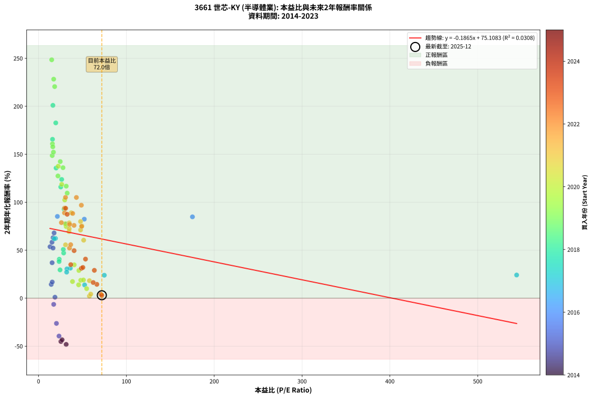
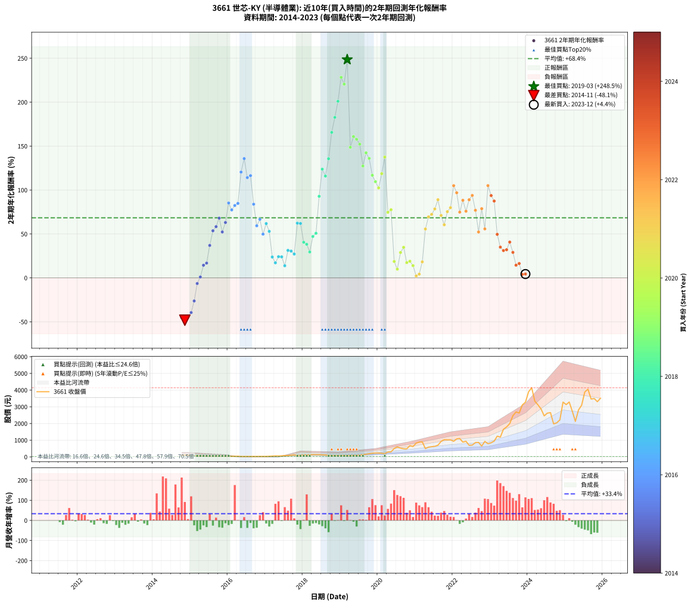

# 3661 世芯-KY - 本益比與未來報酬率分析

!!! info "報告資訊"
    - **股票代號**: 3661
    - **公司名稱**: 世芯-KY
    - **產業別**: 半導體業
    - **分析期間**: 2014-2023 (111 個數據點)
    - **資料來源**: Type 12 (ShowMonthlyK_ChartFlow) 月收盤價與本益比
    - **報酬率口徑**: 含現金股利 (簡化: 年度合計，假設每年7/1入帳)
    - **報告生成時間**: 2026-01-10 22:56:11 CST

## 📈 視覺化圖表

### 圖表1: 本益比 vs 未來報酬率關係

*圖表1：3661 世芯-KY 本益比與2年期未來報酬率關係 (2014-2023)*

### 圖表2: 歷年買入時點的2年期實際報酬率

*圖表2：3661 世芯-KY 歷年買入時點的2年期實際報酬率 (2014-2023)*

## 📍 買點訊號說明

本報告提供兩種買點提示訊號（顯示於圖表2的股價子圖中）：

### ▲ 小綠色三角形（回測驗證）
- **計算方式**: 使用全部歷史資料計算本益比第25百分位數
- **用途**: 事後驗證，顯示歷史上哪些時點確實為低估區
- **限制**: 當下無法判斷，僅供回測參考
- **特性**: 後見之明（Look-Ahead Bias）

### ▲ 小橘色三角形（即時訊號）
- **計算方式**: 使用截至當月的過去5年資料計算本益比第25百分位數
- **用途**: 實際投資決策，當時即可判斷
- **優勢**: 可操作性強，符合實務需求
- **特性**: 無後見之明，滾動窗口計算

!!! tip "如何使用兩種訊號"
    - **綠色▲** 幫助理解歷史估值機會，驗證策略有效性
    - **橘色▲** 可作為實際買進參考，但仍需搭配基本面分析
    - 兩種訊號重疊時，表示即時判斷與事後驗證一致，信心度較高
    - 僅有綠色▲時，表示當時無法判斷（需要未來資料才能確認）
    - 僅有橘色▲時，表示即時判斷為買點，但事後可能不是最佳時機

## 📊 估值分析摘要

| 指標 | 數值 |
|:---:|:---:|
| **目前本益比** (2023-12) | **72.03 倍** |
| **歷史平均本益比** | 40.32 倍 |
| **估值水準** | 🔴 相對高估 |
| **預期2年年化報酬率** | **+61.69%** |
| **歷史平均報酬率** | +68.42% |
| **相關係數 (R²)** | 0.0308 |
| **趨勢線斜率** | -0.1863 |

!!! abstract "核心洞察"
    目前本益比顯著高於歷史平均，預期未來報酬率可能較低

    根據歷史數據回測，3661 世芯-KY 在目前本益比 **72.0倍** 的估值水準下，
    預期未來2年年化報酬率約為 **+61.7%**。

    **重要提醒**: 本分析基於歷史數據統計，實際報酬率會受到公司基本面變化、產業趨勢、
    總體經濟環境等多重因素影響。R² = 0.03 表示本益比可解釋約 3.1% 的報酬率變異。

## 📈 歷史估值統計

### 最佳買點 (最高報酬率)

| 項目 | 數值 |
|:---:|:---:|
| 起始時間 | 2019-03 |
| 當時本益比 | 14.98 倍 |
| 起始價格 | 74.4 元 |
| 2年後價格 | 900.0 元 |
| **2年年化報酬率** | **+248.47%** |

### 最差買點 (最低報酬率)

| 項目 | 數值 |
|:---:|:---:|
| 起始時間 | 2014-11 |
| 當時本益比 | 31.43 倍 |
| 起始價格 | 118.5 元 |
| 2年後價格 | 30.7 元 |
| **2年年化報酬率** | **-48.15%** |

## 🎯 投資啟示

### 本益比與報酬率關係

趨勢線方程式: **y = -0.1863x + 75.1160**

!!! note "負相關"
    本益比與未來報酬率呈現負相關。較低的本益比通常帶來較高的未來報酬率，
    但相關性不算非常強。**估值仍是重要參考指標之一**。

### 估值區間建議

基於歷史數據分析:

- **🟢 低估區** (P/E < 32.3): 預期報酬率較高，可考慮增加持股
- **🟡 合理區** (P/E 32.3-48.4): 預期報酬率符合長期趨勢，正常持有
- **🔴 高估區** (P/E > 48.4): 預期報酬率較低，可考慮減碼或觀望

!!! danger "風險提示"
    - 過去表現不代表未來結果
    - 本分析假設公司基本面無重大結構性變化
    - 產業環境劇變可能使歷史規律失效
    - 應結合公司財報、產業趨勢、總體經濟等多重因素綜合判斷

!!! success "長期投資觀點"
    歷史數據顯示，在合理或低估的估值水準買入並長期持有，
    往往能獲得較佳的投資報酬。**耐心等待好價格**是價值投資的核心原則。

## 📊 數據品質

- **資料來源**: GoodInfo.tw Type 12 (ShowMonthlyK_ChartFlow)
- **資料頻率**: 月度收盤價與本益比
- **回測期間**: 2014-2023
- **數據點數量**: 111 個 (每個點代表一次2年期回測)

### 計算方法說明

1. **2年期年化報酬率**:
   - 對每個歷史時點，計算其後2年的實際投資報酬率
   - 期末價值(不含股利): 期末價格
   - 期末價值(含現金股利): 期末價格 + 持有期間內的現金股利合計 (簡化: 年度合計，假設每年7/1入帳)
   - 公式: 年化報酬率 = [(期末價值/期初價格)^(1/年數) - 1] × 100%

2. **本益比 (P/E Ratio)**:
   - 使用當時的月收盤價與EPS計算
   - 資料來源: Type 12 月度河流圖本益比數據

3. **趨勢線 (Linear Regression)**:
   - 使用最小平方法擬合線性趨勢線
   - R²值衡量本益比對報酬率的解釋能力

---

*本報告由 Stock Analysis System v1.9.0 自動生成*
*數據更新時間: 2026-01-10 22:56:11 CST*

## 📋 月度回測明細表

（每一列對應時間線圖中的一個買入點；可用來對照 SVG 圖上的每個點。）

| 買入月份 | 賣出月份 | 回測期限_年 | 實際持有年數 | 買入本益比_倍 | 買入收盤價_元 | 賣出收盤價_元 | 現金股利合計_元 | 總報酬率_pct | 年化報酬率_pct |
| --- | --- | --- | --- | --- | --- | --- | --- | --- | --- |
| 2014-10 | 2016-10 | 2 | 2.001 | 25.44 | 95.90 | 27.75 | 1.13 | -69.89 | -45.10 |
| 2014-11 | 2016-11 | 2 | 2.001 | 31.43 | 118.50 | 30.70 | 1.13 | -73.14 | -48.15 |
| 2014-12 | 2016-12 | 2 | 2.001 | 26.79 | 101.00 | 31.25 | 1.13 | -67.94 | -43.36 |
| 2015-01 | 2017-01 | 2 | 2.001 | 23.29 | 84.50 | 29.80 | 1.13 | -63.40 | -39.48 |
| 2015-02 | 2017-02 | 2 | 2.001 | 20.36 | 71.00 | 37.45 | 1.13 | -45.66 | -26.27 |
| 2015-03 | 2017-03 | 2 | 2.001 | 17.22 | 57.60 | 49.30 | 1.13 | -12.45 | -6.43 |
| 2015-04 | 2017-04 | 2 | 2.001 | 18.67 | 59.80 | 59.90 | 1.13 | +2.06 | +1.02 |
| 2015-05 | 2017-05 | 2 | 2.001 | 14.44 | 44.20 | 56.70 | 1.13 | +30.84 | +14.37 |
| 2015-06 | 2017-06 | 2 | 2.001 | 15.58 | 45.50 | 61.00 | 1.13 | +36.55 | +16.84 |
| 2015-07 | 2017-07 | 2 | 2.001 | 15.44 | 42.90 | 80.00 | 0.47 | +87.59 | +36.93 |
| 2015-08 | 2017-08 | 2 | 2.001 | 13.08 | 34.50 | 81.00 | 0.47 | +136.16 | +53.63 |
| 2015-09 | 2017-09 | 2 | 2.001 | 15.29 | 38.15 | 95.20 | 0.47 | +150.78 | +58.31 |
| 2015-10 | 2017-10 | 2 | 2.001 | 17.68 | 41.60 | 117.00 | 0.47 | +182.39 | +67.98 |
| 2015-11 | 2017-11 | 2 | 2.001 | 16.50 | 36.50 | 84.20 | 0.47 | +131.98 | +52.27 |
| 2015-12 | 2017-12 | 2 | 2.001 | 16.52 | 34.20 | 90.50 | 0.47 | +166.01 | +63.04 |
| 2016-01 | 2018-01 | 2 | 2.001 | 21.43 | 34.50 | 118.00 | 0.47 | +243.40 | +85.23 |
| 2016-02 | 2018-03 | 2 | 2.081 | 31.52 | 36.25 | 119.00 | 0.47 | +229.58 | +77.39 |
| 2016-03 | 2018-03 | 2 | 1.999 | 52.10 | 35.95 | 119.00 | 0.47 | +232.33 | +82.38 |
| 2016-04 | 2018-04 | 2 | 1.999 | 175.20 | 40.30 | 137.00 | 0.47 | +241.13 | +84.77 |
| 2016-05 | 2018-05 | 2 | 1.999 |  | 27.50 | 133.00 | 0.47 | +385.36 | +120.43 |
| 2016-06 | 2018-06 | 2 | 1.999 |  | 24.40 | 135.00 | 0.47 | +455.22 | +135.77 |
| 2016-07 | 2018-07 | 2 | 1.999 |  | 26.55 | 120.50 | 1.07 | +357.88 | +114.09 |
| 2016-08 | 2018-08 | 2 | 1.999 |  | 24.60 | 114.00 | 1.07 | +367.75 | +116.39 |
| 2016-09 | 2018-09 | 2 | 1.999 |  | 26.55 | 88.60 | 1.07 | +237.73 | +83.85 |
| 2016-10 | 2018-10 | 2 | 1.999 |  | 27.75 | 69.30 | 1.07 | +153.57 | +59.29 |
| 2016-11 | 2018-11 | 2 | 1.999 |  | 30.70 | 84.10 | 1.07 | +177.42 | +66.62 |
| 2016-12 | 2018-12 | 2 | 1.999 |  | 31.25 | 69.00 | 1.07 | +124.21 | +49.78 |
| 2017-01 | 2019-01 | 2 | 1.999 |  | 29.80 | 76.90 | 1.07 | +161.63 | +61.80 |
| 2017-02 | 2019-02 | 2 | 1.999 |  | 37.45 | 86.50 | 1.07 | +133.82 | +52.96 |
| 2017-03 | 2019-03 | 2 | 1.999 |  | 49.30 | 74.40 | 1.07 | +53.08 | +23.74 |
| 2017-04 | 2019-04 | 2 | 1.999 |  | 59.90 | 81.10 | 1.07 | +37.17 | +17.13 |
| 2017-05 | 2019-05 | 2 | 1.999 | 544.30 | 56.70 | 86.30 | 1.07 | +54.09 | +24.15 |
| 2017-06 | 2019-06 | 2 | 1.999 | 74.85 | 61.00 | 92.60 | 1.07 | +53.55 | +23.93 |
| 2017-07 | 2019-07 | 2 | 1.999 | 52.43 | 80.00 | 101.00 | 2.60 | +29.50 | +13.81 |
| 2017-08 | 2019-08 | 2 | 1.999 | 36.21 | 81.00 | 137.00 | 2.60 | +72.34 | +31.30 |
| 2017-09 | 2019-09 | 2 | 1.999 | 32.30 | 95.20 | 159.50 | 2.60 | +70.27 | +30.51 |
| 2017-10 | 2019-10 | 2 | 1.999 | 31.98 | 117.00 | 186.50 | 2.60 | +61.62 | +27.15 |
| 2017-11 | 2019-11 | 2 | 1.999 | 19.27 | 84.20 | 219.00 | 2.60 | +163.18 | +62.28 |
| 2017-12 | 2019-12 | 2 | 1.999 | 17.81 | 90.50 | 234.50 | 2.60 | +161.99 | +61.91 |
| 2018-01 | 2020-01 | 2 | 1.999 | 23.56 | 118.00 | 230.50 | 2.60 | +97.54 | +40.58 |
| 2018-02 | 2020-02 | 2 | 1.999 | 23.40 | 115.50 | 218.00 | 2.60 | +90.99 | +38.23 |
| 2018-03 | 2020-03 | 2 | 2.001 | 24.46 | 119.00 | 197.00 | 2.60 | +67.73 | +29.49 |
| 2018-04 | 2020-04 | 2 | 2.001 | 28.58 | 137.00 | 294.00 | 2.60 | +116.49 | +47.10 |
| 2018-05 | 2020-05 | 2 | 2.001 | 28.17 | 133.00 | 300.00 | 2.60 | +127.52 | +50.79 |
| 2018-06 | 2020-06 | 2 | 2.001 | 29.03 | 135.00 | 500.00 | 2.60 | +272.29 | +92.86 |
| 2018-07 | 2020-07 | 2 | 2.001 | 26.32 | 120.50 | 599.00 | 4.98 | +401.23 | +123.76 |
| 2018-08 | 2020-08 | 2 | 2.001 | 25.30 | 114.00 | 527.00 | 4.98 | +366.65 | +115.91 |
| 2018-09 | 2020-09 | 2 | 2.001 | 19.98 | 88.60 | 487.50 | 4.98 | +455.85 | +135.63 |
| 2018-10 | 2020-10 | 2 | 2.001 | 15.88 | 69.30 | 484.50 | 4.98 | +606.32 | +165.59 |
| 2018-11 | 2020-11 | 2 | 2.001 | 19.60 | 84.10 | 668.00 | 4.98 | +700.22 | +182.68 |
| 2018-12 | 2020-12 | 2 | 2.001 | 16.35 | 69.00 | 621.00 | 4.98 | +807.22 | +200.97 |
| 2019-01 | 2021-01 | 2 | 2.001 | 17.21 | 76.90 | 825.00 | 4.98 | +979.30 | +228.26 |
| 2019-02 | 2021-02 | 2 | 2.001 | 18.34 | 86.50 | 885.00 | 4.98 | +928.88 | +220.51 |
| 2019-03 | 2021-03 | 2 | 2.001 | 14.98 | 74.40 | 900.00 | 4.98 | +1116.37 | +248.47 |
| 2019-04 | 2021-04 | 2 | 2.001 | 15.56 | 81.10 | 497.00 | 4.98 | +518.97 | +148.64 |
| 2019-05 | 2021-05 | 2 | 2.001 | 15.80 | 86.30 | 583.00 | 4.98 | +581.32 | +160.85 |
| 2019-06 | 2021-06 | 2 | 2.001 | 16.22 | 92.60 | 611.00 | 4.98 | +565.21 | +157.75 |
| 2019-07 | 2021-07 | 2 | 2.001 | 16.95 | 101.00 | 633.00 | 10.14 | +536.77 | +152.18 |
| 2019-08 | 2021-08 | 2 | 2.001 | 22.07 | 137.00 | 699.00 | 10.14 | +417.62 | +127.38 |
| 2019-09 | 2021-09 | 2 | 2.001 | 24.71 | 159.50 | 928.00 | 10.14 | +488.18 | +142.38 |
| 2019-10 | 2021-10 | 2 | 2.001 | 27.82 | 186.50 | 1030.00 | 10.14 | +457.72 | +136.02 |
| 2019-11 | 2021-11 | 2 | 2.001 | 31.50 | 219.00 | 1020.00 | 10.14 | +370.38 | +116.77 |
| 2019-12 | 2021-12 | 2 | 2.001 | 32.57 | 234.50 | 1020.00 | 10.14 | +339.29 | +109.49 |
| 2020-01 | 2022-01 | 2 | 2.001 | 29.80 | 230.50 | 935.00 | 10.14 | +310.04 | +102.40 |
| 2020-02 | 2022-03 | 2 | 2.081 | 26.37 | 218.00 | 1100.00 | 10.14 | +409.24 | +118.65 |
| 2020-03 | 2022-03 | 2 | 1.999 | 22.38 | 197.00 | 1100.00 | 10.14 | +463.52 | +137.53 |
| 2020-04 | 2022-04 | 2 | 1.999 | 31.49 | 294.00 | 886.00 | 10.14 | +204.81 | +74.65 |
| 2020-05 | 2022-05 | 2 | 1.999 | 30.39 | 300.00 | 935.00 | 10.14 | +215.05 | +77.57 |
| 2020-06 | 2022-06 | 2 | 1.999 | 48.05 | 500.00 | 694.00 | 10.14 | +40.83 | +18.68 |
| 2020-07 | 2022-07 | 2 | 1.999 | 54.76 | 599.00 | 706.00 | 18.04 | +20.87 | +9.95 |
| 2020-08 | 2022-08 | 2 | 1.999 | 45.93 | 527.00 | 857.00 | 18.04 | +66.04 | +28.88 |
| 2020-09 | 2022-09 | 2 | 1.999 | 40.60 | 487.50 | 867.00 | 18.04 | +81.55 | +34.77 |
| 2020-10 | 2022-10 | 2 | 1.999 | 38.63 | 484.50 | 649.00 | 18.04 | +37.68 | +17.35 |
| 2020-11 | 2022-11 | 2 | 1.999 | 51.09 | 668.00 | 927.00 | 18.04 | +41.47 | +18.96 |
| 2020-12 | 2022-12 | 2 | 1.999 | 45.63 | 621.00 | 788.00 | 18.04 | +29.80 | +13.94 |
| 2021-01 | 2023-01 | 2 | 1.999 | 57.88 | 825.00 | 843.00 | 18.04 | +4.37 | +2.16 |
| 2021-02 | 2023-02 | 2 | 1.999 | 59.40 | 885.00 | 944.00 | 18.04 | +8.70 | +4.26 |
| 2021-03 | 2023-03 | 2 | 1.999 | 57.91 | 900.00 | 1240.00 | 18.04 | +39.78 | +18.24 |
| 2021-04 | 2023-04 | 2 | 1.999 | 30.70 | 497.00 | 1185.00 | 18.04 | +142.06 | +55.63 |
| 2021-05 | 2023-05 | 2 | 1.999 | 34.64 | 583.00 | 1655.00 | 18.04 | +186.97 | +69.46 |
| 2021-06 | 2023-06 | 2 | 1.999 | 34.96 | 611.00 | 1795.00 | 18.04 | +196.73 | +72.32 |
| 2021-07 | 2023-07 | 2 | 1.999 | 34.94 | 633.00 | 1990.00 | 24.41 | +218.23 | +78.46 |
| 2021-08 | 2023-08 | 2 | 1.999 | 37.25 | 699.00 | 2470.00 | 24.41 | +256.85 | +88.99 |
| 2021-09 | 2023-09 | 2 | 1.999 | 47.82 | 928.00 | 2690.00 | 24.41 | +192.50 | +71.09 |
| 2021-10 | 2023-10 | 2 | 1.999 | 51.37 | 1030.00 | 2625.00 | 24.41 | +157.22 | +60.43 |
| 2021-11 | 2023-11 | 2 | 1.999 | 49.29 | 1020.00 | 3110.00 | 24.41 | +207.30 | +75.37 |
| 2021-12 | 2023-12 | 2 | 1.999 | 47.80 | 1020.00 | 3275.00 | 24.41 | +223.47 | +79.93 |
| 2022-01 | 2024-01 | 2 | 1.999 | 43.08 | 935.00 | 3900.00 | 24.41 | +319.72 | +104.97 |
| 2022-02 | 2024-02 | 2 | 1.999 | 48.72 | 1075.00 | 4140.00 | 24.41 | +287.39 | +96.91 |
| 2022-03 | 2024-03 | 2 | 2.001 | 49.05 | 1100.00 | 3340.00 | 24.41 | +205.86 | +74.82 |
| 2022-04 | 2024-04 | 2 | 2.001 | 38.88 | 886.00 | 3120.00 | 24.41 | +254.90 | +88.31 |
| 2022-05 | 2024-05 | 2 | 2.001 | 40.38 | 935.00 | 2870.00 | 24.41 | +209.56 | +75.88 |
| 2022-06 | 2024-06 | 2 | 2.001 | 29.51 | 694.00 | 2455.00 | 24.41 | +257.26 | +88.93 |
| 2022-07 | 2024-07 | 2 | 2.001 | 29.57 | 706.00 | 2620.00 | 35.48 | +276.13 | +93.85 |
| 2022-08 | 2024-08 | 2 | 2.001 | 35.35 | 857.00 | 2650.00 | 35.48 | +213.36 | +76.95 |
| 2022-09 | 2024-09 | 2 | 2.001 | 35.24 | 867.00 | 1975.00 | 35.48 | +131.89 | +52.24 |
| 2022-10 | 2024-10 | 2 | 2.001 | 26.00 | 649.00 | 2040.00 | 35.48 | +219.80 | +78.76 |
| 2022-11 | 2024-11 | 2 | 2.001 | 36.60 | 927.00 | 2215.00 | 35.48 | +142.77 | +55.76 |
| 2022-12 | 2024-12 | 2 | 2.001 | 30.67 | 788.00 | 3280.00 | 35.48 | +320.75 | +105.02 |
| 2023-01 | 2025-01 | 2 | 2.001 | 30.84 | 843.00 | 3130.00 | 35.48 | +275.50 | +93.69 |
| 2023-02 | 2025-02 | 2 | 2.001 | 32.57 | 944.00 | 3285.00 | 35.48 | +251.75 | +87.47 |
| 2023-03 | 2025-03 | 2 | 2.001 | 40.48 | 1240.00 | 2740.00 | 35.48 | +123.83 | +49.57 |
| 2023-04 | 2025-04 | 2 | 2.001 | 36.71 | 1185.00 | 2125.00 | 35.48 | +82.32 | +35.00 |
| 2023-05 | 2025-05 | 2 | 2.001 | 48.77 | 1655.00 | 2810.00 | 35.48 | +71.93 | +31.10 |
| 2023-06 | 2025-06 | 2 | 2.001 | 50.45 | 1795.00 | 3095.00 | 35.48 | +74.40 | +32.04 |
| 2023-07 | 2025-07 | 2 | 2.001 | 53.45 | 1990.00 | 3885.00 | 58.90 | +98.19 | +40.75 |
| 2023-08 | 2025-08 | 2 | 2.001 | 63.53 | 2470.00 | 4055.00 | 58.90 | +66.55 | +29.03 |
| 2023-09 | 2025-09 | 2 | 2.001 | 66.38 | 2690.00 | 3465.00 | 58.90 | +31.00 | +14.44 |
| 2023-10 | 2025-10 | 2 | 2.001 | 62.24 | 2625.00 | 3495.00 | 58.90 | +35.39 | +16.34 |
| 2023-11 | 2025-11 | 2 | 2.001 | 70.97 | 3110.00 | 3305.00 | 58.90 | +8.16 | +4.00 |
| 2023-12 | 2025-12 | 2 | 2.001 | 72.03 | 3275.00 | 3510.00 | 58.90 | +8.97 | +4.39 |
