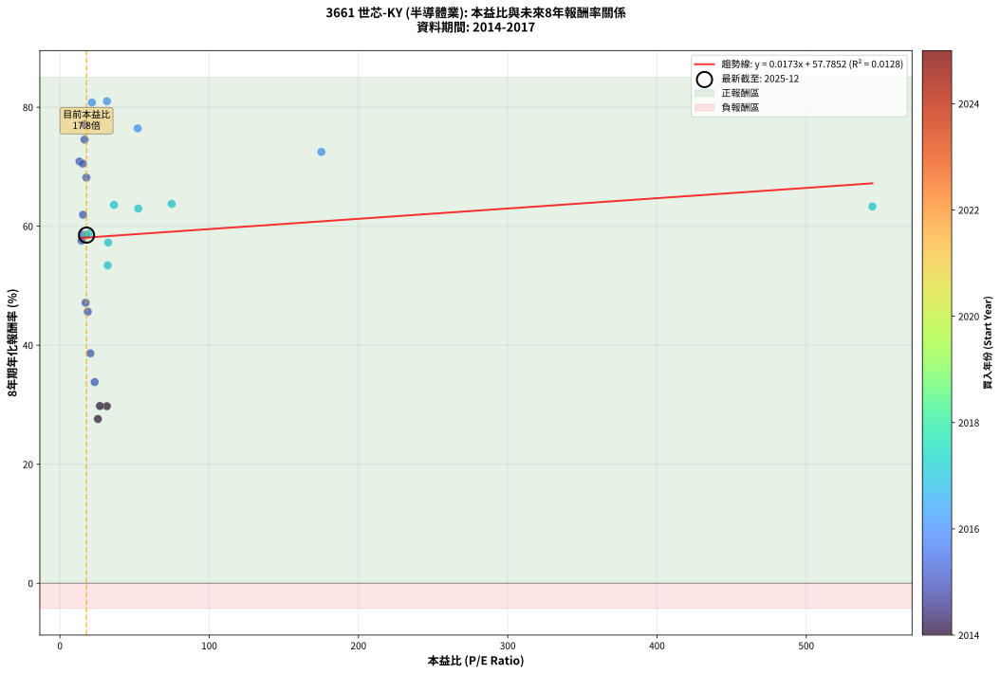
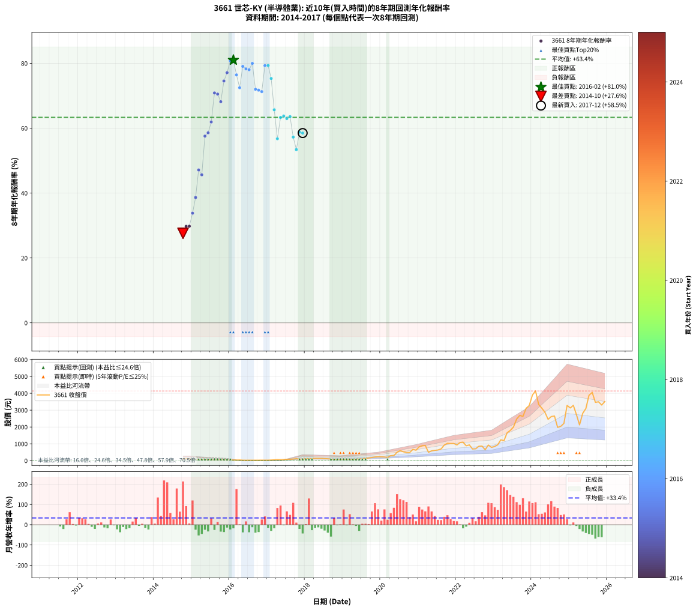

# 3661 世芯-KY - 本益比與未來報酬率分析

!!! info "報告資訊"
    - **股票代號**: 3661
    - **公司名稱**: 世芯-KY
    - **產業別**: 半導體業
    - **分析期間**: 2014-2017 (39 個數據點)
    - **資料來源**: Type 12 (ShowMonthlyK_ChartFlow) 月收盤價與本益比
    - **報酬率口徑**: 含現金股利 (簡化: 年度合計，假設每年7/1入帳)
    - **報告生成時間**: 2026-01-10 22:56:26 CST

## 📈 視覺化圖表

### 圖表1: 本益比 vs 未來報酬率關係

*圖表1：3661 世芯-KY 本益比與8年期未來報酬率關係 (2014-2017)*

### 圖表2: 歷年買入時點的8年期實際報酬率

*圖表2：3661 世芯-KY 歷年買入時點的8年期實際報酬率 (2014-2017)*

## 📍 買點訊號說明

本報告提供兩種買點提示訊號（顯示於圖表2的股價子圖中）：

### ▲ 小綠色三角形（回測驗證）
- **計算方式**: 使用全部歷史資料計算本益比第25百分位數
- **用途**: 事後驗證，顯示歷史上哪些時點確實為低估區
- **限制**: 當下無法判斷，僅供回測參考
- **特性**: 後見之明（Look-Ahead Bias）

### ▲ 小橘色三角形（即時訊號）
- **計算方式**: 使用截至當月的過去5年資料計算本益比第25百分位數
- **用途**: 實際投資決策，當時即可判斷
- **優勢**: 可操作性強，符合實務需求
- **特性**: 無後見之明，滾動窗口計算

!!! tip "如何使用兩種訊號"
    - **綠色▲** 幫助理解歷史估值機會，驗證策略有效性
    - **橘色▲** 可作為實際買進參考，但仍需搭配基本面分析
    - 兩種訊號重疊時，表示即時判斷與事後驗證一致，信心度較高
    - 僅有綠色▲時，表示當時無法判斷（需要未來資料才能確認）
    - 僅有橘色▲時，表示即時判斷為買點，但事後可能不是最佳時機

## 📊 估值分析摘要

| 指標 | 數值 |
|:---:|:---:|
| **目前本益比** (2017-12) | **17.81 倍** |
| **歷史平均本益比** | 51.00 倍 |
| **估值水準** | 🟢 相對低估 |
| **預期8年年化報酬率** | **+58.09%** |
| **歷史平均報酬率** | +63.36% |
| **相關係數 (R²)** | 0.0128 |
| **趨勢線斜率** | 0.0173 |

!!! abstract "核心洞察"
    目前本益比顯著低於歷史平均，預期未來報酬率可能較高

    根據歷史數據回測，3661 世芯-KY 在目前本益比 **17.8倍** 的估值水準下，
    預期未來8年年化報酬率約為 **+58.1%**。

    **重要提醒**: 本分析基於歷史數據統計，實際報酬率會受到公司基本面變化、產業趨勢、
    總體經濟環境等多重因素影響。R² = 0.01 表示本益比可解釋約 1.3% 的報酬率變異。

## 📈 歷史估值統計

### 最佳買點 (最高報酬率)

| 項目 | 數值 |
|:---:|:---:|
| 起始時間 | 2016-02 |
| 當時本益比 | 31.52 倍 |
| 起始價格 | 36.2 元 |
| 8年後價格 | 4140.0 元 |
| **8年年化報酬率** | **+81.01%** |

### 最差買點 (最低報酬率)

| 項目 | 數值 |
|:---:|:---:|
| 起始時間 | 2014-10 |
| 當時本益比 | 25.44 倍 |
| 起始價格 | 95.9 元 |
| 8年後價格 | 649.0 元 |
| **8年年化報酬率** | **+27.61%** |

## 🎯 投資啟示

### 本益比與報酬率關係

趨勢線方程式: **y = 0.0173x + 57.7852**

!!! info "弱相關或正相關"
    本益比與未來報酬率相關性較弱。這可能表示該股票的報酬率更多受到
    公司成長性、產業趨勢等因素影響，而非估值水準。**需綜合考量多項指標**。

### 估值區間建議

基於歷史數據分析:

- **🟢 低估區** (P/E < 40.8): 預期報酬率較高，可考慮增加持股
- **🟡 合理區** (P/E 40.8-61.2): 預期報酬率符合長期趨勢，正常持有
- **🔴 高估區** (P/E > 61.2): 預期報酬率較低，可考慮減碼或觀望

!!! danger "風險提示"
    - 過去表現不代表未來結果
    - 本分析假設公司基本面無重大結構性變化
    - 產業環境劇變可能使歷史規律失效
    - 應結合公司財報、產業趨勢、總體經濟等多重因素綜合判斷

!!! success "長期投資觀點"
    歷史數據顯示，在合理或低估的估值水準買入並長期持有，
    往往能獲得較佳的投資報酬。**耐心等待好價格**是價值投資的核心原則。

## 📊 數據品質

- **資料來源**: GoodInfo.tw Type 12 (ShowMonthlyK_ChartFlow)
- **資料頻率**: 月度收盤價與本益比
- **回測期間**: 2014-2017
- **數據點數量**: 39 個 (每個點代表一次8年期回測)

### 計算方法說明

1. **8年期年化報酬率**:
   - 對每個歷史時點，計算其後8年的實際投資報酬率
   - 期末價值(不含股利): 期末價格
   - 期末價值(含現金股利): 期末價格 + 持有期間內的現金股利合計 (簡化: 年度合計，假設每年7/1入帳)
   - 公式: 年化報酬率 = [(期末價值/期初價格)^(1/年數) - 1] × 100%

2. **本益比 (P/E Ratio)**:
   - 使用當時的月收盤價與EPS計算
   - 資料來源: Type 12 月度河流圖本益比數據

3. **趨勢線 (Linear Regression)**:
   - 使用最小平方法擬合線性趨勢線
   - R²值衡量本益比對報酬率的解釋能力

---

*本報告由 Stock Analysis System v1.9.0 自動生成*
*數據更新時間: 2026-01-10 22:56:26 CST*

## 📋 月度回測明細表

（每一列對應時間線圖中的一個買入點；可用來對照 SVG 圖上的每個點。）

| 買入月份 | 賣出月份 | 回測期限_年 | 實際持有年數 | 買入本益比_倍 | 買入收盤價_元 | 賣出收盤價_元 | 現金股利合計_元 | 總報酬率_pct | 年化報酬率_pct |
| --- | --- | --- | --- | --- | --- | --- | --- | --- | --- |
| 2014-10 | 2022-10 | 8 | 8.000 | 25.44 | 95.90 | 649.00 | 25.22 | +603.04 | +27.61 |
| 2014-11 | 2022-11 | 8 | 8.000 | 31.43 | 118.50 | 927.00 | 25.22 | +703.56 | +29.76 |
| 2014-12 | 2022-12 | 8 | 8.000 | 26.79 | 101.00 | 788.00 | 25.22 | +705.17 | +29.79 |
| 2015-01 | 2023-01 | 8 | 8.000 | 23.29 | 84.50 | 843.00 | 25.22 | +927.48 | +33.80 |
| 2015-02 | 2023-02 | 8 | 8.000 | 20.36 | 71.00 | 944.00 | 25.22 | +1265.09 | +38.64 |
| 2015-03 | 2023-03 | 8 | 8.000 | 17.22 | 57.60 | 1240.00 | 25.22 | +2096.56 | +47.14 |
| 2015-04 | 2023-04 | 8 | 8.000 | 18.67 | 59.80 | 1185.00 | 25.22 | +1923.77 | +45.64 |
| 2015-05 | 2023-05 | 8 | 8.000 | 14.44 | 44.20 | 1655.00 | 25.22 | +3701.40 | +57.58 |
| 2015-06 | 2023-06 | 8 | 8.000 | 15.58 | 45.50 | 1795.00 | 25.22 | +3900.48 | +58.59 |
| 2015-07 | 2023-07 | 8 | 8.000 | 15.44 | 42.90 | 1990.00 | 37.62 | +4626.39 | +61.93 |
| 2015-08 | 2023-08 | 8 | 8.000 | 13.08 | 34.50 | 2470.00 | 37.62 | +7168.47 | +70.88 |
| 2015-09 | 2023-09 | 8 | 8.000 | 15.29 | 38.15 | 2690.00 | 37.62 | +7049.73 | +70.52 |
| 2015-10 | 2023-10 | 8 | 8.000 | 17.68 | 41.60 | 2625.00 | 37.62 | +6300.53 | +68.18 |
| 2015-11 | 2023-11 | 8 | 8.000 | 16.50 | 36.50 | 3110.00 | 37.62 | +8523.62 | +74.57 |
| 2015-12 | 2023-12 | 8 | 8.000 | 16.52 | 34.20 | 3275.00 | 37.62 | +9586.03 | +77.12 |
| 2016-01 | 2024-01 | 8 | 8.000 | 21.43 | 34.50 | 3900.00 | 37.62 | +11313.39 | +80.79 |
| 2016-02 | 2024-02 | 8 | 8.000 | 31.52 | 36.25 | 4140.00 | 37.62 | +11424.47 | +81.01 |
| 2016-03 | 2024-03 | 8 | 8.000 | 52.10 | 35.95 | 3340.00 | 37.62 | +9295.33 | +76.45 |
| 2016-04 | 2024-04 | 8 | 8.000 | 175.20 | 40.30 | 3120.00 | 37.62 | +7735.29 | +72.49 |
| 2016-05 | 2024-05 | 8 | 8.000 |  | 27.50 | 2870.00 | 37.62 | +10473.17 | +79.07 |
| 2016-06 | 2024-06 | 8 | 8.000 |  | 24.40 | 2455.00 | 37.62 | +10115.66 | +78.30 |
| 2016-07 | 2024-07 | 8 | 8.000 |  | 26.55 | 2620.00 | 59.57 | +9992.53 | +78.03 |
| 2016-08 | 2024-08 | 8 | 8.000 |  | 24.60 | 2650.00 | 59.57 | +10914.50 | +79.99 |
| 2016-09 | 2024-09 | 8 | 8.000 |  | 26.55 | 1975.00 | 59.57 | +7563.15 | +72.01 |
| 2016-10 | 2024-10 | 8 | 8.000 |  | 27.75 | 2040.00 | 59.57 | +7466.01 | +71.73 |
| 2016-11 | 2024-11 | 8 | 8.000 |  | 30.70 | 2215.00 | 59.57 | +7309.01 | +71.29 |
| 2016-12 | 2024-12 | 8 | 8.000 |  | 31.25 | 3280.00 | 59.57 | +10586.61 | +79.31 |
| 2017-01 | 2025-01 | 8 | 8.000 |  | 29.80 | 3130.00 | 59.57 | +10603.24 | +79.35 |
| 2017-02 | 2025-02 | 8 | 8.000 |  | 37.45 | 3285.00 | 59.57 | +8830.75 | +75.33 |
| 2017-03 | 2025-03 | 8 | 8.000 |  | 49.30 | 2740.00 | 59.57 | +5578.63 | +65.68 |
| 2017-04 | 2025-04 | 8 | 8.000 |  | 59.90 | 2125.00 | 59.57 | +3547.02 | +56.76 |
| 2017-05 | 2025-05 | 8 | 8.000 | 544.30 | 56.70 | 2810.00 | 59.57 | +4960.96 | +63.32 |
| 2017-06 | 2025-06 | 8 | 8.000 | 74.85 | 61.00 | 3095.00 | 59.57 | +5071.42 | +63.76 |
| 2017-07 | 2025-07 | 8 | 8.000 | 52.43 | 80.00 | 3885.00 | 96.05 | +4876.31 | +62.97 |
| 2017-08 | 2025-08 | 8 | 8.000 | 36.21 | 81.00 | 4055.00 | 96.05 | +5024.75 | +63.57 |
| 2017-09 | 2025-09 | 8 | 8.000 | 32.30 | 95.20 | 3465.00 | 96.05 | +3640.60 | +57.26 |
| 2017-10 | 2025-10 | 8 | 8.000 | 31.98 | 117.00 | 3495.00 | 96.05 | +2969.27 | +53.42 |
| 2017-11 | 2025-11 | 8 | 8.000 | 19.27 | 84.20 | 3305.00 | 96.05 | +3939.25 | +58.78 |
| 2017-12 | 2025-12 | 8 | 8.000 | 17.81 | 90.50 | 3510.00 | 96.05 | +3884.58 | +58.51 |
