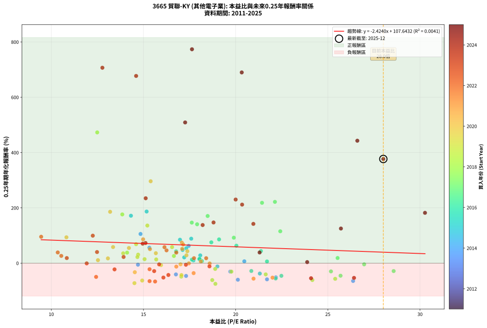
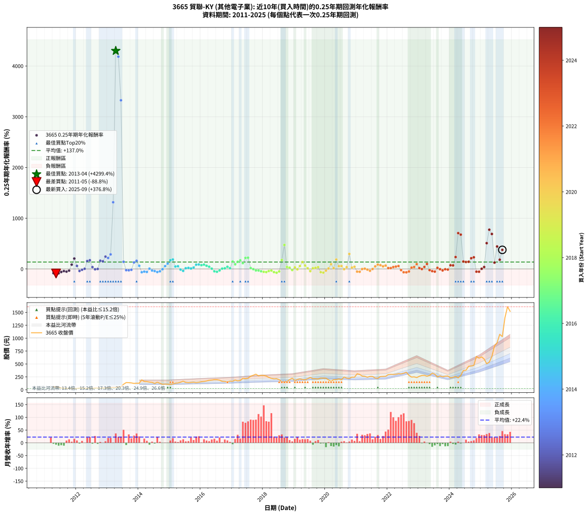

# 3665 貿聯-KY - 本益比與未來報酬率分析

!!! info "報告資訊"
    - **股票代號**: 3665
    - **公司名稱**: 貿聯-KY
    - **產業別**: 其他電子業
    - **分析期間**: 2011-2025 (174 個數據點)
    - **資料來源**: Type 12 (ShowMonthlyK_ChartFlow) 月收盤價與本益比
    - **報酬率口徑**: 含現金股利 (簡化: 年度合計，假設每年7/1入帳)
    - **報告生成時間**: 2026-01-05 00:58:19 CST

## 📈 視覺化圖表

### 圖表1: 本益比 vs 未來報酬率關係

*圖表1：3665 貿聯-KY 本益比與0.25年期未來報酬率關係 (2011-2025)*

### 圖表2: 歷年買入時點的0.25年期實際報酬率

*圖表2：3665 貿聯-KY 歷年買入時點的0.25年期實際報酬率 (2011-2025)*

## 📍 買點訊號說明

本報告提供兩種買點提示訊號（顯示於圖表2的股價子圖中）：

### ▲ 小綠色三角形（回測驗證）
- **計算方式**: 使用全部歷史資料計算本益比第25百分位數
- **用途**: 事後驗證，顯示歷史上哪些時點確實為低估區
- **限制**: 當下無法判斷，僅供回測參考
- **特性**: 後見之明（Look-Ahead Bias）

### ▲ 小橘色三角形（即時訊號）
- **計算方式**: 使用截至當月的過去5年資料計算本益比第25百分位數
- **用途**: 實際投資決策，當時即可判斷
- **優勢**: 可操作性強，符合實務需求
- **特性**: 無後見之明，滾動窗口計算

!!! tip "如何使用兩種訊號"
    - **綠色▲** 幫助理解歷史估值機會，驗證策略有效性
    - **橘色▲** 可作為實際買進參考，但仍需搭配基本面分析
    - 兩種訊號重疊時，表示即時判斷與事後驗證一致，信心度較高
    - 僅有綠色▲時，表示當時無法判斷（需要未來資料才能確認）
    - 僅有橘色▲時，表示即時判斷為買點，但事後可能不是最佳時機

## 📊 估值分析摘要

| 指標 | 數值 |
|:---:|:---:|
| **目前本益比** (2025-09) | **28.01 倍** |
| **歷史平均本益比** | 17.87 倍 |
| **估值水準** | 🔴 相對高估 |
| **預期0.25年年化報酬率** | **+39.75%** |
| **歷史平均報酬率** | +137.00% |
| **相關係數 (R²)** | 0.0041 |
| **趨勢線斜率** | -2.4240 |

!!! abstract "核心洞察"
    目前本益比顯著高於歷史平均，預期未來報酬率可能較低

    根據歷史數據回測，3665 貿聯-KY 在目前本益比 **28.0倍** 的估值水準下，
    預期未來0.25年年化報酬率約為 **+39.7%**。

    **重要提醒**: 本分析基於歷史數據統計，實際報酬率會受到公司基本面變化、產業趨勢、
    總體經濟環境等多重因素影響。R² = 0.00 表示本益比可解釋約 0.4% 的報酬率變異。

## 📈 歷史估值統計

### 最佳買點 (最高報酬率)

| 項目 | 數值 |
|:---:|:---:|
| 起始時間 | 2013-04 |
| 當時本益比 | nan 倍 |
| 起始價格 | 42.9 元 |
| 0.25年後價格 | 106.5 元 |
| **0.25年年化報酬率** | **+4299.38%** |

### 最差買點 (最低報酬率)

| 項目 | 數值 |
|:---:|:---:|
| 起始時間 | 2011-05 |
| 當時本益比 | nan 倍 |
| 起始價格 | 55.2 元 |
| 0.25年後價格 | 28.3 元 |
| **0.25年年化報酬率** | **-88.80%** |

## 🎯 投資啟示

### 本益比與報酬率關係

趨勢線方程式: **y = -2.4240x + 107.6432**

!!! warning "強負相關"
    本益比與未來報酬率呈現強負相關。在高本益比時期買入，未來報酬率顯著較低；
    在低本益比時期買入，未來報酬率顯著較高。**估值紀律至關重要**。

### 估值區間建議

基於歷史數據分析:

- **🟢 低估區** (P/E < 14.3): 預期報酬率較高，可考慮增加持股
- **🟡 合理區** (P/E 14.3-21.4): 預期報酬率符合長期趨勢，正常持有
- **🔴 高估區** (P/E > 21.4): 預期報酬率較低，可考慮減碼或觀望

!!! danger "風險提示"
    - 過去表現不代表未來結果
    - 本分析假設公司基本面無重大結構性變化
    - 產業環境劇變可能使歷史規律失效
    - 應結合公司財報、產業趨勢、總體經濟等多重因素綜合判斷

!!! success "長期投資觀點"
    歷史數據顯示，在合理或低估的估值水準買入並長期持有，
    往往能獲得較佳的投資報酬。**耐心等待好價格**是價值投資的核心原則。

## 📊 數據品質

- **資料來源**: GoodInfo.tw Type 12 (ShowMonthlyK_ChartFlow)
- **資料頻率**: 月度收盤價與本益比
- **回測期間**: 2011-2025
- **數據點數量**: 174 個 (每個點代表一次0.25年期回測)

### 計算方法說明

1. **0.25年期年化報酬率**:
   - 對每個歷史時點，計算其後0.25年的實際投資報酬率
   - 期末價值(不含股利): 期末價格
   - 期末價值(含現金股利): 期末價格 + 持有期間內的現金股利合計 (簡化: 年度合計，假設每年7/1入帳)
   - 公式: 年化報酬率 = [(期末價值/期初價格)^(1/年數) - 1] × 100%

2. **本益比 (P/E Ratio)**:
   - 使用當時的月收盤價與EPS計算
   - 資料來源: Type 12 月度河流圖本益比數據

3. **趨勢線 (Linear Regression)**:
   - 使用最小平方法擬合線性趨勢線
   - R²值衡量本益比對報酬率的解釋能力

---

*本報告由 Stock Analysis System v1.9.0 自動生成*
*數據更新時間: 2026-01-05 00:58:19 CST*

## 📋 月度回測明細表

（每一列對應時間線圖中的一個買入點；可用來對照 SVG 圖上的每個點。）

| 買入月份 | 賣出月份 | 回測期限_年 | 實際持有年數 | 買入本益比_倍 | 買入收盤價_元 | 賣出收盤價_元 | 現金股利合計_元 | 總報酬率_pct | 年化報酬率_pct |
| --- | --- | --- | --- | --- | --- | --- | --- | --- | --- |
| 2011-04 | 2011-07 | 0.25 | 0.249 |  | 57.90 | 33.80 | 3.50 | -35.58 | -82.88 |
| 2011-05 | 2011-08 | 0.25 | 0.252 |  | 55.20 | 28.30 | 3.50 | -42.39 | -88.80 |
| 2011-06 | 2011-09 | 0.25 | 0.252 |  | 51.80 | 28.45 | 3.50 | -38.32 | -85.32 |
| 2011-07 | 2011-10 | 0.25 | 0.252 |  | 33.80 | 27.00 | 0.00 | -20.12 | -59.01 |
| 2011-08 | 2011-12 | 0.25 | 0.334 |  | 28.30 | 23.70 | 0.00 | -16.25 | -41.20 |
| 2011-09 | 2011-12 | 0.25 | 0.249 |  | 28.45 | 23.70 | 0.00 | -16.70 | -51.96 |
| 2011-10 | 2012-01 | 0.25 | 0.252 |  | 27.00 | 24.45 | 0.00 | -9.44 | -32.56 |
| 2011-11 | 2012-03 | 0.25 | 0.331 |  | 25.50 | 31.30 | 0.00 | +22.75 | +85.64 |
| 2011-12 | 2012-03 | 0.25 | 0.249 |  | 23.70 | 31.30 | 0.00 | +32.07 | +205.38 |
| 2012-01 | 2012-05 | 0.25 | 0.331 |  | 24.45 | 28.60 | 0.00 | +16.97 | +60.52 |
| 2012-02 | 2012-05 | 0.25 | 0.249 |  | 32.35 | 28.60 | 0.00 | -11.59 | -39.01 |
| 2012-03 | 2012-07 | 0.25 | 0.334 |  | 31.30 | 27.50 | 2.00 | -5.75 | -16.25 |
| 2012-04 | 2012-07 | 0.25 | 0.249 |  | 29.25 | 27.50 | 2.00 | +0.85 | +3.47 |
| 2012-05 | 2012-08 | 0.25 | 0.252 |  | 28.60 | 34.25 | 2.00 | +26.75 | +156.27 |
| 2012-06 | 2012-09 | 0.25 | 0.252 |  | 27.55 | 33.45 | 2.00 | +28.68 | +172.09 |
| 2012-07 | 2012-10 | 0.25 | 0.252 |  | 27.50 | 29.80 | 0.00 | +8.36 | +37.56 |
| 2012-08 | 2012-12 | 0.25 | 0.334 |  | 34.25 | 33.50 | 0.00 | -2.19 | -6.41 |
| 2012-09 | 2012-12 | 0.25 | 0.249 |  | 33.45 | 33.50 | 0.00 | +0.15 | +0.60 |
| 2012-10 | 2013-01 | 0.25 | 0.252 |  | 29.80 | 38.00 | 0.00 | +27.52 | +162.49 |
| 2012-11 | 2013-03 | 0.25 | 0.329 |  | 33.55 | 45.40 | 0.00 | +35.32 | +151.09 |
| 2012-12 | 2013-03 | 0.25 | 0.246 |  | 33.50 | 45.40 | 0.00 | +35.52 | +243.36 |
| 2013-01 | 2013-05 | 0.25 | 0.329 |  | 38.00 | 55.50 | 0.00 | +46.05 | +216.76 |
| 2013-02 | 2013-05 | 0.25 | 0.246 |  | 39.75 | 55.50 | 0.00 | +39.62 | +287.51 |
| 2013-03 | 2013-07 | 0.25 | 0.334 |  | 45.40 | 106.50 | 3.50 | +142.29 | +1314.65 |
| 2013-04 | 2013-07 | 0.25 | 0.249 |  | 42.85 | 106.50 | 3.50 | +156.71 | +4299.38 |
| 2013-05 | 2013-08 | 0.25 | 0.252 |  | 55.50 | 139.50 | 3.50 | +157.66 | +4184.36 |
| 2013-06 | 2013-09 | 0.25 | 0.252 |  | 57.90 | 137.50 | 3.50 | +143.52 | +3324.59 |
| 2013-07 | 2013-10 | 0.25 | 0.252 |  | 106.50 | 133.00 | 0.00 | +24.88 | +141.61 |
| 2013-08 | 2013-12 | 0.25 | 0.334 |  | 139.50 | 127.50 | 0.00 | -8.60 | -23.61 |
| 2013-09 | 2013-12 | 0.25 | 0.249 |  | 137.50 | 127.50 | 0.00 | -7.27 | -26.15 |
| 2013-10 | 2014-01 | 0.25 | 0.252 |  | 133.00 | 127.00 | 0.00 | -4.51 | -16.75 |
| 2013-11 | 2014-03 | 0.25 | 0.329 |  | 123.00 | 161.50 | 0.00 | +31.30 | +129.07 |
| 2013-12 | 2014-03 | 0.25 | 0.246 |  | 127.50 | 161.50 | 0.00 | +26.67 | +161.00 |
| 2014-01 | 2014-05 | 0.25 | 0.329 | 17.45 | 127.00 | 149.00 | 0.00 | +17.32 | +62.62 |
| 2014-02 | 2014-05 | 0.25 | 0.246 | 26.37 | 192.00 | 149.00 | 0.00 | -22.40 | -64.26 |
| 2014-03 | 2014-07 | 0.25 | 0.334 | 22.18 | 161.50 | 122.00 | 4.99 | -21.37 | -51.31 |
| 2014-04 | 2014-07 | 0.25 | 0.249 | 21.70 | 158.00 | 122.00 | 4.99 | -19.62 | -58.39 |
| 2014-05 | 2014-08 | 0.25 | 0.252 | 20.47 | 149.00 | 146.50 | 4.99 | +1.67 | +6.81 |
| 2014-06 | 2014-09 | 0.25 | 0.252 | 19.71 | 143.50 | 126.00 | 4.99 | -8.72 | -30.37 |
| 2014-07 | 2014-10 | 0.25 | 0.252 | 16.76 | 122.00 | 107.00 | 0.00 | -12.30 | -40.60 |
| 2014-08 | 2014-12 | 0.25 | 0.334 | 20.12 | 146.50 | 108.00 | 0.00 | -26.28 | -59.86 |
| 2014-09 | 2014-12 | 0.25 | 0.249 | 17.31 | 126.00 | 108.00 | 0.00 | -14.29 | -46.14 |
| 2014-10 | 2015-01 | 0.25 | 0.252 | 14.70 | 107.00 | 105.50 | 0.00 | -1.40 | -5.45 |
| 2014-11 | 2015-03 | 0.25 | 0.329 | 15.32 | 111.50 | 129.00 | 0.00 | +15.70 | +55.85 |
| 2014-12 | 2015-03 | 0.25 | 0.246 | 14.84 | 108.00 | 129.00 | 0.00 | +19.44 | +105.67 |
| 2015-01 | 2015-05 | 0.25 | 0.329 | 14.32 | 105.50 | 146.50 | 0.00 | +38.86 | +171.64 |
| 2015-02 | 2015-05 | 0.25 | 0.246 | 15.17 | 113.00 | 146.50 | 0.00 | +29.65 | +186.82 |
| 2015-03 | 2015-07 | 0.25 | 0.334 | 17.12 | 129.00 | 142.00 | 4.97 | +13.93 | +47.76 |
| 2015-04 | 2015-07 | 0.25 | 0.249 | 17.32 | 132.00 | 142.00 | 4.97 | +11.34 | +53.90 |
| 2015-05 | 2015-08 | 0.25 | 0.252 | 19.01 | 146.50 | 137.00 | 4.97 | -3.09 | -11.73 |
| 2015-06 | 2015-09 | 0.25 | 0.252 | 21.31 | 166.00 | 142.50 | 4.97 | -11.16 | -37.50 |
| 2015-07 | 2015-10 | 0.25 | 0.252 | 18.03 | 142.00 | 147.00 | 0.00 | +3.52 | +14.73 |
| 2015-08 | 2015-12 | 0.25 | 0.334 | 17.21 | 137.00 | 146.00 | 0.00 | +6.57 | +20.98 |
| 2015-09 | 2015-12 | 0.25 | 0.249 | 17.71 | 142.50 | 146.00 | 0.00 | +2.46 | +10.23 |
| 2015-10 | 2016-01 | 0.25 | 0.252 | 18.08 | 147.00 | 156.50 | 0.00 | +6.46 | +28.23 |
| 2015-11 | 2016-03 | 0.25 | 0.331 | 16.98 | 139.50 | 171.00 | 0.00 | +22.58 | +84.89 |
| 2015-12 | 2016-03 | 0.25 | 0.249 | 17.59 | 146.00 | 171.00 | 0.00 | +17.12 | +88.59 |
| 2016-01 | 2016-05 | 0.25 | 0.331 | 18.68 | 156.50 | 188.50 | 0.00 | +20.45 | +75.35 |
| 2016-02 | 2016-05 | 0.25 | 0.249 | 19.10 | 161.50 | 188.50 | 0.00 | +16.72 | +85.98 |
| 2016-03 | 2016-07 | 0.25 | 0.334 | 20.04 | 171.00 | 196.00 | 5.41 | +17.78 | +63.22 |
| 2016-04 | 2016-07 | 0.25 | 0.249 | 21.37 | 184.00 | 196.00 | 5.41 | +9.46 | +43.73 |
| 2016-05 | 2016-08 | 0.25 | 0.252 | 21.70 | 188.50 | 186.00 | 5.41 | +1.54 | +6.26 |
| 2016-06 | 2016-09 | 0.25 | 0.252 | 22.48 | 197.00 | 163.50 | 5.41 | -14.26 | -45.71 |
| 2016-07 | 2016-10 | 0.25 | 0.252 | 22.17 | 196.00 | 160.00 | 0.00 | -18.37 | -55.32 |
| 2016-08 | 2016-12 | 0.25 | 0.334 | 20.85 | 186.00 | 166.50 | 0.00 | -10.48 | -28.22 |
| 2016-09 | 2016-12 | 0.25 | 0.249 | 18.17 | 163.50 | 166.50 | 0.00 | +1.83 | +7.57 |
| 2016-10 | 2017-01 | 0.25 | 0.252 | 17.63 | 160.00 | 165.00 | 0.00 | +3.12 | +12.99 |
| 2016-11 | 2017-03 | 0.25 | 0.329 | 16.77 | 153.50 | 172.50 | 0.00 | +12.38 | +42.65 |
| 2016-12 | 2017-03 | 0.25 | 0.246 | 18.04 | 166.50 | 172.50 | 0.00 | +3.60 | +15.45 |
| 2017-01 | 2017-05 | 0.25 | 0.329 | 17.62 | 165.00 | 222.00 | 0.00 | +34.55 | +146.74 |
| 2017-02 | 2017-05 | 0.25 | 0.246 | 19.90 | 189.00 | 222.00 | 0.00 | +17.46 | +92.15 |
| 2017-03 | 2017-07 | 0.25 | 0.334 | 17.91 | 172.50 | 225.00 | 6.31 | +34.10 | +140.69 |
| 2017-04 | 2017-07 | 0.25 | 0.249 | 18.48 | 180.50 | 225.00 | 6.31 | +28.15 | +170.63 |
| 2017-05 | 2017-08 | 0.25 | 0.252 | 22.42 | 222.00 | 263.00 | 6.31 | +21.31 | +115.34 |
| 2017-06 | 2017-09 | 0.25 | 0.252 | 21.43 | 215.00 | 281.50 | 6.31 | +33.87 | +218.35 |
| 2017-07 | 2017-10 | 0.25 | 0.252 | 22.13 | 225.00 | 302.00 | 0.00 | +34.22 | +221.72 |
| 2017-08 | 2017-12 | 0.25 | 0.334 | 25.53 | 263.00 | 278.50 | 0.00 | +5.89 | +18.70 |
| 2017-09 | 2017-12 | 0.25 | 0.249 | 26.97 | 281.50 | 278.50 | 0.00 | -1.07 | -4.21 |
| 2017-10 | 2018-01 | 0.25 | 0.252 | 28.57 | 302.00 | 277.50 | 0.00 | -8.11 | -28.53 |
| 2017-11 | 2018-03 | 0.25 | 0.329 | 25.17 | 269.50 | 240.00 | 0.00 | -10.95 | -29.73 |
| 2017-12 | 2018-03 | 0.25 | 0.246 | 25.69 | 278.50 | 240.00 | 0.00 | -13.82 | -45.33 |
| 2018-01 | 2018-05 | 0.25 | 0.329 | 25.40 | 277.50 | 211.00 | 0.00 | -23.96 | -56.56 |
| 2018-02 | 2018-05 | 0.25 | 0.246 | 24.16 | 266.00 | 211.00 | 0.00 | -20.68 | -60.94 |
| 2018-03 | 2018-07 | 0.25 | 0.334 | 21.63 | 240.00 | 195.00 | 6.83 | -15.90 | -40.46 |
| 2018-04 | 2018-07 | 0.25 | 0.249 | 19.77 | 221.00 | 195.00 | 6.83 | -8.68 | -30.53 |
| 2018-05 | 2018-08 | 0.25 | 0.252 | 18.73 | 211.00 | 159.50 | 6.83 | -21.17 | -61.11 |
| 2018-06 | 2018-09 | 0.25 | 0.252 | 18.90 | 214.50 | 145.00 | 6.83 | -29.22 | -74.64 |
| 2018-07 | 2018-10 | 0.25 | 0.252 | 17.05 | 195.00 | 165.00 | 0.00 | -15.38 | -48.48 |
| 2018-08 | 2018-12 | 0.25 | 0.334 | 13.85 | 159.50 | 224.00 | 0.00 | +40.44 | +176.41 |
| 2018-09 | 2018-12 | 0.25 | 0.249 | 12.49 | 145.00 | 224.00 | 0.00 | +54.48 | +472.95 |
| 2018-10 | 2019-01 | 0.25 | 0.252 | 14.11 | 165.00 | 179.00 | 0.00 | +8.48 | +38.17 |
| 2018-11 | 2019-03 | 0.25 | 0.329 | 16.65 | 196.00 | 211.50 | 0.00 | +7.91 | +26.07 |
| 2018-12 | 2019-03 | 0.25 | 0.246 | 18.89 | 224.00 | 211.50 | 0.00 | -5.58 | -20.79 |
| 2019-01 | 2019-05 | 0.25 | 0.329 | 14.71 | 179.00 | 195.50 | 0.00 | +9.22 | +30.78 |
| 2019-02 | 2019-05 | 0.25 | 0.246 | 15.95 | 199.00 | 195.50 | 0.00 | -1.76 | -6.95 |
| 2019-03 | 2019-07 | 0.25 | 0.334 | 16.55 | 211.50 | 239.00 | 7.50 | +16.55 | +58.17 |
| 2019-04 | 2019-07 | 0.25 | 0.249 | 15.21 | 199.00 | 239.00 | 7.50 | +23.87 | +136.12 |
| 2019-05 | 2019-08 | 0.25 | 0.252 | 14.60 | 195.50 | 215.50 | 7.50 | +14.07 | +68.63 |
| 2019-06 | 2019-09 | 0.25 | 0.252 | 15.69 | 215.00 | 214.50 | 7.50 | +3.26 | +13.56 |
| 2019-07 | 2019-10 | 0.25 | 0.252 | 17.06 | 239.00 | 207.50 | 0.00 | -13.18 | -42.94 |
| 2019-08 | 2019-12 | 0.25 | 0.334 | 15.06 | 215.50 | 225.50 | 0.00 | +4.64 | +14.55 |
| 2019-09 | 2019-12 | 0.25 | 0.249 | 14.67 | 214.50 | 225.50 | 0.00 | +5.13 | +22.23 |
| 2019-10 | 2020-01 | 0.25 | 0.252 | 13.90 | 207.50 | 224.00 | 0.00 | +7.95 | +35.50 |
| 2019-11 | 2020-03 | 0.25 | 0.331 | 14.93 | 227.50 | 164.00 | 0.00 | -27.91 | -62.77 |
| 2019-12 | 2020-03 | 0.25 | 0.249 | 14.51 | 225.50 | 164.00 | 0.00 | -27.27 | -72.15 |
| 2020-01 | 2020-05 | 0.25 | 0.331 | 14.53 | 224.00 | 196.50 | 0.00 | -12.28 | -32.66 |
| 2020-02 | 2020-05 | 0.25 | 0.249 | 12.53 | 191.50 | 196.50 | 0.00 | +2.61 | +10.90 |
| 2020-03 | 2020-07 | 0.25 | 0.334 | 10.82 | 164.00 | 195.50 | 9.00 | +24.70 | +93.62 |
| 2020-04 | 2020-07 | 0.25 | 0.249 | 13.07 | 196.50 | 195.50 | 9.00 | +4.07 | +17.37 |
| 2020-05 | 2020-08 | 0.25 | 0.252 | 13.19 | 196.50 | 247.00 | 9.00 | +30.28 | +185.81 |
| 2020-06 | 2020-09 | 0.25 | 0.252 | 14.21 | 210.00 | 225.50 | 9.00 | +11.67 | +54.98 |
| 2020-07 | 2020-10 | 0.25 | 0.252 | 13.35 | 195.50 | 219.50 | 0.00 | +12.28 | +58.36 |
| 2020-08 | 2020-12 | 0.25 | 0.334 | 17.01 | 247.00 | 243.50 | 0.00 | -1.42 | -4.18 |
| 2020-09 | 2020-12 | 0.25 | 0.249 | 15.67 | 225.50 | 243.50 | 0.00 | +7.98 | +36.10 |
| 2020-10 | 2021-01 | 0.25 | 0.252 | 15.39 | 219.50 | 310.50 | 0.00 | +41.46 | +296.28 |
| 2020-11 | 2021-03 | 0.25 | 0.329 | 17.33 | 245.00 | 266.00 | 0.00 | +8.57 | +28.44 |
| 2020-12 | 2021-03 | 0.25 | 0.246 | 17.38 | 243.50 | 266.00 | 0.00 | +9.24 | +43.14 |
| 2021-01 | 2021-05 | 0.25 | 0.329 | 22.00 | 310.50 | 243.50 | 0.00 | -21.58 | -52.28 |
| 2021-02 | 2021-05 | 0.25 | 0.246 | 20.97 | 298.00 | 243.50 | 0.00 | -18.29 | -55.94 |
| 2021-03 | 2021-07 | 0.25 | 0.334 | 18.59 | 266.00 | 257.00 | 8.03 | -0.37 | -1.09 |
| 2021-04 | 2021-07 | 0.25 | 0.249 | 18.11 | 261.00 | 257.00 | 8.03 | +1.54 | +6.34 |
| 2021-05 | 2021-08 | 0.25 | 0.252 | 16.78 | 243.50 | 227.50 | 8.03 | -3.28 | -12.38 |
| 2021-06 | 2021-09 | 0.25 | 0.252 | 17.72 | 259.00 | 223.50 | 8.03 | -10.61 | -35.93 |
| 2021-07 | 2021-10 | 0.25 | 0.252 | 17.46 | 257.00 | 256.50 | 0.00 | -0.19 | -0.77 |
| 2021-08 | 2021-12 | 0.25 | 0.334 | 15.35 | 227.50 | 261.00 | 0.00 | +14.73 | +50.87 |
| 2021-09 | 2021-12 | 0.25 | 0.249 | 14.98 | 223.50 | 261.00 | 0.00 | +16.78 | +86.37 |
| 2021-10 | 2022-01 | 0.25 | 0.252 | 17.08 | 256.50 | 295.00 | 0.00 | +15.01 | +74.23 |
| 2021-11 | 2022-03 | 0.25 | 0.329 | 17.10 | 258.50 | 296.50 | 0.00 | +14.70 | +51.81 |
| 2021-12 | 2022-03 | 0.25 | 0.246 | 17.15 | 261.00 | 296.50 | 0.00 | +13.60 | +67.79 |
| 2022-01 | 2022-05 | 0.25 | 0.329 | 18.40 | 295.00 | 311.50 | 0.00 | +5.59 | +18.02 |
| 2022-02 | 2022-05 | 0.25 | 0.246 | 17.74 | 299.00 | 311.50 | 0.00 | +4.18 | +18.08 |
| 2022-03 | 2022-07 | 0.25 | 0.334 | 16.78 | 296.50 | 321.00 | 9.45 | +11.45 | +38.34 |
| 2022-04 | 2022-07 | 0.25 | 0.249 | 16.25 | 300.50 | 321.00 | 9.45 | +9.97 | +46.42 |
| 2022-05 | 2022-08 | 0.25 | 0.252 | 16.14 | 311.50 | 340.00 | 9.45 | +12.18 | +57.84 |
| 2022-06 | 2022-09 | 0.25 | 0.252 | 15.33 | 308.50 | 280.50 | 9.45 | -6.01 | -21.82 |
| 2022-07 | 2022-10 | 0.25 | 0.252 | 15.33 | 321.00 | 246.50 | 0.00 | -23.21 | -64.95 |
| 2022-08 | 2022-12 | 0.25 | 0.334 | 15.63 | 340.00 | 236.50 | 0.00 | -30.44 | -66.27 |
| 2022-09 | 2022-12 | 0.25 | 0.249 | 12.43 | 280.50 | 236.50 | 0.00 | -15.69 | -49.58 |
| 2022-10 | 2023-01 | 0.25 | 0.252 | 10.54 | 246.50 | 261.50 | 0.00 | +6.09 | +26.43 |
| 2022-11 | 2023-03 | 0.25 | 0.329 | 10.35 | 250.50 | 279.00 | 0.00 | +11.38 | +38.82 |
| 2022-12 | 2023-03 | 0.25 | 0.246 | 9.45 | 236.50 | 279.00 | 0.00 | +17.97 | +95.56 |
| 2023-01 | 2023-05 | 0.25 | 0.329 | 10.84 | 261.50 | 276.50 | 0.00 | +5.74 | +18.50 |
| 2023-02 | 2023-05 | 0.25 | 0.246 | 11.92 | 277.00 | 276.50 | 0.00 | -0.18 | -0.73 |
| 2023-03 | 2023-07 | 0.25 | 0.334 | 12.48 | 279.00 | 302.50 | 9.89 | +11.97 | +40.27 |
| 2023-04 | 2023-07 | 0.25 | 0.249 | 12.25 | 263.00 | 302.50 | 9.89 | +18.78 | +99.51 |
| 2023-05 | 2023-08 | 0.25 | 0.252 | 13.43 | 276.50 | 249.50 | 9.89 | -6.19 | -22.40 |
| 2023-06 | 2023-09 | 0.25 | 0.252 | 16.35 | 322.00 | 270.00 | 9.89 | -13.08 | -42.68 |
| 2023-07 | 2023-10 | 0.25 | 0.252 | 16.08 | 302.50 | 251.50 | 0.00 | -16.86 | -51.96 |
| 2023-08 | 2023-12 | 0.25 | 0.334 | 13.92 | 249.50 | 267.00 | 0.00 | +7.01 | +22.50 |
| 2023-09 | 2023-12 | 0.25 | 0.249 | 15.85 | 270.00 | 267.00 | 0.00 | -1.11 | -4.39 |
| 2023-10 | 2024-01 | 0.25 | 0.252 | 15.58 | 251.50 | 231.00 | 0.00 | -8.15 | -28.65 |
| 2023-11 | 2024-03 | 0.25 | 0.331 | 17.30 | 264.00 | 259.00 | 0.00 | -1.89 | -5.61 |
| 2023-12 | 2024-03 | 0.25 | 0.249 | 18.58 | 267.00 | 259.00 | 0.00 | -3.00 | -11.49 |
| 2024-01 | 2024-05 | 0.25 | 0.331 | 15.11 | 231.00 | 277.00 | 0.00 | +19.91 | +73.01 |
| 2024-02 | 2024-05 | 0.25 | 0.249 | 14.96 | 242.50 | 277.00 | 0.00 | +14.23 | +70.56 |
| 2024-03 | 2024-07 | 0.25 | 0.334 | 15.12 | 259.00 | 379.00 | 8.78 | +49.72 | +234.80 |
| 2024-04 | 2024-07 | 0.25 | 0.249 | 12.77 | 230.50 | 379.00 | 8.78 | +68.23 | +706.80 |
| 2024-05 | 2024-08 | 0.25 | 0.252 | 14.60 | 277.00 | 455.50 | 8.78 | +67.61 | +677.14 |
| 2024-06 | 2024-09 | 0.25 | 0.252 | 18.80 | 374.00 | 461.00 | 8.78 | +25.61 | +147.25 |
| 2024-07 | 2024-10 | 0.25 | 0.252 | 18.21 | 379.00 | 471.50 | 0.00 | +24.41 | +137.98 |
| 2024-08 | 2024-12 | 0.25 | 0.334 | 20.96 | 455.50 | 612.00 | 0.00 | +34.36 | +142.10 |
| 2024-09 | 2024-12 | 0.25 | 0.249 | 20.35 | 461.00 | 612.00 | 0.00 | +32.75 | +211.81 |
| 2024-10 | 2025-01 | 0.25 | 0.252 | 20.00 | 471.50 | 637.00 | 0.00 | +35.10 | +230.16 |
| 2024-11 | 2025-03 | 0.25 | 0.329 | 26.42 | 647.00 | 504.00 | 0.00 | -22.10 | -53.24 |
| 2024-12 | 2025-03 | 0.25 | 0.246 | 24.09 | 612.00 | 504.00 | 0.00 | -17.65 | -54.52 |
| 2025-01 | 2025-05 | 0.25 | 0.329 | 23.88 | 637.00 | 645.00 | 0.00 | +1.26 | +3.87 |
| 2025-02 | 2025-05 | 0.25 | 0.246 | 21.30 | 595.00 | 645.00 | 0.00 | +8.40 | +38.74 |
| 2025-03 | 2025-07 | 0.25 | 0.334 | 17.26 | 504.00 | 911.00 | 10.51 | +82.84 | +508.97 |
| 2025-04 | 2025-07 | 0.25 | 0.249 | 17.63 | 537.00 | 911.00 | 10.51 | +71.60 | +773.62 |
| 2025-05 | 2025-08 | 0.25 | 0.252 | 20.33 | 645.00 | 1075.00 | 10.51 | +68.30 | +689.84 |
| 2025-06 | 2025-09 | 0.25 | 0.252 | 25.71 | 848.00 | 1030.00 | 10.51 | +22.70 | +125.29 |
| 2025-07 | 2025-10 | 0.25 | 0.252 | 26.60 | 911.00 | 1395.00 | 0.00 | +53.13 | +442.86 |
| 2025-08 | 2025-12 | 0.25 | 0.334 | 30.27 | 1075.00 | 1520.00 | 0.00 | +41.40 | +182.09 |
| 2025-09 | 2025-12 | 0.25 | 0.249 | 28.01 | 1030.00 | 1520.00 | 0.00 | +47.57 | +376.81 |
