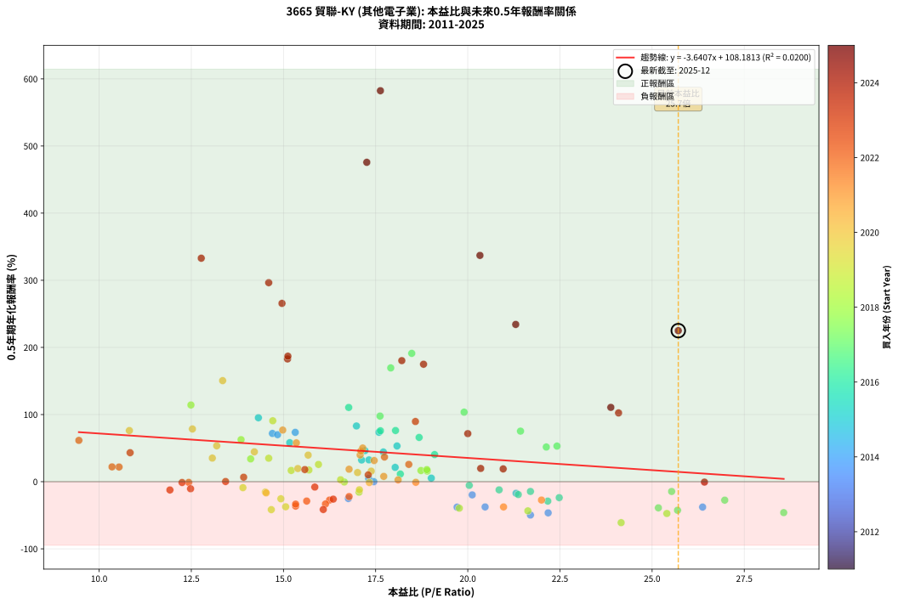
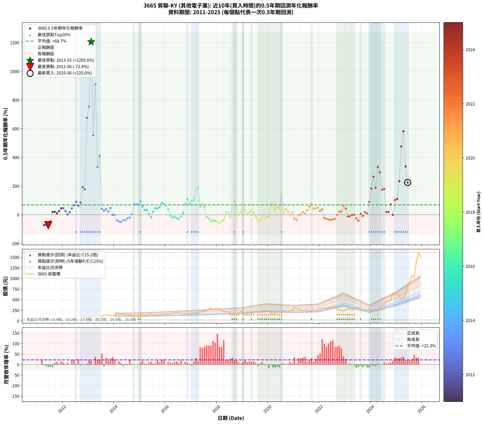

# 3665 貿聯-KY - 本益比與未來報酬率分析

!!! info "報告資訊"
    - **股票代號**: 3665
    - **公司名稱**: 貿聯-KY
    - **產業別**: 其他電子業
    - **分析期間**: 2011-2025 (171 個數據點)
    - **資料來源**: Type 12 (ShowMonthlyK_ChartFlow) 月收盤價與本益比
    - **報酬率口徑**: 含現金股利 (簡化: 年度合計，假設每年7/1入帳)
    - **報告生成時間**: 2026-01-10 21:05:09 CST

## 📈 視覺化圖表

### 圖表1: 本益比 vs 未來報酬率關係

*圖表1：3665 貿聯-KY 本益比與0.5年期未來報酬率關係 (2011-2025)*

### 圖表2: 歷年買入時點的0.5年期實際報酬率

*圖表2：3665 貿聯-KY 歷年買入時點的0.5年期實際報酬率 (2011-2025)*

## 📍 買點訊號說明

本報告提供兩種買點提示訊號（顯示於圖表2的股價子圖中）：

### ▲ 小綠色三角形（回測驗證）
- **計算方式**: 使用全部歷史資料計算本益比第25百分位數
- **用途**: 事後驗證，顯示歷史上哪些時點確實為低估區
- **限制**: 當下無法判斷，僅供回測參考
- **特性**: 後見之明（Look-Ahead Bias）

### ▲ 小橘色三角形（即時訊號）
- **計算方式**: 使用截至當月的過去5年資料計算本益比第25百分位數
- **用途**: 實際投資決策，當時即可判斷
- **優勢**: 可操作性強，符合實務需求
- **特性**: 無後見之明，滾動窗口計算

!!! tip "如何使用兩種訊號"
    - **綠色▲** 幫助理解歷史估值機會，驗證策略有效性
    - **橘色▲** 可作為實際買進參考，但仍需搭配基本面分析
    - 兩種訊號重疊時，表示即時判斷與事後驗證一致，信心度較高
    - 僅有綠色▲時，表示當時無法判斷（需要未來資料才能確認）
    - 僅有橘色▲時，表示即時判斷為買點，但事後可能不是最佳時機

## 📊 估值分析摘要

| 指標 | 數值 |
|:---:|:---:|
| **目前本益比** (2025-06) | **25.71 倍** |
| **歷史平均本益比** | 17.64 倍 |
| **估值水準** | 🔴 相對高估 |
| **預期0.5年年化報酬率** | **+14.58%** |
| **歷史平均報酬率** | +68.74% |
| **相關係數 (R²)** | 0.0200 |
| **趨勢線斜率** | -3.6407 |

!!! abstract "核心洞察"
    目前本益比顯著高於歷史平均，預期未來報酬率可能較低

    根據歷史數據回測，3665 貿聯-KY 在目前本益比 **25.7倍** 的估值水準下，
    預期未來0.5年年化報酬率約為 **+14.6%**。

    **重要提醒**: 本分析基於歷史數據統計，實際報酬率會受到公司基本面變化、產業趨勢、
    總體經濟環境等多重因素影響。R² = 0.02 表示本益比可解釋約 2.0% 的報酬率變異。

## 📈 歷史估值統計

### 最佳買點 (最高報酬率)

| 項目 | 數值 |
|:---:|:---:|
| 起始時間 | 2013-02 |
| 當時本益比 | nan 倍 |
| 起始價格 | 39.8 元 |
| 0.5年後價格 | 139.5 元 |
| **0.5年年化報酬率** | **+1205.62%** |

### 最差買點 (最低報酬率)

| 項目 | 數值 |
|:---:|:---:|
| 起始時間 | 2011-06 |
| 當時本益比 | nan 倍 |
| 起始價格 | 51.8 元 |
| 0.5年後價格 | 23.7 元 |
| **0.5年年化報酬率** | **-72.35%** |

## 🎯 投資啟示

### 本益比與報酬率關係

趨勢線方程式: **y = -3.6407x + 108.1813**

!!! warning "強負相關"
    本益比與未來報酬率呈現強負相關。在高本益比時期買入，未來報酬率顯著較低；
    在低本益比時期買入，未來報酬率顯著較高。**估值紀律至關重要**。

### 估值區間建議

基於歷史數據分析:

- **🟢 低估區** (P/E < 14.1): 預期報酬率較高，可考慮增加持股
- **🟡 合理區** (P/E 14.1-21.2): 預期報酬率符合長期趨勢，正常持有
- **🔴 高估區** (P/E > 21.2): 預期報酬率較低，可考慮減碼或觀望

!!! danger "風險提示"
    - 過去表現不代表未來結果
    - 本分析假設公司基本面無重大結構性變化
    - 產業環境劇變可能使歷史規律失效
    - 應結合公司財報、產業趨勢、總體經濟等多重因素綜合判斷

!!! success "長期投資觀點"
    歷史數據顯示，在合理或低估的估值水準買入並長期持有，
    往往能獲得較佳的投資報酬。**耐心等待好價格**是價值投資的核心原則。

## 📊 數據品質

- **資料來源**: GoodInfo.tw Type 12 (ShowMonthlyK_ChartFlow)
- **資料頻率**: 月度收盤價與本益比
- **回測期間**: 2011-2025
- **數據點數量**: 171 個 (每個點代表一次0.5年期回測)

### 計算方法說明

1. **0.5年期年化報酬率**:
   - 對每個歷史時點，計算其後0.5年的實際投資報酬率
   - 期末價值(不含股利): 期末價格
   - 期末價值(含現金股利): 期末價格 + 持有期間內的現金股利合計 (簡化: 年度合計，假設每年7/1入帳)
   - 公式: 年化報酬率 = [(期末價值/期初價格)^(1/年數) - 1] × 100%

2. **本益比 (P/E Ratio)**:
   - 使用當時的月收盤價與EPS計算
   - 資料來源: Type 12 月度河流圖本益比數據

3. **趨勢線 (Linear Regression)**:
   - 使用最小平方法擬合線性趨勢線
   - R²值衡量本益比對報酬率的解釋能力

---

*本報告由 Stock Analysis System v1.9.0 自動生成*
*數據更新時間: 2026-01-10 21:05:09 CST*

## 📋 月度回測明細表

（每一列對應時間線圖中的一個買入點；可用來對照 SVG 圖上的每個點。）

| 買入月份 | 賣出月份 | 回測期限_年 | 實際持有年數 | 買入本益比_倍 | 買入收盤價_元 | 賣出收盤價_元 | 現金股利合計_元 | 總報酬率_pct | 年化報酬率_pct |
| --- | --- | --- | --- | --- | --- | --- | --- | --- | --- |
| 2011-04 | 2011-10 | 0.5 | 0.501 |  | 57.90 | 27.00 | 3.50 | -47.32 | -72.18 |
| 2011-05 | 2011-12 | 0.5 | 0.586 |  | 55.20 | 23.70 | 3.50 | -50.72 | -70.12 |
| 2011-06 | 2011-12 | 0.5 | 0.501 |  | 51.80 | 23.70 | 3.50 | -47.49 | -72.35 |
| 2011-07 | 2012-01 | 0.5 | 0.504 |  | 33.80 | 24.45 | 0.00 | -27.66 | -47.42 |
| 2011-08 | 2012-03 | 0.5 | 0.583 |  | 28.30 | 31.30 | 0.00 | +10.60 | +18.86 |
| 2011-09 | 2012-03 | 0.5 | 0.498 |  | 28.45 | 31.30 | 0.00 | +10.02 | +21.12 |
| 2011-10 | 2012-05 | 0.5 | 0.583 |  | 27.00 | 28.60 | 0.00 | +5.93 | +10.38 |
| 2011-11 | 2012-05 | 0.5 | 0.498 |  | 25.50 | 28.60 | 0.00 | +12.16 | +25.89 |
| 2011-12 | 2012-07 | 0.5 | 0.583 |  | 23.70 | 27.50 | 2.00 | +24.47 | +45.56 |
| 2012-01 | 2012-07 | 0.5 | 0.498 |  | 24.45 | 27.50 | 2.00 | +20.65 | +45.76 |
| 2012-02 | 2012-08 | 0.5 | 0.501 |  | 32.35 | 34.25 | 2.00 | +12.06 | +25.51 |
| 2012-03 | 2012-10 | 0.5 | 0.586 |  | 31.30 | 29.80 | 2.00 | +1.60 | +2.74 |
| 2012-04 | 2012-10 | 0.5 | 0.501 |  | 29.25 | 29.80 | 2.00 | +8.72 | +18.16 |
| 2012-05 | 2012-12 | 0.5 | 0.586 |  | 28.60 | 33.50 | 2.00 | +24.13 | +44.61 |
| 2012-06 | 2012-12 | 0.5 | 0.501 |  | 27.55 | 33.50 | 2.00 | +28.86 | +65.87 |
| 2012-07 | 2013-01 | 0.5 | 0.504 |  | 27.50 | 38.00 | 0.00 | +38.18 | +90.02 |
| 2012-08 | 2013-03 | 0.5 | 0.580 |  | 34.25 | 45.40 | 0.00 | +32.55 | +62.51 |
| 2012-09 | 2013-03 | 0.5 | 0.496 |  | 33.45 | 45.40 | 0.00 | +35.72 | +85.23 |
| 2012-10 | 2013-05 | 0.5 | 0.580 |  | 29.80 | 55.50 | 0.00 | +86.24 | +191.95 |
| 2012-11 | 2013-05 | 0.5 | 0.496 |  | 33.55 | 55.50 | 0.00 | +65.42 | +176.14 |
| 2012-12 | 2013-07 | 0.5 | 0.580 |  | 33.50 | 106.50 | 3.50 | +228.36 | +675.54 |
| 2013-01 | 2013-07 | 0.5 | 0.496 |  | 38.00 | 106.50 | 3.50 | +189.47 | +754.10 |
| 2013-02 | 2013-08 | 0.5 | 0.498 |  | 39.75 | 139.50 | 3.50 | +259.75 | +1205.62 |
| 2013-03 | 2013-10 | 0.5 | 0.586 |  | 45.40 | 133.00 | 3.50 | +200.66 | +554.59 |
| 2013-04 | 2013-10 | 0.5 | 0.501 |  | 42.85 | 133.00 | 3.50 | +218.55 | +909.95 |
| 2013-05 | 2013-12 | 0.5 | 0.586 |  | 55.50 | 127.50 | 3.50 | +136.04 | +333.10 |
| 2013-06 | 2013-12 | 0.5 | 0.501 |  | 57.90 | 127.50 | 3.50 | +126.25 | +410.19 |
| 2013-07 | 2014-01 | 0.5 | 0.504 |  | 106.50 | 127.00 | 0.00 | +19.25 | +41.83 |
| 2013-08 | 2014-03 | 0.5 | 0.580 |  | 139.50 | 161.50 | 0.00 | +15.77 | +28.70 |
| 2013-09 | 2014-03 | 0.5 | 0.496 |  | 137.50 | 161.50 | 0.00 | +17.45 | +38.35 |
| 2013-10 | 2014-05 | 0.5 | 0.580 |  | 133.00 | 149.00 | 0.00 | +12.03 | +21.62 |
| 2013-11 | 2014-05 | 0.5 | 0.496 |  | 123.00 | 149.00 | 0.00 | +21.14 | +47.25 |
| 2013-12 | 2014-07 | 0.5 | 0.580 |  | 127.50 | 122.00 | 4.99 | -0.40 | -0.68 |
| 2014-01 | 2014-07 | 0.5 | 0.496 | 17.45 | 127.00 | 122.00 | 4.99 | -0.01 | -0.01 |
| 2014-02 | 2014-08 | 0.5 | 0.498 | 26.37 | 192.00 | 146.50 | 4.99 | -21.10 | -37.85 |
| 2014-03 | 2014-10 | 0.5 | 0.586 | 22.18 | 161.50 | 107.00 | 4.99 | -30.65 | -46.46 |
| 2014-04 | 2014-10 | 0.5 | 0.501 | 21.70 | 158.00 | 107.00 | 4.99 | -29.12 | -49.69 |
| 2014-05 | 2014-12 | 0.5 | 0.586 | 20.47 | 149.00 | 108.00 | 4.99 | -24.17 | -37.63 |
| 2014-06 | 2014-12 | 0.5 | 0.501 | 19.71 | 143.50 | 108.00 | 4.99 | -21.26 | -37.94 |
| 2014-07 | 2015-01 | 0.5 | 0.504 | 16.76 | 122.00 | 105.50 | 0.00 | -13.52 | -25.06 |
| 2014-08 | 2015-03 | 0.5 | 0.580 | 20.12 | 146.50 | 129.00 | 0.00 | -11.95 | -19.68 |
| 2014-09 | 2015-03 | 0.5 | 0.496 | 17.31 | 126.00 | 129.00 | 0.00 | +2.38 | +4.86 |
| 2014-10 | 2015-05 | 0.5 | 0.580 | 14.70 | 107.00 | 146.50 | 0.00 | +36.92 | +71.83 |
| 2014-11 | 2015-05 | 0.5 | 0.496 | 15.32 | 111.50 | 146.50 | 0.00 | +31.39 | +73.48 |
| 2014-12 | 2015-07 | 0.5 | 0.580 | 14.84 | 108.00 | 142.00 | 4.97 | +36.08 | +70.03 |
| 2015-01 | 2015-07 | 0.5 | 0.496 | 14.32 | 105.50 | 142.00 | 4.97 | +39.31 | +95.22 |
| 2015-02 | 2015-08 | 0.5 | 0.498 | 15.17 | 113.00 | 137.00 | 4.97 | +25.64 | +58.09 |
| 2015-03 | 2015-10 | 0.5 | 0.586 | 17.12 | 129.00 | 147.00 | 4.97 | +17.81 | +32.27 |
| 2015-04 | 2015-10 | 0.5 | 0.501 | 17.32 | 132.00 | 147.00 | 4.97 | +15.13 | +32.47 |
| 2015-05 | 2015-12 | 0.5 | 0.586 | 19.01 | 146.50 | 146.00 | 4.97 | +3.05 | +5.26 |
| 2015-06 | 2015-12 | 0.5 | 0.501 | 21.31 | 166.00 | 146.00 | 4.97 | -9.05 | -17.26 |
| 2015-07 | 2016-01 | 0.5 | 0.504 | 18.03 | 142.00 | 156.50 | 0.00 | +10.21 | +21.29 |
| 2015-08 | 2016-03 | 0.5 | 0.583 | 17.21 | 137.00 | 171.00 | 0.00 | +24.82 | +46.25 |
| 2015-09 | 2016-03 | 0.5 | 0.498 | 17.71 | 142.50 | 171.00 | 0.00 | +20.00 | +44.18 |
| 2015-10 | 2016-05 | 0.5 | 0.583 | 18.08 | 147.00 | 188.50 | 0.00 | +28.23 | +53.17 |
| 2015-11 | 2016-05 | 0.5 | 0.498 | 16.98 | 139.50 | 188.50 | 0.00 | +35.13 | +82.97 |
| 2015-12 | 2016-07 | 0.5 | 0.583 | 17.59 | 146.00 | 196.00 | 5.41 | +37.95 | +73.61 |
| 2016-01 | 2016-07 | 0.5 | 0.498 | 18.68 | 156.50 | 196.00 | 5.41 | +28.69 | +65.91 |
| 2016-02 | 2016-08 | 0.5 | 0.501 | 19.10 | 161.50 | 186.00 | 5.41 | +18.52 | +40.37 |
| 2016-03 | 2016-10 | 0.5 | 0.586 | 20.04 | 171.00 | 160.00 | 5.41 | -3.27 | -5.52 |
| 2016-04 | 2016-10 | 0.5 | 0.501 | 21.37 | 184.00 | 160.00 | 5.41 | -10.11 | -19.16 |
| 2016-05 | 2016-12 | 0.5 | 0.586 | 21.70 | 188.50 | 166.50 | 5.41 | -8.80 | -14.55 |
| 2016-06 | 2016-12 | 0.5 | 0.501 | 22.48 | 197.00 | 166.50 | 5.41 | -12.74 | -23.81 |
| 2016-07 | 2017-01 | 0.5 | 0.504 | 22.17 | 196.00 | 165.00 | 0.00 | -15.82 | -28.95 |
| 2016-08 | 2017-03 | 0.5 | 0.580 | 20.85 | 186.00 | 172.50 | 0.00 | -7.26 | -12.17 |
| 2016-09 | 2017-03 | 0.5 | 0.496 | 18.17 | 163.50 | 172.50 | 0.00 | +5.50 | +11.42 |
| 2016-10 | 2017-05 | 0.5 | 0.580 | 17.63 | 160.00 | 222.00 | 0.00 | +38.75 | +75.81 |
| 2016-11 | 2017-05 | 0.5 | 0.496 | 16.77 | 153.50 | 222.00 | 0.00 | +44.63 | +110.56 |
| 2016-12 | 2017-07 | 0.5 | 0.580 | 18.04 | 166.50 | 225.00 | 6.31 | +38.93 | +76.20 |
| 2017-01 | 2017-07 | 0.5 | 0.496 | 17.62 | 165.00 | 225.00 | 6.31 | +40.19 | +97.73 |
| 2017-02 | 2017-08 | 0.5 | 0.498 | 19.90 | 189.00 | 263.00 | 6.31 | +42.49 | +103.54 |
| 2017-03 | 2017-10 | 0.5 | 0.586 | 17.91 | 172.50 | 302.00 | 6.31 | +78.73 | +169.44 |
| 2017-04 | 2017-10 | 0.5 | 0.501 | 18.48 | 180.50 | 302.00 | 6.31 | +70.81 | +191.12 |
| 2017-05 | 2017-12 | 0.5 | 0.586 | 22.42 | 222.00 | 278.50 | 6.31 | +28.29 | +53.00 |
| 2017-06 | 2017-12 | 0.5 | 0.501 | 21.43 | 215.00 | 278.50 | 6.31 | +32.47 | +75.29 |
| 2017-07 | 2018-01 | 0.5 | 0.504 | 22.13 | 225.00 | 277.50 | 0.00 | +23.33 | +51.64 |
| 2017-08 | 2018-03 | 0.5 | 0.580 | 25.53 | 263.00 | 240.00 | 0.00 | -8.75 | -14.59 |
| 2017-09 | 2018-03 | 0.5 | 0.496 | 26.97 | 281.50 | 240.00 | 0.00 | -14.74 | -27.52 |
| 2017-10 | 2018-05 | 0.5 | 0.580 | 28.57 | 302.00 | 211.00 | 0.00 | -30.13 | -46.09 |
| 2017-11 | 2018-05 | 0.5 | 0.496 | 25.17 | 269.50 | 211.00 | 0.00 | -21.71 | -38.97 |
| 2017-12 | 2018-07 | 0.5 | 0.580 | 25.69 | 278.50 | 195.00 | 6.83 | -27.53 | -42.58 |
| 2018-01 | 2018-07 | 0.5 | 0.496 | 25.40 | 277.50 | 195.00 | 6.83 | -27.27 | -47.40 |
| 2018-02 | 2018-08 | 0.5 | 0.498 | 24.16 | 266.00 | 159.50 | 6.83 | -37.47 | -61.03 |
| 2018-03 | 2018-10 | 0.5 | 0.586 | 21.63 | 240.00 | 165.00 | 6.83 | -28.40 | -43.47 |
| 2018-04 | 2018-10 | 0.5 | 0.501 | 19.77 | 221.00 | 165.00 | 6.83 | -22.25 | -39.49 |
| 2018-05 | 2018-12 | 0.5 | 0.586 | 18.73 | 211.00 | 224.00 | 6.83 | +9.40 | +16.57 |
| 2018-06 | 2018-12 | 0.5 | 0.501 | 18.90 | 214.50 | 224.00 | 6.83 | +7.61 | +15.77 |
| 2018-07 | 2019-01 | 0.5 | 0.504 | 17.05 | 195.00 | 179.00 | 0.00 | -8.21 | -15.63 |
| 2018-08 | 2019-03 | 0.5 | 0.580 | 13.85 | 159.50 | 211.50 | 0.00 | +32.60 | +62.61 |
| 2018-09 | 2019-03 | 0.5 | 0.496 | 12.49 | 145.00 | 211.50 | 0.00 | +45.86 | +114.20 |
| 2018-10 | 2019-05 | 0.5 | 0.580 | 14.11 | 165.00 | 195.50 | 0.00 | +18.48 | +33.94 |
| 2018-11 | 2019-05 | 0.5 | 0.496 | 16.65 | 196.00 | 195.50 | 0.00 | -0.26 | -0.51 |
| 2018-12 | 2019-07 | 0.5 | 0.580 | 18.89 | 224.00 | 239.00 | 7.50 | +10.04 | +17.93 |
| 2019-01 | 2019-07 | 0.5 | 0.496 | 14.71 | 179.00 | 239.00 | 7.50 | +37.71 | +90.73 |
| 2019-02 | 2019-08 | 0.5 | 0.498 | 15.95 | 199.00 | 215.50 | 7.50 | +12.06 | +25.67 |
| 2019-03 | 2019-10 | 0.5 | 0.586 | 16.55 | 211.50 | 207.50 | 7.50 | +1.65 | +2.84 |
| 2019-04 | 2019-10 | 0.5 | 0.501 | 15.21 | 199.00 | 207.50 | 7.50 | +8.04 | +16.69 |
| 2019-05 | 2019-12 | 0.5 | 0.586 | 14.60 | 195.50 | 225.50 | 7.50 | +19.18 | +34.92 |
| 2019-06 | 2019-12 | 0.5 | 0.501 | 15.69 | 215.00 | 225.50 | 7.50 | +8.37 | +17.41 |
| 2019-07 | 2020-01 | 0.5 | 0.504 | 17.06 | 239.00 | 224.00 | 0.00 | -6.28 | -12.07 |
| 2019-08 | 2020-03 | 0.5 | 0.583 | 15.06 | 215.50 | 164.00 | 0.00 | -23.90 | -37.39 |
| 2019-09 | 2020-03 | 0.5 | 0.498 | 14.67 | 214.50 | 164.00 | 0.00 | -23.54 | -41.65 |
| 2019-10 | 2020-05 | 0.5 | 0.583 | 13.90 | 207.50 | 196.50 | 0.00 | -5.30 | -8.92 |
| 2019-11 | 2020-05 | 0.5 | 0.498 | 14.93 | 227.50 | 196.50 | 0.00 | -13.63 | -25.47 |
| 2019-12 | 2020-07 | 0.5 | 0.583 | 14.51 | 225.50 | 195.50 | 9.00 | -9.31 | -15.43 |
| 2020-01 | 2020-07 | 0.5 | 0.498 | 14.53 | 224.00 | 195.50 | 9.00 | -8.71 | -16.71 |
| 2020-02 | 2020-08 | 0.5 | 0.501 | 12.53 | 191.50 | 247.00 | 9.00 | +33.68 | +78.49 |
| 2020-03 | 2020-10 | 0.5 | 0.586 | 10.82 | 164.00 | 219.50 | 9.00 | +39.33 | +76.14 |
| 2020-04 | 2020-10 | 0.5 | 0.501 | 13.07 | 196.50 | 219.50 | 9.00 | +16.28 | +35.14 |
| 2020-05 | 2020-12 | 0.5 | 0.586 | 13.19 | 196.50 | 243.50 | 9.00 | +28.50 | +53.41 |
| 2020-06 | 2020-12 | 0.5 | 0.501 | 14.21 | 210.00 | 243.50 | 9.00 | +20.24 | +44.46 |
| 2020-07 | 2021-01 | 0.5 | 0.504 | 13.35 | 195.50 | 310.50 | 0.00 | +58.82 | +150.51 |
| 2020-08 | 2021-03 | 0.5 | 0.580 | 17.01 | 247.00 | 266.00 | 0.00 | +7.69 | +13.62 |
| 2020-09 | 2021-03 | 0.5 | 0.496 | 15.67 | 225.50 | 266.00 | 0.00 | +17.96 | +39.56 |
| 2020-10 | 2021-05 | 0.5 | 0.580 | 15.39 | 219.50 | 243.50 | 0.00 | +10.93 | +19.58 |
| 2020-11 | 2021-05 | 0.5 | 0.496 | 17.33 | 245.00 | 243.50 | 0.00 | -0.61 | -1.23 |
| 2020-12 | 2021-07 | 0.5 | 0.580 | 17.38 | 243.50 | 257.00 | 8.03 | +8.84 | +15.71 |
| 2021-01 | 2021-07 | 0.5 | 0.496 | 22.00 | 310.50 | 257.00 | 8.03 | -14.65 | -27.35 |
| 2021-02 | 2021-08 | 0.5 | 0.498 | 20.97 | 298.00 | 227.50 | 8.03 | -20.96 | -37.64 |
| 2021-03 | 2021-10 | 0.5 | 0.586 | 18.59 | 266.00 | 256.50 | 8.03 | -0.55 | -0.94 |
| 2021-04 | 2021-10 | 0.5 | 0.501 | 18.11 | 261.00 | 256.50 | 8.03 | +1.35 | +2.71 |
| 2021-05 | 2021-12 | 0.5 | 0.586 | 16.78 | 243.50 | 261.00 | 8.03 | +10.48 | +18.55 |
| 2021-06 | 2021-12 | 0.5 | 0.501 | 17.72 | 259.00 | 261.00 | 8.03 | +3.87 | +7.87 |
| 2021-07 | 2022-01 | 0.5 | 0.504 | 17.46 | 257.00 | 295.00 | 0.00 | +14.79 | +31.49 |
| 2021-08 | 2022-03 | 0.5 | 0.580 | 15.35 | 227.50 | 296.50 | 0.00 | +30.33 | +57.84 |
| 2021-09 | 2022-03 | 0.5 | 0.496 | 14.98 | 223.50 | 296.50 | 0.00 | +32.66 | +76.89 |
| 2021-10 | 2022-05 | 0.5 | 0.580 | 17.08 | 256.50 | 311.50 | 0.00 | +21.44 | +39.75 |
| 2021-11 | 2022-05 | 0.5 | 0.496 | 17.10 | 258.50 | 311.50 | 0.00 | +20.50 | +45.70 |
| 2021-12 | 2022-07 | 0.5 | 0.580 | 17.15 | 261.00 | 321.00 | 9.45 | +26.61 | +50.15 |
| 2022-01 | 2022-07 | 0.5 | 0.496 | 18.40 | 295.00 | 321.00 | 9.45 | +12.02 | +25.73 |
| 2022-02 | 2022-08 | 0.5 | 0.498 | 17.74 | 299.00 | 340.00 | 9.45 | +16.87 | +36.74 |
| 2022-03 | 2022-10 | 0.5 | 0.586 | 16.78 | 296.50 | 246.50 | 9.45 | -13.68 | -22.20 |
| 2022-04 | 2022-10 | 0.5 | 0.501 | 16.25 | 300.50 | 246.50 | 9.45 | -14.83 | -27.40 |
| 2022-05 | 2022-12 | 0.5 | 0.586 | 16.14 | 311.50 | 236.50 | 9.45 | -21.04 | -33.19 |
| 2022-06 | 2022-12 | 0.5 | 0.501 | 15.33 | 308.50 | 236.50 | 9.45 | -20.28 | -36.38 |
| 2022-07 | 2023-01 | 0.5 | 0.504 | 15.33 | 321.00 | 261.50 | 0.00 | -18.54 | -33.43 |
| 2022-08 | 2023-03 | 0.5 | 0.580 | 15.63 | 340.00 | 279.00 | 0.00 | -17.94 | -28.87 |
| 2022-09 | 2023-03 | 0.5 | 0.496 | 12.43 | 280.50 | 279.00 | 0.00 | -0.53 | -1.08 |
| 2022-10 | 2023-05 | 0.5 | 0.580 | 10.54 | 246.50 | 276.50 | 0.00 | +12.17 | +21.88 |
| 2022-11 | 2023-05 | 0.5 | 0.496 | 10.35 | 250.50 | 276.50 | 0.00 | +10.38 | +22.05 |
| 2022-12 | 2023-07 | 0.5 | 0.580 | 9.45 | 236.50 | 302.50 | 9.89 | +32.09 | +61.52 |
| 2023-01 | 2023-07 | 0.5 | 0.496 | 10.84 | 261.50 | 302.50 | 9.89 | +19.46 | +43.16 |
| 2023-02 | 2023-08 | 0.5 | 0.498 | 11.92 | 277.00 | 249.50 | 9.89 | -6.36 | -12.35 |
| 2023-03 | 2023-10 | 0.5 | 0.586 | 12.48 | 279.00 | 251.50 | 9.89 | -6.31 | -10.53 |
| 2023-04 | 2023-10 | 0.5 | 0.501 | 12.25 | 263.00 | 251.50 | 9.89 | -0.61 | -1.22 |
| 2023-05 | 2023-12 | 0.5 | 0.586 | 13.43 | 276.50 | 267.00 | 9.89 | +0.14 | +0.24 |
| 2023-06 | 2023-12 | 0.5 | 0.501 | 16.35 | 322.00 | 267.00 | 9.89 | -14.01 | -26.01 |
| 2023-07 | 2024-01 | 0.5 | 0.504 | 16.08 | 302.50 | 231.00 | 0.00 | -23.64 | -41.45 |
| 2023-08 | 2024-03 | 0.5 | 0.583 | 13.92 | 249.50 | 259.00 | 0.00 | +3.81 | +6.62 |
| 2023-09 | 2024-03 | 0.5 | 0.498 | 15.85 | 270.00 | 259.00 | 0.00 | -4.07 | -8.01 |
| 2023-10 | 2024-05 | 0.5 | 0.583 | 15.58 | 251.50 | 277.00 | 0.00 | +10.14 | +18.01 |
| 2023-11 | 2024-05 | 0.5 | 0.498 | 17.30 | 264.00 | 277.00 | 0.00 | +4.92 | +10.13 |
| 2023-12 | 2024-07 | 0.5 | 0.583 | 18.58 | 267.00 | 379.00 | 8.78 | +45.24 | +89.64 |
| 2024-01 | 2024-07 | 0.5 | 0.498 | 15.11 | 231.00 | 379.00 | 8.78 | +67.87 | +182.81 |
| 2024-02 | 2024-08 | 0.5 | 0.501 | 14.96 | 242.50 | 455.50 | 8.78 | +91.46 | +265.58 |
| 2024-03 | 2024-10 | 0.5 | 0.586 | 15.12 | 259.00 | 471.50 | 8.78 | +85.44 | +186.91 |
| 2024-04 | 2024-10 | 0.5 | 0.501 | 12.77 | 230.50 | 471.50 | 8.78 | +108.36 | +332.85 |
| 2024-05 | 2024-12 | 0.5 | 0.586 | 14.60 | 277.00 | 612.00 | 8.78 | +124.11 | +296.42 |
| 2024-06 | 2024-12 | 0.5 | 0.501 | 18.80 | 374.00 | 612.00 | 8.78 | +65.98 | +174.94 |
| 2024-07 | 2025-01 | 0.5 | 0.504 | 18.21 | 379.00 | 637.00 | 0.00 | +68.07 | +180.30 |
| 2024-08 | 2025-03 | 0.5 | 0.580 | 20.96 | 455.50 | 504.00 | 0.00 | +10.65 | +19.04 |
| 2024-09 | 2025-03 | 0.5 | 0.496 | 20.35 | 461.00 | 504.00 | 0.00 | +9.33 | +19.72 |
| 2024-10 | 2025-05 | 0.5 | 0.580 | 20.00 | 471.50 | 645.00 | 0.00 | +36.80 | +71.57 |
| 2024-11 | 2025-05 | 0.5 | 0.496 | 26.42 | 647.00 | 645.00 | 0.00 | -0.31 | -0.62 |
| 2024-12 | 2025-07 | 0.5 | 0.580 | 24.09 | 612.00 | 911.00 | 10.51 | +50.57 | +102.41 |
| 2025-01 | 2025-07 | 0.5 | 0.496 | 23.88 | 637.00 | 911.00 | 10.51 | +44.66 | +110.67 |
| 2025-02 | 2025-08 | 0.5 | 0.498 | 21.30 | 595.00 | 1075.00 | 10.51 | +82.44 | +234.22 |
| 2025-03 | 2025-10 | 0.5 | 0.586 | 17.26 | 504.00 | 1395.00 | 10.51 | +178.87 | +475.71 |
| 2025-04 | 2025-10 | 0.5 | 0.501 | 17.63 | 537.00 | 1395.00 | 10.51 | +161.73 | +582.35 |
| 2025-05 | 2025-12 | 0.5 | 0.586 | 20.33 | 645.00 | 1520.00 | 10.51 | +137.29 | +337.03 |
| 2025-06 | 2025-12 | 0.5 | 0.501 | 25.71 | 848.00 | 1520.00 | 10.51 | +80.48 | +224.96 |
