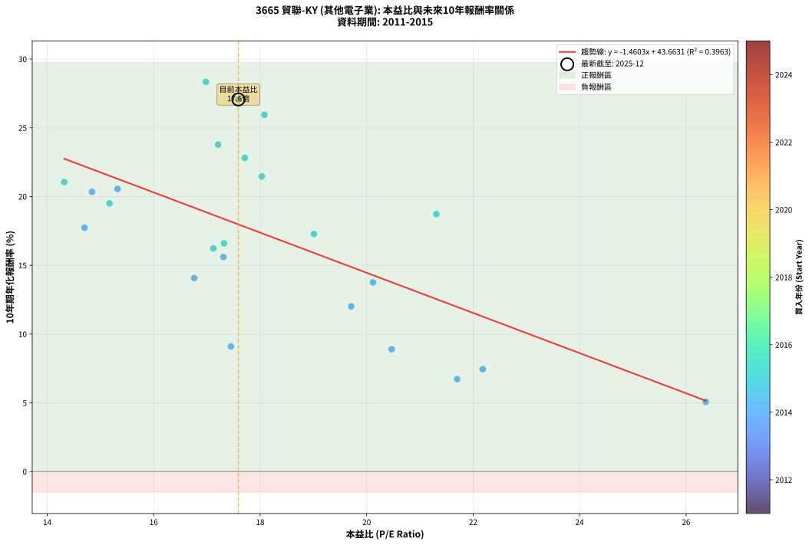
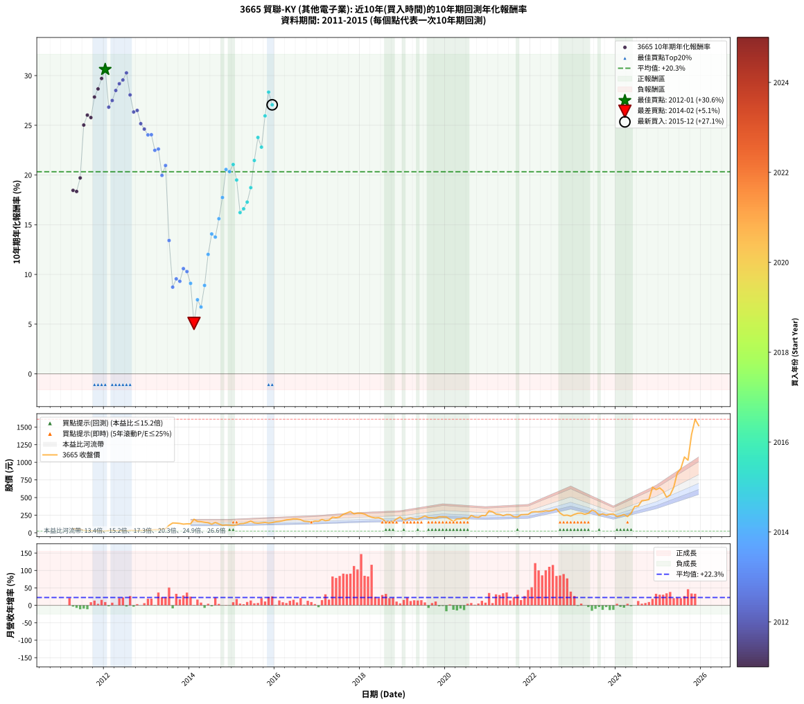

# 3665 貿聯-KY - 本益比與未來報酬率分析

!!! info "報告資訊"
    - **股票代號**: 3665
    - **公司名稱**: 貿聯-KY
    - **產業別**: 其他電子業
    - **分析期間**: 2011-2015 (57 個數據點)
    - **資料來源**: Type 12 (ShowMonthlyK_ChartFlow) 月收盤價與本益比
    - **報酬率口徑**: 含現金股利 (簡化: 年度合計，假設每年7/1入帳)
    - **報告生成時間**: 2026-01-05 21:05:17 CST

## 📈 視覺化圖表

### 圖表1: 本益比 vs 未來報酬率關係

*圖表1：3665 貿聯-KY 本益比與10年期未來報酬率關係 (2011-2015)*

### 圖表2: 歷年買入時點的10年期實際報酬率

*圖表2：3665 貿聯-KY 歷年買入時點的10年期實際報酬率 (2011-2015)*

## 📍 買點訊號說明

本報告提供兩種買點提示訊號（顯示於圖表2的股價子圖中）：

### ▲ 小綠色三角形（回測驗證）
- **計算方式**: 使用全部歷史資料計算本益比第25百分位數
- **用途**: 事後驗證，顯示歷史上哪些時點確實為低估區
- **限制**: 當下無法判斷，僅供回測參考
- **特性**: 後見之明（Look-Ahead Bias）

### ▲ 小橘色三角形（即時訊號）
- **計算方式**: 使用截至當月的過去5年資料計算本益比第25百分位數
- **用途**: 實際投資決策，當時即可判斷
- **優勢**: 可操作性強，符合實務需求
- **特性**: 無後見之明，滾動窗口計算

!!! tip "如何使用兩種訊號"
    - **綠色▲** 幫助理解歷史估值機會，驗證策略有效性
    - **橘色▲** 可作為實際買進參考，但仍需搭配基本面分析
    - 兩種訊號重疊時，表示即時判斷與事後驗證一致，信心度較高
    - 僅有綠色▲時，表示當時無法判斷（需要未來資料才能確認）
    - 僅有橘色▲時，表示即時判斷為買點，但事後可能不是最佳時機

## 📊 估值分析摘要

| 指標 | 數值 |
|:---:|:---:|
| **目前本益比** (2015-12) | **17.59 倍** |
| **歷史平均本益比** | 18.20 倍 |
| **估值水準** | 🟡 合理範圍 |
| **預期10年年化報酬率** | **+17.98%** |
| **歷史平均報酬率** | +20.33% |
| **相關係數 (R²)** | 0.3963 |
| **趨勢線斜率** | -1.4603 |

!!! abstract "核心洞察"
    目前本益比接近歷史平均，預期報酬率符合長期趨勢

    根據歷史數據回測，3665 貿聯-KY 在目前本益比 **17.6倍** 的估值水準下，
    預期未來10年年化報酬率約為 **+18.0%**。

    **重要提醒**: 本分析基於歷史數據統計，實際報酬率會受到公司基本面變化、產業趨勢、
    總體經濟環境等多重因素影響。R² = 0.40 表示本益比可解釋約 39.6% 的報酬率變異。

## 📈 歷史估值統計

### 最佳買點 (最高報酬率)

| 項目 | 數值 |
|:---:|:---:|
| 起始時間 | 2012-01 |
| 當時本益比 | nan 倍 |
| 起始價格 | 24.4 元 |
| 10年後價格 | 295.0 元 |
| **10年年化報酬率** | **+30.62%** |

### 最差買點 (最低報酬率)

| 項目 | 數值 |
|:---:|:---:|
| 起始時間 | 2014-02 |
| 當時本益比 | 26.37 倍 |
| 起始價格 | 192.0 元 |
| 10年後價格 | 242.5 元 |
| **10年年化報酬率** | **+5.07%** |

## 🎯 投資啟示

### 本益比與報酬率關係

趨勢線方程式: **y = -1.4603x + 43.6631**

!!! warning "強負相關"
    本益比與未來報酬率呈現強負相關。在高本益比時期買入，未來報酬率顯著較低；
    在低本益比時期買入，未來報酬率顯著較高。**估值紀律至關重要**。

### 估值區間建議

基於歷史數據分析:

- **🟢 低估區** (P/E < 14.6): 預期報酬率較高，可考慮增加持股
- **🟡 合理區** (P/E 14.6-21.8): 預期報酬率符合長期趨勢，正常持有
- **🔴 高估區** (P/E > 21.8): 預期報酬率較低，可考慮減碼或觀望

!!! danger "風險提示"
    - 過去表現不代表未來結果
    - 本分析假設公司基本面無重大結構性變化
    - 產業環境劇變可能使歷史規律失效
    - 應結合公司財報、產業趨勢、總體經濟等多重因素綜合判斷

!!! success "長期投資觀點"
    歷史數據顯示，在合理或低估的估值水準買入並長期持有，
    往往能獲得較佳的投資報酬。**耐心等待好價格**是價值投資的核心原則。

## 📊 數據品質

- **資料來源**: GoodInfo.tw Type 12 (ShowMonthlyK_ChartFlow)
- **資料頻率**: 月度收盤價與本益比
- **回測期間**: 2011-2015
- **數據點數量**: 57 個 (每個點代表一次10年期回測)

### 計算方法說明

1. **10年期年化報酬率**:
   - 對每個歷史時點，計算其後10年的實際投資報酬率
   - 期末價值(不含股利): 期末價格
   - 期末價值(含現金股利): 期末價格 + 持有期間內的現金股利合計 (簡化: 年度合計，假設每年7/1入帳)
   - 公式: 年化報酬率 = [(期末價值/期初價格)^(1/年數) - 1] × 100%

2. **本益比 (P/E Ratio)**:
   - 使用當時的月收盤價與EPS計算
   - 資料來源: Type 12 月度河流圖本益比數據

3. **趨勢線 (Linear Regression)**:
   - 使用最小平方法擬合線性趨勢線
   - R²值衡量本益比對報酬率的解釋能力

---

*本報告由 Stock Analysis System v1.9.0 自動生成*
*數據更新時間: 2026-01-05 21:05:17 CST*

## 📋 月度回測明細表

（每一列對應時間線圖中的一個買入點；可用來對照 SVG 圖上的每個點。）

| 買入月份 | 賣出月份 | 回測期限_年 | 實際持有年數 | 買入本益比_倍 | 買入收盤價_元 | 賣出收盤價_元 | 現金股利合計_元 | 總報酬率_pct | 年化報酬率_pct |
| --- | --- | --- | --- | --- | --- | --- | --- | --- | --- |
| 2011-04 | 2021-04 | 10 | 10.001 |  | 57.90 | 261.00 | 54.01 | +444.06 | +18.46 |
| 2011-05 | 2021-05 | 10 | 10.001 |  | 55.20 | 243.50 | 54.01 | +438.97 | +18.34 |
| 2011-06 | 2021-06 | 10 | 10.001 |  | 51.80 | 259.00 | 54.01 | +504.26 | +19.70 |
| 2011-07 | 2021-07 | 10 | 10.001 |  | 33.80 | 257.00 | 58.53 | +833.53 | +25.03 |
| 2011-08 | 2021-08 | 10 | 10.001 |  | 28.30 | 227.50 | 58.53 | +910.72 | +26.02 |
| 2011-09 | 2021-09 | 10 | 10.001 |  | 28.45 | 223.50 | 58.53 | +891.33 | +25.78 |
| 2011-10 | 2021-10 | 10 | 10.001 |  | 27.00 | 256.50 | 58.53 | +1066.79 | +27.85 |
| 2011-11 | 2021-11 | 10 | 10.001 |  | 25.50 | 258.50 | 58.53 | +1143.27 | +28.66 |
| 2011-12 | 2021-12 | 10 | 10.001 |  | 23.70 | 261.00 | 58.53 | +1248.24 | +29.71 |
| 2012-01 | 2022-01 | 10 | 10.001 |  | 24.45 | 295.00 | 58.53 | +1345.95 | +30.62 |
| 2012-02 | 2022-03 | 10 | 10.081 |  | 32.35 | 296.50 | 58.53 | +997.48 | +26.83 |
| 2012-03 | 2022-03 | 10 | 9.999 |  | 31.30 | 296.50 | 58.53 | +1034.29 | +27.49 |
| 2012-04 | 2022-04 | 10 | 9.999 |  | 29.25 | 300.50 | 58.53 | +1127.47 | +28.50 |
| 2012-05 | 2022-05 | 10 | 9.999 |  | 28.60 | 311.50 | 58.53 | +1193.83 | +29.18 |
| 2012-06 | 2022-06 | 10 | 9.999 |  | 27.55 | 308.50 | 58.53 | +1232.25 | +29.56 |
| 2012-07 | 2022-07 | 10 | 9.999 |  | 27.50 | 321.00 | 65.98 | +1307.21 | +30.27 |
| 2012-08 | 2022-08 | 10 | 9.999 |  | 34.25 | 340.00 | 65.98 | +1085.35 | +28.06 |
| 2012-09 | 2022-09 | 10 | 9.999 |  | 33.45 | 280.50 | 65.98 | +935.83 | +26.34 |
| 2012-10 | 2022-10 | 10 | 9.999 |  | 29.80 | 246.50 | 65.98 | +948.60 | +26.50 |
| 2012-11 | 2022-11 | 10 | 9.999 |  | 33.55 | 250.50 | 65.98 | +843.32 | +25.16 |
| 2012-12 | 2022-12 | 10 | 9.999 |  | 33.50 | 236.50 | 65.98 | +802.94 | +24.62 |
| 2013-01 | 2023-01 | 10 | 9.999 |  | 38.00 | 261.50 | 65.98 | +761.80 | +24.04 |
| 2013-02 | 2023-02 | 10 | 9.999 |  | 39.75 | 277.00 | 65.98 | +762.85 | +24.05 |
| 2013-03 | 2023-03 | 10 | 9.999 |  | 45.40 | 279.00 | 65.98 | +659.88 | +22.49 |
| 2013-04 | 2023-04 | 10 | 9.999 |  | 42.85 | 263.00 | 65.98 | +667.76 | +22.61 |
| 2013-05 | 2023-05 | 10 | 9.999 |  | 55.50 | 276.50 | 65.98 | +517.09 | +19.96 |
| 2013-06 | 2023-06 | 10 | 9.999 |  | 57.90 | 322.00 | 65.98 | +570.09 | +20.96 |
| 2013-07 | 2023-07 | 10 | 9.999 |  | 106.50 | 302.50 | 72.37 | +251.99 | +13.41 |
| 2013-08 | 2023-08 | 10 | 9.999 |  | 139.50 | 249.50 | 72.37 | +130.73 | +8.72 |
| 2013-09 | 2023-09 | 10 | 9.999 |  | 137.50 | 270.00 | 72.37 | +149.00 | +9.55 |
| 2013-10 | 2023-10 | 10 | 9.999 |  | 133.00 | 251.50 | 72.37 | +143.51 | +9.31 |
| 2013-11 | 2023-11 | 10 | 9.999 |  | 123.00 | 264.00 | 72.37 | +173.47 | +10.59 |
| 2013-12 | 2023-12 | 10 | 9.999 |  | 127.50 | 267.00 | 72.37 | +166.17 | +10.29 |
| 2014-01 | 2024-01 | 10 | 9.999 | 17.45 | 127.00 | 231.00 | 72.37 | +138.87 | +9.10 |
| 2014-02 | 2024-02 | 10 | 9.999 | 26.37 | 192.00 | 242.50 | 72.37 | +63.99 | +5.07 |
| 2014-03 | 2024-03 | 10 | 10.001 | 22.18 | 161.50 | 259.00 | 72.37 | +105.18 | +7.45 |
| 2014-04 | 2024-04 | 10 | 10.001 | 21.70 | 158.00 | 230.50 | 72.37 | +91.69 | +6.72 |
| 2014-05 | 2024-05 | 10 | 10.001 | 20.47 | 149.00 | 277.00 | 72.37 | +134.48 | +8.89 |
| 2014-06 | 2024-06 | 10 | 10.001 | 19.71 | 143.50 | 374.00 | 72.37 | +211.06 | +12.02 |
| 2014-07 | 2024-07 | 10 | 10.001 | 16.76 | 122.00 | 379.00 | 76.16 | +273.08 | +14.07 |
| 2014-08 | 2024-08 | 10 | 10.001 | 20.12 | 146.50 | 455.50 | 76.16 | +262.91 | +13.76 |
| 2014-09 | 2024-09 | 10 | 10.001 | 17.31 | 126.00 | 461.00 | 76.16 | +326.32 | +15.60 |
| 2014-10 | 2024-10 | 10 | 10.001 | 14.70 | 107.00 | 471.50 | 76.16 | +411.83 | +17.73 |
| 2014-11 | 2024-11 | 10 | 10.001 | 15.32 | 111.50 | 647.00 | 76.16 | +548.57 | +20.55 |
| 2014-12 | 2024-12 | 10 | 10.001 | 14.84 | 108.00 | 612.00 | 76.16 | +537.18 | +20.34 |
| 2015-01 | 2025-01 | 10 | 10.001 | 14.32 | 105.50 | 637.00 | 76.16 | +575.98 | +21.05 |
| 2015-02 | 2025-02 | 10 | 10.001 | 15.17 | 113.00 | 595.00 | 76.16 | +493.95 | +19.50 |
| 2015-03 | 2025-03 | 10 | 10.001 | 17.12 | 129.00 | 504.00 | 76.16 | +349.73 | +16.22 |
| 2015-04 | 2025-04 | 10 | 10.001 | 17.32 | 132.00 | 537.00 | 76.16 | +364.51 | +16.60 |
| 2015-05 | 2025-05 | 10 | 10.001 | 19.01 | 146.50 | 645.00 | 76.16 | +392.26 | +17.28 |
| 2015-06 | 2025-06 | 10 | 10.001 | 21.31 | 166.00 | 848.00 | 76.16 | +456.72 | +18.73 |
| 2015-07 | 2025-07 | 10 | 10.001 | 18.03 | 142.00 | 911.00 | 81.70 | +599.08 | +21.46 |
| 2015-08 | 2025-08 | 10 | 10.001 | 17.21 | 137.00 | 1075.00 | 81.70 | +744.31 | +23.78 |
| 2015-09 | 2025-09 | 10 | 10.001 | 17.71 | 142.50 | 1030.00 | 81.70 | +680.14 | +22.80 |
| 2015-10 | 2025-10 | 10 | 10.001 | 18.08 | 147.00 | 1395.00 | 81.70 | +904.56 | +25.95 |
| 2015-11 | 2025-11 | 10 | 10.001 | 16.98 | 139.50 | 1610.00 | 81.70 | +1112.69 | +28.34 |
| 2015-12 | 2025-12 | 10 | 10.001 | 17.59 | 146.00 | 1520.00 | 81.70 | +997.05 | +27.06 |
