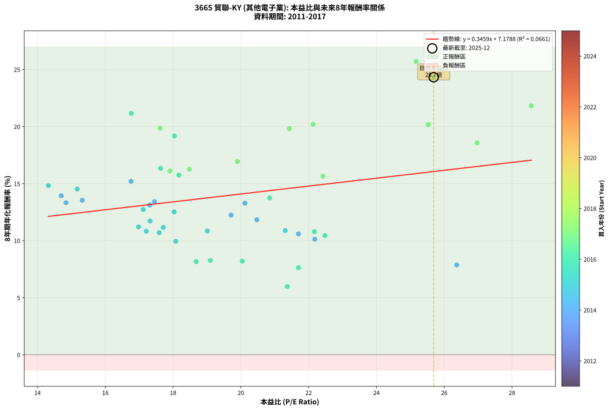
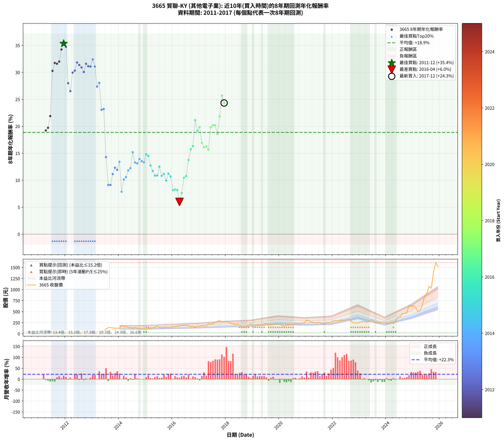

# 3665 貿聯-KY - 本益比與未來報酬率分析

!!! info "報告資訊"
    - **股票代號**: 3665
    - **公司名稱**: 貿聯-KY
    - **產業別**: 其他電子業
    - **分析期間**: 2011-2017 (81 個數據點)
    - **資料來源**: Type 12 (ShowMonthlyK_ChartFlow) 月收盤價與本益比
    - **報酬率口徑**: 含現金股利 (簡化: 年度合計，假設每年7/1入帳)
    - **報告生成時間**: 2026-01-07 21:07:12 CST

## 📈 視覺化圖表

### 圖表1: 本益比 vs 未來報酬率關係

*圖表1：3665 貿聯-KY 本益比與8年期未來報酬率關係 (2011-2017)*

### 圖表2: 歷年買入時點的8年期實際報酬率

*圖表2：3665 貿聯-KY 歷年買入時點的8年期實際報酬率 (2011-2017)*

## 📍 買點訊號說明

本報告提供兩種買點提示訊號（顯示於圖表2的股價子圖中）：

### ▲ 小綠色三角形（回測驗證）
- **計算方式**: 使用全部歷史資料計算本益比第25百分位數
- **用途**: 事後驗證，顯示歷史上哪些時點確實為低估區
- **限制**: 當下無法判斷，僅供回測參考
- **特性**: 後見之明（Look-Ahead Bias）

### ▲ 小橘色三角形（即時訊號）
- **計算方式**: 使用截至當月的過去5年資料計算本益比第25百分位數
- **用途**: 實際投資決策，當時即可判斷
- **優勢**: 可操作性強，符合實務需求
- **特性**: 無後見之明，滾動窗口計算

!!! tip "如何使用兩種訊號"
    - **綠色▲** 幫助理解歷史估值機會，驗證策略有效性
    - **橘色▲** 可作為實際買進參考，但仍需搭配基本面分析
    - 兩種訊號重疊時，表示即時判斷與事後驗證一致，信心度較高
    - 僅有綠色▲時，表示當時無法判斷（需要未來資料才能確認）
    - 僅有橘色▲時，表示即時判斷為買點，但事後可能不是最佳時機

## 📊 估值分析摘要

| 指標 | 數值 |
|:---:|:---:|
| **目前本益比** (2017-12) | **25.69 倍** |
| **歷史平均本益比** | 19.70 倍 |
| **估值水準** | 🔴 相對高估 |
| **預期8年年化報酬率** | **+16.06%** |
| **歷史平均報酬率** | +18.87% |
| **相關係數 (R²)** | 0.0661 |
| **趨勢線斜率** | 0.3459 |

!!! abstract "核心洞察"
    目前本益比顯著高於歷史平均，預期未來報酬率可能較低

    根據歷史數據回測，3665 貿聯-KY 在目前本益比 **25.7倍** 的估值水準下，
    預期未來8年年化報酬率約為 **+16.1%**。

    **重要提醒**: 本分析基於歷史數據統計，實際報酬率會受到公司基本面變化、產業趨勢、
    總體經濟環境等多重因素影響。R² = 0.07 表示本益比可解釋約 6.6% 的報酬率變異。

## 📈 歷史估值統計

### 最佳買點 (最高報酬率)

| 項目 | 數值 |
|:---:|:---:|
| 起始時間 | 2011-12 |
| 當時本益比 | nan 倍 |
| 起始價格 | 23.7 元 |
| 8年後價格 | 225.5 元 |
| **8年年化報酬率** | **+35.35%** |

### 最差買點 (最低報酬率)

| 項目 | 數值 |
|:---:|:---:|
| 起始時間 | 2016-04 |
| 當時本益比 | 21.37 倍 |
| 起始價格 | 184.0 元 |
| 8年後價格 | 230.5 元 |
| **8年年化報酬率** | **+5.98%** |

## 🎯 投資啟示

### 本益比與報酬率關係

趨勢線方程式: **y = 0.3459x + 7.1788**

!!! info "弱相關或正相關"
    本益比與未來報酬率相關性較弱。這可能表示該股票的報酬率更多受到
    公司成長性、產業趨勢等因素影響，而非估值水準。**需綜合考量多項指標**。

### 估值區間建議

基於歷史數據分析:

- **🟢 低估區** (P/E < 15.8): 預期報酬率較高，可考慮增加持股
- **🟡 合理區** (P/E 15.8-23.6): 預期報酬率符合長期趨勢，正常持有
- **🔴 高估區** (P/E > 23.6): 預期報酬率較低，可考慮減碼或觀望

!!! danger "風險提示"
    - 過去表現不代表未來結果
    - 本分析假設公司基本面無重大結構性變化
    - 產業環境劇變可能使歷史規律失效
    - 應結合公司財報、產業趨勢、總體經濟等多重因素綜合判斷

!!! success "長期投資觀點"
    歷史數據顯示，在合理或低估的估值水準買入並長期持有，
    往往能獲得較佳的投資報酬。**耐心等待好價格**是價值投資的核心原則。

## 📊 數據品質

- **資料來源**: GoodInfo.tw Type 12 (ShowMonthlyK_ChartFlow)
- **資料頻率**: 月度收盤價與本益比
- **回測期間**: 2011-2017
- **數據點數量**: 81 個 (每個點代表一次8年期回測)

### 計算方法說明

1. **8年期年化報酬率**:
   - 對每個歷史時點，計算其後8年的實際投資報酬率
   - 期末價值(不含股利): 期末價格
   - 期末價值(含現金股利): 期末價格 + 持有期間內的現金股利合計 (簡化: 年度合計，假設每年7/1入帳)
   - 公式: 年化報酬率 = [(期末價值/期初價格)^(1/年數) - 1] × 100%

2. **本益比 (P/E Ratio)**:
   - 使用當時的月收盤價與EPS計算
   - 資料來源: Type 12 月度河流圖本益比數據

3. **趨勢線 (Linear Regression)**:
   - 使用最小平方法擬合線性趨勢線
   - R²值衡量本益比對報酬率的解釋能力

---

*本報告由 Stock Analysis System v1.9.0 自動生成*
*數據更新時間: 2026-01-07 21:07:12 CST*

## 📋 月度回測明細表

（每一列對應時間線圖中的一個買入點；可用來對照 SVG 圖上的每個點。）

| 買入月份 | 賣出月份 | 回測期限_年 | 實際持有年數 | 買入本益比_倍 | 買入收盤價_元 | 賣出收盤價_元 | 現金股利合計_元 | 總報酬率_pct | 年化報酬率_pct |
| --- | --- | --- | --- | --- | --- | --- | --- | --- | --- |
| 2011-04 | 2019-04 | 8 | 8.000 |  | 57.90 | 199.00 | 37.51 | +308.48 | +19.23 |
| 2011-05 | 2019-05 | 8 | 8.000 |  | 55.20 | 195.50 | 37.51 | +322.12 | +19.72 |
| 2011-06 | 2019-06 | 8 | 8.000 |  | 51.80 | 215.00 | 37.51 | +387.47 | +21.90 |
| 2011-07 | 2019-07 | 8 | 8.000 |  | 33.80 | 239.00 | 41.51 | +729.91 | +30.28 |
| 2011-08 | 2019-08 | 8 | 8.000 |  | 28.30 | 215.50 | 41.51 | +808.16 | +31.76 |
| 2011-09 | 2019-09 | 8 | 8.000 |  | 28.45 | 214.50 | 41.51 | +799.86 | +31.60 |
| 2011-10 | 2019-10 | 8 | 8.000 |  | 27.00 | 207.50 | 41.51 | +822.26 | +32.01 |
| 2011-11 | 2019-11 | 8 | 8.000 |  | 25.50 | 227.50 | 41.51 | +954.94 | +34.25 |
| 2011-12 | 2019-12 | 8 | 8.000 |  | 23.70 | 225.50 | 41.51 | +1026.62 | +35.35 |
| 2012-01 | 2020-01 | 8 | 8.000 |  | 24.45 | 224.00 | 41.51 | +985.93 | +34.73 |
| 2012-02 | 2020-02 | 8 | 8.000 |  | 32.35 | 191.50 | 41.51 | +620.28 | +27.99 |
| 2012-03 | 2020-03 | 8 | 8.000 |  | 31.30 | 164.00 | 41.51 | +556.58 | +26.52 |
| 2012-04 | 2020-04 | 8 | 8.000 |  | 29.25 | 196.50 | 41.51 | +713.71 | +29.96 |
| 2012-05 | 2020-05 | 8 | 8.000 |  | 28.60 | 196.50 | 41.51 | +732.20 | +30.33 |
| 2012-06 | 2020-06 | 8 | 8.000 |  | 27.55 | 210.00 | 41.51 | +812.92 | +31.84 |
| 2012-07 | 2020-07 | 8 | 8.000 |  | 27.50 | 195.50 | 48.51 | +787.31 | +31.37 |
| 2012-08 | 2020-08 | 8 | 8.000 |  | 34.25 | 247.00 | 48.51 | +762.80 | +30.91 |
| 2012-09 | 2020-09 | 8 | 8.000 |  | 33.45 | 225.50 | 48.51 | +719.16 | +30.07 |
| 2012-10 | 2020-10 | 8 | 8.000 |  | 29.80 | 219.50 | 48.51 | +799.36 | +31.60 |
| 2012-11 | 2020-11 | 8 | 8.000 |  | 33.55 | 245.00 | 48.51 | +774.84 | +31.14 |
| 2012-12 | 2020-12 | 8 | 8.000 |  | 33.50 | 243.50 | 48.51 | +771.67 | +31.08 |
| 2013-01 | 2021-01 | 8 | 8.000 |  | 38.00 | 310.50 | 48.51 | +844.76 | +32.41 |
| 2013-02 | 2021-02 | 8 | 8.000 |  | 39.75 | 298.00 | 48.51 | +771.72 | +31.08 |
| 2013-03 | 2021-03 | 8 | 8.000 |  | 45.40 | 266.00 | 48.51 | +592.75 | +27.37 |
| 2013-04 | 2021-04 | 8 | 8.000 |  | 42.85 | 261.00 | 48.51 | +622.31 | +28.04 |
| 2013-05 | 2021-05 | 8 | 8.000 |  | 55.50 | 243.50 | 48.51 | +426.14 | +23.07 |
| 2013-06 | 2021-06 | 8 | 8.000 |  | 57.90 | 259.00 | 48.51 | +431.10 | +23.21 |
| 2013-07 | 2021-07 | 8 | 8.000 |  | 106.50 | 257.00 | 53.03 | +191.11 | +14.29 |
| 2013-08 | 2021-08 | 8 | 8.000 |  | 139.50 | 227.50 | 53.03 | +101.10 | +9.13 |
| 2013-09 | 2021-09 | 8 | 8.000 |  | 137.50 | 223.50 | 53.03 | +101.12 | +9.13 |
| 2013-10 | 2021-10 | 8 | 8.000 |  | 133.00 | 256.50 | 53.03 | +132.73 | +11.14 |
| 2013-11 | 2021-11 | 8 | 8.000 |  | 123.00 | 258.50 | 53.03 | +153.28 | +12.32 |
| 2013-12 | 2021-12 | 8 | 8.000 |  | 127.50 | 261.00 | 53.03 | +146.30 | +11.93 |
| 2014-01 | 2022-01 | 8 | 8.000 | 17.45 | 127.00 | 295.00 | 53.03 | +174.04 | +13.43 |
| 2014-02 | 2022-02 | 8 | 8.000 | 26.37 | 192.00 | 299.00 | 53.03 | +83.35 | +7.87 |
| 2014-03 | 2022-03 | 8 | 8.000 | 22.18 | 161.50 | 296.50 | 53.03 | +116.43 | +10.13 |
| 2014-04 | 2022-04 | 8 | 8.000 | 21.70 | 158.00 | 300.50 | 53.03 | +123.76 | +10.59 |
| 2014-05 | 2022-05 | 8 | 8.000 | 20.47 | 149.00 | 311.50 | 53.03 | +144.65 | +11.83 |
| 2014-06 | 2022-06 | 8 | 8.000 | 19.71 | 143.50 | 308.50 | 53.03 | +151.94 | +12.24 |
| 2014-07 | 2022-07 | 8 | 8.000 | 16.76 | 122.00 | 321.00 | 57.49 | +210.24 | +15.20 |
| 2014-08 | 2022-08 | 8 | 8.000 | 20.12 | 146.50 | 340.00 | 57.49 | +171.32 | +13.29 |
| 2014-09 | 2022-09 | 8 | 8.000 | 17.31 | 126.00 | 280.50 | 57.49 | +168.25 | +13.13 |
| 2014-10 | 2022-10 | 8 | 8.000 | 14.70 | 107.00 | 246.50 | 57.49 | +184.10 | +13.94 |
| 2014-11 | 2022-11 | 8 | 8.000 | 15.32 | 111.50 | 250.50 | 57.49 | +176.23 | +13.54 |
| 2014-12 | 2022-12 | 8 | 8.000 | 14.84 | 108.00 | 236.50 | 57.49 | +172.21 | +13.33 |
| 2015-01 | 2023-01 | 8 | 8.000 | 14.32 | 105.50 | 261.50 | 57.49 | +202.36 | +14.83 |
| 2015-02 | 2023-02 | 8 | 8.000 | 15.17 | 113.00 | 277.00 | 57.49 | +196.01 | +14.53 |
| 2015-03 | 2023-03 | 8 | 8.000 | 17.12 | 129.00 | 279.00 | 57.49 | +160.85 | +12.73 |
| 2015-04 | 2023-04 | 8 | 8.000 | 17.32 | 132.00 | 263.00 | 57.49 | +142.80 | +11.73 |
| 2015-05 | 2023-05 | 8 | 8.000 | 19.01 | 146.50 | 276.50 | 57.49 | +127.98 | +10.85 |
| 2015-06 | 2023-06 | 8 | 8.000 | 21.31 | 166.00 | 322.00 | 57.49 | +128.61 | +10.89 |
| 2015-07 | 2023-07 | 8 | 8.000 | 18.03 | 142.00 | 302.50 | 62.41 | +156.98 | +12.52 |
| 2015-08 | 2023-08 | 8 | 8.000 | 17.21 | 137.00 | 249.50 | 62.41 | +127.67 | +10.83 |
| 2015-09 | 2023-09 | 8 | 8.000 | 17.71 | 142.50 | 270.00 | 62.41 | +133.27 | +11.17 |
| 2015-10 | 2023-10 | 8 | 8.000 | 18.08 | 147.00 | 251.50 | 62.41 | +113.54 | +9.95 |
| 2015-11 | 2023-11 | 8 | 8.000 | 16.98 | 139.50 | 264.00 | 62.41 | +133.98 | +11.21 |
| 2015-12 | 2023-12 | 8 | 8.000 | 17.59 | 146.00 | 267.00 | 62.41 | +125.62 | +10.71 |
| 2016-01 | 2024-01 | 8 | 8.000 | 18.68 | 156.50 | 231.00 | 62.41 | +87.48 | +8.17 |
| 2016-02 | 2024-02 | 8 | 8.000 | 19.10 | 161.50 | 242.50 | 62.41 | +88.80 | +8.27 |
| 2016-03 | 2024-03 | 8 | 8.000 | 20.04 | 171.00 | 259.00 | 62.41 | +87.96 | +8.21 |
| 2016-04 | 2024-04 | 8 | 8.000 | 21.37 | 184.00 | 230.50 | 62.41 | +59.19 | +5.98 |
| 2016-05 | 2024-05 | 8 | 8.000 | 21.70 | 188.50 | 277.00 | 62.41 | +80.06 | +7.63 |
| 2016-06 | 2024-06 | 8 | 8.000 | 22.48 | 197.00 | 374.00 | 62.41 | +121.53 | +10.45 |
| 2016-07 | 2024-07 | 8 | 8.000 | 22.17 | 196.00 | 379.00 | 65.78 | +126.93 | +10.79 |
| 2016-08 | 2024-08 | 8 | 8.000 | 20.85 | 186.00 | 455.50 | 65.78 | +180.26 | +13.75 |
| 2016-09 | 2024-09 | 8 | 8.000 | 18.17 | 163.50 | 461.00 | 65.78 | +222.19 | +15.75 |
| 2016-10 | 2024-10 | 8 | 8.000 | 17.63 | 160.00 | 471.50 | 65.78 | +235.80 | +16.35 |
| 2016-11 | 2024-11 | 8 | 8.000 | 16.77 | 153.50 | 647.00 | 65.78 | +364.35 | +21.16 |
| 2016-12 | 2024-12 | 8 | 8.000 | 18.04 | 166.50 | 612.00 | 65.78 | +307.08 | +19.18 |
| 2017-01 | 2025-01 | 8 | 8.000 | 17.62 | 165.00 | 637.00 | 65.78 | +325.93 | +19.86 |
| 2017-02 | 2025-02 | 8 | 8.000 | 19.90 | 189.00 | 595.00 | 65.78 | +249.62 | +16.94 |
| 2017-03 | 2025-03 | 8 | 8.000 | 17.91 | 172.50 | 504.00 | 65.78 | +230.31 | +16.11 |
| 2017-04 | 2025-04 | 8 | 8.000 | 18.48 | 180.50 | 537.00 | 65.78 | +233.95 | +16.27 |
| 2017-05 | 2025-05 | 8 | 8.000 | 22.42 | 222.00 | 645.00 | 65.78 | +220.17 | +15.66 |
| 2017-06 | 2025-06 | 8 | 8.000 | 21.43 | 215.00 | 848.00 | 65.78 | +325.02 | +19.83 |
| 2017-07 | 2025-07 | 8 | 8.000 | 22.13 | 225.00 | 911.00 | 69.98 | +335.99 | +20.21 |
| 2017-08 | 2025-08 | 8 | 8.000 | 25.53 | 263.00 | 1075.00 | 69.98 | +335.35 | +20.19 |
| 2017-09 | 2025-09 | 8 | 8.000 | 26.97 | 281.50 | 1030.00 | 69.98 | +290.76 | +18.57 |
| 2017-10 | 2025-10 | 8 | 8.000 | 28.57 | 302.00 | 1395.00 | 69.98 | +385.09 | +21.82 |
| 2017-11 | 2025-11 | 8 | 8.000 | 25.17 | 269.50 | 1610.00 | 69.98 | +523.37 | +25.70 |
| 2017-12 | 2025-12 | 8 | 8.000 | 25.69 | 278.50 | 1520.00 | 69.98 | +470.91 | +24.33 |
