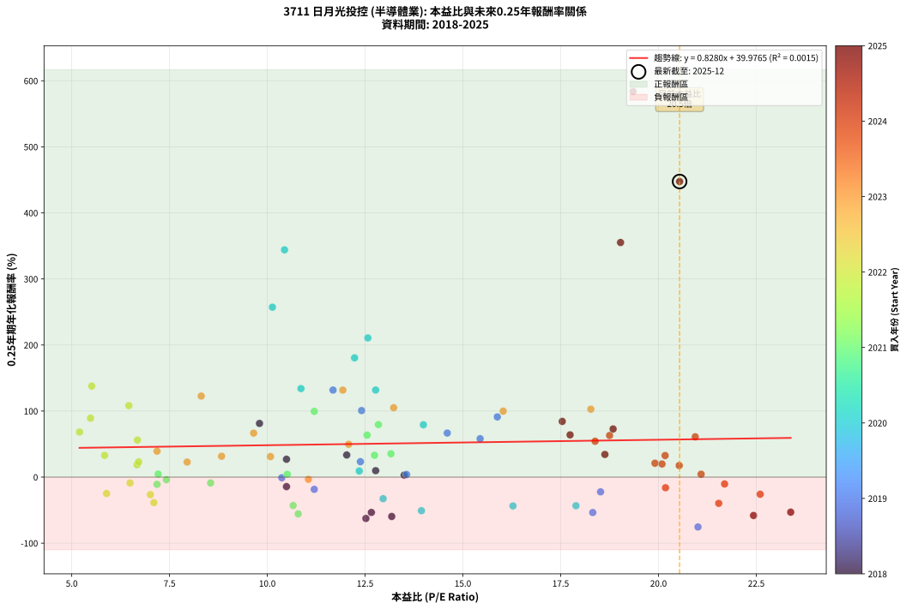
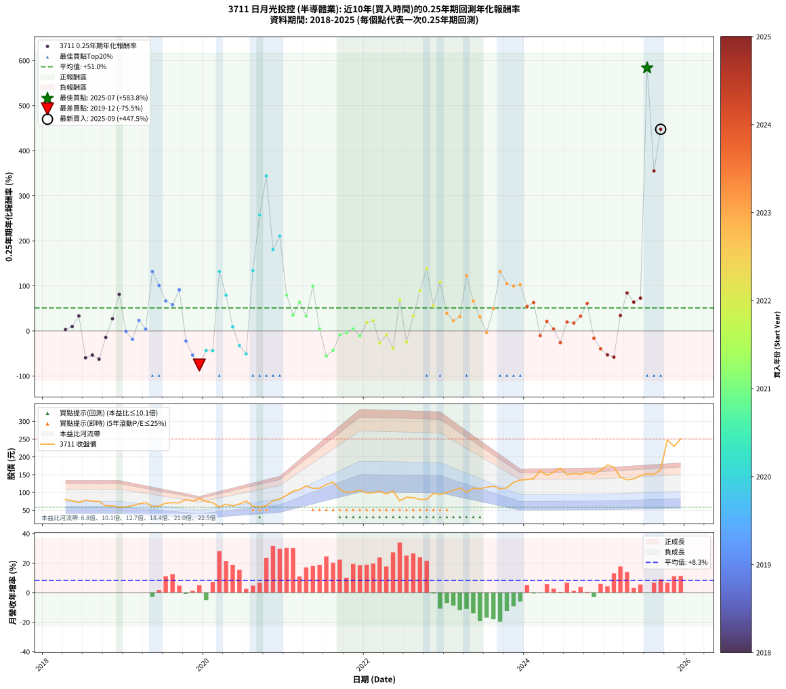

# 3711 日月光投控 - 本益比與未來報酬率分析

!!! info "報告資訊"
    - **股票代號**: 3711
    - **公司名稱**: 日月光投控
    - **產業別**: 半導體業
    - **分析期間**: 2018-2025 (90 個數據點)
    - **資料來源**: Type 12 (ShowMonthlyK_ChartFlow) 月收盤價與本益比
    - **報酬率口徑**: 含現金股利 (簡化: 年度合計，假設每年7/1入帳)
    - **報告生成時間**: 2026-01-12 21:11:02 CST

## 📈 視覺化圖表

### 圖表1: 本益比 vs 未來報酬率關係

*圖表1：3711 日月光投控 本益比與0.25年期未來報酬率關係 (2018-2025)*

### 圖表2: 歷年買入時點的0.25年期實際報酬率

*圖表2：3711 日月光投控 歷年買入時點的0.25年期實際報酬率 (2018-2025)*

## 📍 買點訊號說明

本報告提供兩種買點提示訊號（顯示於圖表2的股價子圖中）：

### ▲ 小綠色三角形（回測驗證）
- **計算方式**: 使用全部歷史資料計算本益比第25百分位數
- **用途**: 事後驗證，顯示歷史上哪些時點確實為低估區
- **限制**: 當下無法判斷，僅供回測參考
- **特性**: 後見之明（Look-Ahead Bias）

### ▲ 小橘色三角形（即時訊號）
- **計算方式**: 使用截至當月的過去5年資料計算本益比第25百分位數
- **用途**: 實際投資決策，當時即可判斷
- **優勢**: 可操作性強，符合實務需求
- **特性**: 無後見之明，滾動窗口計算

!!! tip "如何使用兩種訊號"
    - **綠色▲** 幫助理解歷史估值機會，驗證策略有效性
    - **橘色▲** 可作為實際買進參考，但仍需搭配基本面分析
    - 兩種訊號重疊時，表示即時判斷與事後驗證一致，信心度較高
    - 僅有綠色▲時，表示當時無法判斷（需要未來資料才能確認）
    - 僅有橘色▲時，表示即時判斷為買點，但事後可能不是最佳時機

## 📊 估值分析摘要

| 指標 | 數值 |
|:---:|:---:|
| **目前本益比** (2025-09) | **20.54 倍** |
| **歷史平均本益比** | 13.30 倍 |
| **估值水準** | 🔴 相對高估 |
| **預期0.25年年化報酬率** | **+56.98%** |
| **歷史平均報酬率** | +50.99% |
| **相關係數 (R²)** | 0.0015 |
| **趨勢線斜率** | 0.8280 |

!!! abstract "核心洞察"
    目前本益比顯著高於歷史平均，預期未來報酬率可能較低

    根據歷史數據回測，3711 日月光投控 在目前本益比 **20.5倍** 的估值水準下，
    預期未來0.25年年化報酬率約為 **+57.0%**。

    **重要提醒**: 本分析基於歷史數據統計，實際報酬率會受到公司基本面變化、產業趨勢、
    總體經濟環境等多重因素影響。R² = 0.00 表示本益比可解釋約 0.1% 的報酬率變異。

## 📈 歷史估值統計

### 最佳買點 (最高報酬率)

| 項目 | 數值 |
|:---:|:---:|
| 起始時間 | 2025-07 |
| 當時本益比 | 19.35 倍 |
| 起始價格 | 152.5 元 |
| 0.25年後價格 | 247.5 元 |
| **0.25年年化報酬率** | **+583.81%** |

### 最差買點 (最低報酬率)

| 項目 | 數值 |
|:---:|:---:|
| 起始時間 | 2019-12 |
| 當時本益比 | 21.01 倍 |
| 起始價格 | 83.2 元 |
| 0.25年後價格 | 58.6 元 |
| **0.25年年化報酬率** | **-75.51%** |

## 🎯 投資啟示

### 本益比與報酬率關係

趨勢線方程式: **y = 0.8280x + 39.9765**

!!! info "弱相關或正相關"
    本益比與未來報酬率相關性較弱。這可能表示該股票的報酬率更多受到
    公司成長性、產業趨勢等因素影響，而非估值水準。**需綜合考量多項指標**。

### 估值區間建議

基於歷史數據分析:

- **🟢 低估區** (P/E < 10.6): 預期報酬率較高，可考慮增加持股
- **🟡 合理區** (P/E 10.6-16.0): 預期報酬率符合長期趨勢，正常持有
- **🔴 高估區** (P/E > 16.0): 預期報酬率較低，可考慮減碼或觀望

!!! danger "風險提示"
    - 過去表現不代表未來結果
    - 本分析假設公司基本面無重大結構性變化
    - 產業環境劇變可能使歷史規律失效
    - 應結合公司財報、產業趨勢、總體經濟等多重因素綜合判斷

!!! success "長期投資觀點"
    歷史數據顯示，在合理或低估的估值水準買入並長期持有，
    往往能獲得較佳的投資報酬。**耐心等待好價格**是價值投資的核心原則。

## 📊 數據品質

- **資料來源**: GoodInfo.tw Type 12 (ShowMonthlyK_ChartFlow)
- **資料頻率**: 月度收盤價與本益比
- **回測期間**: 2018-2025
- **數據點數量**: 90 個 (每個點代表一次0.25年期回測)

### 計算方法說明

1. **0.25年期年化報酬率**:
   - 對每個歷史時點，計算其後0.25年的實際投資報酬率
   - 期末價值(不含股利): 期末價格
   - 期末價值(含現金股利): 期末價格 + 持有期間內的現金股利合計 (簡化: 年度合計，假設每年7/1入帳)
   - 公式: 年化報酬率 = [(期末價值/期初價格)^(1/年數) - 1] × 100%

2. **本益比 (P/E Ratio)**:
   - 使用當時的月收盤價與EPS計算
   - 資料來源: Type 12 月度河流圖本益比數據

3. **趨勢線 (Linear Regression)**:
   - 使用最小平方法擬合線性趨勢線
   - R²值衡量本益比對報酬率的解釋能力

---

*本報告由 Stock Analysis System v1.9.0 自動生成*
*數據更新時間: 2026-01-12 21:11:02 CST*

## 📋 月度回測明細表

（每一列對應時間線圖中的一個買入點；可用來對照 SVG 圖上的每個點。）

| 買入月份 | 賣出月份 | 回測期限_年 | 實際持有年數 | 買入本益比_倍 | 買入收盤價_元 | 賣出收盤價_元 | 現金股利合計_元 | 總報酬率_pct | 年化報酬率_pct |
| --- | --- | --- | --- | --- | --- | --- | --- | --- | --- |
| 2018-04 | 2018-07 | 0.25 | 0.249 | 13.50 | 80.30 | 78.40 | 2.50 | +0.75 | +3.03 |
| 2018-05 | 2018-08 | 0.25 | 0.252 | 12.77 | 76.00 | 75.30 | 2.50 | +2.37 | +9.73 |
| 2018-06 | 2018-09 | 0.25 | 0.252 | 12.03 | 71.60 | 74.50 | 2.50 | +7.54 | +33.46 |
| 2018-07 | 2018-10 | 0.25 | 0.252 | 13.18 | 78.40 | 62.40 | 0.00 | -20.41 | -59.59 |
| 2018-08 | 2018-12 | 0.25 | 0.334 | 12.66 | 75.30 | 58.30 | 0.00 | -22.58 | -53.52 |
| 2018-09 | 2018-12 | 0.25 | 0.249 | 12.52 | 74.50 | 58.30 | 0.00 | -21.74 | -62.62 |
| 2018-10 | 2019-01 | 0.25 | 0.252 | 10.49 | 62.40 | 60.00 | 0.00 | -3.85 | -14.42 |
| 2018-11 | 2019-03 | 0.25 | 0.329 | 10.49 | 62.40 | 67.50 | 0.00 | +8.17 | +27.01 |
| 2018-12 | 2019-03 | 0.25 | 0.246 | 9.80 | 58.30 | 67.50 | 0.00 | +15.78 | +81.24 |
| 2019-01 | 2019-05 | 0.25 | 0.329 | 10.37 | 60.00 | 59.80 | 0.00 | -0.33 | -1.01 |
| 2019-02 | 2019-05 | 0.25 | 0.246 | 11.20 | 62.90 | 59.80 | 0.00 | -4.93 | -18.54 |
| 2019-03 | 2019-07 | 0.25 | 0.334 | 12.38 | 67.50 | 69.90 | 2.50 | +7.26 | +23.34 |
| 2019-04 | 2019-07 | 0.25 | 0.249 | 13.56 | 71.70 | 69.90 | 2.50 | +0.97 | +3.97 |
| 2019-05 | 2019-08 | 0.25 | 0.252 | 11.68 | 59.80 | 71.40 | 2.50 | +23.58 | +131.74 |
| 2019-06 | 2019-09 | 0.25 | 0.252 | 12.41 | 61.50 | 70.80 | 2.50 | +19.19 | +100.73 |
| 2019-07 | 2019-10 | 0.25 | 0.252 | 14.60 | 69.90 | 79.50 | 0.00 | +13.73 | +66.68 |
| 2019-08 | 2019-12 | 0.25 | 0.334 | 15.44 | 71.40 | 83.20 | 0.00 | +16.53 | +58.08 |
| 2019-09 | 2019-12 | 0.25 | 0.249 | 15.88 | 70.80 | 83.20 | 0.00 | +17.51 | +91.13 |
| 2019-10 | 2020-01 | 0.25 | 0.252 | 18.52 | 79.50 | 74.60 | 0.00 | -6.16 | -22.32 |
| 2019-11 | 2020-03 | 0.25 | 0.331 | 18.32 | 75.60 | 58.60 | 0.00 | -22.49 | -53.65 |
| 2019-12 | 2020-03 | 0.25 | 0.249 | 21.01 | 83.20 | 58.60 | 0.00 | -29.57 | -75.51 |
| 2020-01 | 2020-05 | 0.25 | 0.331 | 17.89 | 74.60 | 61.80 | 0.00 | -17.16 | -43.35 |
| 2020-02 | 2020-05 | 0.25 | 0.249 | 16.28 | 71.30 | 61.80 | 0.00 | -13.32 | -43.67 |
| 2020-03 | 2020-07 | 0.25 | 0.334 | 12.77 | 58.60 | 75.60 | 2.00 | +32.42 | +131.80 |
| 2020-04 | 2020-07 | 0.25 | 0.249 | 13.99 | 67.10 | 75.60 | 2.00 | +15.65 | +79.22 |
| 2020-05 | 2020-08 | 0.25 | 0.252 | 12.35 | 61.80 | 61.20 | 2.00 | +2.26 | +9.29 |
| 2020-06 | 2020-09 | 0.25 | 0.252 | 12.96 | 67.60 | 59.20 | 2.00 | -9.47 | -32.63 |
| 2020-07 | 2020-10 | 0.25 | 0.252 | 13.94 | 75.60 | 63.20 | 0.00 | -16.40 | -50.90 |
| 2020-08 | 2020-12 | 0.25 | 0.334 | 10.86 | 61.20 | 81.30 | 0.00 | +32.84 | +134.02 |
| 2020-09 | 2020-12 | 0.25 | 0.249 | 10.13 | 59.20 | 81.30 | 0.00 | +37.33 | +257.25 |
| 2020-10 | 2021-01 | 0.25 | 0.252 | 10.44 | 63.20 | 92.00 | 0.00 | +45.57 | +344.03 |
| 2020-11 | 2021-03 | 0.25 | 0.329 | 12.23 | 76.60 | 107.50 | 0.00 | +40.34 | +180.53 |
| 2020-12 | 2021-03 | 0.25 | 0.246 | 12.57 | 81.30 | 107.50 | 0.00 | +32.23 | +210.71 |
| 2021-01 | 2021-05 | 0.25 | 0.329 | 12.84 | 92.00 | 111.50 | 0.00 | +21.20 | +79.52 |
| 2021-02 | 2021-05 | 0.25 | 0.246 | 13.16 | 103.50 | 111.50 | 0.00 | +7.73 | +35.28 |
| 2021-03 | 2021-07 | 0.25 | 0.334 | 12.55 | 107.50 | 122.50 | 4.19 | +17.85 | +63.52 |
| 2021-04 | 2021-07 | 0.25 | 0.249 | 12.74 | 118.00 | 122.50 | 4.19 | +7.37 | +33.01 |
| 2021-05 | 2021-08 | 0.25 | 0.252 | 11.20 | 111.50 | 128.50 | 4.19 | +19.01 | +99.53 |
| 2021-06 | 2021-09 | 0.25 | 0.252 | 10.51 | 112.00 | 109.00 | 4.19 | +1.06 | +4.29 |
| 2021-07 | 2021-10 | 0.25 | 0.252 | 10.79 | 122.50 | 99.80 | 0.00 | -18.53 | -55.68 |
| 2021-08 | 2021-12 | 0.25 | 0.334 | 10.66 | 128.50 | 106.50 | 0.00 | -17.12 | -43.00 |
| 2021-09 | 2021-12 | 0.25 | 0.249 | 8.55 | 109.00 | 106.50 | 0.00 | -2.29 | -8.89 |
| 2021-10 | 2022-01 | 0.25 | 0.252 | 7.42 | 99.80 | 98.80 | 0.00 | -1.00 | -3.92 |
| 2021-11 | 2022-03 | 0.25 | 0.329 | 7.21 | 102.00 | 103.50 | 0.00 | +1.47 | +4.54 |
| 2021-12 | 2022-03 | 0.25 | 0.246 | 7.18 | 106.50 | 103.50 | 0.00 | -2.82 | -10.95 |
| 2022-01 | 2022-05 | 0.25 | 0.329 | 6.67 | 98.80 | 104.50 | 0.00 | +5.77 | +18.62 |
| 2022-02 | 2022-05 | 0.25 | 0.246 | 6.71 | 99.30 | 104.50 | 0.00 | +5.24 | +23.02 |
| 2022-03 | 2022-07 | 0.25 | 0.334 | 7.01 | 103.50 | 86.40 | 7.00 | -9.76 | -26.47 |
| 2022-04 | 2022-07 | 0.25 | 0.249 | 6.49 | 95.60 | 86.40 | 7.00 | -2.31 | -8.94 |
| 2022-05 | 2022-08 | 0.25 | 0.252 | 7.10 | 104.50 | 85.40 | 7.00 | -11.58 | -38.66 |
| 2022-06 | 2022-09 | 0.25 | 0.252 | 5.20 | 76.40 | 80.10 | 7.00 | +14.00 | +68.24 |
| 2022-07 | 2022-10 | 0.25 | 0.252 | 5.89 | 86.40 | 80.40 | 0.00 | -6.94 | -24.85 |
| 2022-08 | 2022-12 | 0.25 | 0.334 | 5.84 | 85.40 | 93.90 | 0.00 | +9.95 | +32.85 |
| 2022-09 | 2022-12 | 0.25 | 0.249 | 5.48 | 80.10 | 93.90 | 0.00 | +17.23 | +89.27 |
| 2022-10 | 2023-01 | 0.25 | 0.252 | 5.51 | 80.40 | 100.00 | 0.00 | +24.38 | +137.76 |
| 2022-11 | 2023-03 | 0.25 | 0.329 | 6.68 | 97.20 | 112.50 | 0.00 | +15.74 | +56.04 |
| 2022-12 | 2023-03 | 0.25 | 0.246 | 6.46 | 93.90 | 112.50 | 0.00 | +19.81 | +108.22 |
| 2023-01 | 2023-05 | 0.25 | 0.329 | 7.18 | 100.00 | 111.50 | 0.00 | +11.50 | +39.28 |
| 2023-02 | 2023-05 | 0.25 | 0.246 | 7.95 | 106.00 | 111.50 | 0.00 | +5.19 | +22.79 |
| 2023-03 | 2023-07 | 0.25 | 0.334 | 8.83 | 112.50 | 114.50 | 8.79 | +9.59 | +31.56 |
| 2023-04 | 2023-07 | 0.25 | 0.249 | 8.31 | 101.00 | 114.50 | 8.79 | +22.07 | +122.67 |
| 2023-05 | 2023-08 | 0.25 | 0.252 | 9.65 | 111.50 | 118.00 | 8.79 | +13.72 | +66.58 |
| 2023-06 | 2023-09 | 0.25 | 0.252 | 10.08 | 110.50 | 109.50 | 8.79 | +7.05 | +31.07 |
| 2023-07 | 2023-10 | 0.25 | 0.252 | 11.05 | 114.50 | 113.50 | 0.00 | -0.87 | -3.42 |
| 2023-08 | 2023-12 | 0.25 | 0.334 | 12.08 | 118.00 | 135.00 | 0.00 | +14.41 | +49.62 |
| 2023-09 | 2023-12 | 0.25 | 0.249 | 11.93 | 109.50 | 135.00 | 0.00 | +23.29 | +131.70 |
| 2023-10 | 2024-01 | 0.25 | 0.252 | 13.23 | 113.50 | 136.00 | 0.00 | +19.82 | +105.03 |
| 2023-11 | 2024-03 | 0.25 | 0.331 | 16.03 | 128.00 | 161.00 | 0.00 | +25.78 | +99.85 |
| 2023-12 | 2024-03 | 0.25 | 0.249 | 18.27 | 135.00 | 161.00 | 0.00 | +19.26 | +102.78 |
| 2024-01 | 2024-05 | 0.25 | 0.331 | 18.38 | 136.00 | 157.00 | 0.00 | +15.44 | +54.26 |
| 2024-02 | 2024-05 | 0.25 | 0.249 | 18.75 | 139.00 | 157.00 | 0.00 | +12.95 | +63.03 |
| 2024-03 | 2024-07 | 0.25 | 0.334 | 21.69 | 161.00 | 150.00 | 5.20 | -3.60 | -10.40 |
| 2024-04 | 2024-07 | 0.25 | 0.249 | 19.91 | 148.00 | 150.00 | 5.20 | +4.87 | +21.01 |
| 2024-05 | 2024-08 | 0.25 | 0.252 | 21.09 | 157.00 | 153.50 | 5.20 | +1.08 | +4.37 |
| 2024-06 | 2024-09 | 0.25 | 0.252 | 22.60 | 168.50 | 151.00 | 5.20 | -7.30 | -25.98 |
| 2024-07 | 2024-10 | 0.25 | 0.252 | 20.09 | 150.00 | 157.00 | 0.00 | +4.67 | +19.85 |
| 2024-08 | 2024-12 | 0.25 | 0.334 | 20.53 | 153.50 | 162.00 | 0.00 | +5.54 | +17.51 |
| 2024-09 | 2024-12 | 0.25 | 0.249 | 20.17 | 151.00 | 162.00 | 0.00 | +7.28 | +32.61 |
| 2024-10 | 2025-01 | 0.25 | 0.252 | 20.94 | 157.00 | 177.00 | 0.00 | +12.74 | +60.97 |
| 2024-11 | 2025-03 | 0.25 | 0.329 | 20.18 | 151.50 | 143.00 | 0.00 | -5.61 | -16.12 |
| 2024-12 | 2025-03 | 0.25 | 0.246 | 21.54 | 162.00 | 143.00 | 0.00 | -11.73 | -39.73 |
| 2025-01 | 2025-05 | 0.25 | 0.329 | 23.38 | 177.00 | 138.00 | 0.00 | -22.03 | -53.12 |
| 2025-02 | 2025-05 | 0.25 | 0.246 | 22.43 | 171.00 | 138.00 | 0.00 | -19.30 | -58.11 |
| 2025-03 | 2025-07 | 0.25 | 0.334 | 18.63 | 143.00 | 152.50 | 5.30 | +10.35 | +34.28 |
| 2025-04 | 2025-07 | 0.25 | 0.249 | 17.54 | 135.50 | 152.50 | 5.30 | +16.45 | +84.30 |
| 2025-05 | 2025-08 | 0.25 | 0.252 | 17.74 | 138.00 | 151.00 | 5.30 | +13.26 | +63.93 |
| 2025-06 | 2025-09 | 0.25 | 0.252 | 18.84 | 147.50 | 164.00 | 5.30 | +14.78 | +72.83 |
| 2025-07 | 2025-10 | 0.25 | 0.252 | 19.35 | 152.50 | 247.50 | 0.00 | +62.30 | +583.81 |
| 2025-08 | 2025-12 | 0.25 | 0.334 | 19.03 | 151.00 | 250.50 | 0.00 | +65.89 | +355.14 |
| 2025-09 | 2025-12 | 0.25 | 0.249 | 20.54 | 164.00 | 250.50 | 0.00 | +52.74 | +447.50 |
