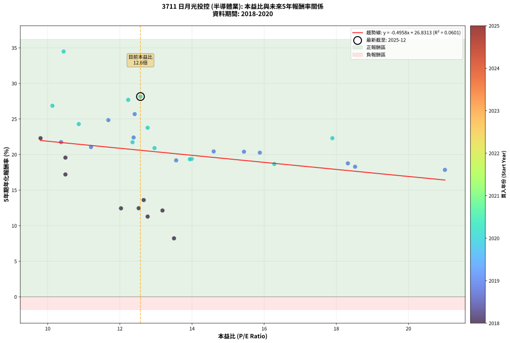
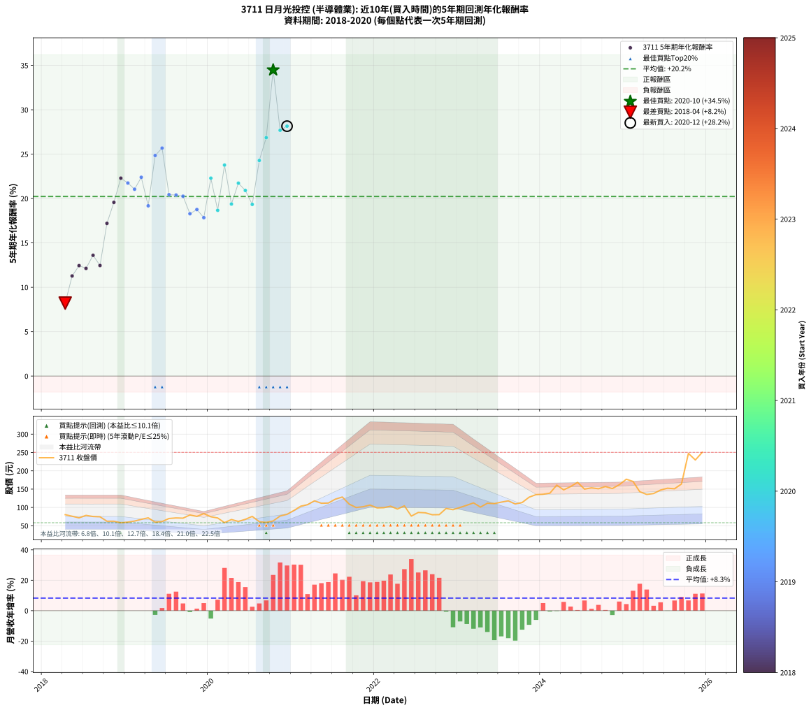

# 3711 日月光投控 - 本益比與未來報酬率分析

!!! info "報告資訊"
    - **股票代號**: 3711
    - **公司名稱**: 日月光投控
    - **產業別**: 半導體業
    - **分析期間**: 2018-2020 (33 個數據點)
    - **資料來源**: Type 12 (ShowMonthlyK_ChartFlow) 月收盤價與本益比
    - **報酬率口徑**: 含現金股利 (簡化: 年度合計，假設每年7/1入帳)
    - **報告生成時間**: 2026-01-10 18:57:48 CST

## 📈 視覺化圖表

### 圖表1: 本益比 vs 未來報酬率關係

*圖表1：3711 日月光投控 本益比與5年期未來報酬率關係 (2018-2020)*

### 圖表2: 歷年買入時點的5年期實際報酬率

*圖表2：3711 日月光投控 歷年買入時點的5年期實際報酬率 (2018-2020)*

## 📍 買點訊號說明

本報告提供兩種買點提示訊號（顯示於圖表2的股價子圖中）：

### ▲ 小綠色三角形（回測驗證）
- **計算方式**: 使用全部歷史資料計算本益比第25百分位數
- **用途**: 事後驗證，顯示歷史上哪些時點確實為低估區
- **限制**: 當下無法判斷，僅供回測參考
- **特性**: 後見之明（Look-Ahead Bias）

### ▲ 小橘色三角形（即時訊號）
- **計算方式**: 使用截至當月的過去5年資料計算本益比第25百分位數
- **用途**: 實際投資決策，當時即可判斷
- **優勢**: 可操作性強，符合實務需求
- **特性**: 無後見之明，滾動窗口計算

!!! tip "如何使用兩種訊號"
    - **綠色▲** 幫助理解歷史估值機會，驗證策略有效性
    - **橘色▲** 可作為實際買進參考，但仍需搭配基本面分析
    - 兩種訊號重疊時，表示即時判斷與事後驗證一致，信心度較高
    - 僅有綠色▲時，表示當時無法判斷（需要未來資料才能確認）
    - 僅有橘色▲時，表示即時判斷為買點，但事後可能不是最佳時機

## 📊 估值分析摘要

| 指標 | 數值 |
|:---:|:---:|
| **目前本益比** (2020-12) | **12.57 倍** |
| **歷史平均本益比** | 13.31 倍 |
| **估值水準** | 🟡 合理範圍 |
| **預期5年年化報酬率** | **+20.60%** |
| **歷史平均報酬率** | +20.23% |
| **相關係數 (R²)** | 0.0601 |
| **趨勢線斜率** | -0.4958 |

!!! abstract "核心洞察"
    目前本益比接近歷史平均，預期報酬率符合長期趨勢

    根據歷史數據回測，3711 日月光投控 在目前本益比 **12.6倍** 的估值水準下，
    預期未來5年年化報酬率約為 **+20.6%**。

    **重要提醒**: 本分析基於歷史數據統計，實際報酬率會受到公司基本面變化、產業趨勢、
    總體經濟環境等多重因素影響。R² = 0.06 表示本益比可解釋約 6.0% 的報酬率變異。

## 📈 歷史估值統計

### 最佳買點 (最高報酬率)

| 項目 | 數值 |
|:---:|:---:|
| 起始時間 | 2020-10 |
| 當時本益比 | 10.44 倍 |
| 起始價格 | 63.2 元 |
| 5年後價格 | 247.5 元 |
| **5年年化報酬率** | **+34.49%** |

### 最差買點 (最低報酬率)

| 項目 | 數值 |
|:---:|:---:|
| 起始時間 | 2018-04 |
| 當時本益比 | 13.50 倍 |
| 起始價格 | 80.3 元 |
| 5年後價格 | 101.0 元 |
| **5年年化報酬率** | **+8.22%** |

## 🎯 投資啟示

### 本益比與報酬率關係

趨勢線方程式: **y = -0.4958x + 26.8313**

!!! note "負相關"
    本益比與未來報酬率呈現負相關。較低的本益比通常帶來較高的未來報酬率，
    但相關性不算非常強。**估值仍是重要參考指標之一**。

### 估值區間建議

基於歷史數據分析:

- **🟢 低估區** (P/E < 10.6): 預期報酬率較高，可考慮增加持股
- **🟡 合理區** (P/E 10.6-16.0): 預期報酬率符合長期趨勢，正常持有
- **🔴 高估區** (P/E > 16.0): 預期報酬率較低，可考慮減碼或觀望

!!! danger "風險提示"
    - 過去表現不代表未來結果
    - 本分析假設公司基本面無重大結構性變化
    - 產業環境劇變可能使歷史規律失效
    - 應結合公司財報、產業趨勢、總體經濟等多重因素綜合判斷

!!! success "長期投資觀點"
    歷史數據顯示，在合理或低估的估值水準買入並長期持有，
    往往能獲得較佳的投資報酬。**耐心等待好價格**是價值投資的核心原則。

## 📊 數據品質

- **資料來源**: GoodInfo.tw Type 12 (ShowMonthlyK_ChartFlow)
- **資料頻率**: 月度收盤價與本益比
- **回測期間**: 2018-2020
- **數據點數量**: 33 個 (每個點代表一次5年期回測)

### 計算方法說明

1. **5年期年化報酬率**:
   - 對每個歷史時點，計算其後5年的實際投資報酬率
   - 期末價值(不含股利): 期末價格
   - 期末價值(含現金股利): 期末價格 + 持有期間內的現金股利合計 (簡化: 年度合計，假設每年7/1入帳)
   - 公式: 年化報酬率 = [(期末價值/期初價格)^(1/年數) - 1] × 100%

2. **本益比 (P/E Ratio)**:
   - 使用當時的月收盤價與EPS計算
   - 資料來源: Type 12 月度河流圖本益比數據

3. **趨勢線 (Linear Regression)**:
   - 使用最小平方法擬合線性趨勢線
   - R²值衡量本益比對報酬率的解釋能力

---

*本報告由 Stock Analysis System v1.9.0 自動生成*
*數據更新時間: 2026-01-10 18:57:48 CST*

## 📋 月度回測明細表

（每一列對應時間線圖中的一個買入點；可用來對照 SVG 圖上的每個點。）

| 買入月份 | 賣出月份 | 回測期限_年 | 實際持有年數 | 買入本益比_倍 | 買入收盤價_元 | 賣出收盤價_元 | 現金股利合計_元 | 總報酬率_pct | 年化報酬率_pct |
| --- | --- | --- | --- | --- | --- | --- | --- | --- | --- |
| 2018-04 | 2023-04 | 5 | 4.999 | 13.50 | 80.30 | 101.00 | 18.18 | +48.42 | +8.22 |
| 2018-05 | 2023-05 | 5 | 4.999 | 12.77 | 76.00 | 111.50 | 18.18 | +70.64 | +11.28 |
| 2018-06 | 2023-06 | 5 | 4.999 | 12.03 | 71.60 | 110.50 | 18.18 | +79.72 | +12.44 |
| 2018-07 | 2023-07 | 5 | 4.999 | 13.18 | 78.40 | 114.50 | 24.48 | +77.27 | +12.13 |
| 2018-08 | 2023-08 | 5 | 4.999 | 12.66 | 75.30 | 118.00 | 24.48 | +89.21 | +13.61 |
| 2018-09 | 2023-09 | 5 | 4.999 | 12.52 | 74.50 | 109.50 | 24.48 | +79.83 | +12.46 |
| 2018-10 | 2023-10 | 5 | 4.999 | 10.49 | 62.40 | 113.50 | 24.48 | +121.12 | +17.20 |
| 2018-11 | 2023-11 | 5 | 4.999 | 10.49 | 62.40 | 128.00 | 24.48 | +144.35 | +19.57 |
| 2018-12 | 2023-12 | 5 | 4.999 | 9.80 | 58.30 | 135.00 | 24.48 | +173.55 | +22.30 |
| 2019-01 | 2024-01 | 5 | 4.999 | 10.37 | 60.00 | 136.00 | 24.48 | +167.46 | +21.75 |
| 2019-02 | 2024-02 | 5 | 4.999 | 11.20 | 62.90 | 139.00 | 24.48 | +159.90 | +21.05 |
| 2019-03 | 2024-03 | 5 | 5.002 | 12.38 | 67.50 | 161.00 | 24.48 | +174.78 | +22.39 |
| 2019-04 | 2024-04 | 5 | 5.002 | 13.56 | 71.70 | 148.00 | 24.48 | +140.55 | +19.18 |
| 2019-05 | 2024-05 | 5 | 5.002 | 11.68 | 59.80 | 157.00 | 24.48 | +203.47 | +24.85 |
| 2019-06 | 2024-06 | 5 | 5.002 | 12.41 | 61.50 | 168.50 | 24.48 | +213.78 | +25.69 |
| 2019-07 | 2024-07 | 5 | 5.002 | 14.60 | 69.90 | 150.00 | 27.18 | +153.48 | +20.44 |
| 2019-08 | 2024-08 | 5 | 5.002 | 15.44 | 71.40 | 153.50 | 27.18 | +153.05 | +20.40 |
| 2019-09 | 2024-09 | 5 | 5.002 | 15.88 | 70.80 | 151.00 | 27.18 | +151.67 | +20.26 |
| 2019-10 | 2024-10 | 5 | 5.002 | 18.52 | 79.50 | 157.00 | 27.18 | +131.67 | +18.29 |
| 2019-11 | 2024-11 | 5 | 5.002 | 18.32 | 75.60 | 151.50 | 27.18 | +136.35 | +18.76 |
| 2019-12 | 2024-12 | 5 | 5.002 | 21.01 | 83.20 | 162.00 | 27.18 | +127.38 | +17.85 |
| 2020-01 | 2025-01 | 5 | 5.002 | 17.89 | 74.60 | 177.00 | 27.18 | +173.70 | +22.30 |
| 2020-02 | 2025-03 | 5 | 5.081 | 16.28 | 71.30 | 143.00 | 27.18 | +138.68 | +18.67 |
| 2020-03 | 2025-03 | 5 | 4.999 | 12.77 | 58.60 | 143.00 | 27.18 | +190.41 | +23.77 |
| 2020-04 | 2025-04 | 5 | 4.999 | 13.99 | 67.10 | 135.50 | 27.18 | +142.44 | +19.38 |
| 2020-05 | 2025-05 | 5 | 4.999 | 12.35 | 61.80 | 138.00 | 27.18 | +167.28 | +21.73 |
| 2020-06 | 2025-06 | 5 | 4.999 | 12.96 | 67.60 | 147.50 | 27.18 | +158.40 | +20.91 |
| 2020-07 | 2025-07 | 5 | 4.999 | 13.94 | 75.60 | 152.50 | 30.48 | +142.03 | +19.34 |
| 2020-08 | 2025-08 | 5 | 4.999 | 10.86 | 61.20 | 151.00 | 30.48 | +196.53 | +24.29 |
| 2020-09 | 2025-09 | 5 | 4.999 | 10.13 | 59.20 | 164.00 | 30.48 | +228.51 | +26.86 |
| 2020-10 | 2025-10 | 5 | 4.999 | 10.44 | 63.20 | 247.50 | 30.48 | +339.84 | +34.49 |
| 2020-11 | 2025-11 | 5 | 4.999 | 12.23 | 76.60 | 229.50 | 30.48 | +239.40 | +27.69 |
| 2020-12 | 2025-12 | 5 | 4.999 | 12.57 | 81.30 | 250.50 | 30.48 | +245.61 | +28.15 |
