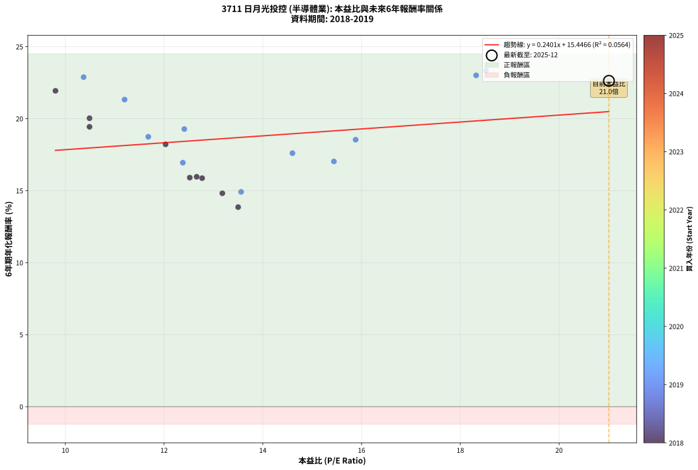
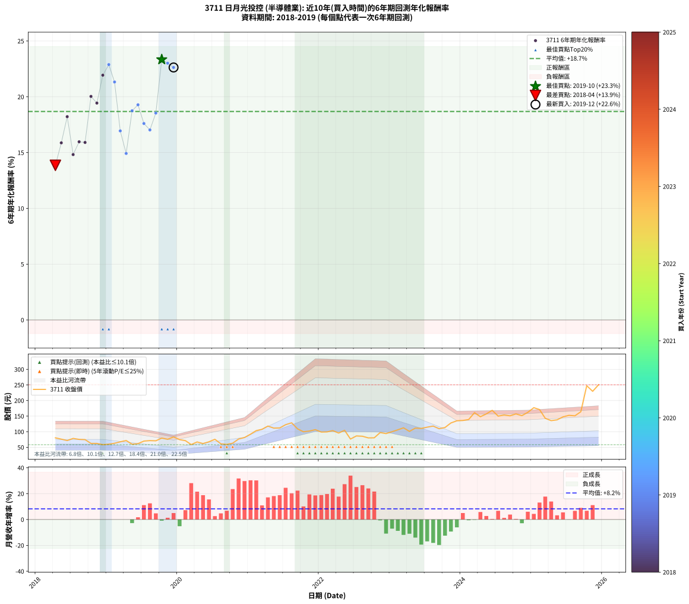

# 3711 日月光投控 - 本益比與未來報酬率分析

!!! info "報告資訊"
    - **股票代號**: 3711
    - **公司名稱**: 日月光投控
    - **產業別**: 半導體業
    - **分析期間**: 2018-2019 (21 個數據點)
    - **資料來源**: Type 12 (ShowMonthlyK_ChartFlow) 月收盤價與本益比
    - **報酬率口徑**: 含現金股利 (簡化: 年度合計，假設每年7/1入帳)
    - **報告生成時間**: 2026-01-06 18:58:43 CST

## 📈 視覺化圖表

### 圖表1: 本益比 vs 未來報酬率關係

*圖表1：3711 日月光投控 本益比與6年期未來報酬率關係 (2018-2019)*

### 圖表2: 歷年買入時點的6年期實際報酬率

*圖表2：3711 日月光投控 歷年買入時點的6年期實際報酬率 (2018-2019)*

## 📍 買點訊號說明

本報告提供兩種買點提示訊號（顯示於圖表2的股價子圖中）：

### ▲ 小綠色三角形（回測驗證）
- **計算方式**: 使用全部歷史資料計算本益比第25百分位數
- **用途**: 事後驗證，顯示歷史上哪些時點確實為低估區
- **限制**: 當下無法判斷，僅供回測參考
- **特性**: 後見之明（Look-Ahead Bias）

### ▲ 小橘色三角形（即時訊號）
- **計算方式**: 使用截至當月的過去5年資料計算本益比第25百分位數
- **用途**: 實際投資決策，當時即可判斷
- **優勢**: 可操作性強，符合實務需求
- **特性**: 無後見之明，滾動窗口計算

!!! tip "如何使用兩種訊號"
    - **綠色▲** 幫助理解歷史估值機會，驗證策略有效性
    - **橘色▲** 可作為實際買進參考，但仍需搭配基本面分析
    - 兩種訊號重疊時，表示即時判斷與事後驗證一致，信心度較高
    - 僅有綠色▲時，表示當時無法判斷（需要未來資料才能確認）
    - 僅有橘色▲時，表示即時判斷為買點，但事後可能不是最佳時機

## 📊 估值分析摘要

| 指標 | 數值 |
|:---:|:---:|
| **目前本益比** (2019-12) | **21.01 倍** |
| **歷史平均本益比** | 13.47 倍 |
| **估值水準** | 🔴 相對高估 |
| **預期6年年化報酬率** | **+20.49%** |
| **歷史平均報酬率** | +18.68% |
| **相關係數 (R²)** | 0.0564 |
| **趨勢線斜率** | 0.2401 |

!!! abstract "核心洞察"
    目前本益比顯著高於歷史平均，預期未來報酬率可能較低

    根據歷史數據回測，3711 日月光投控 在目前本益比 **21.0倍** 的估值水準下，
    預期未來6年年化報酬率約為 **+20.5%**。

    **重要提醒**: 本分析基於歷史數據統計，實際報酬率會受到公司基本面變化、產業趨勢、
    總體經濟環境等多重因素影響。R² = 0.06 表示本益比可解釋約 5.6% 的報酬率變異。

## 📈 歷史估值統計

### 最佳買點 (最高報酬率)

| 項目 | 數值 |
|:---:|:---:|
| 起始時間 | 2019-10 |
| 當時本益比 | 18.52 倍 |
| 起始價格 | 79.5 元 |
| 6年後價格 | 247.5 元 |
| **6年年化報酬率** | **+23.34%** |

### 最差買點 (最低報酬率)

| 項目 | 數值 |
|:---:|:---:|
| 起始時間 | 2018-04 |
| 當時本益比 | 13.50 倍 |
| 起始價格 | 80.3 元 |
| 6年後價格 | 148.0 元 |
| **6年年化報酬率** | **+13.86%** |

## 🎯 投資啟示

### 本益比與報酬率關係

趨勢線方程式: **y = 0.2401x + 15.4466**

!!! info "弱相關或正相關"
    本益比與未來報酬率相關性較弱。這可能表示該股票的報酬率更多受到
    公司成長性、產業趨勢等因素影響，而非估值水準。**需綜合考量多項指標**。

### 估值區間建議

基於歷史數據分析:

- **🟢 低估區** (P/E < 10.8): 預期報酬率較高，可考慮增加持股
- **🟡 合理區** (P/E 10.8-16.2): 預期報酬率符合長期趨勢，正常持有
- **🔴 高估區** (P/E > 16.2): 預期報酬率較低，可考慮減碼或觀望

!!! danger "風險提示"
    - 過去表現不代表未來結果
    - 本分析假設公司基本面無重大結構性變化
    - 產業環境劇變可能使歷史規律失效
    - 應結合公司財報、產業趨勢、總體經濟等多重因素綜合判斷

!!! success "長期投資觀點"
    歷史數據顯示，在合理或低估的估值水準買入並長期持有，
    往往能獲得較佳的投資報酬。**耐心等待好價格**是價值投資的核心原則。

## 📊 數據品質

- **資料來源**: GoodInfo.tw Type 12 (ShowMonthlyK_ChartFlow)
- **資料頻率**: 月度收盤價與本益比
- **回測期間**: 2018-2019
- **數據點數量**: 21 個 (每個點代表一次6年期回測)

### 計算方法說明

1. **6年期年化報酬率**:
   - 對每個歷史時點，計算其後6年的實際投資報酬率
   - 期末價值(不含股利): 期末價格
   - 期末價值(含現金股利): 期末價格 + 持有期間內的現金股利合計 (簡化: 年度合計，假設每年7/1入帳)
   - 公式: 年化報酬率 = [(期末價值/期初價格)^(1/年數) - 1] × 100%

2. **本益比 (P/E Ratio)**:
   - 使用當時的月收盤價與EPS計算
   - 資料來源: Type 12 月度河流圖本益比數據

3. **趨勢線 (Linear Regression)**:
   - 使用最小平方法擬合線性趨勢線
   - R²值衡量本益比對報酬率的解釋能力

---

*本報告由 Stock Analysis System v1.9.0 自動生成*
*數據更新時間: 2026-01-06 18:58:43 CST*

## 📋 月度回測明細表

（每一列對應時間線圖中的一個買入點；可用來對照 SVG 圖上的每個點。）

| 買入月份 | 賣出月份 | 回測期限_年 | 實際持有年數 | 買入本益比_倍 | 買入收盤價_元 | 賣出收盤價_元 | 現金股利合計_元 | 總報酬率_pct | 年化報酬率_pct |
| --- | --- | --- | --- | --- | --- | --- | --- | --- | --- |
| 2018-04 | 2024-04 | 6 | 6.001 | 13.50 | 80.30 | 148.00 | 26.98 | +117.90 | +13.86 |
| 2018-05 | 2024-05 | 6 | 6.001 | 12.77 | 76.00 | 157.00 | 26.98 | +142.07 | +15.87 |
| 2018-06 | 2024-06 | 6 | 6.001 | 12.03 | 71.60 | 168.50 | 26.98 | +173.01 | +18.22 |
| 2018-07 | 2024-07 | 6 | 6.001 | 13.18 | 78.40 | 150.00 | 29.68 | +129.18 | +14.82 |
| 2018-08 | 2024-08 | 6 | 6.001 | 12.66 | 75.30 | 153.50 | 29.68 | +143.27 | +15.97 |
| 2018-09 | 2024-09 | 6 | 6.001 | 12.52 | 74.50 | 151.00 | 29.68 | +142.52 | +15.91 |
| 2018-10 | 2024-10 | 6 | 6.001 | 10.49 | 62.40 | 157.00 | 29.68 | +199.17 | +20.03 |
| 2018-11 | 2024-11 | 6 | 6.001 | 10.49 | 62.40 | 151.50 | 29.68 | +190.35 | +19.44 |
| 2018-12 | 2024-12 | 6 | 6.001 | 9.80 | 58.30 | 162.00 | 29.68 | +228.78 | +21.94 |
| 2019-01 | 2025-01 | 6 | 6.001 | 10.37 | 60.00 | 177.00 | 29.68 | +244.47 | +22.89 |
| 2019-02 | 2025-02 | 6 | 6.001 | 11.20 | 62.90 | 171.00 | 29.68 | +219.04 | +21.33 |
| 2019-03 | 2025-03 | 6 | 6.001 | 12.38 | 67.50 | 143.00 | 29.68 | +155.82 | +16.94 |
| 2019-04 | 2025-04 | 6 | 6.001 | 13.56 | 71.70 | 135.50 | 29.68 | +130.38 | +14.92 |
| 2019-05 | 2025-05 | 6 | 6.001 | 11.68 | 59.80 | 138.00 | 29.68 | +180.40 | +18.74 |
| 2019-06 | 2025-06 | 6 | 6.001 | 12.41 | 61.50 | 147.50 | 29.68 | +188.10 | +19.28 |
| 2019-07 | 2025-07 | 6 | 6.001 | 14.60 | 69.90 | 152.50 | 32.48 | +164.63 | +17.60 |
| 2019-08 | 2025-08 | 6 | 6.001 | 15.44 | 71.40 | 151.00 | 32.48 | +156.97 | +17.03 |
| 2019-09 | 2025-09 | 6 | 6.001 | 15.88 | 70.80 | 164.00 | 32.48 | +177.51 | +18.54 |
| 2019-10 | 2025-10 | 6 | 6.001 | 18.52 | 79.50 | 247.50 | 32.48 | +252.17 | +23.34 |
| 2019-11 | 2025-11 | 6 | 6.001 | 18.32 | 75.60 | 229.50 | 32.48 | +246.53 | +23.01 |
| 2019-12 | 2025-12 | 6 | 6.001 | 21.01 | 83.20 | 250.50 | 32.48 | +240.12 | +22.63 |
