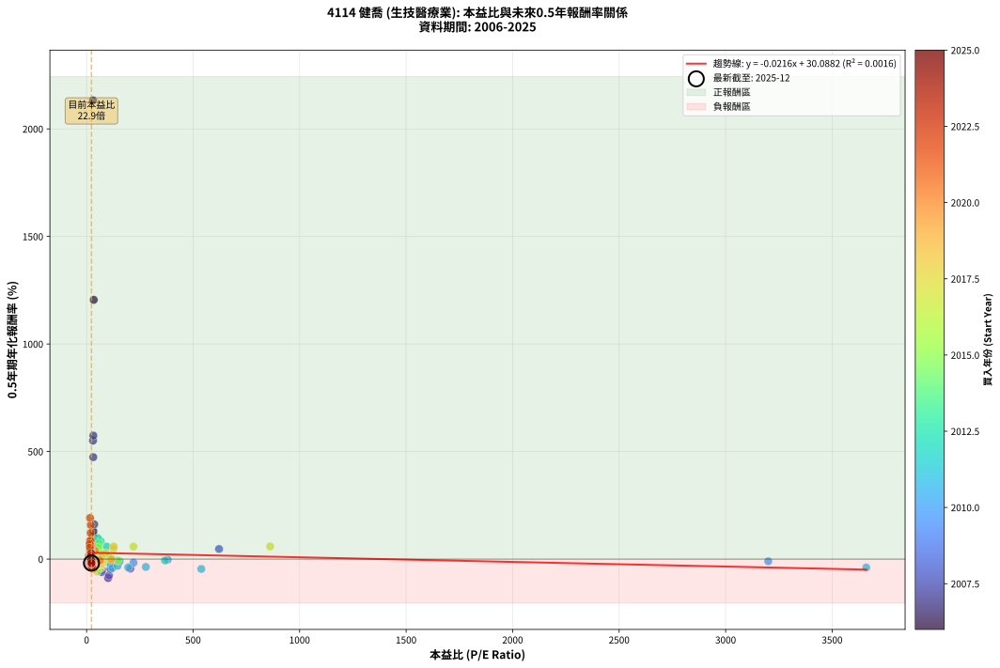
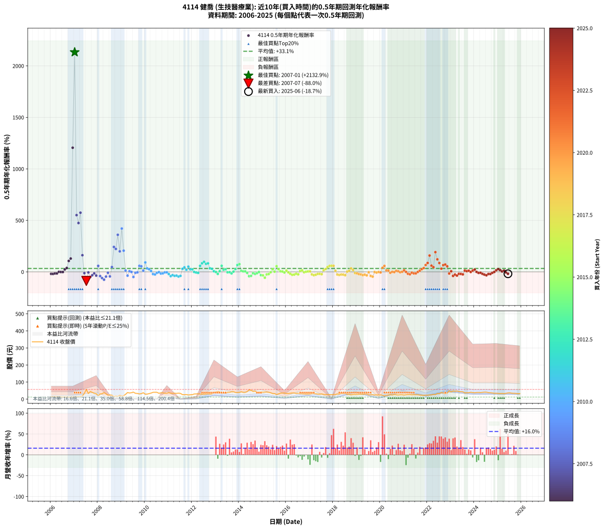

# 4114 健喬 - 本益比與未來報酬率分析

!!! info "報告資訊"
    - **股票代號**: 4114
    - **公司名稱**: 健喬
    - **產業別**: 生技醫療業
    - **分析期間**: 2006-2025 (234 個數據點)
    - **資料來源**: Type 12 (ShowMonthlyK_ChartFlow) 月收盤價與本益比
    - **報酬率口徑**: 含現金股利 (簡化: 年度合計，假設每年7/1入帳)
    - **報告生成時間**: 2026-01-06 01:01:12 CST

## 📈 視覺化圖表

### 圖表1: 本益比 vs 未來報酬率關係

*圖表1：4114 健喬 本益比與0.5年期未來報酬率關係 (2006-2025)*

### 圖表2: 歷年買入時點的0.5年期實際報酬率

*圖表2：4114 健喬 歷年買入時點的0.5年期實際報酬率 (2006-2025)*

## 📍 買點訊號說明

本報告提供兩種買點提示訊號（顯示於圖表2的股價子圖中）：

### ▲ 小綠色三角形（回測驗證）
- **計算方式**: 使用全部歷史資料計算本益比第25百分位數
- **用途**: 事後驗證，顯示歷史上哪些時點確實為低估區
- **限制**: 當下無法判斷，僅供回測參考
- **特性**: 後見之明（Look-Ahead Bias）

### ▲ 小橘色三角形（即時訊號）
- **計算方式**: 使用截至當月的過去5年資料計算本益比第25百分位數
- **用途**: 實際投資決策，當時即可判斷
- **優勢**: 可操作性強，符合實務需求
- **特性**: 無後見之明，滾動窗口計算

!!! tip "如何使用兩種訊號"
    - **綠色▲** 幫助理解歷史估值機會，驗證策略有效性
    - **橘色▲** 可作為實際買進參考，但仍需搭配基本面分析
    - 兩種訊號重疊時，表示即時判斷與事後驗證一致，信心度較高
    - 僅有綠色▲時，表示當時無法判斷（需要未來資料才能確認）
    - 僅有橘色▲時，表示即時判斷為買點，但事後可能不是最佳時機

## 📊 估值分析摘要

| 指標 | 數值 |
|:---:|:---:|
| **目前本益比** (2025-06) | **22.95 倍** |
| **歷史平均本益比** | 92.98 倍 |
| **估值水準** | 🟢 相對低估 |
| **預期0.5年年化報酬率** | **+29.59%** |
| **歷史平均報酬率** | +33.12% |
| **相關係數 (R²)** | 0.0016 |
| **趨勢線斜率** | -0.0216 |

!!! abstract "核心洞察"
    目前本益比顯著低於歷史平均，預期未來報酬率可能較高

    根據歷史數據回測，4114 健喬 在目前本益比 **22.9倍** 的估值水準下，
    預期未來0.5年年化報酬率約為 **+29.6%**。

    **重要提醒**: 本分析基於歷史數據統計，實際報酬率會受到公司基本面變化、產業趨勢、
    總體經濟環境等多重因素影響。R² = 0.00 表示本益比可解釋約 0.2% 的報酬率變異。

## 📈 歷史估值統計

### 最佳買點 (最高報酬率)

| 項目 | 數值 |
|:---:|:---:|
| 起始時間 | 2007-01 |
| 當時本益比 | 30.06 倍 |
| 起始價格 | 12.2 元 |
| 0.5年後價格 | 56.7 元 |
| **0.5年年化報酬率** | **+2132.88%** |

### 最差買點 (最低報酬率)

| 項目 | 數值 |
|:---:|:---:|
| 起始時間 | 2007-07 |
| 當時本益比 | 101.10 倍 |
| 起始價格 | 56.7 元 |
| 0.5年後價格 | 19.5 元 |
| **0.5年年化報酬率** | **-87.98%** |

## 🎯 投資啟示

### 本益比與報酬率關係

趨勢線方程式: **y = -0.0216x + 30.0882**

!!! note "負相關"
    本益比與未來報酬率呈現負相關。較低的本益比通常帶來較高的未來報酬率，
    但相關性不算非常強。**估值仍是重要參考指標之一**。

### 估值區間建議

基於歷史數據分析:

- **🟢 低估區** (P/E < 74.4): 預期報酬率較高，可考慮增加持股
- **🟡 合理區** (P/E 74.4-111.6): 預期報酬率符合長期趨勢，正常持有
- **🔴 高估區** (P/E > 111.6): 預期報酬率較低，可考慮減碼或觀望

!!! danger "風險提示"
    - 過去表現不代表未來結果
    - 本分析假設公司基本面無重大結構性變化
    - 產業環境劇變可能使歷史規律失效
    - 應結合公司財報、產業趨勢、總體經濟等多重因素綜合判斷

!!! success "長期投資觀點"
    歷史數據顯示，在合理或低估的估值水準買入並長期持有，
    往往能獲得較佳的投資報酬。**耐心等待好價格**是價值投資的核心原則。

## 📊 數據品質

- **資料來源**: GoodInfo.tw Type 12 (ShowMonthlyK_ChartFlow)
- **資料頻率**: 月度收盤價與本益比
- **回測期間**: 2006-2025
- **數據點數量**: 234 個 (每個點代表一次0.5年期回測)

### 計算方法說明

1. **0.5年期年化報酬率**:
   - 對每個歷史時點，計算其後0.5年的實際投資報酬率
   - 期末價值(不含股利): 期末價格
   - 期末價值(含現金股利): 期末價格 + 持有期間內的現金股利合計 (簡化: 年度合計，假設每年7/1入帳)
   - 公式: 年化報酬率 = [(期末價值/期初價格)^(1/年數) - 1] × 100%

2. **本益比 (P/E Ratio)**:
   - 使用當時的月收盤價與EPS計算
   - 資料來源: Type 12 月度河流圖本益比數據

3. **趨勢線 (Linear Regression)**:
   - 使用最小平方法擬合線性趨勢線
   - R²值衡量本益比對報酬率的解釋能力

---

*本報告由 Stock Analysis System v1.9.0 自動生成*
*數據更新時間: 2026-01-06 01:01:12 CST*

## 📋 月度回測明細表

（每一列對應時間線圖中的一個買入點；可用來對照 SVG 圖上的每個點。）

| 買入月份 | 賣出月份 | 回測期限_年 | 實際持有年數 | 買入本益比_倍 | 買入收盤價_元 | 賣出收盤價_元 | 現金股利合計_元 | 總報酬率_pct | 年化報酬率_pct |
| --- | --- | --- | --- | --- | --- | --- | --- | --- | --- |
| 2006-01 | 2006-07 | 0.5 | 0.496 | 37.24 | 14.15 | 12.30 | 0.40 | -10.25 | -19.60 |
| 2006-02 | 2006-08 | 0.5 | 0.498 | 38.42 | 14.60 | 12.65 | 0.40 | -10.62 | -20.17 |
| 2006-03 | 2006-10 | 0.5 | 0.586 | 36.05 | 13.70 | 12.00 | 0.40 | -9.49 | -15.65 |
| 2006-04 | 2006-10 | 0.5 | 0.501 | 35.53 | 13.50 | 12.00 | 0.40 | -8.15 | -15.60 |
| 2006-05 | 2006-12 | 0.5 | 0.586 | 34.74 | 13.20 | 12.80 | 0.40 | +0.00 | +0.00 |
| 2006-06 | 2006-12 | 0.5 | 0.501 | 35.00 | 13.30 | 12.80 | 0.40 | -0.75 | -1.50 |
| 2006-07 | 2007-01 | 0.5 | 0.504 | 32.37 | 12.30 | 12.20 | 0.00 | -0.81 | -1.61 |
| 2006-08 | 2007-03 | 0.5 | 0.580 | 33.29 | 12.65 | 14.30 | 0.00 | +13.04 | +23.52 |
| 2006-09 | 2007-03 | 0.5 | 0.496 | 32.11 | 12.20 | 14.30 | 0.00 | +17.21 | +37.78 |
| 2006-10 | 2007-05 | 0.5 | 0.580 | 31.58 | 12.00 | 18.25 | 0.00 | +52.08 | +105.92 |
| 2006-11 | 2007-05 | 0.5 | 0.496 | 31.84 | 12.10 | 18.25 | 0.00 | +50.83 | +129.17 |
| 2006-12 | 2007-07 | 0.5 | 0.580 | 33.68 | 12.80 | 56.70 | 0.16 | +344.20 | +1205.28 |
| 2007-01 | 2007-07 | 0.5 | 0.496 | 30.06 | 12.20 | 56.70 | 0.16 | +366.05 | +2132.88 |
| 2007-02 | 2007-08 | 0.5 | 0.498 | 30.12 | 13.00 | 32.90 | 0.16 | +154.29 | +550.80 |
| 2007-03 | 2007-10 | 0.5 | 0.586 | 31.26 | 14.30 | 39.65 | 0.16 | +178.38 | +473.97 |
| 2007-04 | 2007-10 | 0.5 | 0.501 | 31.66 | 15.30 | 39.65 | 0.16 | +160.18 | +574.30 |
| 2007-05 | 2007-12 | 0.5 | 0.586 | 35.84 | 18.25 | 31.90 | 0.16 | +75.66 | +161.58 |
| 2007-06 | 2007-12 | 0.5 | 0.501 | 64.02 | 34.25 | 31.90 | 0.16 | -6.40 | -12.37 |
| 2007-07 | 2008-01 | 0.5 | 0.504 | 101.10 | 56.70 | 19.50 | 0.00 | -65.61 | -87.98 |
| 2007-08 | 2008-03 | 0.5 | 0.583 | 56.08 | 32.90 | 31.80 | 0.00 | -3.34 | -5.66 |
| 2007-09 | 2008-03 | 0.5 | 0.498 | 73.31 | 44.90 | 31.80 | 0.00 | -29.18 | -49.96 |
| 2007-10 | 2008-05 | 0.5 | 0.583 | 62.11 | 39.65 | 31.50 | 0.00 | -20.55 | -32.60 |
| 2007-11 | 2008-05 | 0.5 | 0.498 | 51.42 | 34.15 | 31.50 | 0.00 | -7.76 | -14.96 |
| 2007-12 | 2008-07 | 0.5 | 0.583 | 46.23 | 31.90 | 24.30 | 0.20 | -23.20 | -36.40 |
| 2008-01 | 2008-07 | 0.5 | 0.498 | 32.05 | 19.50 | 24.30 | 0.20 | +25.64 | +58.10 |
| 2008-02 | 2008-08 | 0.5 | 0.501 | 56.96 | 30.00 | 22.80 | 0.20 | -23.33 | -41.16 |
| 2008-03 | 2008-10 | 0.5 | 0.586 | 71.46 | 31.80 | 18.30 | 0.20 | -41.82 | -60.33 |
| 2008-04 | 2008-10 | 0.5 | 0.501 | 105.00 | 38.15 | 18.30 | 0.20 | -51.51 | -76.41 |
| 2008-05 | 2008-12 | 0.5 | 0.586 | 111.80 | 31.50 | 21.70 | 0.20 | -30.48 | -46.23 |
| 2008-06 | 2008-12 | 0.5 | 0.501 | 114.50 | 22.90 | 21.70 | 0.20 | -4.37 | -8.53 |
| 2008-07 | 2009-01 | 0.5 | 0.504 | 205.40 | 24.30 | 18.10 | 0.00 | -25.51 | -44.27 |
| 2008-08 | 2009-03 | 0.5 | 0.580 | 621.80 | 22.80 | 28.50 | 0.00 | +25.00 | +46.88 |
| 2008-09 | 2009-03 | 0.5 | 0.496 |  | 15.50 | 28.50 | 0.00 | +83.87 | +241.80 |
| 2008-10 | 2009-05 | 0.5 | 0.580 |  | 18.30 | 36.10 | 0.00 | +97.27 | +222.36 |
| 2008-11 | 2009-05 | 0.5 | 0.496 |  | 16.95 | 36.10 | 0.00 | +112.98 | +359.80 |
| 2008-12 | 2009-07 | 0.5 | 0.580 |  | 21.70 | 41.00 | 0.00 | +88.94 | +199.28 |
| 2009-01 | 2009-07 | 0.5 | 0.496 |  | 18.10 | 41.00 | 0.00 | +126.52 | +420.70 |
| 2009-02 | 2009-08 | 0.5 | 0.498 |  | 19.60 | 34.20 | 0.00 | +74.49 | +205.63 |
| 2009-03 | 2009-10 | 0.5 | 0.586 |  | 28.50 | 30.60 | 0.00 | +7.37 | +12.90 |
| 2009-04 | 2009-10 | 0.5 | 0.501 |  | 38.55 | 30.60 | 0.00 | -20.62 | -36.93 |
| 2009-05 | 2009-12 | 0.5 | 0.586 |  | 36.10 | 37.50 | 0.00 | +3.88 | +6.71 |
| 2009-06 | 2009-12 | 0.5 | 0.501 |  | 37.70 | 37.50 | 0.00 | -0.53 | -1.06 |
| 2009-07 | 2010-01 | 0.5 | 0.504 |  | 41.00 | 29.00 | 0.00 | -29.27 | -49.71 |
| 2009-08 | 2010-03 | 0.5 | 0.580 |  | 34.20 | 32.30 | 0.00 | -5.56 | -9.38 |
| 2009-09 | 2010-03 | 0.5 | 0.496 |  | 33.15 | 32.30 | 0.00 | -2.56 | -5.11 |
| 2009-10 | 2010-05 | 0.5 | 0.580 |  | 30.60 | 39.95 | 0.00 | +30.56 | +58.31 |
| 2009-11 | 2010-05 | 0.5 | 0.496 |  | 32.25 | 39.95 | 0.00 | +23.88 | +54.04 |
| 2009-12 | 2010-07 | 0.5 | 0.580 |  | 37.50 | 40.00 | 0.00 | +6.67 | +11.76 |
| 2010-01 | 2010-07 | 0.5 | 0.496 |  | 29.00 | 40.00 | 0.00 | +37.93 | +91.35 |
| 2010-02 | 2010-08 | 0.5 | 0.498 |  | 29.65 | 34.25 | 0.00 | +15.51 | +33.57 |
| 2010-03 | 2010-10 | 0.5 | 0.586 |  | 32.30 | 36.85 | 0.00 | +14.09 | +25.22 |
| 2010-04 | 2010-10 | 0.5 | 0.501 |  | 35.40 | 36.85 | 0.00 | +4.10 | +8.34 |
| 2010-05 | 2010-12 | 0.5 | 0.586 |  | 39.95 | 34.65 | 0.00 | -13.27 | -21.57 |
| 2010-06 | 2010-12 | 0.5 | 0.501 |  | 40.20 | 34.65 | 0.00 | -13.81 | -25.66 |
| 2010-07 | 2011-01 | 0.5 | 0.504 | 3200.00 | 40.00 | 37.90 | 0.00 | -5.25 | -10.15 |
| 2010-08 | 2011-03 | 0.5 | 0.580 | 380.60 | 34.25 | 33.70 | 0.00 | -1.61 | -2.75 |
| 2010-09 | 2011-03 | 0.5 | 0.496 | 220.30 | 36.90 | 33.70 | 0.00 | -8.67 | -16.73 |
| 2010-10 | 2011-05 | 0.5 | 0.580 | 150.40 | 36.85 | 33.60 | 0.00 | -8.82 | -14.71 |
| 2010-11 | 2011-05 | 0.5 | 0.496 | 107.00 | 34.50 | 33.60 | 0.00 | -2.61 | -5.19 |
| 2010-12 | 2011-07 | 0.5 | 0.580 | 86.62 | 34.65 | 33.55 | 0.10 | -2.87 | -4.90 |
| 2011-01 | 2011-07 | 0.5 | 0.496 | 110.10 | 37.90 | 33.55 | 0.10 | -11.20 | -21.31 |
| 2011-02 | 2011-08 | 0.5 | 0.498 | 120.70 | 34.80 | 26.50 | 0.10 | -23.55 | -41.66 |
| 2011-03 | 2011-10 | 0.5 | 0.586 | 145.00 | 33.70 | 26.90 | 0.10 | -19.87 | -31.48 |
| 2011-04 | 2011-10 | 0.5 | 0.501 | 195.30 | 34.50 | 26.90 | 0.10 | -21.72 | -38.67 |
| 2011-05 | 2011-12 | 0.5 | 0.586 | 278.10 | 33.60 | 25.65 | 0.10 | -23.35 | -36.48 |
| 2011-06 | 2011-12 | 0.5 | 0.501 | 538.50 | 35.00 | 25.65 | 0.10 | -26.41 | -45.78 |
| 2011-07 | 2012-01 | 0.5 | 0.504 | 3660.00 | 33.55 | 26.10 | 0.00 | -22.21 | -39.25 |
| 2011-08 | 2012-03 | 0.5 | 0.583 |  | 26.50 | 30.80 | 0.00 | +16.23 | +29.41 |
| 2011-09 | 2012-03 | 0.5 | 0.498 |  | 25.70 | 30.80 | 0.00 | +19.84 | +43.81 |
| 2011-10 | 2012-05 | 0.5 | 0.583 |  | 26.90 | 29.95 | 0.00 | +11.34 | +20.22 |
| 2011-11 | 2012-05 | 0.5 | 0.498 |  | 24.40 | 29.95 | 0.00 | +22.75 | +50.88 |
| 2011-12 | 2012-07 | 0.5 | 0.583 |  | 25.65 | 28.95 | 0.10 | +13.26 | +23.79 |
| 2012-01 | 2012-07 | 0.5 | 0.498 |  | 26.10 | 28.95 | 0.10 | +11.30 | +23.97 |
| 2012-02 | 2012-08 | 0.5 | 0.501 |  | 30.25 | 29.95 | 0.10 | -0.66 | -1.32 |
| 2012-03 | 2012-10 | 0.5 | 0.586 | 368.00 | 30.80 | 29.50 | 0.10 | -3.90 | -6.56 |
| 2012-04 | 2012-10 | 0.5 | 0.501 | 155.00 | 31.25 | 29.50 | 0.10 | -5.28 | -10.26 |
| 2012-05 | 2012-12 | 0.5 | 0.586 | 93.74 | 29.95 | 39.10 | 0.10 | +30.88 | +58.31 |
| 2012-06 | 2012-12 | 0.5 | 0.501 | 66.19 | 28.95 | 39.10 | 0.10 | +35.41 | +83.12 |
| 2012-07 | 2013-01 | 0.5 | 0.504 | 52.14 | 28.95 | 40.80 | 0.00 | +40.93 | +97.60 |
| 2012-08 | 2013-03 | 0.5 | 0.580 | 44.49 | 29.95 | 41.80 | 0.00 | +39.57 | +77.60 |
| 2012-09 | 2013-03 | 0.5 | 0.496 | 39.19 | 31.00 | 41.80 | 0.00 | +34.84 | +82.79 |
| 2012-10 | 2013-05 | 0.5 | 0.580 | 32.45 | 29.50 | 35.00 | 0.00 | +18.64 | +34.25 |
| 2012-11 | 2013-05 | 0.5 | 0.496 | 29.99 | 30.80 | 35.00 | 0.00 | +13.64 | +29.43 |
| 2012-12 | 2013-07 | 0.5 | 0.580 | 34.16 | 39.10 | 40.30 | 0.20 | +3.59 | +6.26 |
| 2013-01 | 2013-07 | 0.5 | 0.496 | 36.97 | 40.80 | 40.30 | 0.20 | -0.73 | -1.47 |
| 2013-02 | 2013-08 | 0.5 | 0.498 | 42.74 | 45.40 | 40.35 | 0.20 | -10.68 | -20.28 |
| 2013-03 | 2013-10 | 0.5 | 0.586 | 40.94 | 41.80 | 43.40 | 0.20 | +4.31 | +7.47 |
| 2013-04 | 2013-10 | 0.5 | 0.501 | 35.31 | 34.60 | 43.40 | 0.20 | +26.02 | +58.65 |
| 2013-05 | 2013-12 | 0.5 | 0.586 | 37.29 | 35.00 | 38.70 | 0.20 | +11.15 | +19.77 |
| 2013-06 | 2013-12 | 0.5 | 0.501 | 38.78 | 34.80 | 38.70 | 0.20 | +11.79 | +24.91 |
| 2013-07 | 2014-01 | 0.5 | 0.504 | 47.07 | 40.30 | 39.40 | 0.00 | -2.23 | -4.38 |
| 2013-08 | 2014-03 | 0.5 | 0.580 | 49.51 | 40.35 | 39.60 | 0.00 | -1.86 | -3.18 |
| 2013-09 | 2014-03 | 0.5 | 0.496 | 55.64 | 43.05 | 39.60 | 0.00 | -8.01 | -15.51 |
| 2013-10 | 2014-05 | 0.5 | 0.580 | 59.25 | 43.40 | 44.00 | 0.00 | +1.38 | +2.39 |
| 2013-11 | 2014-05 | 0.5 | 0.496 | 56.57 | 39.10 | 44.00 | 0.00 | +12.53 | +26.90 |
| 2013-12 | 2014-07 | 0.5 | 0.580 | 59.54 | 38.70 | 51.80 | 0.19 | +34.34 | +66.30 |
| 2014-01 | 2014-07 | 0.5 | 0.496 | 58.37 | 39.40 | 51.80 | 0.19 | +31.95 | +74.99 |
| 2014-02 | 2014-08 | 0.5 | 0.498 | 61.93 | 43.35 | 45.30 | 0.19 | +4.94 | +10.15 |
| 2014-03 | 2014-10 | 0.5 | 0.586 | 54.62 | 39.60 | 40.50 | 0.19 | +2.75 | +4.74 |
| 2014-04 | 2014-10 | 0.5 | 0.501 | 52.93 | 39.70 | 40.50 | 0.19 | +2.49 | +5.04 |
| 2014-05 | 2014-12 | 0.5 | 0.586 | 56.77 | 44.00 | 41.15 | 0.19 | -6.05 | -10.10 |
| 2014-06 | 2014-12 | 0.5 | 0.501 | 68.12 | 54.50 | 41.15 | 0.19 | -24.15 | -42.40 |
| 2014-07 | 2015-01 | 0.5 | 0.504 | 62.79 | 51.80 | 40.30 | 0.00 | -22.20 | -39.25 |
| 2014-08 | 2015-03 | 0.5 | 0.580 | 53.29 | 45.30 | 41.80 | 0.00 | -7.73 | -12.94 |
| 2014-09 | 2015-03 | 0.5 | 0.496 | 53.54 | 46.85 | 41.80 | 0.00 | -10.78 | -20.56 |
| 2014-10 | 2015-05 | 0.5 | 0.580 | 45.00 | 40.50 | 37.40 | 0.00 | -7.65 | -12.82 |
| 2014-11 | 2015-05 | 0.5 | 0.496 | 40.76 | 37.70 | 37.40 | 0.00 | -0.80 | -1.60 |
| 2014-12 | 2015-07 | 0.5 | 0.580 | 43.32 | 41.15 | 32.65 | 0.20 | -20.17 | -32.17 |
| 2015-01 | 2015-07 | 0.5 | 0.496 | 45.20 | 40.30 | 32.65 | 0.20 | -18.49 | -33.80 |
| 2015-02 | 2015-08 | 0.5 | 0.498 | 49.56 | 41.30 | 26.80 | 0.20 | -34.62 | -57.39 |
| 2015-03 | 2015-10 | 0.5 | 0.586 | 53.94 | 41.80 | 35.20 | 0.20 | -15.31 | -24.70 |
| 2015-04 | 2015-10 | 0.5 | 0.501 | 55.81 | 40.00 | 35.20 | 0.20 | -11.50 | -21.64 |
| 2015-05 | 2015-12 | 0.5 | 0.586 | 56.81 | 37.40 | 36.35 | 0.20 | -2.27 | -3.85 |
| 2015-06 | 2015-12 | 0.5 | 0.501 | 54.42 | 32.65 | 36.35 | 0.20 | +11.94 | +25.26 |
| 2015-07 | 2016-01 | 0.5 | 0.504 | 60.28 | 32.65 | 32.95 | 0.00 | +0.92 | +1.83 |
| 2015-08 | 2016-03 | 0.5 | 0.583 | 55.45 | 26.80 | 34.60 | 0.00 | +29.10 | +54.97 |
| 2015-09 | 2016-03 | 0.5 | 0.498 | 72.71 | 30.90 | 34.60 | 0.00 | +11.97 | +25.48 |
| 2015-10 | 2016-05 | 0.5 | 0.583 | 96.00 | 35.20 | 36.30 | 0.00 | +3.12 | +5.42 |
| 2015-11 | 2016-05 | 0.5 | 0.498 | 116.00 | 35.75 | 36.30 | 0.00 | +1.54 | +3.11 |
| 2015-12 | 2016-07 | 0.5 | 0.583 | 145.40 | 36.35 | 34.75 | 0.17 | -3.93 | -6.64 |
| 2016-01 | 2016-07 | 0.5 | 0.498 | 102.70 | 32.95 | 34.75 | 0.17 | +5.99 | +12.38 |
| 2016-02 | 2016-08 | 0.5 | 0.501 | 83.96 | 32.90 | 31.85 | 0.17 | -2.67 | -5.25 |
| 2016-03 | 2016-10 | 0.5 | 0.586 | 74.76 | 34.60 | 30.40 | 0.17 | -11.64 | -19.04 |
| 2016-04 | 2016-10 | 0.5 | 0.501 | 67.83 | 36.20 | 30.40 | 0.17 | -15.54 | -28.62 |
| 2016-05 | 2016-12 | 0.5 | 0.586 | 60.03 | 36.30 | 30.10 | 0.17 | -16.60 | -26.65 |
| 2016-06 | 2016-12 | 0.5 | 0.501 | 49.59 | 33.50 | 30.10 | 0.17 | -9.63 | -18.30 |
| 2016-07 | 2017-01 | 0.5 | 0.504 | 46.55 | 34.75 | 30.10 | 0.00 | -13.38 | -24.81 |
| 2016-08 | 2017-03 | 0.5 | 0.580 | 38.96 | 31.85 | 33.35 | 0.00 | +4.71 | +8.25 |
| 2016-09 | 2017-03 | 0.5 | 0.496 | 35.12 | 31.20 | 33.35 | 0.00 | +6.89 | +14.39 |
| 2016-10 | 2017-05 | 0.5 | 0.580 | 31.69 | 30.40 | 29.70 | 0.00 | -2.30 | -3.93 |
| 2016-11 | 2017-05 | 0.5 | 0.496 | 28.63 | 29.50 | 29.70 | 0.00 | +0.68 | +1.37 |
| 2016-12 | 2017-07 | 0.5 | 0.580 | 27.33 | 30.10 | 30.60 | 0.20 | +2.33 | +4.04 |
| 2017-01 | 2017-07 | 0.5 | 0.496 | 29.75 | 30.10 | 30.60 | 0.20 | +2.33 | +4.75 |
| 2017-02 | 2017-08 | 0.5 | 0.498 | 34.85 | 32.15 | 27.60 | 0.20 | -13.53 | -25.30 |
| 2017-03 | 2017-10 | 0.5 | 0.586 | 40.02 | 33.35 | 26.35 | 0.20 | -20.39 | -32.24 |
| 2017-04 | 2017-10 | 0.5 | 0.501 | 42.06 | 31.30 | 26.35 | 0.20 | -15.18 | -28.00 |
| 2017-05 | 2017-12 | 0.5 | 0.586 | 45.35 | 29.70 | 25.85 | 0.20 | -12.29 | -20.05 |
| 2017-06 | 2017-12 | 0.5 | 0.501 | 51.36 | 29.05 | 25.85 | 0.20 | -10.33 | -19.55 |
| 2017-07 | 2018-01 | 0.5 | 0.504 | 64.24 | 30.60 | 26.90 | 0.00 | -12.09 | -22.57 |
| 2017-08 | 2018-03 | 0.5 | 0.580 | 71.31 | 27.60 | 30.05 | 0.00 | +8.88 | +15.78 |
| 2017-09 | 2018-03 | 0.5 | 0.496 | 89.66 | 26.70 | 30.05 | 0.00 | +12.55 | +26.94 |
| 2017-10 | 2018-05 | 0.5 | 0.580 | 126.40 | 26.35 | 32.95 | 0.00 | +25.05 | +46.98 |
| 2017-11 | 2018-05 | 0.5 | 0.496 | 220.10 | 26.25 | 32.95 | 0.00 | +25.52 | +58.21 |
| 2017-12 | 2018-07 | 0.5 | 0.580 | 861.70 | 25.85 | 33.60 | 0.20 | +30.75 | +58.72 |
| 2018-01 | 2018-07 | 0.5 | 0.496 | 127.10 | 26.90 | 33.60 | 0.20 | +25.65 | +58.53 |
| 2018-02 | 2018-08 | 0.5 | 0.498 | 69.53 | 27.35 | 28.50 | 0.20 | +4.94 | +10.15 |
| 2018-03 | 2018-10 | 0.5 | 0.586 | 52.26 | 30.05 | 24.95 | 0.20 | -16.31 | -26.20 |
| 2018-04 | 2018-10 | 0.5 | 0.501 | 39.71 | 30.05 | 24.95 | 0.20 | -16.31 | -29.90 |
| 2018-05 | 2018-12 | 0.5 | 0.586 | 35.12 | 32.95 | 27.40 | 0.20 | -16.24 | -26.10 |
| 2018-06 | 2018-12 | 0.5 | 0.501 | 28.84 | 32.30 | 27.40 | 0.20 | -14.55 | -26.94 |
| 2018-07 | 2019-01 | 0.5 | 0.504 | 25.81 | 33.60 | 27.60 | 0.00 | -17.86 | -32.33 |
| 2018-08 | 2019-03 | 0.5 | 0.580 | 19.21 | 28.50 | 28.90 | 0.00 | +1.40 | +2.43 |
| 2018-09 | 2019-03 | 0.5 | 0.496 | 16.58 | 27.60 | 28.90 | 0.00 | +4.71 | +9.73 |
| 2018-10 | 2019-05 | 0.5 | 0.580 | 13.51 | 24.95 | 29.50 | 0.00 | +18.24 | +33.46 |
| 2018-11 | 2019-05 | 0.5 | 0.496 | 13.36 | 27.10 | 29.50 | 0.00 | +8.86 | +18.68 |
| 2018-12 | 2019-07 | 0.5 | 0.580 | 12.40 | 27.40 | 25.30 | 0.20 | -6.94 | -11.65 |
| 2019-01 | 2019-07 | 0.5 | 0.496 | 13.51 | 27.60 | 25.30 | 0.20 | -7.61 | -14.77 |
| 2019-02 | 2019-08 | 0.5 | 0.498 | 15.27 | 28.65 | 25.15 | 0.20 | -11.52 | -21.78 |
| 2019-03 | 2019-10 | 0.5 | 0.586 | 16.90 | 28.90 | 24.20 | 0.20 | -15.57 | -25.10 |
| 2019-04 | 2019-10 | 0.5 | 0.501 | 19.11 | 29.50 | 24.20 | 0.20 | -17.29 | -31.54 |
| 2019-05 | 2019-12 | 0.5 | 0.586 | 21.43 | 29.50 | 24.30 | 0.20 | -16.95 | -27.17 |
| 2019-06 | 2019-12 | 0.5 | 0.501 | 24.96 | 30.20 | 24.30 | 0.20 | -18.88 | -34.13 |
| 2019-07 | 2020-01 | 0.5 | 0.504 | 24.25 | 25.30 | 24.80 | 0.00 | -1.98 | -3.88 |
| 2019-08 | 2020-03 | 0.5 | 0.583 | 28.69 | 25.15 | 18.70 | 0.00 | -25.65 | -39.84 |
| 2019-09 | 2020-03 | 0.5 | 0.498 | 35.99 | 25.55 | 18.70 | 0.00 | -26.81 | -46.55 |
| 2019-10 | 2020-05 | 0.5 | 0.583 | 44.54 | 24.20 | 23.95 | 0.00 | -1.03 | -1.76 |
| 2019-11 | 2020-05 | 0.5 | 0.498 | 65.84 | 24.80 | 23.95 | 0.00 | -3.43 | -6.76 |
| 2019-12 | 2020-07 | 0.5 | 0.583 | 115.70 | 24.30 | 23.90 | 0.18 | -0.89 | -1.52 |
| 2020-01 | 2020-07 | 0.5 | 0.498 | 62.39 | 24.80 | 23.90 | 0.18 | -2.89 | -5.71 |
| 2020-02 | 2020-08 | 0.5 | 0.501 | 38.89 | 22.75 | 26.70 | 0.18 | +18.17 | +39.55 |
| 2020-03 | 2020-10 | 0.5 | 0.586 | 24.21 | 18.70 | 24.25 | 0.18 | +30.66 | +57.85 |
| 2020-04 | 2020-10 | 0.5 | 0.501 | 23.80 | 22.85 | 24.25 | 0.18 | +6.93 | +14.31 |
| 2020-05 | 2020-12 | 0.5 | 0.586 | 20.87 | 23.95 | 25.50 | 0.18 | +7.24 | +12.67 |
| 2020-06 | 2020-12 | 0.5 | 0.501 | 20.15 | 26.90 | 25.50 | 0.18 | -4.52 | -8.82 |
| 2020-07 | 2021-01 | 0.5 | 0.504 | 15.70 | 23.90 | 23.90 | 0.00 | +0.00 | +0.00 |
| 2020-08 | 2021-03 | 0.5 | 0.580 | 15.61 | 26.70 | 26.35 | 0.00 | -1.31 | -2.25 |
| 2020-09 | 2021-03 | 0.5 | 0.496 | 13.25 | 25.15 | 26.35 | 0.00 | +4.77 | +9.86 |
| 2020-10 | 2021-05 | 0.5 | 0.580 | 11.63 | 24.25 | 25.10 | 0.00 | +3.51 | +6.12 |
| 2020-11 | 2021-05 | 0.5 | 0.496 | 11.24 | 25.55 | 25.10 | 0.00 | -1.76 | -3.52 |
| 2020-12 | 2021-07 | 0.5 | 0.580 | 10.37 | 25.50 | 25.30 | 0.30 | +0.40 | +0.69 |
| 2021-01 | 2021-07 | 0.5 | 0.496 | 10.21 | 23.90 | 25.30 | 0.30 | +7.12 | +14.89 |
| 2021-02 | 2021-08 | 0.5 | 0.498 | 11.55 | 25.65 | 25.25 | 0.30 | -0.38 | -0.77 |
| 2021-03 | 2021-10 | 0.5 | 0.586 | 12.55 | 26.35 | 23.00 | 0.30 | -11.57 | -18.93 |
| 2021-04 | 2021-10 | 0.5 | 0.501 | 13.46 | 26.65 | 23.00 | 0.30 | -12.56 | -23.51 |
| 2021-05 | 2021-12 | 0.5 | 0.586 | 13.49 | 25.10 | 23.60 | 0.30 | -4.77 | -8.01 |
| 2021-06 | 2021-12 | 0.5 | 0.501 | 14.91 | 25.95 | 23.60 | 0.30 | -7.89 | -15.13 |
| 2021-07 | 2022-01 | 0.5 | 0.504 | 15.62 | 25.30 | 23.30 | 0.00 | -7.91 | -15.08 |
| 2021-08 | 2022-03 | 0.5 | 0.580 | 16.83 | 25.25 | 25.10 | 0.00 | -0.59 | -1.02 |
| 2021-09 | 2022-03 | 0.5 | 0.496 | 17.25 | 23.80 | 25.10 | 0.00 | +5.46 | +11.33 |
| 2021-10 | 2022-05 | 0.5 | 0.580 | 18.25 | 23.00 | 26.30 | 0.00 | +14.35 | +25.99 |
| 2021-11 | 2022-05 | 0.5 | 0.496 | 19.74 | 22.50 | 26.30 | 0.00 | +16.89 | +37.01 |
| 2021-12 | 2022-07 | 0.5 | 0.580 | 23.14 | 23.60 | 31.20 | 0.51 | +34.35 | +66.32 |
| 2022-01 | 2022-07 | 0.5 | 0.496 | 20.44 | 23.30 | 31.20 | 0.51 | +36.08 | +86.21 |
| 2022-02 | 2022-08 | 0.5 | 0.498 | 19.60 | 24.70 | 39.15 | 0.51 | +60.55 | +158.62 |
| 2022-03 | 2022-10 | 0.5 | 0.586 | 18.19 | 25.10 | 32.55 | 0.51 | +31.70 | +60.00 |
| 2022-04 | 2022-10 | 0.5 | 0.501 | 18.27 | 27.40 | 32.55 | 0.51 | +20.65 | +45.44 |
| 2022-05 | 2022-12 | 0.5 | 0.586 | 16.23 | 26.30 | 48.70 | 0.51 | +87.10 | +191.32 |
| 2022-06 | 2022-12 | 0.5 | 0.501 | 18.99 | 33.05 | 48.70 | 0.51 | +48.89 | +121.31 |
| 2022-07 | 2023-01 | 0.5 | 0.504 | 16.77 | 31.20 | 42.60 | 0.00 | +36.54 | +85.56 |
| 2022-08 | 2023-03 | 0.5 | 0.580 | 19.77 | 39.15 | 45.75 | 0.00 | +16.86 | +30.79 |
| 2022-09 | 2023-03 | 0.5 | 0.496 | 16.98 | 35.65 | 45.75 | 0.00 | +28.33 | +65.43 |
| 2022-10 | 2023-05 | 0.5 | 0.580 | 14.66 | 32.55 | 44.45 | 0.00 | +36.56 | +71.06 |
| 2022-11 | 2023-05 | 0.5 | 0.496 | 15.34 | 35.90 | 44.45 | 0.00 | +23.82 | +53.89 |
| 2022-12 | 2023-07 | 0.5 | 0.580 | 19.80 | 48.70 | 43.30 | 0.56 | -9.94 | -16.51 |
| 2023-01 | 2023-07 | 0.5 | 0.496 | 17.83 | 42.60 | 43.30 | 0.56 | +2.95 | +6.04 |
| 2023-02 | 2023-08 | 0.5 | 0.498 | 20.60 | 47.75 | 36.65 | 0.56 | -22.08 | -39.39 |
| 2023-03 | 2023-10 | 0.5 | 0.586 | 20.36 | 45.75 | 37.55 | 0.56 | -16.71 | -26.80 |
| 2023-04 | 2023-10 | 0.5 | 0.501 | 21.96 | 47.80 | 37.55 | 0.56 | -20.28 | -36.39 |
| 2023-05 | 2023-12 | 0.5 | 0.586 | 21.11 | 44.45 | 38.65 | 0.56 | -11.80 | -19.28 |
| 2023-06 | 2023-12 | 0.5 | 0.501 | 21.60 | 43.95 | 38.65 | 0.56 | -10.79 | -20.38 |
| 2023-07 | 2024-01 | 0.5 | 0.504 | 22.04 | 43.30 | 37.55 | 0.00 | -13.28 | -24.64 |
| 2023-08 | 2024-03 | 0.5 | 0.583 | 19.36 | 36.65 | 39.25 | 0.00 | +7.09 | +12.47 |
| 2023-09 | 2024-03 | 0.5 | 0.498 | 20.82 | 37.95 | 39.25 | 0.00 | +3.43 | +6.99 |
| 2023-10 | 2024-05 | 0.5 | 0.583 | 21.44 | 37.55 | 39.95 | 0.00 | +6.39 | +11.21 |
| 2023-11 | 2024-05 | 0.5 | 0.498 | 23.92 | 40.20 | 39.95 | 0.00 | -0.62 | -1.24 |
| 2023-12 | 2024-07 | 0.5 | 0.583 | 24.01 | 38.65 | 40.90 | 0.60 | +7.37 | +12.98 |
| 2024-01 | 2024-07 | 0.5 | 0.498 | 23.30 | 37.55 | 40.90 | 0.60 | +10.52 | +22.23 |
| 2024-02 | 2024-08 | 0.5 | 0.501 | 24.17 | 39.00 | 38.25 | 0.60 | -0.38 | -0.77 |
| 2024-03 | 2024-10 | 0.5 | 0.586 | 24.30 | 39.25 | 36.20 | 0.60 | -6.24 | -10.42 |
| 2024-04 | 2024-10 | 0.5 | 0.501 | 23.85 | 38.55 | 36.20 | 0.60 | -4.54 | -8.86 |
| 2024-05 | 2024-12 | 0.5 | 0.586 | 24.69 | 39.95 | 34.50 | 0.60 | -12.14 | -19.82 |
| 2024-06 | 2024-12 | 0.5 | 0.501 | 25.40 | 41.15 | 34.50 | 0.60 | -14.70 | -27.20 |
| 2024-07 | 2025-01 | 0.5 | 0.504 | 25.22 | 40.90 | 33.40 | 0.00 | -18.34 | -33.11 |
| 2024-08 | 2025-03 | 0.5 | 0.580 | 23.56 | 38.25 | 33.35 | 0.00 | -12.81 | -21.04 |
| 2024-09 | 2025-03 | 0.5 | 0.496 | 23.08 | 37.50 | 33.35 | 0.00 | -11.07 | -21.08 |
| 2024-10 | 2025-05 | 0.5 | 0.580 | 22.25 | 36.20 | 34.15 | 0.00 | -5.66 | -9.56 |
| 2024-11 | 2025-05 | 0.5 | 0.496 | 21.06 | 34.30 | 34.15 | 0.00 | -0.44 | -0.88 |
| 2024-12 | 2025-07 | 0.5 | 0.580 | 21.17 | 34.50 | 36.95 | 0.60 | +8.84 | +15.71 |
| 2025-01 | 2025-07 | 0.5 | 0.496 | 20.56 | 33.40 | 36.95 | 0.60 | +12.42 | +26.65 |
| 2025-02 | 2025-08 | 0.5 | 0.498 | 20.21 | 32.70 | 34.75 | 0.60 | +8.10 | +16.92 |
| 2025-03 | 2025-10 | 0.5 | 0.586 | 20.68 | 33.35 | 33.55 | 0.60 | +2.40 | +4.12 |
| 2025-04 | 2025-10 | 0.5 | 0.501 | 20.07 | 32.25 | 33.55 | 0.60 | +5.89 | +12.10 |
| 2025-05 | 2025-12 | 0.5 | 0.586 | 21.33 | 34.15 | 32.40 | 0.60 | -3.37 | -5.68 |
| 2025-06 | 2025-12 | 0.5 | 0.501 | 22.95 | 36.60 | 32.40 | 0.60 | -9.84 | -18.68 |
