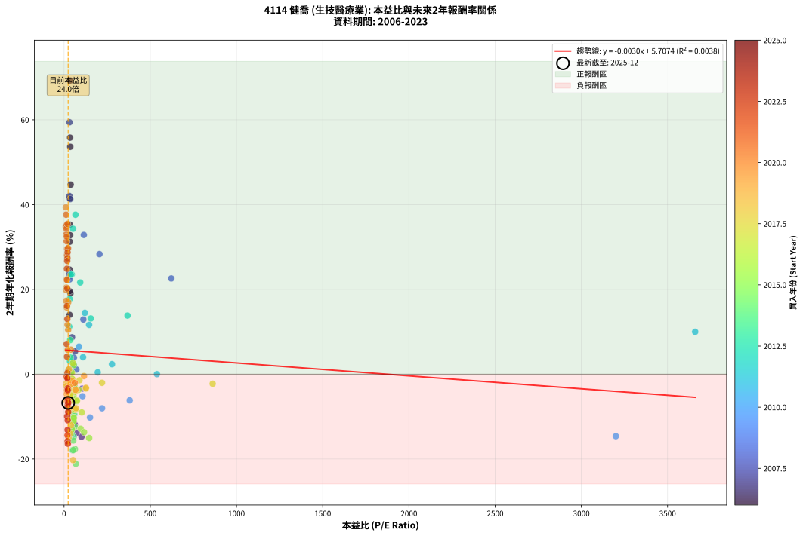
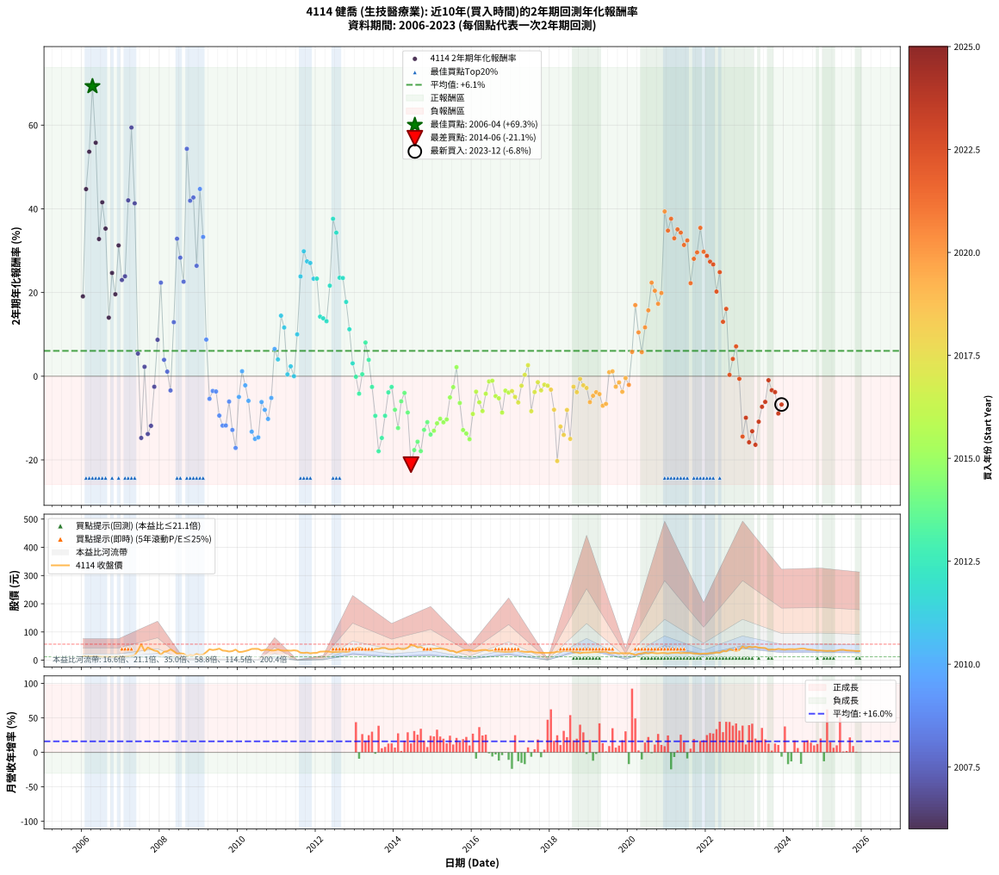

# 4114 健喬 - 本益比與未來報酬率分析

!!! info "報告資訊"
    - **股票代號**: 4114
    - **公司名稱**: 健喬
    - **產業別**: 生技醫療業
    - **分析期間**: 2006-2023 (216 個數據點)
    - **資料來源**: Type 12 (ShowMonthlyK_ChartFlow) 月收盤價與本益比
    - **報酬率口徑**: 含現金股利 (簡化: 年度合計，假設每年7/1入帳)
    - **報告生成時間**: 2026-01-10 21:06:13 CST

## 📈 視覺化圖表

### 圖表1: 本益比 vs 未來報酬率關係

*圖表1：4114 健喬 本益比與2年期未來報酬率關係 (2006-2023)*

### 圖表2: 歷年買入時點的2年期實際報酬率

*圖表2：4114 健喬 歷年買入時點的2年期實際報酬率 (2006-2023)*

## 📍 買點訊號說明

本報告提供兩種買點提示訊號（顯示於圖表2的股價子圖中）：

### ▲ 小綠色三角形（回測驗證）
- **計算方式**: 使用全部歷史資料計算本益比第25百分位數
- **用途**: 事後驗證，顯示歷史上哪些時點確實為低估區
- **限制**: 當下無法判斷，僅供回測參考
- **特性**: 後見之明（Look-Ahead Bias）

### ▲ 小橘色三角形（即時訊號）
- **計算方式**: 使用截至當月的過去5年資料計算本益比第25百分位數
- **用途**: 實際投資決策，當時即可判斷
- **優勢**: 可操作性強，符合實務需求
- **特性**: 無後見之明，滾動窗口計算

!!! tip "如何使用兩種訊號"
    - **綠色▲** 幫助理解歷史估值機會，驗證策略有效性
    - **橘色▲** 可作為實際買進參考，但仍需搭配基本面分析
    - 兩種訊號重疊時，表示即時判斷與事後驗證一致，信心度較高
    - 僅有綠色▲時，表示當時無法判斷（需要未來資料才能確認）
    - 僅有橘色▲時，表示即時判斷為買點，但事後可能不是最佳時機

## 📊 估值分析摘要

| 指標 | 數值 |
|:---:|:---:|
| **目前本益比** (2023-12) | **24.01 倍** |
| **歷史平均本益比** | 99.75 倍 |
| **估值水準** | 🟢 相對低估 |
| **預期2年年化報酬率** | **+5.63%** |
| **歷史平均報酬率** | +6.06% |
| **相關係數 (R²)** | 0.0038 |
| **趨勢線斜率** | -0.0030 |

!!! abstract "核心洞察"
    目前本益比顯著低於歷史平均，預期未來報酬率可能較高

    根據歷史數據回測，4114 健喬 在目前本益比 **24.0倍** 的估值水準下，
    預期未來2年年化報酬率約為 **+5.6%**。

    **重要提醒**: 本分析基於歷史數據統計，實際報酬率會受到公司基本面變化、產業趨勢、
    總體經濟環境等多重因素影響。R² = 0.00 表示本益比可解釋約 0.4% 的報酬率變異。

## 📈 歷史估值統計

### 最佳買點 (最高報酬率)

| 項目 | 數值 |
|:---:|:---:|
| 起始時間 | 2006-04 |
| 當時本益比 | 35.53 倍 |
| 起始價格 | 13.5 元 |
| 2年後價格 | 38.1 元 |
| **2年年化報酬率** | **+69.27%** |

### 最差買點 (最低報酬率)

| 項目 | 數值 |
|:---:|:---:|
| 起始時間 | 2014-06 |
| 當時本益比 | 68.12 倍 |
| 起始價格 | 54.5 元 |
| 2年後價格 | 33.5 元 |
| **2年年化報酬率** | **-21.13%** |

## 🎯 投資啟示

### 本益比與報酬率關係

趨勢線方程式: **y = -0.0030x + 5.7074**

!!! note "負相關"
    本益比與未來報酬率呈現負相關。較低的本益比通常帶來較高的未來報酬率，
    但相關性不算非常強。**估值仍是重要參考指標之一**。

### 估值區間建議

基於歷史數據分析:

- **🟢 低估區** (P/E < 79.8): 預期報酬率較高，可考慮增加持股
- **🟡 合理區** (P/E 79.8-119.7): 預期報酬率符合長期趨勢，正常持有
- **🔴 高估區** (P/E > 119.7): 預期報酬率較低，可考慮減碼或觀望

!!! danger "風險提示"
    - 過去表現不代表未來結果
    - 本分析假設公司基本面無重大結構性變化
    - 產業環境劇變可能使歷史規律失效
    - 應結合公司財報、產業趨勢、總體經濟等多重因素綜合判斷

!!! success "長期投資觀點"
    歷史數據顯示，在合理或低估的估值水準買入並長期持有，
    往往能獲得較佳的投資報酬。**耐心等待好價格**是價值投資的核心原則。

## 📊 數據品質

- **資料來源**: GoodInfo.tw Type 12 (ShowMonthlyK_ChartFlow)
- **資料頻率**: 月度收盤價與本益比
- **回測期間**: 2006-2023
- **數據點數量**: 216 個 (每個點代表一次2年期回測)

### 計算方法說明

1. **2年期年化報酬率**:
   - 對每個歷史時點，計算其後2年的實際投資報酬率
   - 期末價值(不含股利): 期末價格
   - 期末價值(含現金股利): 期末價格 + 持有期間內的現金股利合計 (簡化: 年度合計，假設每年7/1入帳)
   - 公式: 年化報酬率 = [(期末價值/期初價格)^(1/年數) - 1] × 100%

2. **本益比 (P/E Ratio)**:
   - 使用當時的月收盤價與EPS計算
   - 資料來源: Type 12 月度河流圖本益比數據

3. **趨勢線 (Linear Regression)**:
   - 使用最小平方法擬合線性趨勢線
   - R²值衡量本益比對報酬率的解釋能力

---

*本報告由 Stock Analysis System v1.9.0 自動生成*
*數據更新時間: 2026-01-10 21:06:13 CST*

## 📋 月度回測明細表

（每一列對應時間線圖中的一個買入點；可用來對照 SVG 圖上的每個點。）

| 買入月份 | 賣出月份 | 回測期限_年 | 實際持有年數 | 買入本益比_倍 | 買入收盤價_元 | 賣出收盤價_元 | 現金股利合計_元 | 總報酬率_pct | 年化報酬率_pct |
| --- | --- | --- | --- | --- | --- | --- | --- | --- | --- |
| 2006-01 | 2008-01 | 2 | 1.999 | 37.24 | 14.15 | 19.50 | 0.56 | +41.75 | +19.07 |
| 2006-02 | 2008-02 | 2 | 1.999 | 38.42 | 14.60 | 30.00 | 0.56 | +109.30 | +44.71 |
| 2006-03 | 2008-03 | 2 | 2.001 | 36.05 | 13.70 | 31.80 | 0.56 | +136.19 | +53.64 |
| 2006-04 | 2008-04 | 2 | 2.001 | 35.53 | 13.50 | 38.15 | 0.56 | +186.73 | +69.27 |
| 2006-05 | 2008-05 | 2 | 2.001 | 34.74 | 13.20 | 31.50 | 0.56 | +142.86 | +55.79 |
| 2006-06 | 2008-06 | 2 | 2.001 | 35.00 | 13.30 | 22.90 | 0.56 | +76.38 | +32.78 |
| 2006-07 | 2008-07 | 2 | 2.001 | 32.37 | 12.30 | 24.30 | 0.36 | +100.47 | +41.55 |
| 2006-08 | 2008-08 | 2 | 2.001 | 33.29 | 12.65 | 22.80 | 0.36 | +83.07 | +35.27 |
| 2006-09 | 2008-09 | 2 | 2.001 | 32.11 | 12.20 | 15.50 | 0.36 | +29.98 | +14.00 |
| 2006-10 | 2008-10 | 2 | 2.001 | 31.58 | 12.00 | 18.30 | 0.36 | +55.48 | +24.67 |
| 2006-11 | 2008-11 | 2 | 2.001 | 31.84 | 12.10 | 16.95 | 0.36 | +43.04 | +19.59 |
| 2006-12 | 2008-12 | 2 | 2.001 | 33.68 | 12.80 | 21.70 | 0.36 | +72.33 | +31.25 |
| 2007-01 | 2009-01 | 2 | 2.001 | 30.06 | 12.20 | 18.10 | 0.36 | +51.30 | +22.98 |
| 2007-02 | 2009-02 | 2 | 2.001 | 30.12 | 13.00 | 19.60 | 0.36 | +53.52 | +23.89 |
| 2007-03 | 2009-03 | 2 | 2.001 | 31.26 | 14.30 | 28.50 | 0.36 | +101.80 | +42.02 |
| 2007-04 | 2009-04 | 2 | 2.001 | 31.66 | 15.30 | 38.55 | 0.36 | +154.30 | +59.42 |
| 2007-05 | 2009-05 | 2 | 2.001 | 35.84 | 18.25 | 36.10 | 0.36 | +99.77 | +41.31 |
| 2007-06 | 2009-06 | 2 | 2.001 | 64.02 | 34.25 | 37.70 | 0.36 | +11.12 | +5.41 |
| 2007-07 | 2009-07 | 2 | 2.001 | 101.10 | 56.70 | 41.00 | 0.20 | -27.34 | -14.75 |
| 2007-08 | 2009-08 | 2 | 2.001 | 56.08 | 32.90 | 34.20 | 0.20 | +4.56 | +2.25 |
| 2007-09 | 2009-09 | 2 | 2.001 | 73.31 | 44.90 | 33.15 | 0.20 | -25.72 | -13.81 |
| 2007-10 | 2009-10 | 2 | 2.001 | 62.11 | 39.65 | 30.60 | 0.20 | -22.32 | -11.86 |
| 2007-11 | 2009-11 | 2 | 2.001 | 51.42 | 34.15 | 32.25 | 0.20 | -4.98 | -2.52 |
| 2007-12 | 2009-12 | 2 | 2.001 | 46.23 | 31.90 | 37.50 | 0.20 | +18.18 | +8.71 |
| 2008-01 | 2010-01 | 2 | 2.001 | 32.05 | 19.50 | 29.00 | 0.20 | +49.74 | +22.35 |
| 2008-02 | 2010-03 | 2 | 2.081 | 56.96 | 30.00 | 32.30 | 0.20 | +8.33 | +3.92 |
| 2008-03 | 2010-03 | 2 | 1.999 | 71.46 | 31.80 | 32.30 | 0.20 | +2.20 | +1.10 |
| 2008-04 | 2010-04 | 2 | 1.999 | 105.00 | 38.15 | 35.40 | 0.20 | -6.68 | -3.40 |
| 2008-05 | 2010-05 | 2 | 1.999 | 111.80 | 31.50 | 39.95 | 0.20 | +27.46 | +12.91 |
| 2008-06 | 2010-06 | 2 | 1.999 | 114.50 | 22.90 | 40.20 | 0.20 | +76.42 | +32.85 |
| 2008-07 | 2010-07 | 2 | 1.999 | 205.40 | 24.30 | 40.00 | 0.00 | +64.61 | +28.32 |
| 2008-08 | 2010-08 | 2 | 1.999 | 621.80 | 22.80 | 34.25 | 0.00 | +50.22 | +22.58 |
| 2008-09 | 2010-09 | 2 | 1.999 |  | 15.50 | 36.90 | 0.00 | +138.06 | +54.34 |
| 2008-10 | 2010-10 | 2 | 1.999 |  | 18.30 | 36.85 | 0.00 | +101.37 | +41.94 |
| 2008-11 | 2010-11 | 2 | 1.999 |  | 16.95 | 34.50 | 0.00 | +103.54 | +42.70 |
| 2008-12 | 2010-12 | 2 | 1.999 |  | 21.70 | 34.65 | 0.00 | +59.68 | +26.38 |
| 2009-01 | 2011-01 | 2 | 1.999 |  | 18.10 | 37.90 | 0.00 | +109.39 | +44.74 |
| 2009-02 | 2011-02 | 2 | 1.999 |  | 19.60 | 34.80 | 0.00 | +77.55 | +33.27 |
| 2009-03 | 2011-03 | 2 | 1.999 |  | 28.50 | 33.70 | 0.00 | +18.25 | +8.75 |
| 2009-04 | 2011-04 | 2 | 1.999 |  | 38.55 | 34.50 | 0.00 | -10.51 | -5.40 |
| 2009-05 | 2011-05 | 2 | 1.999 |  | 36.10 | 33.60 | 0.00 | -6.93 | -3.53 |
| 2009-06 | 2011-06 | 2 | 1.999 |  | 37.70 | 35.00 | 0.00 | -7.16 | -3.65 |
| 2009-07 | 2011-07 | 2 | 1.999 |  | 41.00 | 33.55 | 0.10 | -17.91 | -9.41 |
| 2009-08 | 2011-08 | 2 | 1.999 |  | 34.20 | 26.50 | 0.10 | -22.21 | -11.81 |
| 2009-09 | 2011-09 | 2 | 1.999 |  | 33.15 | 25.70 | 0.10 | -22.16 | -11.78 |
| 2009-10 | 2011-10 | 2 | 1.999 |  | 30.60 | 26.90 | 0.10 | -11.75 | -6.06 |
| 2009-11 | 2011-11 | 2 | 1.999 |  | 32.25 | 24.40 | 0.10 | -24.02 | -12.84 |
| 2009-12 | 2011-12 | 2 | 1.999 |  | 37.50 | 25.65 | 0.10 | -31.32 | -17.14 |
| 2010-01 | 2012-01 | 2 | 1.999 |  | 29.00 | 26.10 | 0.10 | -9.64 | -4.94 |
| 2010-02 | 2012-02 | 2 | 1.999 |  | 29.65 | 30.25 | 0.10 | +2.38 | +1.18 |
| 2010-03 | 2012-03 | 2 | 2.001 |  | 32.30 | 30.80 | 0.10 | -4.32 | -2.18 |
| 2010-04 | 2012-04 | 2 | 2.001 |  | 35.40 | 31.25 | 0.10 | -11.43 | -5.88 |
| 2010-05 | 2012-05 | 2 | 2.001 |  | 39.95 | 29.95 | 0.10 | -24.77 | -13.26 |
| 2010-06 | 2012-06 | 2 | 2.001 |  | 40.20 | 28.95 | 0.10 | -27.72 | -14.98 |
| 2010-07 | 2012-07 | 2 | 2.001 | 3200.00 | 40.00 | 28.95 | 0.21 | -27.11 | -14.62 |
| 2010-08 | 2012-08 | 2 | 2.001 | 380.60 | 34.25 | 29.95 | 0.21 | -11.96 | -6.16 |
| 2010-09 | 2012-09 | 2 | 2.001 | 220.30 | 36.90 | 31.00 | 0.21 | -15.43 | -8.03 |
| 2010-10 | 2012-10 | 2 | 2.001 | 150.40 | 36.85 | 29.50 | 0.21 | -19.39 | -10.21 |
| 2010-11 | 2012-11 | 2 | 2.001 | 107.00 | 34.50 | 30.80 | 0.21 | -10.13 | -5.20 |
| 2010-12 | 2012-12 | 2 | 2.001 | 86.62 | 34.65 | 39.10 | 0.21 | +13.43 | +6.50 |
| 2011-01 | 2013-01 | 2 | 2.001 | 110.10 | 37.90 | 40.80 | 0.21 | +8.19 | +4.01 |
| 2011-02 | 2013-02 | 2 | 2.001 | 120.70 | 34.80 | 45.40 | 0.21 | +31.05 | +14.47 |
| 2011-03 | 2013-03 | 2 | 2.001 | 145.00 | 33.70 | 41.80 | 0.21 | +24.64 | +11.64 |
| 2011-04 | 2013-04 | 2 | 2.001 | 195.30 | 34.50 | 34.60 | 0.21 | +0.88 | +0.44 |
| 2011-05 | 2013-05 | 2 | 2.001 | 278.10 | 33.60 | 35.00 | 0.21 | +4.78 | +2.36 |
| 2011-06 | 2013-06 | 2 | 2.001 | 538.50 | 35.00 | 34.80 | 0.21 | +0.01 | +0.01 |
| 2011-07 | 2013-07 | 2 | 2.001 | 3660.00 | 33.55 | 40.30 | 0.30 | +21.02 | +10.00 |
| 2011-08 | 2013-08 | 2 | 2.001 |  | 26.50 | 40.35 | 0.30 | +53.40 | +23.84 |
| 2011-09 | 2013-09 | 2 | 2.001 |  | 25.70 | 43.05 | 0.30 | +68.68 | +29.86 |
| 2011-10 | 2013-10 | 2 | 2.001 |  | 26.90 | 43.40 | 0.30 | +62.46 | +27.44 |
| 2011-11 | 2013-11 | 2 | 2.001 |  | 24.40 | 39.10 | 0.30 | +61.48 | +27.06 |
| 2011-12 | 2013-12 | 2 | 2.001 |  | 25.65 | 38.70 | 0.30 | +52.05 | +23.29 |
| 2012-01 | 2014-01 | 2 | 2.001 |  | 26.10 | 39.40 | 0.30 | +52.11 | +23.32 |
| 2012-02 | 2014-03 | 2 | 2.081 |  | 30.25 | 39.60 | 0.30 | +31.91 | +14.24 |
| 2012-03 | 2014-03 | 2 | 1.999 | 368.00 | 30.80 | 39.60 | 0.30 | +29.55 | +13.83 |
| 2012-04 | 2014-04 | 2 | 1.999 | 155.00 | 31.25 | 39.70 | 0.30 | +28.01 | +13.15 |
| 2012-05 | 2014-05 | 2 | 1.999 | 93.74 | 29.95 | 44.00 | 0.30 | +47.92 | +21.64 |
| 2012-06 | 2014-06 | 2 | 1.999 | 66.19 | 28.95 | 54.50 | 0.30 | +89.30 | +37.62 |
| 2012-07 | 2014-07 | 2 | 1.999 | 52.14 | 28.95 | 51.80 | 0.39 | +80.28 | +34.30 |
| 2012-08 | 2014-08 | 2 | 1.999 | 44.49 | 29.95 | 45.30 | 0.39 | +52.56 | +23.53 |
| 2012-09 | 2014-09 | 2 | 1.999 | 39.19 | 31.00 | 46.85 | 0.39 | +52.39 | +23.47 |
| 2012-10 | 2014-10 | 2 | 1.999 | 32.45 | 29.50 | 40.50 | 0.39 | +38.62 | +17.75 |
| 2012-11 | 2014-11 | 2 | 1.999 | 29.99 | 30.80 | 37.70 | 0.39 | +23.68 | +11.22 |
| 2012-12 | 2014-12 | 2 | 1.999 | 34.16 | 39.10 | 41.15 | 0.39 | +6.25 | +3.08 |
| 2013-01 | 2015-01 | 2 | 1.999 | 36.97 | 40.80 | 40.30 | 0.39 | -0.26 | -0.13 |
| 2013-02 | 2015-02 | 2 | 1.999 | 42.74 | 45.40 | 41.30 | 0.39 | -8.17 | -4.17 |
| 2013-03 | 2015-03 | 2 | 1.999 | 40.94 | 41.80 | 41.80 | 0.39 | +0.94 | +0.47 |
| 2013-04 | 2015-04 | 2 | 1.999 | 35.31 | 34.60 | 40.00 | 0.39 | +16.74 | +8.05 |
| 2013-05 | 2015-05 | 2 | 1.999 | 37.29 | 35.00 | 37.40 | 0.39 | +7.98 | +3.91 |
| 2013-06 | 2015-06 | 2 | 1.999 | 38.78 | 34.80 | 32.65 | 0.39 | -5.05 | -2.56 |
| 2013-07 | 2015-07 | 2 | 1.999 | 47.07 | 40.30 | 32.65 | 0.39 | -18.01 | -9.46 |
| 2013-08 | 2015-08 | 2 | 1.999 | 49.51 | 40.35 | 26.80 | 0.39 | -32.61 | -17.92 |
| 2013-09 | 2015-09 | 2 | 1.999 | 55.64 | 43.05 | 30.90 | 0.39 | -27.32 | -14.76 |
| 2013-10 | 2015-10 | 2 | 1.999 | 59.25 | 43.40 | 35.20 | 0.39 | -18.00 | -9.45 |
| 2013-11 | 2015-11 | 2 | 1.999 | 56.57 | 39.10 | 35.75 | 0.39 | -7.57 | -3.86 |
| 2013-12 | 2015-12 | 2 | 1.999 | 59.54 | 38.70 | 36.35 | 0.39 | -5.06 | -2.57 |
| 2014-01 | 2016-01 | 2 | 1.999 | 58.37 | 39.40 | 32.95 | 0.39 | -15.38 | -8.02 |
| 2014-02 | 2016-02 | 2 | 1.999 | 61.93 | 43.35 | 32.90 | 0.39 | -23.21 | -12.38 |
| 2014-03 | 2016-03 | 2 | 2.001 | 54.62 | 39.60 | 34.60 | 0.39 | -11.64 | -6.00 |
| 2014-04 | 2016-04 | 2 | 2.001 | 52.93 | 39.70 | 36.20 | 0.39 | -7.83 | -3.99 |
| 2014-05 | 2016-05 | 2 | 2.001 | 56.77 | 44.00 | 36.30 | 0.39 | -16.61 | -8.68 |
| 2014-06 | 2016-06 | 2 | 2.001 | 68.12 | 54.50 | 33.50 | 0.39 | -37.82 | -21.13 |
| 2014-07 | 2016-07 | 2 | 2.001 | 62.79 | 51.80 | 34.75 | 0.37 | -32.19 | -17.65 |
| 2014-08 | 2016-08 | 2 | 2.001 | 53.29 | 45.30 | 31.85 | 0.37 | -28.87 | -15.65 |
| 2014-09 | 2016-09 | 2 | 2.001 | 53.54 | 46.85 | 31.20 | 0.37 | -32.61 | -17.90 |
| 2014-10 | 2016-10 | 2 | 2.001 | 45.00 | 40.50 | 30.40 | 0.37 | -24.02 | -12.82 |
| 2014-11 | 2016-11 | 2 | 2.001 | 40.76 | 37.70 | 29.50 | 0.37 | -20.76 | -10.98 |
| 2014-12 | 2016-12 | 2 | 2.001 | 43.32 | 41.15 | 30.10 | 0.37 | -25.95 | -13.94 |
| 2015-01 | 2017-01 | 2 | 2.001 | 45.20 | 40.30 | 30.10 | 0.37 | -24.38 | -13.03 |
| 2015-02 | 2017-02 | 2 | 2.001 | 49.56 | 41.30 | 32.15 | 0.37 | -21.25 | -11.25 |
| 2015-03 | 2017-03 | 2 | 2.001 | 53.94 | 41.80 | 33.35 | 0.37 | -19.32 | -10.17 |
| 2015-04 | 2017-04 | 2 | 2.001 | 55.81 | 40.00 | 31.30 | 0.37 | -20.82 | -11.01 |
| 2015-05 | 2017-05 | 2 | 2.001 | 56.81 | 37.40 | 29.70 | 0.37 | -19.59 | -10.32 |
| 2015-06 | 2017-06 | 2 | 2.001 | 54.42 | 32.65 | 29.05 | 0.37 | -9.88 | -5.07 |
| 2015-07 | 2017-07 | 2 | 2.001 | 60.28 | 32.65 | 30.60 | 0.37 | -5.14 | -2.60 |
| 2015-08 | 2017-08 | 2 | 2.001 | 55.45 | 26.80 | 27.60 | 0.37 | +4.38 | +2.16 |
| 2015-09 | 2017-09 | 2 | 2.001 | 72.71 | 30.90 | 26.70 | 0.37 | -12.39 | -6.39 |
| 2015-10 | 2017-10 | 2 | 2.001 | 96.00 | 35.20 | 26.35 | 0.37 | -24.08 | -12.86 |
| 2015-11 | 2017-11 | 2 | 2.001 | 116.00 | 35.75 | 26.25 | 0.37 | -25.53 | -13.70 |
| 2015-12 | 2017-12 | 2 | 2.001 | 145.40 | 36.35 | 25.85 | 0.37 | -27.86 | -15.06 |
| 2016-01 | 2018-01 | 2 | 2.001 | 102.70 | 32.95 | 26.90 | 0.37 | -17.23 | -9.02 |
| 2016-02 | 2018-03 | 2 | 2.081 | 83.96 | 32.90 | 30.05 | 0.37 | -7.53 | -3.69 |
| 2016-03 | 2018-03 | 2 | 1.999 | 74.76 | 34.60 | 30.05 | 0.37 | -12.07 | -6.23 |
| 2016-04 | 2018-04 | 2 | 1.999 | 67.83 | 36.20 | 30.05 | 0.37 | -15.96 | -8.33 |
| 2016-05 | 2018-05 | 2 | 1.999 | 60.03 | 36.30 | 32.95 | 0.37 | -8.20 | -4.19 |
| 2016-06 | 2018-06 | 2 | 1.999 | 49.59 | 33.50 | 32.30 | 0.37 | -2.47 | -1.24 |
| 2016-07 | 2018-07 | 2 | 1.999 | 46.55 | 34.75 | 33.60 | 0.40 | -2.16 | -1.09 |
| 2016-08 | 2018-08 | 2 | 1.999 | 38.96 | 31.85 | 28.50 | 0.40 | -9.26 | -4.75 |
| 2016-09 | 2018-09 | 2 | 1.999 | 35.12 | 31.20 | 27.60 | 0.40 | -10.26 | -5.27 |
| 2016-10 | 2018-10 | 2 | 1.999 | 31.69 | 30.40 | 24.95 | 0.40 | -16.61 | -8.69 |
| 2016-11 | 2018-11 | 2 | 1.999 | 28.63 | 29.50 | 27.10 | 0.40 | -6.78 | -3.45 |
| 2016-12 | 2018-12 | 2 | 1.999 | 27.33 | 30.10 | 27.40 | 0.40 | -7.64 | -3.90 |
| 2017-01 | 2019-01 | 2 | 1.999 | 29.75 | 30.10 | 27.60 | 0.40 | -6.98 | -3.55 |
| 2017-02 | 2019-02 | 2 | 1.999 | 34.85 | 32.15 | 28.65 | 0.40 | -9.64 | -4.95 |
| 2017-03 | 2019-03 | 2 | 1.999 | 40.02 | 33.35 | 28.90 | 0.40 | -12.14 | -6.27 |
| 2017-04 | 2019-04 | 2 | 1.999 | 42.06 | 31.30 | 29.50 | 0.40 | -4.47 | -2.26 |
| 2017-05 | 2019-05 | 2 | 1.999 | 45.35 | 29.70 | 29.50 | 0.40 | +0.67 | +0.34 |
| 2017-06 | 2019-06 | 2 | 1.999 | 51.36 | 29.05 | 30.20 | 0.40 | +5.34 | +2.63 |
| 2017-07 | 2019-07 | 2 | 1.999 | 64.24 | 30.60 | 25.30 | 0.40 | -16.02 | -8.36 |
| 2017-08 | 2019-08 | 2 | 1.999 | 71.31 | 27.60 | 25.15 | 0.40 | -7.43 | -3.79 |
| 2017-09 | 2019-09 | 2 | 1.999 | 89.66 | 26.70 | 25.55 | 0.40 | -2.81 | -1.42 |
| 2017-10 | 2019-10 | 2 | 1.999 | 126.40 | 26.35 | 24.20 | 0.40 | -6.65 | -3.38 |
| 2017-11 | 2019-11 | 2 | 1.999 | 220.10 | 26.25 | 24.80 | 0.40 | -4.00 | -2.02 |
| 2017-12 | 2019-12 | 2 | 1.999 | 861.70 | 25.85 | 24.30 | 0.40 | -4.45 | -2.25 |
| 2018-01 | 2020-01 | 2 | 1.999 | 127.10 | 26.90 | 24.80 | 0.40 | -6.32 | -3.22 |
| 2018-02 | 2020-02 | 2 | 1.999 | 69.53 | 27.35 | 22.75 | 0.40 | -15.36 | -8.01 |
| 2018-03 | 2020-03 | 2 | 2.001 | 52.26 | 30.05 | 18.70 | 0.40 | -36.44 | -20.26 |
| 2018-04 | 2020-04 | 2 | 2.001 | 39.71 | 30.05 | 22.85 | 0.40 | -22.63 | -12.03 |
| 2018-05 | 2020-05 | 2 | 2.001 | 35.12 | 32.95 | 23.95 | 0.40 | -26.10 | -14.03 |
| 2018-06 | 2020-06 | 2 | 2.001 | 28.84 | 32.30 | 26.90 | 0.40 | -15.48 | -8.06 |
| 2018-07 | 2020-07 | 2 | 2.001 | 25.81 | 33.60 | 23.90 | 0.38 | -27.73 | -14.98 |
| 2018-08 | 2020-08 | 2 | 2.001 | 19.21 | 28.50 | 26.70 | 0.38 | -4.97 | -2.52 |
| 2018-09 | 2020-09 | 2 | 2.001 | 16.58 | 27.60 | 25.15 | 0.38 | -7.49 | -3.81 |
| 2018-10 | 2020-10 | 2 | 2.001 | 13.51 | 24.95 | 24.25 | 0.38 | -1.27 | -0.64 |
| 2018-11 | 2020-11 | 2 | 2.001 | 13.36 | 27.10 | 25.55 | 0.38 | -4.31 | -2.18 |
| 2018-12 | 2020-12 | 2 | 2.001 | 12.40 | 27.40 | 25.50 | 0.38 | -5.54 | -2.81 |
| 2019-01 | 2021-01 | 2 | 2.001 | 13.51 | 27.60 | 23.90 | 0.38 | -12.02 | -6.20 |
| 2019-02 | 2021-02 | 2 | 2.001 | 15.27 | 28.65 | 25.65 | 0.38 | -9.13 | -4.67 |
| 2019-03 | 2021-03 | 2 | 2.001 | 16.90 | 28.90 | 26.35 | 0.38 | -7.50 | -3.82 |
| 2019-04 | 2021-04 | 2 | 2.001 | 19.11 | 29.50 | 26.65 | 0.38 | -8.36 | -4.27 |
| 2019-05 | 2021-05 | 2 | 2.001 | 21.43 | 29.50 | 25.10 | 0.38 | -13.62 | -7.05 |
| 2019-06 | 2021-06 | 2 | 2.001 | 24.96 | 30.20 | 25.95 | 0.38 | -12.80 | -6.62 |
| 2019-07 | 2021-07 | 2 | 2.001 | 24.25 | 25.30 | 25.30 | 0.49 | +1.92 | +0.96 |
| 2019-08 | 2021-08 | 2 | 2.001 | 28.69 | 25.15 | 25.25 | 0.49 | +2.33 | +1.16 |
| 2019-09 | 2021-09 | 2 | 2.001 | 35.99 | 25.55 | 23.80 | 0.49 | -4.95 | -2.50 |
| 2019-10 | 2021-10 | 2 | 2.001 | 44.54 | 24.20 | 23.00 | 0.49 | -2.95 | -1.49 |
| 2019-11 | 2021-11 | 2 | 2.001 | 65.84 | 24.80 | 22.50 | 0.49 | -7.31 | -3.72 |
| 2019-12 | 2021-12 | 2 | 2.001 | 115.70 | 24.30 | 23.60 | 0.49 | -0.88 | -0.44 |
| 2020-01 | 2022-01 | 2 | 2.001 | 62.39 | 24.80 | 23.30 | 0.49 | -4.09 | -2.06 |
| 2020-02 | 2022-03 | 2 | 2.081 | 38.89 | 22.75 | 25.10 | 0.49 | +12.47 | +5.81 |
| 2020-03 | 2022-03 | 2 | 1.999 | 24.21 | 18.70 | 25.10 | 0.49 | +36.82 | +16.98 |
| 2020-04 | 2022-04 | 2 | 1.999 | 23.80 | 22.85 | 27.40 | 0.49 | +22.04 | +10.48 |
| 2020-05 | 2022-05 | 2 | 1.999 | 20.87 | 23.95 | 26.30 | 0.49 | +11.84 | +5.76 |
| 2020-06 | 2022-06 | 2 | 1.999 | 20.15 | 26.90 | 33.05 | 0.49 | +24.67 | +11.66 |
| 2020-07 | 2022-07 | 2 | 1.999 | 15.70 | 23.90 | 31.20 | 0.81 | +33.93 | +15.74 |
| 2020-08 | 2022-08 | 2 | 1.999 | 15.61 | 26.70 | 39.15 | 0.81 | +49.66 | +22.35 |
| 2020-09 | 2022-09 | 2 | 1.999 | 13.25 | 25.15 | 35.65 | 0.81 | +44.97 | +20.42 |
| 2020-10 | 2022-10 | 2 | 1.999 | 11.63 | 24.25 | 32.55 | 0.81 | +37.56 | +17.30 |
| 2020-11 | 2022-11 | 2 | 1.999 | 11.24 | 25.55 | 35.90 | 0.81 | +43.68 | +19.88 |
| 2020-12 | 2022-12 | 2 | 1.999 | 10.37 | 25.50 | 48.70 | 0.81 | +94.15 | +39.37 |
| 2021-01 | 2023-01 | 2 | 1.999 | 10.21 | 23.90 | 42.60 | 0.81 | +81.63 | +34.80 |
| 2021-02 | 2023-02 | 2 | 1.999 | 11.55 | 25.65 | 47.75 | 0.81 | +89.31 | +37.62 |
| 2021-03 | 2023-03 | 2 | 1.999 | 12.55 | 26.35 | 45.75 | 0.81 | +76.69 | +32.95 |
| 2021-04 | 2023-04 | 2 | 1.999 | 13.46 | 26.65 | 47.80 | 0.81 | +82.40 | +35.08 |
| 2021-05 | 2023-05 | 2 | 1.999 | 13.49 | 25.10 | 44.45 | 0.81 | +80.31 | +34.31 |
| 2021-06 | 2023-06 | 2 | 1.999 | 14.91 | 25.95 | 43.95 | 0.81 | +72.48 | +31.36 |
| 2021-07 | 2023-07 | 2 | 1.999 | 15.62 | 25.30 | 43.30 | 1.06 | +75.35 | +32.45 |
| 2021-08 | 2023-08 | 2 | 1.999 | 16.83 | 25.25 | 36.65 | 1.06 | +49.36 | +22.23 |
| 2021-09 | 2023-09 | 2 | 1.999 | 17.25 | 23.80 | 37.95 | 1.06 | +63.92 | +28.05 |
| 2021-10 | 2023-10 | 2 | 1.999 | 18.25 | 23.00 | 37.55 | 1.06 | +67.89 | +29.59 |
| 2021-11 | 2023-11 | 2 | 1.999 | 19.74 | 22.50 | 40.20 | 1.06 | +83.40 | +35.45 |
| 2021-12 | 2023-12 | 2 | 1.999 | 23.14 | 23.60 | 38.65 | 1.06 | +68.28 | +29.75 |
| 2022-01 | 2024-01 | 2 | 1.999 | 20.44 | 23.30 | 37.55 | 1.06 | +65.73 | +28.76 |
| 2022-02 | 2024-02 | 2 | 1.999 | 19.60 | 24.70 | 39.00 | 1.06 | +62.20 | +27.38 |
| 2022-03 | 2024-03 | 2 | 2.001 | 18.19 | 25.10 | 39.25 | 1.06 | +60.61 | +26.71 |
| 2022-04 | 2024-04 | 2 | 2.001 | 18.27 | 27.40 | 38.55 | 1.06 | +44.58 | +20.22 |
| 2022-05 | 2024-05 | 2 | 2.001 | 16.23 | 26.30 | 39.95 | 1.06 | +55.95 | +24.86 |
| 2022-06 | 2024-06 | 2 | 2.001 | 18.99 | 33.05 | 41.15 | 1.06 | +27.73 | +13.01 |
| 2022-07 | 2024-07 | 2 | 2.001 | 16.77 | 31.20 | 40.90 | 1.16 | +34.80 | +16.09 |
| 2022-08 | 2024-08 | 2 | 2.001 | 19.77 | 39.15 | 38.25 | 1.16 | +0.66 | +0.33 |
| 2022-09 | 2024-09 | 2 | 2.001 | 16.98 | 35.65 | 37.50 | 1.16 | +8.43 | +4.13 |
| 2022-10 | 2024-10 | 2 | 2.001 | 14.66 | 32.55 | 36.20 | 1.16 | +14.77 | +7.12 |
| 2022-11 | 2024-11 | 2 | 2.001 | 15.34 | 35.90 | 34.30 | 1.16 | -1.23 | -0.62 |
| 2022-12 | 2024-12 | 2 | 2.001 | 19.80 | 48.70 | 34.50 | 1.16 | -26.78 | -14.42 |
| 2023-01 | 2025-01 | 2 | 2.001 | 17.83 | 42.60 | 33.40 | 1.16 | -18.88 | -9.93 |
| 2023-02 | 2025-02 | 2 | 2.001 | 20.60 | 47.75 | 32.70 | 1.16 | -29.10 | -15.79 |
| 2023-03 | 2025-03 | 2 | 2.001 | 20.36 | 45.75 | 33.35 | 1.16 | -24.57 | -13.14 |
| 2023-04 | 2025-04 | 2 | 2.001 | 21.96 | 47.80 | 32.25 | 1.16 | -30.11 | -16.39 |
| 2023-05 | 2025-05 | 2 | 2.001 | 21.11 | 44.45 | 34.15 | 1.16 | -20.57 | -10.87 |
| 2023-06 | 2025-06 | 2 | 2.001 | 21.60 | 43.95 | 36.60 | 1.16 | -14.09 | -7.31 |
| 2023-07 | 2025-07 | 2 | 2.001 | 22.04 | 43.30 | 36.95 | 1.20 | -11.90 | -6.13 |
| 2023-08 | 2025-08 | 2 | 2.001 | 19.36 | 36.65 | 34.75 | 1.20 | -1.91 | -0.96 |
| 2023-09 | 2025-09 | 2 | 2.001 | 20.82 | 37.95 | 34.25 | 1.20 | -6.59 | -3.35 |
| 2023-10 | 2025-10 | 2 | 2.001 | 21.44 | 37.55 | 33.55 | 1.20 | -7.46 | -3.80 |
| 2023-11 | 2025-11 | 2 | 2.001 | 23.92 | 40.20 | 32.15 | 1.20 | -17.04 | -8.91 |
| 2023-12 | 2025-12 | 2 | 2.001 | 24.01 | 38.65 | 32.40 | 1.20 | -13.07 | -6.76 |
