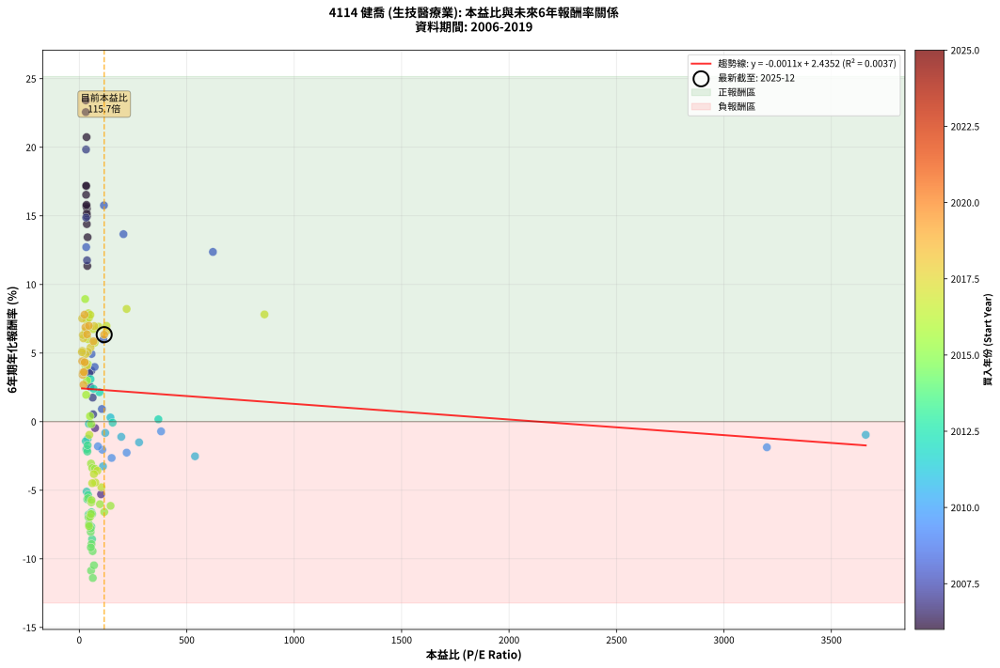
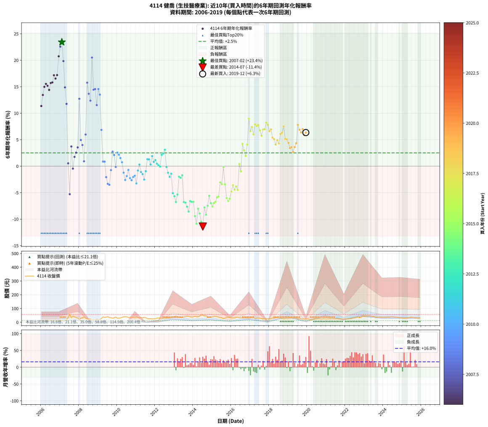

# 4114 健喬 - 本益比與未來報酬率分析

!!! info "報告資訊"
    - **股票代號**: 4114
    - **公司名稱**: 健喬
    - **產業別**: 生技醫療業
    - **分析期間**: 2006-2019 (168 個數據點)
    - **資料來源**: Type 12 (ShowMonthlyK_ChartFlow) 月收盤價與本益比
    - **報酬率口徑**: 含現金股利 (簡化: 年度合計，假設每年7/1入帳)
    - **報告生成時間**: 2026-01-06 18:59:15 CST

## 📈 視覺化圖表

### 圖表1: 本益比 vs 未來報酬率關係

*圖表1：4114 健喬 本益比與6年期未來報酬率關係 (2006-2019)*

### 圖表2: 歷年買入時點的6年期實際報酬率

*圖表2：4114 健喬 歷年買入時點的6年期實際報酬率 (2006-2019)*

## 📍 買點訊號說明

本報告提供兩種買點提示訊號（顯示於圖表2的股價子圖中）：

### ▲ 小綠色三角形（回測驗證）
- **計算方式**: 使用全部歷史資料計算本益比第25百分位數
- **用途**: 事後驗證，顯示歷史上哪些時點確實為低估區
- **限制**: 當下無法判斷，僅供回測參考
- **特性**: 後見之明（Look-Ahead Bias）

### ▲ 小橘色三角形（即時訊號）
- **計算方式**: 使用截至當月的過去5年資料計算本益比第25百分位數
- **用途**: 實際投資決策，當時即可判斷
- **優勢**: 可操作性強，符合實務需求
- **特性**: 無後見之明，滾動窗口計算

!!! tip "如何使用兩種訊號"
    - **綠色▲** 幫助理解歷史估值機會，驗證策略有效性
    - **橘色▲** 可作為實際買進參考，但仍需搭配基本面分析
    - 兩種訊號重疊時，表示即時判斷與事後驗證一致，信心度較高
    - 僅有綠色▲時，表示當時無法判斷（需要未來資料才能確認）
    - 僅有橘色▲時，表示即時判斷為買點，但事後可能不是最佳時機

## 📊 估值分析摘要

| 指標 | 數值 |
|:---:|:---:|
| **目前本益比** (2019-12) | **115.70 倍** |
| **歷史平均本益比** | 127.54 倍 |
| **估值水準** | 🟡 合理範圍 |
| **預期6年年化報酬率** | **+2.30%** |
| **歷史平均報酬率** | +2.51% |
| **相關係數 (R²)** | 0.0037 |
| **趨勢線斜率** | -0.0011 |

!!! abstract "核心洞察"
    目前本益比接近歷史平均，預期報酬率符合長期趨勢

    根據歷史數據回測，4114 健喬 在目前本益比 **115.7倍** 的估值水準下，
    預期未來6年年化報酬率約為 **+2.3%**。

    **重要提醒**: 本分析基於歷史數據統計，實際報酬率會受到公司基本面變化、產業趨勢、
    總體經濟環境等多重因素影響。R² = 0.00 表示本益比可解釋約 0.4% 的報酬率變異。

## 📈 歷史估值統計

### 最佳買點 (最高報酬率)

| 項目 | 數值 |
|:---:|:---:|
| 起始時間 | 2007-02 |
| 當時本益比 | 30.12 倍 |
| 起始價格 | 13.0 元 |
| 6年後價格 | 45.4 元 |
| **6年年化報酬率** | **+23.42%** |

### 最差買點 (最低報酬率)

| 項目 | 數值 |
|:---:|:---:|
| 起始時間 | 2014-07 |
| 當時本益比 | 62.79 倍 |
| 起始價格 | 51.8 元 |
| 6年後價格 | 23.9 元 |
| **6年年化報酬率** | **-11.40%** |

## 🎯 投資啟示

### 本益比與報酬率關係

趨勢線方程式: **y = -0.0011x + 2.4352**

!!! note "負相關"
    本益比與未來報酬率呈現負相關。較低的本益比通常帶來較高的未來報酬率，
    但相關性不算非常強。**估值仍是重要參考指標之一**。

### 估值區間建議

基於歷史數據分析:

- **🟢 低估區** (P/E < 102.0): 預期報酬率較高，可考慮增加持股
- **🟡 合理區** (P/E 102.0-153.0): 預期報酬率符合長期趨勢，正常持有
- **🔴 高估區** (P/E > 153.0): 預期報酬率較低，可考慮減碼或觀望

!!! danger "風險提示"
    - 過去表現不代表未來結果
    - 本分析假設公司基本面無重大結構性變化
    - 產業環境劇變可能使歷史規律失效
    - 應結合公司財報、產業趨勢、總體經濟等多重因素綜合判斷

!!! success "長期投資觀點"
    歷史數據顯示，在合理或低估的估值水準買入並長期持有，
    往往能獲得較佳的投資報酬。**耐心等待好價格**是價值投資的核心原則。

## 📊 數據品質

- **資料來源**: GoodInfo.tw Type 12 (ShowMonthlyK_ChartFlow)
- **資料頻率**: 月度收盤價與本益比
- **回測期間**: 2006-2019
- **數據點數量**: 168 個 (每個點代表一次6年期回測)

### 計算方法說明

1. **6年期年化報酬率**:
   - 對每個歷史時點，計算其後6年的實際投資報酬率
   - 期末價值(不含股利): 期末價格
   - 期末價值(含現金股利): 期末價格 + 持有期間內的現金股利合計 (簡化: 年度合計，假設每年7/1入帳)
   - 公式: 年化報酬率 = [(期末價值/期初價格)^(1/年數) - 1] × 100%

2. **本益比 (P/E Ratio)**:
   - 使用當時的月收盤價與EPS計算
   - 資料來源: Type 12 月度河流圖本益比數據

3. **趨勢線 (Linear Regression)**:
   - 使用最小平方法擬合線性趨勢線
   - R²值衡量本益比對報酬率的解釋能力

---

*本報告由 Stock Analysis System v1.9.0 自動生成*
*數據更新時間: 2026-01-06 18:59:15 CST*

## 📋 月度回測明細表

（每一列對應時間線圖中的一個買入點；可用來對照 SVG 圖上的每個點。）

| 買入月份 | 賣出月份 | 回測期限_年 | 實際持有年數 | 買入本益比_倍 | 買入收盤價_元 | 賣出收盤價_元 | 現金股利合計_元 | 總報酬率_pct | 年化報酬率_pct |
| --- | --- | --- | --- | --- | --- | --- | --- | --- | --- |
| 2006-01 | 2012-01 | 6 | 5.999 | 37.24 | 14.15 | 26.10 | 0.86 | +90.55 | +11.35 |
| 2006-02 | 2012-02 | 6 | 5.999 | 38.42 | 14.60 | 30.25 | 0.86 | +113.10 | +13.44 |
| 2006-03 | 2012-03 | 6 | 6.001 | 36.05 | 13.70 | 30.80 | 0.86 | +131.12 | +14.98 |
| 2006-04 | 2012-04 | 6 | 6.001 | 35.53 | 13.50 | 31.25 | 0.86 | +137.87 | +15.53 |
| 2006-05 | 2012-05 | 6 | 6.001 | 34.74 | 13.20 | 29.95 | 0.86 | +133.43 | +15.17 |
| 2006-06 | 2012-06 | 6 | 6.001 | 35.00 | 13.30 | 28.95 | 0.86 | +124.16 | +14.40 |
| 2006-07 | 2012-07 | 6 | 6.001 | 32.37 | 12.30 | 28.95 | 0.56 | +139.94 | +15.70 |
| 2006-08 | 2012-08 | 6 | 6.001 | 33.29 | 12.65 | 29.95 | 0.56 | +141.21 | +15.80 |
| 2006-09 | 2012-09 | 6 | 6.001 | 32.11 | 12.20 | 31.00 | 0.56 | +158.71 | +17.16 |
| 2006-10 | 2012-10 | 6 | 6.001 | 31.58 | 12.00 | 29.50 | 0.56 | +150.53 | +16.54 |
| 2006-11 | 2012-11 | 6 | 6.001 | 31.84 | 12.10 | 30.80 | 0.56 | +159.20 | +17.20 |
| 2006-12 | 2012-12 | 6 | 6.001 | 33.68 | 12.80 | 39.10 | 0.56 | +209.87 | +20.74 |
| 2007-01 | 2013-01 | 6 | 6.001 | 30.06 | 12.20 | 40.80 | 0.56 | +239.04 | +22.56 |
| 2007-02 | 2013-02 | 6 | 6.001 | 30.12 | 13.00 | 45.40 | 0.56 | +253.56 | +23.42 |
| 2007-03 | 2013-03 | 6 | 6.001 | 31.26 | 14.30 | 41.80 | 0.56 | +196.24 | +19.84 |
| 2007-04 | 2013-04 | 6 | 6.001 | 31.66 | 15.30 | 34.60 | 0.56 | +129.82 | +14.87 |
| 2007-05 | 2013-05 | 6 | 6.001 | 35.84 | 18.25 | 35.00 | 0.56 | +94.87 | +11.76 |
| 2007-06 | 2013-06 | 6 | 6.001 | 64.02 | 34.25 | 34.80 | 0.56 | +3.25 | +0.53 |
| 2007-07 | 2013-07 | 6 | 6.001 | 101.10 | 56.70 | 40.30 | 0.61 | -27.85 | -5.29 |
| 2007-08 | 2013-08 | 6 | 6.001 | 56.08 | 32.90 | 40.35 | 0.61 | +24.49 | +3.72 |
| 2007-09 | 2013-09 | 6 | 6.001 | 73.31 | 44.90 | 43.05 | 0.61 | -2.77 | -0.47 |
| 2007-10 | 2013-10 | 6 | 6.001 | 62.11 | 39.65 | 43.40 | 0.61 | +10.99 | +1.75 |
| 2007-11 | 2013-11 | 6 | 6.001 | 51.42 | 34.15 | 39.10 | 0.61 | +16.27 | +2.54 |
| 2007-12 | 2013-12 | 6 | 6.001 | 46.23 | 31.90 | 38.70 | 0.61 | +23.22 | +3.54 |
| 2008-01 | 2014-01 | 6 | 6.001 | 32.05 | 19.50 | 39.40 | 0.61 | +105.16 | +12.72 |
| 2008-02 | 2014-03 | 6 | 6.081 | 56.96 | 30.00 | 39.60 | 0.61 | +34.02 | +4.93 |
| 2008-03 | 2014-03 | 6 | 5.999 | 71.46 | 31.80 | 39.60 | 0.61 | +26.44 | +3.99 |
| 2008-04 | 2014-04 | 6 | 5.999 | 105.00 | 38.15 | 39.70 | 0.61 | +5.65 | +0.92 |
| 2008-05 | 2014-05 | 6 | 5.999 | 111.80 | 31.50 | 44.00 | 0.61 | +41.61 | +5.97 |
| 2008-06 | 2014-06 | 6 | 5.999 | 114.50 | 22.90 | 54.50 | 0.61 | +140.64 | +15.76 |
| 2008-07 | 2014-07 | 6 | 5.999 | 205.40 | 24.30 | 51.80 | 0.60 | +115.63 | +13.67 |
| 2008-08 | 2014-08 | 6 | 5.999 | 621.80 | 22.80 | 45.30 | 0.60 | +101.30 | +12.37 |
| 2008-09 | 2014-09 | 6 | 5.999 |  | 15.50 | 46.85 | 0.60 | +206.11 | +20.50 |
| 2008-10 | 2014-10 | 6 | 5.999 |  | 18.30 | 40.50 | 0.60 | +124.57 | +14.44 |
| 2008-11 | 2014-11 | 6 | 5.999 |  | 16.95 | 37.70 | 0.60 | +125.94 | +14.55 |
| 2008-12 | 2014-12 | 6 | 5.999 |  | 21.70 | 41.15 | 0.60 | +92.38 | +11.52 |
| 2009-01 | 2015-01 | 6 | 5.999 |  | 18.10 | 40.30 | 0.60 | +125.95 | +14.56 |
| 2009-02 | 2015-02 | 6 | 5.999 |  | 19.60 | 41.30 | 0.60 | +113.76 | +13.50 |
| 2009-03 | 2015-03 | 6 | 5.999 |  | 28.50 | 41.80 | 0.60 | +48.76 | +6.85 |
| 2009-04 | 2015-04 | 6 | 5.999 |  | 38.55 | 40.00 | 0.60 | +5.31 | +0.87 |
| 2009-05 | 2015-05 | 6 | 5.999 |  | 36.10 | 37.40 | 0.60 | +5.25 | +0.86 |
| 2009-06 | 2015-06 | 6 | 5.999 |  | 37.70 | 32.65 | 0.60 | -11.81 | -2.07 |
| 2009-07 | 2015-07 | 6 | 5.999 |  | 41.00 | 32.65 | 0.80 | -18.42 | -3.34 |
| 2009-08 | 2015-08 | 6 | 5.999 |  | 34.20 | 26.80 | 0.80 | -19.31 | -3.51 |
| 2009-09 | 2015-09 | 6 | 5.999 |  | 33.15 | 30.90 | 0.80 | -4.38 | -0.74 |
| 2009-10 | 2015-10 | 6 | 5.999 |  | 30.60 | 35.20 | 0.80 | +17.64 | +2.74 |
| 2009-11 | 2015-11 | 6 | 5.999 |  | 32.25 | 35.75 | 0.80 | +13.32 | +2.11 |
| 2009-12 | 2015-12 | 6 | 5.999 |  | 37.50 | 36.35 | 0.80 | -0.94 | -0.16 |
| 2010-01 | 2016-01 | 6 | 5.999 |  | 29.00 | 32.95 | 0.80 | +16.37 | +2.56 |
| 2010-02 | 2016-02 | 6 | 5.999 |  | 29.65 | 32.90 | 0.80 | +13.65 | +2.16 |
| 2010-03 | 2016-03 | 6 | 6.001 |  | 32.30 | 34.60 | 0.80 | +9.59 | +1.54 |
| 2010-04 | 2016-04 | 6 | 6.001 |  | 35.40 | 36.20 | 0.80 | +4.51 | +0.74 |
| 2010-05 | 2016-05 | 6 | 6.001 |  | 39.95 | 36.30 | 0.80 | -7.14 | -1.23 |
| 2010-06 | 2016-06 | 6 | 6.001 |  | 40.20 | 33.50 | 0.80 | -14.68 | -2.61 |
| 2010-07 | 2016-07 | 6 | 6.001 | 3200.00 | 40.00 | 34.75 | 0.97 | -10.70 | -1.87 |
| 2010-08 | 2016-08 | 6 | 6.001 | 380.60 | 34.25 | 31.85 | 0.97 | -4.18 | -0.71 |
| 2010-09 | 2016-09 | 6 | 6.001 | 220.30 | 36.90 | 31.20 | 0.97 | -12.82 | -2.26 |
| 2010-10 | 2016-10 | 6 | 6.001 | 150.40 | 36.85 | 30.40 | 0.97 | -14.87 | -2.65 |
| 2010-11 | 2016-11 | 6 | 6.001 | 107.00 | 34.50 | 29.50 | 0.97 | -11.68 | -2.05 |
| 2010-12 | 2016-12 | 6 | 6.001 | 86.62 | 34.65 | 30.10 | 0.97 | -10.33 | -1.80 |
| 2011-01 | 2017-01 | 6 | 6.001 | 110.10 | 37.90 | 30.10 | 0.97 | -18.02 | -3.26 |
| 2011-02 | 2017-02 | 6 | 6.001 | 120.70 | 34.80 | 32.15 | 0.97 | -4.83 | -0.82 |
| 2011-03 | 2017-03 | 6 | 6.001 | 145.00 | 33.70 | 33.35 | 0.97 | +1.84 | +0.30 |
| 2011-04 | 2017-04 | 6 | 6.001 | 195.30 | 34.50 | 31.30 | 0.97 | -6.46 | -1.11 |
| 2011-05 | 2017-05 | 6 | 6.001 | 278.10 | 33.60 | 29.70 | 0.97 | -8.72 | -1.51 |
| 2011-06 | 2017-06 | 6 | 6.001 | 538.50 | 35.00 | 29.05 | 0.97 | -14.23 | -2.53 |
| 2011-07 | 2017-07 | 6 | 6.001 | 3660.00 | 33.55 | 30.60 | 1.06 | -5.62 | -0.96 |
| 2011-08 | 2017-08 | 6 | 6.001 |  | 26.50 | 27.60 | 1.06 | +8.17 | +1.32 |
| 2011-09 | 2017-09 | 6 | 6.001 |  | 25.70 | 26.70 | 1.06 | +8.04 | +1.30 |
| 2011-10 | 2017-10 | 6 | 6.001 |  | 26.90 | 26.35 | 1.06 | +1.91 | +0.32 |
| 2011-11 | 2017-11 | 6 | 6.001 |  | 24.40 | 26.25 | 1.06 | +11.95 | +1.90 |
| 2011-12 | 2017-12 | 6 | 6.001 |  | 25.65 | 25.85 | 1.06 | +4.93 | +0.81 |
| 2012-01 | 2018-01 | 6 | 6.001 |  | 26.10 | 26.90 | 1.06 | +7.15 | +1.16 |
| 2012-02 | 2018-03 | 6 | 6.081 |  | 30.25 | 30.05 | 1.06 | +2.86 | +0.46 |
| 2012-03 | 2018-03 | 6 | 5.999 | 368.00 | 30.80 | 30.05 | 1.06 | +1.02 | +0.17 |
| 2012-04 | 2018-04 | 6 | 5.999 | 155.00 | 31.25 | 30.05 | 1.06 | -0.43 | -0.07 |
| 2012-05 | 2018-05 | 6 | 5.999 | 93.74 | 29.95 | 32.95 | 1.06 | +13.57 | +2.14 |
| 2012-06 | 2018-06 | 6 | 5.999 | 66.19 | 28.95 | 32.30 | 1.06 | +15.25 | +2.39 |
| 2012-07 | 2018-07 | 6 | 5.999 | 52.14 | 28.95 | 33.60 | 1.17 | +20.09 | +3.10 |
| 2012-08 | 2018-08 | 6 | 5.999 | 44.49 | 29.95 | 28.50 | 1.17 | -0.95 | -0.16 |
| 2012-09 | 2018-09 | 6 | 5.999 | 39.19 | 31.00 | 27.60 | 1.17 | -7.21 | -1.24 |
| 2012-10 | 2018-10 | 6 | 5.999 | 32.45 | 29.50 | 24.95 | 1.17 | -11.47 | -2.01 |
| 2012-11 | 2018-11 | 6 | 5.999 | 29.99 | 30.80 | 27.10 | 1.17 | -8.23 | -1.42 |
| 2012-12 | 2018-12 | 6 | 5.999 | 34.16 | 39.10 | 27.40 | 1.17 | -26.94 | -5.10 |
| 2013-01 | 2019-01 | 6 | 5.999 | 36.97 | 40.80 | 27.60 | 1.17 | -29.50 | -5.66 |
| 2013-02 | 2019-02 | 6 | 5.999 | 42.74 | 45.40 | 28.65 | 1.17 | -34.33 | -6.77 |
| 2013-03 | 2019-03 | 6 | 5.999 | 40.94 | 41.80 | 28.90 | 1.17 | -28.07 | -5.35 |
| 2013-04 | 2019-04 | 6 | 5.999 | 35.31 | 34.60 | 29.50 | 1.17 | -11.37 | -1.99 |
| 2013-05 | 2019-05 | 6 | 5.999 | 37.29 | 35.00 | 29.50 | 1.17 | -12.39 | -2.18 |
| 2013-06 | 2019-06 | 6 | 5.999 | 38.78 | 34.80 | 30.20 | 1.17 | -9.87 | -1.72 |
| 2013-07 | 2019-07 | 6 | 5.999 | 47.07 | 40.30 | 25.30 | 1.16 | -34.34 | -6.77 |
| 2013-08 | 2019-08 | 6 | 5.999 | 49.51 | 40.35 | 25.15 | 1.16 | -34.79 | -6.88 |
| 2013-09 | 2019-09 | 6 | 5.999 | 55.64 | 43.05 | 25.55 | 1.16 | -37.95 | -7.65 |
| 2013-10 | 2019-10 | 6 | 5.999 | 59.25 | 43.40 | 24.20 | 1.16 | -41.56 | -8.57 |
| 2013-11 | 2019-11 | 6 | 5.999 | 56.57 | 39.10 | 24.80 | 1.16 | -33.60 | -6.60 |
| 2013-12 | 2019-12 | 6 | 5.999 | 59.54 | 38.70 | 24.30 | 1.16 | -34.21 | -6.74 |
| 2014-01 | 2020-01 | 6 | 5.999 | 58.37 | 39.40 | 24.80 | 1.16 | -34.11 | -6.72 |
| 2014-02 | 2020-02 | 6 | 5.999 | 61.93 | 43.35 | 22.75 | 1.16 | -44.84 | -9.44 |
| 2014-03 | 2020-03 | 6 | 6.001 | 54.62 | 39.60 | 18.70 | 1.16 | -49.84 | -10.86 |
| 2014-04 | 2020-04 | 6 | 6.001 | 52.93 | 39.70 | 22.85 | 1.16 | -39.52 | -8.04 |
| 2014-05 | 2020-05 | 6 | 6.001 | 56.77 | 44.00 | 23.95 | 1.16 | -42.93 | -8.92 |
| 2014-06 | 2020-06 | 6 | 6.001 | 68.12 | 54.50 | 26.90 | 1.16 | -48.51 | -10.47 |
| 2014-07 | 2020-07 | 6 | 6.001 | 62.79 | 51.80 | 23.90 | 1.16 | -51.63 | -11.40 |
| 2014-08 | 2020-08 | 6 | 6.001 | 53.29 | 45.30 | 26.70 | 1.16 | -38.51 | -7.78 |
| 2014-09 | 2020-09 | 6 | 6.001 | 53.54 | 46.85 | 25.15 | 1.16 | -43.85 | -9.17 |
| 2014-10 | 2020-10 | 6 | 6.001 | 45.00 | 40.50 | 24.25 | 1.16 | -37.27 | -7.48 |
| 2014-11 | 2020-11 | 6 | 6.001 | 40.76 | 37.70 | 25.55 | 1.16 | -29.16 | -5.58 |
| 2014-12 | 2020-12 | 6 | 6.001 | 43.32 | 41.15 | 25.50 | 1.16 | -35.22 | -6.98 |
| 2015-01 | 2021-01 | 6 | 6.001 | 45.20 | 40.30 | 23.90 | 1.16 | -37.83 | -7.61 |
| 2015-02 | 2021-02 | 6 | 6.001 | 49.56 | 41.30 | 25.65 | 1.16 | -35.09 | -6.95 |
| 2015-03 | 2021-03 | 6 | 6.001 | 53.94 | 41.80 | 26.35 | 1.16 | -34.20 | -6.74 |
| 2015-04 | 2021-04 | 6 | 6.001 | 55.81 | 40.00 | 26.65 | 1.16 | -30.49 | -5.88 |
| 2015-05 | 2021-05 | 6 | 6.001 | 56.81 | 37.40 | 25.10 | 1.16 | -29.80 | -5.72 |
| 2015-06 | 2021-06 | 6 | 6.001 | 54.42 | 32.65 | 25.95 | 1.16 | -16.98 | -3.05 |
| 2015-07 | 2021-07 | 6 | 6.001 | 60.28 | 32.65 | 25.30 | 1.26 | -18.66 | -3.38 |
| 2015-08 | 2021-08 | 6 | 6.001 | 55.45 | 26.80 | 25.25 | 1.26 | -1.09 | -0.18 |
| 2015-09 | 2021-09 | 6 | 6.001 | 72.71 | 30.90 | 23.80 | 1.26 | -18.91 | -3.43 |
| 2015-10 | 2021-10 | 6 | 6.001 | 96.00 | 35.20 | 23.00 | 1.26 | -31.09 | -6.02 |
| 2015-11 | 2021-11 | 6 | 6.001 | 116.00 | 35.75 | 22.50 | 1.26 | -33.54 | -6.58 |
| 2015-12 | 2021-12 | 6 | 6.001 | 145.40 | 36.35 | 23.60 | 1.26 | -31.61 | -6.14 |
| 2016-01 | 2022-01 | 6 | 6.001 | 102.70 | 32.95 | 23.30 | 1.26 | -25.47 | -4.78 |
| 2016-02 | 2022-03 | 6 | 6.081 | 83.96 | 32.90 | 25.10 | 1.26 | -19.88 | -3.58 |
| 2016-03 | 2022-03 | 6 | 5.999 | 74.76 | 34.60 | 25.10 | 1.26 | -23.82 | -4.43 |
| 2016-04 | 2022-04 | 6 | 5.999 | 67.83 | 36.20 | 27.40 | 1.26 | -20.83 | -3.82 |
| 2016-05 | 2022-05 | 6 | 5.999 | 60.03 | 36.30 | 26.30 | 1.26 | -24.08 | -4.49 |
| 2016-06 | 2022-06 | 6 | 5.999 | 49.59 | 33.50 | 33.05 | 1.26 | +2.41 | +0.40 |
| 2016-07 | 2022-07 | 6 | 5.999 | 46.55 | 34.75 | 31.20 | 1.59 | -5.63 | -0.96 |
| 2016-08 | 2022-08 | 6 | 5.999 | 38.96 | 31.85 | 39.15 | 1.59 | +27.92 | +4.19 |
| 2016-09 | 2022-09 | 6 | 5.999 | 35.12 | 31.20 | 35.65 | 1.59 | +19.37 | +2.99 |
| 2016-10 | 2022-10 | 6 | 5.999 | 31.69 | 30.40 | 32.55 | 1.59 | +12.31 | +1.95 |
| 2016-11 | 2022-11 | 6 | 5.999 | 28.63 | 29.50 | 35.90 | 1.59 | +27.09 | +4.08 |
| 2016-12 | 2022-12 | 6 | 5.999 | 27.33 | 30.10 | 48.70 | 1.59 | +67.08 | +8.93 |
| 2017-01 | 2023-01 | 6 | 5.999 | 29.75 | 30.10 | 42.60 | 1.59 | +46.82 | +6.61 |
| 2017-02 | 2023-02 | 6 | 5.999 | 34.85 | 32.15 | 47.75 | 1.59 | +53.47 | +7.40 |
| 2017-03 | 2023-03 | 6 | 5.999 | 40.02 | 33.35 | 45.75 | 1.59 | +41.96 | +6.01 |
| 2017-04 | 2023-04 | 6 | 5.999 | 42.06 | 31.30 | 47.80 | 1.59 | +57.80 | +7.90 |
| 2017-05 | 2023-05 | 6 | 5.999 | 45.35 | 29.70 | 44.45 | 1.59 | +55.02 | +7.58 |
| 2017-06 | 2023-06 | 6 | 5.999 | 51.36 | 29.05 | 43.95 | 1.59 | +56.77 | +7.78 |
| 2017-07 | 2023-07 | 6 | 5.999 | 64.24 | 30.60 | 43.30 | 1.95 | +47.87 | +6.74 |
| 2017-08 | 2023-08 | 6 | 5.999 | 71.31 | 27.60 | 36.65 | 1.95 | +39.85 | +5.75 |
| 2017-09 | 2023-09 | 6 | 5.999 | 89.66 | 26.70 | 37.95 | 1.95 | +49.43 | +6.93 |
| 2017-10 | 2023-10 | 6 | 5.999 | 126.40 | 26.35 | 37.55 | 1.95 | +49.90 | +6.98 |
| 2017-11 | 2023-11 | 6 | 5.999 | 220.10 | 26.25 | 40.20 | 1.95 | +60.57 | +8.21 |
| 2017-12 | 2023-12 | 6 | 5.999 | 861.70 | 25.85 | 38.65 | 1.95 | +57.06 | +7.82 |
| 2018-01 | 2024-01 | 6 | 5.999 | 127.10 | 26.90 | 37.55 | 1.95 | +46.84 | +6.61 |
| 2018-02 | 2024-02 | 6 | 5.999 | 69.53 | 27.35 | 39.00 | 1.95 | +49.72 | +6.96 |
| 2018-03 | 2024-03 | 6 | 6.001 | 52.26 | 30.05 | 39.25 | 1.95 | +37.10 | +5.40 |
| 2018-04 | 2024-04 | 6 | 6.001 | 39.71 | 30.05 | 38.55 | 1.95 | +34.77 | +5.10 |
| 2018-05 | 2024-05 | 6 | 6.001 | 35.12 | 32.95 | 39.95 | 1.95 | +27.16 | +4.08 |
| 2018-06 | 2024-06 | 6 | 6.001 | 28.84 | 32.30 | 41.15 | 1.95 | +33.43 | +4.92 |
| 2018-07 | 2024-07 | 6 | 6.001 | 25.81 | 33.60 | 40.90 | 2.35 | +28.72 | +4.30 |
| 2018-08 | 2024-08 | 6 | 6.001 | 19.21 | 28.50 | 38.25 | 2.35 | +42.45 | +6.07 |
| 2018-09 | 2024-09 | 6 | 6.001 | 16.58 | 27.60 | 37.50 | 2.35 | +44.38 | +6.31 |
| 2018-10 | 2024-10 | 6 | 6.001 | 13.51 | 24.95 | 36.20 | 2.35 | +54.51 | +7.52 |
| 2018-11 | 2024-11 | 6 | 6.001 | 13.36 | 27.10 | 34.30 | 2.35 | +35.24 | +5.16 |
| 2018-12 | 2024-12 | 6 | 6.001 | 12.40 | 27.40 | 34.50 | 2.35 | +34.49 | +5.06 |
| 2019-01 | 2025-01 | 6 | 6.001 | 13.51 | 27.60 | 33.40 | 2.35 | +29.53 | +4.41 |
| 2019-02 | 2025-02 | 6 | 6.001 | 15.27 | 28.65 | 32.70 | 2.35 | +22.34 | +3.42 |
| 2019-03 | 2025-03 | 6 | 6.001 | 16.90 | 28.90 | 33.35 | 2.35 | +23.53 | +3.58 |
| 2019-04 | 2025-04 | 6 | 6.001 | 19.11 | 29.50 | 32.25 | 2.35 | +17.28 | +2.69 |
| 2019-05 | 2025-05 | 6 | 6.001 | 21.43 | 29.50 | 34.15 | 2.35 | +23.73 | +3.61 |
| 2019-06 | 2025-06 | 6 | 6.001 | 24.96 | 30.20 | 36.60 | 2.35 | +28.97 | +4.33 |
| 2019-07 | 2025-07 | 6 | 6.001 | 24.25 | 25.30 | 36.95 | 2.75 | +56.91 | +7.80 |
| 2019-08 | 2025-08 | 6 | 6.001 | 28.69 | 25.15 | 34.75 | 2.75 | +49.10 | +6.88 |
| 2019-09 | 2025-09 | 6 | 6.001 | 35.99 | 25.55 | 34.25 | 2.75 | +44.81 | +6.36 |
| 2019-10 | 2025-10 | 6 | 6.001 | 44.54 | 24.20 | 33.55 | 2.75 | +50.00 | +6.99 |
| 2019-11 | 2025-11 | 6 | 6.001 | 65.84 | 24.80 | 32.15 | 2.75 | +40.72 | +5.86 |
| 2019-12 | 2025-12 | 6 | 6.001 | 115.70 | 24.30 | 32.40 | 2.75 | +44.65 | +6.34 |
