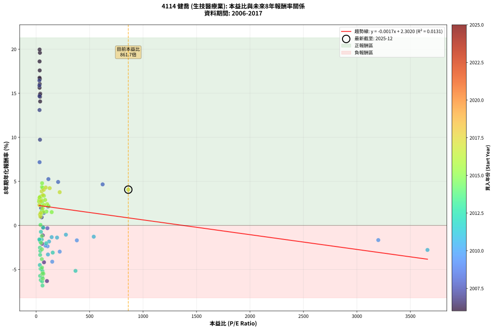
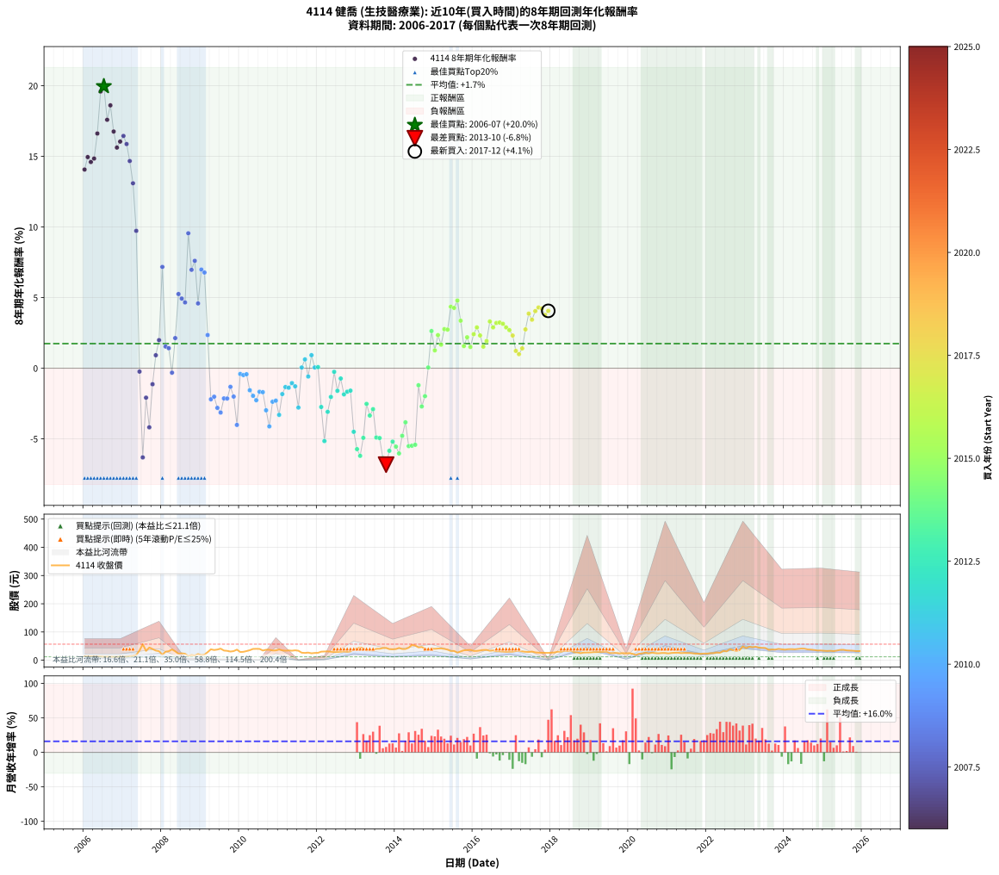

# 4114 健喬 - 本益比與未來報酬率分析

!!! info "報告資訊"
    - **股票代號**: 4114
    - **公司名稱**: 健喬
    - **產業別**: 生技醫療業
    - **分析期間**: 2006-2017 (144 個數據點)
    - **資料來源**: Type 12 (ShowMonthlyK_ChartFlow) 月收盤價與本益比
    - **報酬率口徑**: 含現金股利 (簡化: 年度合計，假設每年7/1入帳)
    - **報告生成時間**: 2026-01-04 08:27:51 CST

## 📈 視覺化圖表

### 圖表1: 本益比 vs 未來報酬率關係

*圖表1：4114 健喬 本益比與8年期未來報酬率關係 (2006-2017)*

### 圖表2: 歷年買入時點的8年期實際報酬率

*圖表2：4114 健喬 歷年買入時點的8年期實際報酬率 (2006-2017)*

## 📍 買點訊號說明

本報告提供兩種買點提示訊號（顯示於圖表2的股價子圖中）：

### ▲ 小綠色三角形（回測驗證）
- **計算方式**: 使用全部歷史資料計算本益比第25百分位數
- **用途**: 事後驗證，顯示歷史上哪些時點確實為低估區
- **限制**: 當下無法判斷，僅供回測參考
- **特性**: 後見之明（Look-Ahead Bias）

### ▲ 小橘色三角形（即時訊號）
- **計算方式**: 使用截至當月的過去5年資料計算本益比第25百分位數
- **用途**: 實際投資決策，當時即可判斷
- **優勢**: 可操作性強，符合實務需求
- **特性**: 無後見之明，滾動窗口計算

!!! tip "如何使用兩種訊號"
    - **綠色▲** 幫助理解歷史估值機會，驗證策略有效性
    - **橘色▲** 可作為實際買進參考，但仍需搭配基本面分析
    - 兩種訊號重疊時，表示即時判斷與事後驗證一致，信心度較高
    - 僅有綠色▲時，表示當時無法判斷（需要未來資料才能確認）
    - 僅有橘色▲時，表示即時判斷為買點，但事後可能不是最佳時機

## 📊 估值分析摘要

| 指標 | 數值 |
|:---:|:---:|
| **目前本益比** (2017-12) | **861.70 倍** |
| **歷史平均本益比** | 146.51 倍 |
| **估值水準** | 🔴 相對高估 |
| **預期8年年化報酬率** | **+0.86%** |
| **歷史平均報酬率** | +1.74% |
| **相關係數 (R²)** | 0.0131 |
| **趨勢線斜率** | -0.0017 |

!!! abstract "核心洞察"
    目前本益比顯著高於歷史平均，預期未來報酬率可能較低

    根據歷史數據回測，4114 健喬 在目前本益比 **861.7倍** 的估值水準下，
    預期未來8年年化報酬率約為 **+0.9%**。

    **重要提醒**: 本分析基於歷史數據統計，實際報酬率會受到公司基本面變化、產業趨勢、
    總體經濟環境等多重因素影響。R² = 0.01 表示本益比可解釋約 1.3% 的報酬率變異。

## 📈 歷史估值統計

### 最佳買點 (最高報酬率)

| 項目 | 數值 |
|:---:|:---:|
| 起始時間 | 2006-07 |
| 當時本益比 | 32.37 倍 |
| 起始價格 | 12.3 元 |
| 8年後價格 | 51.8 元 |
| **8年年化報酬率** | **+19.96%** |

### 最差買點 (最低報酬率)

| 項目 | 數值 |
|:---:|:---:|
| 起始時間 | 2013-10 |
| 當時本益比 | 59.25 倍 |
| 起始價格 | 43.4 元 |
| 8年後價格 | 23.0 元 |
| **8年年化報酬率** | **-6.83%** |

## 🎯 投資啟示

### 本益比與報酬率關係

趨勢線方程式: **y = -0.0017x + 2.3020**

!!! note "負相關"
    本益比與未來報酬率呈現負相關。較低的本益比通常帶來較高的未來報酬率，
    但相關性不算非常強。**估值仍是重要參考指標之一**。

### 估值區間建議

基於歷史數據分析:

- **🟢 低估區** (P/E < 117.2): 預期報酬率較高，可考慮增加持股
- **🟡 合理區** (P/E 117.2-175.8): 預期報酬率符合長期趨勢，正常持有
- **🔴 高估區** (P/E > 175.8): 預期報酬率較低，可考慮減碼或觀望

!!! danger "風險提示"
    - 過去表現不代表未來結果
    - 本分析假設公司基本面無重大結構性變化
    - 產業環境劇變可能使歷史規律失效
    - 應結合公司財報、產業趨勢、總體經濟等多重因素綜合判斷

!!! success "長期投資觀點"
    歷史數據顯示，在合理或低估的估值水準買入並長期持有，
    往往能獲得較佳的投資報酬。**耐心等待好價格**是價值投資的核心原則。

## 📊 數據品質

- **資料來源**: GoodInfo.tw Type 12 (ShowMonthlyK_ChartFlow)
- **資料頻率**: 月度收盤價與本益比
- **回測期間**: 2006-2017
- **數據點數量**: 144 個 (每個點代表一次8年期回測)

### 計算方法說明

1. **8年期年化報酬率**:
   - 對每個歷史時點，計算其後8年的實際投資報酬率
   - 期末價值(不含股利): 期末價格
   - 期末價值(含現金股利): 期末價格 + 持有期間內的現金股利合計 (簡化: 年度合計，假設每年7/1入帳)
   - 公式: 年化報酬率 = [(期末價值/期初價格)^(1/年數) - 1] × 100%

2. **本益比 (P/E Ratio)**:
   - 使用當時的月收盤價與EPS計算
   - 資料來源: Type 12 月度河流圖本益比數據

3. **趨勢線 (Linear Regression)**:
   - 使用最小平方法擬合線性趨勢線
   - R²值衡量本益比對報酬率的解釋能力

---

*本報告由 Stock Analysis System v1.9.0 自動生成*
*數據更新時間: 2026-01-04 08:27:51 CST*

## 📋 月度回測明細表

（每一列對應時間線圖中的一個買入點；可用來對照 SVG 圖上的每個點。）

| 買入月份 | 賣出月份 | 回測期限_年 | 實際持有年數 | 買入本益比_倍 | 買入收盤價_元 | 賣出收盤價_元 | 現金股利合計_元 | 總報酬率_pct | 年化報酬率_pct |
| --- | --- | --- | --- | --- | --- | --- | --- | --- | --- |
| 2006-01 | 2014-01 | 8 | 8.000 | 37.24 | 14.15 | 39.40 | 1.17 | +186.68 | +14.07 |
| 2006-02 | 2014-02 | 8 | 8.000 | 38.42 | 14.60 | 43.35 | 1.17 | +204.90 | +14.95 |
| 2006-03 | 2014-03 | 8 | 8.000 | 36.05 | 13.70 | 39.60 | 1.17 | +197.55 | +14.60 |
| 2006-04 | 2014-04 | 8 | 8.000 | 35.53 | 13.50 | 39.70 | 1.17 | +202.70 | +14.85 |
| 2006-05 | 2014-05 | 8 | 8.000 | 34.74 | 13.20 | 44.00 | 1.17 | +242.16 | +16.62 |
| 2006-06 | 2014-06 | 8 | 8.000 | 35.00 | 13.30 | 54.50 | 1.17 | +318.53 | +19.60 |
| 2006-07 | 2014-07 | 8 | 8.000 | 32.37 | 12.30 | 51.80 | 0.95 | +328.90 | +19.96 |
| 2006-08 | 2014-08 | 8 | 8.000 | 33.29 | 12.65 | 45.30 | 0.95 | +265.65 | +17.59 |
| 2006-09 | 2014-09 | 8 | 8.000 | 32.11 | 12.20 | 46.85 | 0.95 | +291.84 | +18.61 |
| 2006-10 | 2014-10 | 8 | 8.000 | 31.58 | 12.00 | 40.50 | 0.95 | +245.46 | +16.76 |
| 2006-11 | 2014-11 | 8 | 8.000 | 31.84 | 12.10 | 37.70 | 0.95 | +219.46 | +15.63 |
| 2006-12 | 2014-12 | 8 | 8.000 | 33.68 | 12.80 | 41.15 | 0.95 | +228.95 | +16.05 |
| 2007-01 | 2015-01 | 8 | 8.000 | 30.06 | 12.20 | 40.30 | 0.95 | +238.16 | +16.45 |
| 2007-02 | 2015-02 | 8 | 8.000 | 30.12 | 13.00 | 41.30 | 0.95 | +225.04 | +15.88 |
| 2007-03 | 2015-03 | 8 | 8.000 | 31.26 | 14.30 | 41.80 | 0.95 | +198.99 | +14.67 |
| 2007-04 | 2015-04 | 8 | 8.000 | 31.66 | 15.30 | 40.00 | 0.95 | +167.68 | +13.10 |
| 2007-05 | 2015-05 | 8 | 8.000 | 35.84 | 18.25 | 37.40 | 0.95 | +110.16 | +9.73 |
| 2007-06 | 2015-06 | 8 | 8.000 | 64.02 | 34.25 | 32.65 | 0.95 | -1.88 | -0.24 |
| 2007-07 | 2015-07 | 8 | 8.000 | 101.10 | 56.70 | 32.65 | 1.00 | -40.66 | -6.31 |
| 2007-08 | 2015-08 | 8 | 8.000 | 56.08 | 32.90 | 26.80 | 1.00 | -15.51 | -2.08 |
| 2007-09 | 2015-09 | 8 | 8.000 | 73.31 | 44.90 | 30.90 | 1.00 | -28.96 | -4.18 |
| 2007-10 | 2015-10 | 8 | 8.000 | 62.11 | 39.65 | 35.20 | 1.00 | -8.71 | -1.13 |
| 2007-11 | 2015-11 | 8 | 8.000 | 51.42 | 34.15 | 35.75 | 1.00 | +7.60 | +0.92 |
| 2007-12 | 2015-12 | 8 | 8.000 | 46.23 | 31.90 | 36.35 | 1.00 | +17.08 | +1.99 |
| 2008-01 | 2016-01 | 8 | 8.000 | 32.05 | 19.50 | 32.95 | 1.00 | +74.09 | +7.18 |
| 2008-02 | 2016-02 | 8 | 8.000 | 56.96 | 30.00 | 32.90 | 1.00 | +12.99 | +1.54 |
| 2008-03 | 2016-03 | 8 | 8.000 | 71.46 | 31.80 | 34.60 | 1.00 | +11.94 | +1.42 |
| 2008-04 | 2016-04 | 8 | 8.000 | 105.00 | 38.15 | 36.20 | 1.00 | -2.50 | -0.32 |
| 2008-05 | 2016-05 | 8 | 8.000 | 111.80 | 31.50 | 36.30 | 1.00 | +18.40 | +2.13 |
| 2008-06 | 2016-06 | 8 | 8.000 | 114.50 | 22.90 | 33.50 | 1.00 | +50.64 | +5.26 |
| 2008-07 | 2016-07 | 8 | 8.000 | 205.40 | 24.30 | 34.75 | 0.97 | +47.00 | +4.93 |
| 2008-08 | 2016-08 | 8 | 8.000 | 621.80 | 22.80 | 31.85 | 0.97 | +43.95 | +4.66 |
| 2008-09 | 2016-09 | 8 | 8.000 |  | 15.50 | 31.20 | 0.97 | +107.55 | +9.56 |
| 2008-10 | 2016-10 | 8 | 8.000 |  | 18.30 | 30.40 | 0.97 | +71.42 | +6.97 |
| 2008-11 | 2016-11 | 8 | 8.000 |  | 16.95 | 29.50 | 0.97 | +79.76 | +7.61 |
| 2008-12 | 2016-12 | 8 | 8.000 |  | 21.70 | 30.10 | 0.97 | +43.18 | +4.59 |
| 2009-01 | 2017-01 | 8 | 8.000 |  | 18.10 | 30.10 | 0.97 | +71.66 | +6.99 |
| 2009-02 | 2017-02 | 8 | 8.000 |  | 19.60 | 32.15 | 0.97 | +68.98 | +6.78 |
| 2009-03 | 2017-03 | 8 | 8.000 |  | 28.50 | 33.35 | 0.97 | +20.42 | +2.35 |
| 2009-04 | 2017-04 | 8 | 8.000 |  | 38.55 | 31.30 | 0.97 | -16.29 | -2.20 |
| 2009-05 | 2017-05 | 8 | 8.000 |  | 36.10 | 29.70 | 0.97 | -15.04 | -2.02 |
| 2009-06 | 2017-06 | 8 | 8.000 |  | 37.70 | 29.05 | 0.97 | -20.37 | -2.81 |
| 2009-07 | 2017-07 | 8 | 8.000 |  | 41.00 | 30.60 | 1.17 | -22.51 | -3.14 |
| 2009-08 | 2017-08 | 8 | 8.000 |  | 34.20 | 27.60 | 1.17 | -15.88 | -2.14 |
| 2009-09 | 2017-09 | 8 | 8.000 |  | 33.15 | 26.70 | 1.17 | -15.93 | -2.15 |
| 2009-10 | 2017-10 | 8 | 8.000 |  | 30.60 | 26.35 | 1.17 | -10.07 | -1.32 |
| 2009-11 | 2017-11 | 8 | 8.000 |  | 32.25 | 26.25 | 1.17 | -14.98 | -2.01 |
| 2009-12 | 2017-12 | 8 | 8.000 |  | 37.50 | 25.85 | 1.17 | -27.95 | -4.01 |
| 2010-01 | 2018-01 | 8 | 8.000 |  | 29.00 | 26.90 | 1.17 | -3.21 | -0.41 |
| 2010-02 | 2018-02 | 8 | 8.000 |  | 29.65 | 27.35 | 1.17 | -3.81 | -0.48 |
| 2010-03 | 2018-03 | 8 | 8.000 |  | 32.30 | 30.05 | 1.17 | -3.34 | -0.42 |
| 2010-04 | 2018-04 | 8 | 8.000 |  | 35.40 | 30.05 | 1.17 | -11.81 | -1.56 |
| 2010-05 | 2018-05 | 8 | 8.000 |  | 39.95 | 32.95 | 1.17 | -14.59 | -1.95 |
| 2010-06 | 2018-06 | 8 | 8.000 |  | 40.20 | 32.30 | 1.17 | -16.74 | -2.26 |
| 2010-07 | 2018-07 | 8 | 8.000 | 3200.00 | 40.00 | 33.60 | 1.37 | -12.58 | -1.67 |
| 2010-08 | 2018-08 | 8 | 8.000 | 380.60 | 34.25 | 28.50 | 1.37 | -12.79 | -1.70 |
| 2010-09 | 2018-09 | 8 | 8.000 | 220.30 | 36.90 | 27.60 | 1.37 | -21.49 | -2.98 |
| 2010-10 | 2018-10 | 8 | 8.000 | 150.40 | 36.85 | 24.95 | 1.37 | -28.58 | -4.12 |
| 2010-11 | 2018-11 | 8 | 8.000 | 107.00 | 34.50 | 27.10 | 1.37 | -17.48 | -2.37 |
| 2010-12 | 2018-12 | 8 | 8.000 | 86.62 | 34.65 | 27.40 | 1.37 | -16.97 | -2.30 |
| 2011-01 | 2019-01 | 8 | 8.000 | 110.10 | 37.90 | 27.60 | 1.37 | -23.56 | -3.30 |
| 2011-02 | 2019-02 | 8 | 8.000 | 120.70 | 34.80 | 28.65 | 1.37 | -13.74 | -1.83 |
| 2011-03 | 2019-03 | 8 | 8.000 | 145.00 | 33.70 | 28.90 | 1.37 | -10.18 | -1.33 |
| 2011-04 | 2019-04 | 8 | 8.000 | 195.30 | 34.50 | 29.50 | 1.37 | -10.52 | -1.38 |
| 2011-05 | 2019-05 | 8 | 8.000 | 278.10 | 33.60 | 29.50 | 1.37 | -8.12 | -1.05 |
| 2011-06 | 2019-06 | 8 | 8.000 | 538.50 | 35.00 | 30.20 | 1.37 | -9.80 | -1.28 |
| 2011-07 | 2019-07 | 8 | 8.000 | 3660.00 | 33.55 | 25.30 | 1.46 | -20.23 | -2.79 |
| 2011-08 | 2019-08 | 8 | 8.000 |  | 26.50 | 25.15 | 1.46 | +0.43 | +0.05 |
| 2011-09 | 2019-09 | 8 | 8.000 |  | 25.70 | 25.55 | 1.46 | +5.11 | +0.63 |
| 2011-10 | 2019-10 | 8 | 8.000 |  | 26.90 | 24.20 | 1.46 | -4.59 | -0.59 |
| 2011-11 | 2019-11 | 8 | 8.000 |  | 24.40 | 24.80 | 1.46 | +7.64 | +0.92 |
| 2011-12 | 2019-12 | 8 | 8.000 |  | 25.65 | 24.30 | 1.46 | +0.44 | +0.06 |
| 2012-01 | 2020-01 | 8 | 8.000 |  | 26.10 | 24.80 | 1.46 | +0.63 | +0.08 |
| 2012-02 | 2020-02 | 8 | 8.000 |  | 30.25 | 22.75 | 1.46 | -19.95 | -2.74 |
| 2012-03 | 2020-03 | 8 | 8.000 | 368.00 | 30.80 | 18.70 | 1.46 | -34.53 | -5.16 |
| 2012-04 | 2020-04 | 8 | 8.000 | 155.00 | 31.25 | 22.85 | 1.46 | -22.20 | -3.09 |
| 2012-05 | 2020-05 | 8 | 8.000 | 93.74 | 29.95 | 23.95 | 1.46 | -15.15 | -2.03 |
| 2012-06 | 2020-06 | 8 | 8.000 | 66.19 | 28.95 | 26.90 | 1.46 | -2.02 | -0.26 |
| 2012-07 | 2020-07 | 8 | 8.000 | 52.14 | 28.95 | 23.90 | 1.55 | -12.10 | -1.60 |
| 2012-08 | 2020-08 | 8 | 8.000 | 44.49 | 29.95 | 26.70 | 1.55 | -5.68 | -0.73 |
| 2012-09 | 2020-09 | 8 | 8.000 | 39.19 | 31.00 | 25.15 | 1.55 | -13.88 | -1.85 |
| 2012-10 | 2020-10 | 8 | 8.000 | 32.45 | 29.50 | 24.25 | 1.55 | -12.55 | -1.66 |
| 2012-11 | 2020-11 | 8 | 8.000 | 29.99 | 30.80 | 25.55 | 1.55 | -12.02 | -1.59 |
| 2012-12 | 2020-12 | 8 | 8.000 | 34.16 | 39.10 | 25.50 | 1.55 | -30.82 | -4.50 |
| 2013-01 | 2021-01 | 8 | 8.000 | 36.97 | 40.80 | 23.90 | 1.55 | -37.63 | -5.73 |
| 2013-02 | 2021-02 | 8 | 8.000 | 42.74 | 45.40 | 25.65 | 1.55 | -40.09 | -6.20 |
| 2013-03 | 2021-03 | 8 | 8.000 | 40.94 | 41.80 | 26.35 | 1.55 | -33.26 | -4.93 |
| 2013-04 | 2021-04 | 8 | 8.000 | 35.31 | 34.60 | 26.65 | 1.55 | -18.50 | -2.53 |
| 2013-05 | 2021-05 | 8 | 8.000 | 37.29 | 35.00 | 25.10 | 1.55 | -23.86 | -3.35 |
| 2013-06 | 2021-06 | 8 | 8.000 | 38.78 | 34.80 | 25.95 | 1.55 | -20.98 | -2.90 |
| 2013-07 | 2021-07 | 8 | 8.000 | 47.07 | 40.30 | 25.30 | 1.65 | -33.13 | -4.91 |
| 2013-08 | 2021-08 | 8 | 8.000 | 49.51 | 40.35 | 25.25 | 1.65 | -33.34 | -4.94 |
| 2013-09 | 2021-09 | 8 | 8.000 | 55.64 | 43.05 | 23.80 | 1.65 | -40.89 | -6.36 |
| 2013-10 | 2021-10 | 8 | 8.000 | 59.25 | 43.40 | 23.00 | 1.65 | -43.21 | -6.83 |
| 2013-11 | 2021-11 | 8 | 8.000 | 56.57 | 39.10 | 22.50 | 1.65 | -38.24 | -5.85 |
| 2013-12 | 2021-12 | 8 | 8.000 | 59.54 | 38.70 | 23.60 | 1.65 | -34.76 | -5.20 |
| 2014-01 | 2022-01 | 8 | 8.000 | 58.37 | 39.40 | 23.30 | 1.65 | -36.68 | -5.55 |
| 2014-02 | 2022-02 | 8 | 8.000 | 61.93 | 43.35 | 24.70 | 1.65 | -39.22 | -6.03 |
| 2014-03 | 2022-03 | 8 | 8.000 | 54.62 | 39.60 | 25.10 | 1.65 | -32.45 | -4.79 |
| 2014-04 | 2022-04 | 8 | 8.000 | 52.93 | 39.70 | 27.40 | 1.65 | -26.83 | -3.83 |
| 2014-05 | 2022-05 | 8 | 8.000 | 56.77 | 44.00 | 26.30 | 1.65 | -36.48 | -5.52 |
| 2014-06 | 2022-06 | 8 | 8.000 | 68.12 | 54.50 | 33.05 | 1.65 | -36.33 | -5.49 |
| 2014-07 | 2022-07 | 8 | 8.000 | 62.79 | 51.80 | 31.20 | 1.96 | -35.97 | -5.42 |
| 2014-08 | 2022-08 | 8 | 8.000 | 53.29 | 45.30 | 39.15 | 1.96 | -9.24 | -1.20 |
| 2014-09 | 2022-09 | 8 | 8.000 | 53.54 | 46.85 | 35.65 | 1.96 | -19.71 | -2.71 |
| 2014-10 | 2022-10 | 8 | 8.000 | 45.00 | 40.50 | 32.55 | 1.96 | -14.78 | -1.98 |
| 2014-11 | 2022-11 | 8 | 8.000 | 40.76 | 37.70 | 35.90 | 1.96 | +0.44 | +0.05 |
| 2014-12 | 2022-12 | 8 | 8.000 | 43.32 | 41.15 | 48.70 | 1.96 | +23.12 | +2.63 |
| 2015-01 | 2023-01 | 8 | 8.000 | 45.20 | 40.30 | 42.60 | 1.96 | +10.58 | +1.27 |
| 2015-02 | 2023-02 | 8 | 8.000 | 49.56 | 41.30 | 47.75 | 1.96 | +20.38 | +2.35 |
| 2015-03 | 2023-03 | 8 | 8.000 | 53.94 | 41.80 | 45.75 | 1.96 | +14.15 | +1.67 |
| 2015-04 | 2023-04 | 8 | 8.000 | 55.81 | 40.00 | 47.80 | 1.96 | +24.41 | +2.77 |
| 2015-05 | 2023-05 | 8 | 8.000 | 56.81 | 37.40 | 44.45 | 1.96 | +24.10 | +2.74 |
| 2015-06 | 2023-06 | 8 | 8.000 | 54.42 | 32.65 | 43.95 | 1.96 | +40.63 | +4.35 |
| 2015-07 | 2023-07 | 8 | 8.000 | 60.28 | 32.65 | 43.30 | 2.32 | +39.73 | +4.27 |
| 2015-08 | 2023-08 | 8 | 8.000 | 55.45 | 26.80 | 36.65 | 2.32 | +45.42 | +4.79 |
| 2015-09 | 2023-09 | 8 | 8.000 | 72.71 | 30.90 | 37.95 | 2.32 | +30.33 | +3.37 |
| 2015-10 | 2023-10 | 8 | 8.000 | 96.00 | 35.20 | 37.55 | 2.32 | +13.27 | +1.57 |
| 2015-11 | 2023-11 | 8 | 8.000 | 116.00 | 35.75 | 40.20 | 2.32 | +18.94 | +2.19 |
| 2015-12 | 2023-12 | 8 | 8.000 | 145.40 | 36.35 | 38.65 | 2.32 | +12.72 | +1.51 |
| 2016-01 | 2024-01 | 8 | 8.000 | 102.70 | 32.95 | 37.55 | 2.32 | +21.01 | +2.41 |
| 2016-02 | 2024-02 | 8 | 8.000 | 83.96 | 32.90 | 39.00 | 2.32 | +25.60 | +2.89 |
| 2016-03 | 2024-03 | 8 | 8.000 | 74.76 | 34.60 | 39.25 | 2.32 | +20.15 | +2.32 |
| 2016-04 | 2024-04 | 8 | 8.000 | 67.83 | 36.20 | 38.55 | 2.32 | +12.91 | +1.53 |
| 2016-05 | 2024-05 | 8 | 8.000 | 60.03 | 36.30 | 39.95 | 2.32 | +16.45 | +1.92 |
| 2016-06 | 2024-06 | 8 | 8.000 | 49.59 | 33.50 | 41.15 | 2.32 | +29.77 | +3.31 |
| 2016-07 | 2024-07 | 8 | 8.000 | 46.55 | 34.75 | 40.90 | 2.75 | +25.61 | +2.89 |
| 2016-08 | 2024-08 | 8 | 8.000 | 38.96 | 31.85 | 38.25 | 2.75 | +28.73 | +3.21 |
| 2016-09 | 2024-09 | 8 | 8.000 | 35.12 | 31.20 | 37.50 | 2.75 | +29.00 | +3.23 |
| 2016-10 | 2024-10 | 8 | 8.000 | 31.69 | 30.40 | 36.20 | 2.75 | +28.12 | +3.15 |
| 2016-11 | 2024-11 | 8 | 8.000 | 28.63 | 29.50 | 34.30 | 2.75 | +25.59 | +2.89 |
| 2016-12 | 2024-12 | 8 | 8.000 | 27.33 | 30.10 | 34.50 | 2.75 | +23.75 | +2.70 |
| 2017-01 | 2025-01 | 8 | 8.000 | 29.75 | 30.10 | 33.40 | 2.75 | +20.10 | +2.32 |
| 2017-02 | 2025-02 | 8 | 8.000 | 34.85 | 32.15 | 32.70 | 2.75 | +10.26 | +1.23 |
| 2017-03 | 2025-03 | 8 | 8.000 | 40.02 | 33.35 | 33.35 | 2.75 | +8.24 | +1.00 |
| 2017-04 | 2025-04 | 8 | 8.000 | 42.06 | 31.30 | 32.25 | 2.75 | +11.82 | +1.41 |
| 2017-05 | 2025-05 | 8 | 8.000 | 45.35 | 29.70 | 34.15 | 2.75 | +24.24 | +2.75 |
| 2017-06 | 2025-06 | 8 | 8.000 | 51.36 | 29.05 | 36.60 | 2.75 | +35.45 | +3.87 |
| 2017-07 | 2025-07 | 8 | 8.000 | 64.24 | 30.60 | 36.95 | 3.15 | +31.04 | +3.44 |
| 2017-08 | 2025-08 | 8 | 8.000 | 71.31 | 27.60 | 34.75 | 3.15 | +37.31 | +4.04 |
| 2017-09 | 2025-09 | 8 | 8.000 | 89.66 | 26.70 | 34.25 | 3.15 | +40.07 | +4.30 |
| 2017-10 | 2025-10 | 8 | 8.000 | 126.40 | 26.35 | 33.55 | 3.15 | +39.27 | +4.23 |
| 2017-11 | 2025-11 | 8 | 8.000 | 220.10 | 26.25 | 32.15 | 3.15 | +34.47 | +3.77 |
| 2017-12 | 2025-12 | 8 | 8.000 | 861.70 | 25.85 | 32.40 | 3.15 | +37.52 | +4.06 |
