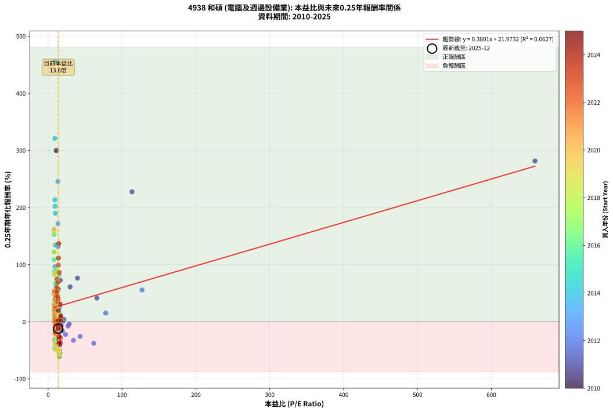
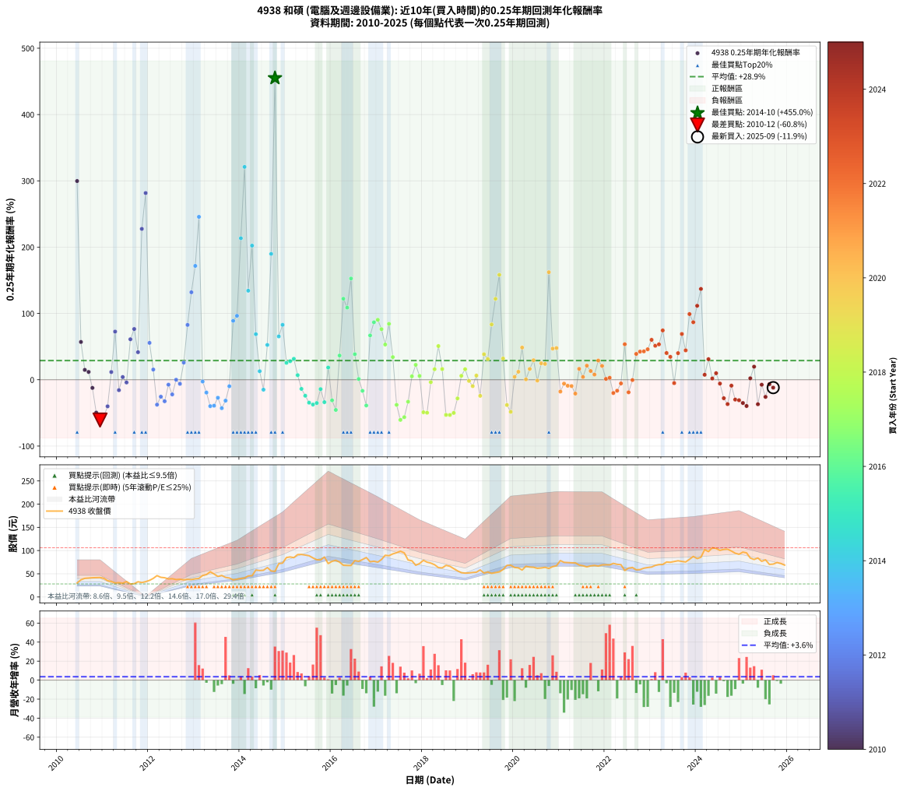

# 4938 和碩 - 本益比與未來報酬率分析

!!! info "報告資訊"
    - **股票代號**: 4938
    - **公司名稱**: 和碩
    - **產業別**: 電腦及週邊設備業
    - **分析期間**: 2010-2025 (184 個數據點)
    - **資料來源**: Type 12 (ShowMonthlyK_ChartFlow) 月收盤價與本益比
    - **報酬率口徑**: 含現金股利 (簡化: 年度合計，假設每年7/1入帳)
    - **報告生成時間**: 2025-12-23 12:23:36 CST

## 📈 視覺化圖表

### 圖表1: 本益比 vs 未來報酬率關係

*圖表1：4938 和碩 本益比與0.25年期未來報酬率關係 (2010-2025)*

### 圖表2: 歷年買入時點的0.25年期實際報酬率

*圖表2：4938 和碩 歷年買入時點的0.25年期實際報酬率 (2010-2025)*

## 📍 買點訊號說明

本報告提供兩種買點提示訊號（顯示於圖表2的股價子圖中）：

### ▲ 小綠色三角形（回測驗證）
- **計算方式**: 使用全部歷史資料計算本益比第25百分位數
- **用途**: 事後驗證，顯示歷史上哪些時點確實為低估區
- **限制**: 當下無法判斷，僅供回測參考
- **特性**: 後見之明（Look-Ahead Bias）

### ▲ 小橘色三角形（即時訊號）
- **計算方式**: 使用截至當月的過去5年資料計算本益比第25百分位數
- **用途**: 實際投資決策，當時即可判斷
- **優勢**: 可操作性強，符合實務需求
- **特性**: 無後見之明，滾動窗口計算

!!! tip "如何使用兩種訊號"
    - **綠色▲** 幫助理解歷史估值機會，驗證策略有效性
    - **橘色▲** 可作為實際買進參考，但仍需搭配基本面分析
    - 兩種訊號重疊時，表示即時判斷與事後驗證一致，信心度較高
    - 僅有綠色▲時，表示當時無法判斷（需要未來資料才能確認）
    - 僅有橘色▲時，表示即時判斷為買點，但事後可能不是最佳時機

## 📊 估值分析摘要

| 指標 | 數值 |
|:---:|:---:|
| **目前本益比** (2025-09) | **13.62 倍** |
| **歷史平均本益比** | 18.29 倍 |
| **估值水準** | 🟢 相對低估 |
| **預期0.25年年化報酬率** | **+27.32%** |
| **歷史平均報酬率** | +29.10% |
| **相關係數 (R²)** | 0.0627 |
| **趨勢線斜率** | 0.3798 |

!!! abstract "核心洞察"
    目前本益比顯著低於歷史平均，預期未來報酬率可能較高

    根據歷史數據回測，4938 和碩 在目前本益比 **13.6倍** 的估值水準下，
    預期未來0.25年年化報酬率約為 **+27.3%**。

    **重要提醒**: 本分析基於歷史數據統計，實際報酬率會受到公司基本面變化、產業趨勢、
    總體經濟環境等多重因素影響。R² = 0.06 表示本益比可解釋約 6.3% 的報酬率變異。

## 📈 歷史估值統計

### 最佳買點 (最高報酬率)

| 項目 | 數值 |
|:---:|:---:|
| 起始時間 | 2014-10 |
| 當時本益比 | 9.37 倍 |
| 起始價格 | 55.2 元 |
| 0.25年後價格 | 85.0 元 |
| **0.25年年化報酬率** | **+455.03%** |

### 最差買點 (最低報酬率)

| 項目 | 數值 |
|:---:|:---:|
| 起始時間 | 2010-12 |
| 當時本益比 | 15.38 倍 |
| 起始價格 | 42.0 元 |
| 0.25年後價格 | 33.4 元 |
| **0.25年年化報酬率** | **-60.78%** |

## 🎯 投資啟示

### 本益比與報酬率關係

趨勢線方程式: **y = 0.3798x + 22.1497**

!!! info "弱相關或正相關"
    本益比與未來報酬率相關性較弱。這可能表示該股票的報酬率更多受到
    公司成長性、產業趨勢等因素影響，而非估值水準。**需綜合考量多項指標**。

### 估值區間建議

基於歷史數據分析:

- **🟢 低估區** (P/E < 14.6): 預期報酬率較高，可考慮增加持股
- **🟡 合理區** (P/E 14.6-22.0): 預期報酬率符合長期趨勢，正常持有
- **🔴 高估區** (P/E > 22.0): 預期報酬率較低，可考慮減碼或觀望

!!! danger "風險提示"
    - 過去表現不代表未來結果
    - 本分析假設公司基本面無重大結構性變化
    - 產業環境劇變可能使歷史規律失效
    - 應結合公司財報、產業趨勢、總體經濟等多重因素綜合判斷

!!! success "長期投資觀點"
    歷史數據顯示，在合理或低估的估值水準買入並長期持有，
    往往能獲得較佳的投資報酬。**耐心等待好價格**是價值投資的核心原則。

## 📊 數據品質

- **資料來源**: GoodInfo.tw Type 12 (ShowMonthlyK_ChartFlow)
- **資料頻率**: 月度收盤價與本益比
- **回測期間**: 2010-2025
- **數據點數量**: 184 個 (每個點代表一次0.25年期回測)

### 計算方法說明

1. **0.25年期年化報酬率**:
   - 對每個歷史時點，計算其後0.25年的實際投資報酬率
   - 期末價值(不含股利): 期末價格
   - 期末價值(含現金股利): 期末價格 + 持有期間內的現金股利合計 (簡化: 年度合計，假設每年7/1入帳)
   - 公式: 年化報酬率 = [(期末價值/期初價格)^(1/年數) - 1] × 100%

2. **本益比 (P/E Ratio)**:
   - 使用當時的月收盤價與EPS計算
   - 資料來源: Type 12 月度河流圖本益比數據

3. **趨勢線 (Linear Regression)**:
   - 使用最小平方法擬合線性趨勢線
   - R²值衡量本益比對報酬率的解釋能力

---

*本報告由 Stock Analysis System v1.9.0 自動生成*
*數據更新時間: 2025-12-23 12:23:36 CST*

## 📋 月度回測明細表

（每一列對應時間線圖中的一個買入點；可用來對照 SVG 圖上的每個點。）

| 買入月份 | 賣出月份 | 回測期限_年 | 實際持有年數 | 買入本益比_倍 | 買入收盤價_元 | 賣出收盤價_元 | 現金股利合計_元 | 總報酬率_pct | 年化報酬率_pct |
| --- | --- | --- | --- | --- | --- | --- | --- | --- | --- |
| 2010-06 | 2010-09 | 0.25 | 0.252 | 11.01 | 30.05 | 40.85 | 1.75 | +41.76 | +299.70 |
| 2010-07 | 2010-10 | 0.25 | 0.252 | 13.55 | 37.00 | 41.45 | 0.00 | +12.03 | +56.97 |
| 2010-08 | 2010-12 | 0.25 | 0.334 | 14.69 | 40.10 | 42.00 | 0.00 | +4.74 | +14.87 |
| 2010-09 | 2010-12 | 0.25 | 0.249 | 14.96 | 40.85 | 42.00 | 0.00 | +2.82 | +11.79 |
| 2010-10 | 2011-01 | 0.25 | 0.252 | 15.18 | 41.45 | 40.10 | 0.00 | -3.26 | -12.32 |
| 2010-11 | 2011-03 | 0.25 | 0.329 | 15.29 | 41.75 | 33.35 | 0.00 | -20.12 | -49.53 |
| 2010-12 | 2011-03 | 0.25 | 0.246 | 15.38 | 42.00 | 33.35 | 0.00 | -20.60 | -60.78 |
| 2011-01 | 2011-05 | 0.25 | 0.329 | 16.00 | 40.10 | 30.85 | 0.00 | -23.07 | -54.99 |
| 2011-02 | 2011-05 | 0.25 | 0.246 | 15.33 | 35.00 | 30.85 | 0.00 | -11.86 | -40.08 |
| 2011-03 | 2011-07 | 0.25 | 0.334 | 16.19 | 33.35 | 33.15 | 1.45 | +3.75 | +11.65 |
| 2011-04 | 2011-07 | 0.25 | 0.249 | 16.44 | 30.20 | 33.15 | 1.45 | +14.57 | +72.62 |
| 2011-05 | 2011-08 | 0.25 | 0.252 | 19.12 | 30.85 | 28.10 | 1.45 | -4.21 | -15.71 |
| 2011-06 | 2011-09 | 0.25 | 0.252 | 21.40 | 29.75 | 28.60 | 1.45 | +1.01 | +4.06 |
| 2011-07 | 2011-10 | 0.25 | 0.252 | 28.41 | 33.15 | 32.80 | 0.00 | -1.06 | -4.13 |
| 2011-08 | 2011-12 | 0.25 | 0.334 | 29.79 | 28.10 | 32.95 | 0.00 | +17.26 | +61.07 |
| 2011-09 | 2011-12 | 0.25 | 0.249 | 39.72 | 28.60 | 32.95 | 0.00 | +15.21 | +76.52 |
| 2011-10 | 2012-01 | 0.25 | 0.252 | 66.04 | 32.80 | 35.80 | 0.00 | +9.15 | +41.55 |
| 2011-11 | 2012-03 | 0.25 | 0.331 | 113.60 | 31.05 | 46.00 | 0.00 | +48.15 | +227.54 |
| 2011-12 | 2012-03 | 0.25 | 0.249 | 659.00 | 32.95 | 46.00 | 0.00 | +39.61 | +281.59 |
| 2012-01 | 2012-05 | 0.25 | 0.331 | 127.10 | 35.80 | 41.45 | 0.00 | +15.78 | +55.64 |
| 2012-02 | 2012-05 | 0.25 | 0.249 | 77.92 | 40.00 | 41.45 | 0.00 | +3.63 | +15.36 |
| 2012-03 | 2012-07 | 0.25 | 0.334 | 61.74 | 46.00 | 39.30 | 0.00 | -14.57 | -37.58 |
| 2012-04 | 2012-07 | 0.25 | 0.249 | 43.31 | 42.30 | 39.30 | 0.00 | -7.09 | -25.57 |
| 2012-05 | 2012-08 | 0.25 | 0.252 | 34.30 | 41.45 | 37.55 | 0.00 | -9.41 | -32.45 |
| 2012-06 | 2012-09 | 0.25 | 0.252 | 27.01 | 38.90 | 38.15 | 0.00 | -1.93 | -7.44 |
| 2012-07 | 2012-10 | 0.25 | 0.252 | 23.51 | 39.30 | 36.90 | 0.00 | -6.11 | -22.13 |
| 2012-08 | 2012-12 | 0.25 | 0.334 | 19.73 | 37.55 | 37.55 | 0.00 | +0.00 | +0.00 |
| 2012-09 | 2012-12 | 0.25 | 0.249 | 17.87 | 38.15 | 37.55 | 0.00 | -1.57 | -6.16 |
| 2012-10 | 2013-01 | 0.25 | 0.252 | 15.59 | 36.90 | 39.10 | 0.00 | +5.96 | +25.85 |
| 2012-11 | 2013-03 | 0.25 | 0.329 | 14.59 | 37.90 | 46.20 | 0.00 | +21.90 | +82.71 |
| 2012-12 | 2013-03 | 0.25 | 0.246 | 13.27 | 37.55 | 46.20 | 0.00 | +23.04 | +131.94 |
| 2013-01 | 2013-05 | 0.25 | 0.329 | 13.30 | 39.10 | 54.30 | 0.00 | +38.87 | +171.71 |
| 2013-02 | 2013-05 | 0.25 | 0.246 | 13.11 | 40.00 | 54.30 | 0.00 | +35.75 | +245.70 |
| 2013-03 | 2013-07 | 0.25 | 0.334 | 14.61 | 46.20 | 44.30 | 1.48 | -0.91 | -2.69 |
| 2013-04 | 2013-07 | 0.25 | 0.249 | 14.76 | 48.30 | 44.30 | 1.48 | -5.22 | -19.34 |
| 2013-05 | 2013-08 | 0.25 | 0.252 | 16.05 | 54.30 | 46.30 | 1.48 | -12.01 | -39.82 |
| 2013-06 | 2013-09 | 0.25 | 0.252 | 14.16 | 49.50 | 42.20 | 1.48 | -11.76 | -39.13 |
| 2013-07 | 2013-10 | 0.25 | 0.252 | 12.29 | 44.30 | 40.90 | 0.00 | -7.67 | -27.17 |
| 2013-08 | 2013-12 | 0.25 | 0.334 | 12.46 | 46.30 | 38.40 | 0.00 | -17.06 | -42.88 |
| 2013-09 | 2013-12 | 0.25 | 0.249 | 11.03 | 42.20 | 38.40 | 0.00 | -9.00 | -31.53 |
| 2013-10 | 2014-01 | 0.25 | 0.252 | 10.39 | 40.90 | 39.85 | 0.00 | -2.57 | -9.81 |
| 2013-11 | 2014-03 | 0.25 | 0.329 | 9.09 | 36.80 | 45.35 | 0.00 | +23.23 | +88.87 |
| 2013-12 | 2014-03 | 0.25 | 0.246 | 9.23 | 38.40 | 45.35 | 0.00 | +18.10 | +96.43 |
| 2014-01 | 2014-05 | 0.25 | 0.329 | 9.20 | 39.85 | 58.00 | 0.00 | +45.55 | +213.42 |
| 2014-02 | 2014-05 | 0.25 | 0.246 | 9.03 | 40.70 | 58.00 | 0.00 | +42.51 | +321.03 |
| 2014-03 | 2014-07 | 0.25 | 0.334 | 9.69 | 45.35 | 57.50 | 2.77 | +32.90 | +134.30 |
| 2014-04 | 2014-07 | 0.25 | 0.249 | 9.43 | 45.75 | 57.50 | 2.77 | +31.73 | +202.29 |
| 2014-05 | 2014-08 | 0.25 | 0.252 | 11.54 | 58.00 | 63.40 | 2.77 | +14.08 | +68.72 |
| 2014-06 | 2014-09 | 0.25 | 0.252 | 10.96 | 57.00 | 56.00 | 2.77 | +3.10 | +12.89 |
| 2014-07 | 2014-10 | 0.25 | 0.252 | 10.70 | 57.50 | 55.20 | 0.00 | -4.00 | -14.96 |
| 2014-08 | 2014-12 | 0.25 | 0.334 | 11.43 | 63.40 | 73.00 | 0.00 | +15.14 | +52.52 |
| 2014-09 | 2014-12 | 0.25 | 0.249 | 9.79 | 56.00 | 73.00 | 0.00 | +30.36 | +189.81 |
| 2014-10 | 2015-01 | 0.25 | 0.252 | 9.37 | 55.20 | 85.00 | 0.00 | +53.99 | +455.03 |
| 2014-11 | 2015-03 | 0.25 | 0.329 | 11.84 | 71.80 | 84.70 | 0.00 | +17.97 | +65.35 |
| 2014-12 | 2015-03 | 0.25 | 0.246 | 11.70 | 73.00 | 84.70 | 0.00 | +16.03 | +82.81 |
| 2015-01 | 2015-05 | 0.25 | 0.329 | 13.10 | 85.00 | 91.60 | 0.00 | +7.76 | +25.56 |
| 2015-02 | 2015-05 | 0.25 | 0.246 | 12.79 | 86.20 | 91.60 | 0.00 | +6.26 | +27.97 |
| 2015-03 | 2015-07 | 0.25 | 0.334 | 12.12 | 84.70 | 88.80 | 4.04 | +9.61 | +31.60 |
| 2015-04 | 2015-07 | 0.25 | 0.249 | 12.62 | 91.30 | 88.80 | 4.04 | +1.68 | +6.93 |
| 2015-05 | 2015-08 | 0.25 | 0.252 | 12.24 | 91.60 | 84.20 | 4.04 | -3.67 | -13.80 |
| 2015-06 | 2015-09 | 0.25 | 0.252 | 11.67 | 90.30 | 80.20 | 4.04 | -6.71 | -24.11 |
| 2015-07 | 2015-10 | 0.25 | 0.252 | 11.12 | 88.80 | 79.80 | 0.00 | -10.14 | -34.57 |
| 2015-08 | 2015-12 | 0.25 | 0.334 | 10.23 | 84.20 | 72.00 | 0.00 | -14.49 | -37.41 |
| 2015-09 | 2015-12 | 0.25 | 0.249 | 9.45 | 80.20 | 72.00 | 0.00 | -10.22 | -35.14 |
| 2015-10 | 2016-01 | 0.25 | 0.252 | 9.14 | 79.80 | 76.80 | 0.00 | -3.76 | -14.11 |
| 2015-11 | 2016-03 | 0.25 | 0.331 | 9.59 | 86.10 | 75.10 | 0.00 | -12.78 | -33.81 |
| 2015-12 | 2016-03 | 0.25 | 0.249 | 7.80 | 72.00 | 75.10 | 0.00 | +4.31 | +18.44 |
| 2016-01 | 2016-05 | 0.25 | 0.331 | 8.45 | 76.80 | 67.90 | 0.00 | -11.59 | -31.05 |
| 2016-02 | 2016-05 | 0.25 | 0.249 | 8.84 | 79.00 | 67.90 | 0.00 | -14.05 | -45.54 |
| 2016-03 | 2016-07 | 0.25 | 0.334 | 8.54 | 75.10 | 78.30 | 5.03 | +10.96 | +36.52 |
| 2016-04 | 2016-07 | 0.25 | 0.249 | 7.89 | 68.30 | 78.30 | 5.03 | +22.01 | +122.18 |
| 2016-05 | 2016-08 | 0.25 | 0.252 | 7.98 | 67.90 | 76.70 | 5.03 | +20.37 | +108.76 |
| 2016-06 | 2016-09 | 0.25 | 0.252 | 8.11 | 67.80 | 80.60 | 5.03 | +26.30 | +152.67 |
| 2016-07 | 2016-10 | 0.25 | 0.252 | 9.52 | 78.30 | 85.00 | 0.00 | +8.56 | +38.54 |
| 2016-08 | 2016-12 | 0.25 | 0.334 | 9.50 | 76.70 | 77.00 | 0.00 | +0.39 | +1.18 |
| 2016-09 | 2016-12 | 0.25 | 0.249 | 10.16 | 80.60 | 77.00 | 0.00 | -4.47 | -16.76 |
| 2016-10 | 2017-01 | 0.25 | 0.252 | 10.91 | 85.00 | 75.10 | 0.00 | -11.65 | -38.84 |
| 2016-11 | 2017-03 | 0.25 | 0.329 | 9.93 | 75.90 | 89.80 | 0.00 | +18.31 | +66.84 |
| 2016-12 | 2017-03 | 0.25 | 0.246 | 10.27 | 77.00 | 89.80 | 0.00 | +16.62 | +86.65 |
| 2017-01 | 2017-05 | 0.25 | 0.329 | 10.22 | 75.10 | 92.80 | 0.00 | +23.57 | +90.43 |
| 2017-02 | 2017-05 | 0.25 | 0.246 | 11.22 | 80.70 | 92.80 | 0.00 | +14.99 | +76.29 |
| 2017-03 | 2017-07 | 0.25 | 0.334 | 12.76 | 89.80 | 98.60 | 4.93 | +15.29 | +53.10 |
| 2017-04 | 2017-07 | 0.25 | 0.249 | 12.91 | 88.90 | 98.60 | 4.93 | +16.46 | +84.31 |
| 2017-05 | 2017-08 | 0.25 | 0.252 | 13.78 | 92.80 | 95.00 | 4.93 | +7.68 | +34.16 |
| 2017-06 | 2017-09 | 0.25 | 0.252 | 14.48 | 95.30 | 79.60 | 4.93 | -11.30 | -37.88 |
| 2017-07 | 2017-10 | 0.25 | 0.252 | 15.34 | 98.60 | 78.00 | 0.00 | -20.89 | -60.56 |
| 2017-08 | 2017-12 | 0.25 | 0.334 | 15.14 | 95.00 | 72.00 | 0.00 | -24.21 | -56.39 |
| 2017-09 | 2017-12 | 0.25 | 0.249 | 13.01 | 79.60 | 72.00 | 0.00 | -9.55 | -33.15 |
| 2017-10 | 2018-01 | 0.25 | 0.252 | 13.07 | 78.00 | 79.00 | 0.00 | +1.28 | +5.19 |
| 2017-11 | 2018-03 | 0.25 | 0.329 | 11.75 | 68.30 | 73.00 | 0.00 | +6.88 | +22.45 |
| 2017-12 | 2018-03 | 0.25 | 0.246 | 12.72 | 72.00 | 73.00 | 0.00 | +1.39 | +5.76 |
| 2018-01 | 2018-05 | 0.25 | 0.329 | 14.25 | 79.00 | 63.30 | 0.00 | -19.87 | -49.05 |
| 2018-02 | 2018-05 | 0.25 | 0.246 | 13.82 | 75.00 | 63.30 | 0.00 | -15.60 | -49.76 |
| 2018-03 | 2018-07 | 0.25 | 0.334 | 13.75 | 73.00 | 68.10 | 4.00 | -1.23 | -3.64 |
| 2018-04 | 2018-07 | 0.25 | 0.249 | 13.39 | 69.50 | 68.10 | 4.00 | +3.74 | +15.90 |
| 2018-05 | 2018-08 | 0.25 | 0.252 | 12.48 | 63.30 | 66.20 | 4.00 | +10.90 | +50.81 |
| 2018-06 | 2018-09 | 0.25 | 0.252 | 12.65 | 62.70 | 61.10 | 4.00 | +3.83 | +16.10 |
| 2018-07 | 2018-10 | 0.25 | 0.252 | 14.08 | 68.10 | 56.30 | 0.00 | -17.33 | -53.02 |
| 2018-08 | 2018-12 | 0.25 | 0.334 | 14.03 | 66.20 | 51.40 | 0.00 | -22.36 | -53.12 |
| 2018-09 | 2018-12 | 0.25 | 0.249 | 13.28 | 61.10 | 51.40 | 0.00 | -15.88 | -50.04 |
| 2018-10 | 2019-01 | 0.25 | 0.252 | 12.55 | 56.30 | 51.80 | 0.00 | -7.99 | -28.16 |
| 2018-11 | 2019-03 | 0.25 | 0.329 | 11.97 | 52.30 | 53.30 | 0.00 | +1.91 | +5.93 |
| 2018-12 | 2019-03 | 0.25 | 0.246 | 12.09 | 51.40 | 53.30 | 0.00 | +3.70 | +15.87 |
| 2019-01 | 2019-05 | 0.25 | 0.329 | 11.48 | 51.80 | 51.50 | 0.00 | -0.58 | -1.75 |
| 2019-02 | 2019-05 | 0.25 | 0.246 | 11.06 | 52.80 | 51.50 | 0.00 | -2.46 | -9.62 |
| 2019-03 | 2019-07 | 0.25 | 0.334 | 10.58 | 53.30 | 50.90 | 3.50 | +2.07 | +6.31 |
| 2019-04 | 2019-07 | 0.25 | 0.249 | 11.00 | 58.30 | 50.90 | 3.50 | -6.69 | -24.26 |
| 2019-05 | 2019-08 | 0.25 | 0.252 | 9.26 | 51.50 | 52.40 | 3.50 | +8.55 | +38.48 |
| 2019-06 | 2019-09 | 0.25 | 0.252 | 9.22 | 53.70 | 54.00 | 3.50 | +7.08 | +31.19 |
| 2019-07 | 2019-10 | 0.25 | 0.252 | 8.36 | 50.90 | 59.30 | 0.00 | +16.50 | +83.39 |
| 2019-08 | 2019-12 | 0.25 | 0.334 | 8.25 | 52.40 | 68.40 | 0.00 | +30.53 | +122.06 |
| 2019-09 | 2019-12 | 0.25 | 0.249 | 8.17 | 54.00 | 68.40 | 0.00 | +26.67 | +158.26 |
| 2019-10 | 2020-01 | 0.25 | 0.252 | 8.63 | 59.30 | 63.60 | 0.00 | +7.25 | +32.04 |
| 2019-11 | 2020-03 | 0.25 | 0.331 | 9.53 | 68.00 | 58.00 | 0.00 | -14.71 | -38.13 |
| 2019-12 | 2020-03 | 0.25 | 0.249 | 9.24 | 68.40 | 58.00 | 0.00 | -15.20 | -48.42 |
| 2020-01 | 2020-05 | 0.25 | 0.331 | 8.56 | 63.60 | 64.50 | 0.00 | +1.42 | +4.33 |
| 2020-02 | 2020-05 | 0.25 | 0.249 | 8.41 | 62.70 | 64.50 | 0.00 | +2.87 | +12.03 |
| 2020-03 | 2020-07 | 0.25 | 0.334 | 7.75 | 58.00 | 61.70 | 4.50 | +14.14 | +48.57 |
| 2020-04 | 2020-07 | 0.25 | 0.249 | 8.80 | 66.10 | 61.70 | 4.50 | +0.15 | +0.61 |
| 2020-05 | 2020-08 | 0.25 | 0.252 | 8.56 | 64.50 | 62.50 | 4.50 | +3.88 | +16.30 |
| 2020-06 | 2020-09 | 0.25 | 0.252 | 8.46 | 64.00 | 63.80 | 4.50 | +6.72 | +29.45 |
| 2020-07 | 2020-10 | 0.25 | 0.252 | 8.13 | 61.70 | 61.50 | 0.00 | -0.32 | -1.28 |
| 2020-08 | 2020-12 | 0.25 | 0.334 | 8.20 | 62.50 | 67.30 | 0.00 | +7.68 | +24.80 |
| 2020-09 | 2020-12 | 0.25 | 0.249 | 8.34 | 63.80 | 67.30 | 0.00 | +5.49 | +23.91 |
| 2020-10 | 2021-01 | 0.25 | 0.252 | 8.01 | 61.50 | 78.40 | 0.00 | +27.48 | +162.19 |
| 2020-11 | 2021-03 | 0.25 | 0.329 | 8.48 | 65.30 | 74.10 | 0.00 | +13.48 | +46.93 |
| 2020-12 | 2021-03 | 0.25 | 0.246 | 8.71 | 67.30 | 74.10 | 0.00 | +10.10 | +47.79 |
| 2021-01 | 2021-05 | 0.25 | 0.329 | 10.14 | 78.40 | 73.50 | 0.00 | -6.25 | -17.83 |
| 2021-02 | 2021-05 | 0.25 | 0.246 | 9.65 | 74.60 | 73.50 | 0.00 | -1.47 | -5.85 |
| 2021-03 | 2021-07 | 0.25 | 0.334 | 9.59 | 74.10 | 67.30 | 4.49 | -3.12 | -9.05 |
| 2021-04 | 2021-07 | 0.25 | 0.249 | 9.53 | 73.60 | 67.30 | 4.49 | -2.46 | -9.52 |
| 2021-05 | 2021-08 | 0.25 | 0.252 | 9.52 | 73.50 | 64.80 | 4.49 | -5.73 | -20.88 |
| 2021-06 | 2021-09 | 0.25 | 0.252 | 8.91 | 68.80 | 67.00 | 4.49 | +3.91 | +16.44 |
| 2021-07 | 2021-10 | 0.25 | 0.252 | 8.72 | 67.30 | 68.00 | 0.00 | +1.04 | +4.19 |
| 2021-08 | 2021-12 | 0.25 | 0.334 | 8.40 | 64.80 | 69.10 | 0.00 | +6.64 | +21.21 |
| 2021-09 | 2021-12 | 0.25 | 0.249 | 8.68 | 67.00 | 69.10 | 0.00 | +3.13 | +13.19 |
| 2021-10 | 2022-01 | 0.25 | 0.252 | 8.82 | 68.00 | 69.30 | 0.00 | +1.91 | +7.81 |
| 2021-11 | 2022-03 | 0.25 | 0.329 | 8.64 | 66.60 | 72.40 | 0.00 | +8.71 | +28.94 |
| 2021-12 | 2022-03 | 0.25 | 0.246 | 8.96 | 69.10 | 72.40 | 0.00 | +4.78 | +20.84 |
| 2022-01 | 2022-05 | 0.25 | 0.329 | 9.19 | 69.30 | 69.60 | 0.00 | +0.43 | +1.32 |
| 2022-02 | 2022-05 | 0.25 | 0.246 | 9.38 | 69.10 | 69.60 | 0.00 | +0.72 | +2.97 |
| 2022-03 | 2022-07 | 0.25 | 0.334 | 10.06 | 72.40 | 62.20 | 5.00 | -7.18 | -20.00 |
| 2022-04 | 2022-07 | 0.25 | 0.249 | 10.00 | 70.30 | 62.20 | 5.00 | -4.41 | -16.55 |
| 2022-05 | 2022-08 | 0.25 | 0.252 | 10.15 | 69.60 | 63.60 | 5.00 | -1.44 | -5.58 |
| 2022-06 | 2022-09 | 0.25 | 0.252 | 8.53 | 57.00 | 58.50 | 5.00 | +11.41 | +53.54 |
| 2022-07 | 2022-10 | 0.25 | 0.252 | 9.55 | 62.20 | 59.00 | 0.00 | -5.14 | -18.92 |
| 2022-08 | 2022-12 | 0.25 | 0.334 | 10.03 | 63.60 | 63.50 | 0.00 | -0.16 | -0.47 |
| 2022-09 | 2022-12 | 0.25 | 0.249 | 9.48 | 58.50 | 63.50 | 0.00 | +8.55 | +38.98 |
| 2022-10 | 2023-01 | 0.25 | 0.252 | 9.83 | 59.00 | 64.50 | 0.00 | +9.32 | +42.45 |
| 2022-11 | 2023-03 | 0.25 | 0.329 | 10.63 | 62.00 | 69.70 | 0.00 | +12.42 | +42.81 |
| 2022-12 | 2023-03 | 0.25 | 0.246 | 11.22 | 63.50 | 69.70 | 0.00 | +9.76 | +45.95 |
| 2023-01 | 2023-05 | 0.25 | 0.329 | 11.36 | 64.50 | 75.30 | 0.00 | +16.74 | +60.19 |
| 2023-02 | 2023-05 | 0.25 | 0.246 | 11.93 | 68.00 | 75.30 | 0.00 | +10.74 | +51.26 |
| 2023-03 | 2023-07 | 0.25 | 0.334 | 12.19 | 69.70 | 76.40 | 4.00 | +15.36 | +53.37 |
| 2023-04 | 2023-07 | 0.25 | 0.249 | 12.20 | 70.00 | 76.40 | 4.00 | +14.86 | +74.39 |
| 2023-05 | 2023-08 | 0.25 | 0.252 | 13.07 | 75.30 | 78.00 | 4.00 | +8.90 | +40.29 |
| 2023-06 | 2023-09 | 0.25 | 0.252 | 12.94 | 74.80 | 76.60 | 4.00 | +7.76 | +34.53 |
| 2023-07 | 2023-10 | 0.25 | 0.252 | 13.17 | 76.40 | 75.40 | 0.00 | -1.31 | -5.10 |
| 2023-08 | 2023-12 | 0.25 | 0.334 | 13.40 | 78.00 | 87.30 | 0.00 | +11.92 | +40.11 |
| 2023-09 | 2023-12 | 0.25 | 0.249 | 13.12 | 76.60 | 87.30 | 0.00 | +13.97 | +69.01 |
| 2023-10 | 2024-01 | 0.25 | 0.252 | 12.87 | 75.40 | 82.70 | 0.00 | +9.68 | +44.32 |
| 2023-11 | 2024-03 | 0.25 | 0.331 | 13.81 | 81.20 | 102.00 | 0.00 | +25.62 | +99.06 |
| 2023-12 | 2024-03 | 0.25 | 0.249 | 14.80 | 87.30 | 102.00 | 0.00 | +16.84 | +86.75 |
| 2024-01 | 2024-05 | 0.25 | 0.331 | 13.93 | 82.70 | 106.00 | 0.00 | +28.17 | +111.55 |
| 2024-02 | 2024-05 | 0.25 | 0.249 | 14.31 | 85.50 | 106.00 | 0.00 | +23.98 | +136.94 |
| 2024-03 | 2024-07 | 0.25 | 0.334 | 16.97 | 102.00 | 100.50 | 4.00 | +2.45 | +7.52 |
| 2024-04 | 2024-07 | 0.25 | 0.249 | 16.16 | 97.70 | 100.50 | 4.00 | +6.96 | +31.01 |
| 2024-05 | 2024-08 | 0.25 | 0.252 | 17.42 | 106.00 | 102.50 | 4.00 | +0.47 | +1.89 |
| 2024-06 | 2024-09 | 0.25 | 0.252 | 17.08 | 104.50 | 103.00 | 4.00 | +2.39 | +9.84 |
| 2024-07 | 2024-10 | 0.25 | 0.252 | 16.32 | 100.50 | 99.00 | 0.00 | -1.49 | -5.80 |
| 2024-08 | 2024-12 | 0.25 | 0.334 | 16.55 | 102.50 | 91.90 | 0.00 | -10.34 | -27.88 |
| 2024-09 | 2024-12 | 0.25 | 0.249 | 16.53 | 103.00 | 91.90 | 0.00 | -10.78 | -36.72 |
| 2024-10 | 2025-01 | 0.25 | 0.252 | 15.80 | 99.00 | 96.70 | 0.00 | -2.32 | -8.91 |
| 2024-11 | 2025-03 | 0.25 | 0.329 | 14.96 | 94.30 | 83.90 | 0.00 | -11.03 | -29.93 |
| 2024-12 | 2025-03 | 0.25 | 0.246 | 14.50 | 91.90 | 83.90 | 0.00 | -8.71 | -30.90 |
| 2025-01 | 2025-05 | 0.25 | 0.329 | 15.56 | 96.70 | 83.90 | 0.00 | -13.24 | -35.09 |
| 2025-02 | 2025-05 | 0.25 | 0.246 | 15.61 | 95.00 | 83.90 | 0.00 | -11.68 | -39.60 |
| 2025-03 | 2025-07 | 0.25 | 0.334 | 14.08 | 83.90 | 80.00 | 4.50 | +0.72 | +2.17 |
| 2025-04 | 2025-07 | 0.25 | 0.249 | 13.85 | 80.80 | 80.00 | 4.50 | +4.58 | +19.70 |
| 2025-05 | 2025-08 | 0.25 | 0.252 | 14.70 | 83.90 | 70.20 | 4.50 | -10.96 | -36.93 |
| 2025-06 | 2025-09 | 0.25 | 0.252 | 13.76 | 76.80 | 70.80 | 4.50 | -1.95 | -7.52 |
| 2025-07 | 2025-10 | 0.25 | 0.252 | 14.67 | 80.00 | 74.20 | 0.00 | -7.25 | -25.83 |
| 2025-08 | 2025-12 | 0.25 | 0.334 | 13.18 | 70.20 | 71.80 | 0.00 | +2.28 | +6.98 |
| 2025-09 | 2025-12 | 0.25 | 0.249 | 13.62 | 70.80 | 71.80 | 0.00 | +1.41 | +5.79 |
