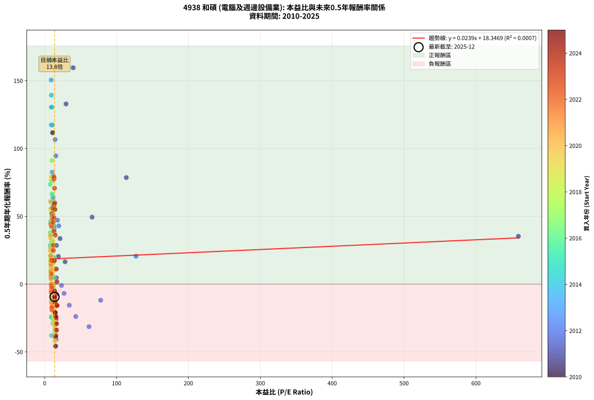
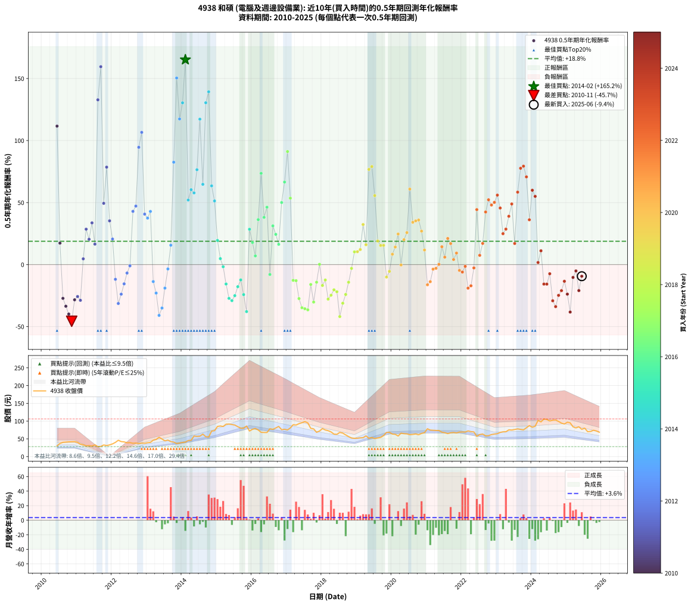

# 4938 和碩 - 本益比與未來報酬率分析

!!! info "報告資訊"
    - **股票代號**: 4938
    - **公司名稱**: 和碩
    - **產業別**: 電腦及週邊設備業
    - **分析期間**: 2010-2025 (181 個數據點)
    - **資料來源**: Type 12 (ShowMonthlyK_ChartFlow) 月收盤價與本益比
    - **報酬率口徑**: 含現金股利 (簡化: 年度合計，假設每年7/1入帳)
    - **報告生成時間**: 2026-01-04 08:50:25 CST

## 📈 視覺化圖表

### 圖表1: 本益比 vs 未來報酬率關係

*圖表1：4938 和碩 本益比與0.5年期未來報酬率關係 (2010-2025)*

### 圖表2: 歷年買入時點的0.5年期實際報酬率

*圖表2：4938 和碩 歷年買入時點的0.5年期實際報酬率 (2010-2025)*

## 📍 買點訊號說明

本報告提供兩種買點提示訊號（顯示於圖表2的股價子圖中）：

### ▲ 小綠色三角形（回測驗證）
- **計算方式**: 使用全部歷史資料計算本益比第25百分位數
- **用途**: 事後驗證，顯示歷史上哪些時點確實為低估區
- **限制**: 當下無法判斷，僅供回測參考
- **特性**: 後見之明（Look-Ahead Bias）

### ▲ 小橘色三角形（即時訊號）
- **計算方式**: 使用截至當月的過去5年資料計算本益比第25百分位數
- **用途**: 實際投資決策，當時即可判斷
- **優勢**: 可操作性強，符合實務需求
- **特性**: 無後見之明，滾動窗口計算

!!! tip "如何使用兩種訊號"
    - **綠色▲** 幫助理解歷史估值機會，驗證策略有效性
    - **橘色▲** 可作為實際買進參考，但仍需搭配基本面分析
    - 兩種訊號重疊時，表示即時判斷與事後驗證一致，信心度較高
    - 僅有綠色▲時，表示當時無法判斷（需要未來資料才能確認）
    - 僅有橘色▲時，表示即時判斷為買點，但事後可能不是最佳時機

## 📊 估值分析摘要

| 指標 | 數值 |
|:---:|:---:|
| **目前本益比** (2025-06) | **13.76 倍** |
| **歷史平均本益比** | 18.37 倍 |
| **估值水準** | 🟢 相對低估 |
| **預期0.5年年化報酬率** | **+18.68%** |
| **歷史平均報酬率** | +18.79% |
| **相關係數 (R²)** | 0.0007 |
| **趨勢線斜率** | 0.0239 |

!!! abstract "核心洞察"
    目前本益比顯著低於歷史平均，預期未來報酬率可能較高

    根據歷史數據回測，4938 和碩 在目前本益比 **13.8倍** 的估值水準下，
    預期未來0.5年年化報酬率約為 **+18.7%**。

    **重要提醒**: 本分析基於歷史數據統計，實際報酬率會受到公司基本面變化、產業趨勢、
    總體經濟環境等多重因素影響。R² = 0.00 表示本益比可解釋約 0.1% 的報酬率變異。

## 📈 歷史估值統計

### 最佳買點 (最高報酬率)

| 項目 | 數值 |
|:---:|:---:|
| 起始時間 | 2014-02 |
| 當時本益比 | 9.03 倍 |
| 起始價格 | 40.7 元 |
| 0.5年後價格 | 63.4 元 |
| **0.5年年化報酬率** | **+165.19%** |

### 最差買點 (最低報酬率)

| 項目 | 數值 |
|:---:|:---:|
| 起始時間 | 2010-11 |
| 當時本益比 | 15.29 倍 |
| 起始價格 | 41.8 元 |
| 0.5年後價格 | 30.9 元 |
| **0.5年年化報酬率** | **-45.70%** |

## 🎯 投資啟示

### 本益比與報酬率關係

趨勢線方程式: **y = 0.0239x + 18.3469**

!!! info "弱相關或正相關"
    本益比與未來報酬率相關性較弱。這可能表示該股票的報酬率更多受到
    公司成長性、產業趨勢等因素影響，而非估值水準。**需綜合考量多項指標**。

### 估值區間建議

基於歷史數據分析:

- **🟢 低估區** (P/E < 14.7): 預期報酬率較高，可考慮增加持股
- **🟡 合理區** (P/E 14.7-22.0): 預期報酬率符合長期趨勢，正常持有
- **🔴 高估區** (P/E > 22.0): 預期報酬率較低，可考慮減碼或觀望

!!! danger "風險提示"
    - 過去表現不代表未來結果
    - 本分析假設公司基本面無重大結構性變化
    - 產業環境劇變可能使歷史規律失效
    - 應結合公司財報、產業趨勢、總體經濟等多重因素綜合判斷

!!! success "長期投資觀點"
    歷史數據顯示，在合理或低估的估值水準買入並長期持有，
    往往能獲得較佳的投資報酬。**耐心等待好價格**是價值投資的核心原則。

## 📊 數據品質

- **資料來源**: GoodInfo.tw Type 12 (ShowMonthlyK_ChartFlow)
- **資料頻率**: 月度收盤價與本益比
- **回測期間**: 2010-2025
- **數據點數量**: 181 個 (每個點代表一次0.5年期回測)

### 計算方法說明

1. **0.5年期年化報酬率**:
   - 對每個歷史時點，計算其後0.5年的實際投資報酬率
   - 期末價值(不含股利): 期末價格
   - 期末價值(含現金股利): 期末價格 + 持有期間內的現金股利合計 (簡化: 年度合計，假設每年7/1入帳)
   - 公式: 年化報酬率 = [(期末價值/期初價格)^(1/年數) - 1] × 100%

2. **本益比 (P/E Ratio)**:
   - 使用當時的月收盤價與EPS計算
   - 資料來源: Type 12 月度河流圖本益比數據

3. **趨勢線 (Linear Regression)**:
   - 使用最小平方法擬合線性趨勢線
   - R²值衡量本益比對報酬率的解釋能力

---

*本報告由 Stock Analysis System v1.9.0 自動生成*
*數據更新時間: 2026-01-04 08:50:25 CST*

## 📋 月度回測明細表

（每一列對應時間線圖中的一個買入點；可用來對照 SVG 圖上的每個點。）

| 買入月份 | 賣出月份 | 回測期限_年 | 實際持有年數 | 買入本益比_倍 | 買入收盤價_元 | 賣出收盤價_元 | 現金股利合計_元 | 總報酬率_pct | 年化報酬率_pct |
| --- | --- | --- | --- | --- | --- | --- | --- | --- | --- |
| 2010-06 | 2010-12 | 0.5 | 0.501 | 11.01 | 30.05 | 42.00 | 1.75 | +45.59 | +111.64 |
| 2010-07 | 2011-01 | 0.5 | 0.504 | 13.55 | 37.00 | 40.10 | 0.00 | +8.38 | +17.32 |
| 2010-08 | 2011-03 | 0.5 | 0.580 | 14.69 | 40.10 | 33.35 | 0.00 | -16.83 | -27.21 |
| 2010-09 | 2011-03 | 0.5 | 0.496 | 14.96 | 40.85 | 33.35 | 0.00 | -18.36 | -33.59 |
| 2010-10 | 2011-05 | 0.5 | 0.580 | 15.18 | 41.45 | 30.85 | 0.00 | -25.57 | -39.88 |
| 2010-11 | 2011-05 | 0.5 | 0.496 | 15.29 | 41.75 | 30.85 | 0.00 | -26.11 | -45.70 |
| 2010-12 | 2011-07 | 0.5 | 0.580 | 15.38 | 42.00 | 33.15 | 1.45 | -17.62 | -28.39 |
| 2011-01 | 2011-07 | 0.5 | 0.496 | 16.00 | 40.10 | 33.15 | 1.45 | -13.72 | -25.75 |
| 2011-02 | 2011-08 | 0.5 | 0.498 | 15.33 | 35.00 | 28.10 | 1.45 | -15.57 | -28.80 |
| 2011-03 | 2011-10 | 0.5 | 0.586 | 16.19 | 33.35 | 32.80 | 1.45 | +2.70 | +4.65 |
| 2011-04 | 2011-10 | 0.5 | 0.501 | 16.44 | 30.20 | 32.80 | 1.45 | +13.41 | +28.55 |
| 2011-05 | 2011-12 | 0.5 | 0.586 | 19.12 | 30.85 | 32.95 | 1.45 | +11.51 | +20.43 |
| 2011-06 | 2011-12 | 0.5 | 0.501 | 21.40 | 29.75 | 32.95 | 1.45 | +15.63 | +33.62 |
| 2011-07 | 2012-01 | 0.5 | 0.504 | 28.41 | 33.15 | 35.80 | 0.00 | +7.99 | +16.49 |
| 2011-08 | 2012-03 | 0.5 | 0.583 | 29.79 | 28.10 | 46.00 | 0.00 | +63.70 | +132.84 |
| 2011-09 | 2012-03 | 0.5 | 0.498 | 39.72 | 28.60 | 46.00 | 0.00 | +60.84 | +159.54 |
| 2011-10 | 2012-05 | 0.5 | 0.583 | 66.04 | 32.80 | 41.45 | 0.00 | +26.37 | +49.39 |
| 2011-11 | 2012-05 | 0.5 | 0.498 | 113.60 | 31.05 | 41.45 | 0.00 | +33.49 | +78.56 |
| 2011-12 | 2012-07 | 0.5 | 0.583 | 659.00 | 32.95 | 39.30 | 0.00 | +19.27 | +35.28 |
| 2012-01 | 2012-07 | 0.5 | 0.498 | 127.10 | 35.80 | 39.30 | 0.00 | +9.78 | +20.59 |
| 2012-02 | 2012-08 | 0.5 | 0.501 | 77.92 | 40.00 | 37.55 | 0.00 | -6.13 | -11.85 |
| 2012-03 | 2012-10 | 0.5 | 0.586 | 61.74 | 46.00 | 36.90 | 0.00 | -19.78 | -31.36 |
| 2012-04 | 2012-10 | 0.5 | 0.501 | 43.31 | 42.30 | 36.90 | 0.00 | -12.77 | -23.86 |
| 2012-05 | 2012-12 | 0.5 | 0.586 | 34.30 | 41.45 | 37.55 | 0.00 | -9.41 | -15.52 |
| 2012-06 | 2012-12 | 0.5 | 0.501 | 27.01 | 38.90 | 37.55 | 0.00 | -3.47 | -6.81 |
| 2012-07 | 2013-01 | 0.5 | 0.504 | 23.51 | 39.30 | 39.10 | 0.00 | -0.51 | -1.01 |
| 2012-08 | 2013-03 | 0.5 | 0.580 | 19.73 | 37.55 | 46.20 | 0.00 | +23.04 | +42.93 |
| 2012-09 | 2013-03 | 0.5 | 0.496 | 17.87 | 38.15 | 46.20 | 0.00 | +21.10 | +47.16 |
| 2012-10 | 2013-05 | 0.5 | 0.580 | 15.59 | 36.90 | 54.30 | 0.00 | +47.15 | +94.56 |
| 2012-11 | 2013-05 | 0.5 | 0.496 | 14.59 | 37.90 | 54.30 | 0.00 | +43.27 | +106.60 |
| 2012-12 | 2013-07 | 0.5 | 0.580 | 13.27 | 37.55 | 44.30 | 1.48 | +21.92 | +40.70 |
| 2013-01 | 2013-07 | 0.5 | 0.496 | 13.30 | 39.10 | 44.30 | 1.48 | +17.09 | +37.48 |
| 2013-02 | 2013-08 | 0.5 | 0.498 | 13.11 | 40.00 | 46.30 | 1.48 | +19.45 | +42.86 |
| 2013-03 | 2013-10 | 0.5 | 0.586 | 14.61 | 46.20 | 40.90 | 1.48 | -8.27 | -13.69 |
| 2013-04 | 2013-10 | 0.5 | 0.501 | 14.76 | 48.30 | 40.90 | 1.48 | -12.25 | -22.97 |
| 2013-05 | 2013-12 | 0.5 | 0.586 | 16.05 | 54.30 | 38.40 | 1.48 | -26.55 | -40.95 |
| 2013-06 | 2013-12 | 0.5 | 0.501 | 14.16 | 49.50 | 38.40 | 1.48 | -19.43 | -35.03 |
| 2013-07 | 2014-01 | 0.5 | 0.504 | 12.29 | 44.30 | 39.85 | 0.00 | -10.05 | -18.95 |
| 2013-08 | 2014-03 | 0.5 | 0.580 | 12.46 | 46.30 | 45.35 | 0.00 | -2.05 | -3.51 |
| 2013-09 | 2014-03 | 0.5 | 0.496 | 11.03 | 42.20 | 45.35 | 0.00 | +7.46 | +15.64 |
| 2013-10 | 2014-05 | 0.5 | 0.580 | 10.39 | 40.90 | 58.00 | 0.00 | +41.81 | +82.54 |
| 2013-11 | 2014-05 | 0.5 | 0.496 | 9.09 | 36.80 | 58.00 | 0.00 | +57.61 | +150.44 |
| 2013-12 | 2014-07 | 0.5 | 0.580 | 9.23 | 38.40 | 57.50 | 2.77 | +56.95 | +117.40 |
| 2014-01 | 2014-07 | 0.5 | 0.496 | 9.20 | 39.85 | 57.50 | 2.77 | +51.24 | +130.43 |
| 2014-02 | 2014-08 | 0.5 | 0.498 | 9.03 | 40.70 | 63.40 | 2.77 | +62.57 | +165.19 |
| 2014-03 | 2014-10 | 0.5 | 0.586 | 9.69 | 45.35 | 55.20 | 2.77 | +27.82 | +52.04 |
| 2014-04 | 2014-10 | 0.5 | 0.501 | 9.43 | 45.75 | 55.20 | 2.77 | +26.71 | +60.39 |
| 2014-05 | 2014-12 | 0.5 | 0.586 | 11.54 | 58.00 | 73.00 | 2.77 | +30.63 | +57.79 |
| 2014-06 | 2014-12 | 0.5 | 0.501 | 10.96 | 57.00 | 73.00 | 2.77 | +32.93 | +76.49 |
| 2014-07 | 2015-01 | 0.5 | 0.504 | 10.70 | 57.50 | 85.00 | 0.00 | +47.83 | +117.25 |
| 2014-08 | 2015-03 | 0.5 | 0.580 | 11.43 | 63.40 | 84.70 | 0.00 | +33.60 | +64.71 |
| 2014-09 | 2015-03 | 0.5 | 0.496 | 9.79 | 56.00 | 84.70 | 0.00 | +51.25 | +130.47 |
| 2014-10 | 2015-05 | 0.5 | 0.580 | 9.37 | 55.20 | 91.60 | 0.00 | +65.94 | +139.31 |
| 2014-11 | 2015-05 | 0.5 | 0.496 | 11.84 | 71.80 | 91.60 | 0.00 | +27.58 | +63.47 |
| 2014-12 | 2015-07 | 0.5 | 0.580 | 11.70 | 73.00 | 88.80 | 4.04 | +27.17 | +51.31 |
| 2015-01 | 2015-07 | 0.5 | 0.496 | 13.10 | 85.00 | 88.80 | 4.04 | +9.22 | +19.48 |
| 2015-02 | 2015-08 | 0.5 | 0.498 | 12.79 | 86.20 | 84.20 | 4.04 | +2.36 | +4.80 |
| 2015-03 | 2015-10 | 0.5 | 0.586 | 12.12 | 84.70 | 79.80 | 4.04 | -1.02 | -1.73 |
| 2015-04 | 2015-10 | 0.5 | 0.501 | 12.62 | 91.30 | 79.80 | 4.04 | -8.17 | -15.65 |
| 2015-05 | 2015-12 | 0.5 | 0.586 | 12.24 | 91.60 | 72.00 | 4.04 | -16.99 | -27.23 |
| 2015-06 | 2015-12 | 0.5 | 0.501 | 11.67 | 90.30 | 72.00 | 4.04 | -15.80 | -29.05 |
| 2015-07 | 2016-01 | 0.5 | 0.504 | 11.12 | 88.80 | 76.80 | 0.00 | -13.51 | -25.04 |
| 2015-08 | 2016-03 | 0.5 | 0.583 | 10.23 | 84.20 | 75.10 | 0.00 | -10.81 | -17.81 |
| 2015-09 | 2016-03 | 0.5 | 0.498 | 9.45 | 80.20 | 75.10 | 0.00 | -6.36 | -12.35 |
| 2015-10 | 2016-05 | 0.5 | 0.583 | 9.14 | 79.80 | 67.90 | 0.00 | -14.91 | -24.19 |
| 2015-11 | 2016-05 | 0.5 | 0.498 | 9.59 | 86.10 | 67.90 | 0.00 | -21.14 | -37.91 |
| 2015-12 | 2016-07 | 0.5 | 0.583 | 7.80 | 72.00 | 78.30 | 5.03 | +15.74 | +28.48 |
| 2016-01 | 2016-07 | 0.5 | 0.498 | 8.45 | 76.80 | 78.30 | 5.03 | +8.50 | +17.79 |
| 2016-02 | 2016-08 | 0.5 | 0.501 | 8.84 | 79.00 | 76.70 | 5.03 | +3.46 | +7.02 |
| 2016-03 | 2016-10 | 0.5 | 0.586 | 8.54 | 75.10 | 85.00 | 5.03 | +19.88 | +36.27 |
| 2016-04 | 2016-10 | 0.5 | 0.501 | 7.89 | 68.30 | 85.00 | 5.03 | +31.82 | +73.56 |
| 2016-05 | 2016-12 | 0.5 | 0.586 | 7.98 | 67.90 | 77.00 | 5.03 | +20.81 | +38.08 |
| 2016-06 | 2016-12 | 0.5 | 0.501 | 8.11 | 67.80 | 77.00 | 5.03 | +20.99 | +46.27 |
| 2016-07 | 2017-01 | 0.5 | 0.504 | 9.52 | 78.30 | 75.10 | 0.00 | -4.09 | -7.95 |
| 2016-08 | 2017-03 | 0.5 | 0.580 | 9.50 | 76.70 | 89.80 | 0.00 | +17.08 | +31.22 |
| 2016-09 | 2017-03 | 0.5 | 0.496 | 10.16 | 80.60 | 89.80 | 0.00 | +11.41 | +24.37 |
| 2016-10 | 2017-05 | 0.5 | 0.580 | 10.91 | 85.00 | 92.80 | 0.00 | +9.18 | +16.33 |
| 2016-11 | 2017-05 | 0.5 | 0.496 | 9.93 | 75.90 | 92.80 | 0.00 | +22.27 | +50.03 |
| 2016-12 | 2017-07 | 0.5 | 0.580 | 10.27 | 77.00 | 98.60 | 4.93 | +34.45 | +66.54 |
| 2017-01 | 2017-07 | 0.5 | 0.496 | 10.22 | 75.10 | 98.60 | 4.93 | +37.85 | +91.14 |
| 2017-02 | 2017-08 | 0.5 | 0.498 | 11.22 | 80.70 | 95.00 | 4.93 | +23.83 | +53.56 |
| 2017-03 | 2017-10 | 0.5 | 0.586 | 12.76 | 89.80 | 78.00 | 4.93 | -7.65 | -12.70 |
| 2017-04 | 2017-10 | 0.5 | 0.501 | 12.91 | 88.90 | 78.00 | 4.93 | -6.72 | -12.96 |
| 2017-05 | 2017-12 | 0.5 | 0.586 | 13.78 | 92.80 | 72.00 | 4.93 | -17.10 | -27.39 |
| 2017-06 | 2017-12 | 0.5 | 0.501 | 14.48 | 95.30 | 72.00 | 4.93 | -19.28 | -34.78 |
| 2017-07 | 2018-01 | 0.5 | 0.504 | 15.34 | 98.60 | 79.00 | 0.00 | -19.88 | -35.59 |
| 2017-08 | 2018-03 | 0.5 | 0.580 | 15.14 | 95.00 | 73.00 | 0.00 | -23.16 | -36.48 |
| 2017-09 | 2018-03 | 0.5 | 0.496 | 13.01 | 79.60 | 73.00 | 0.00 | -8.29 | -16.03 |
| 2017-10 | 2018-05 | 0.5 | 0.580 | 13.07 | 78.00 | 63.30 | 0.00 | -18.85 | -30.22 |
| 2017-11 | 2018-05 | 0.5 | 0.496 | 11.75 | 68.30 | 63.30 | 0.00 | -7.32 | -14.22 |
| 2017-12 | 2018-07 | 0.5 | 0.580 | 12.72 | 72.00 | 68.10 | 4.00 | +0.14 | +0.24 |
| 2018-01 | 2018-07 | 0.5 | 0.496 | 14.25 | 79.00 | 68.10 | 4.00 | -8.73 | -16.84 |
| 2018-02 | 2018-08 | 0.5 | 0.498 | 13.82 | 75.00 | 66.20 | 4.00 | -6.40 | -12.43 |
| 2018-03 | 2018-10 | 0.5 | 0.586 | 13.75 | 73.00 | 56.30 | 4.00 | -17.39 | -27.83 |
| 2018-04 | 2018-10 | 0.5 | 0.501 | 13.39 | 69.50 | 56.30 | 4.00 | -13.23 | -24.67 |
| 2018-05 | 2018-12 | 0.5 | 0.586 | 12.48 | 63.30 | 51.40 | 4.00 | -12.48 | -20.34 |
| 2018-06 | 2018-12 | 0.5 | 0.501 | 12.65 | 62.70 | 51.40 | 4.00 | -11.64 | -21.88 |
| 2018-07 | 2019-01 | 0.5 | 0.504 | 14.08 | 68.10 | 51.80 | 0.00 | -23.94 | -41.90 |
| 2018-08 | 2019-03 | 0.5 | 0.580 | 14.03 | 66.20 | 53.30 | 0.00 | -19.49 | -31.16 |
| 2018-09 | 2019-03 | 0.5 | 0.496 | 13.28 | 61.10 | 53.30 | 0.00 | -12.77 | -24.09 |
| 2018-10 | 2019-05 | 0.5 | 0.580 | 12.55 | 56.30 | 51.50 | 0.00 | -8.53 | -14.23 |
| 2018-11 | 2019-05 | 0.5 | 0.496 | 11.97 | 52.30 | 51.50 | 0.00 | -1.53 | -3.06 |
| 2018-12 | 2019-07 | 0.5 | 0.580 | 12.09 | 51.40 | 50.90 | 3.50 | +5.84 | +10.27 |
| 2019-01 | 2019-07 | 0.5 | 0.496 | 11.48 | 51.80 | 50.90 | 3.50 | +5.02 | +10.39 |
| 2019-02 | 2019-08 | 0.5 | 0.498 | 11.06 | 52.80 | 52.40 | 3.50 | +5.87 | +12.14 |
| 2019-03 | 2019-10 | 0.5 | 0.586 | 10.58 | 53.30 | 59.30 | 3.50 | +17.83 | +32.31 |
| 2019-04 | 2019-10 | 0.5 | 0.501 | 11.00 | 58.30 | 59.30 | 3.50 | +7.72 | +16.00 |
| 2019-05 | 2019-12 | 0.5 | 0.586 | 9.26 | 51.50 | 68.40 | 3.50 | +39.61 | +76.75 |
| 2019-06 | 2019-12 | 0.5 | 0.501 | 9.22 | 53.70 | 68.40 | 3.50 | +33.89 | +79.06 |
| 2019-07 | 2020-01 | 0.5 | 0.504 | 8.36 | 50.90 | 63.60 | 0.00 | +24.95 | +55.61 |
| 2019-08 | 2020-03 | 0.5 | 0.583 | 8.25 | 52.40 | 58.00 | 0.00 | +10.69 | +19.02 |
| 2019-09 | 2020-03 | 0.5 | 0.498 | 8.17 | 54.00 | 58.00 | 0.00 | +7.41 | +15.42 |
| 2019-10 | 2020-05 | 0.5 | 0.583 | 8.63 | 59.30 | 64.50 | 0.00 | +8.77 | +15.50 |
| 2019-11 | 2020-05 | 0.5 | 0.498 | 9.53 | 68.00 | 64.50 | 0.00 | -5.15 | -10.06 |
| 2019-12 | 2020-07 | 0.5 | 0.583 | 9.24 | 68.40 | 61.70 | 4.50 | -3.22 | -5.45 |
| 2020-01 | 2020-07 | 0.5 | 0.498 | 8.56 | 63.60 | 61.70 | 4.50 | +4.09 | +8.37 |
| 2020-02 | 2020-08 | 0.5 | 0.501 | 8.41 | 62.70 | 62.50 | 4.50 | +6.86 | +14.16 |
| 2020-03 | 2020-10 | 0.5 | 0.586 | 7.75 | 58.00 | 61.50 | 4.50 | +13.79 | +24.67 |
| 2020-04 | 2020-10 | 0.5 | 0.501 | 8.80 | 66.10 | 61.50 | 4.50 | -0.15 | -0.30 |
| 2020-05 | 2020-12 | 0.5 | 0.586 | 8.56 | 64.50 | 67.30 | 4.50 | +11.32 | +20.08 |
| 2020-06 | 2020-12 | 0.5 | 0.501 | 8.46 | 64.00 | 67.30 | 4.50 | +12.19 | +25.80 |
| 2020-07 | 2021-01 | 0.5 | 0.504 | 8.13 | 61.70 | 78.40 | 0.00 | +27.07 | +60.88 |
| 2020-08 | 2021-03 | 0.5 | 0.580 | 8.20 | 62.50 | 74.10 | 0.00 | +18.56 | +34.09 |
| 2020-09 | 2021-03 | 0.5 | 0.496 | 8.34 | 63.80 | 74.10 | 0.00 | +16.14 | +35.26 |
| 2020-10 | 2021-05 | 0.5 | 0.580 | 8.01 | 61.50 | 73.50 | 0.00 | +19.51 | +35.95 |
| 2020-11 | 2021-05 | 0.5 | 0.496 | 8.48 | 65.30 | 73.50 | 0.00 | +12.56 | +26.96 |
| 2020-12 | 2021-07 | 0.5 | 0.580 | 8.71 | 67.30 | 67.30 | 4.49 | +6.67 | +11.77 |
| 2021-01 | 2021-07 | 0.5 | 0.496 | 10.14 | 78.40 | 67.30 | 4.49 | -8.43 | -16.29 |
| 2021-02 | 2021-08 | 0.5 | 0.498 | 9.65 | 74.60 | 64.80 | 4.49 | -7.12 | -13.78 |
| 2021-03 | 2021-10 | 0.5 | 0.586 | 9.59 | 74.10 | 68.00 | 4.49 | -2.17 | -3.68 |
| 2021-04 | 2021-10 | 0.5 | 0.501 | 9.53 | 73.60 | 68.00 | 4.49 | -1.51 | -2.99 |
| 2021-05 | 2021-12 | 0.5 | 0.586 | 9.52 | 73.50 | 69.10 | 4.49 | +0.12 | +0.21 |
| 2021-06 | 2021-12 | 0.5 | 0.501 | 8.91 | 68.80 | 69.10 | 4.49 | +6.96 | +14.37 |
| 2021-07 | 2022-01 | 0.5 | 0.504 | 8.72 | 67.30 | 69.30 | 0.00 | +2.97 | +5.99 |
| 2021-08 | 2022-03 | 0.5 | 0.580 | 8.40 | 64.80 | 72.40 | 0.00 | +11.73 | +21.05 |
| 2021-09 | 2022-03 | 0.5 | 0.496 | 8.68 | 67.00 | 72.40 | 0.00 | +8.06 | +16.93 |
| 2021-10 | 2022-05 | 0.5 | 0.580 | 8.82 | 68.00 | 69.60 | 0.00 | +2.35 | +4.09 |
| 2021-11 | 2022-05 | 0.5 | 0.496 | 8.64 | 66.60 | 69.60 | 0.00 | +4.50 | +9.30 |
| 2021-12 | 2022-07 | 0.5 | 0.580 | 8.96 | 69.10 | 62.20 | 5.00 | -2.75 | -4.69 |
| 2022-01 | 2022-07 | 0.5 | 0.496 | 9.19 | 69.30 | 62.20 | 5.00 | -3.03 | -6.02 |
| 2022-02 | 2022-08 | 0.5 | 0.498 | 9.38 | 69.10 | 63.60 | 5.00 | -0.72 | -1.44 |
| 2022-03 | 2022-10 | 0.5 | 0.586 | 10.06 | 72.40 | 59.00 | 5.00 | -11.60 | -18.98 |
| 2022-04 | 2022-10 | 0.5 | 0.501 | 10.00 | 70.30 | 59.00 | 5.00 | -8.96 | -17.09 |
| 2022-05 | 2022-12 | 0.5 | 0.586 | 10.15 | 69.60 | 63.50 | 5.00 | -1.58 | -2.68 |
| 2022-06 | 2022-12 | 0.5 | 0.501 | 8.53 | 57.00 | 63.50 | 5.00 | +20.18 | +44.32 |
| 2022-07 | 2023-01 | 0.5 | 0.504 | 9.55 | 62.20 | 64.50 | 0.00 | +3.70 | +7.47 |
| 2022-08 | 2023-03 | 0.5 | 0.580 | 10.03 | 63.60 | 69.70 | 0.00 | +9.59 | +17.09 |
| 2022-09 | 2023-03 | 0.5 | 0.496 | 9.48 | 58.50 | 69.70 | 0.00 | +19.15 | +42.40 |
| 2022-10 | 2023-05 | 0.5 | 0.580 | 9.83 | 59.00 | 75.30 | 0.00 | +27.63 | +52.24 |
| 2022-11 | 2023-05 | 0.5 | 0.496 | 10.63 | 62.00 | 75.30 | 0.00 | +21.45 | +48.02 |
| 2022-12 | 2023-07 | 0.5 | 0.580 | 11.22 | 63.50 | 76.40 | 4.00 | +26.62 | +50.17 |
| 2023-01 | 2023-07 | 0.5 | 0.496 | 11.36 | 64.50 | 76.40 | 4.00 | +24.66 | +56.01 |
| 2023-02 | 2023-08 | 0.5 | 0.498 | 11.93 | 68.00 | 78.00 | 4.00 | +20.59 | +45.61 |
| 2023-03 | 2023-10 | 0.5 | 0.586 | 12.19 | 69.70 | 75.40 | 4.00 | +13.92 | +24.91 |
| 2023-04 | 2023-10 | 0.5 | 0.501 | 12.20 | 70.00 | 75.40 | 4.00 | +13.43 | +28.60 |
| 2023-05 | 2023-12 | 0.5 | 0.586 | 13.07 | 75.30 | 87.30 | 4.00 | +21.25 | +38.94 |
| 2023-06 | 2023-12 | 0.5 | 0.501 | 12.94 | 74.80 | 87.30 | 4.00 | +22.06 | +48.87 |
| 2023-07 | 2024-01 | 0.5 | 0.504 | 13.17 | 76.40 | 82.70 | 0.00 | +8.25 | +17.03 |
| 2023-08 | 2024-03 | 0.5 | 0.583 | 13.40 | 78.00 | 102.00 | 0.00 | +30.77 | +58.41 |
| 2023-09 | 2024-03 | 0.5 | 0.498 | 13.12 | 76.60 | 102.00 | 0.00 | +33.16 | +77.66 |
| 2023-10 | 2024-05 | 0.5 | 0.583 | 12.87 | 75.40 | 106.00 | 0.00 | +40.58 | +79.34 |
| 2023-11 | 2024-05 | 0.5 | 0.498 | 13.81 | 81.20 | 106.00 | 0.00 | +30.54 | +70.72 |
| 2023-12 | 2024-07 | 0.5 | 0.583 | 14.80 | 87.30 | 100.50 | 4.00 | +19.70 | +36.12 |
| 2024-01 | 2024-07 | 0.5 | 0.498 | 13.93 | 82.70 | 100.50 | 4.00 | +26.36 | +59.93 |
| 2024-02 | 2024-08 | 0.5 | 0.501 | 14.31 | 85.50 | 102.50 | 4.00 | +24.56 | +55.02 |
| 2024-03 | 2024-10 | 0.5 | 0.586 | 16.97 | 102.00 | 99.00 | 4.00 | +0.98 | +1.68 |
| 2024-04 | 2024-10 | 0.5 | 0.501 | 16.16 | 97.70 | 99.00 | 4.00 | +5.43 | +11.12 |
| 2024-05 | 2024-12 | 0.5 | 0.586 | 17.42 | 106.00 | 91.90 | 4.00 | -9.53 | -15.71 |
| 2024-06 | 2024-12 | 0.5 | 0.501 | 17.08 | 104.50 | 91.90 | 4.00 | -8.23 | -15.75 |
| 2024-07 | 2025-01 | 0.5 | 0.504 | 16.32 | 100.50 | 96.70 | 0.00 | -3.78 | -7.37 |
| 2024-08 | 2025-03 | 0.5 | 0.580 | 16.55 | 102.50 | 83.90 | 0.00 | -18.15 | -29.18 |
| 2024-09 | 2025-03 | 0.5 | 0.496 | 16.53 | 103.00 | 83.90 | 0.00 | -18.54 | -33.89 |
| 2024-10 | 2025-05 | 0.5 | 0.580 | 15.80 | 99.00 | 83.90 | 0.00 | -15.25 | -24.81 |
| 2024-11 | 2025-05 | 0.5 | 0.496 | 14.96 | 94.30 | 83.90 | 0.00 | -11.03 | -21.01 |
| 2024-12 | 2025-07 | 0.5 | 0.580 | 14.50 | 91.90 | 80.00 | 4.50 | -8.05 | -13.46 |
| 2025-01 | 2025-07 | 0.5 | 0.496 | 15.56 | 96.70 | 80.00 | 4.50 | -12.61 | -23.82 |
| 2025-02 | 2025-08 | 0.5 | 0.498 | 15.61 | 95.00 | 70.20 | 4.50 | -21.37 | -38.27 |
| 2025-03 | 2025-10 | 0.5 | 0.586 | 14.08 | 83.90 | 74.20 | 4.50 | -6.19 | -10.34 |
| 2025-04 | 2025-10 | 0.5 | 0.501 | 13.85 | 80.80 | 74.20 | 4.50 | -2.60 | -5.11 |
| 2025-05 | 2025-12 | 0.5 | 0.586 | 14.70 | 83.90 | 68.60 | 4.50 | -12.87 | -20.95 |
| 2025-06 | 2025-12 | 0.5 | 0.501 | 13.76 | 76.80 | 68.60 | 4.50 | -4.81 | -9.38 |
