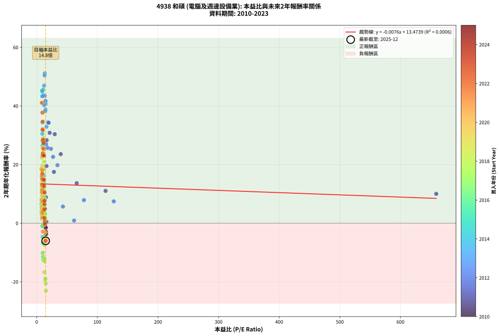
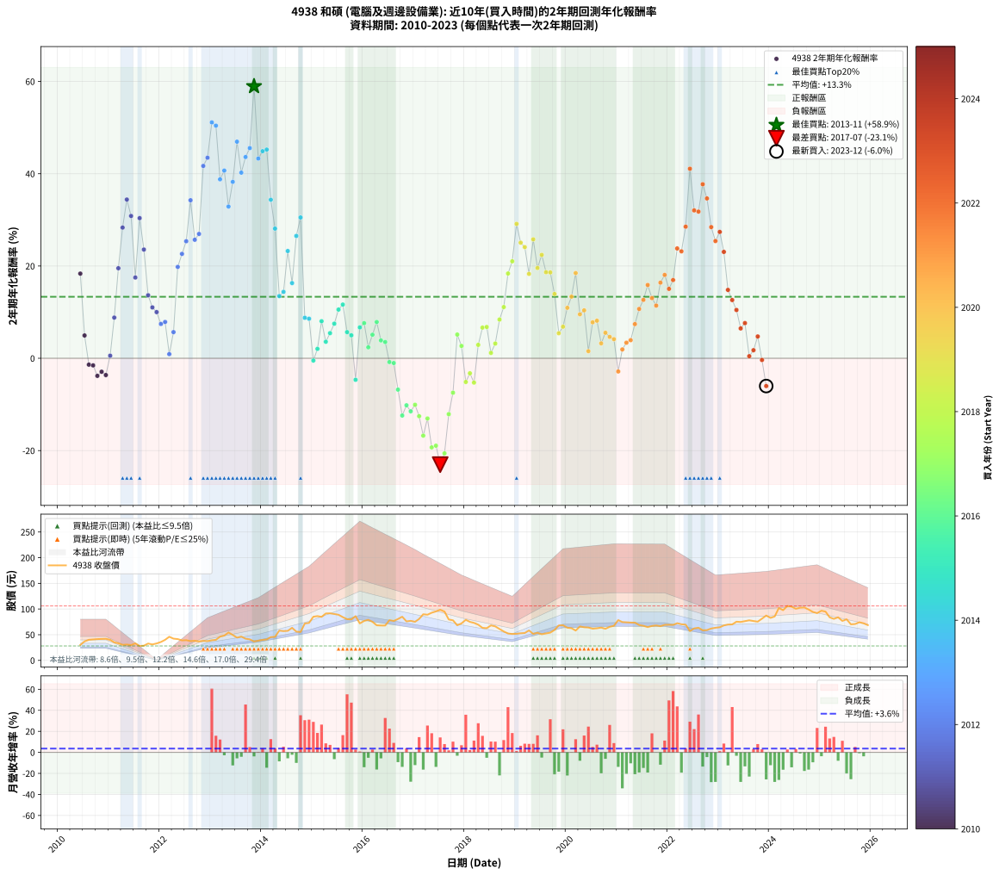

# 4938 和碩 - 本益比與未來報酬率分析

!!! info "報告資訊"
    - **股票代號**: 4938
    - **公司名稱**: 和碩
    - **產業別**: 電腦及週邊設備業
    - **分析期間**: 2010-2023 (163 個數據點)
    - **資料來源**: Type 12 (ShowMonthlyK_ChartFlow) 月收盤價與本益比
    - **報酬率口徑**: 含現金股利 (簡化: 年度合計，假設每年7/1入帳)
    - **報告生成時間**: 2026-01-05 21:06:40 CST

## 📈 視覺化圖表

### 圖表1: 本益比 vs 未來報酬率關係

*圖表1：4938 和碩 本益比與2年期未來報酬率關係 (2010-2023)*

### 圖表2: 歷年買入時點的2年期實際報酬率

*圖表2：4938 和碩 歷年買入時點的2年期實際報酬率 (2010-2023)*

## 📍 買點訊號說明

本報告提供兩種買點提示訊號（顯示於圖表2的股價子圖中）：

### ▲ 小綠色三角形（回測驗證）
- **計算方式**: 使用全部歷史資料計算本益比第25百分位數
- **用途**: 事後驗證，顯示歷史上哪些時點確實為低估區
- **限制**: 當下無法判斷，僅供回測參考
- **特性**: 後見之明（Look-Ahead Bias）

### ▲ 小橘色三角形（即時訊號）
- **計算方式**: 使用截至當月的過去5年資料計算本益比第25百分位數
- **用途**: 實際投資決策，當時即可判斷
- **優勢**: 可操作性強，符合實務需求
- **特性**: 無後見之明，滾動窗口計算

!!! tip "如何使用兩種訊號"
    - **綠色▲** 幫助理解歷史估值機會，驗證策略有效性
    - **橘色▲** 可作為實際買進參考，但仍需搭配基本面分析
    - 兩種訊號重疊時，表示即時判斷與事後驗證一致，信心度較高
    - 僅有綠色▲時，表示當時無法判斷（需要未來資料才能確認）
    - 僅有橘色▲時，表示即時判斷為買點，但事後可能不是最佳時機

## 📊 估值分析摘要

| 指標 | 數值 |
|:---:|:---:|
| **目前本益比** (2023-12) | **14.80 倍** |
| **歷史平均本益比** | 18.69 倍 |
| **估值水準** | 🟢 相對低估 |
| **預期2年年化報酬率** | **+13.36%** |
| **歷史平均報酬率** | +13.33% |
| **相關係數 (R²)** | 0.0006 |
| **趨勢線斜率** | -0.0076 |

!!! abstract "核心洞察"
    目前本益比顯著低於歷史平均，預期未來報酬率可能較高

    根據歷史數據回測，4938 和碩 在目前本益比 **14.8倍** 的估值水準下，
    預期未來2年年化報酬率約為 **+13.4%**。

    **重要提醒**: 本分析基於歷史數據統計，實際報酬率會受到公司基本面變化、產業趨勢、
    總體經濟環境等多重因素影響。R² = 0.00 表示本益比可解釋約 0.1% 的報酬率變異。

## 📈 歷史估值統計

### 最佳買點 (最高報酬率)

| 項目 | 數值 |
|:---:|:---:|
| 起始時間 | 2013-11 |
| 當時本益比 | 9.09 倍 |
| 起始價格 | 36.8 元 |
| 2年後價格 | 86.1 元 |
| **2年年化報酬率** | **+58.94%** |

### 最差買點 (最低報酬率)

| 項目 | 數值 |
|:---:|:---:|
| 起始時間 | 2017-07 |
| 當時本益比 | 15.34 倍 |
| 起始價格 | 98.6 元 |
| 2年後價格 | 50.9 元 |
| **2年年化報酬率** | **-23.05%** |

## 🎯 投資啟示

### 本益比與報酬率關係

趨勢線方程式: **y = -0.0076x + 13.4739**

!!! note "負相關"
    本益比與未來報酬率呈現負相關。較低的本益比通常帶來較高的未來報酬率，
    但相關性不算非常強。**估值仍是重要參考指標之一**。

### 估值區間建議

基於歷史數據分析:

- **🟢 低估區** (P/E < 15.0): 預期報酬率較高，可考慮增加持股
- **🟡 合理區** (P/E 15.0-22.4): 預期報酬率符合長期趨勢，正常持有
- **🔴 高估區** (P/E > 22.4): 預期報酬率較低，可考慮減碼或觀望

!!! danger "風險提示"
    - 過去表現不代表未來結果
    - 本分析假設公司基本面無重大結構性變化
    - 產業環境劇變可能使歷史規律失效
    - 應結合公司財報、產業趨勢、總體經濟等多重因素綜合判斷

!!! success "長期投資觀點"
    歷史數據顯示，在合理或低估的估值水準買入並長期持有，
    往往能獲得較佳的投資報酬。**耐心等待好價格**是價值投資的核心原則。

## 📊 數據品質

- **資料來源**: GoodInfo.tw Type 12 (ShowMonthlyK_ChartFlow)
- **資料頻率**: 月度收盤價與本益比
- **回測期間**: 2010-2023
- **數據點數量**: 163 個 (每個點代表一次2年期回測)

### 計算方法說明

1. **2年期年化報酬率**:
   - 對每個歷史時點，計算其後2年的實際投資報酬率
   - 期末價值(不含股利): 期末價格
   - 期末價值(含現金股利): 期末價格 + 持有期間內的現金股利合計 (簡化: 年度合計，假設每年7/1入帳)
   - 公式: 年化報酬率 = [(期末價值/期初價格)^(1/年數) - 1] × 100%

2. **本益比 (P/E Ratio)**:
   - 使用當時的月收盤價與EPS計算
   - 資料來源: Type 12 月度河流圖本益比數據

3. **趨勢線 (Linear Regression)**:
   - 使用最小平方法擬合線性趨勢線
   - R²值衡量本益比對報酬率的解釋能力

---

*本報告由 Stock Analysis System v1.9.0 自動生成*
*數據更新時間: 2026-01-05 21:06:40 CST*

## 📋 月度回測明細表

（每一列對應時間線圖中的一個買入點；可用來對照 SVG 圖上的每個點。）

| 買入月份 | 賣出月份 | 回測期限_年 | 實際持有年數 | 買入本益比_倍 | 買入收盤價_元 | 賣出收盤價_元 | 現金股利合計_元 | 總報酬率_pct | 年化報酬率_pct |
| --- | --- | --- | --- | --- | --- | --- | --- | --- | --- |
| 2010-06 | 2012-06 | 2 | 2.001 | 11.01 | 30.05 | 38.90 | 3.20 | +40.10 | +18.35 |
| 2010-07 | 2012-07 | 2 | 2.001 | 13.55 | 37.00 | 39.30 | 1.45 | +10.14 | +4.94 |
| 2010-08 | 2012-08 | 2 | 2.001 | 14.69 | 40.10 | 37.55 | 1.45 | -2.74 | -1.38 |
| 2010-09 | 2012-09 | 2 | 2.001 | 14.96 | 40.85 | 38.15 | 1.45 | -3.06 | -1.54 |
| 2010-10 | 2012-10 | 2 | 2.001 | 15.18 | 41.45 | 36.90 | 1.45 | -7.48 | -3.81 |
| 2010-11 | 2012-11 | 2 | 2.001 | 15.29 | 41.75 | 37.90 | 1.45 | -5.75 | -2.91 |
| 2010-12 | 2012-12 | 2 | 2.001 | 15.38 | 42.00 | 37.55 | 1.45 | -7.14 | -3.64 |
| 2011-01 | 2013-01 | 2 | 2.001 | 16.00 | 40.10 | 39.10 | 1.45 | +1.12 | +0.56 |
| 2011-02 | 2013-02 | 2 | 2.001 | 15.33 | 35.00 | 40.00 | 1.45 | +18.43 | +8.82 |
| 2011-03 | 2013-03 | 2 | 2.001 | 16.19 | 33.35 | 46.20 | 1.45 | +42.88 | +19.52 |
| 2011-04 | 2013-04 | 2 | 2.001 | 16.44 | 30.20 | 48.30 | 1.45 | +64.74 | +28.33 |
| 2011-05 | 2013-05 | 2 | 2.001 | 19.12 | 30.85 | 54.30 | 1.45 | +80.71 | +34.40 |
| 2011-06 | 2013-06 | 2 | 2.001 | 21.40 | 29.75 | 49.50 | 1.45 | +71.26 | +30.84 |
| 2011-07 | 2013-07 | 2 | 2.001 | 28.41 | 33.15 | 44.30 | 1.48 | +38.10 | +17.50 |
| 2011-08 | 2013-08 | 2 | 2.001 | 29.79 | 28.10 | 46.30 | 1.48 | +70.04 | +30.38 |
| 2011-09 | 2013-09 | 2 | 2.001 | 39.72 | 28.60 | 42.20 | 1.48 | +52.73 | +23.57 |
| 2011-10 | 2013-10 | 2 | 2.001 | 66.04 | 32.80 | 40.90 | 1.48 | +29.21 | +13.66 |
| 2011-11 | 2013-11 | 2 | 2.001 | 113.60 | 31.05 | 36.80 | 1.48 | +23.29 | +11.03 |
| 2011-12 | 2013-12 | 2 | 2.001 | 659.00 | 32.95 | 38.40 | 1.48 | +21.03 | +10.01 |
| 2012-01 | 2014-01 | 2 | 2.001 | 127.10 | 35.80 | 39.85 | 1.48 | +15.45 | +7.44 |
| 2012-02 | 2014-03 | 2 | 2.081 | 77.92 | 40.00 | 45.35 | 1.48 | +17.08 | +7.87 |
| 2012-03 | 2014-03 | 2 | 1.999 | 61.74 | 46.00 | 45.35 | 1.48 | +1.81 | +0.90 |
| 2012-04 | 2014-04 | 2 | 1.999 | 43.31 | 42.30 | 45.75 | 1.48 | +11.66 | +5.67 |
| 2012-05 | 2014-05 | 2 | 1.999 | 34.30 | 41.45 | 58.00 | 1.48 | +43.50 | +19.81 |
| 2012-06 | 2014-06 | 2 | 1.999 | 27.01 | 38.90 | 57.00 | 1.48 | +50.34 | +22.63 |
| 2012-07 | 2014-07 | 2 | 1.999 | 23.51 | 39.30 | 57.50 | 4.25 | +57.12 | +25.37 |
| 2012-08 | 2014-08 | 2 | 1.999 | 19.73 | 37.55 | 63.40 | 4.25 | +80.16 | +34.25 |
| 2012-09 | 2014-09 | 2 | 1.999 | 17.87 | 38.15 | 56.00 | 4.25 | +57.93 | +25.69 |
| 2012-10 | 2014-10 | 2 | 1.999 | 15.59 | 36.90 | 55.20 | 4.25 | +61.11 | +26.95 |
| 2012-11 | 2014-11 | 2 | 1.999 | 14.59 | 37.90 | 71.80 | 4.25 | +100.66 | +41.69 |
| 2012-12 | 2014-12 | 2 | 1.999 | 13.27 | 37.55 | 73.00 | 4.25 | +105.72 | +43.47 |
| 2013-01 | 2015-01 | 2 | 1.999 | 13.30 | 39.10 | 85.00 | 4.25 | +128.26 | +51.12 |
| 2013-02 | 2015-02 | 2 | 1.999 | 13.11 | 40.00 | 86.20 | 4.25 | +126.12 | +50.42 |
| 2013-03 | 2015-03 | 2 | 1.999 | 14.61 | 46.20 | 84.70 | 4.25 | +92.53 | +38.79 |
| 2013-04 | 2015-04 | 2 | 1.999 | 14.76 | 48.30 | 91.30 | 4.25 | +97.82 | +40.68 |
| 2013-05 | 2015-05 | 2 | 1.999 | 16.05 | 54.30 | 91.60 | 4.25 | +76.52 | +32.89 |
| 2013-06 | 2015-06 | 2 | 1.999 | 14.16 | 49.50 | 90.30 | 4.25 | +91.01 | +38.24 |
| 2013-07 | 2015-07 | 2 | 1.999 | 12.29 | 44.30 | 88.80 | 6.80 | +115.81 | +46.94 |
| 2013-08 | 2015-08 | 2 | 1.999 | 12.46 | 46.30 | 84.20 | 6.80 | +96.56 | +40.23 |
| 2013-09 | 2015-09 | 2 | 1.999 | 11.03 | 42.20 | 80.20 | 6.80 | +106.17 | +43.62 |
| 2013-10 | 2015-10 | 2 | 1.999 | 10.39 | 40.90 | 79.80 | 6.80 | +111.75 | +45.55 |
| 2013-11 | 2015-11 | 2 | 1.999 | 9.09 | 36.80 | 86.10 | 6.80 | +152.46 | +58.94 |
| 2013-12 | 2015-12 | 2 | 1.999 | 9.23 | 38.40 | 72.00 | 6.80 | +105.22 | +43.29 |
| 2014-01 | 2016-01 | 2 | 1.999 | 9.20 | 39.85 | 76.80 | 6.80 | +109.80 | +44.88 |
| 2014-02 | 2016-02 | 2 | 1.999 | 9.03 | 40.70 | 79.00 | 6.80 | +110.82 | +45.23 |
| 2014-03 | 2016-03 | 2 | 2.001 | 9.69 | 45.35 | 75.10 | 6.80 | +80.61 | +34.36 |
| 2014-04 | 2016-04 | 2 | 2.001 | 9.43 | 45.75 | 68.30 | 6.80 | +64.16 | +28.10 |
| 2014-05 | 2016-05 | 2 | 2.001 | 11.54 | 58.00 | 67.90 | 6.80 | +28.80 | +13.48 |
| 2014-06 | 2016-06 | 2 | 2.001 | 10.96 | 57.00 | 67.80 | 6.80 | +30.89 | +14.39 |
| 2014-07 | 2016-07 | 2 | 2.001 | 10.70 | 57.50 | 78.30 | 9.07 | +51.94 | +23.25 |
| 2014-08 | 2016-08 | 2 | 2.001 | 11.43 | 63.40 | 76.70 | 9.07 | +35.28 | +16.30 |
| 2014-09 | 2016-09 | 2 | 2.001 | 9.79 | 56.00 | 80.60 | 9.07 | +60.12 | +26.52 |
| 2014-10 | 2016-10 | 2 | 2.001 | 9.37 | 55.20 | 85.00 | 9.07 | +70.41 | +30.52 |
| 2014-11 | 2016-11 | 2 | 2.001 | 11.84 | 71.80 | 75.90 | 9.07 | +18.34 | +8.78 |
| 2014-12 | 2016-12 | 2 | 2.001 | 11.70 | 73.00 | 77.00 | 9.07 | +17.90 | +8.58 |
| 2015-01 | 2017-01 | 2 | 2.001 | 13.10 | 85.00 | 75.10 | 9.07 | -0.98 | -0.49 |
| 2015-02 | 2017-02 | 2 | 2.001 | 12.79 | 86.20 | 80.70 | 9.07 | +4.14 | +2.05 |
| 2015-03 | 2017-03 | 2 | 2.001 | 12.12 | 84.70 | 89.80 | 9.07 | +16.73 | +8.03 |
| 2015-04 | 2017-04 | 2 | 2.001 | 12.62 | 91.30 | 88.90 | 9.07 | +7.30 | +3.58 |
| 2015-05 | 2017-05 | 2 | 2.001 | 12.24 | 91.60 | 92.80 | 9.07 | +11.21 | +5.45 |
| 2015-06 | 2017-06 | 2 | 2.001 | 11.67 | 90.30 | 95.30 | 9.07 | +15.58 | +7.50 |
| 2015-07 | 2017-07 | 2 | 2.001 | 11.12 | 88.80 | 98.60 | 9.96 | +22.25 | +10.56 |
| 2015-08 | 2017-08 | 2 | 2.001 | 10.23 | 84.20 | 95.00 | 9.96 | +24.65 | +11.64 |
| 2015-09 | 2017-09 | 2 | 2.001 | 9.45 | 80.20 | 79.60 | 9.96 | +11.67 | +5.67 |
| 2015-10 | 2017-10 | 2 | 2.001 | 9.14 | 79.80 | 78.00 | 9.96 | +10.22 | +4.98 |
| 2015-11 | 2017-11 | 2 | 2.001 | 9.59 | 86.10 | 68.30 | 9.96 | -9.11 | -4.66 |
| 2015-12 | 2017-12 | 2 | 2.001 | 7.80 | 72.00 | 72.00 | 9.96 | +13.83 | +6.69 |
| 2016-01 | 2018-01 | 2 | 2.001 | 8.45 | 76.80 | 79.00 | 9.96 | +15.83 | +7.62 |
| 2016-02 | 2018-03 | 2 | 2.081 | 8.84 | 79.00 | 73.00 | 9.96 | +5.01 | +2.38 |
| 2016-03 | 2018-03 | 2 | 1.999 | 8.54 | 75.10 | 73.00 | 9.96 | +10.46 | +5.11 |
| 2016-04 | 2018-04 | 2 | 1.999 | 7.89 | 68.30 | 69.50 | 9.96 | +16.34 | +7.87 |
| 2016-05 | 2018-05 | 2 | 1.999 | 7.98 | 67.90 | 63.30 | 9.96 | +7.89 | +3.87 |
| 2016-06 | 2018-06 | 2 | 1.999 | 8.11 | 67.80 | 62.70 | 9.96 | +7.17 | +3.52 |
| 2016-07 | 2018-07 | 2 | 1.999 | 9.52 | 78.30 | 68.10 | 8.93 | -1.62 | -0.81 |
| 2016-08 | 2018-08 | 2 | 1.999 | 9.50 | 76.70 | 66.20 | 8.93 | -2.05 | -1.03 |
| 2016-09 | 2018-09 | 2 | 1.999 | 10.16 | 80.60 | 61.10 | 8.93 | -13.11 | -6.79 |
| 2016-10 | 2018-10 | 2 | 1.999 | 10.91 | 85.00 | 56.30 | 8.93 | -23.26 | -12.41 |
| 2016-11 | 2018-11 | 2 | 1.999 | 9.93 | 75.90 | 52.30 | 8.93 | -19.33 | -10.19 |
| 2016-12 | 2018-12 | 2 | 1.999 | 10.27 | 77.00 | 51.40 | 8.93 | -21.65 | -11.49 |
| 2017-01 | 2019-01 | 2 | 1.999 | 10.22 | 75.10 | 51.80 | 8.93 | -19.13 | -10.08 |
| 2017-02 | 2019-02 | 2 | 1.999 | 11.22 | 80.70 | 52.80 | 8.93 | -23.51 | -12.55 |
| 2017-03 | 2019-03 | 2 | 1.999 | 12.76 | 89.80 | 53.30 | 8.93 | -30.70 | -16.76 |
| 2017-04 | 2019-04 | 2 | 1.999 | 12.91 | 88.90 | 58.30 | 8.93 | -24.37 | -13.05 |
| 2017-05 | 2019-05 | 2 | 1.999 | 13.78 | 92.80 | 51.50 | 8.93 | -34.88 | -19.32 |
| 2017-06 | 2019-06 | 2 | 1.999 | 14.48 | 95.30 | 53.70 | 8.93 | -34.28 | -18.94 |
| 2017-07 | 2019-07 | 2 | 1.999 | 15.34 | 98.60 | 50.90 | 7.50 | -40.77 | -23.05 |
| 2017-08 | 2019-08 | 2 | 1.999 | 15.14 | 95.00 | 52.40 | 7.50 | -36.94 | -20.60 |
| 2017-09 | 2019-09 | 2 | 1.999 | 13.01 | 79.60 | 54.00 | 7.50 | -22.73 | -12.11 |
| 2017-10 | 2019-10 | 2 | 1.999 | 13.07 | 78.00 | 59.30 | 7.50 | -14.36 | -7.46 |
| 2017-11 | 2019-11 | 2 | 1.999 | 11.75 | 68.30 | 68.00 | 7.50 | +10.55 | +5.14 |
| 2017-12 | 2019-12 | 2 | 1.999 | 12.72 | 72.00 | 68.40 | 7.50 | +5.42 | +2.68 |
| 2018-01 | 2020-01 | 2 | 1.999 | 14.25 | 79.00 | 63.60 | 7.50 | -10.00 | -5.13 |
| 2018-02 | 2020-02 | 2 | 1.999 | 13.82 | 75.00 | 62.70 | 7.50 | -6.40 | -3.25 |
| 2018-03 | 2020-03 | 2 | 2.001 | 13.75 | 73.00 | 58.00 | 7.50 | -10.27 | -5.27 |
| 2018-04 | 2020-04 | 2 | 2.001 | 13.39 | 69.50 | 66.10 | 7.50 | +5.90 | +2.91 |
| 2018-05 | 2020-05 | 2 | 2.001 | 12.48 | 63.30 | 64.50 | 7.50 | +13.75 | +6.65 |
| 2018-06 | 2020-06 | 2 | 2.001 | 12.65 | 62.70 | 64.00 | 7.50 | +14.04 | +6.78 |
| 2018-07 | 2020-07 | 2 | 2.001 | 14.08 | 68.10 | 61.70 | 8.00 | +2.35 | +1.17 |
| 2018-08 | 2020-08 | 2 | 2.001 | 14.03 | 66.20 | 62.50 | 8.00 | +6.50 | +3.20 |
| 2018-09 | 2020-09 | 2 | 2.001 | 13.28 | 61.10 | 63.80 | 8.00 | +17.51 | +8.40 |
| 2018-10 | 2020-10 | 2 | 2.001 | 12.55 | 56.30 | 61.50 | 8.00 | +23.45 | +11.10 |
| 2018-11 | 2020-11 | 2 | 2.001 | 11.97 | 52.30 | 65.30 | 8.00 | +40.15 | +18.37 |
| 2018-12 | 2020-12 | 2 | 2.001 | 12.09 | 51.40 | 67.30 | 8.00 | +46.50 | +21.02 |
| 2019-01 | 2021-01 | 2 | 2.001 | 11.48 | 51.80 | 78.40 | 8.00 | +66.80 | +29.13 |
| 2019-02 | 2021-02 | 2 | 2.001 | 11.06 | 52.80 | 74.60 | 8.00 | +56.44 | +25.06 |
| 2019-03 | 2021-03 | 2 | 2.001 | 10.58 | 53.30 | 74.10 | 8.00 | +54.04 | +24.09 |
| 2019-04 | 2021-04 | 2 | 2.001 | 11.00 | 58.30 | 73.60 | 8.00 | +39.97 | +18.29 |
| 2019-05 | 2021-05 | 2 | 2.001 | 9.26 | 51.50 | 73.50 | 8.00 | +58.25 | +25.78 |
| 2019-06 | 2021-06 | 2 | 2.001 | 9.22 | 53.70 | 68.80 | 8.00 | +43.02 | +19.58 |
| 2019-07 | 2021-07 | 2 | 2.001 | 8.36 | 50.90 | 67.30 | 8.99 | +49.88 | +22.41 |
| 2019-08 | 2021-08 | 2 | 2.001 | 8.25 | 52.40 | 64.80 | 8.99 | +40.82 | +18.65 |
| 2019-09 | 2021-09 | 2 | 2.001 | 8.17 | 54.00 | 67.00 | 8.99 | +40.72 | +18.61 |
| 2019-10 | 2021-10 | 2 | 2.001 | 8.63 | 59.30 | 68.00 | 8.99 | +29.83 | +13.93 |
| 2019-11 | 2021-11 | 2 | 2.001 | 9.53 | 68.00 | 66.60 | 8.99 | +11.16 | +5.43 |
| 2019-12 | 2021-12 | 2 | 2.001 | 9.24 | 68.40 | 69.10 | 8.99 | +14.17 | +6.84 |
| 2020-01 | 2022-01 | 2 | 2.001 | 8.56 | 63.60 | 69.30 | 8.99 | +23.10 | +10.94 |
| 2020-02 | 2022-03 | 2 | 2.081 | 8.41 | 62.70 | 72.40 | 8.99 | +29.81 | +13.36 |
| 2020-03 | 2022-03 | 2 | 1.999 | 7.75 | 58.00 | 72.40 | 8.99 | +40.33 | +18.47 |
| 2020-04 | 2022-04 | 2 | 1.999 | 8.80 | 66.10 | 70.30 | 8.99 | +19.95 | +9.53 |
| 2020-05 | 2022-05 | 2 | 1.999 | 8.56 | 64.50 | 69.60 | 8.99 | +21.84 | +10.39 |
| 2020-06 | 2022-06 | 2 | 1.999 | 8.46 | 64.00 | 57.00 | 8.99 | +3.11 | +1.54 |
| 2020-07 | 2022-07 | 2 | 1.999 | 8.13 | 61.70 | 62.20 | 9.49 | +16.19 | +7.80 |
| 2020-08 | 2022-08 | 2 | 1.999 | 8.20 | 62.50 | 63.60 | 9.49 | +16.94 | +8.15 |
| 2020-09 | 2022-09 | 2 | 1.999 | 8.34 | 63.80 | 58.50 | 9.49 | +6.57 | +3.23 |
| 2020-10 | 2022-10 | 2 | 1.999 | 8.01 | 61.50 | 59.00 | 9.49 | +11.37 | +5.53 |
| 2020-11 | 2022-11 | 2 | 1.999 | 8.48 | 65.30 | 62.00 | 9.49 | +9.48 | +4.64 |
| 2020-12 | 2022-12 | 2 | 1.999 | 8.71 | 67.30 | 63.50 | 9.49 | +8.45 | +4.14 |
| 2021-01 | 2023-01 | 2 | 1.999 | 10.14 | 78.40 | 64.50 | 9.49 | -5.63 | -2.86 |
| 2021-02 | 2023-02 | 2 | 1.999 | 9.65 | 74.60 | 68.00 | 9.49 | +3.87 | +1.92 |
| 2021-03 | 2023-03 | 2 | 1.999 | 9.59 | 74.10 | 69.70 | 9.49 | +6.87 | +3.38 |
| 2021-04 | 2023-04 | 2 | 1.999 | 9.53 | 73.60 | 70.00 | 9.49 | +8.00 | +3.93 |
| 2021-05 | 2023-05 | 2 | 1.999 | 9.52 | 73.50 | 75.30 | 9.49 | +15.36 | +7.41 |
| 2021-06 | 2023-06 | 2 | 1.999 | 8.91 | 68.80 | 74.80 | 9.49 | +22.51 | +10.69 |
| 2021-07 | 2023-07 | 2 | 1.999 | 8.72 | 67.30 | 76.40 | 9.00 | +26.90 | +12.66 |
| 2021-08 | 2023-08 | 2 | 1.999 | 8.40 | 64.80 | 78.00 | 9.00 | +34.27 | +15.88 |
| 2021-09 | 2023-09 | 2 | 1.999 | 8.68 | 67.00 | 76.60 | 9.00 | +27.77 | +13.04 |
| 2021-10 | 2023-10 | 2 | 1.999 | 8.82 | 68.00 | 75.40 | 9.00 | +24.12 | +11.42 |
| 2021-11 | 2023-11 | 2 | 1.999 | 8.64 | 66.60 | 81.20 | 9.00 | +35.44 | +16.39 |
| 2021-12 | 2023-12 | 2 | 1.999 | 8.96 | 69.10 | 87.30 | 9.00 | +39.37 | +18.07 |
| 2022-01 | 2024-01 | 2 | 1.999 | 9.19 | 69.30 | 82.70 | 9.00 | +32.33 | +15.05 |
| 2022-02 | 2024-02 | 2 | 1.999 | 9.38 | 69.10 | 85.50 | 9.00 | +36.76 | +16.96 |
| 2022-03 | 2024-03 | 2 | 2.001 | 10.06 | 72.40 | 102.00 | 9.00 | +53.32 | +23.80 |
| 2022-04 | 2024-04 | 2 | 2.001 | 10.00 | 70.30 | 97.70 | 9.00 | +51.78 | +23.18 |
| 2022-05 | 2024-05 | 2 | 2.001 | 10.15 | 69.60 | 106.00 | 9.00 | +65.24 | +28.52 |
| 2022-06 | 2024-06 | 2 | 2.001 | 8.53 | 57.00 | 104.50 | 9.00 | +99.13 | +41.08 |
| 2022-07 | 2024-07 | 2 | 2.001 | 9.55 | 62.20 | 100.50 | 8.00 | +74.44 | +32.05 |
| 2022-08 | 2024-08 | 2 | 2.001 | 10.03 | 63.60 | 102.50 | 8.00 | +73.75 | +31.79 |
| 2022-09 | 2024-09 | 2 | 2.001 | 9.48 | 58.50 | 103.00 | 8.00 | +89.75 | +37.72 |
| 2022-10 | 2024-10 | 2 | 2.001 | 9.83 | 59.00 | 99.00 | 8.00 | +81.36 | +34.64 |
| 2022-11 | 2024-11 | 2 | 2.001 | 10.63 | 62.00 | 94.30 | 8.00 | +65.01 | +28.43 |
| 2022-12 | 2024-12 | 2 | 2.001 | 11.22 | 63.50 | 91.90 | 8.00 | +57.33 | +25.41 |
| 2023-01 | 2025-01 | 2 | 2.001 | 11.36 | 64.50 | 96.70 | 8.00 | +62.33 | +27.39 |
| 2023-02 | 2025-02 | 2 | 2.001 | 11.93 | 68.00 | 95.00 | 8.00 | +51.48 | +23.06 |
| 2023-03 | 2025-03 | 2 | 2.001 | 12.19 | 69.70 | 83.90 | 8.00 | +31.86 | +14.82 |
| 2023-04 | 2025-04 | 2 | 2.001 | 12.20 | 70.00 | 80.80 | 8.00 | +26.86 | +12.62 |
| 2023-05 | 2025-05 | 2 | 2.001 | 13.07 | 75.30 | 83.90 | 8.00 | +22.05 | +10.47 |
| 2023-06 | 2025-06 | 2 | 2.001 | 12.94 | 74.80 | 76.80 | 8.00 | +13.37 | +6.47 |
| 2023-07 | 2025-07 | 2 | 2.001 | 13.17 | 76.40 | 80.00 | 8.50 | +15.84 | +7.62 |
| 2023-08 | 2025-08 | 2 | 2.001 | 13.40 | 78.00 | 70.20 | 8.50 | +0.90 | +0.45 |
| 2023-09 | 2025-09 | 2 | 2.001 | 13.12 | 76.60 | 70.80 | 8.50 | +3.53 | +1.75 |
| 2023-10 | 2025-10 | 2 | 2.001 | 12.87 | 75.40 | 74.20 | 8.50 | +9.69 | +4.73 |
| 2023-11 | 2025-11 | 2 | 2.001 | 13.81 | 81.20 | 72.10 | 8.50 | -0.73 | -0.37 |
| 2023-12 | 2025-12 | 2 | 2.001 | 14.80 | 87.30 | 68.60 | 8.50 | -11.68 | -6.02 |
