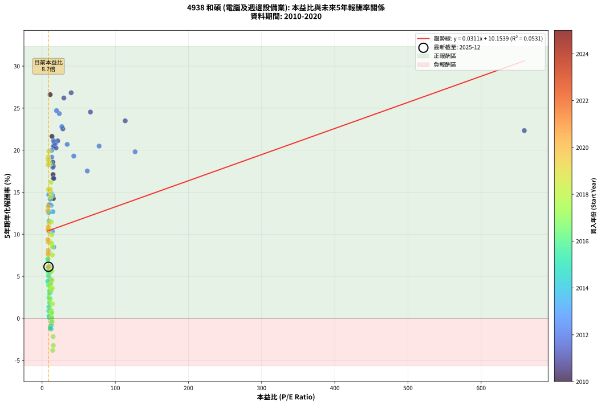
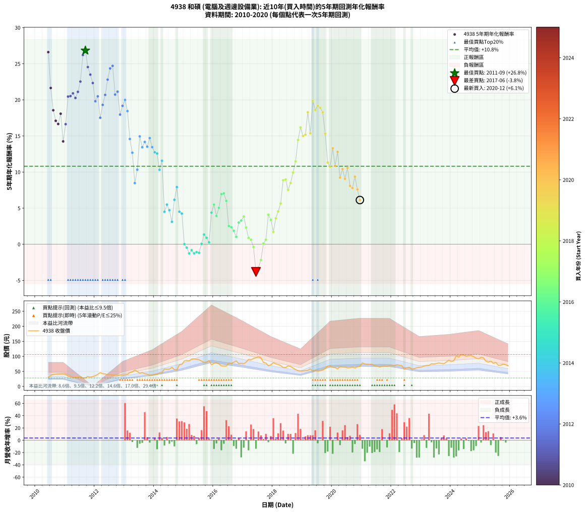

# 4938 和碩 - 本益比與未來報酬率分析

!!! info "報告資訊"
    - **股票代號**: 4938
    - **公司名稱**: 和碩
    - **產業別**: 電腦及週邊設備業
    - **分析期間**: 2010-2020 (127 個數據點)
    - **資料來源**: Type 12 (ShowMonthlyK_ChartFlow) 月收盤價與本益比
    - **報酬率口徑**: 含現金股利 (簡化: 年度合計，假設每年7/1入帳)
    - **報告生成時間**: 2026-01-04 08:50:26 CST

## 📈 視覺化圖表

### 圖表1: 本益比 vs 未來報酬率關係

*圖表1：4938 和碩 本益比與5年期未來報酬率關係 (2010-2020)*

### 圖表2: 歷年買入時點的5年期實際報酬率

*圖表2：4938 和碩 歷年買入時點的5年期實際報酬率 (2010-2020)*

## 📍 買點訊號說明

本報告提供兩種買點提示訊號（顯示於圖表2的股價子圖中）：

### ▲ 小綠色三角形（回測驗證）
- **計算方式**: 使用全部歷史資料計算本益比第25百分位數
- **用途**: 事後驗證，顯示歷史上哪些時點確實為低估區
- **限制**: 當下無法判斷，僅供回測參考
- **特性**: 後見之明（Look-Ahead Bias）

### ▲ 小橘色三角形（即時訊號）
- **計算方式**: 使用截至當月的過去5年資料計算本益比第25百分位數
- **用途**: 實際投資決策，當時即可判斷
- **優勢**: 可操作性強，符合實務需求
- **特性**: 無後見之明，滾動窗口計算

!!! tip "如何使用兩種訊號"
    - **綠色▲** 幫助理解歷史估值機會，驗證策略有效性
    - **橘色▲** 可作為實際買進參考，但仍需搭配基本面分析
    - 兩種訊號重疊時，表示即時判斷與事後驗證一致，信心度較高
    - 僅有綠色▲時，表示當時無法判斷（需要未來資料才能確認）
    - 僅有橘色▲時，表示即時判斷為買點，但事後可能不是最佳時機

## 📊 估值分析摘要

| 指標 | 數值 |
|:---:|:---:|
| **目前本益比** (2020-12) | **8.71 倍** |
| **歷史平均本益比** | 20.98 倍 |
| **估值水準** | 🟢 相對低估 |
| **預期5年年化報酬率** | **+10.42%** |
| **歷史平均報酬率** | +10.81% |
| **相關係數 (R²)** | 0.0531 |
| **趨勢線斜率** | 0.0311 |

!!! abstract "核心洞察"
    目前本益比顯著低於歷史平均，預期未來報酬率可能較高

    根據歷史數據回測，4938 和碩 在目前本益比 **8.7倍** 的估值水準下，
    預期未來5年年化報酬率約為 **+10.4%**。

    **重要提醒**: 本分析基於歷史數據統計，實際報酬率會受到公司基本面變化、產業趨勢、
    總體經濟環境等多重因素影響。R² = 0.05 表示本益比可解釋約 5.3% 的報酬率變異。

## 📈 歷史估值統計

### 最佳買點 (最高報酬率)

| 項目 | 數值 |
|:---:|:---:|
| 起始時間 | 2011-09 |
| 當時本益比 | 39.72 倍 |
| 起始價格 | 28.6 元 |
| 5年後價格 | 80.6 元 |
| **5年年化報酬率** | **+26.83%** |

### 最差買點 (最低報酬率)

| 項目 | 數值 |
|:---:|:---:|
| 起始時間 | 2017-06 |
| 當時本益比 | 14.48 倍 |
| 起始價格 | 95.3 元 |
| 5年後價格 | 57.0 元 |
| **5年年化報酬率** | **-3.82%** |

## 🎯 投資啟示

### 本益比與報酬率關係

趨勢線方程式: **y = 0.0311x + 10.1539**

!!! info "弱相關或正相關"
    本益比與未來報酬率相關性較弱。這可能表示該股票的報酬率更多受到
    公司成長性、產業趨勢等因素影響，而非估值水準。**需綜合考量多項指標**。

### 估值區間建議

基於歷史數據分析:

- **🟢 低估區** (P/E < 16.8): 預期報酬率較高，可考慮增加持股
- **🟡 合理區** (P/E 16.8-25.2): 預期報酬率符合長期趨勢，正常持有
- **🔴 高估區** (P/E > 25.2): 預期報酬率較低，可考慮減碼或觀望

!!! danger "風險提示"
    - 過去表現不代表未來結果
    - 本分析假設公司基本面無重大結構性變化
    - 產業環境劇變可能使歷史規律失效
    - 應結合公司財報、產業趨勢、總體經濟等多重因素綜合判斷

!!! success "長期投資觀點"
    歷史數據顯示，在合理或低估的估值水準買入並長期持有，
    往往能獲得較佳的投資報酬。**耐心等待好價格**是價值投資的核心原則。

## 📊 數據品質

- **資料來源**: GoodInfo.tw Type 12 (ShowMonthlyK_ChartFlow)
- **資料頻率**: 月度收盤價與本益比
- **回測期間**: 2010-2020
- **數據點數量**: 127 個 (每個點代表一次5年期回測)

### 計算方法說明

1. **5年期年化報酬率**:
   - 對每個歷史時點，計算其後5年的實際投資報酬率
   - 期末價值(不含股利): 期末價格
   - 期末價值(含現金股利): 期末價格 + 持有期間內的現金股利合計 (簡化: 年度合計，假設每年7/1入帳)
   - 公式: 年化報酬率 = [(期末價值/期初價格)^(1/年數) - 1] × 100%

2. **本益比 (P/E Ratio)**:
   - 使用當時的月收盤價與EPS計算
   - 資料來源: Type 12 月度河流圖本益比數據

3. **趨勢線 (Linear Regression)**:
   - 使用最小平方法擬合線性趨勢線
   - R²值衡量本益比對報酬率的解釋能力

---

*本報告由 Stock Analysis System v1.9.0 自動生成*
*數據更新時間: 2026-01-04 08:50:26 CST*

## 📋 月度回測明細表

（每一列對應時間線圖中的一個買入點；可用來對照 SVG 圖上的每個點。）

| 買入月份 | 賣出月份 | 回測期限_年 | 實際持有年數 | 買入本益比_倍 | 買入收盤價_元 | 賣出收盤價_元 | 現金股利合計_元 | 總報酬率_pct | 年化報酬率_pct |
| --- | --- | --- | --- | --- | --- | --- | --- | --- | --- |
| 2010-06 | 2015-06 | 5 | 4.999 | 11.01 | 30.05 | 90.30 | 7.45 | +225.29 | +26.61 |
| 2010-07 | 2015-07 | 5 | 4.999 | 13.55 | 37.00 | 88.80 | 9.74 | +166.31 | +21.64 |
| 2010-08 | 2015-08 | 5 | 4.999 | 14.69 | 40.10 | 84.20 | 9.74 | +134.25 | +18.56 |
| 2010-09 | 2015-09 | 5 | 4.999 | 14.96 | 40.85 | 80.20 | 9.74 | +120.16 | +17.10 |
| 2010-10 | 2015-10 | 5 | 4.999 | 15.18 | 41.45 | 79.80 | 9.74 | +116.01 | +16.66 |
| 2010-11 | 2015-11 | 5 | 4.999 | 15.29 | 41.75 | 86.10 | 9.74 | +129.55 | +18.08 |
| 2010-12 | 2015-12 | 5 | 4.999 | 15.38 | 42.00 | 72.00 | 9.74 | +94.61 | +14.25 |
| 2011-01 | 2016-01 | 5 | 4.999 | 16.00 | 40.10 | 76.80 | 9.74 | +115.80 | +16.63 |
| 2011-02 | 2016-02 | 5 | 4.999 | 15.33 | 35.00 | 79.00 | 9.74 | +153.53 | +20.45 |
| 2011-03 | 2016-03 | 5 | 5.002 | 16.19 | 33.35 | 75.10 | 9.74 | +154.38 | +20.52 |
| 2011-04 | 2016-04 | 5 | 5.002 | 16.44 | 30.20 | 68.30 | 9.74 | +158.40 | +20.90 |
| 2011-05 | 2016-05 | 5 | 5.002 | 19.12 | 30.85 | 67.90 | 9.74 | +151.66 | +20.26 |
| 2011-06 | 2016-06 | 5 | 5.002 | 21.40 | 29.75 | 67.80 | 9.74 | +160.63 | +21.11 |
| 2011-07 | 2016-07 | 5 | 5.002 | 28.41 | 33.15 | 78.30 | 13.32 | +176.37 | +22.54 |
| 2011-08 | 2016-08 | 5 | 5.002 | 29.79 | 28.10 | 76.70 | 13.32 | +220.34 | +26.21 |
| 2011-09 | 2016-09 | 5 | 5.002 | 39.72 | 28.60 | 80.60 | 13.32 | +228.38 | +26.83 |
| 2011-10 | 2016-10 | 5 | 5.002 | 66.04 | 32.80 | 85.00 | 13.32 | +199.74 | +24.54 |
| 2011-11 | 2016-11 | 5 | 5.002 | 113.60 | 31.05 | 75.90 | 13.32 | +187.33 | +23.49 |
| 2011-12 | 2016-12 | 5 | 5.002 | 659.00 | 32.95 | 77.00 | 13.32 | +174.10 | +22.33 |
| 2012-01 | 2017-01 | 5 | 5.002 | 127.10 | 35.80 | 75.10 | 13.32 | +146.97 | +19.81 |
| 2012-02 | 2017-03 | 5 | 5.081 | 77.92 | 40.00 | 89.80 | 13.32 | +157.79 | +20.49 |
| 2012-03 | 2017-03 | 5 | 4.999 | 61.74 | 46.00 | 89.80 | 13.32 | +124.17 | +17.52 |
| 2012-04 | 2017-04 | 5 | 4.999 | 43.31 | 42.30 | 88.90 | 13.32 | +141.65 | +19.30 |
| 2012-05 | 2017-05 | 5 | 4.999 | 34.30 | 41.45 | 92.80 | 13.32 | +156.01 | +20.69 |
| 2012-06 | 2017-06 | 5 | 4.999 | 27.01 | 38.90 | 95.30 | 13.32 | +179.22 | +22.80 |
| 2012-07 | 2017-07 | 5 | 4.999 | 23.51 | 39.30 | 98.60 | 18.24 | +197.32 | +24.35 |
| 2012-08 | 2017-08 | 5 | 4.999 | 19.73 | 37.55 | 95.00 | 18.24 | +201.58 | +24.71 |
| 2012-09 | 2017-09 | 5 | 4.999 | 17.87 | 38.15 | 79.60 | 18.24 | +156.47 | +20.73 |
| 2012-10 | 2017-10 | 5 | 4.999 | 15.59 | 36.90 | 78.00 | 18.24 | +160.83 | +21.14 |
| 2012-11 | 2017-11 | 5 | 4.999 | 14.59 | 37.90 | 68.30 | 18.24 | +128.35 | +17.96 |
| 2012-12 | 2017-12 | 5 | 4.999 | 13.27 | 37.55 | 72.00 | 18.24 | +140.33 | +19.17 |
| 2013-01 | 2018-01 | 5 | 4.999 | 13.30 | 39.10 | 79.00 | 18.24 | +148.71 | +19.99 |
| 2013-02 | 2018-02 | 5 | 4.999 | 13.11 | 40.00 | 75.00 | 18.24 | +133.11 | +18.45 |
| 2013-03 | 2018-03 | 5 | 4.999 | 14.61 | 46.20 | 73.00 | 18.24 | +97.50 | +14.58 |
| 2013-04 | 2018-04 | 5 | 4.999 | 14.76 | 48.30 | 69.50 | 18.24 | +81.67 | +12.68 |
| 2013-05 | 2018-05 | 5 | 4.999 | 16.05 | 54.30 | 63.30 | 18.24 | +50.17 | +8.47 |
| 2013-06 | 2018-06 | 5 | 4.999 | 14.16 | 49.50 | 62.70 | 18.24 | +63.53 | +10.34 |
| 2013-07 | 2018-07 | 5 | 4.999 | 12.29 | 44.30 | 68.10 | 20.77 | +100.60 | +14.94 |
| 2013-08 | 2018-08 | 5 | 4.999 | 12.46 | 46.30 | 66.20 | 20.77 | +87.83 | +13.44 |
| 2013-09 | 2018-09 | 5 | 4.999 | 11.03 | 42.20 | 61.10 | 20.77 | +94.00 | +14.17 |
| 2013-10 | 2018-10 | 5 | 4.999 | 10.39 | 40.90 | 56.30 | 20.77 | +88.43 | +13.51 |
| 2013-11 | 2018-11 | 5 | 4.999 | 9.09 | 36.80 | 52.30 | 20.77 | +98.55 | +14.70 |
| 2013-12 | 2018-12 | 5 | 4.999 | 9.23 | 38.40 | 51.40 | 20.77 | +87.93 | +13.45 |
| 2014-01 | 2019-01 | 5 | 4.999 | 9.20 | 39.85 | 51.80 | 20.77 | +82.10 | +12.74 |
| 2014-02 | 2019-02 | 5 | 4.999 | 9.03 | 40.70 | 52.80 | 20.77 | +80.75 | +12.57 |
| 2014-03 | 2019-03 | 5 | 4.999 | 9.69 | 45.35 | 53.30 | 20.77 | +63.32 | +10.31 |
| 2014-04 | 2019-04 | 5 | 4.999 | 9.43 | 45.75 | 58.30 | 20.77 | +72.82 | +11.56 |
| 2014-05 | 2019-05 | 5 | 4.999 | 11.54 | 58.00 | 51.50 | 20.77 | +24.60 | +4.50 |
| 2014-06 | 2019-06 | 5 | 4.999 | 10.96 | 57.00 | 53.70 | 20.77 | +30.64 | +5.49 |
| 2014-07 | 2019-07 | 5 | 4.999 | 10.70 | 57.50 | 50.90 | 21.50 | +25.91 | +4.72 |
| 2014-08 | 2019-08 | 5 | 4.999 | 11.43 | 63.40 | 52.40 | 21.50 | +16.56 | +3.11 |
| 2014-09 | 2019-09 | 5 | 4.999 | 9.79 | 56.00 | 54.00 | 21.50 | +34.82 | +6.16 |
| 2014-10 | 2019-10 | 5 | 4.999 | 9.37 | 55.20 | 59.30 | 21.50 | +46.38 | +7.92 |
| 2014-11 | 2019-11 | 5 | 4.999 | 11.84 | 71.80 | 68.00 | 21.50 | +24.65 | +4.51 |
| 2014-12 | 2019-12 | 5 | 4.999 | 11.70 | 73.00 | 68.40 | 21.50 | +23.15 | +4.25 |
| 2015-01 | 2020-01 | 5 | 4.999 | 13.10 | 85.00 | 63.60 | 21.50 | +0.12 | +0.02 |
| 2015-02 | 2020-02 | 5 | 4.999 | 12.79 | 86.20 | 62.70 | 21.50 | -2.32 | -0.47 |
| 2015-03 | 2020-03 | 5 | 5.002 | 12.12 | 84.70 | 58.00 | 21.50 | -6.14 | -1.26 |
| 2015-04 | 2020-04 | 5 | 5.002 | 12.62 | 91.30 | 66.10 | 21.50 | -4.05 | -0.82 |
| 2015-05 | 2020-05 | 5 | 5.002 | 12.24 | 91.60 | 64.50 | 21.50 | -6.11 | -1.25 |
| 2015-06 | 2020-06 | 5 | 5.002 | 11.67 | 90.30 | 64.00 | 21.50 | -5.32 | -1.09 |
| 2015-07 | 2020-07 | 5 | 5.002 | 11.12 | 88.80 | 61.70 | 21.96 | -5.79 | -1.18 |
| 2015-08 | 2020-08 | 5 | 5.002 | 10.23 | 84.20 | 62.50 | 21.96 | +0.31 | +0.06 |
| 2015-09 | 2020-09 | 5 | 5.002 | 9.45 | 80.20 | 63.80 | 21.96 | +6.94 | +1.35 |
| 2015-10 | 2020-10 | 5 | 5.002 | 9.14 | 79.80 | 61.50 | 21.96 | +4.59 | +0.90 |
| 2015-11 | 2020-11 | 5 | 5.002 | 9.59 | 86.10 | 65.30 | 21.96 | +1.35 | +0.27 |
| 2015-12 | 2020-12 | 5 | 5.002 | 7.80 | 72.00 | 67.30 | 21.96 | +23.98 | +4.39 |
| 2016-01 | 2021-01 | 5 | 5.002 | 8.45 | 76.80 | 78.40 | 21.96 | +30.68 | +5.50 |
| 2016-02 | 2021-03 | 5 | 5.081 | 8.84 | 79.00 | 74.10 | 21.96 | +21.60 | +3.92 |
| 2016-03 | 2021-03 | 5 | 4.999 | 8.54 | 75.10 | 74.10 | 21.96 | +27.91 | +5.05 |
| 2016-04 | 2021-04 | 5 | 4.999 | 7.89 | 68.30 | 73.60 | 21.96 | +39.92 | +6.95 |
| 2016-05 | 2021-05 | 5 | 4.999 | 7.98 | 67.90 | 73.50 | 21.96 | +40.59 | +7.05 |
| 2016-06 | 2021-06 | 5 | 4.999 | 8.11 | 67.80 | 68.80 | 21.96 | +33.87 | +6.01 |
| 2016-07 | 2021-07 | 5 | 4.999 | 9.52 | 78.30 | 67.30 | 21.42 | +13.31 | +2.53 |
| 2016-08 | 2021-08 | 5 | 4.999 | 9.50 | 76.70 | 64.80 | 21.42 | +12.41 | +2.37 |
| 2016-09 | 2021-09 | 5 | 4.999 | 10.16 | 80.60 | 67.00 | 21.42 | +9.70 | +1.87 |
| 2016-10 | 2021-10 | 5 | 4.999 | 10.91 | 85.00 | 68.00 | 21.42 | +5.20 | +1.02 |
| 2016-11 | 2021-11 | 5 | 4.999 | 9.93 | 75.90 | 66.60 | 21.42 | +15.97 | +3.01 |
| 2016-12 | 2021-12 | 5 | 4.999 | 10.27 | 77.00 | 69.10 | 21.42 | +17.56 | +3.29 |
| 2017-01 | 2022-01 | 5 | 4.999 | 10.22 | 75.10 | 69.30 | 21.42 | +20.80 | +3.85 |
| 2017-02 | 2022-02 | 5 | 4.999 | 11.22 | 80.70 | 69.10 | 21.42 | +12.17 | +2.32 |
| 2017-03 | 2022-03 | 5 | 4.999 | 12.76 | 89.80 | 72.40 | 21.42 | +4.48 | +0.88 |
| 2017-04 | 2022-04 | 5 | 4.999 | 12.91 | 88.90 | 70.30 | 21.42 | +3.17 | +0.63 |
| 2017-05 | 2022-05 | 5 | 4.999 | 13.78 | 92.80 | 69.60 | 21.42 | -1.92 | -0.39 |
| 2017-06 | 2022-06 | 5 | 4.999 | 14.48 | 95.30 | 57.00 | 21.42 | -17.71 | -3.82 |
| 2017-07 | 2022-07 | 5 | 4.999 | 15.34 | 98.60 | 62.20 | 21.49 | -15.12 | -3.23 |
| 2017-08 | 2022-08 | 5 | 4.999 | 15.14 | 95.00 | 63.60 | 21.49 | -10.43 | -2.18 |
| 2017-09 | 2022-09 | 5 | 4.999 | 13.01 | 79.60 | 58.50 | 21.49 | +0.49 | +0.10 |
| 2017-10 | 2022-10 | 5 | 4.999 | 13.07 | 78.00 | 59.00 | 21.49 | +3.20 | +0.63 |
| 2017-11 | 2022-11 | 5 | 4.999 | 11.75 | 68.30 | 62.00 | 21.49 | +22.24 | +4.10 |
| 2017-12 | 2022-12 | 5 | 4.999 | 12.72 | 72.00 | 63.50 | 21.49 | +18.05 | +3.37 |
| 2018-01 | 2023-01 | 5 | 4.999 | 14.25 | 79.00 | 64.50 | 21.49 | +8.85 | +1.71 |
| 2018-02 | 2023-02 | 5 | 4.999 | 13.82 | 75.00 | 68.00 | 21.49 | +19.32 | +3.60 |
| 2018-03 | 2023-03 | 5 | 4.999 | 13.75 | 73.00 | 69.70 | 21.49 | +24.92 | +4.55 |
| 2018-04 | 2023-04 | 5 | 4.999 | 13.39 | 69.50 | 70.00 | 21.49 | +31.64 | +5.65 |
| 2018-05 | 2023-05 | 5 | 4.999 | 12.48 | 63.30 | 75.30 | 21.49 | +52.91 | +8.87 |
| 2018-06 | 2023-06 | 5 | 4.999 | 12.65 | 62.70 | 74.80 | 21.49 | +53.58 | +8.96 |
| 2018-07 | 2023-07 | 5 | 4.999 | 14.08 | 68.10 | 76.40 | 21.49 | +43.75 | +7.53 |
| 2018-08 | 2023-08 | 5 | 4.999 | 14.03 | 66.20 | 78.00 | 21.49 | +50.29 | +8.49 |
| 2018-09 | 2023-09 | 5 | 4.999 | 13.28 | 61.10 | 76.60 | 21.49 | +60.55 | +9.93 |
| 2018-10 | 2023-10 | 5 | 4.999 | 12.55 | 56.30 | 75.40 | 21.49 | +72.10 | +11.47 |
| 2018-11 | 2023-11 | 5 | 4.999 | 11.97 | 52.30 | 81.20 | 21.49 | +96.36 | +14.45 |
| 2018-12 | 2023-12 | 5 | 4.999 | 12.09 | 51.40 | 87.30 | 21.49 | +111.66 | +16.18 |
| 2019-01 | 2024-01 | 5 | 4.999 | 11.48 | 51.80 | 82.70 | 21.49 | +101.15 | +15.00 |
| 2019-02 | 2024-02 | 5 | 4.999 | 11.06 | 52.80 | 85.50 | 21.49 | +102.64 | +15.17 |
| 2019-03 | 2024-03 | 5 | 5.002 | 10.58 | 53.30 | 102.00 | 21.49 | +131.70 | +18.29 |
| 2019-04 | 2024-04 | 5 | 5.002 | 11.00 | 58.30 | 97.70 | 21.49 | +104.45 | +15.37 |
| 2019-05 | 2024-05 | 5 | 5.002 | 9.26 | 51.50 | 106.00 | 21.49 | +147.56 | +19.87 |
| 2019-06 | 2024-06 | 5 | 5.002 | 9.22 | 53.70 | 104.50 | 21.49 | +134.63 | +18.59 |
| 2019-07 | 2024-07 | 5 | 5.002 | 8.36 | 50.90 | 100.50 | 21.99 | +140.66 | +19.19 |
| 2019-08 | 2024-08 | 5 | 5.002 | 8.25 | 52.40 | 102.50 | 21.99 | +137.58 | +18.89 |
| 2019-09 | 2024-09 | 5 | 5.002 | 8.17 | 54.00 | 103.00 | 21.99 | +131.47 | +18.27 |
| 2019-10 | 2024-10 | 5 | 5.002 | 8.63 | 59.30 | 99.00 | 21.99 | +104.04 | +15.32 |
| 2019-11 | 2024-11 | 5 | 5.002 | 9.53 | 68.00 | 94.30 | 21.99 | +71.02 | +11.32 |
| 2019-12 | 2024-12 | 5 | 5.002 | 9.24 | 68.40 | 91.90 | 21.99 | +66.51 | +10.73 |
| 2020-01 | 2025-01 | 5 | 5.002 | 8.56 | 63.60 | 96.70 | 21.99 | +86.63 | +13.28 |
| 2020-02 | 2025-03 | 5 | 5.081 | 8.41 | 62.70 | 83.90 | 21.99 | +68.89 | +10.86 |
| 2020-03 | 2025-03 | 5 | 4.999 | 7.75 | 58.00 | 83.90 | 21.99 | +82.58 | +12.80 |
| 2020-04 | 2025-04 | 5 | 4.999 | 8.80 | 66.10 | 80.80 | 21.99 | +55.51 | +9.23 |
| 2020-05 | 2025-05 | 5 | 4.999 | 8.56 | 64.50 | 83.90 | 21.99 | +64.18 | +10.43 |
| 2020-06 | 2025-06 | 5 | 4.999 | 8.46 | 64.00 | 76.80 | 21.99 | +54.37 | +9.07 |
| 2020-07 | 2025-07 | 5 | 4.999 | 8.13 | 61.70 | 80.00 | 22.00 | +65.31 | +10.58 |
| 2020-08 | 2025-08 | 5 | 4.999 | 8.20 | 62.50 | 70.20 | 22.00 | +47.52 | +8.09 |
| 2020-09 | 2025-09 | 5 | 4.999 | 8.34 | 63.80 | 70.80 | 22.00 | +45.45 | +7.78 |
| 2020-10 | 2025-10 | 5 | 4.999 | 8.01 | 61.50 | 74.20 | 22.00 | +56.42 | +9.36 |
| 2020-11 | 2025-11 | 5 | 4.999 | 8.48 | 65.30 | 72.10 | 22.00 | +44.10 | +7.58 |
| 2020-12 | 2025-12 | 5 | 4.999 | 8.71 | 67.30 | 68.60 | 22.00 | +34.62 | +6.13 |
