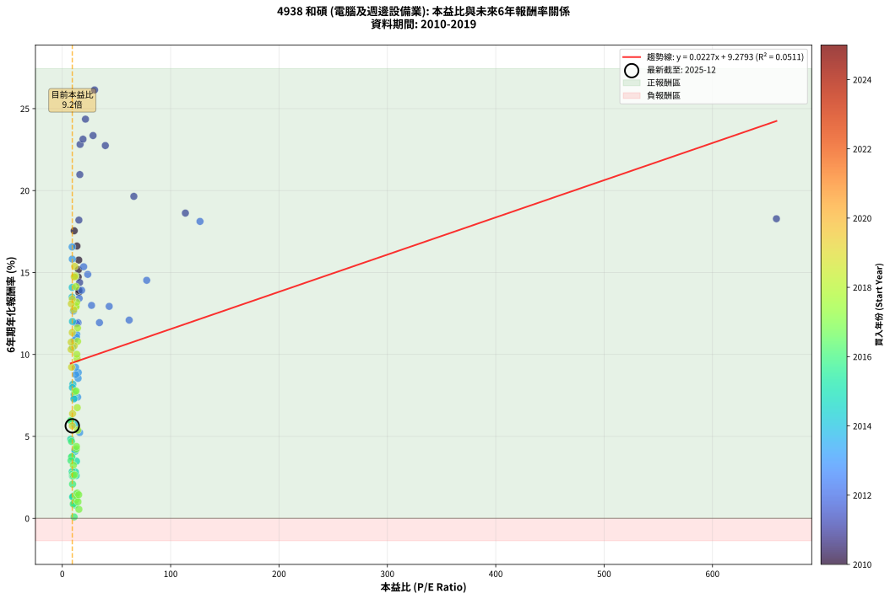
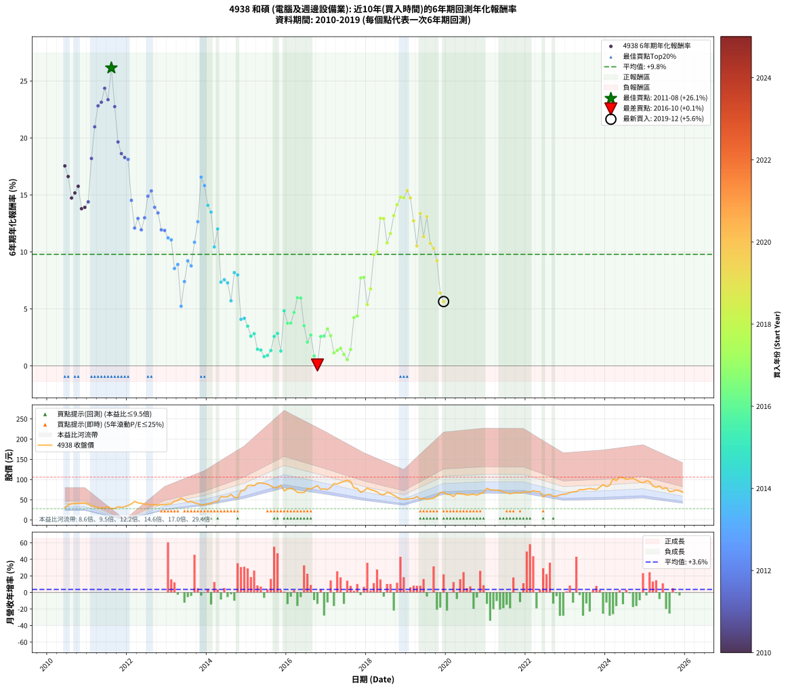

# 4938 和碩 - 本益比與未來報酬率分析

!!! info "報告資訊"
    - **股票代號**: 4938
    - **公司名稱**: 和碩
    - **產業別**: 電腦及週邊設備業
    - **分析期間**: 2010-2019 (115 個數據點)
    - **資料來源**: Type 12 (ShowMonthlyK_ChartFlow) 月收盤價與本益比
    - **報酬率口徑**: 含現金股利 (簡化: 年度合計，假設每年7/1入帳)
    - **報告生成時間**: 2026-01-04 08:27:55 CST

## 📈 視覺化圖表

### 圖表1: 本益比 vs 未來報酬率關係

*圖表1：4938 和碩 本益比與6年期未來報酬率關係 (2010-2019)*

### 圖表2: 歷年買入時點的6年期實際報酬率

*圖表2：4938 和碩 歷年買入時點的6年期實際報酬率 (2010-2019)*

## 📍 買點訊號說明

本報告提供兩種買點提示訊號（顯示於圖表2的股價子圖中）：

### ▲ 小綠色三角形（回測驗證）
- **計算方式**: 使用全部歷史資料計算本益比第25百分位數
- **用途**: 事後驗證，顯示歷史上哪些時點確實為低估區
- **限制**: 當下無法判斷，僅供回測參考
- **特性**: 後見之明（Look-Ahead Bias）

### ▲ 小橘色三角形（即時訊號）
- **計算方式**: 使用截至當月的過去5年資料計算本益比第25百分位數
- **用途**: 實際投資決策，當時即可判斷
- **優勢**: 可操作性強，符合實務需求
- **特性**: 無後見之明，滾動窗口計算

!!! tip "如何使用兩種訊號"
    - **綠色▲** 幫助理解歷史估值機會，驗證策略有效性
    - **橘色▲** 可作為實際買進參考，但仍需搭配基本面分析
    - 兩種訊號重疊時，表示即時判斷與事後驗證一致，信心度較高
    - 僅有綠色▲時，表示當時無法判斷（需要未來資料才能確認）
    - 僅有橘色▲時，表示即時判斷為買點，但事後可能不是最佳時機

## 📊 估值分析摘要

| 指標 | 數值 |
|:---:|:---:|
| **目前本益比** (2019-12) | **9.24 倍** |
| **歷史平均本益比** | 22.29 倍 |
| **估值水準** | 🟢 相對低估 |
| **預期6年年化報酬率** | **+9.49%** |
| **歷史平均報酬率** | +9.79% |
| **相關係數 (R²)** | 0.0511 |
| **趨勢線斜率** | 0.0227 |

!!! abstract "核心洞察"
    目前本益比顯著低於歷史平均，預期未來報酬率可能較高

    根據歷史數據回測，4938 和碩 在目前本益比 **9.2倍** 的估值水準下，
    預期未來6年年化報酬率約為 **+9.5%**。

    **重要提醒**: 本分析基於歷史數據統計，實際報酬率會受到公司基本面變化、產業趨勢、
    總體經濟環境等多重因素影響。R² = 0.05 表示本益比可解釋約 5.1% 的報酬率變異。

## 📈 歷史估值統計

### 最佳買點 (最高報酬率)

| 項目 | 數值 |
|:---:|:---:|
| 起始時間 | 2011-08 |
| 當時本益比 | 29.79 倍 |
| 起始價格 | 28.1 元 |
| 6年後價格 | 95.0 元 |
| **6年年化報酬率** | **+26.14%** |

### 最差買點 (最低報酬率)

| 項目 | 數值 |
|:---:|:---:|
| 起始時間 | 2016-10 |
| 當時本益比 | 10.91 倍 |
| 起始價格 | 85.0 元 |
| 6年後價格 | 59.0 元 |
| **6年年化報酬率** | **+0.08%** |

## 🎯 投資啟示

### 本益比與報酬率關係

趨勢線方程式: **y = 0.0227x + 9.2793**

!!! info "弱相關或正相關"
    本益比與未來報酬率相關性較弱。這可能表示該股票的報酬率更多受到
    公司成長性、產業趨勢等因素影響，而非估值水準。**需綜合考量多項指標**。

### 估值區間建議

基於歷史數據分析:

- **🟢 低估區** (P/E < 17.8): 預期報酬率較高，可考慮增加持股
- **🟡 合理區** (P/E 17.8-26.8): 預期報酬率符合長期趨勢，正常持有
- **🔴 高估區** (P/E > 26.8): 預期報酬率較低，可考慮減碼或觀望

!!! danger "風險提示"
    - 過去表現不代表未來結果
    - 本分析假設公司基本面無重大結構性變化
    - 產業環境劇變可能使歷史規律失效
    - 應結合公司財報、產業趨勢、總體經濟等多重因素綜合判斷

!!! success "長期投資觀點"
    歷史數據顯示，在合理或低估的估值水準買入並長期持有，
    往往能獲得較佳的投資報酬。**耐心等待好價格**是價值投資的核心原則。

## 📊 數據品質

- **資料來源**: GoodInfo.tw Type 12 (ShowMonthlyK_ChartFlow)
- **資料頻率**: 月度收盤價與本益比
- **回測期間**: 2010-2019
- **數據點數量**: 115 個 (每個點代表一次6年期回測)

### 計算方法說明

1. **6年期年化報酬率**:
   - 對每個歷史時點，計算其後6年的實際投資報酬率
   - 期末價值(不含股利): 期末價格
   - 期末價值(含現金股利): 期末價格 + 持有期間內的現金股利合計 (簡化: 年度合計，假設每年7/1入帳)
   - 公式: 年化報酬率 = [(期末價值/期初價格)^(1/年數) - 1] × 100%

2. **本益比 (P/E Ratio)**:
   - 使用當時的月收盤價與EPS計算
   - 資料來源: Type 12 月度河流圖本益比數據

3. **趨勢線 (Linear Regression)**:
   - 使用最小平方法擬合線性趨勢線
   - R²值衡量本益比對報酬率的解釋能力

---

*本報告由 Stock Analysis System v1.9.0 自動生成*
*數據更新時間: 2026-01-04 08:27:55 CST*

## 📋 月度回測明細表

（每一列對應時間線圖中的一個買入點；可用來對照 SVG 圖上的每個點。）

| 買入月份 | 賣出月份 | 回測期限_年 | 實際持有年數 | 買入本益比_倍 | 買入收盤價_元 | 賣出收盤價_元 | 現金股利合計_元 | 總報酬率_pct | 年化報酬率_pct |
| --- | --- | --- | --- | --- | --- | --- | --- | --- | --- |
| 2010-06 | 2016-06 | 6 | 6.001 | 11.01 | 30.05 | 67.80 | 11.49 | +163.85 | +17.55 |
| 2010-07 | 2016-07 | 6 | 6.001 | 13.55 | 37.00 | 78.30 | 14.77 | +151.53 | +16.61 |
| 2010-08 | 2016-08 | 6 | 6.001 | 14.69 | 40.10 | 76.70 | 14.77 | +128.09 | +14.73 |
| 2010-09 | 2016-09 | 6 | 6.001 | 14.96 | 40.85 | 80.60 | 14.77 | +133.45 | +15.17 |
| 2010-10 | 2016-10 | 6 | 6.001 | 15.18 | 41.45 | 85.00 | 14.77 | +140.69 | +15.76 |
| 2010-11 | 2016-11 | 6 | 6.001 | 15.29 | 41.75 | 75.90 | 14.77 | +117.16 | +13.79 |
| 2010-12 | 2016-12 | 6 | 6.001 | 15.38 | 42.00 | 77.00 | 14.77 | +118.49 | +13.91 |
| 2011-01 | 2017-01 | 6 | 6.001 | 16.00 | 40.10 | 75.10 | 14.77 | +124.10 | +14.39 |
| 2011-02 | 2017-02 | 6 | 6.001 | 15.33 | 35.00 | 80.70 | 14.77 | +172.76 | +18.20 |
| 2011-03 | 2017-03 | 6 | 6.001 | 16.19 | 33.35 | 89.80 | 14.77 | +213.54 | +20.98 |
| 2011-04 | 2017-04 | 6 | 6.001 | 16.44 | 30.20 | 88.90 | 14.77 | +243.26 | +22.81 |
| 2011-05 | 2017-05 | 6 | 6.001 | 19.12 | 30.85 | 92.80 | 14.77 | +248.67 | +23.14 |
| 2011-06 | 2017-06 | 6 | 6.001 | 21.40 | 29.75 | 95.30 | 14.77 | +269.97 | +24.36 |
| 2011-07 | 2017-07 | 6 | 6.001 | 28.41 | 33.15 | 98.60 | 18.24 | +252.47 | +23.36 |
| 2011-08 | 2017-08 | 6 | 6.001 | 29.79 | 28.10 | 95.00 | 18.24 | +303.01 | +26.14 |
| 2011-09 | 2017-09 | 6 | 6.001 | 39.72 | 28.60 | 79.60 | 18.24 | +242.12 | +22.75 |
| 2011-10 | 2017-10 | 6 | 6.001 | 66.04 | 32.80 | 78.00 | 18.24 | +193.43 | +19.65 |
| 2011-11 | 2017-11 | 6 | 6.001 | 113.60 | 31.05 | 68.30 | 18.24 | +178.73 | +18.63 |
| 2011-12 | 2017-12 | 6 | 6.001 | 659.00 | 32.95 | 72.00 | 18.24 | +173.88 | +18.28 |
| 2012-01 | 2018-01 | 6 | 6.001 | 127.10 | 35.80 | 79.00 | 18.24 | +171.63 | +18.12 |
| 2012-02 | 2018-03 | 6 | 6.081 | 77.92 | 40.00 | 73.00 | 18.24 | +128.11 | +14.52 |
| 2012-03 | 2018-03 | 6 | 5.999 | 61.74 | 46.00 | 73.00 | 18.24 | +98.36 | +12.10 |
| 2012-04 | 2018-04 | 6 | 5.999 | 43.31 | 42.30 | 69.50 | 18.24 | +107.43 | +12.93 |
| 2012-05 | 2018-05 | 6 | 5.999 | 34.30 | 41.45 | 63.30 | 18.24 | +96.73 | +11.94 |
| 2012-06 | 2018-06 | 6 | 5.999 | 27.01 | 38.90 | 62.70 | 18.24 | +108.08 | +12.99 |
| 2012-07 | 2018-07 | 6 | 5.999 | 23.51 | 39.30 | 68.10 | 22.25 | +129.89 | +14.89 |
| 2012-08 | 2018-08 | 6 | 5.999 | 19.73 | 37.55 | 66.20 | 22.25 | +135.54 | +15.35 |
| 2012-09 | 2018-09 | 6 | 5.999 | 17.87 | 38.15 | 61.10 | 22.25 | +118.47 | +13.91 |
| 2012-10 | 2018-10 | 6 | 5.999 | 15.59 | 36.90 | 56.30 | 22.25 | +112.86 | +13.42 |
| 2012-11 | 2018-11 | 6 | 5.999 | 14.59 | 37.90 | 52.30 | 22.25 | +96.69 | +11.94 |
| 2012-12 | 2018-12 | 6 | 5.999 | 13.27 | 37.55 | 51.40 | 22.25 | +96.13 | +11.88 |
| 2013-01 | 2019-01 | 6 | 5.999 | 13.30 | 39.10 | 51.80 | 22.25 | +89.38 | +11.23 |
| 2013-02 | 2019-02 | 6 | 5.999 | 13.11 | 40.00 | 52.80 | 22.25 | +87.62 | +11.06 |
| 2013-03 | 2019-03 | 6 | 5.999 | 14.61 | 46.20 | 53.30 | 22.25 | +63.52 | +8.54 |
| 2013-04 | 2019-04 | 6 | 5.999 | 14.76 | 48.30 | 58.30 | 22.25 | +66.76 | +8.90 |
| 2013-05 | 2019-05 | 6 | 5.999 | 16.05 | 54.30 | 51.50 | 22.25 | +35.81 | +5.24 |
| 2013-06 | 2019-06 | 6 | 5.999 | 14.16 | 49.50 | 53.70 | 22.25 | +53.43 | +7.40 |
| 2013-07 | 2019-07 | 6 | 5.999 | 12.29 | 44.30 | 50.90 | 24.27 | +69.68 | +9.21 |
| 2013-08 | 2019-08 | 6 | 5.999 | 12.46 | 46.30 | 52.40 | 24.27 | +65.59 | +8.77 |
| 2013-09 | 2019-09 | 6 | 5.999 | 11.03 | 42.20 | 54.00 | 24.27 | +85.47 | +10.85 |
| 2013-10 | 2019-10 | 6 | 5.999 | 10.39 | 40.90 | 59.30 | 24.27 | +104.32 | +12.65 |
| 2013-11 | 2019-11 | 6 | 5.999 | 9.09 | 36.80 | 68.00 | 24.27 | +150.73 | +16.56 |
| 2013-12 | 2019-12 | 6 | 5.999 | 9.23 | 38.40 | 68.40 | 24.27 | +141.32 | +15.82 |
| 2014-01 | 2020-01 | 6 | 5.999 | 9.20 | 39.85 | 63.60 | 24.27 | +120.49 | +14.09 |
| 2014-02 | 2020-02 | 6 | 5.999 | 9.03 | 40.70 | 62.70 | 24.27 | +113.68 | +13.49 |
| 2014-03 | 2020-03 | 6 | 6.001 | 9.69 | 45.35 | 58.00 | 24.27 | +81.40 | +10.43 |
| 2014-04 | 2020-04 | 6 | 6.001 | 9.43 | 45.75 | 66.10 | 24.27 | +97.52 | +12.01 |
| 2014-05 | 2020-05 | 6 | 6.001 | 11.54 | 58.00 | 64.50 | 24.27 | +53.05 | +7.35 |
| 2014-06 | 2020-06 | 6 | 6.001 | 10.96 | 57.00 | 64.00 | 24.27 | +54.85 | +7.56 |
| 2014-07 | 2020-07 | 6 | 6.001 | 10.70 | 57.50 | 61.70 | 26.00 | +52.52 | +7.29 |
| 2014-08 | 2020-08 | 6 | 6.001 | 11.43 | 63.40 | 62.50 | 26.00 | +39.59 | +5.71 |
| 2014-09 | 2020-09 | 6 | 6.001 | 9.79 | 56.00 | 63.80 | 26.00 | +60.36 | +8.19 |
| 2014-10 | 2020-10 | 6 | 6.001 | 9.37 | 55.20 | 61.50 | 26.00 | +58.51 | +7.98 |
| 2014-11 | 2020-11 | 6 | 6.001 | 11.84 | 71.80 | 65.30 | 26.00 | +27.16 | +4.08 |
| 2014-12 | 2020-12 | 6 | 6.001 | 11.70 | 73.00 | 67.30 | 26.00 | +27.81 | +4.17 |
| 2015-01 | 2021-01 | 6 | 6.001 | 13.10 | 85.00 | 78.40 | 26.00 | +22.82 | +3.48 |
| 2015-02 | 2021-02 | 6 | 6.001 | 12.79 | 86.20 | 74.60 | 26.00 | +16.70 | +2.61 |
| 2015-03 | 2021-03 | 6 | 6.001 | 12.12 | 84.70 | 74.10 | 26.00 | +18.18 | +2.82 |
| 2015-04 | 2021-04 | 6 | 6.001 | 12.62 | 91.30 | 73.60 | 26.00 | +9.09 | +1.46 |
| 2015-05 | 2021-05 | 6 | 6.001 | 12.24 | 91.60 | 73.50 | 26.00 | +8.62 | +1.39 |
| 2015-06 | 2021-06 | 6 | 6.001 | 11.67 | 90.30 | 68.80 | 26.00 | +4.98 | +0.81 |
| 2015-07 | 2021-07 | 6 | 6.001 | 11.12 | 88.80 | 67.30 | 26.45 | +5.58 | +0.91 |
| 2015-08 | 2021-08 | 6 | 6.001 | 10.23 | 84.20 | 64.80 | 26.45 | +8.37 | +1.35 |
| 2015-09 | 2021-09 | 6 | 6.001 | 9.45 | 80.20 | 67.00 | 26.45 | +16.52 | +2.58 |
| 2015-10 | 2021-10 | 6 | 6.001 | 9.14 | 79.80 | 68.00 | 26.45 | +18.36 | +2.85 |
| 2015-11 | 2021-11 | 6 | 6.001 | 9.59 | 86.10 | 66.60 | 26.45 | +8.07 | +1.30 |
| 2015-12 | 2021-12 | 6 | 6.001 | 7.80 | 72.00 | 69.10 | 26.45 | +32.71 | +4.83 |
| 2016-01 | 2022-01 | 6 | 6.001 | 8.45 | 76.80 | 69.30 | 26.45 | +24.68 | +3.74 |
| 2016-02 | 2022-03 | 6 | 6.081 | 8.84 | 79.00 | 72.40 | 26.45 | +25.13 | +3.76 |
| 2016-03 | 2022-03 | 6 | 5.999 | 8.54 | 75.10 | 72.40 | 26.45 | +31.63 | +4.69 |
| 2016-04 | 2022-04 | 6 | 5.999 | 7.89 | 68.30 | 70.30 | 26.45 | +41.66 | +5.98 |
| 2016-05 | 2022-05 | 6 | 5.999 | 7.98 | 67.90 | 69.60 | 26.45 | +41.46 | +5.95 |
| 2016-06 | 2022-06 | 6 | 5.999 | 8.11 | 67.80 | 57.00 | 26.45 | +23.08 | +3.52 |
| 2016-07 | 2022-07 | 6 | 5.999 | 9.52 | 78.30 | 62.20 | 26.42 | +13.18 | +2.09 |
| 2016-08 | 2022-08 | 6 | 5.999 | 9.50 | 76.70 | 63.60 | 26.42 | +17.37 | +2.71 |
| 2016-09 | 2022-09 | 6 | 5.999 | 10.16 | 80.60 | 58.50 | 26.42 | +5.36 | +0.87 |
| 2016-10 | 2022-10 | 6 | 5.999 | 10.91 | 85.00 | 59.00 | 26.42 | +0.50 | +0.08 |
| 2016-11 | 2022-11 | 6 | 5.999 | 9.93 | 75.90 | 62.00 | 26.42 | +16.50 | +2.58 |
| 2016-12 | 2022-12 | 6 | 5.999 | 10.27 | 77.00 | 63.50 | 26.42 | +16.78 | +2.62 |
| 2017-01 | 2023-01 | 6 | 5.999 | 10.22 | 75.10 | 64.50 | 26.42 | +21.07 | +3.24 |
| 2017-02 | 2023-02 | 6 | 5.999 | 11.22 | 80.70 | 68.00 | 26.42 | +17.00 | +2.65 |
| 2017-03 | 2023-03 | 6 | 5.999 | 12.76 | 89.80 | 69.70 | 26.42 | +7.04 | +1.14 |
| 2017-04 | 2023-04 | 6 | 5.999 | 12.91 | 88.90 | 70.00 | 26.42 | +8.46 | +1.36 |
| 2017-05 | 2023-05 | 6 | 5.999 | 13.78 | 92.80 | 75.30 | 26.42 | +9.61 | +1.54 |
| 2017-06 | 2023-06 | 6 | 5.999 | 14.48 | 95.30 | 74.80 | 26.42 | +6.21 | +1.01 |
| 2017-07 | 2023-07 | 6 | 5.999 | 15.34 | 98.60 | 76.40 | 25.50 | +3.34 | +0.55 |
| 2017-08 | 2023-08 | 6 | 5.999 | 15.14 | 95.00 | 78.00 | 25.50 | +8.94 | +1.44 |
| 2017-09 | 2023-09 | 6 | 5.999 | 13.01 | 79.60 | 76.60 | 25.50 | +28.26 | +4.24 |
| 2017-10 | 2023-10 | 6 | 5.999 | 13.07 | 78.00 | 75.40 | 25.50 | +29.35 | +4.38 |
| 2017-11 | 2023-11 | 6 | 5.999 | 11.75 | 68.30 | 81.20 | 25.50 | +56.22 | +7.72 |
| 2017-12 | 2023-12 | 6 | 5.999 | 12.72 | 72.00 | 87.30 | 25.50 | +56.66 | +7.77 |
| 2018-01 | 2024-01 | 6 | 5.999 | 14.25 | 79.00 | 82.70 | 25.50 | +36.96 | +5.38 |
| 2018-02 | 2024-02 | 6 | 5.999 | 13.82 | 75.00 | 85.50 | 25.50 | +47.99 | +6.75 |
| 2018-03 | 2024-03 | 6 | 6.001 | 13.75 | 73.00 | 102.00 | 25.50 | +74.65 | +9.74 |
| 2018-04 | 2024-04 | 6 | 6.001 | 13.39 | 69.50 | 97.70 | 25.50 | +77.26 | +10.01 |
| 2018-05 | 2024-05 | 6 | 6.001 | 12.48 | 63.30 | 106.00 | 25.50 | +107.73 | +12.96 |
| 2018-06 | 2024-06 | 6 | 6.001 | 12.65 | 62.70 | 104.50 | 25.50 | +107.33 | +12.92 |
| 2018-07 | 2024-07 | 6 | 6.001 | 14.08 | 68.10 | 100.50 | 25.50 | +85.01 | +10.80 |
| 2018-08 | 2024-08 | 6 | 6.001 | 14.03 | 66.20 | 102.50 | 25.50 | +93.35 | +11.61 |
| 2018-09 | 2024-09 | 6 | 6.001 | 13.28 | 61.10 | 103.00 | 25.50 | +110.30 | +13.19 |
| 2018-10 | 2024-10 | 6 | 6.001 | 12.55 | 56.30 | 99.00 | 25.50 | +121.13 | +14.14 |
| 2018-11 | 2024-11 | 6 | 6.001 | 11.97 | 52.30 | 94.30 | 25.50 | +129.05 | +14.81 |
| 2018-12 | 2024-12 | 6 | 6.001 | 12.09 | 51.40 | 91.90 | 25.50 | +128.39 | +14.75 |
| 2019-01 | 2025-01 | 6 | 6.001 | 11.48 | 51.80 | 96.70 | 25.50 | +135.90 | +15.37 |
| 2019-02 | 2025-02 | 6 | 6.001 | 11.06 | 52.80 | 95.00 | 25.50 | +128.21 | +14.74 |
| 2019-03 | 2025-03 | 6 | 6.001 | 10.58 | 53.30 | 83.90 | 25.50 | +105.24 | +12.73 |
| 2019-04 | 2025-04 | 6 | 6.001 | 11.00 | 58.30 | 80.80 | 25.50 | +82.32 | +10.53 |
| 2019-05 | 2025-05 | 6 | 6.001 | 9.26 | 51.50 | 83.90 | 25.50 | +112.42 | +13.38 |
| 2019-06 | 2025-06 | 6 | 6.001 | 9.22 | 53.70 | 76.80 | 25.50 | +90.49 | +11.34 |
| 2019-07 | 2025-07 | 6 | 6.001 | 8.36 | 50.90 | 80.00 | 26.50 | +109.23 | +13.09 |
| 2019-08 | 2025-08 | 6 | 6.001 | 8.25 | 52.40 | 70.20 | 26.50 | +84.54 | +10.75 |
| 2019-09 | 2025-09 | 6 | 6.001 | 8.17 | 54.00 | 70.80 | 26.50 | +80.18 | +10.31 |
| 2019-10 | 2025-10 | 6 | 6.001 | 8.63 | 59.30 | 74.20 | 26.50 | +69.81 | +9.22 |
| 2019-11 | 2025-11 | 6 | 6.001 | 9.53 | 68.00 | 72.10 | 26.50 | +45.00 | +6.39 |
| 2019-12 | 2025-12 | 6 | 6.001 | 9.24 | 68.40 | 68.60 | 26.50 | +39.03 | +5.64 |
