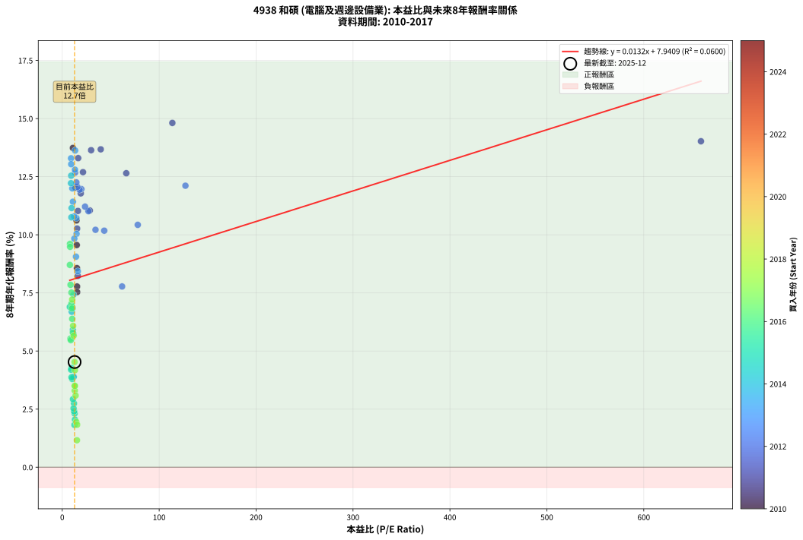
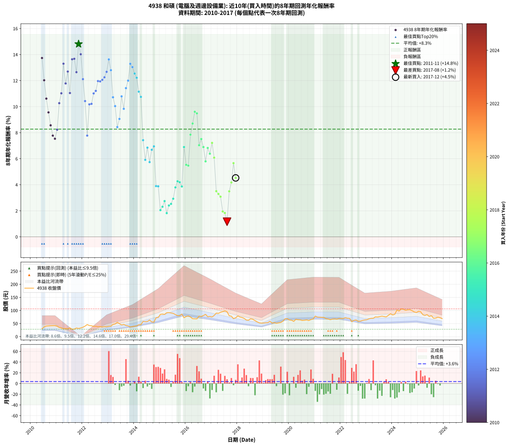

# 4938 和碩 - 本益比與未來報酬率分析

!!! info "報告資訊"
    - **股票代號**: 4938
    - **公司名稱**: 和碩
    - **產業別**: 電腦及週邊設備業
    - **分析期間**: 2010-2017 (91 個數據點)
    - **資料來源**: Type 12 (ShowMonthlyK_ChartFlow) 月收盤價與本益比
    - **報酬率口徑**: 含現金股利 (簡化: 年度合計，假設每年7/1入帳)
    - **報告生成時間**: 2026-01-04 08:50:27 CST

## 📈 視覺化圖表

### 圖表1: 本益比 vs 未來報酬率關係

*圖表1：4938 和碩 本益比與8年期未來報酬率關係 (2010-2017)*

### 圖表2: 歷年買入時點的8年期實際報酬率

*圖表2：4938 和碩 歷年買入時點的8年期實際報酬率 (2010-2017)*

## 📍 買點訊號說明

本報告提供兩種買點提示訊號（顯示於圖表2的股價子圖中）：

### ▲ 小綠色三角形（回測驗證）
- **計算方式**: 使用全部歷史資料計算本益比第25百分位數
- **用途**: 事後驗證，顯示歷史上哪些時點確實為低估區
- **限制**: 當下無法判斷，僅供回測參考
- **特性**: 後見之明（Look-Ahead Bias）

### ▲ 小橘色三角形（即時訊號）
- **計算方式**: 使用截至當月的過去5年資料計算本益比第25百分位數
- **用途**: 實際投資決策，當時即可判斷
- **優勢**: 可操作性強，符合實務需求
- **特性**: 無後見之明，滾動窗口計算

!!! tip "如何使用兩種訊號"
    - **綠色▲** 幫助理解歷史估值機會，驗證策略有效性
    - **橘色▲** 可作為實際買進參考，但仍需搭配基本面分析
    - 兩種訊號重疊時，表示即時判斷與事後驗證一致，信心度較高
    - 僅有綠色▲時，表示當時無法判斷（需要未來資料才能確認）
    - 僅有橘色▲時，表示即時判斷為買點，但事後可能不是最佳時機

## 📊 估值分析摘要

| 指標 | 數值 |
|:---:|:---:|
| **目前本益比** (2017-12) | **12.72 倍** |
| **歷史平均本益比** | 25.17 倍 |
| **估值水準** | 🟢 相對低估 |
| **預期8年年化報酬率** | **+8.11%** |
| **歷史平均報酬率** | +8.27% |
| **相關係數 (R²)** | 0.0600 |
| **趨勢線斜率** | 0.0132 |

!!! abstract "核心洞察"
    目前本益比顯著低於歷史平均，預期未來報酬率可能較高

    根據歷史數據回測，4938 和碩 在目前本益比 **12.7倍** 的估值水準下，
    預期未來8年年化報酬率約為 **+8.1%**。

    **重要提醒**: 本分析基於歷史數據統計，實際報酬率會受到公司基本面變化、產業趨勢、
    總體經濟環境等多重因素影響。R² = 0.06 表示本益比可解釋約 6.0% 的報酬率變異。

## 📈 歷史估值統計

### 最佳買點 (最高報酬率)

| 項目 | 數值 |
|:---:|:---:|
| 起始時間 | 2011-11 |
| 當時本益比 | 113.60 倍 |
| 起始價格 | 31.1 元 |
| 8年後價格 | 68.0 元 |
| **8年年化報酬率** | **+14.81%** |

### 最差買點 (最低報酬率)

| 項目 | 數值 |
|:---:|:---:|
| 起始時間 | 2017-08 |
| 當時本益比 | 15.14 倍 |
| 起始價格 | 95.0 元 |
| 8年後價格 | 70.2 元 |
| **8年年化報酬率** | **+1.16%** |

## 🎯 投資啟示

### 本益比與報酬率關係

趨勢線方程式: **y = 0.0132x + 7.9409**

!!! info "弱相關或正相關"
    本益比與未來報酬率相關性較弱。這可能表示該股票的報酬率更多受到
    公司成長性、產業趨勢等因素影響，而非估值水準。**需綜合考量多項指標**。

### 估值區間建議

基於歷史數據分析:

- **🟢 低估區** (P/E < 20.1): 預期報酬率較高，可考慮增加持股
- **🟡 合理區** (P/E 20.1-30.2): 預期報酬率符合長期趨勢，正常持有
- **🔴 高估區** (P/E > 30.2): 預期報酬率較低，可考慮減碼或觀望

!!! danger "風險提示"
    - 過去表現不代表未來結果
    - 本分析假設公司基本面無重大結構性變化
    - 產業環境劇變可能使歷史規律失效
    - 應結合公司財報、產業趨勢、總體經濟等多重因素綜合判斷

!!! success "長期投資觀點"
    歷史數據顯示，在合理或低估的估值水準買入並長期持有，
    往往能獲得較佳的投資報酬。**耐心等待好價格**是價值投資的核心原則。

## 📊 數據品質

- **資料來源**: GoodInfo.tw Type 12 (ShowMonthlyK_ChartFlow)
- **資料頻率**: 月度收盤價與本益比
- **回測期間**: 2010-2017
- **數據點數量**: 91 個 (每個點代表一次8年期回測)

### 計算方法說明

1. **8年期年化報酬率**:
   - 對每個歷史時點，計算其後8年的實際投資報酬率
   - 期末價值(不含股利): 期末價格
   - 期末價值(含現金股利): 期末價格 + 持有期間內的現金股利合計 (簡化: 年度合計，假設每年7/1入帳)
   - 公式: 年化報酬率 = [(期末價值/期初價格)^(1/年數) - 1] × 100%

2. **本益比 (P/E Ratio)**:
   - 使用當時的月收盤價與EPS計算
   - 資料來源: Type 12 月度河流圖本益比數據

3. **趨勢線 (Linear Regression)**:
   - 使用最小平方法擬合線性趨勢線
   - R²值衡量本益比對報酬率的解釋能力

---

*本報告由 Stock Analysis System v1.9.0 自動生成*
*數據更新時間: 2026-01-04 08:50:27 CST*

## 📋 月度回測明細表

（每一列對應時間線圖中的一個買入點；可用來對照 SVG 圖上的每個點。）

| 買入月份 | 賣出月份 | 回測期限_年 | 實際持有年數 | 買入本益比_倍 | 買入收盤價_元 | 賣出收盤價_元 | 現金股利合計_元 | 總報酬率_pct | 年化報酬率_pct |
| --- | --- | --- | --- | --- | --- | --- | --- | --- | --- |
| 2010-06 | 2018-06 | 8 | 8.000 | 11.01 | 30.05 | 62.70 | 21.45 | +180.02 | +13.74 |
| 2010-07 | 2018-07 | 8 | 8.000 | 13.55 | 37.00 | 68.10 | 23.70 | +148.10 | +12.03 |
| 2010-08 | 2018-08 | 8 | 8.000 | 14.69 | 40.10 | 66.20 | 23.70 | +124.18 | +10.62 |
| 2010-09 | 2018-09 | 8 | 8.000 | 14.96 | 40.85 | 61.10 | 23.70 | +107.58 | +9.56 |
| 2010-10 | 2018-10 | 8 | 8.000 | 15.18 | 41.45 | 56.30 | 23.70 | +93.00 | +8.57 |
| 2010-11 | 2018-11 | 8 | 8.000 | 15.29 | 41.75 | 52.30 | 23.70 | +82.03 | +7.77 |
| 2010-12 | 2018-12 | 8 | 8.000 | 15.38 | 42.00 | 51.40 | 23.70 | +78.80 | +7.53 |
| 2011-01 | 2019-01 | 8 | 8.000 | 16.00 | 40.10 | 51.80 | 23.70 | +88.27 | +8.23 |
| 2011-02 | 2019-02 | 8 | 8.000 | 15.33 | 35.00 | 52.80 | 23.70 | +118.56 | +10.27 |
| 2011-03 | 2019-03 | 8 | 8.000 | 16.19 | 33.35 | 53.30 | 23.70 | +130.88 | +11.03 |
| 2011-04 | 2019-04 | 8 | 8.000 | 16.44 | 30.20 | 58.30 | 23.70 | +171.51 | +13.30 |
| 2011-05 | 2019-05 | 8 | 8.000 | 19.12 | 30.85 | 51.50 | 23.70 | +143.75 | +11.78 |
| 2011-06 | 2019-06 | 8 | 8.000 | 21.40 | 29.75 | 53.70 | 23.70 | +160.16 | +12.69 |
| 2011-07 | 2019-07 | 8 | 8.000 | 28.41 | 33.15 | 50.90 | 25.75 | +131.22 | +11.05 |
| 2011-08 | 2019-08 | 8 | 8.000 | 29.79 | 28.10 | 52.40 | 25.75 | +178.11 | +13.64 |
| 2011-09 | 2019-09 | 8 | 8.000 | 39.72 | 28.60 | 54.00 | 25.75 | +178.84 | +13.68 |
| 2011-10 | 2019-10 | 8 | 8.000 | 66.04 | 32.80 | 59.30 | 25.75 | +159.29 | +12.65 |
| 2011-11 | 2019-11 | 8 | 8.000 | 113.60 | 31.05 | 68.00 | 25.75 | +201.93 | +14.81 |
| 2011-12 | 2019-12 | 8 | 8.000 | 659.00 | 32.95 | 68.40 | 25.75 | +185.73 | +14.02 |
| 2012-01 | 2020-01 | 8 | 8.000 | 127.10 | 35.80 | 63.60 | 25.75 | +149.58 | +12.11 |
| 2012-02 | 2020-02 | 8 | 8.000 | 77.92 | 40.00 | 62.70 | 25.75 | +121.12 | +10.43 |
| 2012-03 | 2020-03 | 8 | 8.000 | 61.74 | 46.00 | 58.00 | 25.75 | +82.06 | +7.78 |
| 2012-04 | 2020-04 | 8 | 8.000 | 43.31 | 42.30 | 66.10 | 25.75 | +117.13 | +10.18 |
| 2012-05 | 2020-05 | 8 | 8.000 | 34.30 | 41.45 | 64.50 | 25.75 | +117.73 | +10.21 |
| 2012-06 | 2020-06 | 8 | 8.000 | 27.01 | 38.90 | 64.00 | 25.75 | +130.71 | +11.02 |
| 2012-07 | 2020-07 | 8 | 8.000 | 23.51 | 39.30 | 61.70 | 30.25 | +133.96 | +11.21 |
| 2012-08 | 2020-08 | 8 | 8.000 | 19.73 | 37.55 | 62.50 | 30.25 | +147.00 | +11.97 |
| 2012-09 | 2020-09 | 8 | 8.000 | 17.87 | 38.15 | 63.80 | 30.25 | +146.52 | +11.94 |
| 2012-10 | 2020-10 | 8 | 8.000 | 15.59 | 36.90 | 61.50 | 30.25 | +148.64 | +12.06 |
| 2012-11 | 2020-11 | 8 | 8.000 | 14.59 | 37.90 | 65.30 | 30.25 | +152.11 | +12.25 |
| 2012-12 | 2020-12 | 8 | 8.000 | 13.27 | 37.55 | 67.30 | 30.25 | +159.78 | +12.67 |
| 2013-01 | 2021-01 | 8 | 8.000 | 13.30 | 39.10 | 78.40 | 30.25 | +177.87 | +13.63 |
| 2013-02 | 2021-02 | 8 | 8.000 | 13.11 | 40.00 | 74.60 | 30.25 | +162.12 | +12.80 |
| 2013-03 | 2021-03 | 8 | 8.000 | 14.61 | 46.20 | 74.10 | 30.25 | +125.86 | +10.72 |
| 2013-04 | 2021-04 | 8 | 8.000 | 14.76 | 48.30 | 73.60 | 30.25 | +115.01 | +10.04 |
| 2013-05 | 2021-05 | 8 | 8.000 | 16.05 | 54.30 | 73.50 | 30.25 | +91.06 | +8.43 |
| 2013-06 | 2021-06 | 8 | 8.000 | 14.16 | 49.50 | 68.80 | 30.25 | +100.10 | +9.06 |
| 2013-07 | 2021-07 | 8 | 8.000 | 12.29 | 44.30 | 67.30 | 33.26 | +126.99 | +10.79 |
| 2013-08 | 2021-08 | 8 | 8.000 | 12.46 | 46.30 | 64.80 | 33.26 | +111.78 | +9.83 |
| 2013-09 | 2021-09 | 8 | 8.000 | 11.03 | 42.20 | 67.00 | 33.26 | +137.57 | +11.42 |
| 2013-10 | 2021-10 | 8 | 8.000 | 10.39 | 40.90 | 68.00 | 33.26 | +147.57 | +12.00 |
| 2013-11 | 2021-11 | 8 | 8.000 | 9.09 | 36.80 | 66.60 | 33.26 | +171.35 | +13.29 |
| 2013-12 | 2021-12 | 8 | 8.000 | 9.23 | 38.40 | 69.10 | 33.26 | +166.55 | +13.04 |
| 2014-01 | 2022-01 | 8 | 8.000 | 9.20 | 39.85 | 69.30 | 33.26 | +157.36 | +12.54 |
| 2014-02 | 2022-02 | 8 | 8.000 | 9.03 | 40.70 | 69.10 | 33.26 | +151.49 | +12.22 |
| 2014-03 | 2022-03 | 8 | 8.000 | 9.69 | 45.35 | 72.40 | 33.26 | +132.98 | +11.15 |
| 2014-04 | 2022-04 | 8 | 8.000 | 9.43 | 45.75 | 70.30 | 33.26 | +126.35 | +10.75 |
| 2014-05 | 2022-05 | 8 | 8.000 | 11.54 | 58.00 | 69.60 | 33.26 | +77.34 | +7.42 |
| 2014-06 | 2022-06 | 8 | 8.000 | 10.96 | 57.00 | 57.00 | 33.26 | +58.34 | +5.91 |
| 2014-07 | 2022-07 | 8 | 8.000 | 10.70 | 57.50 | 62.20 | 35.49 | +69.89 | +6.85 |
| 2014-08 | 2022-08 | 8 | 8.000 | 11.43 | 63.40 | 63.60 | 35.49 | +56.29 | +5.74 |
| 2014-09 | 2022-09 | 8 | 8.000 | 9.79 | 56.00 | 58.50 | 35.49 | +67.84 | +6.69 |
| 2014-10 | 2022-10 | 8 | 8.000 | 9.37 | 55.20 | 59.00 | 35.49 | +71.18 | +6.95 |
| 2014-11 | 2022-11 | 8 | 8.000 | 11.84 | 71.80 | 62.00 | 35.49 | +35.78 | +3.90 |
| 2014-12 | 2022-12 | 8 | 8.000 | 11.70 | 73.00 | 63.50 | 35.49 | +35.60 | +3.88 |
| 2015-01 | 2023-01 | 8 | 8.000 | 13.10 | 85.00 | 64.50 | 35.49 | +17.63 | +2.05 |
| 2015-02 | 2023-02 | 8 | 8.000 | 12.79 | 86.20 | 68.00 | 35.49 | +20.06 | +2.31 |
| 2015-03 | 2023-03 | 8 | 8.000 | 12.12 | 84.70 | 69.70 | 35.49 | +24.19 | +2.75 |
| 2015-04 | 2023-04 | 8 | 8.000 | 12.62 | 91.30 | 70.00 | 35.49 | +15.54 | +1.82 |
| 2015-05 | 2023-05 | 8 | 8.000 | 12.24 | 91.60 | 75.30 | 35.49 | +20.95 | +2.41 |
| 2015-06 | 2023-06 | 8 | 8.000 | 11.67 | 90.30 | 74.80 | 35.49 | +22.14 | +2.53 |
| 2015-07 | 2023-07 | 8 | 8.000 | 11.12 | 88.80 | 76.40 | 35.45 | +25.96 | +2.93 |
| 2015-08 | 2023-08 | 8 | 8.000 | 10.23 | 84.20 | 78.00 | 35.45 | +34.74 | +3.80 |
| 2015-09 | 2023-09 | 8 | 8.000 | 9.45 | 80.20 | 76.60 | 35.45 | +39.72 | +4.27 |
| 2015-10 | 2023-10 | 8 | 8.000 | 9.14 | 79.80 | 75.40 | 35.45 | +38.92 | +4.19 |
| 2015-11 | 2023-11 | 8 | 8.000 | 9.59 | 86.10 | 81.20 | 35.45 | +35.49 | +3.87 |
| 2015-12 | 2023-12 | 8 | 8.000 | 7.80 | 72.00 | 87.30 | 35.45 | +70.49 | +6.90 |
| 2016-01 | 2024-01 | 8 | 8.000 | 8.45 | 76.80 | 82.70 | 35.45 | +53.85 | +5.53 |
| 2016-02 | 2024-02 | 8 | 8.000 | 8.84 | 79.00 | 85.50 | 35.45 | +53.11 | +5.47 |
| 2016-03 | 2024-03 | 8 | 8.000 | 8.54 | 75.10 | 102.00 | 35.45 | +83.03 | +7.85 |
| 2016-04 | 2024-04 | 8 | 8.000 | 7.89 | 68.30 | 97.70 | 35.45 | +94.96 | +8.70 |
| 2016-05 | 2024-05 | 8 | 8.000 | 7.98 | 67.90 | 106.00 | 35.45 | +108.33 | +9.61 |
| 2016-06 | 2024-06 | 8 | 8.000 | 8.11 | 67.80 | 104.50 | 35.45 | +106.42 | +9.48 |
| 2016-07 | 2024-07 | 8 | 8.000 | 9.52 | 78.30 | 100.50 | 34.43 | +72.32 | +7.04 |
| 2016-08 | 2024-08 | 8 | 8.000 | 9.50 | 76.70 | 102.50 | 34.43 | +78.52 | +7.51 |
| 2016-09 | 2024-09 | 8 | 8.000 | 10.16 | 80.60 | 103.00 | 34.43 | +70.50 | +6.90 |
| 2016-10 | 2024-10 | 8 | 8.000 | 10.91 | 85.00 | 99.00 | 34.43 | +56.97 | +5.80 |
| 2016-11 | 2024-11 | 8 | 8.000 | 9.93 | 75.90 | 94.30 | 34.43 | +69.60 | +6.83 |
| 2016-12 | 2024-12 | 8 | 8.000 | 10.27 | 77.00 | 91.90 | 34.43 | +64.06 | +6.38 |
| 2017-01 | 2025-01 | 8 | 8.000 | 10.22 | 75.10 | 96.70 | 34.43 | +74.60 | +7.22 |
| 2017-02 | 2025-02 | 8 | 8.000 | 11.22 | 80.70 | 95.00 | 34.43 | +60.38 | +6.08 |
| 2017-03 | 2025-03 | 8 | 8.000 | 12.76 | 89.80 | 83.90 | 34.43 | +31.77 | +3.51 |
| 2017-04 | 2025-04 | 8 | 8.000 | 12.91 | 88.90 | 80.80 | 34.43 | +29.61 | +3.30 |
| 2017-05 | 2025-05 | 8 | 8.000 | 13.78 | 92.80 | 83.90 | 34.43 | +27.51 | +3.08 |
| 2017-06 | 2025-06 | 8 | 8.000 | 14.48 | 95.30 | 76.80 | 34.43 | +16.71 | +1.95 |
| 2017-07 | 2025-07 | 8 | 8.000 | 15.34 | 98.60 | 80.00 | 34.00 | +15.62 | +1.83 |
| 2017-08 | 2025-08 | 8 | 8.000 | 15.14 | 95.00 | 70.20 | 34.00 | +9.68 | +1.16 |
| 2017-09 | 2025-09 | 8 | 8.000 | 13.01 | 79.60 | 70.80 | 34.00 | +31.66 | +3.50 |
| 2017-10 | 2025-10 | 8 | 8.000 | 13.07 | 78.00 | 74.20 | 34.00 | +38.72 | +4.18 |
| 2017-11 | 2025-11 | 8 | 8.000 | 11.75 | 68.30 | 72.10 | 34.00 | +55.34 | +5.66 |
| 2017-12 | 2025-12 | 8 | 8.000 | 12.72 | 72.00 | 68.60 | 34.00 | +42.50 | +4.53 |
