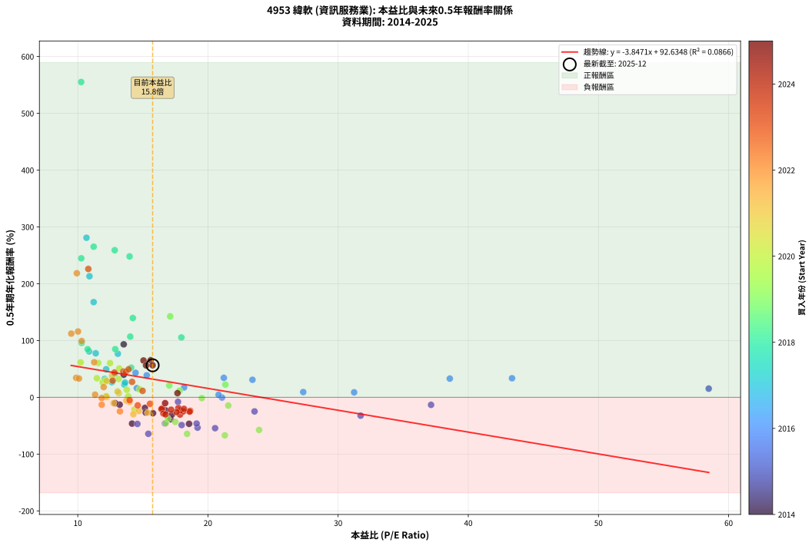
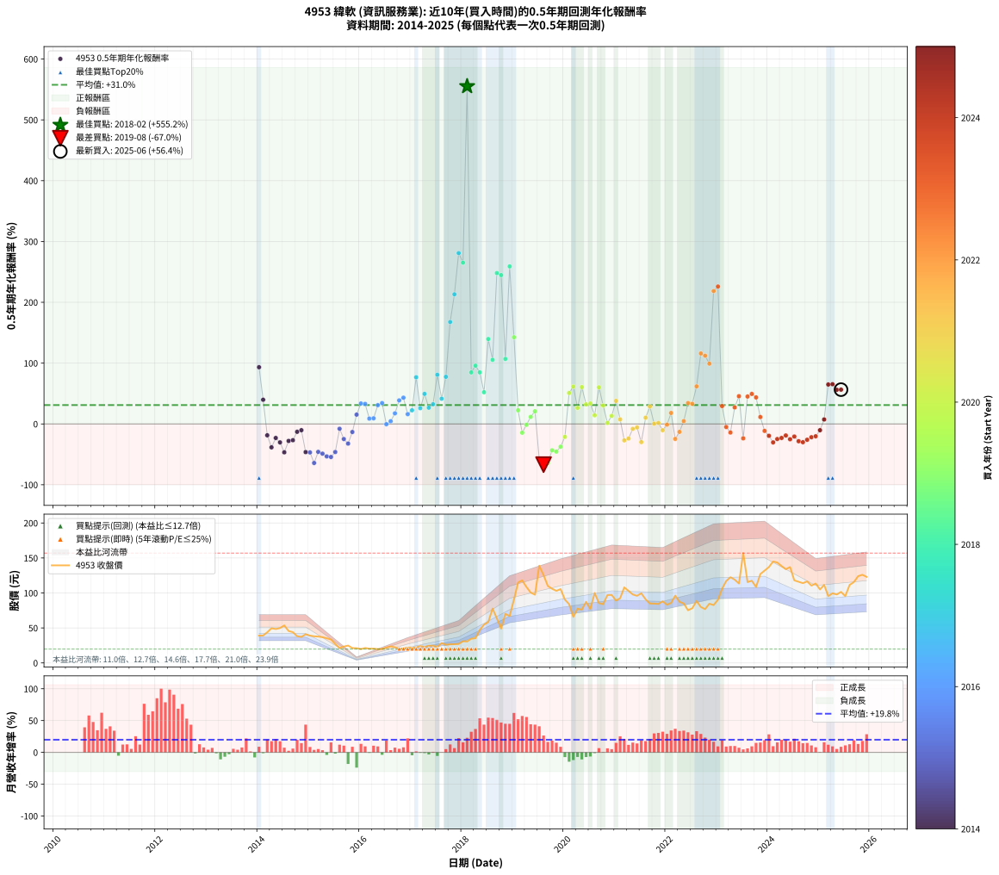

# 4953 緯軟 - 本益比與未來報酬率分析

!!! info "報告資訊"
    - **股票代號**: 4953
    - **公司名稱**: 緯軟
    - **產業別**: 資訊服務業
    - **分析期間**: 2014-2025 (138 個數據點)
    - **資料來源**: Type 12 (ShowMonthlyK_ChartFlow) 月收盤價與本益比
    - **報酬率口徑**: 含現金股利 (簡化: 年度合計，假設每年7/1入帳)
    - **報告生成時間**: 2026-01-04 08:50:28 CST

## 📈 視覺化圖表

### 圖表1: 本益比 vs 未來報酬率關係

*圖表1：4953 緯軟 本益比與0.5年期未來報酬率關係 (2014-2025)*

### 圖表2: 歷年買入時點的0.5年期實際報酬率

*圖表2：4953 緯軟 歷年買入時點的0.5年期實際報酬率 (2014-2025)*

## 📍 買點訊號說明

本報告提供兩種買點提示訊號（顯示於圖表2的股價子圖中）：

### ▲ 小綠色三角形（回測驗證）
- **計算方式**: 使用全部歷史資料計算本益比第25百分位數
- **用途**: 事後驗證，顯示歷史上哪些時點確實為低估區
- **限制**: 當下無法判斷，僅供回測參考
- **特性**: 後見之明（Look-Ahead Bias）

### ▲ 小橘色三角形（即時訊號）
- **計算方式**: 使用截至當月的過去5年資料計算本益比第25百分位數
- **用途**: 實際投資決策，當時即可判斷
- **優勢**: 可操作性強，符合實務需求
- **特性**: 無後見之明，滾動窗口計算

!!! tip "如何使用兩種訊號"
    - **綠色▲** 幫助理解歷史估值機會，驗證策略有效性
    - **橘色▲** 可作為實際買進參考，但仍需搭配基本面分析
    - 兩種訊號重疊時，表示即時判斷與事後驗證一致，信心度較高
    - 僅有綠色▲時，表示當時無法判斷（需要未來資料才能確認）
    - 僅有橘色▲時，表示即時判斷為買點，但事後可能不是最佳時機

## 📊 估值分析摘要

| 指標 | 數值 |
|:---:|:---:|
| **目前本益比** (2025-06) | **15.75 倍** |
| **歷史平均本益比** | 16.02 倍 |
| **估值水準** | 🟡 合理範圍 |
| **預期0.5年年化報酬率** | **+32.04%** |
| **歷史平均報酬率** | +31.00% |
| **相關係數 (R²)** | 0.0866 |
| **趨勢線斜率** | -3.8471 |

!!! abstract "核心洞察"
    目前本益比接近歷史平均，預期報酬率符合長期趨勢

    根據歷史數據回測，4953 緯軟 在目前本益比 **15.8倍** 的估值水準下，
    預期未來0.5年年化報酬率約為 **+32.0%**。

    **重要提醒**: 本分析基於歷史數據統計，實際報酬率會受到公司基本面變化、產業趨勢、
    總體經濟環境等多重因素影響。R² = 0.09 表示本益比可解釋約 8.7% 的報酬率變異。

## 📈 歷史估值統計

### 最佳買點 (最高報酬率)

| 項目 | 數值 |
|:---:|:---:|
| 起始時間 | 2018-02 |
| 當時本益比 | 10.26 倍 |
| 起始價格 | 30.6 元 |
| 0.5年後價格 | 77.7 元 |
| **0.5年年化報酬率** | **+555.16%** |

### 最差買點 (最低報酬率)

| 項目 | 數值 |
|:---:|:---:|
| 起始時間 | 2019-08 |
| 當時本益比 | 21.30 倍 |
| 起始價格 | 125.5 元 |
| 0.5年後價格 | 65.8 元 |
| **0.5年年化報酬率** | **-66.95%** |

## 🎯 投資啟示

### 本益比與報酬率關係

趨勢線方程式: **y = -3.8471x + 92.6348**

!!! warning "強負相關"
    本益比與未來報酬率呈現強負相關。在高本益比時期買入，未來報酬率顯著較低；
    在低本益比時期買入，未來報酬率顯著較高。**估值紀律至關重要**。

### 估值區間建議

基於歷史數據分析:

- **🟢 低估區** (P/E < 12.8): 預期報酬率較高，可考慮增加持股
- **🟡 合理區** (P/E 12.8-19.2): 預期報酬率符合長期趨勢，正常持有
- **🔴 高估區** (P/E > 19.2): 預期報酬率較低，可考慮減碼或觀望

!!! danger "風險提示"
    - 過去表現不代表未來結果
    - 本分析假設公司基本面無重大結構性變化
    - 產業環境劇變可能使歷史規律失效
    - 應結合公司財報、產業趨勢、總體經濟等多重因素綜合判斷

!!! success "長期投資觀點"
    歷史數據顯示，在合理或低估的估值水準買入並長期持有，
    往往能獲得較佳的投資報酬。**耐心等待好價格**是價值投資的核心原則。

## 📊 數據品質

- **資料來源**: GoodInfo.tw Type 12 (ShowMonthlyK_ChartFlow)
- **資料頻率**: 月度收盤價與本益比
- **回測期間**: 2014-2025
- **數據點數量**: 138 個 (每個點代表一次0.5年期回測)

### 計算方法說明

1. **0.5年期年化報酬率**:
   - 對每個歷史時點，計算其後0.5年的實際投資報酬率
   - 期末價值(不含股利): 期末價格
   - 期末價值(含現金股利): 期末價格 + 持有期間內的現金股利合計 (簡化: 年度合計，假設每年7/1入帳)
   - 公式: 年化報酬率 = [(期末價值/期初價格)^(1/年數) - 1] × 100%

2. **本益比 (P/E Ratio)**:
   - 使用當時的月收盤價與EPS計算
   - 資料來源: Type 12 月度河流圖本益比數據

3. **趨勢線 (Linear Regression)**:
   - 使用最小平方法擬合線性趨勢線
   - R²值衡量本益比對報酬率的解釋能力

---

*本報告由 Stock Analysis System v1.9.0 自動生成*
*數據更新時間: 2026-01-04 08:50:28 CST*

## 📋 月度回測明細表

（每一列對應時間線圖中的一個買入點；可用來對照 SVG 圖上的每個點。）

| 買入月份 | 賣出月份 | 回測期限_年 | 實際持有年數 | 買入本益比_倍 | 買入收盤價_元 | 賣出收盤價_元 | 現金股利合計_元 | 總報酬率_pct | 年化報酬率_pct |
| --- | --- | --- | --- | --- | --- | --- | --- | --- | --- |
| 2014-01 | 2014-07 | 0.5 | 0.496 | 13.53 | 39.10 | 53.60 | 0.60 | +38.62 | +93.28 |
| 2014-02 | 2014-08 | 0.5 | 0.498 | 13.53 | 39.10 | 45.60 | 0.60 | +18.16 | +39.77 |
| 2014-03 | 2014-10 | 0.5 | 0.586 | 15.16 | 43.80 | 38.20 | 0.60 | -11.42 | -18.69 |
| 2014-04 | 2014-10 | 0.5 | 0.501 | 17.13 | 49.50 | 38.20 | 0.60 | -21.62 | -38.50 |
| 2014-05 | 2014-12 | 0.5 | 0.586 | 16.76 | 48.45 | 40.95 | 0.60 | -14.24 | -23.07 |
| 2014-06 | 2014-12 | 0.5 | 0.501 | 17.23 | 49.80 | 40.95 | 0.60 | -16.57 | -30.34 |
| 2014-07 | 2015-01 | 0.5 | 0.504 | 18.55 | 53.60 | 39.05 | 0.00 | -27.15 | -46.67 |
| 2014-08 | 2015-03 | 0.5 | 0.580 | 15.78 | 45.60 | 37.70 | 0.00 | -17.32 | -27.95 |
| 2014-09 | 2015-03 | 0.5 | 0.496 | 15.22 | 44.00 | 37.70 | 0.00 | -14.32 | -26.79 |
| 2014-10 | 2015-05 | 0.5 | 0.580 | 13.22 | 38.20 | 35.25 | 0.00 | -7.72 | -12.93 |
| 2014-11 | 2015-05 | 0.5 | 0.496 | 12.87 | 37.20 | 35.25 | 0.00 | -5.24 | -10.30 |
| 2014-12 | 2015-07 | 0.5 | 0.580 | 14.17 | 40.95 | 27.05 | 1.50 | -30.28 | -46.28 |
| 2015-01 | 2015-07 | 0.5 | 0.496 | 14.58 | 39.05 | 27.05 | 1.50 | -26.89 | -46.85 |
| 2015-02 | 2015-08 | 0.5 | 0.498 | 15.42 | 38.05 | 21.30 | 1.50 | -40.08 | -64.22 |
| 2015-03 | 2015-10 | 0.5 | 0.586 | 16.70 | 37.70 | 24.80 | 1.50 | -30.24 | -45.91 |
| 2015-04 | 2015-10 | 0.5 | 0.501 | 17.98 | 36.80 | 24.80 | 1.50 | -28.53 | -48.85 |
| 2015-05 | 2015-12 | 0.5 | 0.586 | 19.20 | 35.25 | 21.05 | 1.50 | -36.03 | -53.35 |
| 2015-06 | 2015-12 | 0.5 | 0.501 | 20.55 | 33.40 | 21.05 | 1.50 | -32.49 | -54.34 |
| 2015-07 | 2016-01 | 0.5 | 0.504 | 19.13 | 27.05 | 19.80 | 0.00 | -26.80 | -46.17 |
| 2015-08 | 2016-03 | 0.5 | 0.583 | 17.70 | 21.30 | 20.30 | 0.00 | -4.69 | -7.91 |
| 2015-09 | 2016-03 | 0.5 | 0.498 | 23.58 | 23.40 | 20.30 | 0.00 | -13.25 | -24.81 |
| 2015-10 | 2016-05 | 0.5 | 0.583 | 31.73 | 24.80 | 19.75 | 0.00 | -20.36 | -32.32 |
| 2015-11 | 2016-05 | 0.5 | 0.498 | 37.14 | 21.20 | 19.75 | 0.00 | -6.84 | -13.25 |
| 2015-12 | 2016-07 | 0.5 | 0.583 | 58.47 | 21.05 | 21.85 | 1.02 | +8.67 | +15.32 |
| 2016-01 | 2016-07 | 0.5 | 0.498 | 43.36 | 19.80 | 21.85 | 1.02 | +15.53 | +33.59 |
| 2016-02 | 2016-08 | 0.5 | 0.501 | 38.58 | 21.35 | 23.60 | 1.02 | +15.33 | +32.94 |
| 2016-03 | 2016-10 | 0.5 | 0.586 | 31.23 | 20.30 | 20.30 | 1.02 | +5.04 | +8.76 |
| 2016-04 | 2016-10 | 0.5 | 0.501 | 27.32 | 20.40 | 20.30 | 1.02 | +4.53 | +9.24 |
| 2016-05 | 2016-12 | 0.5 | 0.586 | 23.42 | 19.75 | 22.10 | 1.02 | +17.08 | +30.89 |
| 2016-06 | 2016-12 | 0.5 | 0.501 | 21.22 | 19.95 | 22.10 | 1.02 | +15.91 | +34.27 |
| 2016-07 | 2017-01 | 0.5 | 0.504 | 21.08 | 21.85 | 21.80 | 0.00 | -0.23 | -0.45 |
| 2016-08 | 2017-03 | 0.5 | 0.580 | 20.82 | 23.60 | 24.20 | 0.00 | +2.54 | +4.42 |
| 2016-09 | 2017-03 | 0.5 | 0.496 | 18.17 | 22.35 | 24.20 | 0.00 | +8.28 | +17.41 |
| 2016-10 | 2017-05 | 0.5 | 0.580 | 15.30 | 20.30 | 24.55 | 0.00 | +20.94 | +38.75 |
| 2016-11 | 2017-05 | 0.5 | 0.496 | 14.44 | 20.55 | 24.55 | 0.00 | +19.46 | +43.17 |
| 2016-12 | 2017-07 | 0.5 | 0.580 | 14.54 | 22.10 | 23.00 | 1.10 | +9.05 | +16.10 |
| 2017-01 | 2017-07 | 0.5 | 0.496 | 13.58 | 21.80 | 23.00 | 1.10 | +10.55 | +22.43 |
| 2017-02 | 2017-08 | 0.5 | 0.498 | 13.08 | 22.10 | 28.25 | 1.10 | +32.81 | +76.72 |
| 2017-03 | 2017-10 | 0.5 | 0.586 | 13.63 | 24.20 | 26.60 | 1.10 | +14.46 | +25.93 |
| 2017-04 | 2017-10 | 0.5 | 0.501 | 12.18 | 22.65 | 26.60 | 1.10 | +22.30 | +49.44 |
| 2017-05 | 2017-12 | 0.5 | 0.586 | 12.62 | 24.55 | 27.10 | 1.10 | +14.87 | +26.69 |
| 2017-06 | 2017-12 | 0.5 | 0.501 | 12.07 | 24.50 | 27.10 | 1.10 | +15.10 | +32.41 |
| 2017-07 | 2018-01 | 0.5 | 0.504 | 10.87 | 23.00 | 31.00 | 0.00 | +34.78 | +80.85 |
| 2017-08 | 2018-03 | 0.5 | 0.580 | 12.84 | 28.25 | 34.55 | 0.00 | +22.30 | +41.46 |
| 2017-09 | 2018-03 | 0.5 | 0.496 | 11.38 | 26.00 | 34.55 | 0.00 | +32.88 | +77.49 |
| 2017-10 | 2018-05 | 0.5 | 0.580 | 11.22 | 26.60 | 47.10 | 0.00 | +77.07 | +167.62 |
| 2017-11 | 2018-05 | 0.5 | 0.496 | 10.90 | 26.75 | 47.10 | 0.00 | +76.07 | +213.19 |
| 2017-12 | 2018-07 | 0.5 | 0.580 | 10.67 | 27.10 | 58.40 | 0.50 | +117.34 | +280.94 |
| 2018-01 | 2018-07 | 0.5 | 0.496 | 11.22 | 31.00 | 58.40 | 0.50 | +90.00 | +265.18 |
| 2018-02 | 2018-08 | 0.5 | 0.498 | 10.26 | 30.65 | 77.70 | 0.50 | +155.14 | +555.16 |
| 2018-03 | 2018-10 | 0.5 | 0.586 | 10.76 | 34.55 | 49.00 | 0.50 | +43.27 | +84.72 |
| 2018-04 | 2018-10 | 0.5 | 0.501 | 10.30 | 35.35 | 49.00 | 0.50 | +40.03 | +95.81 |
| 2018-05 | 2018-12 | 0.5 | 0.586 | 12.88 | 47.10 | 67.00 | 0.50 | +43.31 | +84.82 |
| 2018-06 | 2018-12 | 0.5 | 0.501 | 14.10 | 54.70 | 67.00 | 0.50 | +23.40 | +52.15 |
| 2018-07 | 2019-01 | 0.5 | 0.504 | 14.23 | 58.40 | 90.70 | 0.00 | +55.31 | +139.62 |
| 2018-08 | 2019-03 | 0.5 | 0.580 | 17.96 | 77.70 | 118.00 | 0.00 | +51.87 | +105.42 |
| 2018-09 | 2019-03 | 0.5 | 0.496 | 13.98 | 63.60 | 118.00 | 0.00 | +85.53 | +248.07 |
| 2018-10 | 2019-05 | 0.5 | 0.580 | 10.27 | 49.00 | 100.50 | 0.00 | +105.10 | +244.74 |
| 2018-11 | 2019-05 | 0.5 | 0.496 | 14.03 | 70.10 | 100.50 | 0.00 | +43.37 | +106.87 |
| 2018-12 | 2019-07 | 0.5 | 0.580 | 12.84 | 67.00 | 139.00 | 1.70 | +109.99 | +259.02 |
| 2019-01 | 2019-07 | 0.5 | 0.496 | 17.10 | 90.70 | 139.00 | 1.70 | +55.12 | +142.53 |
| 2019-02 | 2019-08 | 0.5 | 0.498 | 21.34 | 115.00 | 125.50 | 1.70 | +10.60 | +22.42 |
| 2019-03 | 2019-10 | 0.5 | 0.586 | 21.56 | 118.00 | 106.00 | 1.70 | -8.73 | -14.44 |
| 2019-04 | 2019-10 | 0.5 | 0.501 | 19.53 | 108.50 | 106.00 | 1.70 | -0.74 | -1.48 |
| 2019-05 | 2019-12 | 0.5 | 0.586 | 17.82 | 100.50 | 105.50 | 1.70 | +6.66 | +11.64 |
| 2019-06 | 2019-12 | 0.5 | 0.501 | 17.03 | 97.50 | 105.50 | 1.70 | +9.94 | +20.83 |
| 2019-07 | 2020-01 | 0.5 | 0.504 | 23.93 | 139.00 | 90.40 | 0.00 | -34.96 | -57.43 |
| 2019-08 | 2020-03 | 0.5 | 0.583 | 21.30 | 125.50 | 65.80 | 0.00 | -47.57 | -66.95 |
| 2019-09 | 2020-03 | 0.5 | 0.498 | 18.40 | 110.00 | 65.80 | 0.00 | -40.18 | -64.34 |
| 2019-10 | 2020-05 | 0.5 | 0.583 | 17.49 | 106.00 | 76.10 | 0.00 | -28.21 | -43.35 |
| 2019-11 | 2020-05 | 0.5 | 0.498 | 16.76 | 103.00 | 76.10 | 0.00 | -26.12 | -45.53 |
| 2019-12 | 2020-07 | 0.5 | 0.583 | 16.93 | 105.50 | 77.00 | 3.23 | -23.95 | -37.47 |
| 2020-01 | 2020-07 | 0.5 | 0.498 | 14.35 | 90.40 | 77.00 | 3.23 | -11.25 | -21.29 |
| 2020-02 | 2020-08 | 0.5 | 0.501 | 13.19 | 84.00 | 100.00 | 3.23 | +22.90 | +50.90 |
| 2020-03 | 2020-10 | 0.5 | 0.586 | 10.22 | 65.80 | 83.90 | 3.23 | +32.42 | +61.49 |
| 2020-04 | 2020-10 | 0.5 | 0.501 | 11.91 | 77.50 | 83.90 | 3.23 | +12.43 | +26.34 |
| 2020-05 | 2020-12 | 0.5 | 0.586 | 11.57 | 76.10 | 97.20 | 3.23 | +31.97 | +60.56 |
| 2020-06 | 2020-12 | 0.5 | 0.501 | 13.14 | 87.30 | 97.20 | 3.23 | +15.04 | +32.27 |
| 2020-07 | 2021-01 | 0.5 | 0.504 | 11.47 | 77.00 | 89.10 | 0.00 | +15.71 | +33.61 |
| 2020-08 | 2021-03 | 0.5 | 0.580 | 14.74 | 100.00 | 108.00 | 0.00 | +8.00 | +14.18 |
| 2020-09 | 2021-03 | 0.5 | 0.496 | 12.48 | 85.50 | 108.00 | 0.00 | +26.32 | +60.23 |
| 2020-10 | 2021-05 | 0.5 | 0.580 | 12.12 | 83.90 | 97.80 | 0.00 | +16.57 | +30.23 |
| 2020-11 | 2021-05 | 0.5 | 0.496 | 13.88 | 97.00 | 97.80 | 0.00 | +0.82 | +1.67 |
| 2020-12 | 2021-07 | 0.5 | 0.580 | 13.77 | 97.20 | 99.50 | 4.98 | +7.49 | +13.26 |
| 2021-01 | 2021-07 | 0.5 | 0.496 | 12.64 | 89.10 | 99.50 | 4.98 | +17.27 | +37.91 |
| 2021-02 | 2021-08 | 0.5 | 0.498 | 13.15 | 92.50 | 90.90 | 4.98 | +3.66 | +7.48 |
| 2021-03 | 2021-10 | 0.5 | 0.586 | 15.38 | 108.00 | 84.80 | 4.98 | -16.87 | -27.04 |
| 2021-04 | 2021-10 | 0.5 | 0.501 | 14.69 | 103.00 | 84.80 | 4.98 | -12.83 | -23.97 |
| 2021-05 | 2021-12 | 0.5 | 0.586 | 13.98 | 97.80 | 88.10 | 4.98 | -4.82 | -8.09 |
| 2021-06 | 2021-12 | 0.5 | 0.501 | 13.73 | 95.90 | 88.10 | 4.98 | -2.94 | -5.78 |
| 2021-07 | 2022-01 | 0.5 | 0.504 | 14.27 | 99.50 | 83.20 | 0.00 | -16.38 | -29.89 |
| 2021-08 | 2022-03 | 0.5 | 0.580 | 13.06 | 90.90 | 96.20 | 0.00 | +5.83 | +10.26 |
| 2021-09 | 2022-03 | 0.5 | 0.496 | 12.22 | 84.90 | 96.20 | 0.00 | +13.31 | +28.68 |
| 2021-10 | 2022-05 | 0.5 | 0.580 | 12.23 | 84.80 | 85.00 | 0.00 | +0.24 | +0.41 |
| 2021-11 | 2022-05 | 0.5 | 0.496 | 12.18 | 84.30 | 85.00 | 0.00 | +0.83 | +1.68 |
| 2021-12 | 2022-07 | 0.5 | 0.580 | 12.75 | 88.10 | 78.10 | 4.59 | -6.14 | -10.35 |
| 2022-01 | 2022-07 | 0.5 | 0.496 | 11.84 | 83.20 | 78.10 | 4.59 | -0.62 | -1.24 |
| 2022-02 | 2022-08 | 0.5 | 0.498 | 11.99 | 85.70 | 88.50 | 4.59 | +8.62 | +18.05 |
| 2022-03 | 2022-10 | 0.5 | 0.586 | 13.24 | 96.20 | 76.90 | 4.59 | -15.29 | -24.67 |
| 2022-04 | 2022-10 | 0.5 | 0.501 | 11.84 | 87.40 | 76.90 | 4.59 | -6.77 | -13.05 |
| 2022-05 | 2022-12 | 0.5 | 0.586 | 11.33 | 85.00 | 82.70 | 4.59 | +2.69 | +4.64 |
| 2022-06 | 2022-12 | 0.5 | 0.501 | 9.88 | 75.30 | 82.70 | 4.59 | +15.92 | +34.29 |
| 2022-07 | 2023-01 | 0.5 | 0.504 | 10.09 | 78.10 | 90.20 | 0.00 | +15.49 | +33.10 |
| 2022-08 | 2023-03 | 0.5 | 0.580 | 11.26 | 88.50 | 117.00 | 0.00 | +32.20 | +61.77 |
| 2022-09 | 2023-03 | 0.5 | 0.496 | 10.02 | 79.90 | 117.00 | 0.00 | +46.43 | +115.90 |
| 2022-10 | 2023-05 | 0.5 | 0.580 | 9.50 | 76.90 | 119.00 | 0.00 | +54.75 | +112.17 |
| 2022-11 | 2023-05 | 0.5 | 0.496 | 10.30 | 84.60 | 119.00 | 0.00 | +40.66 | +99.07 |
| 2022-12 | 2023-07 | 0.5 | 0.580 | 9.93 | 82.70 | 157.00 | 5.00 | +95.89 | +218.49 |
| 2023-01 | 2023-07 | 0.5 | 0.496 | 10.81 | 90.20 | 157.00 | 5.00 | +79.60 | +225.97 |
| 2023-02 | 2023-08 | 0.5 | 0.498 | 12.68 | 106.00 | 115.50 | 5.00 | +13.68 | +29.34 |
| 2023-03 | 2023-10 | 0.5 | 0.586 | 13.98 | 117.00 | 108.50 | 5.00 | -2.99 | -5.05 |
| 2023-04 | 2023-10 | 0.5 | 0.501 | 14.61 | 122.50 | 108.50 | 5.00 | -7.35 | -14.13 |
| 2023-05 | 2023-12 | 0.5 | 0.586 | 14.17 | 119.00 | 132.00 | 5.00 | +15.13 | +27.18 |
| 2023-06 | 2023-12 | 0.5 | 0.501 | 13.50 | 113.50 | 132.00 | 5.00 | +20.70 | +45.58 |
| 2023-07 | 2024-01 | 0.5 | 0.504 | 18.64 | 157.00 | 137.00 | 0.00 | -12.74 | -23.70 |
| 2023-08 | 2024-03 | 0.5 | 0.583 | 13.69 | 115.50 | 143.50 | 0.00 | +24.24 | +45.10 |
| 2023-09 | 2024-03 | 0.5 | 0.498 | 13.91 | 117.50 | 143.50 | 0.00 | +22.13 | +49.36 |
| 2023-10 | 2024-05 | 0.5 | 0.583 | 12.82 | 108.50 | 134.00 | 0.00 | +23.50 | +43.62 |
| 2023-11 | 2024-05 | 0.5 | 0.498 | 14.98 | 127.00 | 134.00 | 0.00 | +5.51 | +11.37 |
| 2023-12 | 2024-07 | 0.5 | 0.583 | 15.55 | 132.00 | 118.00 | 4.96 | -6.85 | -11.46 |
| 2024-01 | 2024-07 | 0.5 | 0.498 | 16.50 | 137.00 | 118.00 | 4.96 | -10.25 | -19.51 |
| 2024-02 | 2024-08 | 0.5 | 0.501 | 17.86 | 145.00 | 116.00 | 4.96 | -16.58 | -30.36 |
| 2024-03 | 2024-10 | 0.5 | 0.586 | 18.10 | 143.50 | 116.50 | 4.96 | -15.36 | -24.77 |
| 2024-04 | 2024-10 | 0.5 | 0.501 | 17.89 | 138.50 | 116.50 | 4.96 | -12.31 | -23.06 |
| 2024-05 | 2024-12 | 0.5 | 0.586 | 17.73 | 134.00 | 113.50 | 4.96 | -11.60 | -18.98 |
| 2024-06 | 2024-12 | 0.5 | 0.501 | 18.59 | 137.00 | 113.50 | 4.96 | -13.54 | -25.19 |
| 2024-07 | 2025-01 | 0.5 | 0.504 | 16.43 | 118.00 | 105.00 | 0.00 | -11.02 | -20.68 |
| 2024-08 | 2025-03 | 0.5 | 0.580 | 16.58 | 116.00 | 95.50 | 0.00 | -17.67 | -28.47 |
| 2024-09 | 2025-03 | 0.5 | 0.496 | 16.74 | 114.00 | 95.50 | 0.00 | -16.23 | -30.05 |
| 2024-10 | 2025-05 | 0.5 | 0.580 | 17.59 | 116.50 | 97.80 | 0.00 | -16.05 | -26.03 |
| 2024-11 | 2025-05 | 0.5 | 0.496 | 17.17 | 110.50 | 97.80 | 0.00 | -11.49 | -21.84 |
| 2024-12 | 2025-07 | 0.5 | 0.580 | 18.16 | 113.50 | 95.50 | 3.99 | -12.34 | -20.31 |
| 2025-01 | 2025-07 | 0.5 | 0.496 | 16.71 | 105.00 | 95.50 | 3.99 | -5.25 | -10.31 |
| 2025-02 | 2025-08 | 0.5 | 0.498 | 17.66 | 111.50 | 111.50 | 3.99 | +3.58 | +7.31 |
| 2025-03 | 2025-10 | 0.5 | 0.586 | 15.05 | 95.50 | 124.00 | 3.99 | +34.02 | +64.84 |
| 2025-04 | 2025-10 | 0.5 | 0.501 | 15.60 | 99.50 | 124.00 | 3.99 | +28.63 | +65.29 |
| 2025-05 | 2025-12 | 0.5 | 0.586 | 15.25 | 97.80 | 123.00 | 3.99 | +29.85 | +56.17 |
| 2025-06 | 2025-12 | 0.5 | 0.501 | 15.75 | 101.50 | 123.00 | 3.99 | +25.11 | +56.39 |
