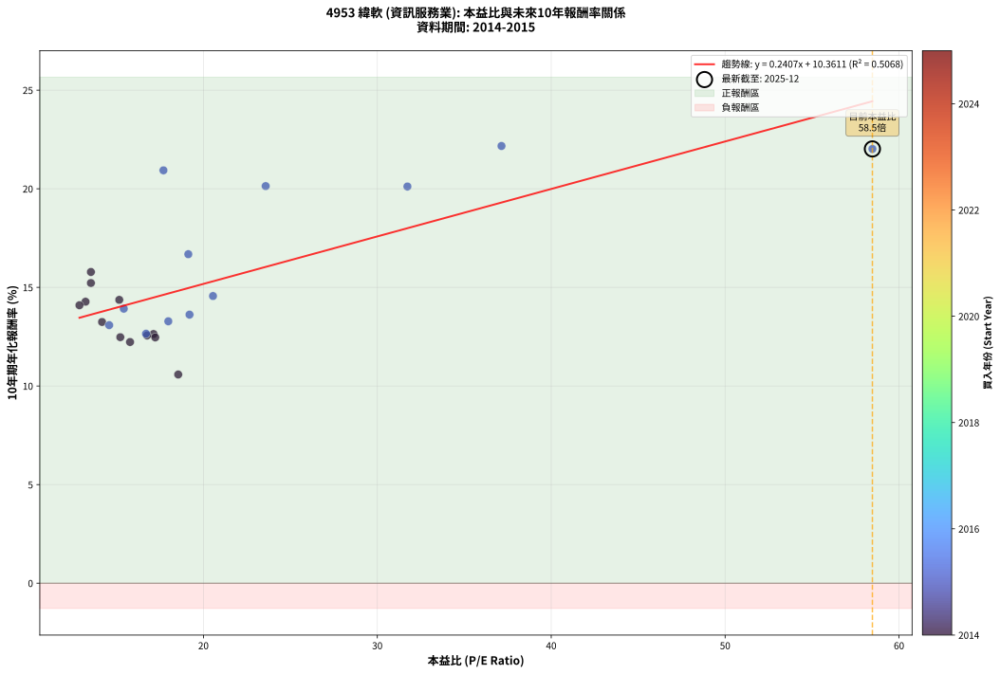
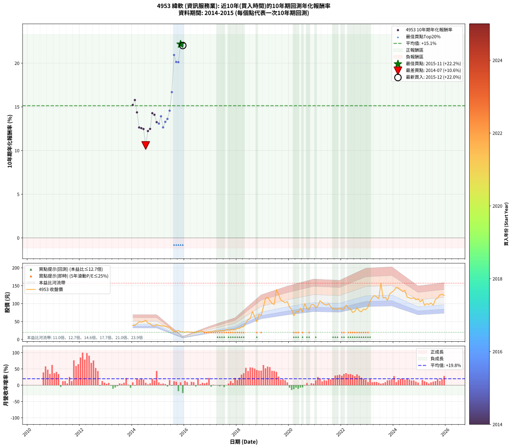

# 4953 緯軟 - 本益比與未來報酬率分析

!!! info "報告資訊"
    - **股票代號**: 4953
    - **公司名稱**: 緯軟
    - **產業別**: 資訊服務業
    - **分析期間**: 2014-2015 (24 個數據點)
    - **資料來源**: Type 12 (ShowMonthlyK_ChartFlow) 月收盤價與本益比
    - **報酬率口徑**: 含現金股利 (簡化: 年度合計，假設每年7/1入帳)
    - **報告生成時間**: 2026-01-05 01:01:09 CST

## 📈 視覺化圖表

### 圖表1: 本益比 vs 未來報酬率關係

*圖表1：4953 緯軟 本益比與10年期未來報酬率關係 (2014-2015)*

### 圖表2: 歷年買入時點的10年期實際報酬率

*圖表2：4953 緯軟 歷年買入時點的10年期實際報酬率 (2014-2015)*

## 📍 買點訊號說明

本報告提供兩種買點提示訊號（顯示於圖表2的股價子圖中）：

### ▲ 小綠色三角形（回測驗證）
- **計算方式**: 使用全部歷史資料計算本益比第25百分位數
- **用途**: 事後驗證，顯示歷史上哪些時點確實為低估區
- **限制**: 當下無法判斷，僅供回測參考
- **特性**: 後見之明（Look-Ahead Bias）

### ▲ 小橘色三角形（即時訊號）
- **計算方式**: 使用截至當月的過去5年資料計算本益比第25百分位數
- **用途**: 實際投資決策，當時即可判斷
- **優勢**: 可操作性強，符合實務需求
- **特性**: 無後見之明，滾動窗口計算

!!! tip "如何使用兩種訊號"
    - **綠色▲** 幫助理解歷史估值機會，驗證策略有效性
    - **橘色▲** 可作為實際買進參考，但仍需搭配基本面分析
    - 兩種訊號重疊時，表示即時判斷與事後驗證一致，信心度較高
    - 僅有綠色▲時，表示當時無法判斷（需要未來資料才能確認）
    - 僅有橘色▲時，表示即時判斷為買點，但事後可能不是最佳時機

## 📊 估值分析摘要

| 指標 | 數值 |
|:---:|:---:|
| **目前本益比** (2015-12) | **58.47 倍** |
| **歷史平均本益比** | 19.81 倍 |
| **估值水準** | 🔴 相對高估 |
| **預期10年年化報酬率** | **+24.44%** |
| **歷史平均報酬率** | +15.13% |
| **相關係數 (R²)** | 0.5068 |
| **趨勢線斜率** | 0.2407 |

!!! abstract "核心洞察"
    目前本益比顯著高於歷史平均，預期未來報酬率可能較低

    根據歷史數據回測，4953 緯軟 在目前本益比 **58.5倍** 的估值水準下，
    預期未來10年年化報酬率約為 **+24.4%**。

    **重要提醒**: 本分析基於歷史數據統計，實際報酬率會受到公司基本面變化、產業趨勢、
    總體經濟環境等多重因素影響。R² = 0.51 表示本益比可解釋約 50.7% 的報酬率變異。

## 📈 歷史估值統計

### 最佳買點 (最高報酬率)

| 項目 | 數值 |
|:---:|:---:|
| 起始時間 | 2015-11 |
| 當時本益比 | 37.14 倍 |
| 起始價格 | 21.2 元 |
| 10年後價格 | 126.0 元 |
| **10年年化報酬率** | **+22.17%** |

### 最差買點 (最低報酬率)

| 項目 | 數值 |
|:---:|:---:|
| 起始時間 | 2014-07 |
| 當時本益比 | 18.55 倍 |
| 起始價格 | 53.6 元 |
| 10年後價格 | 118.0 元 |
| **10年年化報酬率** | **+10.58%** |

## 🎯 投資啟示

### 本益比與報酬率關係

趨勢線方程式: **y = 0.2407x + 10.3611**

!!! info "弱相關或正相關"
    本益比與未來報酬率相關性較弱。這可能表示該股票的報酬率更多受到
    公司成長性、產業趨勢等因素影響，而非估值水準。**需綜合考量多項指標**。

### 估值區間建議

基於歷史數據分析:

- **🟢 低估區** (P/E < 15.8): 預期報酬率較高，可考慮增加持股
- **🟡 合理區** (P/E 15.8-23.8): 預期報酬率符合長期趨勢，正常持有
- **🔴 高估區** (P/E > 23.8): 預期報酬率較低，可考慮減碼或觀望

!!! danger "風險提示"
    - 過去表現不代表未來結果
    - 本分析假設公司基本面無重大結構性變化
    - 產業環境劇變可能使歷史規律失效
    - 應結合公司財報、產業趨勢、總體經濟等多重因素綜合判斷

!!! success "長期投資觀點"
    歷史數據顯示，在合理或低估的估值水準買入並長期持有，
    往往能獲得較佳的投資報酬。**耐心等待好價格**是價值投資的核心原則。

## 📊 數據品質

- **資料來源**: GoodInfo.tw Type 12 (ShowMonthlyK_ChartFlow)
- **資料頻率**: 月度收盤價與本益比
- **回測期間**: 2014-2015
- **數據點數量**: 24 個 (每個點代表一次10年期回測)

### 計算方法說明

1. **10年期年化報酬率**:
   - 對每個歷史時點，計算其後10年的實際投資報酬率
   - 期末價值(不含股利): 期末價格
   - 期末價值(含現金股利): 期末價格 + 持有期間內的現金股利合計 (簡化: 年度合計，假設每年7/1入帳)
   - 公式: 年化報酬率 = [(期末價值/期初價格)^(1/年數) - 1] × 100%

2. **本益比 (P/E Ratio)**:
   - 使用當時的月收盤價與EPS計算
   - 資料來源: Type 12 月度河流圖本益比數據

3. **趨勢線 (Linear Regression)**:
   - 使用最小平方法擬合線性趨勢線
   - R²值衡量本益比對報酬率的解釋能力

---

*本報告由 Stock Analysis System v1.9.0 自動生成*
*數據更新時間: 2026-01-05 01:01:09 CST*

## 📋 月度回測明細表

（每一列對應時間線圖中的一個買入點；可用來對照 SVG 圖上的每個點。）

| 買入月份 | 賣出月份 | 回測期限_年 | 實際持有年數 | 買入本益比_倍 | 買入收盤價_元 | 賣出收盤價_元 | 現金股利合計_元 | 總報酬率_pct | 年化報酬率_pct |
| --- | --- | --- | --- | --- | --- | --- | --- | --- | --- |
| 2014-01 | 2024-01 | 10 | 9.999 | 13.53 | 39.10 | 137.00 | 24.22 | +312.33 | +15.22 |
| 2014-02 | 2024-02 | 10 | 9.999 | 13.53 | 39.10 | 145.00 | 24.22 | +332.79 | +15.78 |
| 2014-03 | 2024-03 | 10 | 10.001 | 15.16 | 43.80 | 143.50 | 24.22 | +282.93 | +14.37 |
| 2014-04 | 2024-04 | 10 | 10.001 | 17.13 | 49.50 | 138.50 | 24.22 | +228.73 | +12.64 |
| 2014-05 | 2024-05 | 10 | 10.001 | 16.76 | 48.45 | 134.00 | 24.22 | +226.57 | +12.56 |
| 2014-06 | 2024-06 | 10 | 10.001 | 17.23 | 49.80 | 137.00 | 24.22 | +223.74 | +12.46 |
| 2014-07 | 2024-07 | 10 | 10.001 | 18.55 | 53.60 | 118.00 | 28.58 | +173.47 | +10.58 |
| 2014-08 | 2024-08 | 10 | 10.001 | 15.78 | 45.60 | 116.00 | 28.58 | +217.06 | +12.23 |
| 2014-09 | 2024-09 | 10 | 10.001 | 15.22 | 44.00 | 114.00 | 28.58 | +224.04 | +12.47 |
| 2014-10 | 2024-10 | 10 | 10.001 | 13.22 | 38.20 | 116.50 | 28.58 | +279.79 | +14.27 |
| 2014-11 | 2024-11 | 10 | 10.001 | 12.87 | 37.20 | 110.50 | 28.58 | +273.87 | +14.09 |
| 2014-12 | 2024-12 | 10 | 10.001 | 14.17 | 40.95 | 113.50 | 28.58 | +246.96 | +13.25 |
| 2015-01 | 2025-01 | 10 | 10.001 | 14.58 | 39.05 | 105.00 | 28.58 | +242.07 | +13.08 |
| 2015-02 | 2025-02 | 10 | 10.001 | 15.42 | 38.05 | 111.50 | 28.58 | +268.14 | +13.92 |
| 2015-03 | 2025-03 | 10 | 10.001 | 16.70 | 37.70 | 95.50 | 28.58 | +229.12 | +12.65 |
| 2015-04 | 2025-04 | 10 | 10.001 | 17.98 | 36.80 | 99.50 | 28.58 | +248.04 | +13.28 |
| 2015-05 | 2025-05 | 10 | 10.001 | 19.20 | 35.25 | 97.80 | 28.58 | +258.52 | +13.62 |
| 2015-06 | 2025-06 | 10 | 10.001 | 20.55 | 33.40 | 101.50 | 28.58 | +289.46 | +14.56 |
| 2015-07 | 2025-07 | 10 | 10.001 | 19.13 | 27.05 | 95.50 | 31.07 | +367.91 | +16.68 |
| 2015-08 | 2025-08 | 10 | 10.001 | 17.70 | 21.30 | 111.50 | 31.07 | +569.34 | +20.94 |
| 2015-09 | 2025-09 | 10 | 10.001 | 23.58 | 23.40 | 115.50 | 31.07 | +526.36 | +20.14 |
| 2015-10 | 2025-10 | 10 | 10.001 | 31.73 | 24.80 | 124.00 | 31.07 | +525.28 | +20.11 |
| 2015-11 | 2025-11 | 10 | 10.001 | 37.14 | 21.20 | 126.00 | 31.07 | +640.89 | +22.17 |
| 2015-12 | 2025-12 | 10 | 10.001 | 58.47 | 21.05 | 123.00 | 31.07 | +631.92 | +22.02 |
