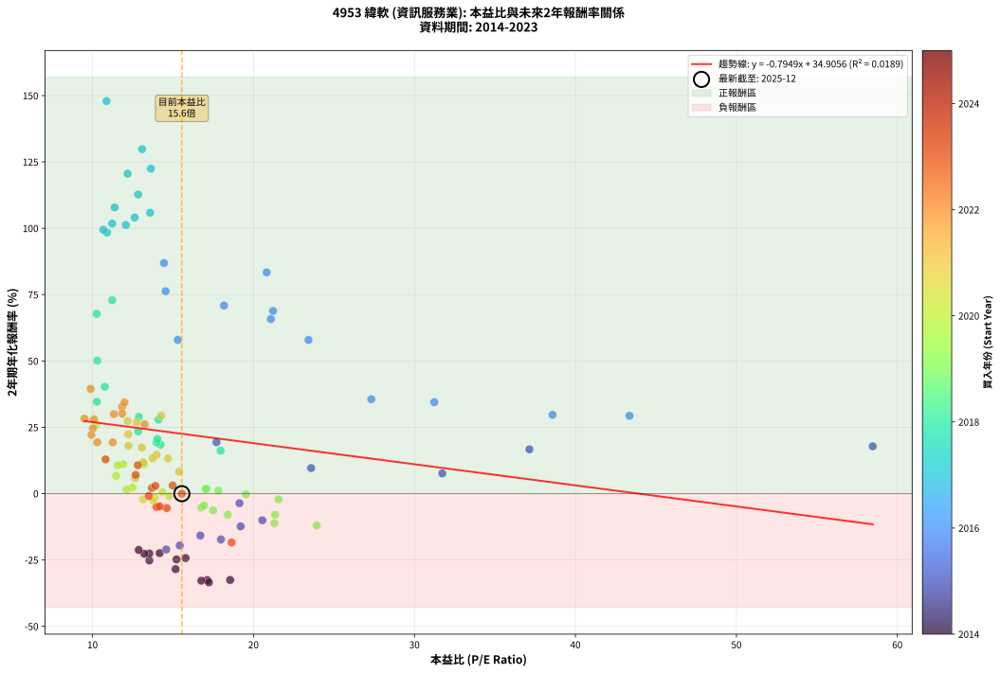
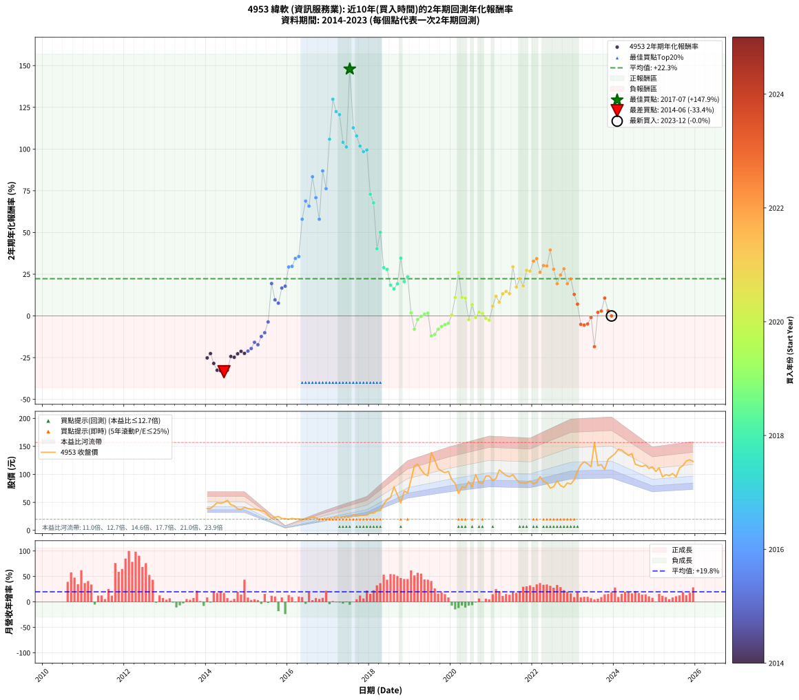

# 4953 緯軟 - 本益比與未來報酬率分析

!!! info "報告資訊"
    - **股票代號**: 4953
    - **公司名稱**: 緯軟
    - **產業別**: 資訊服務業
    - **分析期間**: 2014-2023 (120 個數據點)
    - **資料來源**: Type 12 (ShowMonthlyK_ChartFlow) 月收盤價與本益比
    - **報酬率口徑**: 含現金股利 (簡化: 年度合計，假設每年7/1入帳)
    - **報告生成時間**: 2026-01-10 18:59:30 CST

## 📈 視覺化圖表

### 圖表1: 本益比 vs 未來報酬率關係

*圖表1：4953 緯軟 本益比與2年期未來報酬率關係 (2014-2023)*

### 圖表2: 歷年買入時點的2年期實際報酬率

*圖表2：4953 緯軟 歷年買入時點的2年期實際報酬率 (2014-2023)*

## 📍 買點訊號說明

本報告提供兩種買點提示訊號（顯示於圖表2的股價子圖中）：

### ▲ 小綠色三角形（回測驗證）
- **計算方式**: 使用全部歷史資料計算本益比第25百分位數
- **用途**: 事後驗證，顯示歷史上哪些時點確實為低估區
- **限制**: 當下無法判斷，僅供回測參考
- **特性**: 後見之明（Look-Ahead Bias）

### ▲ 小橘色三角形（即時訊號）
- **計算方式**: 使用截至當月的過去5年資料計算本益比第25百分位數
- **用途**: 實際投資決策，當時即可判斷
- **優勢**: 可操作性強，符合實務需求
- **特性**: 無後見之明，滾動窗口計算

!!! tip "如何使用兩種訊號"
    - **綠色▲** 幫助理解歷史估值機會，驗證策略有效性
    - **橘色▲** 可作為實際買進參考，但仍需搭配基本面分析
    - 兩種訊號重疊時，表示即時判斷與事後驗證一致，信心度較高
    - 僅有綠色▲時，表示當時無法判斷（需要未來資料才能確認）
    - 僅有橘色▲時，表示即時判斷為買點，但事後可能不是最佳時機

## 📊 估值分析摘要

| 指標 | 數值 |
|:---:|:---:|
| **目前本益比** (2023-12) | **15.55 倍** |
| **歷史平均本益比** | 15.88 倍 |
| **估值水準** | 🟡 合理範圍 |
| **預期2年年化報酬率** | **+22.55%** |
| **歷史平均報酬率** | +22.28% |
| **相關係數 (R²)** | 0.0189 |
| **趨勢線斜率** | -0.7949 |

!!! abstract "核心洞察"
    目前本益比接近歷史平均，預期報酬率符合長期趨勢

    根據歷史數據回測，4953 緯軟 在目前本益比 **15.6倍** 的估值水準下，
    預期未來2年年化報酬率約為 **+22.5%**。

    **重要提醒**: 本分析基於歷史數據統計，實際報酬率會受到公司基本面變化、產業趨勢、
    總體經濟環境等多重因素影響。R² = 0.02 表示本益比可解釋約 1.9% 的報酬率變異。

## 📈 歷史估值統計

### 最佳買點 (最高報酬率)

| 項目 | 數值 |
|:---:|:---:|
| 起始時間 | 2017-07 |
| 當時本益比 | 10.87 倍 |
| 起始價格 | 23.0 元 |
| 2年後價格 | 139.0 元 |
| **2年年化報酬率** | **+147.92%** |

### 最差買點 (最低報酬率)

| 項目 | 數值 |
|:---:|:---:|
| 起始時間 | 2014-06 |
| 當時本益比 | 17.23 倍 |
| 起始價格 | 49.8 元 |
| 2年後價格 | 19.9 元 |
| **2年年化報酬率** | **-33.44%** |

## 🎯 投資啟示

### 本益比與報酬率關係

趨勢線方程式: **y = -0.7949x + 34.9056**

!!! warning "強負相關"
    本益比與未來報酬率呈現強負相關。在高本益比時期買入，未來報酬率顯著較低；
    在低本益比時期買入，未來報酬率顯著較高。**估值紀律至關重要**。

### 估值區間建議

基於歷史數據分析:

- **🟢 低估區** (P/E < 12.7): 預期報酬率較高，可考慮增加持股
- **🟡 合理區** (P/E 12.7-19.1): 預期報酬率符合長期趨勢，正常持有
- **🔴 高估區** (P/E > 19.1): 預期報酬率較低，可考慮減碼或觀望

!!! danger "風險提示"
    - 過去表現不代表未來結果
    - 本分析假設公司基本面無重大結構性變化
    - 產業環境劇變可能使歷史規律失效
    - 應結合公司財報、產業趨勢、總體經濟等多重因素綜合判斷

!!! success "長期投資觀點"
    歷史數據顯示，在合理或低估的估值水準買入並長期持有，
    往往能獲得較佳的投資報酬。**耐心等待好價格**是價值投資的核心原則。

## 📊 數據品質

- **資料來源**: GoodInfo.tw Type 12 (ShowMonthlyK_ChartFlow)
- **資料頻率**: 月度收盤價與本益比
- **回測期間**: 2014-2023
- **數據點數量**: 120 個 (每個點代表一次2年期回測)

### 計算方法說明

1. **2年期年化報酬率**:
   - 對每個歷史時點，計算其後2年的實際投資報酬率
   - 期末價值(不含股利): 期末價格
   - 期末價值(含現金股利): 期末價格 + 持有期間內的現金股利合計 (簡化: 年度合計，假設每年7/1入帳)
   - 公式: 年化報酬率 = [(期末價值/期初價格)^(1/年數) - 1] × 100%

2. **本益比 (P/E Ratio)**:
   - 使用當時的月收盤價與EPS計算
   - 資料來源: Type 12 月度河流圖本益比數據

3. **趨勢線 (Linear Regression)**:
   - 使用最小平方法擬合線性趨勢線
   - R²值衡量本益比對報酬率的解釋能力

---

*本報告由 Stock Analysis System v1.9.0 自動生成*
*數據更新時間: 2026-01-10 18:59:30 CST*

## 📋 月度回測明細表

（每一列對應時間線圖中的一個買入點；可用來對照 SVG 圖上的每個點。）

| 買入月份 | 賣出月份 | 回測期限_年 | 實際持有年數 | 買入本益比_倍 | 買入收盤價_元 | 賣出收盤價_元 | 現金股利合計_元 | 總報酬率_pct | 年化報酬率_pct |
| --- | --- | --- | --- | --- | --- | --- | --- | --- | --- |
| 2014-01 | 2016-01 | 2 | 1.999 | 13.53 | 39.10 | 19.80 | 2.10 | -43.99 | -25.17 |
| 2014-02 | 2016-02 | 2 | 1.999 | 13.53 | 39.10 | 21.35 | 2.10 | -40.03 | -22.57 |
| 2014-03 | 2016-03 | 2 | 2.001 | 15.16 | 43.80 | 20.30 | 2.10 | -48.86 | -28.47 |
| 2014-04 | 2016-04 | 2 | 2.001 | 17.13 | 49.50 | 20.40 | 2.10 | -54.55 | -32.56 |
| 2014-05 | 2016-05 | 2 | 2.001 | 16.76 | 48.45 | 19.75 | 2.10 | -54.90 | -32.83 |
| 2014-06 | 2016-06 | 2 | 2.001 | 17.23 | 49.80 | 19.95 | 2.10 | -55.72 | -33.44 |
| 2014-07 | 2016-07 | 2 | 2.001 | 18.55 | 53.60 | 21.85 | 2.52 | -54.53 | -32.55 |
| 2014-08 | 2016-08 | 2 | 2.001 | 15.78 | 45.60 | 23.60 | 2.52 | -42.71 | -24.30 |
| 2014-09 | 2016-09 | 2 | 2.001 | 15.22 | 44.00 | 22.35 | 2.52 | -43.47 | -24.80 |
| 2014-10 | 2016-10 | 2 | 2.001 | 13.22 | 38.20 | 20.30 | 2.52 | -40.25 | -22.69 |
| 2014-11 | 2016-11 | 2 | 2.001 | 12.87 | 37.20 | 20.55 | 2.52 | -37.97 | -21.23 |
| 2014-12 | 2016-12 | 2 | 2.001 | 14.17 | 40.95 | 22.10 | 2.52 | -39.87 | -22.44 |
| 2015-01 | 2017-01 | 2 | 2.001 | 14.58 | 39.05 | 21.80 | 2.52 | -37.71 | -21.06 |
| 2015-02 | 2017-02 | 2 | 2.001 | 15.42 | 38.05 | 22.10 | 2.52 | -35.29 | -19.54 |
| 2015-03 | 2017-03 | 2 | 2.001 | 16.70 | 37.70 | 24.20 | 2.52 | -29.11 | -15.80 |
| 2015-04 | 2017-04 | 2 | 2.001 | 17.98 | 36.80 | 22.65 | 2.52 | -31.59 | -17.28 |
| 2015-05 | 2017-05 | 2 | 2.001 | 19.20 | 35.25 | 24.55 | 2.52 | -23.19 | -12.35 |
| 2015-06 | 2017-06 | 2 | 2.001 | 20.55 | 33.40 | 24.50 | 2.52 | -19.09 | -10.04 |
| 2015-07 | 2017-07 | 2 | 2.001 | 19.13 | 27.05 | 23.00 | 2.12 | -7.12 | -3.62 |
| 2015-08 | 2017-08 | 2 | 2.001 | 17.70 | 21.30 | 28.25 | 2.12 | +42.60 | +19.40 |
| 2015-09 | 2017-09 | 2 | 2.001 | 23.58 | 23.40 | 26.00 | 2.12 | +20.19 | +9.62 |
| 2015-10 | 2017-10 | 2 | 2.001 | 31.73 | 24.80 | 26.60 | 2.12 | +15.82 | +7.62 |
| 2015-11 | 2017-11 | 2 | 2.001 | 37.14 | 21.20 | 26.75 | 2.12 | +36.20 | +16.69 |
| 2015-12 | 2017-12 | 2 | 2.001 | 58.47 | 21.05 | 27.10 | 2.12 | +38.83 | +17.81 |
| 2016-01 | 2018-01 | 2 | 2.001 | 43.36 | 19.80 | 31.00 | 2.12 | +67.29 | +29.32 |
| 2016-02 | 2018-03 | 2 | 2.081 | 38.58 | 21.35 | 34.55 | 2.12 | +71.78 | +29.69 |
| 2016-03 | 2018-03 | 2 | 1.999 | 31.23 | 20.30 | 34.55 | 2.12 | +80.66 | +34.44 |
| 2016-04 | 2018-04 | 2 | 1.999 | 27.32 | 20.40 | 35.35 | 2.12 | +83.70 | +35.56 |
| 2016-05 | 2018-05 | 2 | 1.999 | 23.42 | 19.75 | 47.10 | 2.12 | +149.24 | +57.92 |
| 2016-06 | 2018-06 | 2 | 1.999 | 21.22 | 19.95 | 54.70 | 2.12 | +184.83 | +68.83 |
| 2016-07 | 2018-07 | 2 | 1.999 | 21.08 | 21.85 | 58.40 | 1.60 | +174.60 | +65.77 |
| 2016-08 | 2018-08 | 2 | 1.999 | 20.82 | 23.60 | 77.70 | 1.60 | +236.02 | +83.38 |
| 2016-09 | 2018-09 | 2 | 1.999 | 18.17 | 22.35 | 63.60 | 1.60 | +191.72 | +70.86 |
| 2016-10 | 2018-10 | 2 | 1.999 | 15.30 | 20.30 | 49.00 | 1.60 | +149.26 | +57.93 |
| 2016-11 | 2018-11 | 2 | 1.999 | 14.44 | 20.55 | 70.10 | 1.60 | +248.91 | +86.87 |
| 2016-12 | 2018-12 | 2 | 1.999 | 14.54 | 22.10 | 67.00 | 1.60 | +210.41 | +76.25 |
| 2017-01 | 2019-01 | 2 | 1.999 | 13.58 | 21.80 | 90.70 | 1.60 | +323.39 | +105.87 |
| 2017-02 | 2019-02 | 2 | 1.999 | 13.08 | 22.10 | 115.00 | 1.60 | +427.60 | +129.83 |
| 2017-03 | 2019-03 | 2 | 1.999 | 13.63 | 24.20 | 118.00 | 1.60 | +394.21 | +122.43 |
| 2017-04 | 2019-04 | 2 | 1.999 | 12.18 | 22.65 | 108.50 | 1.60 | +386.09 | +120.59 |
| 2017-05 | 2019-05 | 2 | 1.999 | 12.62 | 24.55 | 100.50 | 1.60 | +315.89 | +104.03 |
| 2017-06 | 2019-06 | 2 | 1.999 | 12.07 | 24.50 | 97.50 | 1.60 | +304.49 | +101.22 |
| 2017-07 | 2019-07 | 2 | 1.999 | 10.87 | 23.00 | 139.00 | 2.20 | +513.89 | +147.92 |
| 2017-08 | 2019-08 | 2 | 1.999 | 12.84 | 28.25 | 125.50 | 2.20 | +352.02 | +112.72 |
| 2017-09 | 2019-09 | 2 | 1.999 | 11.38 | 26.00 | 110.00 | 2.20 | +331.52 | +107.83 |
| 2017-10 | 2019-10 | 2 | 1.999 | 11.22 | 26.60 | 106.00 | 2.20 | +306.75 | +101.78 |
| 2017-11 | 2019-11 | 2 | 1.999 | 10.90 | 26.75 | 103.00 | 2.20 | +293.25 | +98.40 |
| 2017-12 | 2019-12 | 2 | 1.999 | 10.67 | 27.10 | 105.50 | 2.20 | +297.40 | +99.44 |
| 2018-01 | 2020-01 | 2 | 1.999 | 11.22 | 31.00 | 90.40 | 2.20 | +198.69 | +72.89 |
| 2018-02 | 2020-02 | 2 | 1.999 | 10.26 | 30.65 | 84.00 | 2.20 | +181.22 | +67.76 |
| 2018-03 | 2020-03 | 2 | 2.001 | 10.76 | 34.55 | 65.80 | 2.20 | +96.80 | +40.25 |
| 2018-04 | 2020-04 | 2 | 2.001 | 10.30 | 35.35 | 77.50 | 2.20 | +125.45 | +50.11 |
| 2018-05 | 2020-05 | 2 | 2.001 | 12.88 | 47.10 | 76.10 | 2.20 | +66.23 | +28.91 |
| 2018-06 | 2020-06 | 2 | 2.001 | 14.10 | 54.70 | 87.30 | 2.20 | +63.61 | +27.89 |
| 2018-07 | 2020-07 | 2 | 2.001 | 14.23 | 58.40 | 77.00 | 4.93 | +40.29 | +18.43 |
| 2018-08 | 2020-08 | 2 | 2.001 | 17.96 | 77.70 | 100.00 | 4.93 | +35.04 | +16.20 |
| 2018-09 | 2020-09 | 2 | 2.001 | 13.98 | 63.60 | 85.50 | 4.93 | +42.18 | +19.23 |
| 2018-10 | 2020-10 | 2 | 2.001 | 10.27 | 49.00 | 83.90 | 4.93 | +81.28 | +34.61 |
| 2018-11 | 2020-11 | 2 | 2.001 | 14.03 | 70.10 | 97.00 | 4.93 | +45.40 | +20.57 |
| 2018-12 | 2020-12 | 2 | 2.001 | 12.84 | 67.00 | 97.20 | 4.93 | +52.43 | +23.44 |
| 2019-01 | 2021-01 | 2 | 2.001 | 17.10 | 90.70 | 89.10 | 4.93 | +3.67 | +1.82 |
| 2019-02 | 2021-02 | 2 | 2.001 | 21.34 | 115.00 | 92.50 | 4.93 | -15.28 | -7.95 |
| 2019-03 | 2021-03 | 2 | 2.001 | 21.56 | 118.00 | 108.00 | 4.93 | -4.30 | -2.17 |
| 2019-04 | 2021-04 | 2 | 2.001 | 19.53 | 108.50 | 103.00 | 4.93 | -0.53 | -0.26 |
| 2019-05 | 2021-05 | 2 | 2.001 | 17.82 | 100.50 | 97.80 | 4.93 | +2.22 | +1.10 |
| 2019-06 | 2021-06 | 2 | 2.001 | 17.03 | 97.50 | 95.90 | 4.93 | +3.41 | +1.69 |
| 2019-07 | 2021-07 | 2 | 2.001 | 23.93 | 139.00 | 99.50 | 8.22 | -22.51 | -11.96 |
| 2019-08 | 2021-08 | 2 | 2.001 | 21.30 | 125.50 | 90.90 | 8.22 | -21.02 | -11.12 |
| 2019-09 | 2021-09 | 2 | 2.001 | 18.40 | 110.00 | 84.90 | 8.22 | -15.35 | -7.99 |
| 2019-10 | 2021-10 | 2 | 2.001 | 17.49 | 106.00 | 84.80 | 8.22 | -12.25 | -6.32 |
| 2019-11 | 2021-11 | 2 | 2.001 | 16.76 | 103.00 | 84.30 | 8.22 | -10.18 | -5.22 |
| 2019-12 | 2021-12 | 2 | 2.001 | 16.93 | 105.50 | 88.10 | 8.22 | -8.71 | -4.45 |
| 2020-01 | 2022-01 | 2 | 2.001 | 14.35 | 90.40 | 83.20 | 8.22 | +1.12 | +0.56 |
| 2020-02 | 2022-03 | 2 | 2.081 | 13.19 | 84.00 | 96.20 | 8.22 | +24.30 | +11.02 |
| 2020-03 | 2022-03 | 2 | 1.999 | 10.22 | 65.80 | 96.20 | 8.22 | +58.69 | +25.99 |
| 2020-04 | 2022-04 | 2 | 1.999 | 11.91 | 77.50 | 87.40 | 8.22 | +23.38 | +11.08 |
| 2020-05 | 2022-05 | 2 | 1.999 | 11.57 | 76.10 | 85.00 | 8.22 | +22.49 | +10.68 |
| 2020-06 | 2022-06 | 2 | 1.999 | 13.14 | 87.30 | 75.30 | 8.22 | -4.33 | -2.19 |
| 2020-07 | 2022-07 | 2 | 1.999 | 11.47 | 77.00 | 78.10 | 9.57 | +13.86 | +6.71 |
| 2020-08 | 2022-08 | 2 | 1.999 | 14.74 | 100.00 | 88.50 | 9.57 | -1.93 | -0.97 |
| 2020-09 | 2022-09 | 2 | 1.999 | 12.48 | 85.50 | 79.90 | 9.57 | +4.64 | +2.30 |
| 2020-10 | 2022-10 | 2 | 1.999 | 12.12 | 83.90 | 76.90 | 9.57 | +3.06 | +1.52 |
| 2020-11 | 2022-11 | 2 | 1.999 | 13.88 | 97.00 | 84.60 | 9.57 | -2.92 | -1.47 |
| 2020-12 | 2022-12 | 2 | 1.999 | 13.77 | 97.20 | 82.70 | 9.57 | -5.07 | -2.57 |
| 2021-01 | 2023-01 | 2 | 1.999 | 12.64 | 89.10 | 90.20 | 9.57 | +11.98 | +5.82 |
| 2021-02 | 2023-02 | 2 | 1.999 | 13.15 | 92.50 | 106.00 | 9.57 | +24.94 | +11.79 |
| 2021-03 | 2023-03 | 2 | 1.999 | 15.38 | 108.00 | 117.00 | 9.57 | +17.20 | +8.26 |
| 2021-04 | 2023-04 | 2 | 1.999 | 14.69 | 103.00 | 122.50 | 9.57 | +28.22 | +13.25 |
| 2021-05 | 2023-05 | 2 | 1.999 | 13.98 | 97.80 | 119.00 | 9.57 | +31.46 | +14.67 |
| 2021-06 | 2023-06 | 2 | 1.999 | 13.73 | 95.90 | 113.50 | 9.57 | +28.33 | +13.29 |
| 2021-07 | 2023-07 | 2 | 1.999 | 14.27 | 99.50 | 157.00 | 9.59 | +67.42 | +29.42 |
| 2021-08 | 2023-08 | 2 | 1.999 | 13.06 | 90.90 | 115.50 | 9.59 | +37.61 | +17.32 |
| 2021-09 | 2023-09 | 2 | 1.999 | 12.22 | 84.90 | 117.50 | 9.59 | +49.69 | +22.36 |
| 2021-10 | 2023-10 | 2 | 1.999 | 12.23 | 84.80 | 108.50 | 9.59 | +39.25 | +18.02 |
| 2021-11 | 2023-11 | 2 | 1.999 | 12.18 | 84.30 | 127.00 | 9.59 | +62.02 | +27.31 |
| 2021-12 | 2023-12 | 2 | 1.999 | 12.75 | 88.10 | 132.00 | 9.59 | +60.71 | +26.79 |
| 2022-01 | 2024-01 | 2 | 1.999 | 11.84 | 83.20 | 137.00 | 9.59 | +76.19 | +32.76 |
| 2022-02 | 2024-02 | 2 | 1.999 | 11.99 | 85.70 | 145.00 | 9.59 | +80.38 | +34.33 |
| 2022-03 | 2024-03 | 2 | 2.001 | 13.24 | 96.20 | 143.50 | 9.59 | +59.13 | +26.13 |
| 2022-04 | 2024-04 | 2 | 2.001 | 11.84 | 87.40 | 138.50 | 9.59 | +69.44 | +30.14 |
| 2022-05 | 2024-05 | 2 | 2.001 | 11.33 | 85.00 | 134.00 | 9.59 | +68.93 | +29.95 |
| 2022-06 | 2024-06 | 2 | 2.001 | 9.88 | 75.30 | 137.00 | 9.59 | +94.67 | +39.49 |
| 2022-07 | 2024-07 | 2 | 2.001 | 10.09 | 78.10 | 118.00 | 9.96 | +63.84 | +27.98 |
| 2022-08 | 2024-08 | 2 | 2.001 | 11.26 | 88.50 | 116.00 | 9.96 | +42.32 | +19.29 |
| 2022-09 | 2024-09 | 2 | 2.001 | 10.02 | 79.90 | 114.00 | 9.96 | +55.14 | +24.54 |
| 2022-10 | 2024-10 | 2 | 2.001 | 9.50 | 76.90 | 116.50 | 9.96 | +64.44 | +28.21 |
| 2022-11 | 2024-11 | 2 | 2.001 | 10.30 | 84.60 | 110.50 | 9.96 | +42.38 | +19.31 |
| 2022-12 | 2024-12 | 2 | 2.001 | 9.93 | 82.70 | 113.50 | 9.96 | +49.28 | +22.16 |
| 2023-01 | 2025-01 | 2 | 2.001 | 10.81 | 90.20 | 105.00 | 9.96 | +27.45 | +12.88 |
| 2023-02 | 2025-02 | 2 | 2.001 | 12.68 | 106.00 | 111.50 | 9.96 | +14.58 | +7.04 |
| 2023-03 | 2025-03 | 2 | 2.001 | 13.98 | 117.00 | 95.50 | 9.96 | -9.87 | -5.06 |
| 2023-04 | 2025-04 | 2 | 2.001 | 14.61 | 122.50 | 99.50 | 9.96 | -10.65 | -5.47 |
| 2023-05 | 2025-05 | 2 | 2.001 | 14.17 | 119.00 | 97.80 | 9.96 | -9.45 | -4.84 |
| 2023-06 | 2025-06 | 2 | 2.001 | 13.50 | 113.50 | 101.50 | 9.96 | -1.80 | -0.90 |
| 2023-07 | 2025-07 | 2 | 2.001 | 18.64 | 157.00 | 95.50 | 8.95 | -33.47 | -18.42 |
| 2023-08 | 2025-08 | 2 | 2.001 | 13.69 | 115.50 | 111.50 | 8.95 | +4.28 | +2.12 |
| 2023-09 | 2025-09 | 2 | 2.001 | 13.91 | 117.50 | 115.50 | 8.95 | +5.91 | +2.91 |
| 2023-10 | 2025-10 | 2 | 2.001 | 12.82 | 108.50 | 124.00 | 8.95 | +22.53 | +10.69 |
| 2023-11 | 2025-11 | 2 | 2.001 | 14.98 | 127.00 | 126.00 | 8.95 | +6.26 | +3.08 |
| 2023-12 | 2025-12 | 2 | 2.001 | 15.55 | 132.00 | 123.00 | 8.95 | -0.04 | -0.02 |
