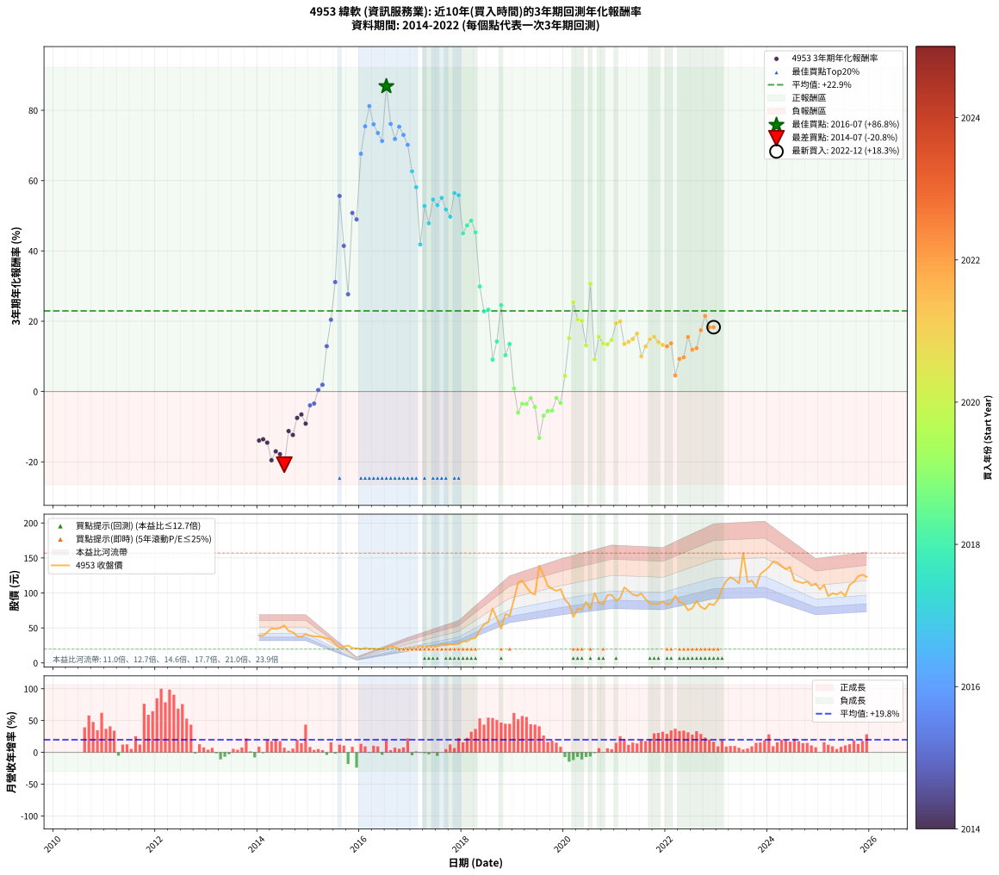

# 4953 緯軟 - 本益比與未來報酬率分析

!!! info "報告資訊"
    - **股票代號**: 4953
    - **公司名稱**: 緯軟
    - **產業別**: 資訊服務業
    - **分析期間**: 2014-2022 (108 個數據點)
    - **資料來源**: Type 12 (ShowMonthlyK_ChartFlow) 月收盤價與本益比
    - **報酬率口徑**: 含現金股利 (簡化: 年度合計，假設每年7/1入帳)
    - **報告生成時間**: 2026-01-12 21:13:04 CST

## 📈 視覺化圖表

### 圖表1: 本益比 vs 未來報酬率關係

*圖表1：4953 緯軟 本益比與3年期未來報酬率關係 (2014-2022)*

### 圖表2: 歷年買入時點的3年期實際報酬率

*圖表2：4953 緯軟 歷年買入時點的3年期實際報酬率 (2014-2022)*

## 📍 買點訊號說明

本報告提供兩種買點提示訊號（顯示於圖表2的股價子圖中）：

### ▲ 小綠色三角形（回測驗證）
- **計算方式**: 使用全部歷史資料計算本益比第25百分位數
- **用途**: 事後驗證，顯示歷史上哪些時點確實為低估區
- **限制**: 當下無法判斷，僅供回測參考
- **特性**: 後見之明（Look-Ahead Bias）

### ▲ 小橘色三角形（即時訊號）
- **計算方式**: 使用截至當月的過去5年資料計算本益比第25百分位數
- **用途**: 實際投資決策，當時即可判斷
- **優勢**: 可操作性強，符合實務需求
- **特性**: 無後見之明，滾動窗口計算

!!! tip "如何使用兩種訊號"
    - **綠色▲** 幫助理解歷史估值機會，驗證策略有效性
    - **橘色▲** 可作為實際買進參考，但仍需搭配基本面分析
    - 兩種訊號重疊時，表示即時判斷與事後驗證一致，信心度較高
    - 僅有綠色▲時，表示當時無法判斷（需要未來資料才能確認）
    - 僅有橘色▲時，表示即時判斷為買點，但事後可能不是最佳時機

## 📊 估值分析摘要

| 指標 | 數值 |
|:---:|:---:|
| **目前本益比** (2022-12) | **9.93 倍** |
| **歷史平均本益比** | 16.08 倍 |
| **估值水準** | 🟢 相對低估 |
| **預期3年年化報酬率** | **+17.25%** |
| **歷史平均報酬率** | +22.94% |
| **相關係數 (R²)** | 0.0586 |
| **趨勢線斜率** | 0.9254 |

!!! abstract "核心洞察"
    目前本益比顯著低於歷史平均，預期未來報酬率可能較高

    根據歷史數據回測，4953 緯軟 在目前本益比 **9.9倍** 的估值水準下，
    預期未來3年年化報酬率約為 **+17.3%**。

    **重要提醒**: 本分析基於歷史數據統計，實際報酬率會受到公司基本面變化、產業趨勢、
    總體經濟環境等多重因素影響。R² = 0.06 表示本益比可解釋約 5.9% 的報酬率變異。

## 📈 歷史估值統計

### 最佳買點 (最高報酬率)

| 項目 | 數值 |
|:---:|:---:|
| 起始時間 | 2016-07 |
| 當時本益比 | 21.08 倍 |
| 起始價格 | 21.9 元 |
| 3年後價格 | 139.0 元 |
| **3年年化報酬率** | **+86.82%** |

### 最差買點 (最低報酬率)

| 項目 | 數值 |
|:---:|:---:|
| 起始時間 | 2014-07 |
| 當時本益比 | 18.55 倍 |
| 起始價格 | 53.6 元 |
| 3年後價格 | 23.0 元 |
| **3年年化報酬率** | **-20.80%** |

## 🎯 投資啟示

### 本益比與報酬率關係

趨勢線方程式: **y = 0.9254x + 8.0651**

!!! info "弱相關或正相關"
    本益比與未來報酬率相關性較弱。這可能表示該股票的報酬率更多受到
    公司成長性、產業趨勢等因素影響，而非估值水準。**需綜合考量多項指標**。

### 估值區間建議

基於歷史數據分析:

- **🟢 低估區** (P/E < 12.9): 預期報酬率較高，可考慮增加持股
- **🟡 合理區** (P/E 12.9-19.3): 預期報酬率符合長期趨勢，正常持有
- **🔴 高估區** (P/E > 19.3): 預期報酬率較低，可考慮減碼或觀望

!!! danger "風險提示"
    - 過去表現不代表未來結果
    - 本分析假設公司基本面無重大結構性變化
    - 產業環境劇變可能使歷史規律失效
    - 應結合公司財報、產業趨勢、總體經濟等多重因素綜合判斷

!!! success "長期投資觀點"
    歷史數據顯示，在合理或低估的估值水準買入並長期持有，
    往往能獲得較佳的投資報酬。**耐心等待好價格**是價值投資的核心原則。

## 📊 數據品質

- **資料來源**: GoodInfo.tw Type 12 (ShowMonthlyK_ChartFlow)
- **資料頻率**: 月度收盤價與本益比
- **回測期間**: 2014-2022
- **數據點數量**: 108 個 (每個點代表一次3年期回測)

### 計算方法說明

1. **3年期年化報酬率**:
   - 對每個歷史時點，計算其後3年的實際投資報酬率
   - 期末價值(不含股利): 期末價格
   - 期末價值(含現金股利): 期末價格 + 持有期間內的現金股利合計 (簡化: 年度合計，假設每年7/1入帳)
   - 公式: 年化報酬率 = [(期末價值/期初價格)^(1/年數) - 1] × 100%

2. **本益比 (P/E Ratio)**:
   - 使用當時的月收盤價與EPS計算
   - 資料來源: Type 12 月度河流圖本益比數據

3. **趨勢線 (Linear Regression)**:
   - 使用最小平方法擬合線性趨勢線
   - R²值衡量本益比對報酬率的解釋能力

---

*本報告由 Stock Analysis System v1.9.0 自動生成*
*數據更新時間: 2026-01-12 21:13:04 CST*

## 📋 月度回測明細表

（每一列對應時間線圖中的一個買入點；可用來對照 SVG 圖上的每個點。）

| 買入月份 | 賣出月份 | 回測期限_年 | 實際持有年數 | 買入本益比_倍 | 買入收盤價_元 | 賣出收盤價_元 | 現金股利合計_元 | 總報酬率_pct | 年化報酬率_pct |
| --- | --- | --- | --- | --- | --- | --- | --- | --- | --- |
| 2014-01 | 2017-01 | 3 | 3.001 | 13.53 | 39.10 | 21.80 | 3.12 | -36.26 | -13.93 |
| 2014-02 | 2017-02 | 3 | 3.001 | 13.53 | 39.10 | 22.10 | 3.12 | -35.49 | -13.59 |
| 2014-03 | 2017-03 | 3 | 3.001 | 15.16 | 43.80 | 24.20 | 3.12 | -37.62 | -14.55 |
| 2014-04 | 2017-04 | 3 | 3.001 | 17.13 | 49.50 | 22.65 | 3.12 | -47.93 | -19.55 |
| 2014-05 | 2017-05 | 3 | 3.001 | 16.76 | 48.45 | 24.55 | 3.12 | -42.88 | -17.03 |
| 2014-06 | 2017-06 | 3 | 3.001 | 17.23 | 49.80 | 24.50 | 3.12 | -44.53 | -17.83 |
| 2014-07 | 2017-07 | 3 | 3.001 | 18.55 | 53.60 | 23.00 | 3.62 | -50.33 | -20.80 |
| 2014-08 | 2017-08 | 3 | 3.001 | 15.78 | 45.60 | 28.25 | 3.62 | -30.10 | -11.25 |
| 2014-09 | 2017-09 | 3 | 3.001 | 15.22 | 44.00 | 26.00 | 3.62 | -32.67 | -12.35 |
| 2014-10 | 2017-10 | 3 | 3.001 | 13.22 | 38.20 | 26.60 | 3.62 | -20.88 | -7.51 |
| 2014-11 | 2017-11 | 3 | 3.001 | 12.87 | 37.20 | 26.75 | 3.62 | -18.35 | -6.53 |
| 2014-12 | 2017-12 | 3 | 3.001 | 14.17 | 40.95 | 27.10 | 3.62 | -24.97 | -9.13 |
| 2015-01 | 2018-01 | 3 | 3.001 | 14.58 | 39.05 | 31.00 | 3.62 | -11.33 | -3.93 |
| 2015-02 | 2018-02 | 3 | 3.001 | 15.42 | 38.05 | 30.65 | 3.62 | -9.92 | -3.42 |
| 2015-03 | 2018-03 | 3 | 3.001 | 16.70 | 37.70 | 34.55 | 3.62 | +1.26 | +0.42 |
| 2015-04 | 2018-04 | 3 | 3.001 | 17.98 | 36.80 | 35.35 | 3.62 | +5.91 | +1.93 |
| 2015-05 | 2018-05 | 3 | 3.001 | 19.20 | 35.25 | 47.10 | 3.62 | +43.90 | +12.89 |
| 2015-06 | 2018-06 | 3 | 3.001 | 20.55 | 33.40 | 54.70 | 3.62 | +74.62 | +20.42 |
| 2015-07 | 2018-07 | 3 | 3.001 | 19.13 | 27.05 | 58.40 | 2.62 | +125.60 | +31.14 |
| 2015-08 | 2018-08 | 3 | 3.001 | 17.70 | 21.30 | 77.70 | 2.62 | +277.11 | +55.64 |
| 2015-09 | 2018-09 | 3 | 3.001 | 23.58 | 23.40 | 63.60 | 2.62 | +183.01 | +41.44 |
| 2015-10 | 2018-10 | 3 | 3.001 | 31.73 | 24.80 | 49.00 | 2.62 | +108.16 | +27.68 |
| 2015-11 | 2018-11 | 3 | 3.001 | 37.14 | 21.20 | 70.10 | 2.62 | +243.04 | +50.80 |
| 2015-12 | 2018-12 | 3 | 3.001 | 58.47 | 21.05 | 67.00 | 2.62 | +230.76 | +48.98 |
| 2016-01 | 2019-01 | 3 | 3.001 | 43.36 | 19.80 | 90.70 | 2.62 | +371.33 | +67.65 |
| 2016-02 | 2019-03 | 3 | 3.080 | 38.58 | 21.35 | 118.00 | 2.62 | +464.98 | +75.45 |
| 2016-03 | 2019-03 | 3 | 2.998 | 31.23 | 20.30 | 118.00 | 2.62 | +494.21 | +81.20 |
| 2016-04 | 2019-04 | 3 | 2.998 | 27.32 | 20.40 | 108.50 | 2.62 | +444.73 | +76.02 |
| 2016-05 | 2019-05 | 3 | 2.998 | 23.42 | 19.75 | 100.50 | 2.62 | +422.15 | +73.55 |
| 2016-06 | 2019-06 | 3 | 2.998 | 21.22 | 19.95 | 97.50 | 2.62 | +401.87 | +71.27 |
| 2016-07 | 2019-07 | 3 | 2.998 | 21.08 | 21.85 | 139.00 | 3.29 | +551.24 | +86.82 |
| 2016-08 | 2019-08 | 3 | 2.998 | 20.82 | 23.60 | 125.50 | 3.29 | +445.74 | +76.13 |
| 2016-09 | 2019-09 | 3 | 2.998 | 18.17 | 22.35 | 110.00 | 3.29 | +406.91 | +71.85 |
| 2016-10 | 2019-10 | 3 | 2.998 | 15.30 | 20.30 | 106.00 | 3.29 | +438.40 | +75.33 |
| 2016-11 | 2019-11 | 3 | 2.998 | 14.44 | 20.55 | 103.00 | 3.29 | +417.25 | +73.01 |
| 2016-12 | 2019-12 | 3 | 2.998 | 14.54 | 22.10 | 105.50 | 3.29 | +392.29 | +70.18 |
| 2017-01 | 2020-01 | 3 | 2.998 | 13.58 | 21.80 | 90.40 | 3.29 | +329.79 | +62.64 |
| 2017-02 | 2020-02 | 3 | 2.998 | 13.08 | 22.10 | 84.00 | 3.29 | +295.00 | +58.13 |
| 2017-03 | 2020-03 | 3 | 3.001 | 13.63 | 24.20 | 65.80 | 3.29 | +185.52 | +41.85 |
| 2017-04 | 2020-04 | 3 | 3.001 | 12.18 | 22.65 | 77.50 | 3.29 | +256.71 | +52.78 |
| 2017-05 | 2020-05 | 3 | 3.001 | 12.62 | 24.55 | 76.10 | 3.29 | +223.40 | +47.87 |
| 2017-06 | 2020-06 | 3 | 3.001 | 12.07 | 24.50 | 87.30 | 3.29 | +269.78 | +54.62 |
| 2017-07 | 2020-07 | 3 | 3.001 | 10.87 | 23.00 | 77.00 | 5.43 | +258.38 | +53.02 |
| 2017-08 | 2020-08 | 3 | 3.001 | 12.84 | 28.25 | 100.00 | 5.43 | +273.19 | +55.10 |
| 2017-09 | 2020-09 | 3 | 3.001 | 11.38 | 26.00 | 85.50 | 5.43 | +249.72 | +51.77 |
| 2017-10 | 2020-10 | 3 | 3.001 | 11.22 | 26.60 | 83.90 | 5.43 | +235.82 | +49.74 |
| 2017-11 | 2020-11 | 3 | 3.001 | 10.90 | 26.75 | 97.00 | 5.43 | +282.90 | +56.43 |
| 2017-12 | 2020-12 | 3 | 3.001 | 10.67 | 27.10 | 97.20 | 5.43 | +278.70 | +55.85 |
| 2018-01 | 2021-01 | 3 | 3.001 | 11.22 | 31.00 | 89.10 | 5.43 | +204.93 | +45.00 |
| 2018-02 | 2021-02 | 3 | 3.001 | 10.26 | 30.65 | 92.50 | 5.43 | +219.50 | +47.27 |
| 2018-03 | 2021-03 | 3 | 3.001 | 10.76 | 34.55 | 108.00 | 5.43 | +228.30 | +48.61 |
| 2018-04 | 2021-04 | 3 | 3.001 | 10.30 | 35.35 | 103.00 | 5.43 | +206.72 | +45.28 |
| 2018-05 | 2021-05 | 3 | 3.001 | 12.88 | 47.10 | 97.80 | 5.43 | +119.17 | +29.89 |
| 2018-06 | 2021-06 | 3 | 3.001 | 14.10 | 54.70 | 95.90 | 5.43 | +85.24 | +22.81 |
| 2018-07 | 2021-07 | 3 | 3.001 | 14.23 | 58.40 | 99.50 | 9.91 | +87.35 | +23.27 |
| 2018-08 | 2021-08 | 3 | 3.001 | 17.96 | 77.70 | 90.90 | 9.91 | +29.74 | +9.07 |
| 2018-09 | 2021-09 | 3 | 3.001 | 13.98 | 63.60 | 84.90 | 9.91 | +49.07 | +14.23 |
| 2018-10 | 2021-10 | 3 | 3.001 | 10.27 | 49.00 | 84.80 | 9.91 | +93.29 | +24.56 |
| 2018-11 | 2021-11 | 3 | 3.001 | 14.03 | 70.10 | 84.30 | 9.91 | +34.40 | +10.35 |
| 2018-12 | 2021-12 | 3 | 3.001 | 12.84 | 67.00 | 88.10 | 9.91 | +46.29 | +13.52 |
| 2019-01 | 2022-01 | 3 | 3.001 | 17.10 | 90.70 | 83.20 | 9.91 | +2.66 | +0.88 |
| 2019-02 | 2022-02 | 3 | 3.001 | 21.34 | 115.00 | 85.70 | 9.91 | -16.86 | -5.97 |
| 2019-03 | 2022-03 | 3 | 3.001 | 21.56 | 118.00 | 96.20 | 9.91 | -10.08 | -3.48 |
| 2019-04 | 2022-04 | 3 | 3.001 | 19.53 | 108.50 | 87.40 | 9.91 | -10.31 | -3.56 |
| 2019-05 | 2022-05 | 3 | 3.001 | 17.82 | 100.50 | 85.00 | 9.91 | -5.56 | -1.89 |
| 2019-06 | 2022-06 | 3 | 3.001 | 17.03 | 97.50 | 75.30 | 9.91 | -12.60 | -4.39 |
| 2019-07 | 2022-07 | 3 | 3.001 | 23.93 | 139.00 | 78.10 | 12.80 | -34.60 | -13.20 |
| 2019-08 | 2022-08 | 3 | 3.001 | 21.30 | 125.50 | 88.50 | 12.80 | -19.28 | -6.89 |
| 2019-09 | 2022-09 | 3 | 3.001 | 18.40 | 110.00 | 79.90 | 12.80 | -15.72 | -5.54 |
| 2019-10 | 2022-10 | 3 | 3.001 | 17.49 | 106.00 | 76.90 | 12.80 | -15.37 | -5.41 |
| 2019-11 | 2022-11 | 3 | 3.001 | 16.76 | 103.00 | 84.60 | 12.80 | -5.43 | -1.84 |
| 2019-12 | 2022-12 | 3 | 3.001 | 16.93 | 105.50 | 82.70 | 12.80 | -9.48 | -3.26 |
| 2020-01 | 2023-01 | 3 | 3.001 | 14.35 | 90.40 | 90.20 | 12.80 | +13.94 | +4.45 |
| 2020-02 | 2023-03 | 3 | 3.080 | 13.19 | 84.00 | 117.00 | 12.80 | +54.53 | +15.18 |
| 2020-03 | 2023-03 | 3 | 2.998 | 10.22 | 65.80 | 117.00 | 12.80 | +97.27 | +25.44 |
| 2020-04 | 2023-04 | 3 | 2.998 | 11.91 | 77.50 | 122.50 | 12.80 | +74.58 | +20.43 |
| 2020-05 | 2023-05 | 3 | 2.998 | 11.57 | 76.10 | 119.00 | 12.80 | +73.20 | +20.11 |
| 2020-06 | 2023-06 | 3 | 2.998 | 13.14 | 87.30 | 113.50 | 12.80 | +44.68 | +13.11 |
| 2020-07 | 2023-07 | 3 | 2.998 | 11.47 | 77.00 | 157.00 | 14.57 | +122.82 | +30.64 |
| 2020-08 | 2023-08 | 3 | 2.998 | 14.74 | 100.00 | 115.50 | 14.57 | +30.07 | +9.17 |
| 2020-09 | 2023-09 | 3 | 2.998 | 12.48 | 85.50 | 117.50 | 14.57 | +54.47 | +15.61 |
| 2020-10 | 2023-10 | 3 | 2.998 | 12.12 | 83.90 | 108.50 | 14.57 | +46.69 | +13.63 |
| 2020-11 | 2023-11 | 3 | 2.998 | 13.88 | 97.00 | 127.00 | 14.57 | +45.95 | +13.44 |
| 2020-12 | 2023-12 | 3 | 2.998 | 13.77 | 97.20 | 132.00 | 14.57 | +50.79 | +14.68 |
| 2021-01 | 2024-01 | 3 | 2.998 | 12.64 | 89.10 | 137.00 | 14.57 | +70.11 | +19.39 |
| 2021-02 | 2024-02 | 3 | 2.998 | 13.15 | 92.50 | 145.00 | 14.57 | +72.51 | +19.95 |
| 2021-03 | 2024-03 | 3 | 3.001 | 15.38 | 108.00 | 143.50 | 14.57 | +46.36 | +13.54 |
| 2021-04 | 2024-04 | 3 | 3.001 | 14.69 | 103.00 | 138.50 | 14.57 | +48.61 | +14.11 |
| 2021-05 | 2024-05 | 3 | 3.001 | 13.98 | 97.80 | 134.00 | 14.57 | +51.91 | +14.95 |
| 2021-06 | 2024-06 | 3 | 3.001 | 13.73 | 95.90 | 137.00 | 14.57 | +58.05 | +16.48 |
| 2021-07 | 2024-07 | 3 | 3.001 | 14.27 | 99.50 | 118.00 | 14.54 | +33.21 | +10.03 |
| 2021-08 | 2024-08 | 3 | 3.001 | 13.06 | 90.90 | 116.00 | 14.54 | +43.61 | +12.82 |
| 2021-09 | 2024-09 | 3 | 3.001 | 12.22 | 84.90 | 114.00 | 14.54 | +51.41 | +14.82 |
| 2021-10 | 2024-10 | 3 | 3.001 | 12.23 | 84.80 | 116.50 | 14.54 | +54.53 | +15.61 |
| 2021-11 | 2024-11 | 3 | 3.001 | 12.18 | 84.30 | 110.50 | 14.54 | +48.33 | +14.04 |
| 2021-12 | 2024-12 | 3 | 3.001 | 12.75 | 88.10 | 113.50 | 14.54 | +45.34 | +13.27 |
| 2022-01 | 2025-01 | 3 | 3.001 | 11.84 | 83.20 | 105.00 | 14.54 | +43.68 | +12.84 |
| 2022-02 | 2025-02 | 3 | 3.001 | 11.99 | 85.70 | 111.50 | 14.54 | +47.08 | +13.72 |
| 2022-03 | 2025-03 | 3 | 3.001 | 13.24 | 96.20 | 95.50 | 14.54 | +14.39 | +4.58 |
| 2022-04 | 2025-04 | 3 | 3.001 | 11.84 | 87.40 | 99.50 | 14.54 | +30.49 | +9.27 |
| 2022-05 | 2025-05 | 3 | 3.001 | 11.33 | 85.00 | 97.80 | 14.54 | +32.17 | +9.74 |
| 2022-06 | 2025-06 | 3 | 3.001 | 9.88 | 75.30 | 101.50 | 14.54 | +54.11 | +15.50 |
| 2022-07 | 2025-07 | 3 | 3.001 | 10.09 | 78.10 | 95.50 | 13.95 | +40.14 | +11.90 |
| 2022-08 | 2025-08 | 3 | 3.001 | 11.26 | 88.50 | 111.50 | 13.95 | +41.75 | +12.33 |
| 2022-09 | 2025-09 | 3 | 3.001 | 10.02 | 79.90 | 115.50 | 13.95 | +62.01 | +17.44 |
| 2022-10 | 2025-10 | 3 | 3.001 | 9.50 | 76.90 | 124.00 | 13.95 | +79.38 | +21.50 |
| 2022-11 | 2025-11 | 3 | 3.001 | 10.30 | 84.60 | 126.00 | 13.95 | +65.42 | +18.26 |
| 2022-12 | 2025-12 | 3 | 3.001 | 9.93 | 82.70 | 123.00 | 13.95 | +65.59 | +18.30 |
