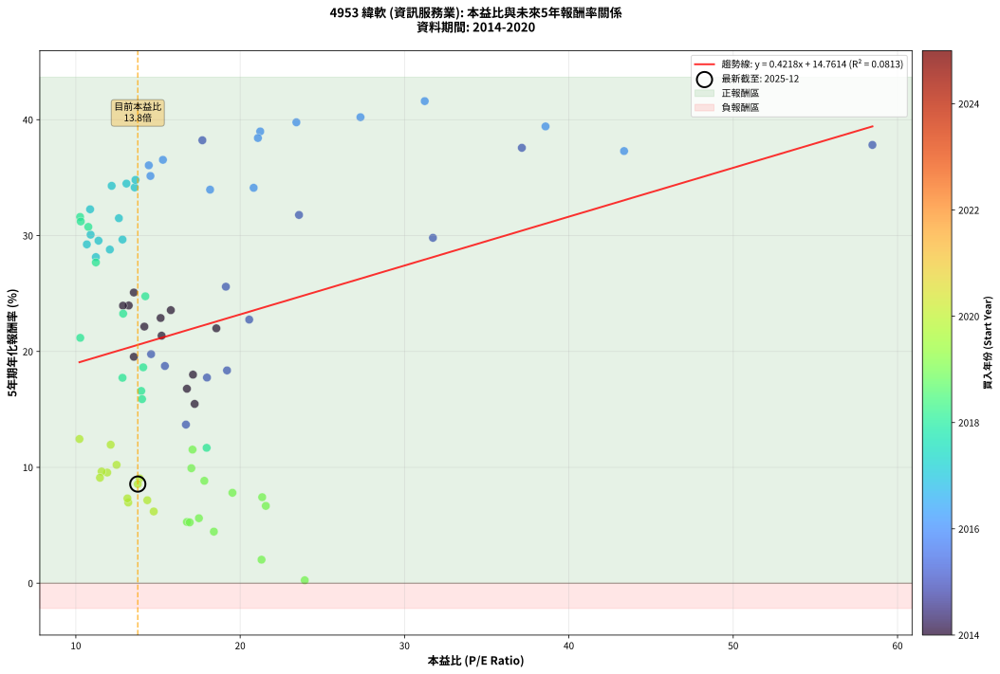
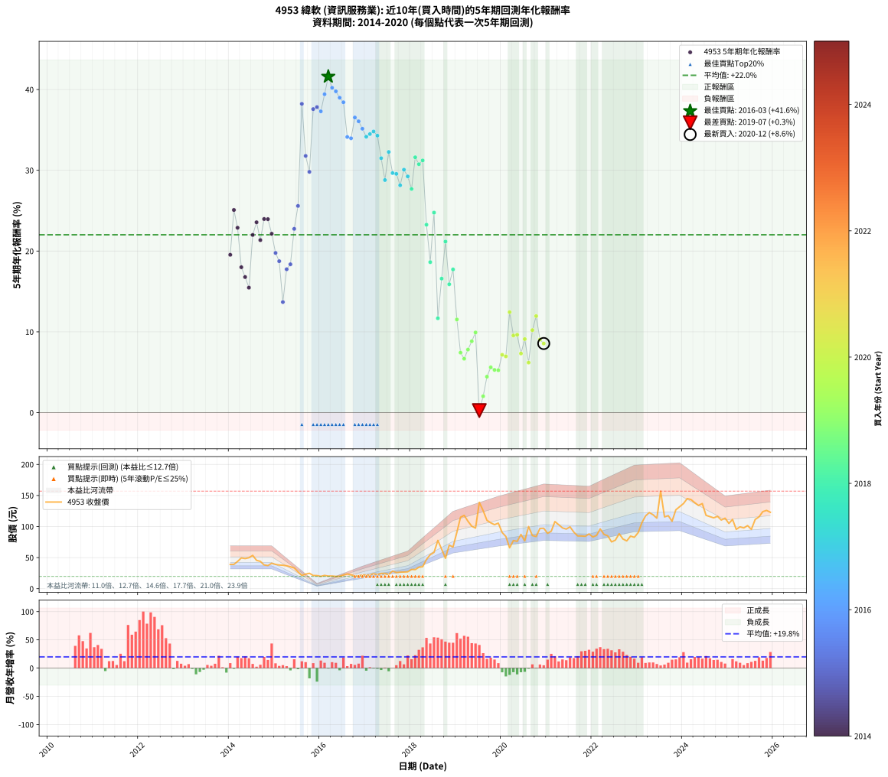

# 4953 緯軟 - 本益比與未來報酬率分析

!!! info "報告資訊"
    - **股票代號**: 4953
    - **公司名稱**: 緯軟
    - **產業別**: 資訊服務業
    - **分析期間**: 2014-2020 (84 個數據點)
    - **資料來源**: Type 12 (ShowMonthlyK_ChartFlow) 月收盤價與本益比
    - **報酬率口徑**: 含現金股利 (簡化: 年度合計，假設每年7/1入帳)
    - **報告生成時間**: 2026-01-10 18:59:39 CST

## 📈 視覺化圖表

### 圖表1: 本益比 vs 未來報酬率關係

*圖表1：4953 緯軟 本益比與5年期未來報酬率關係 (2014-2020)*

### 圖表2: 歷年買入時點的5年期實際報酬率

*圖表2：4953 緯軟 歷年買入時點的5年期實際報酬率 (2014-2020)*

## 📍 買點訊號說明

本報告提供兩種買點提示訊號（顯示於圖表2的股價子圖中）：

### ▲ 小綠色三角形（回測驗證）
- **計算方式**: 使用全部歷史資料計算本益比第25百分位數
- **用途**: 事後驗證，顯示歷史上哪些時點確實為低估區
- **限制**: 當下無法判斷，僅供回測參考
- **特性**: 後見之明（Look-Ahead Bias）

### ▲ 小橘色三角形（即時訊號）
- **計算方式**: 使用截至當月的過去5年資料計算本益比第25百分位數
- **用途**: 實際投資決策，當時即可判斷
- **優勢**: 可操作性強，符合實務需求
- **特性**: 無後見之明，滾動窗口計算

!!! tip "如何使用兩種訊號"
    - **綠色▲** 幫助理解歷史估值機會，驗證策略有效性
    - **橘色▲** 可作為實際買進參考，但仍需搭配基本面分析
    - 兩種訊號重疊時，表示即時判斷與事後驗證一致，信心度較高
    - 僅有綠色▲時，表示當時無法判斷（需要未來資料才能確認）
    - 僅有橘色▲時，表示即時判斷為買點，但事後可能不是最佳時機

## 📊 估值分析摘要

| 指標 | 數值 |
|:---:|:---:|
| **目前本益比** (2020-12) | **13.77 倍** |
| **歷史平均本益比** | 17.20 倍 |
| **估值水準** | 🟡 合理範圍 |
| **預期5年年化報酬率** | **+20.57%** |
| **歷史平均報酬率** | +22.02% |
| **相關係數 (R²)** | 0.0813 |
| **趨勢線斜率** | 0.4218 |

!!! abstract "核心洞察"
    目前本益比接近歷史平均，預期報酬率符合長期趨勢

    根據歷史數據回測，4953 緯軟 在目前本益比 **13.8倍** 的估值水準下，
    預期未來5年年化報酬率約為 **+20.6%**。

    **重要提醒**: 本分析基於歷史數據統計，實際報酬率會受到公司基本面變化、產業趨勢、
    總體經濟環境等多重因素影響。R² = 0.08 表示本益比可解釋約 8.1% 的報酬率變異。

## 📈 歷史估值統計

### 最佳買點 (最高報酬率)

| 項目 | 數值 |
|:---:|:---:|
| 起始時間 | 2016-03 |
| 當時本益比 | 31.23 倍 |
| 起始價格 | 20.3 元 |
| 5年後價格 | 108.0 元 |
| **5年年化報酬率** | **+41.60%** |

### 最差買點 (最低報酬率)

| 項目 | 數值 |
|:---:|:---:|
| 起始時間 | 2019-07 |
| 當時本益比 | 23.93 倍 |
| 起始價格 | 139.0 元 |
| 5年後價格 | 118.0 元 |
| **5年年化報酬率** | **+0.25%** |

## 🎯 投資啟示

### 本益比與報酬率關係

趨勢線方程式: **y = 0.4218x + 14.7614**

!!! info "弱相關或正相關"
    本益比與未來報酬率相關性較弱。這可能表示該股票的報酬率更多受到
    公司成長性、產業趨勢等因素影響，而非估值水準。**需綜合考量多項指標**。

### 估值區間建議

基於歷史數據分析:

- **🟢 低估區** (P/E < 13.8): 預期報酬率較高，可考慮增加持股
- **🟡 合理區** (P/E 13.8-20.6): 預期報酬率符合長期趨勢，正常持有
- **🔴 高估區** (P/E > 20.6): 預期報酬率較低，可考慮減碼或觀望

!!! danger "風險提示"
    - 過去表現不代表未來結果
    - 本分析假設公司基本面無重大結構性變化
    - 產業環境劇變可能使歷史規律失效
    - 應結合公司財報、產業趨勢、總體經濟等多重因素綜合判斷

!!! success "長期投資觀點"
    歷史數據顯示，在合理或低估的估值水準買入並長期持有，
    往往能獲得較佳的投資報酬。**耐心等待好價格**是價值投資的核心原則。

## 📊 數據品質

- **資料來源**: GoodInfo.tw Type 12 (ShowMonthlyK_ChartFlow)
- **資料頻率**: 月度收盤價與本益比
- **回測期間**: 2014-2020
- **數據點數量**: 84 個 (每個點代表一次5年期回測)

### 計算方法說明

1. **5年期年化報酬率**:
   - 對每個歷史時點，計算其後5年的實際投資報酬率
   - 期末價值(不含股利): 期末價格
   - 期末價值(含現金股利): 期末價格 + 持有期間內的現金股利合計 (簡化: 年度合計，假設每年7/1入帳)
   - 公式: 年化報酬率 = [(期末價值/期初價格)^(1/年數) - 1] × 100%

2. **本益比 (P/E Ratio)**:
   - 使用當時的月收盤價與EPS計算
   - 資料來源: Type 12 月度河流圖本益比數據

3. **趨勢線 (Linear Regression)**:
   - 使用最小平方法擬合線性趨勢線
   - R²值衡量本益比對報酬率的解釋能力

---

*本報告由 Stock Analysis System v1.9.0 自動生成*
*數據更新時間: 2026-01-10 18:59:39 CST*

## 📋 月度回測明細表

（每一列對應時間線圖中的一個買入點；可用來對照 SVG 圖上的每個點。）

| 買入月份 | 賣出月份 | 回測期限_年 | 實際持有年數 | 買入本益比_倍 | 買入收盤價_元 | 賣出收盤價_元 | 現金股利合計_元 | 總報酬率_pct | 年化報酬率_pct |
| --- | --- | --- | --- | --- | --- | --- | --- | --- | --- |
| 2014-01 | 2019-01 | 5 | 4.999 | 13.53 | 39.10 | 90.70 | 4.72 | +144.05 | +19.54 |
| 2014-02 | 2019-02 | 5 | 4.999 | 13.53 | 39.10 | 115.00 | 4.72 | +206.20 | +25.09 |
| 2014-03 | 2019-03 | 5 | 4.999 | 15.16 | 43.80 | 118.00 | 4.72 | +180.19 | +22.89 |
| 2014-04 | 2019-04 | 5 | 4.999 | 17.13 | 49.50 | 108.50 | 4.72 | +128.74 | +18.00 |
| 2014-05 | 2019-05 | 5 | 4.999 | 16.76 | 48.45 | 100.50 | 4.72 | +117.18 | +16.78 |
| 2014-06 | 2019-06 | 5 | 4.999 | 17.23 | 49.80 | 97.50 | 4.72 | +105.27 | +15.47 |
| 2014-07 | 2019-07 | 5 | 4.999 | 18.55 | 53.60 | 139.00 | 5.82 | +170.18 | +22.00 |
| 2014-08 | 2019-08 | 5 | 4.999 | 15.78 | 45.60 | 125.50 | 5.82 | +187.98 | +23.56 |
| 2014-09 | 2019-09 | 5 | 4.999 | 15.22 | 44.00 | 110.00 | 5.82 | +163.22 | +21.36 |
| 2014-10 | 2019-10 | 5 | 4.999 | 13.22 | 38.20 | 106.00 | 5.82 | +192.72 | +23.97 |
| 2014-11 | 2019-11 | 5 | 4.999 | 12.87 | 37.20 | 103.00 | 5.82 | +192.52 | +23.95 |
| 2014-12 | 2019-12 | 5 | 4.999 | 14.17 | 40.95 | 105.50 | 5.82 | +171.84 | +22.14 |
| 2015-01 | 2020-01 | 5 | 4.999 | 14.58 | 39.05 | 90.40 | 5.82 | +146.40 | +19.77 |
| 2015-02 | 2020-02 | 5 | 4.999 | 15.42 | 38.05 | 84.00 | 5.82 | +136.06 | +18.74 |
| 2015-03 | 2020-03 | 5 | 5.002 | 16.70 | 37.70 | 65.80 | 5.82 | +89.97 | +13.69 |
| 2015-04 | 2020-04 | 5 | 5.002 | 17.98 | 36.80 | 77.50 | 5.82 | +126.41 | +17.75 |
| 2015-05 | 2020-05 | 5 | 5.002 | 19.20 | 35.25 | 76.10 | 5.82 | +132.39 | +18.36 |
| 2015-06 | 2020-06 | 5 | 5.002 | 20.55 | 33.40 | 87.30 | 5.82 | +178.80 | +22.75 |
| 2015-07 | 2020-07 | 5 | 5.002 | 19.13 | 27.05 | 77.00 | 7.55 | +212.57 | +25.59 |
| 2015-08 | 2020-08 | 5 | 5.002 | 17.70 | 21.30 | 100.00 | 7.55 | +404.93 | +38.23 |
| 2015-09 | 2020-09 | 5 | 5.002 | 23.58 | 23.40 | 85.50 | 7.55 | +297.65 | +31.78 |
| 2015-10 | 2020-10 | 5 | 5.002 | 31.73 | 24.80 | 83.90 | 7.55 | +268.75 | +29.81 |
| 2015-11 | 2020-11 | 5 | 5.002 | 37.14 | 21.20 | 97.00 | 7.55 | +393.17 | +37.58 |
| 2015-12 | 2020-12 | 5 | 5.002 | 58.47 | 21.05 | 97.20 | 7.55 | +397.63 | +37.82 |
| 2016-01 | 2021-01 | 5 | 5.002 | 43.36 | 19.80 | 89.10 | 7.55 | +388.14 | +37.29 |
| 2016-02 | 2021-03 | 5 | 5.081 | 38.58 | 21.35 | 108.00 | 7.55 | +441.22 | +39.42 |
| 2016-03 | 2021-03 | 5 | 4.999 | 31.23 | 20.30 | 108.00 | 7.55 | +469.22 | +41.60 |
| 2016-04 | 2021-04 | 5 | 4.999 | 27.32 | 20.40 | 103.00 | 7.55 | +441.92 | +40.22 |
| 2016-05 | 2021-05 | 5 | 4.999 | 23.42 | 19.75 | 97.80 | 7.55 | +433.42 | +39.78 |
| 2016-06 | 2021-06 | 5 | 4.999 | 21.22 | 19.95 | 95.90 | 7.55 | +418.55 | +38.99 |
| 2016-07 | 2021-07 | 5 | 4.999 | 21.08 | 21.85 | 99.50 | 11.51 | +408.06 | +38.42 |
| 2016-08 | 2021-08 | 5 | 4.999 | 20.82 | 23.60 | 90.90 | 11.51 | +333.94 | +34.12 |
| 2016-09 | 2021-09 | 5 | 4.999 | 18.17 | 22.35 | 84.90 | 11.51 | +331.37 | +33.96 |
| 2016-10 | 2021-10 | 5 | 4.999 | 15.30 | 20.30 | 84.80 | 11.51 | +374.44 | +36.54 |
| 2016-11 | 2021-11 | 5 | 4.999 | 14.44 | 20.55 | 84.30 | 11.51 | +366.23 | +36.06 |
| 2016-12 | 2021-12 | 5 | 4.999 | 14.54 | 22.10 | 88.10 | 11.51 | +350.73 | +35.15 |
| 2017-01 | 2022-01 | 5 | 4.999 | 13.58 | 21.80 | 83.20 | 11.51 | +334.45 | +34.15 |
| 2017-02 | 2022-02 | 5 | 4.999 | 13.08 | 22.10 | 85.70 | 11.51 | +339.87 | +34.49 |
| 2017-03 | 2022-03 | 5 | 4.999 | 13.63 | 24.20 | 96.20 | 11.51 | +345.09 | +34.81 |
| 2017-04 | 2022-04 | 5 | 4.999 | 12.18 | 22.65 | 87.40 | 11.51 | +336.69 | +34.29 |
| 2017-05 | 2022-05 | 5 | 4.999 | 12.62 | 24.55 | 85.00 | 11.51 | +293.12 | +31.50 |
| 2017-06 | 2022-06 | 5 | 4.999 | 12.07 | 24.50 | 75.30 | 11.51 | +254.33 | +28.79 |
| 2017-07 | 2022-07 | 5 | 4.999 | 10.87 | 23.00 | 78.10 | 15.00 | +304.77 | +32.27 |
| 2017-08 | 2022-08 | 5 | 4.999 | 12.84 | 28.25 | 88.50 | 15.00 | +266.36 | +29.66 |
| 2017-09 | 2022-09 | 5 | 4.999 | 11.38 | 26.00 | 79.90 | 15.00 | +264.99 | +29.56 |
| 2017-10 | 2022-10 | 5 | 4.999 | 11.22 | 26.60 | 76.90 | 15.00 | +245.48 | +28.14 |
| 2017-11 | 2022-11 | 5 | 4.999 | 10.90 | 26.75 | 84.60 | 15.00 | +272.33 | +30.08 |
| 2017-12 | 2022-12 | 5 | 4.999 | 10.67 | 27.10 | 82.70 | 15.00 | +260.51 | +29.24 |
| 2018-01 | 2023-01 | 5 | 4.999 | 11.22 | 31.00 | 90.20 | 15.00 | +239.35 | +27.69 |
| 2018-02 | 2023-02 | 5 | 4.999 | 10.26 | 30.65 | 106.00 | 15.00 | +294.77 | +31.61 |
| 2018-03 | 2023-03 | 5 | 4.999 | 10.76 | 34.55 | 117.00 | 15.00 | +282.05 | +30.75 |
| 2018-04 | 2023-04 | 5 | 4.999 | 10.30 | 35.35 | 122.50 | 15.00 | +288.96 | +31.22 |
| 2018-05 | 2023-05 | 5 | 4.999 | 12.88 | 47.10 | 119.00 | 15.00 | +184.50 | +23.26 |
| 2018-06 | 2023-06 | 5 | 4.999 | 14.10 | 54.70 | 113.50 | 15.00 | +134.91 | +18.63 |
| 2018-07 | 2023-07 | 5 | 4.999 | 14.23 | 58.40 | 157.00 | 19.50 | +202.22 | +24.76 |
| 2018-08 | 2023-08 | 5 | 4.999 | 17.96 | 77.70 | 115.50 | 19.50 | +73.74 | +11.68 |
| 2018-09 | 2023-09 | 5 | 4.999 | 13.98 | 63.60 | 117.50 | 19.50 | +115.41 | +16.59 |
| 2018-10 | 2023-10 | 5 | 4.999 | 10.27 | 49.00 | 108.50 | 19.50 | +161.22 | +21.17 |
| 2018-11 | 2023-11 | 5 | 4.999 | 14.03 | 70.10 | 127.00 | 19.50 | +108.98 | +15.89 |
| 2018-12 | 2023-12 | 5 | 4.999 | 12.84 | 67.00 | 132.00 | 19.50 | +126.12 | +17.73 |
| 2019-01 | 2024-01 | 5 | 4.999 | 17.10 | 90.70 | 137.00 | 19.50 | +72.54 | +11.53 |
| 2019-02 | 2024-02 | 5 | 4.999 | 21.34 | 115.00 | 145.00 | 19.50 | +43.04 | +7.42 |
| 2019-03 | 2024-03 | 5 | 5.002 | 21.56 | 118.00 | 143.50 | 19.50 | +38.13 | +6.67 |
| 2019-04 | 2024-04 | 5 | 5.002 | 19.53 | 108.50 | 138.50 | 19.50 | +45.62 | +7.80 |
| 2019-05 | 2024-05 | 5 | 5.002 | 17.82 | 100.50 | 134.00 | 19.50 | +52.73 | +8.84 |
| 2019-06 | 2024-06 | 5 | 5.002 | 17.03 | 97.50 | 137.00 | 19.50 | +60.51 | +9.92 |
| 2019-07 | 2024-07 | 5 | 5.002 | 23.93 | 139.00 | 118.00 | 22.76 | +1.27 | +0.25 |
| 2019-08 | 2024-08 | 5 | 5.002 | 21.30 | 125.50 | 116.00 | 22.76 | +10.57 | +2.03 |
| 2019-09 | 2024-09 | 5 | 5.002 | 18.40 | 110.00 | 114.00 | 22.76 | +24.33 | +4.45 |
| 2019-10 | 2024-10 | 5 | 5.002 | 17.49 | 106.00 | 116.50 | 22.76 | +31.38 | +5.61 |
| 2019-11 | 2024-11 | 5 | 5.002 | 16.76 | 103.00 | 110.50 | 22.76 | +29.38 | +5.28 |
| 2019-12 | 2024-12 | 5 | 5.002 | 16.93 | 105.50 | 113.50 | 22.76 | +29.16 | +5.25 |
| 2020-01 | 2025-01 | 5 | 5.002 | 14.35 | 90.40 | 105.00 | 22.76 | +41.33 | +7.16 |
| 2020-02 | 2025-03 | 5 | 5.081 | 13.19 | 84.00 | 95.50 | 22.76 | +40.79 | +6.96 |
| 2020-03 | 2025-03 | 5 | 4.999 | 10.22 | 65.80 | 95.50 | 22.76 | +79.73 | +12.44 |
| 2020-04 | 2025-04 | 5 | 4.999 | 11.91 | 77.50 | 99.50 | 22.76 | +57.75 | +9.55 |
| 2020-05 | 2025-05 | 5 | 4.999 | 11.57 | 76.10 | 97.80 | 22.76 | +58.42 | +9.64 |
| 2020-06 | 2025-06 | 5 | 4.999 | 13.14 | 87.30 | 101.50 | 22.76 | +42.34 | +7.32 |
| 2020-07 | 2025-07 | 5 | 4.999 | 11.47 | 77.00 | 95.50 | 23.52 | +54.57 | +9.10 |
| 2020-08 | 2025-08 | 5 | 4.999 | 14.74 | 100.00 | 111.50 | 23.52 | +35.02 | +6.19 |
| 2020-09 | 2025-09 | 5 | 4.999 | 12.48 | 85.50 | 115.50 | 23.52 | +62.59 | +10.21 |
| 2020-10 | 2025-10 | 5 | 4.999 | 12.12 | 83.90 | 124.00 | 23.52 | +75.83 | +11.95 |
| 2020-11 | 2025-11 | 5 | 4.999 | 13.88 | 97.00 | 126.00 | 23.52 | +54.14 | +9.04 |
| 2020-12 | 2025-12 | 5 | 4.999 | 13.77 | 97.20 | 123.00 | 23.52 | +50.74 | +8.55 |
