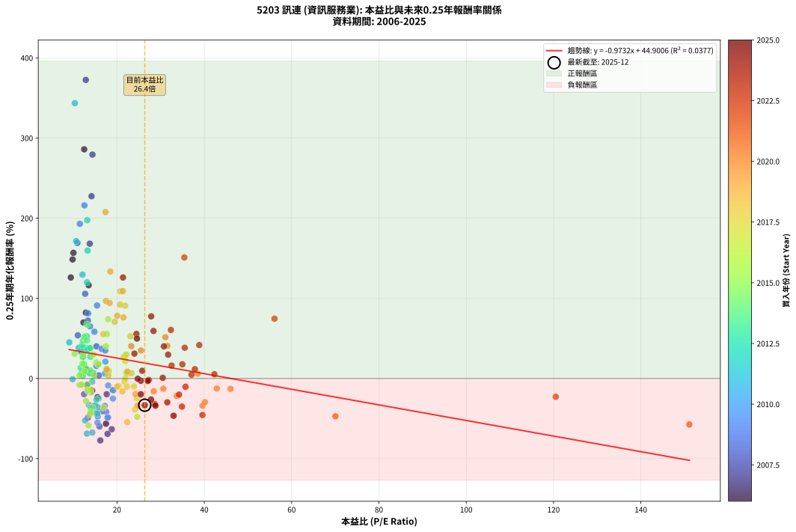
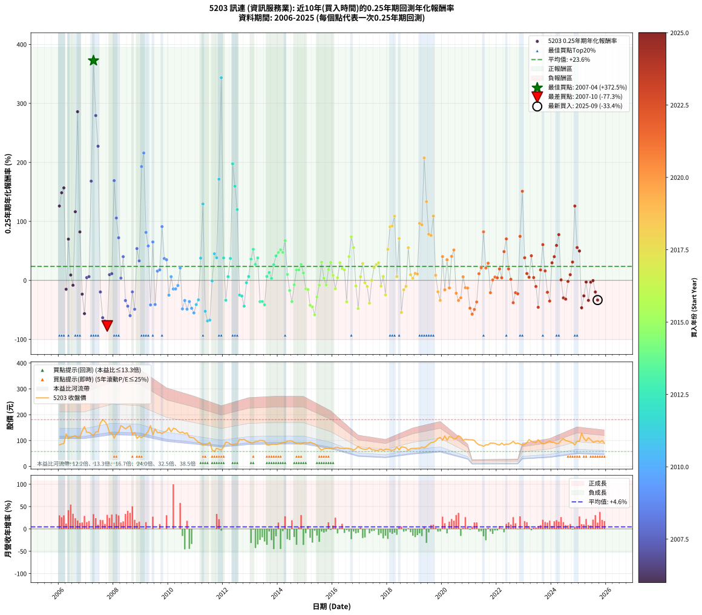

# 5203 訊連 - 本益比與未來報酬率分析

!!! info "報告資訊"
    - **股票代號**: 5203
    - **公司名稱**: 訊連
    - **產業別**: 資訊服務業
    - **分析期間**: 2006-2025 (237 個數據點)
    - **資料來源**: Type 12 (ShowMonthlyK_ChartFlow) 月收盤價與本益比
    - **報酬率口徑**: 含現金股利 (簡化: 年度合計，假設每年7/1入帳)
    - **報告生成時間**: 2026-01-11 18:58:31 CST

## 📈 視覺化圖表

### 圖表1: 本益比 vs 未來報酬率關係

*圖表1：5203 訊連 本益比與0.25年期未來報酬率關係 (2006-2025)*

### 圖表2: 歷年買入時點的0.25年期實際報酬率

*圖表2：5203 訊連 歷年買入時點的0.25年期實際報酬率 (2006-2025)*

## 📍 買點訊號說明

本報告提供兩種買點提示訊號（顯示於圖表2的股價子圖中）：

### ▲ 小綠色三角形（回測驗證）
- **計算方式**: 使用全部歷史資料計算本益比第25百分位數
- **用途**: 事後驗證，顯示歷史上哪些時點確實為低估區
- **限制**: 當下無法判斷，僅供回測參考
- **特性**: 後見之明（Look-Ahead Bias）

### ▲ 小橘色三角形（即時訊號）
- **計算方式**: 使用截至當月的過去5年資料計算本益比第25百分位數
- **用途**: 實際投資決策，當時即可判斷
- **優勢**: 可操作性強，符合實務需求
- **特性**: 無後見之明，滾動窗口計算

!!! tip "如何使用兩種訊號"
    - **綠色▲** 幫助理解歷史估值機會，驗證策略有效性
    - **橘色▲** 可作為實際買進參考，但仍需搭配基本面分析
    - 兩種訊號重疊時，表示即時判斷與事後驗證一致，信心度較高
    - 僅有綠色▲時，表示當時無法判斷（需要未來資料才能確認）
    - 僅有橘色▲時，表示即時判斷為買點，但事後可能不是最佳時機

## 📊 估值分析摘要

| 指標 | 數值 |
|:---:|:---:|
| **目前本益比** (2025-09) | **26.36 倍** |
| **歷史平均本益比** | 20.55 倍 |
| **估值水準** | 🔴 相對高估 |
| **預期0.25年年化報酬率** | **+19.25%** |
| **歷史平均報酬率** | +23.64% |
| **相關係數 (R²)** | 0.0377 |
| **趨勢線斜率** | -0.9732 |

!!! abstract "核心洞察"
    目前本益比顯著高於歷史平均，預期未來報酬率可能較低

    根據歷史數據回測，5203 訊連 在目前本益比 **26.4倍** 的估值水準下，
    預期未來0.25年年化報酬率約為 **+19.2%**。

    **重要提醒**: 本分析基於歷史數據統計，實際報酬率會受到公司基本面變化、產業趨勢、
    總體經濟環境等多重因素影響。R² = 0.04 表示本益比可解釋約 3.8% 的報酬率變異。

## 📈 歷史估值統計

### 最佳買點 (最高報酬率)

| 項目 | 數值 |
|:---:|:---:|
| 起始時間 | 2007-04 |
| 當時本益比 | 12.86 倍 |
| 起始價格 | 118.5 元 |
| 0.25年後價格 | 168.0 元 |
| **0.25年年化報酬率** | **+372.54%** |

### 最差買點 (最低報酬率)

| 項目 | 數值 |
|:---:|:---:|
| 起始時間 | 2007-10 |
| 當時本益比 | 16.18 倍 |
| 起始價格 | 159.0 元 |
| 0.25年後價格 | 109.5 元 |
| **0.25年年化報酬率** | **-77.25%** |

## 🎯 投資啟示

### 本益比與報酬率關係

趨勢線方程式: **y = -0.9732x + 44.9006**

!!! warning "強負相關"
    本益比與未來報酬率呈現強負相關。在高本益比時期買入，未來報酬率顯著較低；
    在低本益比時期買入，未來報酬率顯著較高。**估值紀律至關重要**。

### 估值區間建議

基於歷史數據分析:

- **🟢 低估區** (P/E < 16.4): 預期報酬率較高，可考慮增加持股
- **🟡 合理區** (P/E 16.4-24.7): 預期報酬率符合長期趨勢，正常持有
- **🔴 高估區** (P/E > 24.7): 預期報酬率較低，可考慮減碼或觀望

!!! danger "風險提示"
    - 過去表現不代表未來結果
    - 本分析假設公司基本面無重大結構性變化
    - 產業環境劇變可能使歷史規律失效
    - 應結合公司財報、產業趨勢、總體經濟等多重因素綜合判斷

!!! success "長期投資觀點"
    歷史數據顯示，在合理或低估的估值水準買入並長期持有，
    往往能獲得較佳的投資報酬。**耐心等待好價格**是價值投資的核心原則。

## 📊 數據品質

- **資料來源**: GoodInfo.tw Type 12 (ShowMonthlyK_ChartFlow)
- **資料頻率**: 月度收盤價與本益比
- **回測期間**: 2006-2025
- **數據點數量**: 237 個 (每個點代表一次0.25年期回測)

### 計算方法說明

1. **0.25年期年化報酬率**:
   - 對每個歷史時點，計算其後0.25年的實際投資報酬率
   - 期末價值(不含股利): 期末價格
   - 期末價值(含現金股利): 期末價格 + 持有期間內的現金股利合計 (簡化: 年度合計，假設每年7/1入帳)
   - 公式: 年化報酬率 = [(期末價值/期初價格)^(1/年數) - 1] × 100%

2. **本益比 (P/E Ratio)**:
   - 使用當時的月收盤價與EPS計算
   - 資料來源: Type 12 月度河流圖本益比數據

3. **趨勢線 (Linear Regression)**:
   - 使用最小平方法擬合線性趨勢線
   - R²值衡量本益比對報酬率的解釋能力

---

*本報告由 Stock Analysis System v1.9.0 自動生成*
*數據更新時間: 2026-01-11 18:58:31 CST*

## 📋 月度回測明細表

（每一列對應時間線圖中的一個買入點；可用來對照 SVG 圖上的每個點。）

| 買入月份 | 賣出月份 | 回測期限_年 | 實際持有年數 | 買入本益比_倍 | 買入收盤價_元 | 賣出收盤價_元 | 現金股利合計_元 | 總報酬率_pct | 年化報酬率_pct |
| --- | --- | --- | --- | --- | --- | --- | --- | --- | --- |
| 2006-01 | 2006-05 | 0.25 | 0.329 | 9.42 | 83.00 | 108.50 | 0.00 | +30.72 | +126.02 |
| 2006-02 | 2006-05 | 0.25 | 0.246 | 9.84 | 86.70 | 108.50 | 0.00 | +25.14 | +148.50 |
| 2006-03 | 2006-07 | 0.25 | 0.334 | 10.02 | 88.30 | 116.00 | 4.99 | +37.02 | +156.77 |
| 2006-04 | 2006-07 | 0.25 | 0.249 | 14.30 | 126.00 | 116.00 | 4.99 | -3.97 | -15.02 |
| 2006-05 | 2006-08 | 0.25 | 0.252 | 12.32 | 108.50 | 119.00 | 4.99 | +14.28 | +69.87 |
| 2006-06 | 2006-09 | 0.25 | 0.252 | 12.77 | 112.50 | 110.00 | 4.99 | +2.22 | +9.09 |
| 2006-07 | 2006-10 | 0.25 | 0.252 | 13.17 | 116.00 | 113.50 | 0.00 | -2.16 | -8.29 |
| 2006-08 | 2006-12 | 0.25 | 0.334 | 13.51 | 119.00 | 154.00 | 0.00 | +29.41 | +116.39 |
| 2006-09 | 2006-12 | 0.25 | 0.249 | 12.49 | 110.00 | 154.00 | 0.00 | +40.00 | +285.94 |
| 2006-10 | 2007-01 | 0.25 | 0.252 | 12.88 | 113.50 | 132.00 | 0.00 | +16.30 | +82.12 |
| 2006-11 | 2007-03 | 0.25 | 0.329 | 15.55 | 137.00 | 125.50 | 0.00 | -8.39 | -23.42 |
| 2006-12 | 2007-03 | 0.25 | 0.246 | 17.48 | 154.00 | 125.50 | 0.00 | -18.51 | -56.42 |
| 2007-01 | 2007-05 | 0.25 | 0.329 | 14.81 | 132.00 | 134.00 | 0.00 | +1.52 | +4.68 |
| 2007-02 | 2007-05 | 0.25 | 0.246 | 14.64 | 132.00 | 134.00 | 0.00 | +1.52 | +6.29 |
| 2007-03 | 2007-07 | 0.25 | 0.334 | 13.77 | 125.50 | 168.00 | 6.48 | +39.03 | +168.19 |
| 2007-04 | 2007-07 | 0.25 | 0.249 | 12.86 | 118.50 | 168.00 | 6.48 | +47.24 | +372.54 |
| 2007-05 | 2007-08 | 0.25 | 0.252 | 14.38 | 134.00 | 181.00 | 6.48 | +39.91 | +279.37 |
| 2007-06 | 2007-09 | 0.25 | 0.252 | 14.17 | 133.50 | 173.50 | 6.48 | +34.82 | +227.43 |
| 2007-07 | 2007-10 | 0.25 | 0.252 | 17.64 | 168.00 | 159.00 | 0.00 | -5.36 | -19.64 |
| 2007-08 | 2007-12 | 0.25 | 0.334 | 18.81 | 181.00 | 129.50 | 0.00 | -28.45 | -63.30 |
| 2007-09 | 2007-12 | 0.25 | 0.249 | 17.84 | 173.50 | 129.50 | 0.00 | -25.36 | -69.09 |
| 2007-10 | 2008-01 | 0.25 | 0.252 | 16.18 | 159.00 | 109.50 | 0.00 | -31.13 | -77.25 |
| 2007-11 | 2008-03 | 0.25 | 0.331 | 12.99 | 129.00 | 133.00 | 0.00 | +3.10 | +9.66 |
| 2007-12 | 2008-03 | 0.25 | 0.249 | 12.91 | 129.50 | 133.00 | 0.00 | +2.70 | +11.30 |
| 2008-01 | 2008-05 | 0.25 | 0.331 | 10.94 | 109.50 | 152.00 | 0.00 | +38.81 | +169.11 |
| 2008-02 | 2008-05 | 0.25 | 0.249 | 12.71 | 127.00 | 152.00 | 0.00 | +19.69 | +105.70 |
| 2008-03 | 2008-07 | 0.25 | 0.334 | 13.33 | 133.00 | 152.00 | 7.49 | +19.92 | +72.25 |
| 2008-04 | 2008-07 | 0.25 | 0.249 | 15.87 | 158.00 | 152.00 | 7.49 | +0.94 | +3.84 |
| 2008-05 | 2008-08 | 0.25 | 0.252 | 15.29 | 152.00 | 158.00 | 7.49 | +8.88 | +40.16 |
| 2008-06 | 2008-09 | 0.25 | 0.252 | 14.62 | 145.00 | 123.00 | 7.49 | -10.01 | -34.20 |
| 2008-07 | 2008-10 | 0.25 | 0.252 | 15.35 | 152.00 | 131.50 | 0.00 | -13.49 | -43.74 |
| 2008-08 | 2008-12 | 0.25 | 0.334 | 15.99 | 158.00 | 116.50 | 0.00 | -26.27 | -59.84 |
| 2008-09 | 2008-12 | 0.25 | 0.249 | 12.47 | 123.00 | 116.50 | 0.00 | -5.28 | -19.58 |
| 2008-10 | 2009-01 | 0.25 | 0.252 | 13.35 | 131.50 | 111.00 | 0.00 | -15.59 | -48.97 |
| 2008-11 | 2009-03 | 0.25 | 0.329 | 11.04 | 108.50 | 125.00 | 0.00 | +15.21 | +53.86 |
| 2008-12 | 2009-03 | 0.25 | 0.246 | 11.88 | 116.50 | 125.00 | 0.00 | +7.30 | +33.08 |
| 2009-01 | 2009-05 | 0.25 | 0.329 | 11.50 | 111.00 | 158.00 | 0.00 | +42.34 | +192.89 |
| 2009-02 | 2009-05 | 0.25 | 0.246 | 12.54 | 119.00 | 158.00 | 0.00 | +32.77 | +215.95 |
| 2009-03 | 2009-07 | 0.25 | 0.334 | 13.39 | 125.00 | 145.00 | 7.49 | +21.99 | +81.32 |
| 2009-04 | 2009-07 | 0.25 | 0.249 | 14.82 | 136.00 | 145.00 | 7.49 | +12.12 | +58.30 |
| 2009-05 | 2009-08 | 0.25 | 0.252 | 17.52 | 158.00 | 130.50 | 7.49 | -12.67 | -41.59 |
| 2009-06 | 2009-09 | 0.25 | 0.252 | 13.83 | 122.50 | 131.50 | 7.49 | +13.46 | +65.10 |
| 2009-07 | 2009-10 | 0.25 | 0.252 | 16.66 | 145.00 | 127.00 | 0.00 | -12.41 | -40.92 |
| 2009-08 | 2009-12 | 0.25 | 0.334 | 15.28 | 130.50 | 137.00 | 0.00 | +4.98 | +15.66 |
| 2009-09 | 2009-12 | 0.25 | 0.249 | 15.68 | 131.50 | 137.00 | 0.00 | +4.18 | +17.88 |
| 2009-10 | 2010-01 | 0.25 | 0.252 | 15.44 | 127.00 | 149.50 | 0.00 | +17.72 | +91.09 |
| 2009-11 | 2010-03 | 0.25 | 0.329 | 16.48 | 133.00 | 147.50 | 0.00 | +10.90 | +37.02 |
| 2009-12 | 2010-03 | 0.25 | 0.246 | 17.32 | 137.00 | 147.50 | 0.00 | +7.66 | +34.94 |
| 2010-01 | 2010-05 | 0.25 | 0.329 | 19.07 | 149.50 | 136.00 | 0.00 | -9.03 | -25.03 |
| 2010-02 | 2010-05 | 0.25 | 0.246 | 17.24 | 134.00 | 136.00 | 0.00 | +1.49 | +6.20 |
| 2010-03 | 2010-07 | 0.25 | 0.334 | 19.15 | 147.50 | 133.50 | 6.40 | -5.15 | -14.65 |
| 2010-04 | 2010-07 | 0.25 | 0.249 | 19.06 | 145.50 | 133.50 | 6.40 | -3.85 | -14.58 |
| 2010-05 | 2010-08 | 0.25 | 0.252 | 17.98 | 136.00 | 126.50 | 6.40 | -2.28 | -8.75 |
| 2010-06 | 2010-09 | 0.25 | 0.252 | 17.34 | 130.00 | 130.00 | 6.40 | +4.92 | +21.01 |
| 2010-07 | 2010-10 | 0.25 | 0.252 | 17.98 | 133.50 | 113.00 | 0.00 | -15.36 | -48.41 |
| 2010-08 | 2010-12 | 0.25 | 0.334 | 17.20 | 126.50 | 110.00 | 0.00 | -13.04 | -34.19 |
| 2010-09 | 2010-12 | 0.25 | 0.249 | 17.84 | 130.00 | 110.00 | 0.00 | -15.38 | -48.86 |
| 2010-10 | 2011-01 | 0.25 | 0.252 | 15.65 | 113.00 | 101.00 | 0.00 | -10.62 | -35.96 |
| 2010-11 | 2011-03 | 0.25 | 0.329 | 15.60 | 111.50 | 90.30 | 0.00 | -19.01 | -47.37 |
| 2010-12 | 2011-03 | 0.25 | 0.246 | 15.54 | 110.00 | 90.30 | 0.00 | -17.91 | -55.11 |
| 2011-01 | 2011-05 | 0.25 | 0.329 | 14.43 | 101.00 | 84.90 | 0.00 | -15.94 | -41.05 |
| 2011-02 | 2011-05 | 0.25 | 0.246 | 13.54 | 93.70 | 84.90 | 0.00 | -9.39 | -32.98 |
| 2011-03 | 2011-07 | 0.25 | 0.334 | 13.21 | 90.30 | 93.50 | 6.99 | +11.29 | +37.73 |
| 2011-04 | 2011-07 | 0.25 | 0.249 | 12.09 | 81.70 | 93.50 | 6.99 | +23.00 | +129.54 |
| 2011-05 | 2011-08 | 0.25 | 0.252 | 12.72 | 84.90 | 63.40 | 6.99 | -17.09 | -52.48 |
| 2011-06 | 2011-09 | 0.25 | 0.252 | 13.13 | 86.60 | 57.60 | 6.99 | -25.41 | -68.78 |
| 2011-07 | 2011-10 | 0.25 | 0.252 | 14.35 | 93.50 | 70.50 | 0.00 | -24.60 | -67.40 |
| 2011-08 | 2011-12 | 0.25 | 0.334 | 9.85 | 63.40 | 63.20 | 0.00 | -0.32 | -0.94 |
| 2011-09 | 2011-12 | 0.25 | 0.249 | 9.07 | 57.60 | 63.20 | 0.00 | +9.72 | +45.12 |
| 2011-10 | 2012-01 | 0.25 | 0.252 | 11.24 | 70.50 | 76.50 | 0.00 | +8.51 | +38.30 |
| 2011-11 | 2012-03 | 0.25 | 0.331 | 10.63 | 65.80 | 91.60 | 0.00 | +39.21 | +171.44 |
| 2011-12 | 2012-03 | 0.25 | 0.249 | 10.34 | 63.20 | 91.60 | 0.00 | +44.94 | +343.53 |
| 2012-01 | 2012-05 | 0.25 | 0.331 | 12.38 | 76.50 | 85.10 | 0.00 | +11.24 | +37.93 |
| 2012-02 | 2012-05 | 0.25 | 0.249 | 15.10 | 94.30 | 85.10 | 0.00 | -9.76 | -33.77 |
| 2012-03 | 2012-07 | 0.25 | 0.334 | 14.51 | 91.60 | 86.50 | 7.00 | +2.07 | +6.34 |
| 2012-04 | 2012-07 | 0.25 | 0.249 | 13.54 | 86.40 | 86.50 | 7.00 | +8.22 | +37.30 |
| 2012-05 | 2012-08 | 0.25 | 0.252 | 13.19 | 85.10 | 105.00 | 7.00 | +31.61 | +197.57 |
| 2012-06 | 2012-09 | 0.25 | 0.252 | 13.27 | 86.50 | 103.00 | 7.00 | +27.17 | +159.65 |
| 2012-07 | 2012-10 | 0.25 | 0.252 | 13.13 | 86.50 | 105.50 | 0.00 | +21.97 | +119.97 |
| 2012-08 | 2012-12 | 0.25 | 0.334 | 15.78 | 105.00 | 95.40 | 0.00 | -9.14 | -24.95 |
| 2012-09 | 2012-12 | 0.25 | 0.249 | 15.32 | 103.00 | 95.40 | 0.00 | -7.38 | -26.48 |
| 2012-10 | 2013-01 | 0.25 | 0.252 | 15.54 | 105.50 | 91.30 | 0.00 | -13.46 | -43.67 |
| 2012-11 | 2013-03 | 0.25 | 0.329 | 14.32 | 98.20 | 96.90 | 0.00 | -1.32 | -3.98 |
| 2012-12 | 2013-03 | 0.25 | 0.246 | 13.77 | 95.40 | 96.90 | 0.00 | +1.57 | +6.54 |
| 2013-01 | 2013-05 | 0.25 | 0.329 | 13.16 | 91.30 | 101.00 | 0.00 | +10.62 | +35.98 |
| 2013-02 | 2013-05 | 0.25 | 0.246 | 13.09 | 91.00 | 101.00 | 0.00 | +10.99 | +52.67 |
| 2013-03 | 2013-07 | 0.25 | 0.334 | 13.92 | 96.90 | 98.00 | 7.00 | +8.36 | +27.17 |
| 2013-04 | 2013-07 | 0.25 | 0.249 | 13.89 | 96.90 | 98.00 | 7.00 | +8.36 | +38.02 |
| 2013-05 | 2013-08 | 0.25 | 0.252 | 14.46 | 101.00 | 83.20 | 7.00 | -10.69 | -36.17 |
| 2013-06 | 2013-09 | 0.25 | 0.252 | 14.29 | 100.00 | 82.40 | 7.00 | -10.60 | -35.91 |
| 2013-07 | 2013-10 | 0.25 | 0.252 | 13.98 | 98.00 | 85.60 | 0.00 | -12.65 | -41.56 |
| 2013-08 | 2013-12 | 0.25 | 0.334 | 11.85 | 83.20 | 85.00 | 0.00 | +2.16 | +6.62 |
| 2013-09 | 2013-12 | 0.25 | 0.249 | 11.71 | 82.40 | 85.00 | 0.00 | +3.16 | +13.28 |
| 2013-10 | 2014-01 | 0.25 | 0.252 | 12.15 | 85.60 | 86.30 | 0.00 | +0.82 | +3.29 |
| 2013-11 | 2014-03 | 0.25 | 0.329 | 12.14 | 85.70 | 92.60 | 0.00 | +8.05 | +26.58 |
| 2013-12 | 2014-03 | 0.25 | 0.246 | 12.02 | 85.00 | 92.60 | 0.00 | +8.94 | +41.56 |
| 2014-01 | 2014-05 | 0.25 | 0.329 | 12.21 | 86.30 | 98.00 | 0.00 | +13.56 | +47.25 |
| 2014-02 | 2014-05 | 0.25 | 0.246 | 12.51 | 88.40 | 98.00 | 0.00 | +10.86 | +51.95 |
| 2014-03 | 2014-07 | 0.25 | 0.334 | 13.10 | 92.60 | 98.40 | 7.00 | +13.82 | +47.34 |
| 2014-04 | 2014-07 | 0.25 | 0.249 | 13.12 | 92.70 | 98.40 | 7.00 | +13.70 | +67.41 |
| 2014-05 | 2014-08 | 0.25 | 0.252 | 13.87 | 98.00 | 93.40 | 7.00 | +2.45 | +10.08 |
| 2014-06 | 2014-09 | 0.25 | 0.252 | 14.01 | 99.00 | 87.40 | 7.00 | -4.65 | -17.22 |
| 2014-07 | 2014-10 | 0.25 | 0.252 | 13.93 | 98.40 | 87.90 | 0.00 | -10.67 | -36.11 |
| 2014-08 | 2014-12 | 0.25 | 0.334 | 13.22 | 93.40 | 91.00 | 0.00 | -2.57 | -7.50 |
| 2014-09 | 2014-12 | 0.25 | 0.249 | 12.38 | 87.40 | 91.00 | 0.00 | +4.12 | +17.59 |
| 2014-10 | 2015-01 | 0.25 | 0.252 | 12.45 | 87.90 | 91.60 | 0.00 | +4.21 | +17.79 |
| 2014-11 | 2015-03 | 0.25 | 0.329 | 12.26 | 86.60 | 93.70 | 0.00 | +8.20 | +27.10 |
| 2014-12 | 2015-03 | 0.25 | 0.246 | 12.89 | 91.00 | 93.70 | 0.00 | +2.97 | +12.60 |
| 2015-01 | 2015-05 | 0.25 | 0.329 | 13.20 | 91.60 | 87.10 | 0.00 | -4.91 | -14.22 |
| 2015-02 | 2015-05 | 0.25 | 0.246 | 13.32 | 90.80 | 87.10 | 0.00 | -4.07 | -15.54 |
| 2015-03 | 2015-07 | 0.25 | 0.334 | 14.00 | 93.70 | 71.00 | 6.98 | -16.78 | -42.30 |
| 2015-04 | 2015-07 | 0.25 | 0.249 | 13.77 | 90.50 | 71.00 | 6.98 | -13.84 | -44.99 |
| 2015-05 | 2015-08 | 0.25 | 0.252 | 13.50 | 87.10 | 62.80 | 6.98 | -19.89 | -58.53 |
| 2015-06 | 2015-09 | 0.25 | 0.252 | 12.89 | 81.60 | 68.10 | 6.98 | -7.99 | -28.16 |
| 2015-07 | 2015-10 | 0.25 | 0.252 | 11.44 | 71.00 | 69.50 | 0.00 | -2.11 | -8.13 |
| 2015-08 | 2015-12 | 0.25 | 0.334 | 10.32 | 62.80 | 68.70 | 0.00 | +9.39 | +30.84 |
| 2015-09 | 2015-12 | 0.25 | 0.249 | 11.42 | 68.10 | 68.70 | 0.00 | +0.88 | +3.58 |
| 2015-10 | 2016-01 | 0.25 | 0.252 | 11.89 | 69.50 | 68.10 | 0.00 | -2.01 | -7.76 |
| 2015-11 | 2016-03 | 0.25 | 0.331 | 12.13 | 69.40 | 73.40 | 0.00 | +5.76 | +18.43 |
| 2015-12 | 2016-03 | 0.25 | 0.249 | 12.27 | 68.70 | 73.40 | 0.00 | +6.84 | +30.42 |
| 2016-01 | 2016-05 | 0.25 | 0.331 | 12.62 | 68.10 | 70.00 | 0.00 | +2.79 | +8.66 |
| 2016-02 | 2016-05 | 0.25 | 0.249 | 14.00 | 72.70 | 70.00 | 0.00 | -3.71 | -14.09 |
| 2016-03 | 2016-07 | 0.25 | 0.334 | 14.72 | 73.40 | 70.50 | 4.00 | +1.49 | +4.54 |
| 2016-04 | 2016-07 | 0.25 | 0.249 | 14.59 | 69.80 | 70.50 | 4.00 | +6.73 | +29.87 |
| 2016-05 | 2016-08 | 0.25 | 0.252 | 15.29 | 70.00 | 69.30 | 4.00 | +4.71 | +20.05 |
| 2016-06 | 2016-09 | 0.25 | 0.252 | 15.70 | 68.70 | 67.60 | 4.00 | +4.22 | +17.82 |
| 2016-07 | 2016-10 | 0.25 | 0.252 | 16.90 | 70.50 | 62.90 | 0.00 | -10.78 | -36.42 |
| 2016-08 | 2016-12 | 0.25 | 0.334 | 17.47 | 69.30 | 77.60 | 0.00 | +11.98 | +40.31 |
| 2016-09 | 2016-12 | 0.25 | 0.249 | 17.97 | 67.60 | 77.60 | 0.00 | +14.79 | +73.97 |
| 2016-10 | 2017-01 | 0.25 | 0.252 | 17.68 | 62.90 | 70.30 | 0.00 | +11.76 | +55.52 |
| 2016-11 | 2017-03 | 0.25 | 0.329 | 20.36 | 68.30 | 66.10 | 0.00 | -3.22 | -9.49 |
| 2016-12 | 2017-03 | 0.25 | 0.246 | 24.63 | 77.60 | 66.10 | 0.00 | -14.82 | -47.85 |
| 2017-01 | 2017-05 | 0.25 | 0.329 | 22.57 | 70.30 | 71.70 | 0.00 | +1.99 | +6.19 |
| 2017-02 | 2017-05 | 0.25 | 0.246 | 21.89 | 67.40 | 71.70 | 0.00 | +6.38 | +28.53 |
| 2017-03 | 2017-07 | 0.25 | 0.334 | 21.73 | 66.10 | 63.50 | 1.70 | -1.36 | -4.02 |
| 2017-04 | 2017-07 | 0.25 | 0.249 | 22.28 | 67.00 | 63.50 | 1.70 | -2.69 | -10.35 |
| 2017-05 | 2017-08 | 0.25 | 0.252 | 24.13 | 71.70 | 61.70 | 1.70 | -11.58 | -38.64 |
| 2017-06 | 2017-09 | 0.25 | 0.252 | 21.91 | 64.30 | 62.60 | 1.70 | +0.00 | +0.00 |
| 2017-07 | 2017-10 | 0.25 | 0.252 | 21.90 | 63.50 | 66.70 | 0.00 | +5.04 | +21.55 |
| 2017-08 | 2017-12 | 0.25 | 0.334 | 21.55 | 61.70 | 66.80 | 0.00 | +8.27 | +26.84 |
| 2017-09 | 2017-12 | 0.25 | 0.249 | 22.14 | 62.60 | 66.80 | 0.00 | +6.71 | +29.78 |
| 2017-10 | 2018-01 | 0.25 | 0.252 | 23.89 | 66.70 | 65.00 | 0.00 | -2.55 | -9.74 |
| 2017-11 | 2018-03 | 0.25 | 0.329 | 22.13 | 61.00 | 62.30 | 0.00 | +2.13 | +6.63 |
| 2017-12 | 2018-03 | 0.25 | 0.246 | 24.56 | 66.80 | 62.30 | 0.00 | -6.74 | -24.65 |
| 2018-01 | 2018-05 | 0.25 | 0.329 | 23.08 | 65.00 | 74.70 | 0.00 | +14.92 | +52.71 |
| 2018-02 | 2018-05 | 0.25 | 0.246 | 21.86 | 63.70 | 74.70 | 0.00 | +17.27 | +90.88 |
| 2018-03 | 2018-07 | 0.25 | 0.334 | 20.70 | 62.30 | 75.80 | 1.69 | +24.38 | +92.18 |
| 2018-04 | 2018-07 | 0.25 | 0.249 | 20.76 | 64.50 | 75.80 | 1.69 | +20.14 | +108.86 |
| 2018-05 | 2018-08 | 0.25 | 0.252 | 23.32 | 74.70 | 74.20 | 1.69 | +1.59 | +6.48 |
| 2018-06 | 2018-09 | 0.25 | 0.252 | 19.48 | 64.30 | 71.90 | 1.69 | +14.45 | +70.88 |
| 2018-07 | 2018-10 | 0.25 | 0.252 | 22.32 | 75.80 | 62.20 | 0.00 | -17.94 | -54.39 |
| 2018-08 | 2018-12 | 0.25 | 0.334 | 21.24 | 74.20 | 70.00 | 0.00 | -5.66 | -16.01 |
| 2018-09 | 2018-12 | 0.25 | 0.249 | 20.03 | 71.90 | 70.00 | 0.00 | -2.64 | -10.19 |
| 2018-10 | 2019-01 | 0.25 | 0.252 | 16.87 | 62.20 | 69.50 | 0.00 | +11.74 | +55.36 |
| 2018-11 | 2019-03 | 0.25 | 0.329 | 18.11 | 68.50 | 70.60 | 0.00 | +3.07 | +9.63 |
| 2018-12 | 2019-03 | 0.25 | 0.246 | 18.04 | 70.00 | 70.60 | 0.00 | +0.86 | +3.52 |
| 2019-01 | 2019-05 | 0.25 | 0.329 | 17.67 | 69.50 | 72.10 | 0.00 | +3.74 | +11.83 |
| 2019-02 | 2019-05 | 0.25 | 0.246 | 17.63 | 70.30 | 72.10 | 0.00 | +2.56 | +10.81 |
| 2019-03 | 2019-07 | 0.25 | 0.334 | 17.46 | 70.60 | 85.50 | 2.99 | +25.34 | +96.64 |
| 2019-04 | 2019-07 | 0.25 | 0.249 | 18.31 | 75.00 | 85.50 | 2.99 | +17.99 | +94.23 |
| 2019-05 | 2019-08 | 0.25 | 0.252 | 17.37 | 72.10 | 92.70 | 2.99 | +32.72 | +207.65 |
| 2019-06 | 2019-09 | 0.25 | 0.252 | 18.48 | 77.70 | 93.20 | 2.99 | +23.80 | +133.38 |
| 2019-07 | 2019-10 | 0.25 | 0.252 | 20.07 | 85.50 | 98.90 | 0.00 | +15.67 | +78.25 |
| 2019-08 | 2019-12 | 0.25 | 0.334 | 21.49 | 92.70 | 112.00 | 0.00 | +20.82 | +76.16 |
| 2019-09 | 2019-12 | 0.25 | 0.249 | 21.34 | 93.20 | 112.00 | 0.00 | +20.17 | +109.08 |
| 2019-10 | 2020-01 | 0.25 | 0.252 | 22.37 | 98.90 | 101.00 | 0.00 | +2.12 | +8.70 |
| 2019-11 | 2020-03 | 0.25 | 0.331 | 24.24 | 108.50 | 101.00 | 0.00 | -6.91 | -19.44 |
| 2019-12 | 2020-03 | 0.25 | 0.249 | 24.72 | 112.00 | 101.00 | 0.00 | -9.82 | -33.96 |
| 2020-01 | 2020-05 | 0.25 | 0.331 | 23.27 | 101.00 | 113.00 | 0.00 | +11.88 | +40.34 |
| 2020-02 | 2020-05 | 0.25 | 0.249 | 28.42 | 118.00 | 113.00 | 0.00 | -4.24 | -15.95 |
| 2020-03 | 2020-07 | 0.25 | 0.334 | 25.49 | 101.00 | 108.00 | 3.64 | +10.53 | +34.96 |
| 2020-04 | 2020-07 | 0.25 | 0.249 | 30.61 | 115.50 | 108.00 | 3.64 | -3.34 | -12.76 |
| 2020-05 | 2020-08 | 0.25 | 0.252 | 31.53 | 113.00 | 119.50 | 3.64 | +8.97 | +40.65 |
| 2020-06 | 2020-09 | 0.25 | 0.252 | 31.08 | 105.50 | 113.50 | 3.64 | +11.03 | +51.50 |
| 2020-07 | 2020-10 | 0.25 | 0.252 | 33.69 | 108.00 | 101.50 | 0.00 | -6.02 | -21.84 |
| 2020-08 | 2020-12 | 0.25 | 0.334 | 39.61 | 119.50 | 104.00 | 0.00 | -12.97 | -34.03 |
| 2020-09 | 2020-12 | 0.25 | 0.249 | 40.14 | 113.50 | 104.00 | 0.00 | -8.37 | -29.59 |
| 2020-10 | 2021-01 | 0.25 | 0.252 | 38.47 | 101.50 | 103.00 | 0.00 | +1.48 | +6.00 |
| 2020-11 | 2021-03 | 0.25 | 0.329 | 42.87 | 105.00 | 100.50 | 0.00 | -4.29 | -12.48 |
| 2020-12 | 2021-03 | 0.25 | 0.246 | 46.02 | 104.00 | 100.50 | 0.00 | -3.37 | -12.97 |
| 2021-01 | 2021-05 | 0.25 | 0.329 | 70.03 | 103.00 | 83.50 | 0.00 | -18.93 | -47.21 |
| 2021-02 | 2021-05 | 0.25 | 0.246 | 151.10 | 103.00 | 83.50 | 0.00 | -18.93 | -57.33 |
| 2021-03 | 2021-07 | 0.25 | 0.334 |  | 100.50 | 77.80 | 2.26 | -20.34 | -49.37 |
| 2021-04 | 2021-07 | 0.25 | 0.249 |  | 89.70 | 77.80 | 2.26 | -10.74 | -36.63 |
| 2021-05 | 2021-08 | 0.25 | 0.252 |  | 83.50 | 83.50 | 2.26 | +2.71 | +11.20 |
| 2021-06 | 2021-09 | 0.25 | 0.252 |  | 81.70 | 83.50 | 2.26 | +4.97 | +21.24 |
| 2021-07 | 2021-10 | 0.25 | 0.252 |  | 77.80 | 90.50 | 0.00 | +16.32 | +82.27 |
| 2021-08 | 2021-12 | 0.25 | 0.334 |  | 83.50 | 89.00 | 0.00 | +6.59 | +21.04 |
| 2021-09 | 2021-12 | 0.25 | 0.249 |  | 83.50 | 89.00 | 0.00 | +6.59 | +29.18 |
| 2021-10 | 2022-01 | 0.25 | 0.252 |  | 90.50 | 85.30 | 0.00 | -5.75 | -20.94 |
| 2021-11 | 2022-03 | 0.25 | 0.329 |  | 90.00 | 90.20 | 0.00 | +0.22 | +0.68 |
| 2021-12 | 2022-03 | 0.25 | 0.246 |  | 89.00 | 90.20 | 0.00 | +1.35 | +5.59 |
| 2022-01 | 2022-05 | 0.25 | 0.329 |  | 85.30 | 86.50 | 0.00 | +1.41 | +4.34 |
| 2022-02 | 2022-05 | 0.25 | 0.246 |  | 82.80 | 86.50 | 0.00 | +4.47 | +19.41 |
| 2022-03 | 2022-07 | 0.25 | 0.334 |  | 90.20 | 89.80 | 1.71 | +1.46 | +4.42 |
| 2022-04 | 2022-07 | 0.25 | 0.249 |  | 82.90 | 89.80 | 1.71 | +10.39 | +48.70 |
| 2022-05 | 2022-08 | 0.25 | 0.252 |  | 86.50 | 97.20 | 1.71 | +14.35 | +70.30 |
| 2022-06 | 2022-09 | 0.25 | 0.252 |  | 85.70 | 87.90 | 1.71 | +4.57 | +19.40 |
| 2022-07 | 2022-10 | 0.25 | 0.252 |  | 89.80 | 90.20 | 0.00 | +0.45 | +1.78 |
| 2022-08 | 2022-12 | 0.25 | 0.334 |  | 97.20 | 82.90 | 0.00 | -14.71 | -37.90 |
| 2022-09 | 2022-12 | 0.25 | 0.249 |  | 87.90 | 82.90 | 0.00 | -5.69 | -20.95 |
| 2022-10 | 2023-01 | 0.25 | 0.252 | 120.50 | 90.20 | 84.50 | 0.00 | -6.32 | -22.83 |
| 2022-11 | 2023-03 | 0.25 | 0.329 | 56.08 | 86.60 | 104.00 | 0.00 | +20.09 | +74.59 |
| 2022-12 | 2023-03 | 0.25 | 0.246 | 35.43 | 82.90 | 104.00 | 0.00 | +25.45 | +150.99 |
| 2023-01 | 2023-05 | 0.25 | 0.329 | 35.52 | 84.50 | 94.00 | 0.00 | +11.24 | +38.30 |
| 2023-02 | 2023-05 | 0.25 | 0.246 | 37.84 | 91.50 | 94.00 | 0.00 | +2.73 | +11.56 |
| 2023-03 | 2023-07 | 0.25 | 0.334 | 42.32 | 104.00 | 103.50 | 2.30 | +1.73 | +5.27 |
| 2023-04 | 2023-07 | 0.25 | 0.249 | 38.85 | 97.00 | 103.50 | 2.30 | +9.07 | +41.70 |
| 2023-05 | 2023-08 | 0.25 | 0.252 | 37.07 | 94.00 | 92.80 | 2.30 | +1.17 | +4.73 |
| 2023-06 | 2023-09 | 0.25 | 0.252 | 35.69 | 91.90 | 87.10 | 2.30 | -2.72 | -10.37 |
| 2023-07 | 2023-10 | 0.25 | 0.252 | 39.59 | 103.50 | 88.80 | 0.00 | -14.20 | -45.56 |
| 2023-08 | 2023-12 | 0.25 | 0.334 | 34.97 | 92.80 | 98.00 | 0.00 | +5.60 | +17.73 |
| 2023-09 | 2023-12 | 0.25 | 0.249 | 32.35 | 87.10 | 98.00 | 0.00 | +12.51 | +60.52 |
| 2023-10 | 2024-01 | 0.25 | 0.252 | 32.51 | 88.80 | 92.20 | 0.00 | +3.83 | +16.09 |
| 2023-11 | 2024-03 | 0.25 | 0.331 | 34.21 | 94.80 | 88.00 | 0.00 | -7.17 | -20.12 |
| 2023-12 | 2024-03 | 0.25 | 0.249 | 34.88 | 98.00 | 88.00 | 0.00 | -10.20 | -35.08 |
| 2024-01 | 2024-05 | 0.25 | 0.331 | 31.71 | 92.20 | 100.50 | 0.00 | +9.00 | +29.72 |
| 2024-02 | 2024-05 | 0.25 | 0.249 | 30.75 | 92.40 | 100.50 | 0.00 | +8.77 | +40.11 |
| 2024-03 | 2024-07 | 0.25 | 0.334 | 28.36 | 88.00 | 100.00 | 2.80 | +16.82 | +59.26 |
| 2024-04 | 2024-07 | 0.25 | 0.249 | 27.84 | 89.10 | 100.00 | 2.80 | +15.38 | +77.55 |
| 2024-05 | 2024-08 | 0.25 | 0.252 | 30.48 | 100.50 | 97.90 | 2.80 | +0.20 | +0.79 |
| 2024-06 | 2024-09 | 0.25 | 0.252 | 31.52 | 107.00 | 95.10 | 2.80 | -8.50 | -29.73 |
| 2024-07 | 2024-10 | 0.25 | 0.252 | 28.63 | 100.00 | 90.80 | 0.00 | -9.20 | -31.83 |
| 2024-08 | 2024-12 | 0.25 | 0.334 | 27.27 | 97.90 | 97.30 | 0.00 | -0.61 | -1.82 |
| 2024-09 | 2024-12 | 0.25 | 0.249 | 25.79 | 95.10 | 97.30 | 0.00 | +2.31 | +9.61 |
| 2024-10 | 2025-01 | 0.25 | 0.252 | 23.99 | 90.80 | 97.20 | 0.00 | +7.05 | +31.05 |
| 2024-11 | 2025-03 | 0.25 | 0.329 | 21.38 | 83.00 | 108.50 | 0.00 | +30.72 | +126.02 |
| 2024-12 | 2025-03 | 0.25 | 0.246 | 24.45 | 97.30 | 108.50 | 0.00 | +11.51 | +55.61 |
| 2025-01 | 2025-05 | 0.25 | 0.329 | 24.58 | 97.20 | 111.00 | 0.00 | +14.20 | +49.79 |
| 2025-02 | 2025-05 | 0.25 | 0.246 | 32.97 | 129.50 | 111.00 | 0.00 | -14.29 | -46.51 |
| 2025-03 | 2025-07 | 0.25 | 0.334 | 27.80 | 108.50 | 94.10 | 3.90 | -9.68 | -26.27 |
| 2025-04 | 2025-07 | 0.25 | 0.249 | 25.46 | 98.70 | 94.10 | 3.90 | -0.71 | -2.82 |
| 2025-05 | 2025-08 | 0.25 | 0.252 | 28.82 | 111.00 | 96.10 | 3.90 | -9.91 | -33.92 |
| 2025-06 | 2025-09 | 0.25 | 0.252 | 27.06 | 103.50 | 98.80 | 3.90 | -0.77 | -3.04 |
| 2025-07 | 2025-10 | 0.25 | 0.252 | 24.77 | 94.10 | 94.00 | 0.00 | -0.11 | -0.42 |
| 2025-08 | 2025-12 | 0.25 | 0.334 | 25.47 | 96.10 | 89.30 | 0.00 | -7.08 | -19.73 |
| 2025-09 | 2025-12 | 0.25 | 0.249 | 26.36 | 98.80 | 89.30 | 0.00 | -9.62 | -33.35 |
