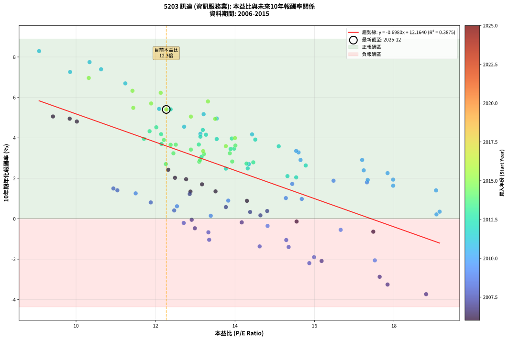
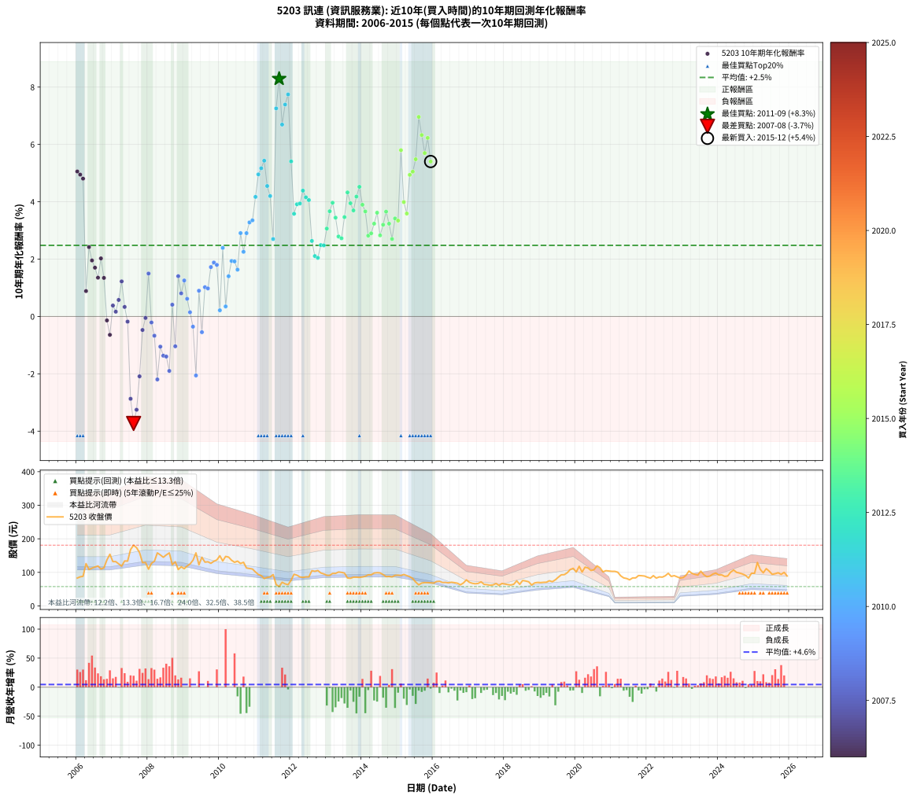

# 5203 訊連 - 本益比與未來報酬率分析

!!! info "報告資訊"
    - **股票代號**: 5203
    - **公司名稱**: 訊連
    - **產業別**: 資訊服務業
    - **分析期間**: 2006-2015 (120 個數據點)
    - **資料來源**: Type 12 (ShowMonthlyK_ChartFlow) 月收盤價與本益比
    - **報酬率口徑**: 含現金股利 (簡化: 年度合計，假設每年7/1入帳)
    - **報告生成時間**: 2026-01-07 19:02:46 CST

## 📈 視覺化圖表

### 圖表1: 本益比 vs 未來報酬率關係

*圖表1：5203 訊連 本益比與10年期未來報酬率關係 (2006-2015)*

### 圖表2: 歷年買入時點的10年期實際報酬率

*圖表2：5203 訊連 歷年買入時點的10年期實際報酬率 (2006-2015)*

## 📍 買點訊號說明

本報告提供兩種買點提示訊號（顯示於圖表2的股價子圖中）：

### ▲ 小綠色三角形（回測驗證）
- **計算方式**: 使用全部歷史資料計算本益比第25百分位數
- **用途**: 事後驗證，顯示歷史上哪些時點確實為低估區
- **限制**: 當下無法判斷，僅供回測參考
- **特性**: 後見之明（Look-Ahead Bias）

### ▲ 小橘色三角形（即時訊號）
- **計算方式**: 使用截至當月的過去5年資料計算本益比第25百分位數
- **用途**: 實際投資決策，當時即可判斷
- **優勢**: 可操作性強，符合實務需求
- **特性**: 無後見之明，滾動窗口計算

!!! tip "如何使用兩種訊號"
    - **綠色▲** 幫助理解歷史估值機會，驗證策略有效性
    - **橘色▲** 可作為實際買進參考，但仍需搭配基本面分析
    - 兩種訊號重疊時，表示即時判斷與事後驗證一致，信心度較高
    - 僅有綠色▲時，表示當時無法判斷（需要未來資料才能確認）
    - 僅有橘色▲時，表示即時判斷為買點，但事後可能不是最佳時機

## 📊 估值分析摘要

| 指標 | 數值 |
|:---:|:---:|
| **目前本益比** (2015-12) | **12.27 倍** |
| **歷史平均本益比** | 13.87 倍 |
| **估值水準** | 🟡 合理範圍 |
| **預期10年年化報酬率** | **+3.60%** |
| **歷史平均報酬率** | +2.48% |
| **相關係數 (R²)** | 0.3875 |
| **趨勢線斜率** | -0.6980 |

!!! abstract "核心洞察"
    目前本益比接近歷史平均，預期報酬率符合長期趨勢

    根據歷史數據回測，5203 訊連 在目前本益比 **12.3倍** 的估值水準下，
    預期未來10年年化報酬率約為 **+3.6%**。

    **重要提醒**: 本分析基於歷史數據統計，實際報酬率會受到公司基本面變化、產業趨勢、
    總體經濟環境等多重因素影響。R² = 0.39 表示本益比可解釋約 38.7% 的報酬率變異。

## 📈 歷史估值統計

### 最佳買點 (最高報酬率)

| 項目 | 數值 |
|:---:|:---:|
| 起始時間 | 2011-09 |
| 當時本益比 | 9.07 倍 |
| 起始價格 | 57.6 元 |
| 10年後價格 | 83.5 元 |
| **10年年化報酬率** | **+8.29%** |

### 最差買點 (最低報酬率)

| 項目 | 數值 |
|:---:|:---:|
| 起始時間 | 2007-08 |
| 當時本益比 | 18.81 倍 |
| 起始價格 | 181.0 元 |
| 10年後價格 | 61.7 元 |
| **10年年化報酬率** | **-3.73%** |

## 🎯 投資啟示

### 本益比與報酬率關係

趨勢線方程式: **y = -0.6980x + 12.1640**

!!! warning "強負相關"
    本益比與未來報酬率呈現強負相關。在高本益比時期買入，未來報酬率顯著較低；
    在低本益比時期買入，未來報酬率顯著較高。**估值紀律至關重要**。

### 估值區間建議

基於歷史數據分析:

- **🟢 低估區** (P/E < 11.1): 預期報酬率較高，可考慮增加持股
- **🟡 合理區** (P/E 11.1-16.6): 預期報酬率符合長期趨勢，正常持有
- **🔴 高估區** (P/E > 16.6): 預期報酬率較低，可考慮減碼或觀望

!!! danger "風險提示"
    - 過去表現不代表未來結果
    - 本分析假設公司基本面無重大結構性變化
    - 產業環境劇變可能使歷史規律失效
    - 應結合公司財報、產業趨勢、總體經濟等多重因素綜合判斷

!!! success "長期投資觀點"
    歷史數據顯示，在合理或低估的估值水準買入並長期持有，
    往往能獲得較佳的投資報酬。**耐心等待好價格**是價值投資的核心原則。

## 📊 數據品質

- **資料來源**: GoodInfo.tw Type 12 (ShowMonthlyK_ChartFlow)
- **資料頻率**: 月度收盤價與本益比
- **回測期間**: 2006-2015
- **數據點數量**: 120 個 (每個點代表一次10年期回測)

### 計算方法說明

1. **10年期年化報酬率**:
   - 對每個歷史時點，計算其後10年的實際投資報酬率
   - 期末價值(不含股利): 期末價格
   - 期末價值(含現金股利): 期末價格 + 持有期間內的現金股利合計 (簡化: 年度合計，假設每年7/1入帳)
   - 公式: 年化報酬率 = [(期末價值/期初價格)^(1/年數) - 1] × 100%

2. **本益比 (P/E Ratio)**:
   - 使用當時的月收盤價與EPS計算
   - 資料來源: Type 12 月度河流圖本益比數據

3. **趨勢線 (Linear Regression)**:
   - 使用最小平方法擬合線性趨勢線
   - R²值衡量本益比對報酬率的解釋能力

---

*本報告由 Stock Analysis System v1.9.0 自動生成*
*數據更新時間: 2026-01-07 19:02:46 CST*

## 📋 月度回測明細表

（每一列對應時間線圖中的一個買入點；可用來對照 SVG 圖上的每個點。）

| 買入月份 | 賣出月份 | 回測期限_年 | 實際持有年數 | 買入本益比_倍 | 買入收盤價_元 | 賣出收盤價_元 | 現金股利合計_元 | 總報酬率_pct | 年化報酬率_pct |
| --- | --- | --- | --- | --- | --- | --- | --- | --- | --- |
| 2006-01 | 2016-01 | 10 | 9.999 | 9.42 | 83.00 | 68.10 | 67.82 | +63.76 | +5.06 |
| 2006-02 | 2016-02 | 10 | 9.999 | 9.84 | 86.70 | 72.70 | 67.82 | +62.08 | +4.95 |
| 2006-03 | 2016-03 | 10 | 10.001 | 10.02 | 88.30 | 73.40 | 67.82 | +59.93 | +4.81 |
| 2006-04 | 2016-04 | 10 | 10.001 | 14.30 | 126.00 | 69.80 | 67.82 | +9.22 | +0.89 |
| 2006-05 | 2016-05 | 10 | 10.001 | 12.32 | 108.50 | 70.00 | 67.82 | +27.02 | +2.42 |
| 2006-06 | 2016-06 | 10 | 10.001 | 12.77 | 112.50 | 68.70 | 67.82 | +21.35 | +1.95 |
| 2006-07 | 2016-07 | 10 | 10.001 | 13.17 | 116.00 | 70.50 | 66.83 | +18.38 | +1.70 |
| 2006-08 | 2016-08 | 10 | 10.001 | 13.51 | 119.00 | 69.30 | 66.83 | +14.39 | +1.35 |
| 2006-09 | 2016-09 | 10 | 10.001 | 12.49 | 110.00 | 67.60 | 66.83 | +22.20 | +2.03 |
| 2006-10 | 2016-10 | 10 | 10.001 | 12.88 | 113.50 | 62.90 | 66.83 | +14.30 | +1.34 |
| 2006-11 | 2016-11 | 10 | 10.001 | 15.55 | 137.00 | 68.30 | 66.83 | -1.37 | -0.14 |
| 2006-12 | 2016-12 | 10 | 10.001 | 17.48 | 154.00 | 77.60 | 66.83 | -6.22 | -0.64 |
| 2007-01 | 2017-01 | 10 | 10.001 | 14.81 | 132.00 | 70.30 | 66.83 | +3.88 | +0.38 |
| 2007-02 | 2017-02 | 10 | 10.001 | 14.64 | 132.00 | 67.40 | 66.83 | +1.69 | +0.17 |
| 2007-03 | 2017-03 | 10 | 10.001 | 13.77 | 125.50 | 66.10 | 66.83 | +5.92 | +0.58 |
| 2007-04 | 2017-04 | 10 | 10.001 | 12.86 | 118.50 | 67.00 | 66.83 | +12.93 | +1.22 |
| 2007-05 | 2017-05 | 10 | 10.001 | 14.38 | 134.00 | 71.70 | 66.83 | +3.38 | +0.33 |
| 2007-06 | 2017-06 | 10 | 10.001 | 14.17 | 133.50 | 64.30 | 66.83 | -1.78 | -0.18 |
| 2007-07 | 2017-07 | 10 | 10.001 | 17.64 | 168.00 | 63.50 | 62.04 | -25.27 | -2.87 |
| 2007-08 | 2017-08 | 10 | 10.001 | 18.81 | 181.00 | 61.70 | 62.04 | -31.63 | -3.73 |
| 2007-09 | 2017-09 | 10 | 10.001 | 17.84 | 173.50 | 62.60 | 62.04 | -28.16 | -3.25 |
| 2007-10 | 2017-10 | 10 | 10.001 | 16.18 | 159.00 | 66.70 | 62.04 | -19.03 | -2.09 |
| 2007-11 | 2017-11 | 10 | 10.001 | 12.99 | 129.00 | 61.00 | 62.04 | -4.62 | -0.47 |
| 2007-12 | 2017-12 | 10 | 10.001 | 12.91 | 129.50 | 66.80 | 62.04 | -0.51 | -0.05 |
| 2008-01 | 2018-01 | 10 | 10.001 | 10.94 | 109.50 | 65.00 | 62.04 | +16.02 | +1.50 |
| 2008-02 | 2018-03 | 10 | 10.081 | 12.71 | 127.00 | 62.30 | 62.04 | -2.09 | -0.21 |
| 2008-03 | 2018-03 | 10 | 9.999 | 13.33 | 133.00 | 62.30 | 62.04 | -6.51 | -0.67 |
| 2008-04 | 2018-04 | 10 | 9.999 | 15.87 | 158.00 | 64.50 | 62.04 | -19.91 | -2.20 |
| 2008-05 | 2018-05 | 10 | 9.999 | 15.29 | 152.00 | 74.70 | 62.04 | -10.04 | -1.05 |
| 2008-06 | 2018-06 | 10 | 9.999 | 14.62 | 145.00 | 64.30 | 62.04 | -12.87 | -1.37 |
| 2008-07 | 2018-07 | 10 | 9.999 | 15.35 | 152.00 | 75.80 | 56.24 | -13.13 | -1.40 |
| 2008-08 | 2018-08 | 10 | 9.999 | 15.99 | 158.00 | 74.20 | 56.24 | -17.44 | -1.90 |
| 2008-09 | 2018-09 | 10 | 9.999 | 12.47 | 123.00 | 71.90 | 56.24 | +4.18 | +0.41 |
| 2008-10 | 2018-10 | 10 | 9.999 | 13.35 | 131.50 | 62.20 | 56.24 | -9.93 | -1.04 |
| 2008-11 | 2018-11 | 10 | 9.999 | 11.04 | 108.50 | 68.50 | 56.24 | +14.97 | +1.41 |
| 2008-12 | 2018-12 | 10 | 9.999 | 11.88 | 116.50 | 70.00 | 56.24 | +8.36 | +0.81 |
| 2009-01 | 2019-01 | 10 | 9.999 | 11.50 | 111.00 | 69.50 | 56.24 | +13.28 | +1.26 |
| 2009-02 | 2019-02 | 10 | 9.999 | 12.54 | 119.00 | 70.30 | 56.24 | +6.34 | +0.62 |
| 2009-03 | 2019-03 | 10 | 9.999 | 13.39 | 125.00 | 70.60 | 56.24 | +1.48 | +0.15 |
| 2009-04 | 2019-04 | 10 | 9.999 | 14.82 | 136.00 | 75.00 | 56.24 | -3.50 | -0.36 |
| 2009-05 | 2019-05 | 10 | 9.999 | 17.52 | 158.00 | 72.10 | 56.24 | -18.77 | -2.06 |
| 2009-06 | 2019-06 | 10 | 9.999 | 13.83 | 122.50 | 77.70 | 56.24 | +9.34 | +0.90 |
| 2009-07 | 2019-07 | 10 | 9.999 | 16.66 | 145.00 | 85.50 | 51.75 | -5.35 | -0.55 |
| 2009-08 | 2019-08 | 10 | 9.999 | 15.28 | 130.50 | 92.70 | 51.75 | +10.69 | +1.02 |
| 2009-09 | 2019-09 | 10 | 9.999 | 15.68 | 131.50 | 93.20 | 51.75 | +10.22 | +0.98 |
| 2009-10 | 2019-10 | 10 | 9.999 | 15.44 | 127.00 | 98.90 | 51.75 | +18.62 | +1.72 |
| 2009-11 | 2019-11 | 10 | 9.999 | 16.48 | 133.00 | 108.50 | 51.75 | +20.48 | +1.88 |
| 2009-12 | 2019-12 | 10 | 9.999 | 17.32 | 137.00 | 112.00 | 51.75 | +19.52 | +1.80 |
| 2010-01 | 2020-01 | 10 | 9.999 | 19.07 | 149.50 | 101.00 | 51.75 | +2.17 | +0.21 |
| 2010-02 | 2020-02 | 10 | 9.999 | 17.24 | 134.00 | 118.00 | 51.75 | +26.68 | +2.39 |
| 2010-03 | 2020-03 | 10 | 10.001 | 19.15 | 147.50 | 101.00 | 51.75 | +3.56 | +0.35 |
| 2010-04 | 2020-04 | 10 | 10.001 | 19.06 | 145.50 | 115.50 | 51.75 | +14.95 | +1.40 |
| 2010-05 | 2020-05 | 10 | 10.001 | 17.98 | 136.00 | 113.00 | 51.75 | +21.14 | +1.94 |
| 2010-06 | 2020-06 | 10 | 10.001 | 17.34 | 130.00 | 105.50 | 51.75 | +20.96 | +1.92 |
| 2010-07 | 2020-07 | 10 | 10.001 | 17.98 | 133.50 | 108.00 | 48.98 | +17.59 | +1.63 |
| 2010-08 | 2020-08 | 10 | 10.001 | 17.20 | 126.50 | 119.50 | 48.98 | +33.19 | +2.91 |
| 2010-09 | 2020-09 | 10 | 10.001 | 17.84 | 130.00 | 113.50 | 48.98 | +24.99 | +2.26 |
| 2010-10 | 2020-10 | 10 | 10.001 | 15.65 | 113.00 | 101.50 | 48.98 | +33.17 | +2.91 |
| 2010-11 | 2020-11 | 10 | 10.001 | 15.60 | 111.50 | 105.00 | 48.98 | +38.10 | +3.28 |
| 2010-12 | 2020-12 | 10 | 10.001 | 15.54 | 110.00 | 104.00 | 48.98 | +39.08 | +3.35 |
| 2011-01 | 2021-01 | 10 | 10.001 | 14.43 | 101.00 | 103.00 | 48.98 | +50.48 | +4.17 |
| 2011-02 | 2021-02 | 10 | 10.001 | 13.54 | 93.70 | 103.00 | 48.98 | +62.20 | +4.96 |
| 2011-03 | 2021-03 | 10 | 10.001 | 13.21 | 90.30 | 100.50 | 48.98 | +65.54 | +5.17 |
| 2011-04 | 2021-04 | 10 | 10.001 | 12.09 | 81.70 | 89.70 | 48.98 | +69.75 | +5.43 |
| 2011-05 | 2021-05 | 10 | 10.001 | 12.72 | 84.90 | 83.50 | 48.98 | +56.05 | +4.55 |
| 2011-06 | 2021-06 | 10 | 10.001 | 13.13 | 86.60 | 81.70 | 48.98 | +50.91 | +4.20 |
| 2011-07 | 2021-07 | 10 | 10.001 | 14.35 | 93.50 | 77.80 | 44.26 | +30.54 | +2.70 |
| 2011-08 | 2021-08 | 10 | 10.001 | 9.85 | 63.40 | 83.50 | 44.26 | +101.51 | +7.26 |
| 2011-09 | 2021-09 | 10 | 10.001 | 9.07 | 57.60 | 83.50 | 44.26 | +121.80 | +8.29 |
| 2011-10 | 2021-10 | 10 | 10.001 | 11.24 | 70.50 | 90.50 | 44.26 | +91.14 | +6.69 |
| 2011-11 | 2021-11 | 10 | 10.001 | 10.63 | 65.80 | 90.00 | 44.26 | +104.04 | +7.39 |
| 2011-12 | 2021-12 | 10 | 10.001 | 10.34 | 63.20 | 89.00 | 44.26 | +110.85 | +7.74 |
| 2012-01 | 2022-01 | 10 | 10.001 | 12.38 | 76.50 | 85.30 | 44.26 | +69.35 | +5.41 |
| 2012-02 | 2022-03 | 10 | 10.081 | 15.10 | 94.30 | 90.20 | 44.26 | +42.58 | +3.58 |
| 2012-03 | 2022-03 | 10 | 9.999 | 14.51 | 91.60 | 90.20 | 44.26 | +46.79 | +3.91 |
| 2012-04 | 2022-04 | 10 | 9.999 | 13.54 | 86.40 | 82.90 | 44.26 | +47.17 | +3.94 |
| 2012-05 | 2022-05 | 10 | 9.999 | 13.19 | 85.10 | 86.50 | 44.26 | +53.65 | +4.39 |
| 2012-06 | 2022-06 | 10 | 9.999 | 13.27 | 86.50 | 85.70 | 44.26 | +50.24 | +4.16 |
| 2012-07 | 2022-07 | 10 | 9.999 | 13.13 | 86.50 | 89.80 | 38.97 | +48.87 | +4.06 |
| 2012-08 | 2022-08 | 10 | 9.999 | 15.78 | 105.00 | 97.20 | 38.97 | +29.69 | +2.63 |
| 2012-09 | 2022-09 | 10 | 9.999 | 15.32 | 103.00 | 87.90 | 38.97 | +23.17 | +2.11 |
| 2012-10 | 2022-10 | 10 | 9.999 | 15.54 | 105.50 | 90.20 | 38.97 | +22.44 | +2.05 |
| 2012-11 | 2022-11 | 10 | 9.999 | 14.32 | 98.20 | 86.60 | 38.97 | +27.87 | +2.49 |
| 2012-12 | 2022-12 | 10 | 9.999 | 13.77 | 95.40 | 82.90 | 38.97 | +27.75 | +2.48 |
| 2013-01 | 2023-01 | 10 | 9.999 | 13.16 | 91.30 | 84.50 | 38.97 | +35.24 | +3.06 |
| 2013-02 | 2023-02 | 10 | 9.999 | 13.09 | 91.00 | 91.50 | 38.97 | +43.37 | +3.67 |
| 2013-03 | 2023-03 | 10 | 9.999 | 13.92 | 96.90 | 104.00 | 38.97 | +47.54 | +3.97 |
| 2013-04 | 2023-04 | 10 | 9.999 | 13.89 | 96.90 | 97.00 | 38.97 | +40.32 | +3.45 |
| 2013-05 | 2023-05 | 10 | 9.999 | 14.46 | 101.00 | 94.00 | 38.97 | +31.65 | +2.79 |
| 2013-06 | 2023-06 | 10 | 9.999 | 14.29 | 100.00 | 91.90 | 38.97 | +30.87 | +2.73 |
| 2013-07 | 2023-07 | 10 | 9.999 | 13.98 | 98.00 | 103.50 | 34.27 | +40.58 | +3.47 |
| 2013-08 | 2023-08 | 10 | 9.999 | 11.85 | 83.20 | 92.80 | 34.27 | +52.73 | +4.33 |
| 2013-09 | 2023-09 | 10 | 9.999 | 11.71 | 82.40 | 87.10 | 34.27 | +47.29 | +3.95 |
| 2013-10 | 2023-10 | 10 | 9.999 | 12.15 | 85.60 | 88.80 | 34.27 | +43.77 | +3.70 |
| 2013-11 | 2023-11 | 10 | 9.999 | 12.14 | 85.70 | 94.80 | 34.27 | +50.61 | +4.18 |
| 2013-12 | 2023-12 | 10 | 9.999 | 12.02 | 85.00 | 98.00 | 34.27 | +55.61 | +4.52 |
| 2014-01 | 2024-01 | 10 | 9.999 | 12.21 | 86.30 | 92.20 | 34.27 | +46.55 | +3.90 |
| 2014-02 | 2024-02 | 10 | 9.999 | 12.51 | 88.40 | 92.40 | 34.27 | +43.29 | +3.66 |
| 2014-03 | 2024-03 | 10 | 10.001 | 13.10 | 92.60 | 88.00 | 34.27 | +32.04 | +2.82 |
| 2014-04 | 2024-04 | 10 | 10.001 | 13.12 | 92.70 | 89.10 | 34.27 | +33.09 | +2.90 |
| 2014-05 | 2024-05 | 10 | 10.001 | 13.87 | 98.00 | 100.50 | 34.27 | +37.52 | +3.24 |
| 2014-06 | 2024-06 | 10 | 10.001 | 14.01 | 99.00 | 107.00 | 34.27 | +42.70 | +3.62 |
| 2014-07 | 2024-07 | 10 | 10.001 | 13.93 | 98.40 | 100.00 | 30.07 | +32.19 | +2.83 |
| 2014-08 | 2024-08 | 10 | 10.001 | 13.22 | 93.40 | 97.90 | 30.07 | +37.01 | +3.20 |
| 2014-09 | 2024-09 | 10 | 10.001 | 12.38 | 87.40 | 95.10 | 30.07 | +43.22 | +3.66 |
| 2014-10 | 2024-10 | 10 | 10.001 | 12.45 | 87.90 | 90.80 | 30.07 | +37.51 | +3.24 |
| 2014-11 | 2024-11 | 10 | 10.001 | 12.26 | 86.60 | 83.00 | 30.07 | +30.57 | +2.70 |
| 2014-12 | 2024-12 | 10 | 10.001 | 12.89 | 91.00 | 97.30 | 30.07 | +39.97 | +3.42 |
| 2015-01 | 2025-01 | 10 | 10.001 | 13.20 | 91.60 | 97.20 | 30.07 | +38.94 | +3.34 |
| 2015-02 | 2025-02 | 10 | 10.001 | 13.32 | 90.80 | 129.50 | 30.07 | +75.74 | +5.80 |
| 2015-03 | 2025-03 | 10 | 10.001 | 14.00 | 93.70 | 108.50 | 30.07 | +47.89 | +3.99 |
| 2015-04 | 2025-04 | 10 | 10.001 | 13.77 | 90.50 | 98.70 | 30.07 | +42.29 | +3.59 |
| 2015-05 | 2025-05 | 10 | 10.001 | 13.50 | 87.10 | 111.00 | 30.07 | +61.96 | +4.94 |
| 2015-06 | 2025-06 | 10 | 10.001 | 12.89 | 81.60 | 103.50 | 30.07 | +63.69 | +5.05 |
| 2015-07 | 2025-07 | 10 | 10.001 | 11.44 | 71.00 | 94.10 | 26.99 | +70.55 | +5.48 |
| 2015-08 | 2025-08 | 10 | 10.001 | 10.32 | 62.80 | 96.10 | 26.99 | +96.00 | +6.96 |
| 2015-09 | 2025-09 | 10 | 10.001 | 11.42 | 68.10 | 98.80 | 26.99 | +84.72 | +6.33 |
| 2015-10 | 2025-10 | 10 | 10.001 | 11.89 | 69.50 | 94.00 | 26.99 | +74.09 | +5.70 |
| 2015-11 | 2025-11 | 10 | 10.001 | 12.13 | 69.40 | 100.00 | 26.99 | +82.98 | +6.23 |
| 2015-12 | 2025-12 | 10 | 10.001 | 12.27 | 68.70 | 89.30 | 26.99 | +69.27 | +5.40 |
