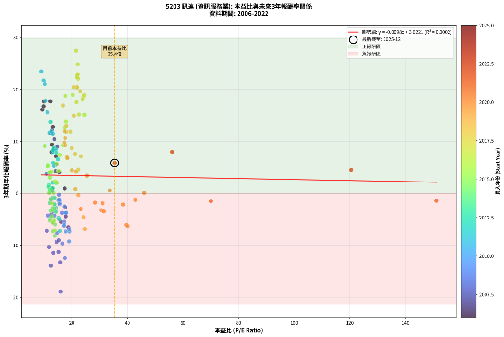
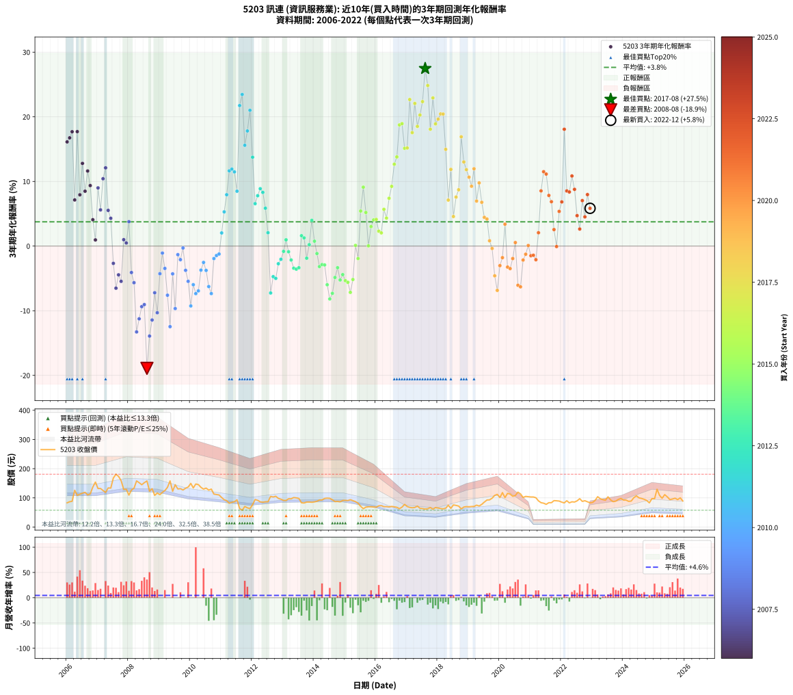

# 5203 訊連 - 本益比與未來報酬率分析

!!! info "報告資訊"
    - **股票代號**: 5203
    - **公司名稱**: 訊連
    - **產業別**: 資訊服務業
    - **分析期間**: 2006-2022 (204 個數據點)
    - **資料來源**: Type 12 (ShowMonthlyK_ChartFlow) 月收盤價與本益比
    - **報酬率口徑**: 含現金股利 (簡化: 年度合計，假設每年7/1入帳)
    - **報告生成時間**: 2026-01-07 19:02:26 CST

## 📈 視覺化圖表

### 圖表1: 本益比 vs 未來報酬率關係

*圖表1：5203 訊連 本益比與3年期未來報酬率關係 (2006-2022)*

### 圖表2: 歷年買入時點的3年期實際報酬率

*圖表2：5203 訊連 歷年買入時點的3年期實際報酬率 (2006-2022)*

## 📍 買點訊號說明

本報告提供兩種買點提示訊號（顯示於圖表2的股價子圖中）：

### ▲ 小綠色三角形（回測驗證）
- **計算方式**: 使用全部歷史資料計算本益比第25百分位數
- **用途**: 事後驗證，顯示歷史上哪些時點確實為低估區
- **限制**: 當下無法判斷，僅供回測參考
- **特性**: 後見之明（Look-Ahead Bias）

### ▲ 小橘色三角形（即時訊號）
- **計算方式**: 使用截至當月的過去5年資料計算本益比第25百分位數
- **用途**: 實際投資決策，當時即可判斷
- **優勢**: 可操作性強，符合實務需求
- **特性**: 無後見之明，滾動窗口計算

!!! tip "如何使用兩種訊號"
    - **綠色▲** 幫助理解歷史估值機會，驗證策略有效性
    - **橘色▲** 可作為實際買進參考，但仍需搭配基本面分析
    - 兩種訊號重疊時，表示即時判斷與事後驗證一致，信心度較高
    - 僅有綠色▲時，表示當時無法判斷（需要未來資料才能確認）
    - 僅有橘色▲時，表示即時判斷為買點，但事後可能不是最佳時機

## 📊 估值分析摘要

| 指標 | 數值 |
|:---:|:---:|
| **目前本益比** (2022-12) | **35.43 倍** |
| **歷史平均本益比** | 18.75 倍 |
| **估值水準** | 🔴 相對高估 |
| **預期3年年化報酬率** | **+3.28%** |
| **歷史平均報酬率** | +3.75% |
| **相關係數 (R²)** | 0.0002 |
| **趨勢線斜率** | -0.0098 |

!!! abstract "核心洞察"
    目前本益比顯著高於歷史平均，預期未來報酬率可能較低

    根據歷史數據回測，5203 訊連 在目前本益比 **35.4倍** 的估值水準下，
    預期未來3年年化報酬率約為 **+3.3%**。

    **重要提醒**: 本分析基於歷史數據統計，實際報酬率會受到公司基本面變化、產業趨勢、
    總體經濟環境等多重因素影響。R² = 0.00 表示本益比可解釋約 0.0% 的報酬率變異。

## 📈 歷史估值統計

### 最佳買點 (最高報酬率)

| 項目 | 數值 |
|:---:|:---:|
| 起始時間 | 2017-08 |
| 當時本益比 | 21.55 倍 |
| 起始價格 | 61.7 元 |
| 3年後價格 | 119.5 元 |
| **3年年化報酬率** | **+27.47%** |

### 最差買點 (最低報酬率)

| 項目 | 數值 |
|:---:|:---:|
| 起始時間 | 2008-08 |
| 當時本益比 | 15.99 倍 |
| 起始價格 | 158.0 元 |
| 3年後價格 | 63.4 元 |
| **3年年化報酬率** | **-18.91%** |

## 🎯 投資啟示

### 本益比與報酬率關係

趨勢線方程式: **y = -0.0098x + 3.6221**

!!! note "負相關"
    本益比與未來報酬率呈現負相關。較低的本益比通常帶來較高的未來報酬率，
    但相關性不算非常強。**估值仍是重要參考指標之一**。

### 估值區間建議

基於歷史數據分析:

- **🟢 低估區** (P/E < 15.0): 預期報酬率較高，可考慮增加持股
- **🟡 合理區** (P/E 15.0-22.5): 預期報酬率符合長期趨勢，正常持有
- **🔴 高估區** (P/E > 22.5): 預期報酬率較低，可考慮減碼或觀望

!!! danger "風險提示"
    - 過去表現不代表未來結果
    - 本分析假設公司基本面無重大結構性變化
    - 產業環境劇變可能使歷史規律失效
    - 應結合公司財報、產業趨勢、總體經濟等多重因素綜合判斷

!!! success "長期投資觀點"
    歷史數據顯示，在合理或低估的估值水準買入並長期持有，
    往往能獲得較佳的投資報酬。**耐心等待好價格**是價值投資的核心原則。

## 📊 數據品質

- **資料來源**: GoodInfo.tw Type 12 (ShowMonthlyK_ChartFlow)
- **資料頻率**: 月度收盤價與本益比
- **回測期間**: 2006-2022
- **數據點數量**: 204 個 (每個點代表一次3年期回測)

### 計算方法說明

1. **3年期年化報酬率**:
   - 對每個歷史時點，計算其後3年的實際投資報酬率
   - 期末價值(不含股利): 期末價格
   - 期末價值(含現金股利): 期末價格 + 持有期間內的現金股利合計 (簡化: 年度合計，假設每年7/1入帳)
   - 公式: 年化報酬率 = [(期末價值/期初價格)^(1/年數) - 1] × 100%

2. **本益比 (P/E Ratio)**:
   - 使用當時的月收盤價與EPS計算
   - 資料來源: Type 12 月度河流圖本益比數據

3. **趨勢線 (Linear Regression)**:
   - 使用最小平方法擬合線性趨勢線
   - R²值衡量本益比對報酬率的解釋能力

---

*本報告由 Stock Analysis System v1.9.0 自動生成*
*數據更新時間: 2026-01-07 19:02:26 CST*

## 📋 月度回測明細表

（每一列對應時間線圖中的一個買入點；可用來對照 SVG 圖上的每個點。）

| 買入月份 | 賣出月份 | 回測期限_年 | 實際持有年數 | 買入本益比_倍 | 買入收盤價_元 | 賣出收盤價_元 | 現金股利合計_元 | 總報酬率_pct | 年化報酬率_pct |
| --- | --- | --- | --- | --- | --- | --- | --- | --- | --- |
| 2006-01 | 2009-01 | 3 | 3.001 | 9.42 | 83.00 | 111.00 | 18.96 | +56.58 | +16.12 |
| 2006-02 | 2009-02 | 3 | 3.001 | 9.84 | 86.70 | 119.00 | 18.96 | +59.13 | +16.74 |
| 2006-03 | 2009-03 | 3 | 3.001 | 10.02 | 88.30 | 125.00 | 18.96 | +63.04 | +17.69 |
| 2006-04 | 2009-04 | 3 | 3.001 | 14.30 | 126.00 | 136.00 | 18.96 | +22.99 | +7.14 |
| 2006-05 | 2009-05 | 3 | 3.001 | 12.32 | 108.50 | 158.00 | 18.96 | +63.10 | +17.71 |
| 2006-06 | 2009-06 | 3 | 3.001 | 12.77 | 112.50 | 122.50 | 18.96 | +25.75 | +7.93 |
| 2006-07 | 2009-07 | 3 | 3.001 | 13.17 | 116.00 | 145.00 | 21.46 | +43.50 | +12.79 |
| 2006-08 | 2009-08 | 3 | 3.001 | 13.51 | 119.00 | 130.50 | 21.46 | +27.70 | +8.49 |
| 2006-09 | 2009-09 | 3 | 3.001 | 12.49 | 110.00 | 131.50 | 21.46 | +39.06 | +11.61 |
| 2006-10 | 2009-10 | 3 | 3.001 | 12.88 | 113.50 | 127.00 | 21.46 | +30.80 | +9.36 |
| 2006-11 | 2009-11 | 3 | 3.001 | 15.55 | 137.00 | 133.00 | 21.46 | +12.75 | +4.08 |
| 2006-12 | 2009-12 | 3 | 3.001 | 17.48 | 154.00 | 137.00 | 21.46 | +2.90 | +0.96 |
| 2007-01 | 2010-01 | 3 | 3.001 | 14.81 | 132.00 | 149.50 | 21.46 | +29.52 | +9.00 |
| 2007-02 | 2010-02 | 3 | 3.001 | 14.64 | 132.00 | 134.00 | 21.46 | +17.77 | +5.60 |
| 2007-03 | 2010-03 | 3 | 3.001 | 13.77 | 125.50 | 147.50 | 21.46 | +34.63 | +10.42 |
| 2007-04 | 2010-04 | 3 | 3.001 | 12.86 | 118.50 | 145.50 | 21.46 | +40.90 | +12.10 |
| 2007-05 | 2010-05 | 3 | 3.001 | 14.38 | 134.00 | 136.00 | 21.46 | +17.51 | +5.52 |
| 2007-06 | 2010-06 | 3 | 3.001 | 14.17 | 133.50 | 130.00 | 21.46 | +13.45 | +4.30 |
| 2007-07 | 2010-07 | 3 | 3.001 | 17.64 | 168.00 | 133.50 | 21.38 | -7.81 | -2.67 |
| 2007-08 | 2010-08 | 3 | 3.001 | 18.81 | 181.00 | 126.50 | 21.38 | -18.30 | -6.51 |
| 2007-09 | 2010-09 | 3 | 3.001 | 17.84 | 173.50 | 130.00 | 21.38 | -12.75 | -4.44 |
| 2007-10 | 2010-10 | 3 | 3.001 | 16.18 | 159.00 | 113.00 | 21.38 | -15.49 | -5.45 |
| 2007-11 | 2010-11 | 3 | 3.001 | 12.99 | 129.00 | 111.50 | 21.38 | +3.01 | +0.99 |
| 2007-12 | 2010-12 | 3 | 3.001 | 12.91 | 129.50 | 110.00 | 21.38 | +1.45 | +0.48 |
| 2008-01 | 2011-01 | 3 | 3.001 | 10.94 | 109.50 | 101.00 | 21.38 | +11.76 | +3.77 |
| 2008-02 | 2011-03 | 3 | 3.080 | 12.71 | 127.00 | 90.30 | 21.38 | -12.07 | -4.09 |
| 2008-03 | 2011-03 | 3 | 2.998 | 13.33 | 133.00 | 90.30 | 21.38 | -16.03 | -5.66 |
| 2008-04 | 2011-04 | 3 | 2.998 | 15.87 | 158.00 | 81.70 | 21.38 | -34.76 | -13.28 |
| 2008-05 | 2011-05 | 3 | 2.998 | 15.29 | 152.00 | 84.90 | 21.38 | -30.08 | -11.25 |
| 2008-06 | 2011-06 | 3 | 2.998 | 14.62 | 145.00 | 86.60 | 21.38 | -25.53 | -9.37 |
| 2008-07 | 2011-07 | 3 | 2.998 | 15.35 | 152.00 | 93.50 | 20.88 | -24.75 | -9.05 |
| 2008-08 | 2011-08 | 3 | 2.998 | 15.99 | 158.00 | 63.40 | 20.88 | -46.66 | -18.91 |
| 2008-09 | 2011-09 | 3 | 2.998 | 12.47 | 123.00 | 57.60 | 20.88 | -36.20 | -13.92 |
| 2008-10 | 2011-10 | 3 | 2.998 | 13.35 | 131.50 | 70.50 | 20.88 | -30.51 | -11.43 |
| 2008-11 | 2011-11 | 3 | 2.998 | 11.04 | 108.50 | 65.80 | 20.88 | -20.11 | -7.22 |
| 2008-12 | 2011-12 | 3 | 2.998 | 11.88 | 116.50 | 63.20 | 20.88 | -27.83 | -10.31 |
| 2009-01 | 2012-01 | 3 | 2.998 | 11.50 | 111.00 | 76.50 | 20.88 | -12.27 | -4.27 |
| 2009-02 | 2012-02 | 3 | 2.998 | 12.54 | 119.00 | 94.30 | 20.88 | -3.21 | -1.08 |
| 2009-03 | 2012-03 | 3 | 3.001 | 13.39 | 125.00 | 91.60 | 20.88 | -10.02 | -3.46 |
| 2009-04 | 2012-04 | 3 | 3.001 | 14.82 | 136.00 | 86.40 | 20.88 | -21.12 | -7.60 |
| 2009-05 | 2012-05 | 3 | 3.001 | 17.52 | 158.00 | 85.10 | 20.88 | -32.93 | -12.46 |
| 2009-06 | 2012-06 | 3 | 3.001 | 13.83 | 122.50 | 86.50 | 20.88 | -12.34 | -4.30 |
| 2009-07 | 2012-07 | 3 | 3.001 | 16.66 | 145.00 | 86.50 | 20.39 | -26.28 | -9.66 |
| 2009-08 | 2012-08 | 3 | 3.001 | 15.28 | 130.50 | 105.00 | 20.39 | -3.92 | -1.32 |
| 2009-09 | 2012-09 | 3 | 3.001 | 15.68 | 131.50 | 103.00 | 20.39 | -6.17 | -2.10 |
| 2009-10 | 2012-10 | 3 | 3.001 | 15.44 | 127.00 | 105.50 | 20.39 | -0.87 | -0.29 |
| 2009-11 | 2012-11 | 3 | 3.001 | 16.48 | 133.00 | 98.20 | 20.39 | -10.84 | -3.75 |
| 2009-12 | 2012-12 | 3 | 3.001 | 17.32 | 137.00 | 95.40 | 20.39 | -15.48 | -5.45 |
| 2010-01 | 2013-01 | 3 | 3.001 | 19.07 | 149.50 | 91.30 | 20.39 | -25.29 | -9.26 |
| 2010-02 | 2013-02 | 3 | 3.001 | 17.24 | 134.00 | 91.00 | 20.39 | -16.87 | -5.97 |
| 2010-03 | 2013-03 | 3 | 3.001 | 19.15 | 147.50 | 96.90 | 20.39 | -20.48 | -7.35 |
| 2010-04 | 2013-04 | 3 | 3.001 | 19.06 | 145.50 | 96.90 | 20.39 | -19.39 | -6.93 |
| 2010-05 | 2013-05 | 3 | 3.001 | 17.98 | 136.00 | 101.00 | 20.39 | -10.74 | -3.72 |
| 2010-06 | 2013-06 | 3 | 3.001 | 17.34 | 130.00 | 100.00 | 20.39 | -7.39 | -2.53 |
| 2010-07 | 2013-07 | 3 | 3.001 | 17.98 | 133.50 | 98.00 | 20.99 | -10.87 | -3.76 |
| 2010-08 | 2013-08 | 3 | 3.001 | 17.20 | 126.50 | 83.20 | 20.99 | -17.64 | -6.26 |
| 2010-09 | 2013-09 | 3 | 3.001 | 17.84 | 130.00 | 82.40 | 20.99 | -20.47 | -7.35 |
| 2010-10 | 2013-10 | 3 | 3.001 | 15.65 | 113.00 | 85.60 | 20.99 | -5.67 | -1.93 |
| 2010-11 | 2013-11 | 3 | 3.001 | 15.60 | 111.50 | 85.70 | 20.99 | -4.31 | -1.46 |
| 2010-12 | 2013-12 | 3 | 3.001 | 15.54 | 110.00 | 85.00 | 20.99 | -3.64 | -1.23 |
| 2011-01 | 2014-01 | 3 | 3.001 | 14.43 | 101.00 | 86.30 | 20.99 | +6.23 | +2.03 |
| 2011-02 | 2014-02 | 3 | 3.001 | 13.54 | 93.70 | 88.40 | 20.99 | +16.75 | +5.30 |
| 2011-03 | 2014-03 | 3 | 3.001 | 13.21 | 90.30 | 92.60 | 20.99 | +25.79 | +7.95 |
| 2011-04 | 2014-04 | 3 | 3.001 | 12.09 | 81.70 | 92.70 | 20.99 | +39.16 | +11.64 |
| 2011-05 | 2014-05 | 3 | 3.001 | 12.72 | 84.90 | 98.00 | 20.99 | +40.15 | +11.91 |
| 2011-06 | 2014-06 | 3 | 3.001 | 13.13 | 86.60 | 99.00 | 20.99 | +38.56 | +11.48 |
| 2011-07 | 2014-07 | 3 | 3.001 | 14.35 | 93.50 | 98.40 | 21.00 | +27.70 | +8.49 |
| 2011-08 | 2014-08 | 3 | 3.001 | 9.85 | 63.40 | 93.40 | 21.00 | +80.44 | +21.74 |
| 2011-09 | 2014-09 | 3 | 3.001 | 9.07 | 57.60 | 87.40 | 21.00 | +88.19 | +23.46 |
| 2011-10 | 2014-10 | 3 | 3.001 | 11.24 | 70.50 | 87.90 | 21.00 | +54.47 | +15.59 |
| 2011-11 | 2014-11 | 3 | 3.001 | 10.63 | 65.80 | 86.60 | 21.00 | +63.52 | +17.81 |
| 2011-12 | 2014-12 | 3 | 3.001 | 10.34 | 63.20 | 91.00 | 21.00 | +77.21 | +21.01 |
| 2012-01 | 2015-01 | 3 | 3.001 | 12.38 | 76.50 | 91.60 | 21.00 | +47.19 | +13.75 |
| 2012-02 | 2015-03 | 3 | 3.080 | 15.10 | 94.30 | 93.70 | 21.00 | +21.63 | +6.56 |
| 2012-03 | 2015-03 | 3 | 2.998 | 14.51 | 91.60 | 93.70 | 21.00 | +25.22 | +7.79 |
| 2012-04 | 2015-04 | 3 | 2.998 | 13.54 | 86.40 | 90.50 | 21.00 | +29.05 | +8.88 |
| 2012-05 | 2015-05 | 3 | 2.998 | 13.19 | 85.10 | 87.10 | 21.00 | +27.03 | +8.31 |
| 2012-06 | 2015-06 | 3 | 2.998 | 13.27 | 86.50 | 81.60 | 21.00 | +18.61 | +5.86 |
| 2012-07 | 2015-07 | 3 | 2.998 | 13.13 | 86.50 | 71.00 | 20.98 | +6.33 | +2.07 |
| 2012-08 | 2015-08 | 3 | 2.998 | 15.78 | 105.00 | 62.80 | 20.98 | -20.21 | -7.25 |
| 2012-09 | 2015-09 | 3 | 2.998 | 15.32 | 103.00 | 68.10 | 20.98 | -13.52 | -4.73 |
| 2012-10 | 2015-10 | 3 | 2.998 | 15.54 | 105.50 | 69.50 | 20.98 | -14.24 | -4.99 |
| 2012-11 | 2015-11 | 3 | 2.998 | 14.32 | 98.20 | 69.40 | 20.98 | -7.97 | -2.73 |
| 2012-12 | 2015-12 | 3 | 2.998 | 13.77 | 95.40 | 68.70 | 20.98 | -6.00 | -2.04 |
| 2013-01 | 2016-01 | 3 | 2.998 | 13.16 | 91.30 | 68.10 | 20.98 | -2.43 | -0.82 |
| 2013-02 | 2016-02 | 3 | 2.998 | 13.09 | 91.00 | 72.70 | 20.98 | +2.94 | +0.97 |
| 2013-03 | 2016-03 | 3 | 3.001 | 13.92 | 96.90 | 73.40 | 20.98 | -2.60 | -0.87 |
| 2013-04 | 2016-04 | 3 | 3.001 | 13.89 | 96.90 | 69.80 | 20.98 | -6.32 | -2.15 |
| 2013-05 | 2016-05 | 3 | 3.001 | 14.46 | 101.00 | 70.00 | 20.98 | -9.92 | -3.42 |
| 2013-06 | 2016-06 | 3 | 3.001 | 14.29 | 100.00 | 68.70 | 20.98 | -10.32 | -3.57 |
| 2013-07 | 2016-07 | 3 | 3.001 | 13.98 | 98.00 | 70.50 | 17.98 | -9.72 | -3.35 |
| 2013-08 | 2016-08 | 3 | 3.001 | 11.85 | 83.20 | 69.30 | 17.98 | +4.90 | +1.61 |
| 2013-09 | 2016-09 | 3 | 3.001 | 11.71 | 82.40 | 67.60 | 17.98 | +3.85 | +1.27 |
| 2013-10 | 2016-10 | 3 | 3.001 | 12.15 | 85.60 | 62.90 | 17.98 | -5.52 | -1.87 |
| 2013-11 | 2016-11 | 3 | 3.001 | 12.14 | 85.70 | 68.30 | 17.98 | +0.67 | +0.22 |
| 2013-12 | 2016-12 | 3 | 3.001 | 12.02 | 85.00 | 77.60 | 17.98 | +12.44 | +3.99 |
| 2014-01 | 2017-01 | 3 | 3.001 | 12.21 | 86.30 | 70.30 | 17.98 | +2.29 | +0.76 |
| 2014-02 | 2017-02 | 3 | 3.001 | 12.51 | 88.40 | 67.40 | 17.98 | -3.42 | -1.15 |
| 2014-03 | 2017-03 | 3 | 3.001 | 13.10 | 92.60 | 66.10 | 17.98 | -9.21 | -3.17 |
| 2014-04 | 2017-04 | 3 | 3.001 | 13.12 | 92.70 | 67.00 | 17.98 | -8.33 | -2.86 |
| 2014-05 | 2017-05 | 3 | 3.001 | 13.87 | 98.00 | 71.70 | 17.98 | -8.49 | -2.92 |
| 2014-06 | 2017-06 | 3 | 3.001 | 14.01 | 99.00 | 64.30 | 17.98 | -16.89 | -5.98 |
| 2014-07 | 2017-07 | 3 | 3.001 | 13.93 | 98.40 | 63.50 | 12.68 | -22.59 | -8.18 |
| 2014-08 | 2017-08 | 3 | 3.001 | 13.22 | 93.40 | 61.70 | 12.68 | -20.37 | -7.31 |
| 2014-09 | 2017-09 | 3 | 3.001 | 12.38 | 87.40 | 62.60 | 12.68 | -13.87 | -4.85 |
| 2014-10 | 2017-10 | 3 | 3.001 | 12.45 | 87.90 | 66.70 | 12.68 | -9.70 | -3.34 |
| 2014-11 | 2017-11 | 3 | 3.001 | 12.26 | 86.60 | 61.00 | 12.68 | -14.92 | -5.24 |
| 2014-12 | 2017-12 | 3 | 3.001 | 12.89 | 91.00 | 66.80 | 12.68 | -12.66 | -4.41 |
| 2015-01 | 2018-01 | 3 | 3.001 | 13.20 | 91.60 | 65.00 | 12.68 | -15.20 | -5.35 |
| 2015-02 | 2018-02 | 3 | 3.001 | 13.32 | 90.80 | 63.70 | 12.68 | -15.89 | -5.60 |
| 2015-03 | 2018-03 | 3 | 3.001 | 14.00 | 93.70 | 62.30 | 12.68 | -19.98 | -7.16 |
| 2015-04 | 2018-04 | 3 | 3.001 | 13.77 | 90.50 | 64.50 | 12.68 | -14.72 | -5.17 |
| 2015-05 | 2018-05 | 3 | 3.001 | 13.50 | 87.10 | 74.70 | 12.68 | +0.32 | +0.11 |
| 2015-06 | 2018-06 | 3 | 3.001 | 12.89 | 81.60 | 64.30 | 12.68 | -5.67 | -1.93 |
| 2015-07 | 2018-07 | 3 | 3.001 | 11.44 | 71.00 | 75.80 | 7.39 | +17.17 | +5.42 |
| 2015-08 | 2018-08 | 3 | 3.001 | 10.32 | 62.80 | 74.20 | 7.39 | +29.92 | +9.11 |
| 2015-09 | 2018-09 | 3 | 3.001 | 11.42 | 68.10 | 71.90 | 7.39 | +16.43 | +5.20 |
| 2015-10 | 2018-10 | 3 | 3.001 | 11.89 | 69.50 | 62.20 | 7.39 | +0.13 | +0.04 |
| 2015-11 | 2018-11 | 3 | 3.001 | 12.13 | 69.40 | 68.50 | 7.39 | +9.35 | +3.02 |
| 2015-12 | 2018-12 | 3 | 3.001 | 12.27 | 68.70 | 70.00 | 7.39 | +12.65 | +4.05 |
| 2016-01 | 2019-01 | 3 | 3.001 | 12.62 | 68.10 | 69.50 | 7.39 | +12.90 | +4.13 |
| 2016-02 | 2019-03 | 3 | 3.080 | 14.00 | 72.70 | 70.60 | 7.39 | +7.27 | +2.31 |
| 2016-03 | 2019-03 | 3 | 2.998 | 14.72 | 73.40 | 70.60 | 7.39 | +6.25 | +2.04 |
| 2016-04 | 2019-04 | 3 | 2.998 | 14.59 | 69.80 | 75.00 | 7.39 | +18.03 | +5.69 |
| 2016-05 | 2019-05 | 3 | 2.998 | 15.29 | 70.00 | 72.10 | 7.39 | +13.55 | +4.33 |
| 2016-06 | 2019-06 | 3 | 2.998 | 15.70 | 68.70 | 77.70 | 7.39 | +23.85 | +7.40 |
| 2016-07 | 2019-07 | 3 | 2.998 | 16.90 | 70.50 | 85.50 | 6.38 | +30.33 | +9.24 |
| 2016-08 | 2019-08 | 3 | 2.998 | 17.47 | 69.30 | 92.70 | 6.38 | +42.97 | +12.66 |
| 2016-09 | 2019-09 | 3 | 2.998 | 17.97 | 67.60 | 93.20 | 6.38 | +47.31 | +13.79 |
| 2016-10 | 2019-10 | 3 | 2.998 | 17.68 | 62.90 | 98.90 | 6.38 | +67.38 | +18.75 |
| 2016-11 | 2019-11 | 3 | 2.998 | 20.36 | 68.30 | 108.50 | 6.38 | +68.20 | +18.94 |
| 2016-12 | 2019-12 | 3 | 2.998 | 24.63 | 77.60 | 112.00 | 6.38 | +52.55 | +15.13 |
| 2017-01 | 2020-01 | 3 | 2.998 | 22.57 | 70.30 | 101.00 | 6.38 | +52.75 | +15.18 |
| 2017-02 | 2020-02 | 3 | 2.998 | 21.89 | 67.40 | 118.00 | 6.38 | +84.54 | +22.68 |
| 2017-03 | 2020-03 | 3 | 3.001 | 21.73 | 66.10 | 101.00 | 6.38 | +62.45 | +17.55 |
| 2017-04 | 2020-04 | 3 | 3.001 | 22.28 | 67.00 | 115.50 | 6.38 | +81.91 | +22.07 |
| 2017-05 | 2020-05 | 3 | 3.001 | 24.13 | 71.70 | 113.00 | 6.38 | +66.50 | +18.52 |
| 2017-06 | 2020-06 | 3 | 3.001 | 21.91 | 64.30 | 105.50 | 6.38 | +74.00 | +20.27 |
| 2017-07 | 2020-07 | 3 | 3.001 | 21.90 | 63.50 | 108.00 | 8.32 | +83.18 | +22.35 |
| 2017-08 | 2020-08 | 3 | 3.001 | 21.55 | 61.70 | 119.50 | 8.32 | +107.16 | +27.47 |
| 2017-09 | 2020-09 | 3 | 3.001 | 22.14 | 62.60 | 113.50 | 8.32 | +94.60 | +24.84 |
| 2017-10 | 2020-10 | 3 | 3.001 | 23.89 | 66.70 | 101.50 | 8.32 | +64.65 | +18.08 |
| 2017-11 | 2020-11 | 3 | 3.001 | 22.13 | 61.00 | 105.00 | 8.32 | +85.77 | +22.92 |
| 2017-12 | 2020-12 | 3 | 3.001 | 24.56 | 66.80 | 104.00 | 8.32 | +68.14 | +18.91 |
| 2018-01 | 2021-01 | 3 | 3.001 | 23.08 | 65.00 | 103.00 | 8.32 | +71.26 | +19.64 |
| 2018-02 | 2021-02 | 3 | 3.001 | 21.86 | 63.70 | 103.00 | 8.32 | +74.76 | +20.45 |
| 2018-03 | 2021-03 | 3 | 3.001 | 20.70 | 62.30 | 100.50 | 8.32 | +74.67 | +20.43 |
| 2018-04 | 2021-04 | 3 | 3.001 | 20.76 | 64.50 | 89.70 | 8.32 | +51.97 | +14.97 |
| 2018-05 | 2021-05 | 3 | 3.001 | 23.32 | 74.70 | 83.50 | 8.32 | +22.92 | +7.12 |
| 2018-06 | 2021-06 | 3 | 3.001 | 19.48 | 64.30 | 81.70 | 8.32 | +40.00 | +11.87 |
| 2018-07 | 2021-07 | 3 | 3.001 | 22.32 | 75.80 | 77.80 | 8.89 | +14.37 | +4.58 |
| 2018-08 | 2021-08 | 3 | 3.001 | 21.24 | 74.20 | 83.50 | 8.89 | +24.51 | +7.58 |
| 2018-09 | 2021-09 | 3 | 3.001 | 20.03 | 71.90 | 83.50 | 8.89 | +28.50 | +8.72 |
| 2018-10 | 2021-10 | 3 | 3.001 | 16.87 | 62.20 | 90.50 | 8.89 | +59.79 | +16.91 |
| 2018-11 | 2021-11 | 3 | 3.001 | 18.11 | 68.50 | 90.00 | 8.89 | +44.36 | +13.02 |
| 2018-12 | 2021-12 | 3 | 3.001 | 18.04 | 70.00 | 89.00 | 8.89 | +39.84 | +11.82 |
| 2019-01 | 2022-01 | 3 | 3.001 | 17.67 | 69.50 | 85.30 | 8.89 | +35.53 | +10.66 |
| 2019-02 | 2022-02 | 3 | 3.001 | 17.63 | 70.30 | 82.80 | 8.89 | +30.43 | +9.26 |
| 2019-03 | 2022-03 | 3 | 3.001 | 17.46 | 70.60 | 90.20 | 8.89 | +40.35 | +11.96 |
| 2019-04 | 2022-04 | 3 | 3.001 | 18.31 | 75.00 | 82.90 | 8.89 | +22.39 | +6.96 |
| 2019-05 | 2022-05 | 3 | 3.001 | 17.37 | 72.10 | 86.50 | 8.89 | +32.30 | +9.78 |
| 2019-06 | 2022-06 | 3 | 3.001 | 18.48 | 77.70 | 85.70 | 8.89 | +21.74 | +6.77 |
| 2019-07 | 2022-07 | 3 | 3.001 | 20.07 | 85.50 | 89.80 | 7.61 | +13.93 | +4.44 |
| 2019-08 | 2022-08 | 3 | 3.001 | 21.49 | 92.70 | 97.20 | 7.61 | +13.07 | +4.18 |
| 2019-09 | 2022-09 | 3 | 3.001 | 21.34 | 93.20 | 87.90 | 7.61 | +2.48 | +0.82 |
| 2019-10 | 2022-10 | 3 | 3.001 | 22.37 | 98.90 | 90.20 | 7.61 | -1.10 | -0.37 |
| 2019-11 | 2022-11 | 3 | 3.001 | 24.24 | 108.50 | 86.60 | 7.61 | -13.17 | -4.60 |
| 2019-12 | 2022-12 | 3 | 3.001 | 24.72 | 112.00 | 82.90 | 7.61 | -19.18 | -6.85 |
| 2020-01 | 2023-01 | 3 | 3.001 | 23.27 | 101.00 | 84.50 | 7.61 | -8.80 | -3.02 |
| 2020-02 | 2023-03 | 3 | 3.080 | 28.42 | 118.00 | 104.00 | 7.61 | -5.41 | -1.79 |
| 2020-03 | 2023-03 | 3 | 2.998 | 25.49 | 101.00 | 104.00 | 7.61 | +10.51 | +3.39 |
| 2020-04 | 2023-04 | 3 | 2.998 | 30.61 | 115.50 | 97.00 | 7.61 | -9.43 | -3.25 |
| 2020-05 | 2023-05 | 3 | 2.998 | 31.53 | 113.00 | 94.00 | 7.61 | -10.08 | -3.48 |
| 2020-06 | 2023-06 | 3 | 2.998 | 31.08 | 105.50 | 91.90 | 7.61 | -5.67 | -1.93 |
| 2020-07 | 2023-07 | 3 | 2.998 | 33.69 | 108.00 | 103.50 | 6.28 | +1.64 | +0.55 |
| 2020-08 | 2023-08 | 3 | 2.998 | 39.61 | 119.50 | 92.80 | 6.28 | -17.09 | -6.06 |
| 2020-09 | 2023-09 | 3 | 2.998 | 40.14 | 113.50 | 87.10 | 6.28 | -17.73 | -6.30 |
| 2020-10 | 2023-10 | 3 | 2.998 | 38.47 | 101.50 | 88.80 | 6.28 | -6.33 | -2.16 |
| 2020-11 | 2023-11 | 3 | 2.998 | 42.87 | 105.00 | 94.80 | 6.28 | -3.74 | -1.26 |
| 2020-12 | 2023-12 | 3 | 2.998 | 46.02 | 104.00 | 98.00 | 6.28 | +0.27 | +0.09 |
| 2021-01 | 2024-01 | 3 | 2.998 | 70.03 | 103.00 | 92.20 | 6.28 | -4.39 | -1.49 |
| 2021-02 | 2024-02 | 3 | 2.998 | 151.10 | 103.00 | 92.40 | 6.28 | -4.20 | -1.42 |
| 2021-03 | 2024-03 | 3 | 3.001 |  | 100.50 | 88.00 | 6.28 | -6.19 | -2.11 |
| 2021-04 | 2024-04 | 3 | 3.001 |  | 89.70 | 89.10 | 6.28 | +6.33 | +2.07 |
| 2021-05 | 2024-05 | 3 | 3.001 |  | 83.50 | 100.50 | 6.28 | +27.88 | +8.54 |
| 2021-06 | 2024-06 | 3 | 3.001 |  | 81.70 | 107.00 | 6.28 | +38.65 | +11.51 |
| 2021-07 | 2024-07 | 3 | 3.001 |  | 77.80 | 100.00 | 6.81 | +37.29 | +11.14 |
| 2021-08 | 2024-08 | 3 | 3.001 |  | 83.50 | 97.90 | 6.81 | +25.41 | +7.84 |
| 2021-09 | 2024-09 | 3 | 3.001 |  | 83.50 | 95.10 | 6.81 | +22.05 | +6.87 |
| 2021-10 | 2024-10 | 3 | 3.001 |  | 90.50 | 90.80 | 6.81 | +7.86 | +2.55 |
| 2021-11 | 2024-11 | 3 | 3.001 |  | 90.00 | 83.00 | 6.81 | -0.21 | -0.07 |
| 2021-12 | 2024-12 | 3 | 3.001 |  | 89.00 | 97.30 | 6.81 | +16.98 | +5.37 |
| 2022-01 | 2025-01 | 3 | 3.001 |  | 85.30 | 97.20 | 6.81 | +21.94 | +6.83 |
| 2022-02 | 2025-02 | 3 | 3.001 |  | 82.80 | 129.50 | 6.81 | +64.63 | +18.07 |
| 2022-03 | 2025-03 | 3 | 3.001 |  | 90.20 | 108.50 | 6.81 | +27.84 | +8.53 |
| 2022-04 | 2025-04 | 3 | 3.001 |  | 82.90 | 98.70 | 6.81 | +27.28 | +8.37 |
| 2022-05 | 2025-05 | 3 | 3.001 |  | 86.50 | 111.00 | 6.81 | +36.20 | +10.85 |
| 2022-06 | 2025-06 | 3 | 3.001 |  | 85.70 | 103.50 | 6.81 | +28.72 | +8.78 |
| 2022-07 | 2025-07 | 3 | 3.001 |  | 89.80 | 94.10 | 9.00 | +14.81 | +4.71 |
| 2022-08 | 2025-08 | 3 | 3.001 |  | 97.20 | 96.10 | 9.00 | +8.13 | +2.64 |
| 2022-09 | 2025-09 | 3 | 3.001 |  | 87.90 | 98.80 | 9.00 | +22.64 | +7.04 |
| 2022-10 | 2025-10 | 3 | 3.001 | 120.50 | 90.20 | 94.00 | 9.00 | +14.19 | +4.52 |
| 2022-11 | 2025-11 | 3 | 3.001 | 56.08 | 86.60 | 100.00 | 9.00 | +25.86 | +7.97 |
| 2022-12 | 2025-12 | 3 | 3.001 | 35.43 | 82.90 | 89.30 | 9.00 | +18.58 | +5.84 |
