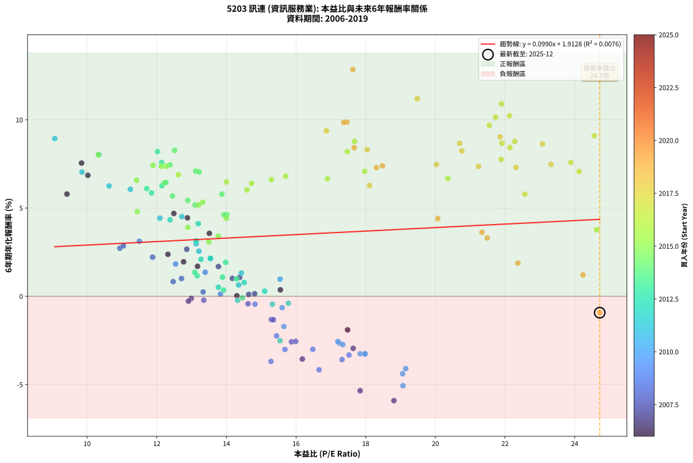
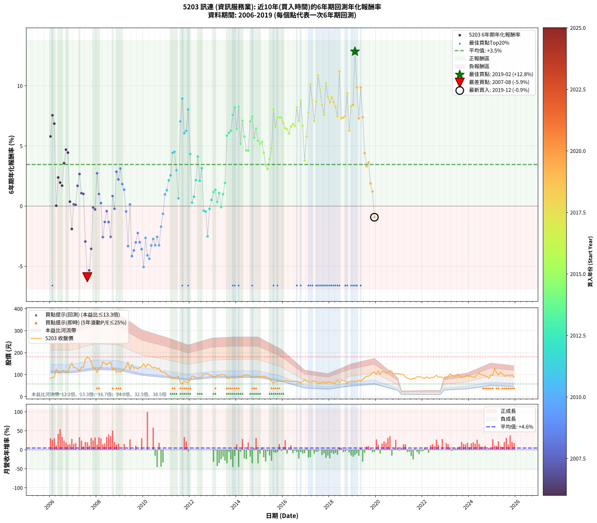

# 5203 訊連 - 本益比與未來報酬率分析

!!! info "報告資訊"
    - **股票代號**: 5203
    - **公司名稱**: 訊連
    - **產業別**: 資訊服務業
    - **分析期間**: 2006-2019 (168 個數據點)
    - **資料來源**: Type 12 (ShowMonthlyK_ChartFlow) 月收盤價與本益比
    - **報酬率口徑**: 含現金股利 (簡化: 年度合計，假設每年7/1入帳)
    - **報告生成時間**: 2026-01-04 08:50:34 CST

## 📈 視覺化圖表

### 圖表1: 本益比 vs 未來報酬率關係

*圖表1：5203 訊連 本益比與6年期未來報酬率關係 (2006-2019)*

### 圖表2: 歷年買入時點的6年期實際報酬率

*圖表2：5203 訊連 歷年買入時點的6年期實際報酬率 (2006-2019)*

## 📍 買點訊號說明

本報告提供兩種買點提示訊號（顯示於圖表2的股價子圖中）：

### ▲ 小綠色三角形（回測驗證）
- **計算方式**: 使用全部歷史資料計算本益比第25百分位數
- **用途**: 事後驗證，顯示歷史上哪些時點確實為低估區
- **限制**: 當下無法判斷，僅供回測參考
- **特性**: 後見之明（Look-Ahead Bias）

### ▲ 小橘色三角形（即時訊號）
- **計算方式**: 使用截至當月的過去5年資料計算本益比第25百分位數
- **用途**: 實際投資決策，當時即可判斷
- **優勢**: 可操作性強，符合實務需求
- **特性**: 無後見之明，滾動窗口計算

!!! tip "如何使用兩種訊號"
    - **綠色▲** 幫助理解歷史估值機會，驗證策略有效性
    - **橘色▲** 可作為實際買進參考，但仍需搭配基本面分析
    - 兩種訊號重疊時，表示即時判斷與事後驗證一致，信心度較高
    - 僅有綠色▲時，表示當時無法判斷（需要未來資料才能確認）
    - 僅有橘色▲時，表示即時判斷為買點，但事後可能不是最佳時機

## 📊 估值分析摘要

| 指標 | 數值 |
|:---:|:---:|
| **目前本益比** (2019-12) | **24.72 倍** |
| **歷史平均本益比** | 15.62 倍 |
| **估值水準** | 🔴 相對高估 |
| **預期6年年化報酬率** | **+4.36%** |
| **歷史平均報酬率** | +3.46% |
| **相關係數 (R²)** | 0.0076 |
| **趨勢線斜率** | 0.0990 |

!!! abstract "核心洞察"
    目前本益比顯著高於歷史平均，預期未來報酬率可能較低

    根據歷史數據回測，5203 訊連 在目前本益比 **24.7倍** 的估值水準下，
    預期未來6年年化報酬率約為 **+4.4%**。

    **重要提醒**: 本分析基於歷史數據統計，實際報酬率會受到公司基本面變化、產業趨勢、
    總體經濟環境等多重因素影響。R² = 0.01 表示本益比可解釋約 0.8% 的報酬率變異。

## 📈 歷史估值統計

### 最佳買點 (最高報酬率)

| 項目 | 數值 |
|:---:|:---:|
| 起始時間 | 2019-02 |
| 當時本益比 | 17.63 倍 |
| 起始價格 | 70.3 元 |
| 6年後價格 | 129.5 元 |
| **6年年化報酬率** | **+12.85%** |

### 最差買點 (最低報酬率)

| 項目 | 數值 |
|:---:|:---:|
| 起始時間 | 2007-08 |
| 當時本益比 | 18.81 倍 |
| 起始價格 | 181.0 元 |
| 6年後價格 | 83.2 元 |
| **6年年化報酬率** | **-5.91%** |

## 🎯 投資啟示

### 本益比與報酬率關係

趨勢線方程式: **y = 0.0990x + 1.9128**

!!! info "弱相關或正相關"
    本益比與未來報酬率相關性較弱。這可能表示該股票的報酬率更多受到
    公司成長性、產業趨勢等因素影響，而非估值水準。**需綜合考量多項指標**。

### 估值區間建議

基於歷史數據分析:

- **🟢 低估區** (P/E < 12.5): 預期報酬率較高，可考慮增加持股
- **🟡 合理區** (P/E 12.5-18.7): 預期報酬率符合長期趨勢，正常持有
- **🔴 高估區** (P/E > 18.7): 預期報酬率較低，可考慮減碼或觀望

!!! danger "風險提示"
    - 過去表現不代表未來結果
    - 本分析假設公司基本面無重大結構性變化
    - 產業環境劇變可能使歷史規律失效
    - 應結合公司財報、產業趨勢、總體經濟等多重因素綜合判斷

!!! success "長期投資觀點"
    歷史數據顯示，在合理或低估的估值水準買入並長期持有，
    往往能獲得較佳的投資報酬。**耐心等待好價格**是價值投資的核心原則。

## 📊 數據品質

- **資料來源**: GoodInfo.tw Type 12 (ShowMonthlyK_ChartFlow)
- **資料頻率**: 月度收盤價與本益比
- **回測期間**: 2006-2019
- **數據點數量**: 168 個 (每個點代表一次6年期回測)

### 計算方法說明

1. **6年期年化報酬率**:
   - 對每個歷史時點，計算其後6年的實際投資報酬率
   - 期末價值(不含股利): 期末價格
   - 期末價值(含現金股利): 期末價格 + 持有期間內的現金股利合計 (簡化: 年度合計，假設每年7/1入帳)
   - 公式: 年化報酬率 = [(期末價值/期初價格)^(1/年數) - 1] × 100%

2. **本益比 (P/E Ratio)**:
   - 使用當時的月收盤價與EPS計算
   - 資料來源: Type 12 月度河流圖本益比數據

3. **趨勢線 (Linear Regression)**:
   - 使用最小平方法擬合線性趨勢線
   - R²值衡量本益比對報酬率的解釋能力

---

*本報告由 Stock Analysis System v1.9.0 自動生成*
*數據更新時間: 2026-01-04 08:50:34 CST*

## 📋 月度回測明細表

（每一列對應時間線圖中的一個買入點；可用來對照 SVG 圖上的每個點。）

| 買入月份 | 賣出月份 | 回測期限_年 | 實際持有年數 | 買入本益比_倍 | 買入收盤價_元 | 賣出收盤價_元 | 現金股利合計_元 | 總報酬率_pct | 年化報酬率_pct |
| --- | --- | --- | --- | --- | --- | --- | --- | --- | --- |
| 2006-01 | 2012-01 | 6 | 5.999 | 9.42 | 83.00 | 76.50 | 39.84 | +40.17 | +5.79 |
| 2006-02 | 2012-02 | 6 | 5.999 | 9.84 | 86.70 | 94.30 | 39.84 | +54.72 | +7.55 |
| 2006-03 | 2012-03 | 6 | 6.001 | 10.02 | 88.30 | 91.60 | 39.84 | +48.86 | +6.85 |
| 2006-04 | 2012-04 | 6 | 6.001 | 14.30 | 126.00 | 86.40 | 39.84 | +0.19 | +0.03 |
| 2006-05 | 2012-05 | 6 | 6.001 | 12.32 | 108.50 | 85.10 | 39.84 | +15.15 | +2.38 |
| 2006-06 | 2012-06 | 6 | 6.001 | 12.77 | 112.50 | 86.50 | 39.84 | +12.30 | +1.95 |
| 2006-07 | 2012-07 | 6 | 6.001 | 13.17 | 116.00 | 86.50 | 41.85 | +10.65 | +1.70 |
| 2006-08 | 2012-08 | 6 | 6.001 | 13.51 | 119.00 | 105.00 | 41.85 | +23.40 | +3.57 |
| 2006-09 | 2012-09 | 6 | 6.001 | 12.49 | 110.00 | 103.00 | 41.85 | +31.68 | +4.69 |
| 2006-10 | 2012-10 | 6 | 6.001 | 12.88 | 113.50 | 105.50 | 41.85 | +29.82 | +4.45 |
| 2006-11 | 2012-11 | 6 | 6.001 | 15.55 | 137.00 | 98.20 | 41.85 | +2.23 | +0.37 |
| 2006-12 | 2012-12 | 6 | 6.001 | 17.48 | 154.00 | 95.40 | 41.85 | -10.88 | -1.90 |
| 2007-01 | 2013-01 | 6 | 6.001 | 14.81 | 132.00 | 91.30 | 41.85 | +0.87 | +0.14 |
| 2007-02 | 2013-02 | 6 | 6.001 | 14.64 | 132.00 | 91.00 | 41.85 | +0.64 | +0.11 |
| 2007-03 | 2013-03 | 6 | 6.001 | 13.77 | 125.50 | 96.90 | 41.85 | +10.56 | +1.69 |
| 2007-04 | 2013-04 | 6 | 6.001 | 12.86 | 118.50 | 96.90 | 41.85 | +17.09 | +2.66 |
| 2007-05 | 2013-05 | 6 | 6.001 | 14.38 | 134.00 | 101.00 | 41.85 | +6.60 | +1.07 |
| 2007-06 | 2013-06 | 6 | 6.001 | 14.17 | 133.50 | 100.00 | 41.85 | +6.25 | +1.02 |
| 2007-07 | 2013-07 | 6 | 6.001 | 17.64 | 168.00 | 98.00 | 42.37 | -16.45 | -2.95 |
| 2007-08 | 2013-08 | 6 | 6.001 | 18.81 | 181.00 | 83.20 | 42.37 | -30.63 | -5.91 |
| 2007-09 | 2013-09 | 6 | 6.001 | 17.84 | 173.50 | 82.40 | 42.37 | -28.09 | -5.35 |
| 2007-10 | 2013-10 | 6 | 6.001 | 16.18 | 159.00 | 85.60 | 42.37 | -19.52 | -3.55 |
| 2007-11 | 2013-11 | 6 | 6.001 | 12.99 | 129.00 | 85.70 | 42.37 | -0.72 | -0.12 |
| 2007-12 | 2013-12 | 6 | 6.001 | 12.91 | 129.50 | 85.00 | 42.37 | -1.65 | -0.28 |
| 2008-01 | 2014-01 | 6 | 6.001 | 10.94 | 109.50 | 86.30 | 42.37 | +17.51 | +2.72 |
| 2008-02 | 2014-03 | 6 | 6.081 | 12.71 | 127.00 | 92.60 | 42.37 | +6.27 | +1.01 |
| 2008-03 | 2014-03 | 6 | 5.999 | 13.33 | 133.00 | 92.60 | 42.37 | +1.48 | +0.25 |
| 2008-04 | 2014-04 | 6 | 5.999 | 15.87 | 158.00 | 92.70 | 42.37 | -14.51 | -2.58 |
| 2008-05 | 2014-05 | 6 | 5.999 | 15.29 | 152.00 | 98.00 | 42.37 | -7.65 | -1.32 |
| 2008-06 | 2014-06 | 6 | 5.999 | 14.62 | 145.00 | 99.00 | 42.37 | -2.50 | -0.42 |
| 2008-07 | 2014-07 | 6 | 5.999 | 15.35 | 152.00 | 98.40 | 41.88 | -7.71 | -1.33 |
| 2008-08 | 2014-08 | 6 | 5.999 | 15.99 | 158.00 | 93.40 | 41.88 | -14.38 | -2.56 |
| 2008-09 | 2014-09 | 6 | 5.999 | 12.47 | 123.00 | 87.40 | 41.88 | +5.10 | +0.83 |
| 2008-10 | 2014-10 | 6 | 5.999 | 13.35 | 131.50 | 87.90 | 41.88 | -1.31 | -0.22 |
| 2008-11 | 2014-11 | 6 | 5.999 | 11.04 | 108.50 | 86.60 | 41.88 | +18.41 | +2.86 |
| 2008-12 | 2014-12 | 6 | 5.999 | 11.88 | 116.50 | 91.00 | 41.88 | +14.06 | +2.22 |
| 2009-01 | 2015-01 | 6 | 5.999 | 11.50 | 111.00 | 91.60 | 41.88 | +20.25 | +3.12 |
| 2009-02 | 2015-02 | 6 | 5.999 | 12.54 | 119.00 | 90.80 | 41.88 | +11.49 | +1.83 |
| 2009-03 | 2015-03 | 6 | 5.999 | 13.39 | 125.00 | 93.70 | 41.88 | +8.46 | +1.36 |
| 2009-04 | 2015-04 | 6 | 5.999 | 14.82 | 136.00 | 90.50 | 41.88 | -2.66 | -0.45 |
| 2009-05 | 2015-05 | 6 | 5.999 | 17.52 | 158.00 | 87.10 | 41.88 | -18.37 | -3.33 |
| 2009-06 | 2015-06 | 6 | 5.999 | 13.83 | 122.50 | 81.60 | 41.88 | +0.80 | +0.13 |
| 2009-07 | 2015-07 | 6 | 5.999 | 16.66 | 145.00 | 71.00 | 41.37 | -22.51 | -4.16 |
| 2009-08 | 2015-08 | 6 | 5.999 | 15.28 | 130.50 | 62.80 | 41.37 | -20.18 | -3.69 |
| 2009-09 | 2015-09 | 6 | 5.999 | 15.68 | 131.50 | 68.10 | 41.37 | -16.76 | -3.01 |
| 2009-10 | 2015-10 | 6 | 5.999 | 15.44 | 127.00 | 69.50 | 41.37 | -12.70 | -2.24 |
| 2009-11 | 2015-11 | 6 | 5.999 | 16.48 | 133.00 | 69.40 | 41.37 | -16.72 | -3.00 |
| 2009-12 | 2015-12 | 6 | 5.999 | 17.32 | 137.00 | 68.70 | 41.37 | -19.66 | -3.58 |
| 2010-01 | 2016-01 | 6 | 5.999 | 19.07 | 149.50 | 68.10 | 41.37 | -26.78 | -5.06 |
| 2010-02 | 2016-02 | 6 | 5.999 | 17.24 | 134.00 | 72.70 | 41.37 | -14.88 | -2.65 |
| 2010-03 | 2016-03 | 6 | 6.001 | 19.15 | 147.50 | 73.40 | 41.37 | -22.19 | -4.09 |
| 2010-04 | 2016-04 | 6 | 6.001 | 19.06 | 145.50 | 69.80 | 41.37 | -23.60 | -4.39 |
| 2010-05 | 2016-05 | 6 | 6.001 | 17.98 | 136.00 | 70.00 | 41.37 | -18.11 | -3.27 |
| 2010-06 | 2016-06 | 6 | 6.001 | 17.34 | 130.00 | 68.70 | 41.37 | -15.33 | -2.74 |
| 2010-07 | 2016-07 | 6 | 6.001 | 17.98 | 133.50 | 70.50 | 38.97 | -18.00 | -3.25 |
| 2010-08 | 2016-08 | 6 | 6.001 | 17.20 | 126.50 | 69.30 | 38.97 | -14.41 | -2.56 |
| 2010-09 | 2016-09 | 6 | 6.001 | 17.84 | 130.00 | 67.60 | 38.97 | -18.03 | -3.26 |
| 2010-10 | 2016-10 | 6 | 6.001 | 15.65 | 113.00 | 62.90 | 38.97 | -9.85 | -1.71 |
| 2010-11 | 2016-11 | 6 | 6.001 | 15.60 | 111.50 | 68.30 | 38.97 | -3.80 | -0.64 |
| 2010-12 | 2016-12 | 6 | 6.001 | 15.54 | 110.00 | 77.60 | 38.97 | +5.97 | +0.97 |
| 2011-01 | 2017-01 | 6 | 6.001 | 14.43 | 101.00 | 70.30 | 38.97 | +8.18 | +1.32 |
| 2011-02 | 2017-02 | 6 | 6.001 | 13.54 | 93.70 | 67.40 | 38.97 | +13.52 | +2.14 |
| 2011-03 | 2017-03 | 6 | 6.001 | 13.21 | 90.30 | 66.10 | 38.97 | +16.35 | +2.56 |
| 2011-04 | 2017-04 | 6 | 6.001 | 12.09 | 81.70 | 67.00 | 38.97 | +29.70 | +4.43 |
| 2011-05 | 2017-05 | 6 | 6.001 | 12.72 | 84.90 | 71.70 | 38.97 | +30.35 | +4.52 |
| 2011-06 | 2017-06 | 6 | 6.001 | 13.13 | 86.60 | 64.30 | 38.97 | +19.24 | +2.98 |
| 2011-07 | 2017-07 | 6 | 6.001 | 14.35 | 93.50 | 63.50 | 33.67 | +3.93 | +0.64 |
| 2011-08 | 2017-08 | 6 | 6.001 | 9.85 | 63.40 | 61.70 | 33.67 | +50.43 | +7.04 |
| 2011-09 | 2017-09 | 6 | 6.001 | 9.07 | 57.60 | 62.60 | 33.67 | +67.14 | +8.94 |
| 2011-10 | 2017-10 | 6 | 6.001 | 11.24 | 70.50 | 66.70 | 33.67 | +42.38 | +6.06 |
| 2011-11 | 2017-11 | 6 | 6.001 | 10.63 | 65.80 | 61.00 | 33.67 | +43.88 | +6.25 |
| 2011-12 | 2017-12 | 6 | 6.001 | 10.34 | 63.20 | 66.80 | 33.67 | +58.98 | +8.03 |
| 2012-01 | 2018-01 | 6 | 6.001 | 12.38 | 76.50 | 65.00 | 33.67 | +28.99 | +4.33 |
| 2012-02 | 2018-03 | 6 | 6.081 | 15.10 | 94.30 | 62.30 | 33.67 | +1.78 | +0.29 |
| 2012-03 | 2018-03 | 6 | 5.999 | 14.51 | 91.60 | 62.30 | 33.67 | +4.78 | +0.78 |
| 2012-04 | 2018-04 | 6 | 5.999 | 13.54 | 86.40 | 64.50 | 33.67 | +13.63 | +2.15 |
| 2012-05 | 2018-05 | 6 | 5.999 | 13.19 | 85.10 | 74.70 | 33.67 | +27.35 | +4.11 |
| 2012-06 | 2018-06 | 6 | 5.999 | 13.27 | 86.50 | 64.30 | 33.67 | +13.27 | +2.10 |
| 2012-07 | 2018-07 | 6 | 5.999 | 13.13 | 86.50 | 75.80 | 28.37 | +20.42 | +3.15 |
| 2012-08 | 2018-08 | 6 | 5.999 | 15.78 | 105.00 | 74.20 | 28.37 | -2.32 | -0.39 |
| 2012-09 | 2018-09 | 6 | 5.999 | 15.32 | 103.00 | 71.90 | 28.37 | -2.65 | -0.45 |
| 2012-10 | 2018-10 | 6 | 5.999 | 15.54 | 105.50 | 62.20 | 28.37 | -14.16 | -2.51 |
| 2012-11 | 2018-11 | 6 | 5.999 | 14.32 | 98.20 | 68.50 | 28.37 | -1.36 | -0.23 |
| 2012-12 | 2018-12 | 6 | 5.999 | 13.77 | 95.40 | 70.00 | 28.37 | +3.11 | +0.51 |
| 2013-01 | 2019-01 | 6 | 5.999 | 13.16 | 91.30 | 69.50 | 28.37 | +7.19 | +1.16 |
| 2013-02 | 2019-02 | 6 | 5.999 | 13.09 | 91.00 | 70.30 | 28.37 | +8.42 | +1.36 |
| 2013-03 | 2019-03 | 6 | 5.999 | 13.92 | 96.90 | 70.60 | 28.37 | +2.13 | +0.35 |
| 2013-04 | 2019-04 | 6 | 5.999 | 13.89 | 96.90 | 75.00 | 28.37 | +6.67 | +1.08 |
| 2013-05 | 2019-05 | 6 | 5.999 | 14.46 | 101.00 | 72.10 | 28.37 | -0.53 | -0.09 |
| 2013-06 | 2019-06 | 6 | 5.999 | 14.29 | 100.00 | 77.70 | 28.37 | +6.07 | +0.99 |
| 2013-07 | 2019-07 | 6 | 5.999 | 13.98 | 98.00 | 85.50 | 24.36 | +12.10 | +1.92 |
| 2013-08 | 2019-08 | 6 | 5.999 | 11.85 | 83.20 | 92.70 | 24.36 | +40.69 | +5.86 |
| 2013-09 | 2019-09 | 6 | 5.999 | 11.71 | 82.40 | 93.20 | 24.36 | +42.67 | +6.10 |
| 2013-10 | 2019-10 | 6 | 5.999 | 12.15 | 85.60 | 98.90 | 24.36 | +43.99 | +6.27 |
| 2013-11 | 2019-11 | 6 | 5.999 | 12.14 | 85.70 | 108.50 | 24.36 | +55.02 | +7.58 |
| 2013-12 | 2019-12 | 6 | 5.999 | 12.02 | 85.00 | 112.00 | 24.36 | +60.42 | +8.20 |
| 2014-01 | 2020-01 | 6 | 5.999 | 12.21 | 86.30 | 101.00 | 24.36 | +45.26 | +6.42 |
| 2014-02 | 2020-02 | 6 | 5.999 | 12.51 | 88.40 | 118.00 | 24.36 | +61.04 | +8.27 |
| 2014-03 | 2020-03 | 6 | 6.001 | 13.10 | 92.60 | 101.00 | 24.36 | +35.37 | +5.18 |
| 2014-04 | 2020-04 | 6 | 6.001 | 13.12 | 92.70 | 115.50 | 24.36 | +50.87 | +7.09 |
| 2014-05 | 2020-05 | 6 | 6.001 | 13.87 | 98.00 | 113.00 | 24.36 | +40.16 | +5.79 |
| 2014-06 | 2020-06 | 6 | 6.001 | 14.01 | 99.00 | 105.50 | 24.36 | +31.17 | +4.62 |
| 2014-07 | 2020-07 | 6 | 6.001 | 13.93 | 98.40 | 108.00 | 20.99 | +31.09 | +4.61 |
| 2014-08 | 2020-08 | 6 | 6.001 | 13.22 | 93.40 | 119.50 | 20.99 | +50.42 | +7.04 |
| 2014-09 | 2020-09 | 6 | 6.001 | 12.38 | 87.40 | 113.50 | 20.99 | +53.88 | +7.45 |
| 2014-10 | 2020-10 | 6 | 6.001 | 12.45 | 87.90 | 101.50 | 20.99 | +39.36 | +5.69 |
| 2014-11 | 2020-11 | 6 | 6.001 | 12.26 | 86.60 | 105.00 | 20.99 | +45.49 | +6.45 |
| 2014-12 | 2020-12 | 6 | 6.001 | 12.89 | 91.00 | 104.00 | 20.99 | +37.36 | +5.43 |
| 2015-01 | 2021-01 | 6 | 6.001 | 13.20 | 91.60 | 103.00 | 20.99 | +35.37 | +5.18 |
| 2015-02 | 2021-02 | 6 | 6.001 | 13.32 | 90.80 | 103.00 | 20.99 | +36.56 | +5.33 |
| 2015-03 | 2021-03 | 6 | 6.001 | 14.00 | 93.70 | 100.50 | 20.99 | +29.66 | +4.42 |
| 2015-04 | 2021-04 | 6 | 6.001 | 13.77 | 90.50 | 89.70 | 20.99 | +22.31 | +3.41 |
| 2015-05 | 2021-05 | 6 | 6.001 | 13.50 | 87.10 | 83.50 | 20.99 | +19.97 | +3.08 |
| 2015-06 | 2021-06 | 6 | 6.001 | 12.89 | 81.60 | 81.70 | 20.99 | +25.85 | +3.91 |
| 2015-07 | 2021-07 | 6 | 6.001 | 11.44 | 71.00 | 77.80 | 16.28 | +32.50 | +4.80 |
| 2015-08 | 2021-08 | 6 | 6.001 | 10.32 | 62.80 | 83.50 | 16.28 | +58.88 | +8.02 |
| 2015-09 | 2021-09 | 6 | 6.001 | 11.42 | 68.10 | 83.50 | 16.28 | +46.52 | +6.57 |
| 2015-10 | 2021-10 | 6 | 6.001 | 11.89 | 69.50 | 90.50 | 16.28 | +53.64 | +7.42 |
| 2015-11 | 2021-11 | 6 | 6.001 | 12.13 | 69.40 | 90.00 | 16.28 | +53.14 | +7.36 |
| 2015-12 | 2021-12 | 6 | 6.001 | 12.27 | 68.70 | 89.00 | 16.28 | +53.24 | +7.37 |
| 2016-01 | 2022-01 | 6 | 6.001 | 12.62 | 68.10 | 85.30 | 16.28 | +49.16 | +6.89 |
| 2016-02 | 2022-03 | 6 | 6.081 | 14.00 | 72.70 | 90.20 | 16.28 | +46.46 | +6.48 |
| 2016-03 | 2022-03 | 6 | 5.999 | 14.72 | 73.40 | 90.20 | 16.28 | +45.07 | +6.40 |
| 2016-04 | 2022-04 | 6 | 5.999 | 14.59 | 69.80 | 82.90 | 16.28 | +42.09 | +6.03 |
| 2016-05 | 2022-05 | 6 | 5.999 | 15.29 | 70.00 | 86.50 | 16.28 | +46.83 | +6.61 |
| 2016-06 | 2022-06 | 6 | 5.999 | 15.70 | 68.70 | 85.70 | 16.28 | +48.44 | +6.81 |
| 2016-07 | 2022-07 | 6 | 5.999 | 16.90 | 70.50 | 89.80 | 14.00 | +47.23 | +6.66 |
| 2016-08 | 2022-08 | 6 | 5.999 | 17.47 | 69.30 | 97.20 | 14.00 | +60.45 | +8.20 |
| 2016-09 | 2022-09 | 6 | 5.999 | 17.97 | 67.60 | 87.90 | 14.00 | +50.73 | +7.08 |
| 2016-10 | 2022-10 | 6 | 5.999 | 17.68 | 62.90 | 90.20 | 14.00 | +65.65 | +8.78 |
| 2016-11 | 2022-11 | 6 | 5.999 | 20.36 | 68.30 | 86.60 | 14.00 | +47.28 | +6.67 |
| 2016-12 | 2022-12 | 6 | 5.999 | 24.63 | 77.60 | 82.90 | 14.00 | +24.86 | +3.77 |
| 2017-01 | 2023-01 | 6 | 5.999 | 22.57 | 70.30 | 84.50 | 14.00 | +40.11 | +5.78 |
| 2017-02 | 2023-02 | 6 | 5.999 | 21.89 | 67.40 | 91.50 | 14.00 | +56.52 | +7.75 |
| 2017-03 | 2023-03 | 6 | 5.999 | 21.73 | 66.10 | 104.00 | 14.00 | +78.51 | +10.14 |
| 2017-04 | 2023-04 | 6 | 5.999 | 22.28 | 67.00 | 97.00 | 14.00 | +65.66 | +8.78 |
| 2017-05 | 2023-05 | 6 | 5.999 | 24.13 | 71.70 | 94.00 | 14.00 | +50.62 | +7.07 |
| 2017-06 | 2023-06 | 6 | 5.999 | 21.91 | 64.30 | 91.90 | 14.00 | +64.69 | +8.67 |
| 2017-07 | 2023-07 | 6 | 5.999 | 21.90 | 63.50 | 103.50 | 14.59 | +85.98 | +10.90 |
| 2017-08 | 2023-08 | 6 | 5.999 | 21.55 | 61.70 | 92.80 | 14.59 | +74.06 | +9.68 |
| 2017-09 | 2023-09 | 6 | 5.999 | 22.14 | 62.60 | 87.10 | 14.59 | +62.45 | +8.42 |
| 2017-10 | 2023-10 | 6 | 5.999 | 23.89 | 66.70 | 88.80 | 14.59 | +55.01 | +7.58 |
| 2017-11 | 2023-11 | 6 | 5.999 | 22.13 | 61.00 | 94.80 | 14.59 | +79.34 | +10.23 |
| 2017-12 | 2023-12 | 6 | 5.999 | 24.56 | 66.80 | 98.00 | 14.59 | +68.56 | +9.09 |
| 2018-01 | 2024-01 | 6 | 5.999 | 23.08 | 65.00 | 92.20 | 14.59 | +64.30 | +8.63 |
| 2018-02 | 2024-02 | 6 | 5.999 | 21.86 | 63.70 | 92.40 | 14.59 | +67.97 | +9.03 |
| 2018-03 | 2024-03 | 6 | 6.001 | 20.70 | 62.30 | 88.00 | 14.59 | +64.68 | +8.67 |
| 2018-04 | 2024-04 | 6 | 6.001 | 20.76 | 64.50 | 89.10 | 14.59 | +60.77 | +8.23 |
| 2018-05 | 2024-05 | 6 | 6.001 | 23.32 | 74.70 | 100.50 | 14.59 | +54.08 | +7.47 |
| 2018-06 | 2024-06 | 6 | 6.001 | 19.48 | 64.30 | 107.00 | 14.59 | +89.11 | +11.20 |
| 2018-07 | 2024-07 | 6 | 6.001 | 22.32 | 75.80 | 100.00 | 15.70 | +52.64 | +7.30 |
| 2018-08 | 2024-08 | 6 | 6.001 | 21.24 | 74.20 | 97.90 | 15.70 | +53.11 | +7.36 |
| 2018-09 | 2024-09 | 6 | 6.001 | 20.03 | 71.90 | 95.10 | 15.70 | +54.11 | +7.47 |
| 2018-10 | 2024-10 | 6 | 6.001 | 16.87 | 62.20 | 90.80 | 15.70 | +71.23 | +9.38 |
| 2018-11 | 2024-11 | 6 | 6.001 | 18.11 | 68.50 | 83.00 | 15.70 | +44.09 | +6.28 |
| 2018-12 | 2024-12 | 6 | 6.001 | 18.04 | 70.00 | 97.30 | 15.70 | +61.43 | +8.31 |
| 2019-01 | 2025-01 | 6 | 6.001 | 17.67 | 69.50 | 97.20 | 15.70 | +62.45 | +8.42 |
| 2019-02 | 2025-02 | 6 | 6.001 | 17.63 | 70.30 | 129.50 | 15.70 | +106.55 | +12.85 |
| 2019-03 | 2025-03 | 6 | 6.001 | 17.46 | 70.60 | 108.50 | 15.70 | +75.93 | +9.87 |
| 2019-04 | 2025-04 | 6 | 6.001 | 18.31 | 75.00 | 98.70 | 15.70 | +52.54 | +7.29 |
| 2019-05 | 2025-05 | 6 | 6.001 | 17.37 | 72.10 | 111.00 | 15.70 | +75.73 | +9.85 |
| 2019-06 | 2025-06 | 6 | 6.001 | 18.48 | 77.70 | 103.50 | 15.70 | +53.42 | +7.39 |
| 2019-07 | 2025-07 | 6 | 6.001 | 20.07 | 85.50 | 94.10 | 16.61 | +29.49 | +4.40 |
| 2019-08 | 2025-08 | 6 | 6.001 | 21.49 | 92.70 | 96.10 | 16.61 | +21.59 | +3.31 |
| 2019-09 | 2025-09 | 6 | 6.001 | 21.34 | 93.20 | 98.80 | 16.61 | +23.83 | +3.63 |
| 2019-10 | 2025-10 | 6 | 6.001 | 22.37 | 98.90 | 94.00 | 16.61 | +11.84 | +1.88 |
| 2019-11 | 2025-11 | 6 | 6.001 | 24.24 | 108.50 | 100.00 | 16.61 | +7.48 | +1.21 |
| 2019-12 | 2025-12 | 6 | 6.001 | 24.72 | 112.00 | 89.30 | 16.61 | -5.43 | -0.93 |
