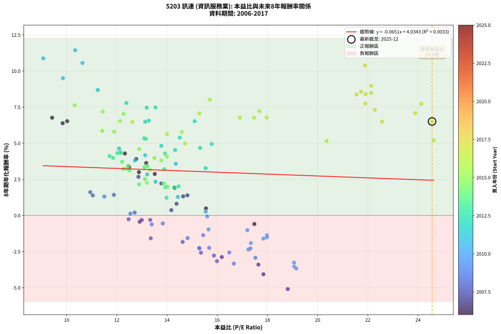

# 5203 訊連 - 本益比與未來報酬率分析

!!! info "報告資訊"
    - **股票代號**: 5203
    - **公司名稱**: 訊連
    - **產業別**: 資訊服務業
    - **分析期間**: 2006-2017 (144 個數據點)
    - **資料來源**: Type 12 (ShowMonthlyK_ChartFlow) 月收盤價與本益比
    - **報酬率口徑**: 含現金股利 (簡化: 年度合計，假設每年7/1入帳)
    - **報告生成時間**: 2026-01-05 01:01:49 CST

## 📈 視覺化圖表

### 圖表1: 本益比 vs 未來報酬率關係

*圖表1：5203 訊連 本益比與8年期未來報酬率關係 (2006-2017)*

### 圖表2: 歷年買入時點的8年期實際報酬率

*圖表2：5203 訊連 歷年買入時點的8年期實際報酬率 (2006-2017)*

## 📍 買點訊號說明

本報告提供兩種買點提示訊號（顯示於圖表2的股價子圖中）：

### ▲ 小綠色三角形（回測驗證）
- **計算方式**: 使用全部歷史資料計算本益比第25百分位數
- **用途**: 事後驗證，顯示歷史上哪些時點確實為低估區
- **限制**: 當下無法判斷，僅供回測參考
- **特性**: 後見之明（Look-Ahead Bias）

### ▲ 小橘色三角形（即時訊號）
- **計算方式**: 使用截至當月的過去5年資料計算本益比第25百分位數
- **用途**: 實際投資決策，當時即可判斷
- **優勢**: 可操作性強，符合實務需求
- **特性**: 無後見之明，滾動窗口計算

!!! tip "如何使用兩種訊號"
    - **綠色▲** 幫助理解歷史估值機會，驗證策略有效性
    - **橘色▲** 可作為實際買進參考，但仍需搭配基本面分析
    - 兩種訊號重疊時，表示即時判斷與事後驗證一致，信心度較高
    - 僅有綠色▲時，表示當時無法判斷（需要未來資料才能確認）
    - 僅有橘色▲時，表示即時判斷為買點，但事後可能不是最佳時機

## 📊 估值分析摘要

| 指標 | 數值 |
|:---:|:---:|
| **目前本益比** (2017-12) | **24.56 倍** |
| **歷史平均本益比** | 14.84 倍 |
| **估值水準** | 🔴 相對高估 |
| **預期8年年化報酬率** | **+2.44%** |
| **歷史平均報酬率** | +3.07% |
| **相關係數 (R²)** | 0.0033 |
| **趨勢線斜率** | -0.0651 |

!!! abstract "核心洞察"
    目前本益比顯著高於歷史平均，預期未來報酬率可能較低

    根據歷史數據回測，5203 訊連 在目前本益比 **24.6倍** 的估值水準下，
    預期未來8年年化報酬率約為 **+2.4%**。

    **重要提醒**: 本分析基於歷史數據統計，實際報酬率會受到公司基本面變化、產業趨勢、
    總體經濟環境等多重因素影響。R² = 0.00 表示本益比可解釋約 0.3% 的報酬率變異。

## 📈 歷史估值統計

### 最佳買點 (最高報酬率)

| 項目 | 數值 |
|:---:|:---:|
| 起始時間 | 2011-12 |
| 當時本益比 | 10.34 倍 |
| 起始價格 | 63.2 元 |
| 8年後價格 | 112.0 元 |
| **8年年化報酬率** | **+11.44%** |

### 最差買點 (最低報酬率)

| 項目 | 數值 |
|:---:|:---:|
| 起始時間 | 2007-08 |
| 當時本益比 | 18.81 倍 |
| 起始價格 | 181.0 元 |
| 8年後價格 | 62.8 元 |
| **8年年化報酬率** | **-5.09%** |

## 🎯 投資啟示

### 本益比與報酬率關係

趨勢線方程式: **y = -0.0651x + 4.0343**

!!! note "負相關"
    本益比與未來報酬率呈現負相關。較低的本益比通常帶來較高的未來報酬率，
    但相關性不算非常強。**估值仍是重要參考指標之一**。

### 估值區間建議

基於歷史數據分析:

- **🟢 低估區** (P/E < 11.9): 預期報酬率較高，可考慮增加持股
- **🟡 合理區** (P/E 11.9-17.8): 預期報酬率符合長期趨勢，正常持有
- **🔴 高估區** (P/E > 17.8): 預期報酬率較低，可考慮減碼或觀望

!!! danger "風險提示"
    - 過去表現不代表未來結果
    - 本分析假設公司基本面無重大結構性變化
    - 產業環境劇變可能使歷史規律失效
    - 應結合公司財報、產業趨勢、總體經濟等多重因素綜合判斷

!!! success "長期投資觀點"
    歷史數據顯示，在合理或低估的估值水準買入並長期持有，
    往往能獲得較佳的投資報酬。**耐心等待好價格**是價值投資的核心原則。

## 📊 數據品質

- **資料來源**: GoodInfo.tw Type 12 (ShowMonthlyK_ChartFlow)
- **資料頻率**: 月度收盤價與本益比
- **回測期間**: 2006-2017
- **數據點數量**: 144 個 (每個點代表一次8年期回測)

### 計算方法說明

1. **8年期年化報酬率**:
   - 對每個歷史時點，計算其後8年的實際投資報酬率
   - 期末價值(不含股利): 期末價格
   - 期末價值(含現金股利): 期末價格 + 持有期間內的現金股利合計 (簡化: 年度合計，假設每年7/1入帳)
   - 公式: 年化報酬率 = [(期末價值/期初價格)^(1/年數) - 1] × 100%

2. **本益比 (P/E Ratio)**:
   - 使用當時的月收盤價與EPS計算
   - 資料來源: Type 12 月度河流圖本益比數據

3. **趨勢線 (Linear Regression)**:
   - 使用最小平方法擬合線性趨勢線
   - R²值衡量本益比對報酬率的解釋能力

---

*本報告由 Stock Analysis System v1.9.0 自動生成*
*數據更新時間: 2026-01-05 01:01:49 CST*

## 📋 月度回測明細表

（每一列對應時間線圖中的一個買入點；可用來對照 SVG 圖上的每個點。）

| 買入月份 | 賣出月份 | 回測期限_年 | 實際持有年數 | 買入本益比_倍 | 買入收盤價_元 | 賣出收盤價_元 | 現金股利合計_元 | 總報酬率_pct | 年化報酬率_pct |
| --- | --- | --- | --- | --- | --- | --- | --- | --- | --- |
| 2006-01 | 2014-01 | 8 | 8.000 | 9.42 | 83.00 | 86.30 | 53.84 | +68.85 | +6.77 |
| 2006-02 | 2014-02 | 8 | 8.000 | 9.84 | 86.70 | 88.40 | 53.84 | +64.06 | +6.38 |
| 2006-03 | 2014-03 | 8 | 8.000 | 10.02 | 88.30 | 92.60 | 53.84 | +65.85 | +6.53 |
| 2006-04 | 2014-04 | 8 | 8.000 | 14.30 | 126.00 | 92.70 | 53.84 | +16.30 | +1.91 |
| 2006-05 | 2014-05 | 8 | 8.000 | 12.32 | 108.50 | 98.00 | 53.84 | +39.95 | +4.29 |
| 2006-06 | 2014-06 | 8 | 8.000 | 12.77 | 112.50 | 99.00 | 53.84 | +35.86 | +3.90 |
| 2006-07 | 2014-07 | 8 | 8.000 | 13.17 | 116.00 | 98.40 | 55.85 | +32.97 | +3.63 |
| 2006-08 | 2014-08 | 8 | 8.000 | 13.51 | 119.00 | 93.40 | 55.85 | +25.42 | +2.87 |
| 2006-09 | 2014-09 | 8 | 8.000 | 12.49 | 110.00 | 87.40 | 55.85 | +30.23 | +3.36 |
| 2006-10 | 2014-10 | 8 | 8.000 | 12.88 | 113.50 | 87.90 | 55.85 | +26.65 | +3.00 |
| 2006-11 | 2014-11 | 8 | 8.000 | 15.55 | 137.00 | 86.60 | 55.85 | +3.98 | +0.49 |
| 2006-12 | 2014-12 | 8 | 8.000 | 17.48 | 154.00 | 91.00 | 55.85 | -4.64 | -0.59 |
| 2007-01 | 2015-01 | 8 | 8.000 | 14.81 | 132.00 | 91.60 | 55.85 | +11.70 | +1.39 |
| 2007-02 | 2015-02 | 8 | 8.000 | 14.64 | 132.00 | 90.80 | 55.85 | +11.10 | +1.32 |
| 2007-03 | 2015-03 | 8 | 8.000 | 13.77 | 125.50 | 93.70 | 55.85 | +19.16 | +2.22 |
| 2007-04 | 2015-04 | 8 | 8.000 | 12.86 | 118.50 | 90.50 | 55.85 | +23.50 | +2.67 |
| 2007-05 | 2015-05 | 8 | 8.000 | 14.38 | 134.00 | 87.10 | 55.85 | +6.68 | +0.81 |
| 2007-06 | 2015-06 | 8 | 8.000 | 14.17 | 133.50 | 81.60 | 55.85 | +2.96 | +0.37 |
| 2007-07 | 2015-07 | 8 | 8.000 | 17.64 | 168.00 | 71.00 | 56.35 | -24.20 | -3.40 |
| 2007-08 | 2015-08 | 8 | 8.000 | 18.81 | 181.00 | 62.80 | 56.35 | -34.17 | -5.09 |
| 2007-09 | 2015-09 | 8 | 8.000 | 17.84 | 173.50 | 68.10 | 56.35 | -28.27 | -4.07 |
| 2007-10 | 2015-10 | 8 | 8.000 | 16.18 | 159.00 | 69.50 | 56.35 | -20.85 | -2.88 |
| 2007-11 | 2015-11 | 8 | 8.000 | 12.99 | 129.00 | 69.40 | 56.35 | -2.52 | -0.32 |
| 2007-12 | 2015-12 | 8 | 8.000 | 12.91 | 129.50 | 68.70 | 56.35 | -3.44 | -0.44 |
| 2008-01 | 2016-01 | 8 | 8.000 | 10.94 | 109.50 | 68.10 | 56.35 | +13.65 | +1.61 |
| 2008-02 | 2016-02 | 8 | 8.000 | 12.71 | 127.00 | 72.70 | 56.35 | +1.61 | +0.20 |
| 2008-03 | 2016-03 | 8 | 8.000 | 13.33 | 133.00 | 73.40 | 56.35 | -2.45 | -0.31 |
| 2008-04 | 2016-04 | 8 | 8.000 | 15.87 | 158.00 | 69.80 | 56.35 | -20.16 | -2.78 |
| 2008-05 | 2016-05 | 8 | 8.000 | 15.29 | 152.00 | 70.00 | 56.35 | -16.88 | -2.28 |
| 2008-06 | 2016-06 | 8 | 8.000 | 14.62 | 145.00 | 68.70 | 56.35 | -13.76 | -1.83 |
| 2008-07 | 2016-07 | 8 | 8.000 | 15.35 | 152.00 | 70.50 | 52.85 | -18.85 | -2.58 |
| 2008-08 | 2016-08 | 8 | 8.000 | 15.99 | 158.00 | 69.30 | 52.85 | -22.69 | -3.17 |
| 2008-09 | 2016-09 | 8 | 8.000 | 12.47 | 123.00 | 67.60 | 52.85 | -2.07 | -0.26 |
| 2008-10 | 2016-10 | 8 | 8.000 | 13.35 | 131.50 | 62.90 | 52.85 | -11.97 | -1.58 |
| 2008-11 | 2016-11 | 8 | 8.000 | 11.04 | 108.50 | 68.30 | 52.85 | +11.66 | +1.39 |
| 2008-12 | 2016-12 | 8 | 8.000 | 11.88 | 116.50 | 77.60 | 52.85 | +11.98 | +1.42 |
| 2009-01 | 2017-01 | 8 | 8.000 | 11.50 | 111.00 | 70.30 | 52.85 | +10.95 | +1.31 |
| 2009-02 | 2017-02 | 8 | 8.000 | 12.54 | 119.00 | 67.40 | 52.85 | +1.05 | +0.13 |
| 2009-03 | 2017-03 | 8 | 8.000 | 13.39 | 125.00 | 66.10 | 52.85 | -4.84 | -0.62 |
| 2009-04 | 2017-04 | 8 | 8.000 | 14.82 | 136.00 | 67.00 | 52.85 | -11.87 | -1.57 |
| 2009-05 | 2017-05 | 8 | 8.000 | 17.52 | 158.00 | 71.70 | 52.85 | -21.17 | -2.93 |
| 2009-06 | 2017-06 | 8 | 8.000 | 13.83 | 122.50 | 64.30 | 52.85 | -4.36 | -0.56 |
| 2009-07 | 2017-07 | 8 | 8.000 | 16.66 | 145.00 | 63.50 | 47.06 | -23.75 | -3.33 |
| 2009-08 | 2017-08 | 8 | 8.000 | 15.28 | 130.50 | 61.70 | 47.06 | -16.66 | -2.25 |
| 2009-09 | 2017-09 | 8 | 8.000 | 15.68 | 131.50 | 62.60 | 47.06 | -16.61 | -2.24 |
| 2009-10 | 2017-10 | 8 | 8.000 | 15.44 | 127.00 | 66.70 | 47.06 | -10.42 | -1.37 |
| 2009-11 | 2017-11 | 8 | 8.000 | 16.48 | 133.00 | 61.00 | 47.06 | -18.75 | -2.56 |
| 2009-12 | 2017-12 | 8 | 8.000 | 17.32 | 137.00 | 66.80 | 47.06 | -16.89 | -2.29 |
| 2010-01 | 2018-01 | 8 | 8.000 | 19.07 | 149.50 | 65.00 | 47.06 | -25.04 | -3.54 |
| 2010-02 | 2018-02 | 8 | 8.000 | 17.24 | 134.00 | 63.70 | 47.06 | -17.34 | -2.35 |
| 2010-03 | 2018-03 | 8 | 8.000 | 19.15 | 147.50 | 62.30 | 47.06 | -25.85 | -3.67 |
| 2010-04 | 2018-04 | 8 | 8.000 | 19.06 | 145.50 | 64.50 | 47.06 | -23.32 | -3.27 |
| 2010-05 | 2018-05 | 8 | 8.000 | 17.98 | 136.00 | 74.70 | 47.06 | -10.47 | -1.37 |
| 2010-06 | 2018-06 | 8 | 8.000 | 17.34 | 130.00 | 64.30 | 47.06 | -14.34 | -1.92 |
| 2010-07 | 2018-07 | 8 | 8.000 | 17.98 | 133.50 | 75.80 | 42.36 | -11.49 | -1.51 |
| 2010-08 | 2018-08 | 8 | 8.000 | 17.20 | 126.50 | 74.20 | 42.36 | -7.86 | -1.02 |
| 2010-09 | 2018-09 | 8 | 8.000 | 17.84 | 130.00 | 71.90 | 42.36 | -12.11 | -1.60 |
| 2010-10 | 2018-10 | 8 | 8.000 | 15.65 | 113.00 | 62.20 | 42.36 | -7.47 | -0.97 |
| 2010-11 | 2018-11 | 8 | 8.000 | 15.60 | 111.50 | 68.50 | 42.36 | -0.58 | -0.07 |
| 2010-12 | 2018-12 | 8 | 8.000 | 15.54 | 110.00 | 70.00 | 42.36 | +2.14 | +0.27 |
| 2011-01 | 2019-01 | 8 | 8.000 | 14.43 | 101.00 | 69.50 | 42.36 | +10.75 | +1.28 |
| 2011-02 | 2019-02 | 8 | 8.000 | 13.54 | 93.70 | 70.30 | 42.36 | +20.23 | +2.33 |
| 2011-03 | 2019-03 | 8 | 8.000 | 13.21 | 90.30 | 70.60 | 42.36 | +25.09 | +2.84 |
| 2011-04 | 2019-04 | 8 | 8.000 | 12.09 | 81.70 | 75.00 | 42.36 | +43.64 | +4.63 |
| 2011-05 | 2019-05 | 8 | 8.000 | 12.72 | 84.90 | 72.10 | 42.36 | +34.81 | +3.80 |
| 2011-06 | 2019-06 | 8 | 8.000 | 13.13 | 86.60 | 77.70 | 42.36 | +38.63 | +4.17 |
| 2011-07 | 2019-07 | 8 | 8.000 | 14.35 | 93.50 | 85.50 | 38.36 | +32.47 | +3.58 |
| 2011-08 | 2019-08 | 8 | 8.000 | 9.85 | 63.40 | 92.70 | 38.36 | +106.71 | +9.50 |
| 2011-09 | 2019-09 | 8 | 8.000 | 9.07 | 57.60 | 93.20 | 38.36 | +128.40 | +10.88 |
| 2011-10 | 2019-10 | 8 | 8.000 | 11.24 | 70.50 | 98.90 | 38.36 | +94.69 | +8.68 |
| 2011-11 | 2019-11 | 8 | 8.000 | 10.63 | 65.80 | 108.50 | 38.36 | +123.19 | +10.56 |
| 2011-12 | 2019-12 | 8 | 8.000 | 10.34 | 63.20 | 112.00 | 38.36 | +137.91 | +11.44 |
| 2012-01 | 2020-01 | 8 | 8.000 | 12.38 | 76.50 | 101.00 | 38.36 | +82.16 | +7.78 |
| 2012-02 | 2020-02 | 8 | 8.000 | 15.10 | 94.30 | 118.00 | 38.36 | +65.81 | +6.52 |
| 2012-03 | 2020-03 | 8 | 8.000 | 14.51 | 91.60 | 101.00 | 38.36 | +52.14 | +5.38 |
| 2012-04 | 2020-04 | 8 | 8.000 | 13.54 | 86.40 | 115.50 | 38.36 | +78.07 | +7.48 |
| 2012-05 | 2020-05 | 8 | 8.000 | 13.19 | 85.10 | 113.00 | 38.36 | +77.86 | +7.46 |
| 2012-06 | 2020-06 | 8 | 8.000 | 13.27 | 86.50 | 105.50 | 38.36 | +66.31 | +6.56 |
| 2012-07 | 2020-07 | 8 | 8.000 | 13.13 | 86.50 | 108.00 | 34.99 | +65.31 | +6.48 |
| 2012-08 | 2020-08 | 8 | 8.000 | 15.78 | 105.00 | 119.50 | 34.99 | +47.14 | +4.95 |
| 2012-09 | 2020-09 | 8 | 8.000 | 15.32 | 103.00 | 113.50 | 34.99 | +44.17 | +4.68 |
| 2012-10 | 2020-10 | 8 | 8.000 | 15.54 | 105.50 | 101.50 | 34.99 | +29.38 | +3.27 |
| 2012-11 | 2020-11 | 8 | 8.000 | 14.32 | 98.20 | 105.00 | 34.99 | +42.56 | +4.53 |
| 2012-12 | 2020-12 | 8 | 8.000 | 13.77 | 95.40 | 104.00 | 34.99 | +45.70 | +4.82 |
| 2013-01 | 2021-01 | 8 | 8.000 | 13.16 | 91.30 | 103.00 | 34.99 | +51.14 | +5.30 |
| 2013-02 | 2021-02 | 8 | 8.000 | 13.09 | 91.00 | 103.00 | 34.99 | +51.64 | +5.34 |
| 2013-03 | 2021-03 | 8 | 8.000 | 13.92 | 96.90 | 100.50 | 34.99 | +39.83 | +4.28 |
| 2013-04 | 2021-04 | 8 | 8.000 | 13.89 | 96.90 | 89.70 | 34.99 | +28.68 | +3.20 |
| 2013-05 | 2021-05 | 8 | 8.000 | 14.46 | 101.00 | 83.50 | 34.99 | +17.32 | +2.02 |
| 2013-06 | 2021-06 | 8 | 8.000 | 14.29 | 100.00 | 81.70 | 34.99 | +16.69 | +1.95 |
| 2013-07 | 2021-07 | 8 | 8.000 | 13.98 | 98.00 | 77.80 | 30.26 | +10.26 | +1.23 |
| 2013-08 | 2021-08 | 8 | 8.000 | 11.85 | 83.20 | 83.50 | 30.26 | +36.73 | +3.99 |
| 2013-09 | 2021-09 | 8 | 8.000 | 11.71 | 82.40 | 83.50 | 30.26 | +38.05 | +4.11 |
| 2013-10 | 2021-10 | 8 | 8.000 | 12.15 | 85.60 | 90.50 | 30.26 | +41.07 | +4.39 |
| 2013-11 | 2021-11 | 8 | 8.000 | 12.14 | 85.70 | 90.00 | 30.26 | +40.32 | +4.33 |
| 2013-12 | 2021-12 | 8 | 8.000 | 12.02 | 85.00 | 89.00 | 30.26 | +40.30 | +4.32 |
| 2014-01 | 2022-01 | 8 | 8.000 | 12.21 | 86.30 | 85.30 | 30.26 | +33.90 | +3.72 |
| 2014-02 | 2022-02 | 8 | 8.000 | 12.51 | 88.40 | 82.80 | 30.26 | +27.89 | +3.12 |
| 2014-03 | 2022-03 | 8 | 8.000 | 13.10 | 92.60 | 90.20 | 30.26 | +30.08 | +3.34 |
| 2014-04 | 2022-04 | 8 | 8.000 | 13.12 | 92.70 | 82.90 | 30.26 | +22.07 | +2.52 |
| 2014-05 | 2022-05 | 8 | 8.000 | 13.87 | 98.00 | 86.50 | 30.26 | +19.14 | +2.21 |
| 2014-06 | 2022-06 | 8 | 8.000 | 14.01 | 99.00 | 85.70 | 30.26 | +17.13 | +2.00 |
| 2014-07 | 2022-07 | 8 | 8.000 | 13.93 | 98.40 | 89.80 | 24.97 | +16.64 | +1.94 |
| 2014-08 | 2022-08 | 8 | 8.000 | 13.22 | 93.40 | 97.20 | 24.97 | +30.80 | +3.41 |
| 2014-09 | 2022-09 | 8 | 8.000 | 12.38 | 87.40 | 87.90 | 24.97 | +29.14 | +3.25 |
| 2014-10 | 2022-10 | 8 | 8.000 | 12.45 | 87.90 | 90.20 | 24.97 | +31.03 | +3.44 |
| 2014-11 | 2022-11 | 8 | 8.000 | 12.26 | 86.60 | 86.60 | 24.97 | +28.83 | +3.22 |
| 2014-12 | 2022-12 | 8 | 8.000 | 12.89 | 91.00 | 82.90 | 24.97 | +18.54 | +2.15 |
| 2015-01 | 2023-01 | 8 | 8.000 | 13.20 | 91.60 | 84.50 | 24.97 | +19.51 | +2.25 |
| 2015-02 | 2023-02 | 8 | 8.000 | 13.32 | 90.80 | 91.50 | 24.97 | +28.27 | +3.16 |
| 2015-03 | 2023-03 | 8 | 8.000 | 14.00 | 93.70 | 104.00 | 24.97 | +37.64 | +4.07 |
| 2015-04 | 2023-04 | 8 | 8.000 | 13.77 | 90.50 | 97.00 | 24.97 | +34.77 | +3.80 |
| 2015-05 | 2023-05 | 8 | 8.000 | 13.50 | 87.10 | 94.00 | 24.97 | +36.59 | +3.97 |
| 2015-06 | 2023-06 | 8 | 8.000 | 12.89 | 81.60 | 91.90 | 24.97 | +43.22 | +4.59 |
| 2015-07 | 2023-07 | 8 | 8.000 | 11.44 | 71.00 | 103.50 | 20.29 | +74.35 | +7.20 |
| 2015-08 | 2023-08 | 8 | 8.000 | 10.32 | 62.80 | 92.80 | 20.29 | +80.08 | +7.63 |
| 2015-09 | 2023-09 | 8 | 8.000 | 11.42 | 68.10 | 87.10 | 20.29 | +57.70 | +5.86 |
| 2015-10 | 2023-10 | 8 | 8.000 | 11.89 | 69.50 | 88.80 | 20.29 | +56.97 | +5.80 |
| 2015-11 | 2023-11 | 8 | 8.000 | 12.13 | 69.40 | 94.80 | 20.29 | +65.84 | +6.53 |
| 2015-12 | 2023-12 | 8 | 8.000 | 12.27 | 68.70 | 98.00 | 20.29 | +72.19 | +7.03 |
| 2016-01 | 2024-01 | 8 | 8.000 | 12.62 | 68.10 | 92.20 | 20.29 | +65.19 | +6.47 |
| 2016-02 | 2024-02 | 8 | 8.000 | 14.00 | 72.70 | 92.40 | 20.29 | +55.01 | +5.63 |
| 2016-03 | 2024-03 | 8 | 8.000 | 14.72 | 73.40 | 88.00 | 20.29 | +47.54 | +4.98 |
| 2016-04 | 2024-04 | 8 | 8.000 | 14.59 | 69.80 | 89.10 | 20.29 | +56.72 | +5.78 |
| 2016-05 | 2024-05 | 8 | 8.000 | 15.29 | 70.00 | 100.50 | 20.29 | +72.56 | +7.06 |
| 2016-06 | 2024-06 | 8 | 8.000 | 15.70 | 68.70 | 107.00 | 20.29 | +85.29 | +8.01 |
| 2016-07 | 2024-07 | 8 | 8.000 | 16.90 | 70.50 | 100.00 | 19.09 | +68.93 | +6.77 |
| 2016-08 | 2024-08 | 8 | 8.000 | 17.47 | 69.30 | 97.90 | 19.09 | +68.82 | +6.77 |
| 2016-09 | 2024-09 | 8 | 8.000 | 17.97 | 67.60 | 95.10 | 19.09 | +68.93 | +6.77 |
| 2016-10 | 2024-10 | 8 | 8.000 | 17.68 | 62.90 | 90.80 | 19.09 | +74.71 | +7.22 |
| 2016-11 | 2024-11 | 8 | 8.000 | 20.36 | 68.30 | 83.00 | 19.09 | +49.48 | +5.15 |
| 2016-12 | 2024-12 | 8 | 8.000 | 24.63 | 77.60 | 97.30 | 19.09 | +49.99 | +5.20 |
| 2017-01 | 2025-01 | 8 | 8.000 | 22.57 | 70.30 | 97.20 | 19.09 | +65.43 | +6.49 |
| 2017-02 | 2025-02 | 8 | 8.000 | 21.89 | 67.40 | 129.50 | 19.09 | +120.47 | +10.39 |
| 2017-03 | 2025-03 | 8 | 8.000 | 21.73 | 66.10 | 108.50 | 19.09 | +93.03 | +8.57 |
| 2017-04 | 2025-04 | 8 | 8.000 | 22.28 | 67.00 | 98.70 | 19.09 | +75.81 | +7.31 |
| 2017-05 | 2025-05 | 8 | 8.000 | 24.13 | 71.70 | 111.00 | 19.09 | +81.44 | +7.73 |
| 2017-06 | 2025-06 | 8 | 8.000 | 21.91 | 64.30 | 103.50 | 19.09 | +90.66 | +8.40 |
| 2017-07 | 2025-07 | 8 | 8.000 | 21.90 | 63.50 | 94.10 | 21.29 | +81.72 | +7.75 |
| 2017-08 | 2025-08 | 8 | 8.000 | 21.55 | 61.70 | 96.10 | 21.29 | +90.27 | +8.37 |
| 2017-09 | 2025-09 | 8 | 8.000 | 22.14 | 62.60 | 98.80 | 21.29 | +91.84 | +8.48 |
| 2017-10 | 2025-10 | 8 | 8.000 | 23.89 | 66.70 | 94.00 | 21.29 | +72.85 | +7.08 |
| 2017-11 | 2025-11 | 8 | 8.000 | 22.13 | 61.00 | 100.00 | 21.29 | +98.84 | +8.97 |
| 2017-12 | 2025-12 | 8 | 8.000 | 24.56 | 66.80 | 89.30 | 21.29 | +65.56 | +6.50 |
