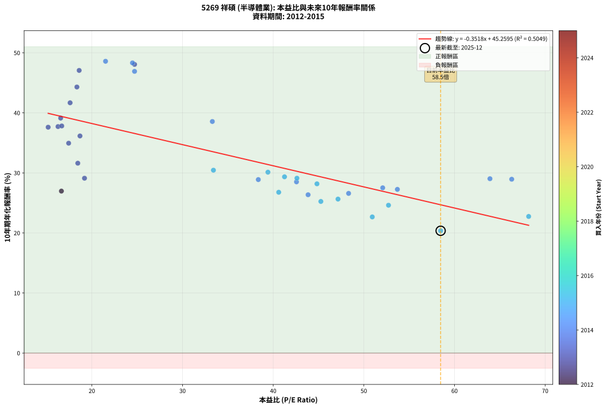
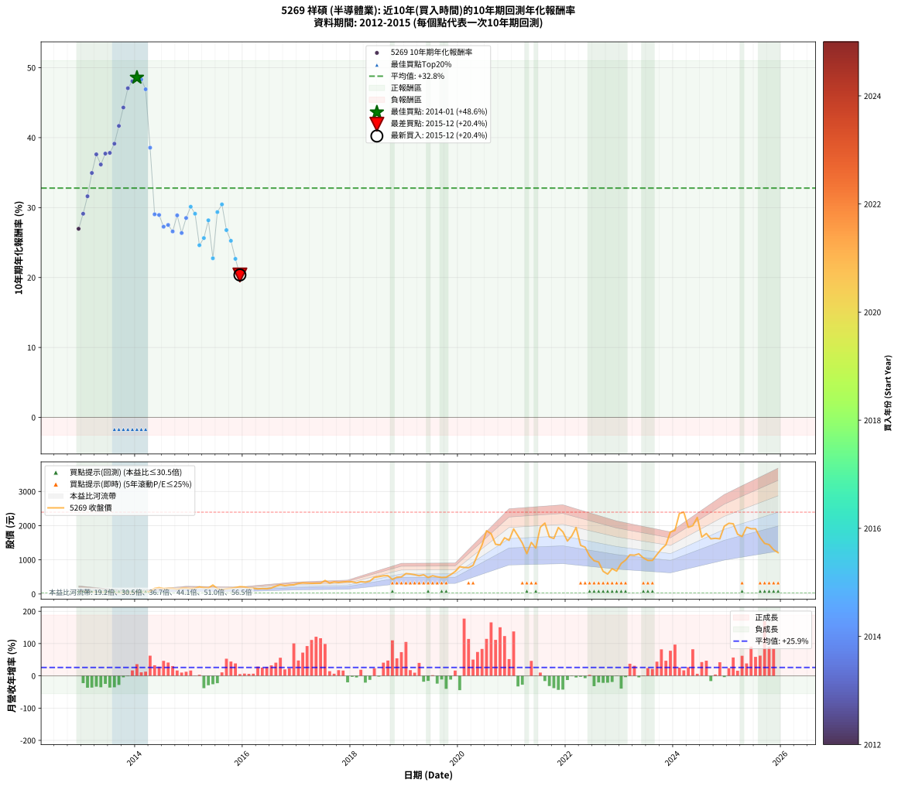

# 5269 祥碩 - 本益比與未來報酬率分析

!!! info "報告資訊"
    - **股票代號**: 5269
    - **公司名稱**: 祥碩
    - **產業別**: 半導體業
    - **分析期間**: 2012-2015 (37 個數據點)
    - **資料來源**: Type 12 (ShowMonthlyK_ChartFlow) 月收盤價與本益比
    - **報酬率口徑**: 含現金股利 (簡化: 年度合計，假設每年7/1入帳)
    - **報告生成時間**: 2026-01-04 08:28:06 CST

## 📈 視覺化圖表

### 圖表1: 本益比 vs 未來報酬率關係

*圖表1：5269 祥碩 本益比與10年期未來報酬率關係 (2012-2015)*

### 圖表2: 歷年買入時點的10年期實際報酬率

*圖表2：5269 祥碩 歷年買入時點的10年期實際報酬率 (2012-2015)*

## 📍 買點訊號說明

本報告提供兩種買點提示訊號（顯示於圖表2的股價子圖中）：

### ▲ 小綠色三角形（回測驗證）
- **計算方式**: 使用全部歷史資料計算本益比第25百分位數
- **用途**: 事後驗證，顯示歷史上哪些時點確實為低估區
- **限制**: 當下無法判斷，僅供回測參考
- **特性**: 後見之明（Look-Ahead Bias）

### ▲ 小橘色三角形（即時訊號）
- **計算方式**: 使用截至當月的過去5年資料計算本益比第25百分位數
- **用途**: 實際投資決策，當時即可判斷
- **優勢**: 可操作性強，符合實務需求
- **特性**: 無後見之明，滾動窗口計算

!!! tip "如何使用兩種訊號"
    - **綠色▲** 幫助理解歷史估值機會，驗證策略有效性
    - **橘色▲** 可作為實際買進參考，但仍需搭配基本面分析
    - 兩種訊號重疊時，表示即時判斷與事後驗證一致，信心度較高
    - 僅有綠色▲時，表示當時無法判斷（需要未來資料才能確認）
    - 僅有橘色▲時，表示即時判斷為買點，但事後可能不是最佳時機

## 📊 估值分析摘要

| 指標 | 數值 |
|:---:|:---:|
| **目前本益比** (2015-12) | **58.47 倍** |
| **歷史平均本益比** | 35.47 倍 |
| **估值水準** | 🔴 相對高估 |
| **預期10年年化報酬率** | **+24.69%** |
| **歷史平均報酬率** | +32.78% |
| **相關係數 (R²)** | 0.5049 |
| **趨勢線斜率** | -0.3518 |

!!! abstract "核心洞察"
    目前本益比顯著高於歷史平均，預期未來報酬率可能較低

    根據歷史數據回測，5269 祥碩 在目前本益比 **58.5倍** 的估值水準下，
    預期未來10年年化報酬率約為 **+24.7%**。

    **重要提醒**: 本分析基於歷史數據統計，實際報酬率會受到公司基本面變化、產業趨勢、
    總體經濟環境等多重因素影響。R² = 0.50 表示本益比可解釋約 50.5% 的報酬率變異。

## 📈 歷史估值統計

### 最佳買點 (最高報酬率)

| 項目 | 數值 |
|:---:|:---:|
| 起始時間 | 2014-01 |
| 當時本益比 | 21.51 倍 |
| 起始價格 | 37.6 元 |
| 10年後價格 | 1860.0 元 |
| **10年年化報酬率** | **+48.59%** |

### 最差買點 (最低報酬率)

| 項目 | 數值 |
|:---:|:---:|
| 起始時間 | 2015-12 |
| 當時本益比 | 58.47 倍 |
| 起始價格 | 214.0 元 |
| 10年後價格 | 1210.0 元 |
| **10年年化報酬率** | **+20.36%** |

## 🎯 投資啟示

### 本益比與報酬率關係

趨勢線方程式: **y = -0.3518x + 45.2595**

!!! note "負相關"
    本益比與未來報酬率呈現負相關。較低的本益比通常帶來較高的未來報酬率，
    但相關性不算非常強。**估值仍是重要參考指標之一**。

### 估值區間建議

基於歷史數據分析:

- **🟢 低估區** (P/E < 28.4): 預期報酬率較高，可考慮增加持股
- **🟡 合理區** (P/E 28.4-42.6): 預期報酬率符合長期趨勢，正常持有
- **🔴 高估區** (P/E > 42.6): 預期報酬率較低，可考慮減碼或觀望

!!! danger "風險提示"
    - 過去表現不代表未來結果
    - 本分析假設公司基本面無重大結構性變化
    - 產業環境劇變可能使歷史規律失效
    - 應結合公司財報、產業趨勢、總體經濟等多重因素綜合判斷

!!! success "長期投資觀點"
    歷史數據顯示，在合理或低估的估值水準買入並長期持有，
    往往能獲得較佳的投資報酬。**耐心等待好價格**是價值投資的核心原則。

## 📊 數據品質

- **資料來源**: GoodInfo.tw Type 12 (ShowMonthlyK_ChartFlow)
- **資料頻率**: 月度收盤價與本益比
- **回測期間**: 2012-2015
- **數據點數量**: 37 個 (每個點代表一次10年期回測)

### 計算方法說明

1. **10年期年化報酬率**:
   - 對每個歷史時點，計算其後10年的實際投資報酬率
   - 期末價值(不含股利): 期末價格
   - 期末價值(含現金股利): 期末價格 + 持有期間內的現金股利合計 (簡化: 年度合計，假設每年7/1入帳)
   - 公式: 年化報酬率 = [(期末價值/期初價格)^(1/年數) - 1] × 100%

2. **本益比 (P/E Ratio)**:
   - 使用當時的月收盤價與EPS計算
   - 資料來源: Type 12 月度河流圖本益比數據

3. **趨勢線 (Linear Regression)**:
   - 使用最小平方法擬合線性趨勢線
   - R²值衡量本益比對報酬率的解釋能力

---

*本報告由 Stock Analysis System v1.9.0 自動生成*
*數據更新時間: 2026-01-04 08:28:06 CST*

## 📋 月度回測明細表

（每一列對應時間線圖中的一個買入點；可用來對照 SVG 圖上的每個點。）

| 買入月份 | 賣出月份 | 回測期限_年 | 實際持有年數 | 買入本益比_倍 | 買入收盤價_元 | 賣出收盤價_元 | 現金股利合計_元 | 總報酬率_pct | 年化報酬率_pct |
| --- | --- | --- | --- | --- | --- | --- | --- | --- | --- |
| 2012-12 | 2022-12 | 10 | 9.999 | 16.64 | 70.20 | 670.00 | 94.22 | +988.64 | +26.97 |
| 2013-01 | 2023-01 | 10 | 9.999 | 19.19 | 76.70 | 893.00 | 94.22 | +1187.12 | +29.12 |
| 2013-02 | 2023-02 | 10 | 9.999 | 18.45 | 69.60 | 991.00 | 94.22 | +1459.23 | +31.62 |
| 2013-03 | 2023-03 | 10 | 9.999 | 17.44 | 61.90 | 1145.00 | 94.22 | +1901.98 | +34.95 |
| 2013-04 | 2023-04 | 10 | 9.999 | 15.18 | 50.50 | 1135.00 | 94.22 | +2334.10 | +37.61 |
| 2013-05 | 2023-05 | 10 | 9.999 | 18.69 | 58.00 | 1175.00 | 94.22 | +2088.32 | +36.15 |
| 2013-06 | 2023-06 | 10 | 9.999 | 16.27 | 46.85 | 1055.00 | 94.22 | +2352.98 | +37.72 |
| 2013-07 | 2023-07 | 10 | 9.999 | 16.68 | 44.30 | 983.00 | 111.72 | +2371.16 | +37.82 |
| 2013-08 | 2023-08 | 10 | 9.999 | 16.56 | 40.30 | 983.00 | 111.72 | +2616.43 | +39.13 |
| 2013-09 | 2023-09 | 10 | 9.999 | 17.60 | 38.90 | 1155.00 | 111.72 | +3156.36 | +41.68 |
| 2013-10 | 2023-10 | 10 | 9.999 | 18.35 | 36.45 | 1315.00 | 111.72 | +3814.19 | +44.31 |
| 2013-11 | 2023-11 | 10 | 9.999 | 18.60 | 32.80 | 1440.00 | 111.72 | +4630.86 | +47.07 |
| 2013-12 | 2023-12 | 10 | 9.999 | 24.71 | 38.05 | 1815.00 | 111.72 | +4963.66 | +48.07 |
| 2014-01 | 2024-01 | 10 | 9.999 | 21.51 | 37.60 | 1860.00 | 111.72 | +5143.94 | +48.59 |
| 2014-02 | 2024-02 | 10 | 9.999 | 24.48 | 47.90 | 2355.00 | 111.72 | +5049.73 | +48.32 |
| 2014-03 | 2024-03 | 10 | 10.001 | 24.71 | 53.50 | 2395.00 | 111.72 | +4585.46 | +46.91 |
| 2014-04 | 2024-04 | 10 | 10.001 | 33.29 | 79.00 | 1950.00 | 111.72 | +2509.78 | +38.56 |
| 2014-05 | 2024-05 | 10 | 10.001 | 63.91 | 165.00 | 2000.00 | 111.72 | +1179.83 | +29.03 |
| 2014-06 | 2024-06 | 10 | 10.001 | 66.31 | 185.00 | 2240.00 | 111.72 | +1171.20 | +28.95 |
| 2014-07 | 2024-07 | 10 | 10.001 | 53.70 | 161.00 | 1665.00 | 129.05 | +1014.32 | +27.26 |
| 2014-08 | 2024-08 | 10 | 10.001 | 52.08 | 167.00 | 1770.00 | 129.05 | +1037.16 | +27.52 |
| 2014-09 | 2024-09 | 10 | 10.001 | 48.32 | 165.00 | 1615.00 | 129.05 | +957.00 | +26.59 |
| 2014-10 | 2024-10 | 10 | 10.001 | 38.36 | 139.00 | 1630.00 | 129.05 | +1165.51 | +28.89 |
| 2014-11 | 2024-11 | 10 | 10.001 | 43.85 | 168.00 | 1615.00 | 129.05 | +938.13 | +26.36 |
| 2014-12 | 2024-12 | 10 | 10.001 | 42.57 | 172.00 | 1985.00 | 129.05 | +1129.10 | +28.51 |
| 2015-01 | 2025-01 | 10 | 10.001 | 39.42 | 158.00 | 2070.00 | 129.05 | +1291.81 | +30.12 |
| 2015-02 | 2025-02 | 10 | 10.001 | 42.62 | 169.50 | 2055.00 | 129.05 | +1188.53 | +29.12 |
| 2015-03 | 2025-03 | 10 | 10.001 | 52.72 | 208.00 | 1750.00 | 129.05 | +803.39 | +24.62 |
| 2015-04 | 2025-04 | 10 | 10.001 | 47.15 | 184.50 | 1680.00 | 129.05 | +880.52 | +25.64 |
| 2015-05 | 2025-05 | 10 | 10.001 | 44.83 | 174.00 | 1955.00 | 129.05 | +1097.73 | +28.18 |
| 2015-06 | 2025-06 | 10 | 10.001 | 68.18 | 262.50 | 1910.00 | 129.05 | +676.78 | +22.75 |
| 2015-07 | 2025-07 | 10 | 10.001 | 41.25 | 157.50 | 1910.00 | 156.05 | +1211.78 | +29.35 |
| 2015-08 | 2025-08 | 10 | 10.001 | 33.41 | 126.50 | 1650.00 | 156.05 | +1327.71 | +30.45 |
| 2015-09 | 2025-09 | 10 | 10.001 | 40.61 | 152.50 | 1480.00 | 156.05 | +972.82 | +26.78 |
| 2015-10 | 2025-10 | 10 | 10.001 | 45.26 | 168.50 | 1445.00 | 156.05 | +850.18 | +25.25 |
| 2015-11 | 2025-11 | 10 | 10.001 | 50.93 | 188.00 | 1295.00 | 156.05 | +671.84 | +22.67 |
| 2015-12 | 2025-12 | 10 | 10.001 | 58.47 | 214.00 | 1210.00 | 156.05 | +538.34 | +20.36 |
