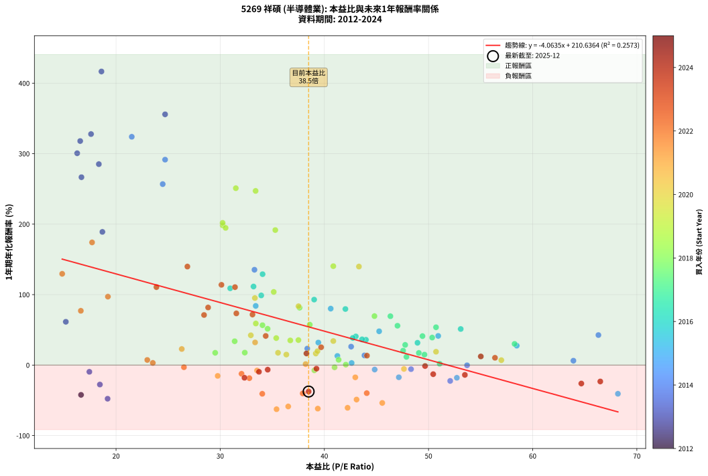
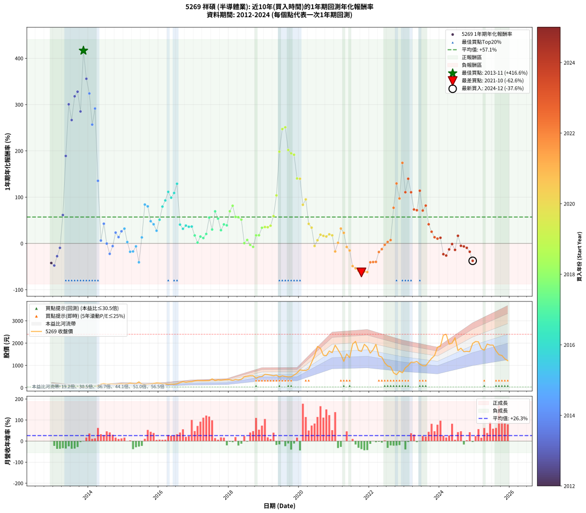

# 5269 祥碩 - 本益比與未來報酬率分析

!!! info "報告資訊"
    - **股票代號**: 5269
    - **公司名稱**: 祥碩
    - **產業別**: 半導體業
    - **分析期間**: 2012-2024 (145 個數據點)
    - **資料來源**: Type 12 (ShowMonthlyK_ChartFlow) 月收盤價與本益比
    - **報酬率口徑**: 含現金股利 (簡化: 年度合計，假設每年7/1入帳)
    - **報告生成時間**: 2026-01-10 23:00:16 CST

## 📈 視覺化圖表

### 圖表1: 本益比 vs 未來報酬率關係

*圖表1：5269 祥碩 本益比與1年期未來報酬率關係 (2012-2024)*

### 圖表2: 歷年買入時點的1年期實際報酬率

*圖表2：5269 祥碩 歷年買入時點的1年期實際報酬率 (2012-2024)*

## 📍 買點訊號說明

本報告提供兩種買點提示訊號（顯示於圖表2的股價子圖中）：

### ▲ 小綠色三角形（回測驗證）
- **計算方式**: 使用全部歷史資料計算本益比第25百分位數
- **用途**: 事後驗證，顯示歷史上哪些時點確實為低估區
- **限制**: 當下無法判斷，僅供回測參考
- **特性**: 後見之明（Look-Ahead Bias）

### ▲ 小橘色三角形（即時訊號）
- **計算方式**: 使用截至當月的過去5年資料計算本益比第25百分位數
- **用途**: 實際投資決策，當時即可判斷
- **優勢**: 可操作性強，符合實務需求
- **特性**: 無後見之明，滾動窗口計算

!!! tip "如何使用兩種訊號"
    - **綠色▲** 幫助理解歷史估值機會，驗證策略有效性
    - **橘色▲** 可作為實際買進參考，但仍需搭配基本面分析
    - 兩種訊號重疊時，表示即時判斷與事後驗證一致，信心度較高
    - 僅有綠色▲時，表示當時無法判斷（需要未來資料才能確認）
    - 僅有橘色▲時，表示即時判斷為買點，但事後可能不是最佳時機

## 📊 估值分析摘要

| 指標 | 數值 |
|:---:|:---:|
| **目前本益比** (2024-12) | **38.49 倍** |
| **歷史平均本益比** | 37.79 倍 |
| **估值水準** | 🟡 合理範圍 |
| **預期1年年化報酬率** | **+54.23%** |
| **歷史平均報酬率** | +57.06% |
| **相關係數 (R²)** | 0.2573 |
| **趨勢線斜率** | -4.0635 |

!!! abstract "核心洞察"
    目前本益比接近歷史平均，預期報酬率符合長期趨勢

    根據歷史數據回測，5269 祥碩 在目前本益比 **38.5倍** 的估值水準下，
    預期未來1年年化報酬率約為 **+54.2%**。

    **重要提醒**: 本分析基於歷史數據統計，實際報酬率會受到公司基本面變化、產業趨勢、
    總體經濟環境等多重因素影響。R² = 0.26 表示本益比可解釋約 25.7% 的報酬率變異。

## 📈 歷史估值統計

### 最佳買點 (最高報酬率)

| 項目 | 數值 |
|:---:|:---:|
| 起始時間 | 2013-11 |
| 當時本益比 | 18.60 倍 |
| 起始價格 | 32.8 元 |
| 1年後價格 | 168.0 元 |
| **1年年化報酬率** | **+416.59%** |

### 最差買點 (最低報酬率)

| 項目 | 數值 |
|:---:|:---:|
| 起始時間 | 2021-10 |
| 當時本益比 | 35.41 倍 |
| 起始價格 | 1625.0 元 |
| 1年後價格 | 582.0 元 |
| **1年年化報酬率** | **-62.61%** |

## 🎯 投資啟示

### 本益比與報酬率關係

趨勢線方程式: **y = -4.0635x + 210.6364**

!!! warning "強負相關"
    本益比與未來報酬率呈現強負相關。在高本益比時期買入，未來報酬率顯著較低；
    在低本益比時期買入，未來報酬率顯著較高。**估值紀律至關重要**。

### 估值區間建議

基於歷史數據分析:

- **🟢 低估區** (P/E < 30.2): 預期報酬率較高，可考慮增加持股
- **🟡 合理區** (P/E 30.2-45.4): 預期報酬率符合長期趨勢，正常持有
- **🔴 高估區** (P/E > 45.4): 預期報酬率較低，可考慮減碼或觀望

!!! danger "風險提示"
    - 過去表現不代表未來結果
    - 本分析假設公司基本面無重大結構性變化
    - 產業環境劇變可能使歷史規律失效
    - 應結合公司財報、產業趨勢、總體經濟等多重因素綜合判斷

!!! success "長期投資觀點"
    歷史數據顯示，在合理或低估的估值水準買入並長期持有，
    往往能獲得較佳的投資報酬。**耐心等待好價格**是價值投資的核心原則。

## 📊 數據品質

- **資料來源**: GoodInfo.tw Type 12 (ShowMonthlyK_ChartFlow)
- **資料頻率**: 月度收盤價與本益比
- **回測期間**: 2012-2024
- **數據點數量**: 145 個 (每個點代表一次1年期回測)

### 計算方法說明

1. **1年期年化報酬率**:
   - 對每個歷史時點，計算其後1年的實際投資報酬率
   - 期末價值(不含股利): 期末價格
   - 期末價值(含現金股利): 期末價格 + 持有期間內的現金股利合計 (簡化: 年度合計，假設每年7/1入帳)
   - 公式: 年化報酬率 = [(期末價值/期初價格)^(1/年數) - 1] × 100%

2. **本益比 (P/E Ratio)**:
   - 使用當時的月收盤價與EPS計算
   - 資料來源: Type 12 月度河流圖本益比數據

3. **趨勢線 (Linear Regression)**:
   - 使用最小平方法擬合線性趨勢線
   - R²值衡量本益比對報酬率的解釋能力

---

*本報告由 Stock Analysis System v1.9.0 自動生成*
*數據更新時間: 2026-01-10 23:00:16 CST*

## 📋 月度回測明細表

（每一列對應時間線圖中的一個買入點；可用來對照 SVG 圖上的每個點。）

| 買入月份 | 賣出月份 | 回測期限_年 | 實際持有年數 | 買入本益比_倍 | 買入收盤價_元 | 賣出收盤價_元 | 現金股利合計_元 | 總報酬率_pct | 年化報酬率_pct |
| --- | --- | --- | --- | --- | --- | --- | --- | --- | --- |
| 2012-12 | 2013-12 | 1 | 0.999 | 16.64 | 70.20 | 38.05 | 2.50 | -42.24 | -42.26 |
| 2013-01 | 2014-01 | 1 | 0.999 | 19.19 | 76.70 | 37.60 | 2.50 | -47.72 | -47.74 |
| 2013-02 | 2014-02 | 1 | 0.999 | 18.45 | 69.60 | 47.90 | 2.50 | -27.59 | -27.60 |
| 2013-03 | 2014-03 | 1 | 0.999 | 17.44 | 61.90 | 53.50 | 2.50 | -9.53 | -9.54 |
| 2013-04 | 2014-04 | 1 | 0.999 | 15.18 | 50.50 | 79.00 | 2.50 | +61.39 | +61.44 |
| 2013-05 | 2014-05 | 1 | 0.999 | 18.69 | 58.00 | 165.00 | 2.50 | +188.79 | +189.00 |
| 2013-06 | 2014-06 | 1 | 0.999 | 16.27 | 46.85 | 185.00 | 2.50 | +300.21 | +300.59 |
| 2013-07 | 2014-07 | 1 | 0.999 | 16.68 | 44.30 | 161.00 | 1.25 | +266.25 | +266.58 |
| 2013-08 | 2014-08 | 1 | 0.999 | 16.56 | 40.30 | 167.00 | 1.25 | +317.49 | +317.90 |
| 2013-09 | 2014-09 | 1 | 0.999 | 17.60 | 38.90 | 165.00 | 1.25 | +327.38 | +327.80 |
| 2013-10 | 2014-10 | 1 | 0.999 | 18.35 | 36.45 | 139.00 | 1.25 | +284.77 | +285.13 |
| 2013-11 | 2014-11 | 1 | 0.999 | 18.60 | 32.80 | 168.00 | 1.25 | +416.01 | +416.59 |
| 2013-12 | 2014-12 | 1 | 0.999 | 24.71 | 38.05 | 172.00 | 1.25 | +355.32 | +355.79 |
| 2014-01 | 2015-01 | 1 | 0.999 | 21.51 | 37.60 | 158.00 | 1.25 | +323.54 | +323.96 |
| 2014-02 | 2015-02 | 1 | 0.999 | 24.48 | 47.90 | 169.50 | 1.25 | +256.47 | +256.78 |
| 2014-03 | 2015-03 | 1 | 0.999 | 24.71 | 53.50 | 208.00 | 1.25 | +291.12 | +291.49 |
| 2014-04 | 2015-04 | 1 | 0.999 | 33.29 | 79.00 | 184.50 | 1.25 | +135.13 | +135.26 |
| 2014-05 | 2015-05 | 1 | 0.999 | 63.91 | 165.00 | 174.00 | 1.25 | +6.21 | +6.22 |
| 2014-06 | 2015-06 | 1 | 0.999 | 66.31 | 185.00 | 262.50 | 1.25 | +42.57 | +42.60 |
| 2014-07 | 2015-07 | 1 | 0.999 | 53.70 | 161.00 | 157.50 | 3.00 | -0.31 | -0.31 |
| 2014-08 | 2015-08 | 1 | 0.999 | 52.08 | 167.00 | 126.50 | 3.00 | -22.45 | -22.47 |
| 2014-09 | 2015-09 | 1 | 0.999 | 48.32 | 165.00 | 152.50 | 3.00 | -5.76 | -5.76 |
| 2014-10 | 2015-10 | 1 | 0.999 | 38.36 | 139.00 | 168.50 | 3.00 | +23.38 | +23.40 |
| 2014-11 | 2015-11 | 1 | 0.999 | 43.85 | 168.00 | 188.00 | 3.00 | +13.69 | +13.70 |
| 2014-12 | 2015-12 | 1 | 0.999 | 42.57 | 172.00 | 214.00 | 3.00 | +26.16 | +26.18 |
| 2015-01 | 2016-01 | 1 | 0.999 | 39.42 | 158.00 | 205.50 | 3.00 | +31.96 | +31.99 |
| 2015-02 | 2016-02 | 1 | 0.999 | 42.62 | 169.50 | 171.50 | 3.00 | +2.95 | +2.95 |
| 2015-03 | 2016-03 | 1 | 1.002 | 52.72 | 208.00 | 167.50 | 3.00 | -18.03 | -17.99 |
| 2015-04 | 2016-04 | 1 | 1.002 | 47.15 | 184.50 | 149.50 | 3.00 | -17.34 | -17.31 |
| 2015-05 | 2016-05 | 1 | 1.002 | 44.83 | 174.00 | 160.00 | 3.00 | -6.32 | -6.31 |
| 2015-06 | 2016-06 | 1 | 1.002 | 68.18 | 262.50 | 152.50 | 3.00 | -40.76 | -40.70 |
| 2015-07 | 2016-07 | 1 | 1.002 | 41.25 | 157.50 | 175.00 | 3.00 | +13.02 | +12.99 |
| 2015-08 | 2016-08 | 1 | 1.002 | 33.41 | 126.50 | 230.00 | 3.00 | +84.19 | +83.96 |
| 2015-09 | 2016-09 | 1 | 1.002 | 40.61 | 152.50 | 272.00 | 3.00 | +80.33 | +80.11 |
| 2015-10 | 2016-10 | 1 | 1.002 | 45.26 | 168.50 | 246.50 | 3.00 | +48.07 | +47.95 |
| 2015-11 | 2016-11 | 1 | 1.002 | 50.93 | 188.00 | 263.00 | 3.00 | +41.49 | +41.39 |
| 2015-12 | 2016-12 | 1 | 1.002 | 58.47 | 214.00 | 270.00 | 3.00 | +27.57 | +27.51 |
| 2016-01 | 2017-01 | 1 | 1.002 | 53.09 | 205.50 | 308.00 | 3.00 | +51.34 | +51.21 |
| 2016-02 | 2017-03 | 1 | 1.081 | 42.02 | 171.50 | 320.00 | 3.00 | +88.34 | +79.57 |
| 2016-03 | 2017-03 | 1 | 0.999 | 39.02 | 167.50 | 320.00 | 3.00 | +92.84 | +92.92 |
| 2016-04 | 2017-04 | 1 | 0.999 | 33.20 | 149.50 | 313.00 | 3.00 | +111.37 | +111.48 |
| 2016-05 | 2017-05 | 1 | 0.999 | 33.94 | 160.00 | 315.00 | 3.00 | +98.75 | +98.84 |
| 2016-06 | 2017-06 | 1 | 0.999 | 30.96 | 152.50 | 315.50 | 3.00 | +108.85 | +108.96 |
| 2016-07 | 2017-07 | 1 | 0.999 | 34.07 | 175.00 | 396.00 | 4.50 | +128.86 | +128.99 |
| 2016-08 | 2017-08 | 1 | 0.999 | 43.02 | 230.00 | 319.00 | 4.50 | +40.65 | +40.69 |
| 2016-09 | 2017-09 | 1 | 0.999 | 48.94 | 272.00 | 353.50 | 4.50 | +31.62 | +31.64 |
| 2016-10 | 2017-10 | 1 | 0.999 | 42.73 | 246.50 | 337.00 | 4.50 | +38.54 | +38.57 |
| 2016-11 | 2017-11 | 1 | 0.999 | 43.99 | 263.00 | 353.00 | 4.50 | +35.93 | +35.96 |
| 2016-12 | 2017-12 | 1 | 0.999 | 43.62 | 270.00 | 364.00 | 4.50 | +36.48 | +36.51 |
| 2017-01 | 2018-01 | 1 | 0.999 | 49.07 | 308.00 | 356.50 | 4.50 | +17.21 | +17.22 |
| 2017-02 | 2018-02 | 1 | 0.999 | 51.07 | 325.00 | 326.50 | 4.50 | +1.85 | +1.85 |
| 2017-03 | 2018-03 | 1 | 0.999 | 49.61 | 320.00 | 363.00 | 4.50 | +14.84 | +14.85 |
| 2017-04 | 2018-04 | 1 | 0.999 | 47.88 | 313.00 | 345.00 | 4.50 | +11.66 | +11.67 |
| 2017-05 | 2018-05 | 1 | 0.999 | 47.56 | 315.00 | 375.00 | 4.50 | +20.48 | +20.49 |
| 2017-06 | 2018-06 | 1 | 0.999 | 47.02 | 315.50 | 487.00 | 4.50 | +55.78 | +55.83 |
| 2017-07 | 2018-07 | 1 | 0.999 | 58.26 | 396.00 | 509.00 | 6.00 | +30.05 | +30.07 |
| 2017-08 | 2018-08 | 1 | 0.999 | 46.34 | 319.00 | 534.00 | 6.00 | +69.28 | +69.34 |
| 2017-09 | 2018-09 | 1 | 0.999 | 50.72 | 353.50 | 537.00 | 6.00 | +53.61 | +53.65 |
| 2017-10 | 2018-10 | 1 | 0.999 | 47.76 | 337.00 | 427.50 | 6.00 | +28.64 | +28.66 |
| 2017-11 | 2018-11 | 1 | 0.999 | 49.42 | 353.00 | 492.00 | 6.00 | +41.08 | +41.11 |
| 2017-12 | 2018-12 | 1 | 0.999 | 50.35 | 364.00 | 500.00 | 6.00 | +39.01 | +39.04 |
| 2018-01 | 2019-01 | 1 | 0.999 | 44.81 | 356.50 | 598.00 | 6.00 | +69.42 | +69.49 |
| 2018-02 | 2019-02 | 1 | 0.999 | 37.62 | 326.50 | 586.00 | 6.00 | +81.32 | +81.39 |
| 2018-03 | 2019-03 | 1 | 0.999 | 38.60 | 363.00 | 565.00 | 6.00 | +57.30 | +57.35 |
| 2018-04 | 2019-04 | 1 | 0.999 | 34.06 | 345.00 | 534.00 | 6.00 | +56.52 | +56.57 |
| 2018-05 | 2019-05 | 1 | 0.999 | 34.55 | 375.00 | 562.00 | 6.00 | +51.47 | +51.51 |
| 2018-06 | 2019-06 | 1 | 0.999 | 42.06 | 487.00 | 484.00 | 6.00 | +0.62 | +0.62 |
| 2018-07 | 2019-07 | 1 | 0.999 | 41.37 | 509.00 | 535.00 | 12.00 | +7.47 | +7.47 |
| 2018-08 | 2019-08 | 1 | 0.999 | 40.98 | 534.00 | 505.00 | 12.00 | -3.18 | -3.19 |
| 2018-09 | 2019-09 | 1 | 0.999 | 39.04 | 537.00 | 485.00 | 12.00 | -7.45 | -7.45 |
| 2018-10 | 2019-10 | 1 | 0.999 | 29.52 | 427.50 | 490.00 | 12.00 | +17.43 | +17.44 |
| 2018-11 | 2019-11 | 1 | 0.999 | 32.36 | 492.00 | 567.00 | 12.00 | +17.68 | +17.70 |
| 2018-12 | 2019-12 | 1 | 0.999 | 31.39 | 500.00 | 657.00 | 12.00 | +33.80 | +33.83 |
| 2019-01 | 2020-01 | 1 | 0.999 | 37.51 | 598.00 | 798.00 | 12.00 | +35.45 | +35.48 |
| 2019-02 | 2020-02 | 1 | 0.999 | 36.73 | 586.00 | 779.00 | 12.00 | +34.98 | +35.01 |
| 2019-03 | 2020-03 | 1 | 1.002 | 35.38 | 565.00 | 770.00 | 12.00 | +38.41 | +38.31 |
| 2019-04 | 2020-04 | 1 | 1.002 | 33.42 | 534.00 | 838.00 | 12.00 | +59.18 | +59.02 |
| 2019-05 | 2020-05 | 1 | 1.002 | 35.14 | 562.00 | 1135.00 | 12.00 | +104.09 | +103.79 |
| 2019-06 | 2020-06 | 1 | 1.002 | 30.24 | 484.00 | 1435.00 | 12.00 | +198.97 | +198.30 |
| 2019-07 | 2020-07 | 1 | 1.002 | 33.40 | 535.00 | 1850.00 | 11.97 | +248.03 | +247.14 |
| 2019-08 | 2020-08 | 1 | 1.002 | 31.50 | 505.00 | 1765.00 | 11.97 | +251.88 | +250.97 |
| 2019-09 | 2020-09 | 1 | 1.002 | 30.23 | 485.00 | 1455.00 | 11.97 | +202.47 | +201.78 |
| 2019-10 | 2020-10 | 1 | 1.002 | 30.52 | 490.00 | 1435.00 | 11.97 | +195.30 | +194.65 |
| 2019-11 | 2020-11 | 1 | 1.002 | 35.29 | 567.00 | 1645.00 | 11.97 | +192.23 | +191.59 |
| 2019-12 | 2020-12 | 1 | 1.002 | 40.86 | 657.00 | 1570.00 | 11.97 | +140.79 | +140.35 |
| 2020-01 | 2021-01 | 1 | 1.002 | 43.32 | 798.00 | 1905.00 | 11.97 | +140.22 | +139.79 |
| 2020-02 | 2021-03 | 1 | 1.081 | 37.52 | 779.00 | 1490.00 | 11.97 | +92.81 | +83.51 |
| 2020-03 | 2021-03 | 1 | 0.999 | 33.33 | 770.00 | 1490.00 | 11.97 | +95.06 | +95.15 |
| 2020-04 | 2021-04 | 1 | 0.999 | 32.94 | 838.00 | 1180.00 | 11.97 | +42.24 | +42.27 |
| 2020-05 | 2021-05 | 1 | 0.999 | 40.86 | 1135.00 | 1510.00 | 11.97 | +34.09 | +34.12 |
| 2020-06 | 2021-06 | 1 | 0.999 | 47.64 | 1435.00 | 1345.00 | 11.97 | -5.44 | -5.44 |
| 2020-07 | 2021-07 | 1 | 0.999 | 56.99 | 1850.00 | 1955.00 | 24.00 | +6.97 | +6.98 |
| 2020-08 | 2021-08 | 1 | 0.999 | 50.72 | 1765.00 | 2075.00 | 24.00 | +18.92 | +18.94 |
| 2020-09 | 2021-09 | 1 | 0.999 | 39.18 | 1455.00 | 1670.00 | 24.00 | +16.43 | +16.44 |
| 2020-10 | 2021-10 | 1 | 0.999 | 36.35 | 1435.00 | 1625.00 | 24.00 | +14.91 | +14.92 |
| 2020-11 | 2021-11 | 1 | 0.999 | 39.34 | 1645.00 | 1945.00 | 24.00 | +19.70 | +19.71 |
| 2020-12 | 2021-12 | 1 | 0.999 | 35.55 | 1570.00 | 1820.00 | 24.00 | +17.45 | +17.47 |
| 2021-01 | 2022-01 | 1 | 0.999 | 42.97 | 1905.00 | 1550.00 | 24.00 | -17.38 | -17.39 |
| 2021-02 | 2022-02 | 1 | 0.999 | 38.20 | 1700.00 | 1700.00 | 24.00 | +1.41 | +1.41 |
| 2021-03 | 2022-03 | 1 | 0.999 | 33.35 | 1490.00 | 1945.00 | 24.00 | +32.15 | +32.17 |
| 2021-04 | 2022-04 | 1 | 0.999 | 26.31 | 1180.00 | 1425.00 | 24.00 | +22.80 | +22.81 |
| 2021-05 | 2022-05 | 1 | 0.999 | 33.54 | 1510.00 | 1370.00 | 24.00 | -7.68 | -7.69 |
| 2021-06 | 2022-06 | 1 | 0.999 | 29.76 | 1345.00 | 1115.00 | 24.00 | -15.32 | -15.33 |
| 2021-07 | 2022-07 | 1 | 0.999 | 43.09 | 1955.00 | 973.00 | 26.00 | -48.90 | -48.92 |
| 2021-08 | 2022-08 | 1 | 0.999 | 45.56 | 2075.00 | 935.00 | 26.00 | -53.69 | -53.71 |
| 2021-09 | 2022-09 | 1 | 0.999 | 36.53 | 1670.00 | 664.00 | 26.00 | -58.68 | -58.71 |
| 2021-10 | 2022-10 | 1 | 0.999 | 35.41 | 1625.00 | 582.00 | 26.00 | -62.58 | -62.61 |
| 2021-11 | 2022-11 | 1 | 0.999 | 42.23 | 1945.00 | 741.00 | 26.00 | -60.57 | -60.59 |
| 2021-12 | 2022-12 | 1 | 0.999 | 39.37 | 1820.00 | 670.00 | 26.00 | -61.76 | -61.78 |
| 2022-01 | 2023-01 | 1 | 0.999 | 34.04 | 1550.00 | 893.00 | 26.00 | -40.71 | -40.73 |
| 2022-02 | 2023-02 | 1 | 0.999 | 37.92 | 1700.00 | 991.00 | 26.00 | -40.18 | -40.20 |
| 2022-03 | 2023-03 | 1 | 0.999 | 44.07 | 1945.00 | 1145.00 | 26.00 | -39.79 | -39.82 |
| 2022-04 | 2023-04 | 1 | 0.999 | 32.80 | 1425.00 | 1135.00 | 26.00 | -18.53 | -18.54 |
| 2022-05 | 2023-05 | 1 | 0.999 | 32.05 | 1370.00 | 1175.00 | 26.00 | -12.34 | -12.34 |
| 2022-06 | 2023-06 | 1 | 0.999 | 26.52 | 1115.00 | 1055.00 | 26.00 | -3.05 | -3.05 |
| 2022-07 | 2023-07 | 1 | 0.999 | 23.53 | 973.00 | 983.00 | 20.00 | +3.08 | +3.09 |
| 2022-08 | 2023-08 | 1 | 0.999 | 23.00 | 935.00 | 983.00 | 20.00 | +7.27 | +7.28 |
| 2022-09 | 2023-09 | 1 | 0.999 | 16.62 | 664.00 | 1155.00 | 20.00 | +76.96 | +77.03 |
| 2022-10 | 2023-10 | 1 | 0.999 | 14.83 | 582.00 | 1315.00 | 20.00 | +129.38 | +129.51 |
| 2022-11 | 2023-11 | 1 | 0.999 | 19.22 | 741.00 | 1440.00 | 20.00 | +97.03 | +97.12 |
| 2022-12 | 2023-12 | 1 | 0.999 | 17.70 | 670.00 | 1815.00 | 20.00 | +173.88 | +174.07 |
| 2023-01 | 2024-01 | 1 | 0.999 | 23.88 | 893.00 | 1860.00 | 20.00 | +110.53 | +110.63 |
| 2023-02 | 2024-02 | 1 | 0.999 | 26.85 | 991.00 | 2355.00 | 20.00 | +139.66 | +139.80 |
| 2023-03 | 2024-03 | 1 | 1.002 | 31.42 | 1145.00 | 2395.00 | 20.00 | +110.92 | +110.59 |
| 2023-04 | 2024-04 | 1 | 1.002 | 31.55 | 1135.00 | 1950.00 | 20.00 | +73.57 | +73.37 |
| 2023-05 | 2024-05 | 1 | 1.002 | 33.10 | 1175.00 | 2000.00 | 20.00 | +71.91 | +71.72 |
| 2023-06 | 2024-06 | 1 | 1.002 | 30.12 | 1055.00 | 2240.00 | 20.00 | +114.22 | +113.88 |
| 2023-07 | 2024-07 | 1 | 1.002 | 28.45 | 983.00 | 1665.00 | 18.58 | +71.27 | +71.08 |
| 2023-08 | 2024-08 | 1 | 1.002 | 28.84 | 983.00 | 1770.00 | 18.58 | +81.95 | +81.73 |
| 2023-09 | 2024-09 | 1 | 1.002 | 34.37 | 1155.00 | 1615.00 | 18.58 | +41.44 | +41.34 |
| 2023-10 | 2024-10 | 1 | 1.002 | 39.69 | 1315.00 | 1630.00 | 18.58 | +25.37 | +25.31 |
| 2023-11 | 2024-11 | 1 | 1.002 | 44.09 | 1440.00 | 1615.00 | 18.58 | +13.44 | +13.41 |
| 2023-12 | 2024-12 | 1 | 1.002 | 56.38 | 1815.00 | 1985.00 | 18.58 | +10.39 | +10.37 |
| 2024-01 | 2025-01 | 1 | 1.002 | 55.02 | 1860.00 | 2070.00 | 18.58 | +12.29 | +12.26 |
| 2024-02 | 2025-03 | 1 | 1.081 | 66.49 | 2355.00 | 1750.00 | 18.58 | -24.90 | -23.26 |
| 2024-03 | 2025-03 | 1 | 0.999 | 64.67 | 2395.00 | 1750.00 | 18.58 | -26.16 | -26.17 |
| 2024-04 | 2025-04 | 1 | 0.999 | 50.45 | 1950.00 | 1680.00 | 18.58 | -12.89 | -12.90 |
| 2024-05 | 2025-05 | 1 | 0.999 | 49.67 | 2000.00 | 1955.00 | 18.58 | -1.32 | -1.32 |
| 2024-06 | 2025-06 | 1 | 0.999 | 53.49 | 2240.00 | 1910.00 | 18.58 | -13.90 | -13.91 |
| 2024-07 | 2025-07 | 1 | 0.999 | 38.28 | 1665.00 | 1910.00 | 30.00 | +16.52 | +16.53 |
| 2024-08 | 2025-08 | 1 | 0.999 | 39.24 | 1770.00 | 1650.00 | 30.00 | -5.08 | -5.09 |
| 2024-09 | 2025-09 | 1 | 0.999 | 34.56 | 1615.00 | 1480.00 | 30.00 | -6.50 | -6.51 |
| 2024-10 | 2025-10 | 1 | 0.999 | 33.72 | 1630.00 | 1445.00 | 30.00 | -9.51 | -9.52 |
| 2024-11 | 2025-11 | 1 | 0.999 | 32.33 | 1615.00 | 1295.00 | 30.00 | -17.96 | -17.97 |
| 2024-12 | 2025-12 | 1 | 0.999 | 38.49 | 1985.00 | 1210.00 | 30.00 | -37.53 | -37.55 |
