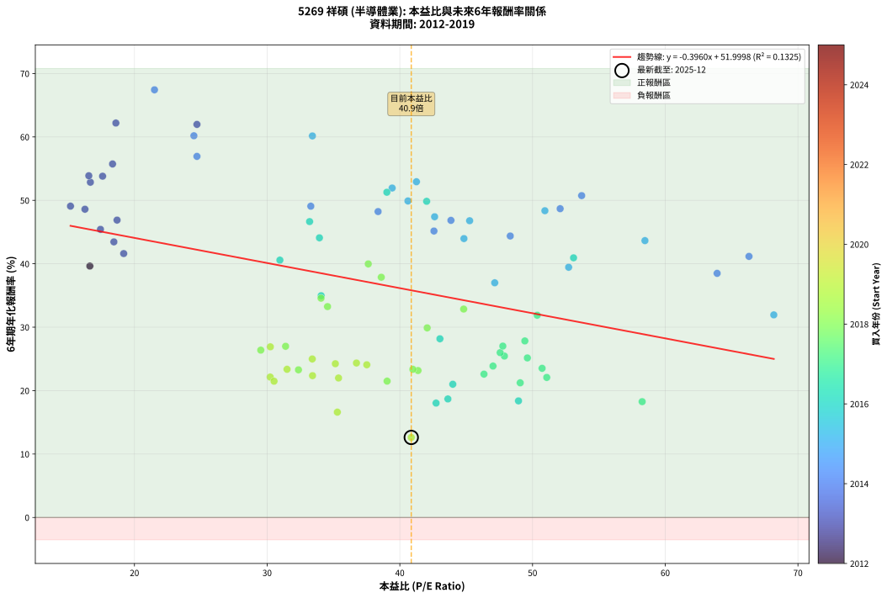
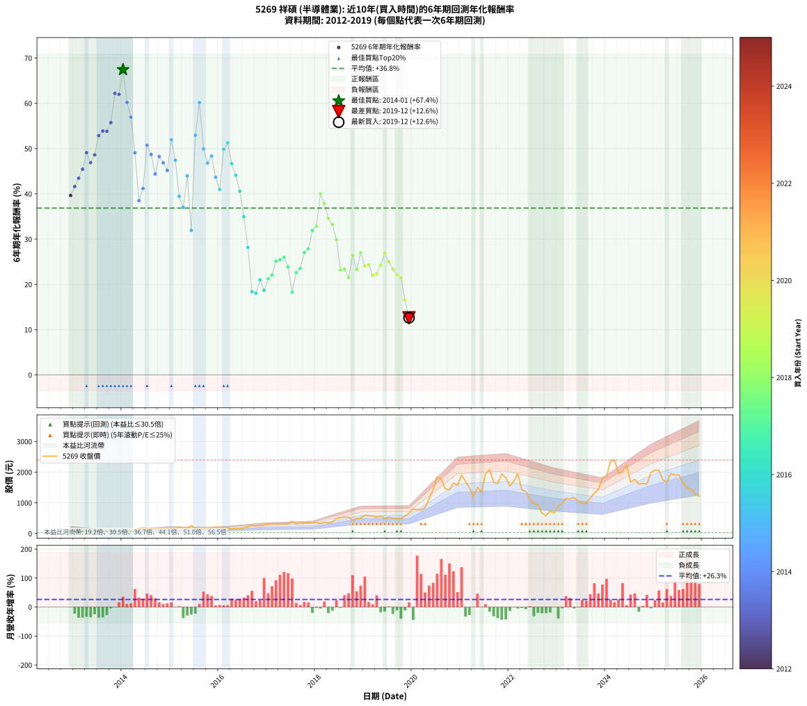

# 5269 祥碩 - 本益比與未來報酬率分析

!!! info "報告資訊"
    - **股票代號**: 5269
    - **公司名稱**: 祥碩
    - **產業別**: 半導體業
    - **分析期間**: 2012-2019 (85 個數據點)
    - **資料來源**: Type 12 (ShowMonthlyK_ChartFlow) 月收盤價與本益比
    - **報酬率口徑**: 含現金股利 (簡化: 年度合計，假設每年7/1入帳)
    - **報告生成時間**: 2026-01-04 08:19:59 CST

## 📈 視覺化圖表

### 圖表1: 本益比 vs 未來報酬率關係

*圖表1：5269 祥碩 本益比與6年期未來報酬率關係 (2012-2019)*

### 圖表2: 歷年買入時點的6年期實際報酬率

*圖表2：5269 祥碩 歷年買入時點的6年期實際報酬率 (2012-2019)*

## 📍 買點訊號說明

本報告提供兩種買點提示訊號（顯示於圖表2的股價子圖中）：

### ▲ 小綠色三角形（回測驗證）
- **計算方式**: 使用全部歷史資料計算本益比第25百分位數
- **用途**: 事後驗證，顯示歷史上哪些時點確實為低估區
- **限制**: 當下無法判斷，僅供回測參考
- **特性**: 後見之明（Look-Ahead Bias）

### ▲ 小橘色三角形（即時訊號）
- **計算方式**: 使用截至當月的過去5年資料計算本益比第25百分位數
- **用途**: 實際投資決策，當時即可判斷
- **優勢**: 可操作性強，符合實務需求
- **特性**: 無後見之明，滾動窗口計算

!!! tip "如何使用兩種訊號"
    - **綠色▲** 幫助理解歷史估值機會，驗證策略有效性
    - **橘色▲** 可作為實際買進參考，但仍需搭配基本面分析
    - 兩種訊號重疊時，表示即時判斷與事後驗證一致，信心度較高
    - 僅有綠色▲時，表示當時無法判斷（需要未來資料才能確認）
    - 僅有橘色▲時，表示即時判斷為買點，但事後可能不是最佳時機

## 📊 估值分析摘要

| 指標 | 數值 |
|:---:|:---:|
| **目前本益比** (2019-12) | **40.86 倍** |
| **歷史平均本益比** | 38.27 倍 |
| **估值水準** | 🟡 合理範圍 |
| **預期6年年化報酬率** | **+35.82%** |
| **歷史平均報酬率** | +36.85% |
| **相關係數 (R²)** | 0.1325 |
| **趨勢線斜率** | -0.3960 |

!!! abstract "核心洞察"
    目前本益比接近歷史平均，預期報酬率符合長期趨勢

    根據歷史數據回測，5269 祥碩 在目前本益比 **40.9倍** 的估值水準下，
    預期未來6年年化報酬率約為 **+35.8%**。

    **重要提醒**: 本分析基於歷史數據統計，實際報酬率會受到公司基本面變化、產業趨勢、
    總體經濟環境等多重因素影響。R² = 0.13 表示本益比可解釋約 13.3% 的報酬率變異。

## 📈 歷史估值統計

### 最佳買點 (最高報酬率)

| 項目 | 數值 |
|:---:|:---:|
| 起始時間 | 2014-01 |
| 當時本益比 | 21.51 倍 |
| 起始價格 | 37.6 元 |
| 6年後價格 | 798.0 元 |
| **6年年化報酬率** | **+67.43%** |

### 最差買點 (最低報酬率)

| 項目 | 數值 |
|:---:|:---:|
| 起始時間 | 2019-12 |
| 當時本益比 | 40.86 倍 |
| 起始價格 | 657.0 元 |
| 6年後價格 | 1210.0 元 |
| **6年年化報酬率** | **+12.62%** |

## 🎯 投資啟示

### 本益比與報酬率關係

趨勢線方程式: **y = -0.3960x + 51.9998**

!!! note "負相關"
    本益比與未來報酬率呈現負相關。較低的本益比通常帶來較高的未來報酬率，
    但相關性不算非常強。**估值仍是重要參考指標之一**。

### 估值區間建議

基於歷史數據分析:

- **🟢 低估區** (P/E < 30.6): 預期報酬率較高，可考慮增加持股
- **🟡 合理區** (P/E 30.6-45.9): 預期報酬率符合長期趨勢，正常持有
- **🔴 高估區** (P/E > 45.9): 預期報酬率較低，可考慮減碼或觀望

!!! danger "風險提示"
    - 過去表現不代表未來結果
    - 本分析假設公司基本面無重大結構性變化
    - 產業環境劇變可能使歷史規律失效
    - 應結合公司財報、產業趨勢、總體經濟等多重因素綜合判斷

!!! success "長期投資觀點"
    歷史數據顯示，在合理或低估的估值水準買入並長期持有，
    往往能獲得較佳的投資報酬。**耐心等待好價格**是價值投資的核心原則。

## 📊 數據品質

- **資料來源**: GoodInfo.tw Type 12 (ShowMonthlyK_ChartFlow)
- **資料頻率**: 月度收盤價與本益比
- **回測期間**: 2012-2019
- **數據點數量**: 85 個 (每個點代表一次6年期回測)

### 計算方法說明

1. **6年期年化報酬率**:
   - 對每個歷史時點，計算其後6年的實際投資報酬率
   - 期末價值(不含股利): 期末價格
   - 期末價值(含現金股利): 期末價格 + 持有期間內的現金股利合計 (簡化: 年度合計，假設每年7/1入帳)
   - 公式: 年化報酬率 = [(期末價值/期初價格)^(1/年數) - 1] × 100%

2. **本益比 (P/E Ratio)**:
   - 使用當時的月收盤價與EPS計算
   - 資料來源: Type 12 月度河流圖本益比數據

3. **趨勢線 (Linear Regression)**:
   - 使用最小平方法擬合線性趨勢線
   - R²值衡量本益比對報酬率的解釋能力

---

*本報告由 Stock Analysis System v1.9.0 自動生成*
*數據更新時間: 2026-01-04 08:19:59 CST*

## 📋 月度回測明細表

（每一列對應時間線圖中的一個買入點；可用來對照 SVG 圖上的每個點。）

| 買入月份 | 賣出月份 | 回測期限_年 | 實際持有年數 | 買入本益比_倍 | 買入收盤價_元 | 賣出收盤價_元 | 現金股利合計_元 | 總報酬率_pct | 年化報酬率_pct |
| --- | --- | --- | --- | --- | --- | --- | --- | --- | --- |
| 2012-12 | 2018-12 | 6 | 5.999 | 16.64 | 70.20 | 500.00 | 20.25 | +641.10 | +39.64 |
| 2013-01 | 2019-01 | 6 | 5.999 | 19.19 | 76.70 | 598.00 | 20.25 | +706.07 | +41.61 |
| 2013-02 | 2019-02 | 6 | 5.999 | 18.45 | 69.60 | 586.00 | 20.25 | +771.05 | +43.45 |
| 2013-03 | 2019-03 | 6 | 5.999 | 17.44 | 61.90 | 565.00 | 20.25 | +845.48 | +45.43 |
| 2013-04 | 2019-04 | 6 | 5.999 | 15.18 | 50.50 | 534.00 | 20.25 | +997.53 | +49.09 |
| 2013-05 | 2019-05 | 6 | 5.999 | 18.69 | 58.00 | 562.00 | 20.25 | +903.88 | +46.89 |
| 2013-06 | 2019-06 | 6 | 5.999 | 16.27 | 46.85 | 484.00 | 20.25 | +976.31 | +48.60 |
| 2013-07 | 2019-07 | 6 | 5.999 | 16.68 | 44.30 | 535.00 | 29.75 | +1174.84 | +52.86 |
| 2013-08 | 2019-08 | 6 | 5.999 | 16.56 | 40.30 | 505.00 | 29.75 | +1226.93 | +53.88 |
| 2013-09 | 2019-09 | 6 | 5.999 | 17.60 | 38.90 | 485.00 | 29.75 | +1223.27 | +53.81 |
| 2013-10 | 2019-10 | 6 | 5.999 | 18.35 | 36.45 | 490.00 | 29.75 | +1325.93 | +55.74 |
| 2013-11 | 2019-11 | 6 | 5.999 | 18.60 | 32.80 | 567.00 | 29.75 | +1719.37 | +62.19 |
| 2013-12 | 2019-12 | 6 | 5.999 | 24.71 | 38.05 | 657.00 | 29.75 | +1704.87 | +61.98 |
| 2014-01 | 2020-01 | 6 | 5.999 | 21.51 | 37.60 | 798.00 | 29.75 | +2101.47 | +67.43 |
| 2014-02 | 2020-02 | 6 | 5.999 | 24.48 | 47.90 | 779.00 | 29.75 | +1588.42 | +60.19 |
| 2014-03 | 2020-03 | 6 | 6.001 | 24.71 | 53.50 | 770.00 | 29.75 | +1394.87 | +56.94 |
| 2014-04 | 2020-04 | 6 | 6.001 | 33.29 | 79.00 | 838.00 | 29.75 | +998.42 | +49.08 |
| 2014-05 | 2020-05 | 6 | 6.001 | 63.91 | 165.00 | 1135.00 | 29.75 | +605.91 | +38.49 |
| 2014-06 | 2020-06 | 6 | 6.001 | 66.31 | 185.00 | 1435.00 | 29.75 | +691.76 | +41.17 |
| 2014-07 | 2020-07 | 6 | 6.001 | 53.70 | 161.00 | 1850.00 | 40.47 | +1074.21 | +50.75 |
| 2014-08 | 2020-08 | 6 | 6.001 | 52.08 | 167.00 | 1765.00 | 40.47 | +981.12 | +48.69 |
| 2014-09 | 2020-09 | 6 | 6.001 | 48.32 | 165.00 | 1455.00 | 40.47 | +806.35 | +44.38 |
| 2014-10 | 2020-10 | 6 | 6.001 | 38.36 | 139.00 | 1435.00 | 40.47 | +961.49 | +48.23 |
| 2014-11 | 2020-11 | 6 | 6.001 | 43.85 | 168.00 | 1645.00 | 40.47 | +903.26 | +46.85 |
| 2014-12 | 2020-12 | 6 | 6.001 | 42.57 | 172.00 | 1570.00 | 40.47 | +836.32 | +45.17 |
| 2015-01 | 2021-01 | 6 | 6.001 | 39.42 | 158.00 | 1905.00 | 40.47 | +1131.31 | +51.95 |
| 2015-02 | 2021-02 | 6 | 6.001 | 42.62 | 169.50 | 1700.00 | 40.47 | +926.83 | +47.42 |
| 2015-03 | 2021-03 | 6 | 6.001 | 52.72 | 208.00 | 1490.00 | 40.47 | +635.80 | +39.45 |
| 2015-04 | 2021-04 | 6 | 6.001 | 47.15 | 184.50 | 1180.00 | 40.47 | +561.50 | +37.00 |
| 2015-05 | 2021-05 | 6 | 6.001 | 44.83 | 174.00 | 1510.00 | 40.47 | +791.08 | +43.97 |
| 2015-06 | 2021-06 | 6 | 6.001 | 68.18 | 262.50 | 1345.00 | 40.47 | +427.80 | +31.94 |
| 2015-07 | 2021-07 | 6 | 6.001 | 41.25 | 157.50 | 1955.00 | 61.47 | +1180.30 | +52.94 |
| 2015-08 | 2021-08 | 6 | 6.001 | 33.41 | 126.50 | 2075.00 | 61.47 | +1588.91 | +60.16 |
| 2015-09 | 2021-09 | 6 | 6.001 | 40.61 | 152.50 | 1670.00 | 61.47 | +1035.39 | +49.91 |
| 2015-10 | 2021-10 | 6 | 6.001 | 45.26 | 168.50 | 1625.00 | 61.47 | +900.87 | +46.79 |
| 2015-11 | 2021-11 | 6 | 6.001 | 50.93 | 188.00 | 1945.00 | 61.47 | +967.27 | +48.37 |
| 2015-12 | 2021-12 | 6 | 6.001 | 58.47 | 214.00 | 1820.00 | 61.47 | +779.19 | +43.65 |
| 2016-01 | 2022-01 | 6 | 6.001 | 53.09 | 205.50 | 1550.00 | 61.47 | +684.17 | +40.94 |
| 2016-02 | 2022-03 | 6 | 6.081 | 42.02 | 171.50 | 1945.00 | 61.47 | +1069.95 | +49.85 |
| 2016-03 | 2022-03 | 6 | 5.999 | 39.02 | 167.50 | 1945.00 | 61.47 | +1097.89 | +51.28 |
| 2016-04 | 2022-04 | 6 | 5.999 | 33.20 | 149.50 | 1425.00 | 61.47 | +894.29 | +46.65 |
| 2016-05 | 2022-05 | 6 | 5.999 | 33.94 | 160.00 | 1370.00 | 61.47 | +794.67 | +44.09 |
| 2016-06 | 2022-06 | 6 | 5.999 | 30.96 | 152.50 | 1115.00 | 61.47 | +671.46 | +40.58 |
| 2016-07 | 2022-07 | 6 | 5.999 | 34.07 | 175.00 | 973.00 | 84.47 | +504.27 | +34.97 |
| 2016-08 | 2022-08 | 6 | 5.999 | 43.02 | 230.00 | 935.00 | 84.47 | +343.25 | +28.17 |
| 2016-09 | 2022-09 | 6 | 5.999 | 48.94 | 272.00 | 664.00 | 84.47 | +175.17 | +18.38 |
| 2016-10 | 2022-10 | 6 | 5.999 | 42.73 | 246.50 | 582.00 | 84.47 | +170.37 | +18.03 |
| 2016-11 | 2022-11 | 6 | 5.999 | 43.99 | 263.00 | 741.00 | 84.47 | +213.87 | +21.01 |
| 2016-12 | 2022-12 | 6 | 5.999 | 43.62 | 270.00 | 670.00 | 84.47 | +179.43 | +18.69 |
| 2017-01 | 2023-01 | 6 | 5.999 | 49.07 | 308.00 | 893.00 | 84.47 | +217.36 | +21.23 |
| 2017-02 | 2023-02 | 6 | 5.999 | 51.07 | 325.00 | 991.00 | 84.47 | +230.91 | +22.08 |
| 2017-03 | 2023-03 | 6 | 5.999 | 49.61 | 320.00 | 1145.00 | 84.47 | +284.21 | +25.16 |
| 2017-04 | 2023-04 | 6 | 5.999 | 47.88 | 313.00 | 1135.00 | 84.47 | +289.61 | +25.45 |
| 2017-05 | 2023-05 | 6 | 5.999 | 47.56 | 315.00 | 1175.00 | 84.47 | +299.83 | +25.99 |
| 2017-06 | 2023-06 | 6 | 5.999 | 47.02 | 315.50 | 1055.00 | 84.47 | +261.16 | +23.87 |
| 2017-07 | 2023-07 | 6 | 5.999 | 58.26 | 396.00 | 983.00 | 99.97 | +173.48 | +18.26 |
| 2017-08 | 2023-08 | 6 | 5.999 | 46.34 | 319.00 | 983.00 | 99.97 | +239.49 | +22.60 |
| 2017-09 | 2023-09 | 6 | 5.999 | 50.72 | 353.50 | 1155.00 | 99.97 | +255.01 | +23.52 |
| 2017-10 | 2023-10 | 6 | 5.999 | 47.76 | 337.00 | 1315.00 | 99.97 | +319.87 | +27.02 |
| 2017-11 | 2023-11 | 6 | 5.999 | 49.42 | 353.00 | 1440.00 | 99.97 | +336.25 | +27.83 |
| 2017-12 | 2023-12 | 6 | 5.999 | 50.35 | 364.00 | 1815.00 | 99.97 | +426.09 | +31.89 |
| 2018-01 | 2024-01 | 6 | 5.999 | 44.81 | 356.50 | 1860.00 | 99.97 | +449.78 | +32.86 |
| 2018-02 | 2024-02 | 6 | 5.999 | 37.62 | 326.50 | 2355.00 | 99.97 | +651.91 | +39.98 |
| 2018-03 | 2024-03 | 6 | 6.001 | 38.60 | 363.00 | 2395.00 | 99.97 | +587.32 | +37.88 |
| 2018-04 | 2024-04 | 6 | 6.001 | 34.06 | 345.00 | 1950.00 | 99.97 | +494.19 | +34.57 |
| 2018-05 | 2024-05 | 6 | 6.001 | 34.55 | 375.00 | 2000.00 | 99.97 | +459.99 | +33.25 |
| 2018-06 | 2024-06 | 6 | 6.001 | 42.06 | 487.00 | 2240.00 | 99.97 | +380.49 | +29.89 |
| 2018-07 | 2024-07 | 6 | 6.001 | 41.37 | 509.00 | 1665.00 | 112.55 | +249.22 | +23.17 |
| 2018-08 | 2024-08 | 6 | 6.001 | 40.98 | 534.00 | 1770.00 | 112.55 | +252.54 | +23.36 |
| 2018-09 | 2024-09 | 6 | 6.001 | 39.04 | 537.00 | 1615.00 | 112.55 | +221.70 | +21.49 |
| 2018-10 | 2024-10 | 6 | 6.001 | 29.52 | 427.50 | 1630.00 | 112.55 | +307.61 | +26.38 |
| 2018-11 | 2024-11 | 6 | 6.001 | 32.36 | 492.00 | 1615.00 | 112.55 | +251.13 | +23.28 |
| 2018-12 | 2024-12 | 6 | 6.001 | 31.39 | 500.00 | 1985.00 | 112.55 | +319.51 | +26.99 |
| 2019-01 | 2025-01 | 6 | 6.001 | 37.51 | 598.00 | 2070.00 | 112.55 | +264.97 | +24.08 |
| 2019-02 | 2025-02 | 6 | 6.001 | 36.73 | 586.00 | 2055.00 | 112.55 | +269.89 | +24.35 |
| 2019-03 | 2025-03 | 6 | 6.001 | 35.38 | 565.00 | 1750.00 | 112.55 | +229.65 | +21.99 |
| 2019-04 | 2025-04 | 6 | 6.001 | 33.42 | 534.00 | 1680.00 | 112.55 | +235.68 | +22.36 |
| 2019-05 | 2025-05 | 6 | 6.001 | 35.14 | 562.00 | 1955.00 | 112.55 | +267.89 | +24.24 |
| 2019-06 | 2025-06 | 6 | 6.001 | 30.24 | 484.00 | 1910.00 | 112.55 | +317.88 | +26.91 |
| 2019-07 | 2025-07 | 6 | 6.001 | 33.40 | 535.00 | 1910.00 | 130.55 | +281.41 | +24.99 |
| 2019-08 | 2025-08 | 6 | 6.001 | 31.50 | 505.00 | 1650.00 | 130.55 | +252.58 | +23.36 |
| 2019-09 | 2025-09 | 6 | 6.001 | 30.23 | 485.00 | 1480.00 | 130.55 | +232.07 | +22.14 |
| 2019-10 | 2025-10 | 6 | 6.001 | 30.52 | 490.00 | 1445.00 | 130.55 | +221.54 | +21.48 |
| 2019-11 | 2025-11 | 6 | 6.001 | 35.29 | 567.00 | 1295.00 | 130.55 | +151.42 | +16.61 |
| 2019-12 | 2025-12 | 6 | 6.001 | 40.86 | 657.00 | 1210.00 | 130.55 | +104.04 | +12.62 |
