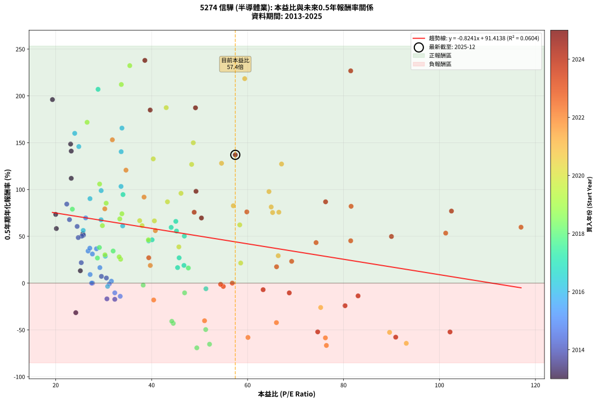
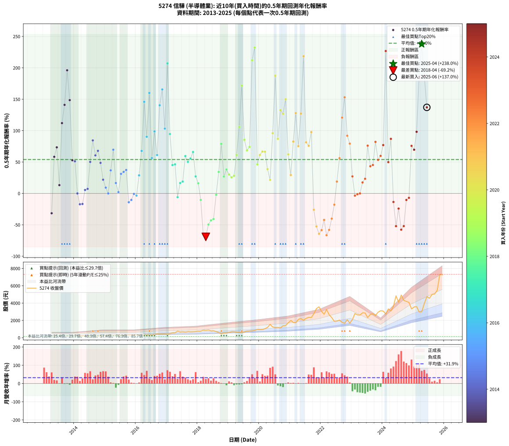

# 5274 信驊 - 本益比與未來報酬率分析

!!! info "報告資訊"
    - **股票代號**: 5274
    - **公司名稱**: 信驊
    - **產業別**: 半導體業
    - **分析期間**: 2013-2025 (147 個數據點)
    - **資料來源**: Type 12 (ShowMonthlyK_ChartFlow) 月收盤價與本益比
    - **報酬率口徑**: 含現金股利 (簡化: 年度合計，假設每年7/1入帳)
    - **報告生成時間**: 2026-01-10 21:09:21 CST

## 📈 視覺化圖表

### 圖表1: 本益比 vs 未來報酬率關係

*圖表1：5274 信驊 本益比與0.5年期未來報酬率關係 (2013-2025)*

### 圖表2: 歷年買入時點的0.5年期實際報酬率

*圖表2：5274 信驊 歷年買入時點的0.5年期實際報酬率 (2013-2025)*

## 📍 買點訊號說明

本報告提供兩種買點提示訊號（顯示於圖表2的股價子圖中）：

### ▲ 小綠色三角形（回測驗證）
- **計算方式**: 使用全部歷史資料計算本益比第25百分位數
- **用途**: 事後驗證，顯示歷史上哪些時點確實為低估區
- **限制**: 當下無法判斷，僅供回測參考
- **特性**: 後見之明（Look-Ahead Bias）

### ▲ 小橘色三角形（即時訊號）
- **計算方式**: 使用截至當月的過去5年資料計算本益比第25百分位數
- **用途**: 實際投資決策，當時即可判斷
- **優勢**: 可操作性強，符合實務需求
- **特性**: 無後見之明，滾動窗口計算

!!! tip "如何使用兩種訊號"
    - **綠色▲** 幫助理解歷史估值機會，驗證策略有效性
    - **橘色▲** 可作為實際買進參考，但仍需搭配基本面分析
    - 兩種訊號重疊時，表示即時判斷與事後驗證一致，信心度較高
    - 僅有綠色▲時，表示當時無法判斷（需要未來資料才能確認）
    - 僅有橘色▲時，表示即時判斷為買點，但事後可能不是最佳時機

## 📊 估值分析摘要

| 指標 | 數值 |
|:---:|:---:|
| **目前本益比** (2025-06) | **57.44 倍** |
| **歷史平均本益比** | 45.45 倍 |
| **估值水準** | 🔴 相對高估 |
| **預期0.5年年化報酬率** | **+44.08%** |
| **歷史平均報酬率** | +53.96% |
| **相關係數 (R²)** | 0.0604 |
| **趨勢線斜率** | -0.8241 |

!!! abstract "核心洞察"
    目前本益比顯著高於歷史平均，預期未來報酬率可能較低

    根據歷史數據回測，5274 信驊 在目前本益比 **57.4倍** 的估值水準下，
    預期未來0.5年年化報酬率約為 **+44.1%**。

    **重要提醒**: 本分析基於歷史數據統計，實際報酬率會受到公司基本面變化、產業趨勢、
    總體經濟環境等多重因素影響。R² = 0.06 表示本益比可解釋約 6.0% 的報酬率變異。

## 📈 歷史估值統計

### 最佳買點 (最高報酬率)

| 項目 | 數值 |
|:---:|:---:|
| 起始時間 | 2025-04 |
| 當時本益比 | 38.59 倍 |
| 起始價格 | 3000.0 元 |
| 0.5年後價格 | 5470.0 元 |
| **0.5年年化報酬率** | **+237.96%** |

### 最差買點 (最低報酬率)

| 項目 | 數值 |
|:---:|:---:|
| 起始時間 | 2018-04 |
| 當時本益比 | 49.42 倍 |
| 起始價格 | 850.0 元 |
| 0.5年後價格 | 456.5 元 |
| **0.5年年化報酬率** | **-69.16%** |

## 🎯 投資啟示

### 本益比與報酬率關係

趨勢線方程式: **y = -0.8241x + 91.4138**

!!! warning "強負相關"
    本益比與未來報酬率呈現強負相關。在高本益比時期買入，未來報酬率顯著較低；
    在低本益比時期買入，未來報酬率顯著較高。**估值紀律至關重要**。

### 估值區間建議

基於歷史數據分析:

- **🟢 低估區** (P/E < 36.4): 預期報酬率較高，可考慮增加持股
- **🟡 合理區** (P/E 36.4-54.5): 預期報酬率符合長期趨勢，正常持有
- **🔴 高估區** (P/E > 54.5): 預期報酬率較低，可考慮減碼或觀望

!!! danger "風險提示"
    - 過去表現不代表未來結果
    - 本分析假設公司基本面無重大結構性變化
    - 產業環境劇變可能使歷史規律失效
    - 應結合公司財報、產業趨勢、總體經濟等多重因素綜合判斷

!!! success "長期投資觀點"
    歷史數據顯示，在合理或低估的估值水準買入並長期持有，
    往往能獲得較佳的投資報酬。**耐心等待好價格**是價值投資的核心原則。

## 📊 數據品質

- **資料來源**: GoodInfo.tw Type 12 (ShowMonthlyK_ChartFlow)
- **資料頻率**: 月度收盤價與本益比
- **回測期間**: 2013-2025
- **數據點數量**: 147 個 (每個點代表一次0.5年期回測)

### 計算方法說明

1. **0.5年期年化報酬率**:
   - 對每個歷史時點，計算其後0.5年的實際投資報酬率
   - 期末價值(不含股利): 期末價格
   - 期末價值(含現金股利): 期末價格 + 持有期間內的現金股利合計 (簡化: 年度合計，假設每年7/1入帳)
   - 公式: 年化報酬率 = [(期末價值/期初價格)^(1/年數) - 1] × 100%

2. **本益比 (P/E Ratio)**:
   - 使用當時的月收盤價與EPS計算
   - 資料來源: Type 12 月度河流圖本益比數據

3. **趨勢線 (Linear Regression)**:
   - 使用最小平方法擬合線性趨勢線
   - R²值衡量本益比對報酬率的解釋能力

---

*本報告由 Stock Analysis System v1.9.0 自動生成*
*數據更新時間: 2026-01-10 21:09:21 CST*

## 📋 月度回測明細表

（每一列對應時間線圖中的一個買入點；可用來對照 SVG 圖上的每個點。）

| 買入月份 | 賣出月份 | 回測期限_年 | 實際持有年數 | 買入本益比_倍 | 買入收盤價_元 | 賣出收盤價_元 | 現金股利合計_元 | 總報酬率_pct | 年化報酬率_pct |
| --- | --- | --- | --- | --- | --- | --- | --- | --- | --- |
| 2013-04 | 2013-10 | 0.5 | 0.501 | 24.19 | 179.00 | 143.00 | 5.00 | -17.32 | -31.58 |
| 2013-05 | 2013-12 | 0.5 | 0.586 | 20.14 | 149.00 | 190.00 | 5.00 | +30.87 | +58.28 |
| 2013-06 | 2013-12 | 0.5 | 0.501 | 20.00 | 148.00 | 190.00 | 5.00 | +31.76 | +73.40 |
| 2013-07 | 2014-01 | 0.5 | 0.504 | 25.14 | 186.00 | 198.00 | 0.00 | +6.45 | +13.21 |
| 2013-08 | 2014-03 | 0.5 | 0.580 | 23.24 | 172.00 | 266.00 | 0.00 | +54.65 | +111.95 |
| 2013-09 | 2014-03 | 0.5 | 0.496 | 23.24 | 172.00 | 266.00 | 0.00 | +54.65 | +141.05 |
| 2013-10 | 2014-05 | 0.5 | 0.580 | 19.32 | 143.00 | 268.50 | 0.00 | +87.76 | +196.07 |
| 2013-11 | 2014-05 | 0.5 | 0.496 | 23.11 | 171.00 | 268.50 | 0.00 | +57.02 | +148.55 |
| 2013-12 | 2014-07 | 0.5 | 0.580 | 25.68 | 190.00 | 237.50 | 5.50 | +27.90 | +52.79 |
| 2014-01 | 2014-07 | 0.5 | 0.496 | 25.79 | 198.00 | 237.50 | 5.50 | +22.73 | +51.18 |
| 2014-02 | 2014-08 | 0.5 | 0.498 | 27.66 | 220.00 | 214.50 | 5.50 | +0.00 | +0.00 |
| 2014-03 | 2014-10 | 0.5 | 0.586 | 32.32 | 266.00 | 232.50 | 5.50 | -10.53 | -17.29 |
| 2014-04 | 2014-10 | 0.5 | 0.501 | 30.68 | 261.00 | 232.50 | 5.50 | -8.81 | -16.82 |
| 2014-05 | 2014-12 | 0.5 | 0.586 | 30.57 | 268.50 | 271.50 | 5.50 | +3.17 | +5.46 |
| 2014-06 | 2014-12 | 0.5 | 0.501 | 29.53 | 267.50 | 271.50 | 5.50 | +3.55 | +7.22 |
| 2014-07 | 2015-01 | 0.5 | 0.504 | 25.44 | 237.50 | 291.50 | 0.00 | +22.74 | +50.18 |
| 2014-08 | 2015-03 | 0.5 | 0.580 | 22.31 | 214.50 | 306.00 | 0.00 | +42.66 | +84.43 |
| 2014-09 | 2015-03 | 0.5 | 0.496 | 24.47 | 242.00 | 306.00 | 0.00 | +26.45 | +60.56 |
| 2014-10 | 2015-05 | 0.5 | 0.580 | 22.87 | 232.50 | 314.00 | 0.00 | +35.05 | +67.82 |
| 2014-11 | 2015-05 | 0.5 | 0.496 | 24.70 | 258.00 | 314.00 | 0.00 | +21.71 | +48.65 |
| 2014-12 | 2015-07 | 0.5 | 0.580 | 25.33 | 271.50 | 297.50 | 7.00 | +12.15 | +21.85 |
| 2015-01 | 2015-07 | 0.5 | 0.496 | 27.18 | 291.50 | 297.50 | 7.00 | +4.46 | +9.20 |
| 2015-02 | 2015-08 | 0.5 | 0.498 | 27.49 | 295.00 | 288.00 | 7.00 | +0.00 | +0.00 |
| 2015-03 | 2015-10 | 0.5 | 0.586 | 28.50 | 306.00 | 360.50 | 7.00 | +20.10 | +36.69 |
| 2015-04 | 2015-10 | 0.5 | 0.501 | 26.25 | 282.00 | 360.50 | 7.00 | +30.32 | +69.65 |
| 2015-05 | 2015-12 | 0.5 | 0.586 | 29.21 | 314.00 | 336.50 | 7.00 | +9.39 | +16.56 |
| 2015-06 | 2015-12 | 0.5 | 0.501 | 31.61 | 340.00 | 336.50 | 7.00 | +1.03 | +2.07 |
| 2015-07 | 2016-01 | 0.5 | 0.504 | 27.65 | 297.50 | 341.00 | 0.00 | +14.62 | +31.11 |
| 2015-08 | 2016-03 | 0.5 | 0.583 | 26.75 | 288.00 | 342.00 | 0.00 | +18.75 | +34.27 |
| 2015-09 | 2016-03 | 0.5 | 0.498 | 27.11 | 292.00 | 342.00 | 0.00 | +17.12 | +37.33 |
| 2015-10 | 2016-05 | 0.5 | 0.583 | 33.45 | 360.50 | 330.00 | 0.00 | -8.46 | -14.07 |
| 2015-11 | 2016-05 | 0.5 | 0.498 | 32.32 | 348.50 | 330.00 | 0.00 | -5.31 | -10.37 |
| 2015-12 | 2016-07 | 0.5 | 0.583 | 31.19 | 336.50 | 327.00 | 8.00 | -0.45 | -0.76 |
| 2016-01 | 2016-07 | 0.5 | 0.498 | 30.82 | 341.00 | 327.00 | 8.00 | -1.76 | -3.50 |
| 2016-02 | 2016-08 | 0.5 | 0.501 | 30.34 | 344.00 | 382.50 | 8.00 | +13.52 | +28.80 |
| 2016-03 | 2016-10 | 0.5 | 0.586 | 29.46 | 342.00 | 455.00 | 8.00 | +35.38 | +67.70 |
| 2016-04 | 2016-10 | 0.5 | 0.501 | 24.82 | 295.00 | 455.00 | 8.00 | +56.95 | +145.88 |
| 2016-05 | 2016-12 | 0.5 | 0.586 | 27.15 | 330.00 | 473.00 | 8.00 | +45.76 | +90.23 |
| 2016-06 | 2016-12 | 0.5 | 0.501 | 23.97 | 298.00 | 473.00 | 8.00 | +61.41 | +160.02 |
| 2016-07 | 2017-01 | 0.5 | 0.504 | 25.74 | 327.00 | 409.50 | 0.00 | +25.23 | +56.30 |
| 2016-08 | 2017-03 | 0.5 | 0.580 | 29.48 | 382.50 | 570.00 | 0.00 | +49.02 | +98.83 |
| 2016-09 | 2017-03 | 0.5 | 0.496 | 33.96 | 450.00 | 570.00 | 0.00 | +26.67 | +61.13 |
| 2016-10 | 2017-05 | 0.5 | 0.580 | 33.65 | 455.00 | 757.00 | 0.00 | +66.37 | +140.38 |
| 2016-11 | 2017-05 | 0.5 | 0.496 | 33.81 | 466.50 | 757.00 | 0.00 | +62.27 | +165.62 |
| 2016-12 | 2017-07 | 0.5 | 0.580 | 33.62 | 473.00 | 702.00 | 12.00 | +50.95 | +103.29 |
| 2017-01 | 2017-07 | 0.5 | 0.496 | 28.83 | 409.50 | 702.00 | 12.00 | +74.36 | +207.06 |
| 2017-02 | 2017-08 | 0.5 | 0.498 | 34.03 | 488.00 | 668.00 | 12.00 | +39.34 | +94.61 |
| 2017-03 | 2017-10 | 0.5 | 0.586 | 39.37 | 570.00 | 697.00 | 12.00 | +24.39 | +45.13 |
| 2017-04 | 2017-10 | 0.5 | 0.501 | 40.10 | 586.00 | 697.00 | 12.00 | +20.99 | +46.27 |
| 2017-05 | 2017-12 | 0.5 | 0.586 | 51.32 | 757.00 | 718.00 | 12.00 | -3.57 | -6.01 |
| 2017-06 | 2017-12 | 0.5 | 0.501 | 45.41 | 676.00 | 718.00 | 12.00 | +7.99 | +16.58 |
| 2017-07 | 2018-01 | 0.5 | 0.504 | 46.74 | 702.00 | 766.00 | 0.00 | +9.12 | +18.91 |
| 2017-08 | 2018-03 | 0.5 | 0.580 | 44.07 | 668.00 | 876.00 | 0.00 | +31.14 | +59.53 |
| 2017-09 | 2018-03 | 0.5 | 0.496 | 46.82 | 716.00 | 876.00 | 0.00 | +22.35 | +50.23 |
| 2017-10 | 2018-05 | 0.5 | 0.580 | 45.18 | 697.00 | 901.00 | 0.00 | +29.27 | +55.63 |
| 2017-11 | 2018-05 | 0.5 | 0.496 | 45.04 | 701.00 | 901.00 | 0.00 | +28.53 | +65.95 |
| 2017-12 | 2018-07 | 0.5 | 0.580 | 45.73 | 718.00 | 810.00 | 15.00 | +14.90 | +27.04 |
| 2018-01 | 2018-07 | 0.5 | 0.496 | 47.65 | 766.00 | 810.00 | 15.00 | +7.70 | +16.15 |
| 2018-02 | 2018-08 | 0.5 | 0.498 | 46.87 | 771.00 | 715.00 | 15.00 | -5.32 | -10.39 |
| 2018-03 | 2018-10 | 0.5 | 0.586 | 52.07 | 876.00 | 456.50 | 15.00 | -46.18 | -65.26 |
| 2018-04 | 2018-10 | 0.5 | 0.501 | 49.42 | 850.00 | 456.50 | 15.00 | -44.53 | -69.16 |
| 2018-05 | 2018-12 | 0.5 | 0.586 | 51.27 | 901.00 | 588.00 | 15.00 | -33.07 | -49.61 |
| 2018-06 | 2018-12 | 0.5 | 0.501 | 44.51 | 799.00 | 588.00 | 15.00 | -24.53 | -42.98 |
| 2018-07 | 2019-01 | 0.5 | 0.504 | 44.20 | 810.00 | 622.00 | 0.00 | -23.21 | -40.80 |
| 2018-08 | 2019-03 | 0.5 | 0.580 | 38.24 | 715.00 | 706.00 | 0.00 | -1.26 | -2.16 |
| 2018-09 | 2019-03 | 0.5 | 0.496 | 31.98 | 610.00 | 706.00 | 0.00 | +15.74 | +34.30 |
| 2018-10 | 2019-05 | 0.5 | 0.580 | 23.47 | 456.50 | 640.00 | 0.00 | +40.20 | +78.98 |
| 2018-11 | 2019-05 | 0.5 | 0.496 | 28.70 | 569.00 | 640.00 | 0.00 | +12.48 | +26.78 |
| 2018-12 | 2019-07 | 0.5 | 0.580 | 29.11 | 588.00 | 691.00 | 18.00 | +20.58 | +38.04 |
| 2019-01 | 2019-07 | 0.5 | 0.496 | 30.27 | 622.00 | 691.00 | 18.00 | +13.99 | +30.24 |
| 2019-02 | 2019-08 | 0.5 | 0.498 | 33.54 | 701.00 | 767.00 | 18.00 | +11.98 | +25.50 |
| 2019-03 | 2019-10 | 0.5 | 0.586 | 33.23 | 706.00 | 798.00 | 18.00 | +15.58 | +28.04 |
| 2019-04 | 2019-10 | 0.5 | 0.501 | 29.73 | 642.00 | 798.00 | 18.00 | +27.10 | +61.39 |
| 2019-05 | 2019-12 | 0.5 | 0.586 | 29.16 | 640.00 | 959.00 | 18.00 | +52.66 | +105.85 |
| 2019-06 | 2019-12 | 0.5 | 0.501 | 26.55 | 592.00 | 959.00 | 18.00 | +65.03 | +171.80 |
| 2019-07 | 2020-01 | 0.5 | 0.504 | 30.52 | 691.00 | 943.00 | 0.00 | +36.47 | +85.37 |
| 2019-08 | 2020-03 | 0.5 | 0.583 | 33.36 | 767.00 | 1040.00 | 0.00 | +35.59 | +68.56 |
| 2019-09 | 2020-03 | 0.5 | 0.498 | 33.80 | 789.00 | 1040.00 | 0.00 | +31.81 | +74.08 |
| 2019-10 | 2020-05 | 0.5 | 0.583 | 33.68 | 798.00 | 1550.00 | 0.00 | +94.24 | +212.19 |
| 2019-11 | 2020-05 | 0.5 | 0.498 | 35.44 | 852.00 | 1550.00 | 0.00 | +81.92 | +232.33 |
| 2019-12 | 2020-07 | 0.5 | 0.583 | 39.32 | 959.00 | 1175.00 | 22.00 | +24.82 | +46.25 |
| 2020-01 | 2020-07 | 0.5 | 0.498 | 38.02 | 943.00 | 1175.00 | 22.00 | +26.94 | +61.39 |
| 2020-02 | 2020-08 | 0.5 | 0.501 | 37.51 | 946.00 | 1200.00 | 22.00 | +29.18 | +66.69 |
| 2020-03 | 2020-10 | 0.5 | 0.586 | 40.57 | 1040.00 | 1380.00 | 22.00 | +34.81 | +66.49 |
| 2020-04 | 2020-10 | 0.5 | 0.501 | 45.68 | 1190.00 | 1380.00 | 22.00 | +17.82 | +38.71 |
| 2020-05 | 2020-12 | 0.5 | 0.586 | 58.56 | 1550.00 | 1715.00 | 22.00 | +12.06 | +21.46 |
| 2020-06 | 2020-12 | 0.5 | 0.501 | 46.12 | 1240.00 | 1715.00 | 22.00 | +40.08 | +95.96 |
| 2020-07 | 2021-01 | 0.5 | 0.504 | 43.04 | 1175.00 | 2000.00 | 0.00 | +70.21 | +187.43 |
| 2020-08 | 2021-03 | 0.5 | 0.580 | 43.30 | 1200.00 | 1725.00 | 0.00 | +43.75 | +86.87 |
| 2020-09 | 2021-03 | 0.5 | 0.496 | 40.34 | 1135.00 | 1725.00 | 0.00 | +51.98 | +132.73 |
| 2020-10 | 2021-05 | 0.5 | 0.580 | 48.34 | 1380.00 | 2220.00 | 0.00 | +60.87 | +126.84 |
| 2020-11 | 2021-05 | 0.5 | 0.496 | 48.68 | 1410.00 | 2220.00 | 0.00 | +57.45 | +149.92 |
| 2020-12 | 2021-07 | 0.5 | 0.580 | 58.37 | 1715.00 | 2245.00 | 26.00 | +32.42 | +62.22 |
| 2021-01 | 2021-07 | 0.5 | 0.496 | 66.39 | 2000.00 | 2245.00 | 26.00 | +13.55 | +29.23 |
| 2021-02 | 2021-08 | 0.5 | 0.498 | 57.02 | 1760.00 | 2350.00 | 26.00 | +35.00 | +82.63 |
| 2021-03 | 2021-10 | 0.5 | 0.586 | 54.57 | 1725.00 | 2770.00 | 26.00 | +62.09 | +128.03 |
| 2021-04 | 2021-10 | 0.5 | 0.501 | 65.22 | 2110.00 | 2770.00 | 26.00 | +32.51 | +75.39 |
| 2021-05 | 2021-12 | 0.5 | 0.586 | 67.08 | 2220.00 | 3565.00 | 26.00 | +61.76 | +127.24 |
| 2021-06 | 2021-12 | 0.5 | 0.501 | 59.40 | 2010.00 | 3565.00 | 26.00 | +78.66 | +218.42 |
| 2021-07 | 2022-01 | 0.5 | 0.504 | 64.92 | 2245.00 | 3030.00 | 0.00 | +34.97 | +81.35 |
| 2021-08 | 2022-03 | 0.5 | 0.580 | 66.52 | 2350.00 | 3260.00 | 0.00 | +38.72 | +75.75 |
| 2021-09 | 2022-03 | 0.5 | 0.496 | 64.46 | 2325.00 | 3260.00 | 0.00 | +40.22 | +97.80 |
| 2021-10 | 2022-05 | 0.5 | 0.580 | 75.24 | 2770.00 | 2325.00 | 0.00 | -16.06 | -26.05 |
| 2021-11 | 2022-05 | 0.5 | 0.496 | 89.60 | 3365.00 | 2325.00 | 0.00 | -30.91 | -52.58 |
| 2021-12 | 2022-07 | 0.5 | 0.580 | 93.08 | 3565.00 | 1925.00 | 35.00 | -45.02 | -64.32 |
| 2022-01 | 2022-07 | 0.5 | 0.496 | 76.22 | 3030.00 | 1925.00 | 35.00 | -35.31 | -58.48 |
| 2022-02 | 2022-08 | 0.5 | 0.498 | 66.01 | 2720.00 | 2035.00 | 35.00 | -23.90 | -42.19 |
| 2022-03 | 2022-10 | 0.5 | 0.586 | 76.43 | 3260.00 | 1680.00 | 35.00 | -47.39 | -66.59 |
| 2022-04 | 2022-10 | 0.5 | 0.501 | 60.08 | 2650.00 | 1680.00 | 35.00 | -35.28 | -58.04 |
| 2022-05 | 2022-12 | 0.5 | 0.586 | 51.03 | 2325.00 | 1685.00 | 35.00 | -26.02 | -40.21 |
| 2022-06 | 2022-12 | 0.5 | 0.501 | 40.42 | 1900.00 | 1685.00 | 35.00 | -9.47 | -18.02 |
| 2022-07 | 2023-01 | 0.5 | 0.504 | 39.72 | 1925.00 | 2100.00 | 0.00 | +9.09 | +18.85 |
| 2022-08 | 2023-03 | 0.5 | 0.580 | 40.77 | 2035.00 | 2635.00 | 0.00 | +29.48 | +56.08 |
| 2022-09 | 2023-03 | 0.5 | 0.496 | 34.65 | 1780.00 | 2635.00 | 0.00 | +48.03 | +120.69 |
| 2022-10 | 2023-05 | 0.5 | 0.580 | 31.81 | 1680.00 | 2880.00 | 0.00 | +71.43 | +153.10 |
| 2022-11 | 2023-05 | 0.5 | 0.496 | 38.42 | 2085.00 | 2880.00 | 0.00 | +38.13 | +91.91 |
| 2022-12 | 2023-07 | 0.5 | 0.580 | 30.24 | 1685.00 | 2320.00 | 45.00 | +40.36 | +79.33 |
| 2023-01 | 2023-07 | 0.5 | 0.496 | 39.40 | 2100.00 | 2320.00 | 45.00 | +12.62 | +27.10 |
| 2023-02 | 2023-08 | 0.5 | 0.498 | 54.94 | 2795.00 | 2700.00 | 45.00 | -1.79 | -3.56 |
| 2023-03 | 2023-10 | 0.5 | 0.586 | 54.38 | 2635.00 | 2570.00 | 45.00 | -0.76 | -1.29 |
| 2023-04 | 2023-10 | 0.5 | 0.501 | 56.81 | 2615.00 | 2570.00 | 45.00 | +0.00 | +0.00 |
| 2023-05 | 2023-12 | 0.5 | 0.586 | 66.04 | 2880.00 | 3120.00 | 45.00 | +9.90 | +17.48 |
| 2023-06 | 2023-12 | 0.5 | 0.501 | 69.19 | 2850.00 | 3120.00 | 45.00 | +11.05 | +23.27 |
| 2023-07 | 2024-01 | 0.5 | 0.504 | 59.84 | 2320.00 | 3085.00 | 0.00 | +32.97 | +76.07 |
| 2023-08 | 2024-03 | 0.5 | 0.583 | 74.28 | 2700.00 | 3330.00 | 0.00 | +23.33 | +43.28 |
| 2023-09 | 2024-03 | 0.5 | 0.498 | 81.50 | 2765.00 | 3330.00 | 0.00 | +20.43 | +45.23 |
| 2023-10 | 2024-05 | 0.5 | 0.583 | 81.58 | 2570.00 | 3645.00 | 0.00 | +41.83 | +82.07 |
| 2023-11 | 2024-05 | 0.5 | 0.498 | 101.30 | 2945.00 | 3645.00 | 0.00 | +23.77 | +53.41 |
| 2023-12 | 2024-07 | 0.5 | 0.583 | 117.00 | 3120.00 | 4080.00 | 20.00 | +31.41 | +59.74 |
| 2024-01 | 2024-07 | 0.5 | 0.498 | 102.50 | 3085.00 | 4080.00 | 20.00 | +32.90 | +76.97 |
| 2024-02 | 2024-08 | 0.5 | 0.501 | 81.50 | 2735.00 | 4930.00 | 20.00 | +80.99 | +226.77 |
| 2024-03 | 2024-10 | 0.5 | 0.586 | 89.99 | 3330.00 | 4200.00 | 20.00 | +26.73 | +49.82 |
| 2024-04 | 2024-10 | 0.5 | 0.501 | 76.26 | 3085.00 | 4200.00 | 20.00 | +36.79 | +86.88 |
| 2024-05 | 2024-12 | 0.5 | 0.586 | 83.03 | 3645.00 | 3325.00 | 20.00 | -8.23 | -13.64 |
| 2024-06 | 2024-12 | 0.5 | 0.501 | 102.20 | 4840.00 | 3325.00 | 20.00 | -30.89 | -52.16 |
| 2024-07 | 2025-01 | 0.5 | 0.504 | 80.32 | 4080.00 | 3550.00 | 0.00 | -12.99 | -24.14 |
| 2024-08 | 2025-03 | 0.5 | 0.580 | 90.88 | 4930.00 | 2990.00 | 0.00 | -39.35 | -57.75 |
| 2024-09 | 2025-03 | 0.5 | 0.496 | 74.62 | 4305.00 | 2990.00 | 0.00 | -30.55 | -52.08 |
| 2024-10 | 2025-05 | 0.5 | 0.580 | 68.69 | 4200.00 | 3940.00 | 0.00 | -6.19 | -10.43 |
| 2024-11 | 2025-05 | 0.5 | 0.496 | 63.24 | 4085.00 | 3940.00 | 0.00 | -3.55 | -7.03 |
| 2024-12 | 2025-07 | 0.5 | 0.580 | 48.87 | 3325.00 | 4560.00 | 52.00 | +38.71 | +75.72 |
| 2025-01 | 2025-07 | 0.5 | 0.496 | 50.38 | 3550.00 | 4560.00 | 52.00 | +29.92 | +69.58 |
| 2025-02 | 2025-08 | 0.5 | 0.498 | 49.25 | 3590.00 | 4995.00 | 52.00 | +40.58 | +98.10 |
| 2025-03 | 2025-10 | 0.5 | 0.586 | 39.70 | 2990.00 | 5470.00 | 52.00 | +84.68 | +184.92 |
| 2025-04 | 2025-10 | 0.5 | 0.501 | 38.59 | 3000.00 | 5470.00 | 52.00 | +84.07 | +237.96 |
| 2025-05 | 2025-12 | 0.5 | 0.586 | 49.14 | 3940.00 | 7260.00 | 52.00 | +85.58 | +187.30 |
| 2025-06 | 2025-12 | 0.5 | 0.501 | 57.44 | 4745.00 | 7260.00 | 52.00 | +54.10 | +137.04 |
