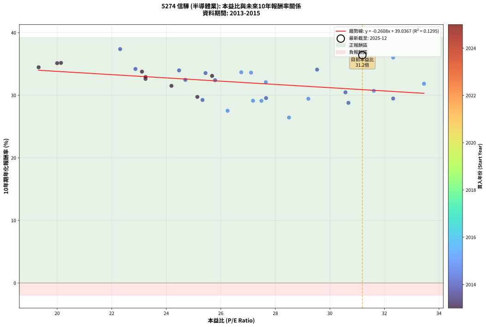
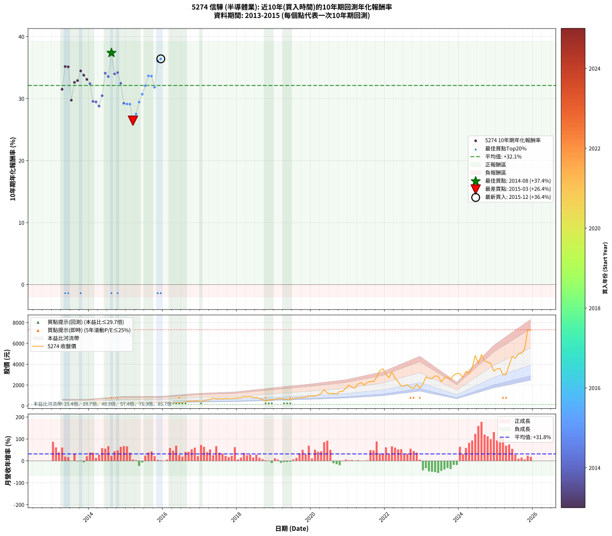

# 5274 信驊 - 本益比與未來報酬率分析

!!! info "報告資訊"
    - **股票代號**: 5274
    - **公司名稱**: 信驊
    - **產業別**: 半導體業
    - **分析期間**: 2013-2015 (33 個數據點)
    - **資料來源**: Type 12 (ShowMonthlyK_ChartFlow) 月收盤價與本益比
    - **報酬率口徑**: 含現金股利 (簡化: 年度合計，假設每年7/1入帳)
    - **報告生成時間**: 2026-01-11 21:11:24 CST

## 📈 視覺化圖表

### 圖表1: 本益比 vs 未來報酬率關係

*圖表1：5274 信驊 本益比與10年期未來報酬率關係 (2013-2015)*

### 圖表2: 歷年買入時點的10年期實際報酬率

*圖表2：5274 信驊 歷年買入時點的10年期實際報酬率 (2013-2015)*

## 📍 買點訊號說明

本報告提供兩種買點提示訊號（顯示於圖表2的股價子圖中）：

### ▲ 小綠色三角形（回測驗證）
- **計算方式**: 使用全部歷史資料計算本益比第25百分位數
- **用途**: 事後驗證，顯示歷史上哪些時點確實為低估區
- **限制**: 當下無法判斷，僅供回測參考
- **特性**: 後見之明（Look-Ahead Bias）

### ▲ 小橘色三角形（即時訊號）
- **計算方式**: 使用截至當月的過去5年資料計算本益比第25百分位數
- **用途**: 實際投資決策，當時即可判斷
- **優勢**: 可操作性強，符合實務需求
- **特性**: 無後見之明，滾動窗口計算

!!! tip "如何使用兩種訊號"
    - **綠色▲** 幫助理解歷史估值機會，驗證策略有效性
    - **橘色▲** 可作為實際買進參考，但仍需搭配基本面分析
    - 兩種訊號重疊時，表示即時判斷與事後驗證一致，信心度較高
    - 僅有綠色▲時，表示當時無法判斷（需要未來資料才能確認）
    - 僅有橘色▲時，表示即時判斷為買點，但事後可能不是最佳時機

## 📊 估值分析摘要

| 指標 | 數值 |
|:---:|:---:|
| **目前本益比** (2015-12) | **31.19 倍** |
| **歷史平均本益比** | 26.50 倍 |
| **估值水準** | 🟡 合理範圍 |
| **預期10年年化報酬率** | **+30.90%** |
| **歷史平均報酬率** | +32.12% |
| **相關係數 (R²)** | 0.1295 |
| **趨勢線斜率** | -0.2608 |

!!! abstract "核心洞察"
    目前本益比接近歷史平均，預期報酬率符合長期趨勢

    根據歷史數據回測，5274 信驊 在目前本益比 **31.2倍** 的估值水準下，
    預期未來10年年化報酬率約為 **+30.9%**。

    **重要提醒**: 本分析基於歷史數據統計，實際報酬率會受到公司基本面變化、產業趨勢、
    總體經濟環境等多重因素影響。R² = 0.13 表示本益比可解釋約 12.9% 的報酬率變異。

## 📈 歷史估值統計

### 最佳買點 (最高報酬率)

| 項目 | 數值 |
|:---:|:---:|
| 起始時間 | 2014-08 |
| 當時本益比 | 22.31 倍 |
| 起始價格 | 214.5 元 |
| 10年後價格 | 4930.0 元 |
| **10年年化報酬率** | **+37.38%** |

### 最差買點 (最低報酬率)

| 項目 | 數值 |
|:---:|:---:|
| 起始時間 | 2015-03 |
| 當時本益比 | 28.50 倍 |
| 起始價格 | 306.0 元 |
| 10年後價格 | 2990.0 元 |
| **10年年化報酬率** | **+26.45%** |

## 🎯 投資啟示

### 本益比與報酬率關係

趨勢線方程式: **y = -0.2608x + 39.0367**

!!! note "負相關"
    本益比與未來報酬率呈現負相關。較低的本益比通常帶來較高的未來報酬率，
    但相關性不算非常強。**估值仍是重要參考指標之一**。

### 估值區間建議

基於歷史數據分析:

- **🟢 低估區** (P/E < 21.2): 預期報酬率較高，可考慮增加持股
- **🟡 合理區** (P/E 21.2-31.8): 預期報酬率符合長期趨勢，正常持有
- **🔴 高估區** (P/E > 31.8): 預期報酬率較低，可考慮減碼或觀望

!!! danger "風險提示"
    - 過去表現不代表未來結果
    - 本分析假設公司基本面無重大結構性變化
    - 產業環境劇變可能使歷史規律失效
    - 應結合公司財報、產業趨勢、總體經濟等多重因素綜合判斷

!!! success "長期投資觀點"
    歷史數據顯示，在合理或低估的估值水準買入並長期持有，
    往往能獲得較佳的投資報酬。**耐心等待好價格**是價值投資的核心原則。

## 📊 數據品質

- **資料來源**: GoodInfo.tw Type 12 (ShowMonthlyK_ChartFlow)
- **資料頻率**: 月度收盤價與本益比
- **回測期間**: 2013-2015
- **數據點數量**: 33 個 (每個點代表一次10年期回測)

### 計算方法說明

1. **10年期年化報酬率**:
   - 對每個歷史時點，計算其後10年的實際投資報酬率
   - 期末價值(不含股利): 期末價格
   - 期末價值(含現金股利): 期末價格 + 持有期間內的現金股利合計 (簡化: 年度合計，假設每年7/1入帳)
   - 公式: 年化報酬率 = [(期末價值/期初價格)^(1/年數) - 1] × 100%

2. **本益比 (P/E Ratio)**:
   - 使用當時的月收盤價與EPS計算
   - 資料來源: Type 12 月度河流圖本益比數據

3. **趨勢線 (Linear Regression)**:
   - 使用最小平方法擬合線性趨勢線
   - R²值衡量本益比對報酬率的解釋能力

---

*本報告由 Stock Analysis System v1.9.0 自動生成*
*數據更新時間: 2026-01-11 21:11:24 CST*

## 📋 月度回測明細表

（每一列對應時間線圖中的一個買入點；可用來對照 SVG 圖上的每個點。）

| 買入月份 | 賣出月份 | 回測期限_年 | 實際持有年數 | 買入本益比_倍 | 買入收盤價_元 | 賣出收盤價_元 | 現金股利合計_元 | 總報酬率_pct | 年化報酬率_pct |
| --- | --- | --- | --- | --- | --- | --- | --- | --- | --- |
| 2013-04 | 2023-04 | 10 | 9.999 | 24.19 | 179.00 | 2615.00 | 153.50 | +1446.65 | +31.51 |
| 2013-05 | 2023-05 | 10 | 9.999 | 20.14 | 149.00 | 2880.00 | 153.50 | +1935.91 | +35.17 |
| 2013-06 | 2023-06 | 10 | 9.999 | 20.00 | 148.00 | 2850.00 | 153.50 | +1929.39 | +35.13 |
| 2013-07 | 2023-07 | 10 | 9.999 | 25.14 | 186.00 | 2320.00 | 193.50 | +1251.35 | +29.75 |
| 2013-08 | 2023-08 | 10 | 9.999 | 23.24 | 172.00 | 2700.00 | 193.50 | +1582.27 | +32.62 |
| 2013-09 | 2023-09 | 10 | 9.999 | 23.24 | 172.00 | 2765.00 | 193.50 | +1620.06 | +32.91 |
| 2013-10 | 2023-10 | 10 | 9.999 | 19.32 | 143.00 | 2570.00 | 193.50 | +1832.52 | +34.47 |
| 2013-11 | 2023-11 | 10 | 9.999 | 23.11 | 171.00 | 2945.00 | 193.50 | +1735.38 | +33.78 |
| 2013-12 | 2023-12 | 10 | 9.999 | 25.68 | 190.00 | 3120.00 | 193.50 | +1643.95 | +33.10 |
| 2014-01 | 2024-01 | 10 | 9.999 | 25.79 | 198.00 | 3085.00 | 193.50 | +1555.81 | +32.41 |
| 2014-02 | 2024-02 | 10 | 9.999 | 27.66 | 220.00 | 2735.00 | 193.50 | +1231.14 | +29.55 |
| 2014-03 | 2024-03 | 10 | 10.001 | 32.32 | 266.00 | 3330.00 | 193.50 | +1224.62 | +29.48 |
| 2014-04 | 2024-04 | 10 | 10.001 | 30.68 | 261.00 | 3085.00 | 193.50 | +1156.13 | +28.79 |
| 2014-05 | 2024-05 | 10 | 10.001 | 30.57 | 268.50 | 3645.00 | 193.50 | +1329.61 | +30.47 |
| 2014-06 | 2024-06 | 10 | 10.001 | 29.53 | 267.50 | 4840.00 | 193.50 | +1781.68 | +34.10 |
| 2014-07 | 2024-07 | 10 | 10.001 | 25.44 | 237.50 | 4080.00 | 208.00 | +1705.47 | +33.55 |
| 2014-08 | 2024-08 | 10 | 10.001 | 22.31 | 214.50 | 4930.00 | 208.00 | +2295.34 | +37.38 |
| 2014-09 | 2024-09 | 10 | 10.001 | 24.47 | 242.00 | 4305.00 | 208.00 | +1764.88 | +33.98 |
| 2014-10 | 2024-10 | 10 | 10.001 | 22.87 | 232.50 | 4200.00 | 208.00 | +1795.91 | +34.20 |
| 2014-11 | 2024-11 | 10 | 10.001 | 24.70 | 258.00 | 4085.00 | 208.00 | +1563.95 | +32.46 |
| 2014-12 | 2024-12 | 10 | 10.001 | 25.33 | 271.50 | 3325.00 | 208.00 | +1201.29 | +29.25 |
| 2015-01 | 2025-01 | 10 | 10.001 | 27.18 | 291.50 | 3550.00 | 208.00 | +1189.19 | +29.13 |
| 2015-02 | 2025-02 | 10 | 10.001 | 27.49 | 295.00 | 3590.00 | 208.00 | +1187.46 | +29.11 |
| 2015-03 | 2025-03 | 10 | 10.001 | 28.50 | 306.00 | 2990.00 | 208.00 | +945.10 | +26.45 |
| 2015-04 | 2025-04 | 10 | 10.001 | 26.25 | 282.00 | 3000.00 | 208.00 | +1037.59 | +27.52 |
| 2015-05 | 2025-05 | 10 | 10.001 | 29.21 | 314.00 | 3940.00 | 208.00 | +1221.02 | +29.44 |
| 2015-06 | 2025-06 | 10 | 10.001 | 31.61 | 340.00 | 4745.00 | 208.00 | +1356.76 | +30.71 |
| 2015-07 | 2025-07 | 10 | 10.001 | 27.65 | 297.50 | 4560.00 | 253.00 | +1517.82 | +32.09 |
| 2015-08 | 2025-08 | 10 | 10.001 | 26.75 | 288.00 | 4995.00 | 253.00 | +1722.22 | +33.67 |
| 2015-09 | 2025-09 | 10 | 10.001 | 27.11 | 292.00 | 5050.00 | 253.00 | +1716.10 | +33.63 |
| 2015-10 | 2025-10 | 10 | 10.001 | 33.45 | 360.50 | 5470.00 | 253.00 | +1487.52 | +31.84 |
| 2015-11 | 2025-11 | 10 | 10.001 | 32.32 | 348.50 | 7315.00 | 253.00 | +2071.59 | +36.04 |
| 2015-12 | 2025-12 | 10 | 10.001 | 31.19 | 336.50 | 7260.00 | 253.00 | +2132.69 | +36.42 |
