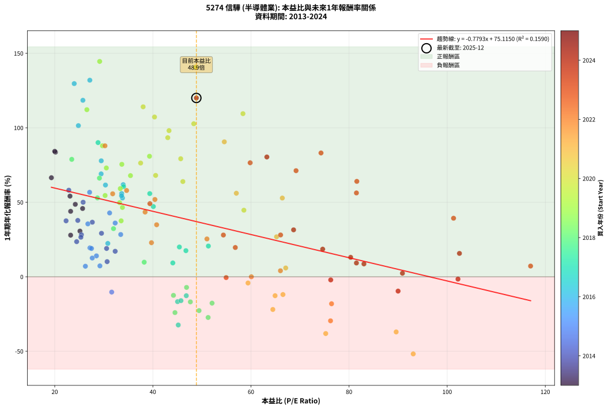
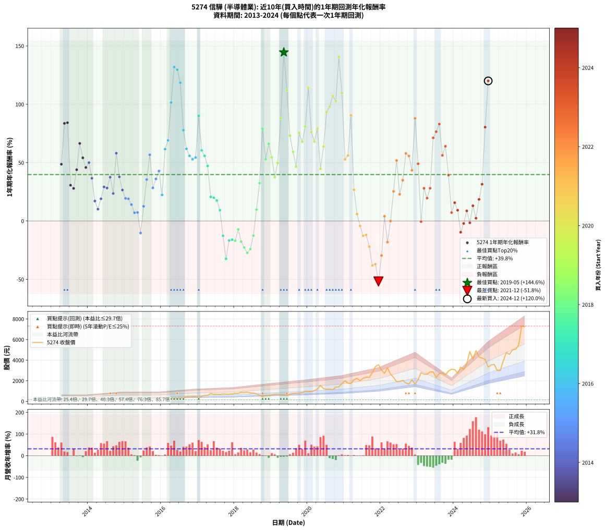

# 5274 信驊 - 本益比與未來報酬率分析

!!! info "報告資訊"
    - **股票代號**: 5274
    - **公司名稱**: 信驊
    - **產業別**: 半導體業
    - **分析期間**: 2013-2024 (141 個數據點)
    - **資料來源**: Type 12 (ShowMonthlyK_ChartFlow) 月收盤價與本益比
    - **報酬率口徑**: 含現金股利 (簡化: 年度合計，假設每年7/1入帳)
    - **報告生成時間**: 2026-01-12 21:14:47 CST

## 📈 視覺化圖表

### 圖表1: 本益比 vs 未來報酬率關係

*圖表1：5274 信驊 本益比與1年期未來報酬率關係 (2013-2024)*

### 圖表2: 歷年買入時點的1年期實際報酬率

*圖表2：5274 信驊 歷年買入時點的1年期實際報酬率 (2013-2024)*

## 📍 買點訊號說明

本報告提供兩種買點提示訊號（顯示於圖表2的股價子圖中）：

### ▲ 小綠色三角形（回測驗證）
- **計算方式**: 使用全部歷史資料計算本益比第25百分位數
- **用途**: 事後驗證，顯示歷史上哪些時點確實為低估區
- **限制**: 當下無法判斷，僅供回測參考
- **特性**: 後見之明（Look-Ahead Bias）

### ▲ 小橘色三角形（即時訊號）
- **計算方式**: 使用截至當月的過去5年資料計算本益比第25百分位數
- **用途**: 實際投資決策，當時即可判斷
- **優勢**: 可操作性強，符合實務需求
- **特性**: 無後見之明，滾動窗口計算

!!! tip "如何使用兩種訊號"
    - **綠色▲** 幫助理解歷史估值機會，驗證策略有效性
    - **橘色▲** 可作為實際買進參考，但仍需搭配基本面分析
    - 兩種訊號重疊時，表示即時判斷與事後驗證一致，信心度較高
    - 僅有綠色▲時，表示當時無法判斷（需要未來資料才能確認）
    - 僅有橘色▲時，表示即時判斷為買點，但事後可能不是最佳時機

## 📊 估值分析摘要

| 指標 | 數值 |
|:---:|:---:|
| **目前本益比** (2024-12) | **48.87 倍** |
| **歷史平均本益比** | 45.36 倍 |
| **估值水準** | 🟡 合理範圍 |
| **預期1年年化報酬率** | **+37.03%** |
| **歷史平均報酬率** | +39.77% |
| **相關係數 (R²)** | 0.1590 |
| **趨勢線斜率** | -0.7793 |

!!! abstract "核心洞察"
    目前本益比接近歷史平均，預期報酬率符合長期趨勢

    根據歷史數據回測，5274 信驊 在目前本益比 **48.9倍** 的估值水準下，
    預期未來1年年化報酬率約為 **+37.0%**。

    **重要提醒**: 本分析基於歷史數據統計，實際報酬率會受到公司基本面變化、產業趨勢、
    總體經濟環境等多重因素影響。R² = 0.16 表示本益比可解釋約 15.9% 的報酬率變異。

## 📈 歷史估值統計

### 最佳買點 (最高報酬率)

| 項目 | 數值 |
|:---:|:---:|
| 起始時間 | 2019-05 |
| 當時本益比 | 29.16 倍 |
| 起始價格 | 640.0 元 |
| 1年後價格 | 1550.0 元 |
| **1年年化報酬率** | **+144.55%** |

### 最差買點 (最低報酬率)

| 項目 | 數值 |
|:---:|:---:|
| 起始時間 | 2021-12 |
| 當時本益比 | 93.08 倍 |
| 起始價格 | 3565.0 元 |
| 1年後價格 | 1685.0 元 |
| **1年年化報酬率** | **-51.78%** |

## 🎯 投資啟示

### 本益比與報酬率關係

趨勢線方程式: **y = -0.7793x + 75.1150**

!!! warning "強負相關"
    本益比與未來報酬率呈現強負相關。在高本益比時期買入，未來報酬率顯著較低；
    在低本益比時期買入，未來報酬率顯著較高。**估值紀律至關重要**。

### 估值區間建議

基於歷史數據分析:

- **🟢 低估區** (P/E < 36.3): 預期報酬率較高，可考慮增加持股
- **🟡 合理區** (P/E 36.3-54.4): 預期報酬率符合長期趨勢，正常持有
- **🔴 高估區** (P/E > 54.4): 預期報酬率較低，可考慮減碼或觀望

!!! danger "風險提示"
    - 過去表現不代表未來結果
    - 本分析假設公司基本面無重大結構性變化
    - 產業環境劇變可能使歷史規律失效
    - 應結合公司財報、產業趨勢、總體經濟等多重因素綜合判斷

!!! success "長期投資觀點"
    歷史數據顯示，在合理或低估的估值水準買入並長期持有，
    往往能獲得較佳的投資報酬。**耐心等待好價格**是價值投資的核心原則。

## 📊 數據品質

- **資料來源**: GoodInfo.tw Type 12 (ShowMonthlyK_ChartFlow)
- **資料頻率**: 月度收盤價與本益比
- **回測期間**: 2013-2024
- **數據點數量**: 141 個 (每個點代表一次1年期回測)

### 計算方法說明

1. **1年期年化報酬率**:
   - 對每個歷史時點，計算其後1年的實際投資報酬率
   - 期末價值(不含股利): 期末價格
   - 期末價值(含現金股利): 期末價格 + 持有期間內的現金股利合計 (簡化: 年度合計，假設每年7/1入帳)
   - 公式: 年化報酬率 = [(期末價值/期初價格)^(1/年數) - 1] × 100%

2. **本益比 (P/E Ratio)**:
   - 使用當時的月收盤價與EPS計算
   - 資料來源: Type 12 月度河流圖本益比數據

3. **趨勢線 (Linear Regression)**:
   - 使用最小平方法擬合線性趨勢線
   - R²值衡量本益比對報酬率的解釋能力

---

*本報告由 Stock Analysis System v1.9.0 自動生成*
*數據更新時間: 2026-01-12 21:14:47 CST*

## 📋 月度回測明細表

（每一列對應時間線圖中的一個買入點；可用來對照 SVG 圖上的每個點。）

| 買入月份 | 賣出月份 | 回測期限_年 | 實際持有年數 | 買入本益比_倍 | 買入收盤價_元 | 賣出收盤價_元 | 現金股利合計_元 | 總報酬率_pct | 年化報酬率_pct |
| --- | --- | --- | --- | --- | --- | --- | --- | --- | --- |
| 2013-04 | 2014-04 | 1 | 0.999 | 24.19 | 179.00 | 261.00 | 5.00 | +48.60 | +48.64 |
| 2013-05 | 2014-05 | 1 | 0.999 | 20.14 | 149.00 | 268.50 | 5.00 | +83.56 | +83.63 |
| 2013-06 | 2014-06 | 1 | 0.999 | 20.00 | 148.00 | 267.50 | 5.00 | +84.12 | +84.20 |
| 2013-07 | 2014-07 | 1 | 0.999 | 25.14 | 186.00 | 237.50 | 5.50 | +30.65 | +30.67 |
| 2013-08 | 2014-08 | 1 | 0.999 | 23.24 | 172.00 | 214.50 | 5.50 | +27.91 | +27.93 |
| 2013-09 | 2014-09 | 1 | 0.999 | 23.24 | 172.00 | 242.00 | 5.50 | +43.90 | +43.93 |
| 2013-10 | 2014-10 | 1 | 0.999 | 19.32 | 143.00 | 232.50 | 5.50 | +66.43 | +66.49 |
| 2013-11 | 2014-11 | 1 | 0.999 | 23.11 | 171.00 | 258.00 | 5.50 | +54.09 | +54.14 |
| 2013-12 | 2014-12 | 1 | 0.999 | 25.68 | 190.00 | 271.50 | 5.50 | +45.79 | +45.83 |
| 2014-01 | 2015-01 | 1 | 0.999 | 25.79 | 198.00 | 291.50 | 5.50 | +50.00 | +50.04 |
| 2014-02 | 2015-02 | 1 | 0.999 | 27.66 | 220.00 | 295.00 | 5.50 | +36.59 | +36.62 |
| 2014-03 | 2015-03 | 1 | 0.999 | 32.32 | 266.00 | 306.00 | 5.50 | +17.11 | +17.12 |
| 2014-04 | 2015-04 | 1 | 0.999 | 30.68 | 261.00 | 282.00 | 5.50 | +10.15 | +10.16 |
| 2014-05 | 2015-05 | 1 | 0.999 | 30.57 | 268.50 | 314.00 | 5.50 | +19.00 | +19.01 |
| 2014-06 | 2015-06 | 1 | 0.999 | 29.53 | 267.50 | 340.00 | 5.50 | +29.16 | +29.18 |
| 2014-07 | 2015-07 | 1 | 0.999 | 25.44 | 237.50 | 297.50 | 7.00 | +28.21 | +28.23 |
| 2014-08 | 2015-08 | 1 | 0.999 | 22.31 | 214.50 | 288.00 | 7.00 | +37.53 | +37.56 |
| 2014-09 | 2015-09 | 1 | 0.999 | 24.47 | 242.00 | 292.00 | 7.00 | +23.55 | +23.57 |
| 2014-10 | 2015-10 | 1 | 0.999 | 22.87 | 232.50 | 360.50 | 7.00 | +58.06 | +58.11 |
| 2014-11 | 2015-11 | 1 | 0.999 | 24.70 | 258.00 | 348.50 | 7.00 | +37.79 | +37.82 |
| 2014-12 | 2015-12 | 1 | 0.999 | 25.33 | 271.50 | 336.50 | 7.00 | +26.52 | +26.54 |
| 2015-01 | 2016-01 | 1 | 0.999 | 27.18 | 291.50 | 341.00 | 7.00 | +19.38 | +19.40 |
| 2015-02 | 2016-02 | 1 | 0.999 | 27.49 | 295.00 | 344.00 | 7.00 | +18.98 | +19.00 |
| 2015-03 | 2016-03 | 1 | 1.002 | 28.50 | 306.00 | 342.00 | 7.00 | +14.05 | +14.02 |
| 2015-04 | 2016-04 | 1 | 1.002 | 26.25 | 282.00 | 295.00 | 7.00 | +7.09 | +7.08 |
| 2015-05 | 2016-05 | 1 | 1.002 | 29.21 | 314.00 | 330.00 | 7.00 | +7.32 | +7.31 |
| 2015-06 | 2016-06 | 1 | 1.002 | 31.61 | 340.00 | 298.00 | 7.00 | -10.29 | -10.27 |
| 2015-07 | 2016-07 | 1 | 1.002 | 27.65 | 297.50 | 327.00 | 8.00 | +12.61 | +12.58 |
| 2015-08 | 2016-08 | 1 | 1.002 | 26.75 | 288.00 | 382.50 | 8.00 | +35.59 | +35.51 |
| 2015-09 | 2016-09 | 1 | 1.002 | 27.11 | 292.00 | 450.00 | 8.00 | +56.85 | +56.70 |
| 2015-10 | 2016-10 | 1 | 1.002 | 33.45 | 360.50 | 455.00 | 8.00 | +28.43 | +28.37 |
| 2015-11 | 2016-11 | 1 | 1.002 | 32.32 | 348.50 | 466.50 | 8.00 | +36.15 | +36.07 |
| 2015-12 | 2016-12 | 1 | 1.002 | 31.19 | 336.50 | 473.00 | 8.00 | +42.94 | +42.84 |
| 2016-01 | 2017-01 | 1 | 1.002 | 30.82 | 341.00 | 409.50 | 8.00 | +22.43 | +22.38 |
| 2016-02 | 2017-03 | 1 | 1.081 | 30.34 | 344.00 | 570.00 | 8.00 | +68.02 | +61.58 |
| 2016-03 | 2017-03 | 1 | 0.999 | 29.46 | 342.00 | 570.00 | 8.00 | +69.01 | +69.07 |
| 2016-04 | 2017-04 | 1 | 0.999 | 24.82 | 295.00 | 586.00 | 8.00 | +101.36 | +101.45 |
| 2016-05 | 2017-05 | 1 | 0.999 | 27.15 | 330.00 | 757.00 | 8.00 | +131.82 | +131.95 |
| 2016-06 | 2017-06 | 1 | 0.999 | 23.97 | 298.00 | 676.00 | 8.00 | +129.53 | +129.66 |
| 2016-07 | 2017-07 | 1 | 0.999 | 25.74 | 327.00 | 702.00 | 12.00 | +118.35 | +118.47 |
| 2016-08 | 2017-08 | 1 | 0.999 | 29.48 | 382.50 | 668.00 | 12.00 | +77.78 | +77.85 |
| 2016-09 | 2017-09 | 1 | 0.999 | 33.96 | 450.00 | 716.00 | 12.00 | +61.78 | +61.83 |
| 2016-10 | 2017-10 | 1 | 0.999 | 33.65 | 455.00 | 697.00 | 12.00 | +55.82 | +55.87 |
| 2016-11 | 2017-11 | 1 | 0.999 | 33.81 | 466.50 | 701.00 | 12.00 | +52.84 | +52.88 |
| 2016-12 | 2017-12 | 1 | 0.999 | 33.62 | 473.00 | 718.00 | 12.00 | +54.33 | +54.38 |
| 2017-01 | 2018-01 | 1 | 0.999 | 28.83 | 409.50 | 766.00 | 12.00 | +89.99 | +90.07 |
| 2017-02 | 2018-02 | 1 | 0.999 | 34.03 | 488.00 | 771.00 | 12.00 | +60.45 | +60.50 |
| 2017-03 | 2018-03 | 1 | 0.999 | 39.37 | 570.00 | 876.00 | 12.00 | +55.79 | +55.84 |
| 2017-04 | 2018-04 | 1 | 0.999 | 40.10 | 586.00 | 850.00 | 12.00 | +47.10 | +47.14 |
| 2017-05 | 2018-05 | 1 | 0.999 | 51.32 | 757.00 | 901.00 | 12.00 | +20.61 | +20.62 |
| 2017-06 | 2018-06 | 1 | 0.999 | 45.41 | 676.00 | 799.00 | 12.00 | +19.97 | +19.99 |
| 2017-07 | 2018-07 | 1 | 0.999 | 46.74 | 702.00 | 810.00 | 15.00 | +17.52 | +17.53 |
| 2017-08 | 2018-08 | 1 | 0.999 | 44.07 | 668.00 | 715.00 | 15.00 | +9.28 | +9.29 |
| 2017-09 | 2018-09 | 1 | 0.999 | 46.82 | 716.00 | 610.00 | 15.00 | -12.71 | -12.72 |
| 2017-10 | 2018-10 | 1 | 0.999 | 45.18 | 697.00 | 456.50 | 15.00 | -32.35 | -32.37 |
| 2017-11 | 2018-11 | 1 | 0.999 | 45.04 | 701.00 | 569.00 | 15.00 | -16.69 | -16.70 |
| 2017-12 | 2018-12 | 1 | 0.999 | 45.73 | 718.00 | 588.00 | 15.00 | -16.02 | -16.03 |
| 2018-01 | 2019-01 | 1 | 0.999 | 47.65 | 766.00 | 622.00 | 15.00 | -16.84 | -16.85 |
| 2018-02 | 2019-02 | 1 | 0.999 | 46.87 | 771.00 | 701.00 | 15.00 | -7.13 | -7.14 |
| 2018-03 | 2019-03 | 1 | 0.999 | 52.07 | 876.00 | 706.00 | 15.00 | -17.69 | -17.71 |
| 2018-04 | 2019-04 | 1 | 0.999 | 49.42 | 850.00 | 642.00 | 15.00 | -22.71 | -22.72 |
| 2018-05 | 2019-05 | 1 | 0.999 | 51.27 | 901.00 | 640.00 | 15.00 | -27.30 | -27.32 |
| 2018-06 | 2019-06 | 1 | 0.999 | 44.51 | 799.00 | 592.00 | 15.00 | -24.03 | -24.04 |
| 2018-07 | 2019-07 | 1 | 0.999 | 44.20 | 810.00 | 691.00 | 18.00 | -12.47 | -12.48 |
| 2018-08 | 2019-08 | 1 | 0.999 | 38.24 | 715.00 | 767.00 | 18.00 | +9.79 | +9.80 |
| 2018-09 | 2019-09 | 1 | 0.999 | 31.98 | 610.00 | 789.00 | 18.00 | +32.30 | +32.32 |
| 2018-10 | 2019-10 | 1 | 0.999 | 23.47 | 456.50 | 798.00 | 18.00 | +78.75 | +78.82 |
| 2018-11 | 2019-11 | 1 | 0.999 | 28.70 | 569.00 | 852.00 | 18.00 | +52.90 | +52.94 |
| 2018-12 | 2019-12 | 1 | 0.999 | 29.11 | 588.00 | 959.00 | 18.00 | +66.16 | +66.21 |
| 2019-01 | 2020-01 | 1 | 0.999 | 30.27 | 622.00 | 943.00 | 18.00 | +54.50 | +54.55 |
| 2019-02 | 2020-02 | 1 | 0.999 | 33.54 | 701.00 | 946.00 | 18.00 | +37.52 | +37.55 |
| 2019-03 | 2020-03 | 1 | 1.002 | 33.23 | 706.00 | 1040.00 | 18.00 | +49.86 | +49.73 |
| 2019-04 | 2020-04 | 1 | 1.002 | 29.73 | 642.00 | 1190.00 | 18.00 | +88.16 | +87.92 |
| 2019-05 | 2020-05 | 1 | 1.002 | 29.16 | 640.00 | 1550.00 | 18.00 | +145.00 | +144.55 |
| 2019-06 | 2020-06 | 1 | 1.002 | 26.55 | 592.00 | 1240.00 | 18.00 | +112.50 | +112.17 |
| 2019-07 | 2020-07 | 1 | 1.002 | 30.52 | 691.00 | 1175.00 | 22.00 | +73.23 | +73.03 |
| 2019-08 | 2020-08 | 1 | 1.002 | 33.36 | 767.00 | 1200.00 | 22.00 | +59.32 | +59.17 |
| 2019-09 | 2020-09 | 1 | 1.002 | 33.80 | 789.00 | 1135.00 | 22.00 | +46.64 | +46.53 |
| 2019-10 | 2020-10 | 1 | 1.002 | 33.68 | 798.00 | 1380.00 | 22.00 | +75.69 | +75.49 |
| 2019-11 | 2020-11 | 1 | 1.002 | 35.44 | 852.00 | 1410.00 | 22.00 | +68.08 | +67.90 |
| 2019-12 | 2020-12 | 1 | 1.002 | 39.32 | 959.00 | 1715.00 | 22.00 | +81.13 | +80.91 |
| 2020-01 | 2021-01 | 1 | 1.002 | 38.02 | 943.00 | 2000.00 | 22.00 | +114.42 | +114.09 |
| 2020-02 | 2021-03 | 1 | 1.081 | 37.51 | 946.00 | 1725.00 | 22.00 | +84.67 | +76.33 |
| 2020-03 | 2021-03 | 1 | 0.999 | 40.57 | 1040.00 | 1725.00 | 22.00 | +67.98 | +68.04 |
| 2020-04 | 2021-04 | 1 | 0.999 | 45.68 | 1190.00 | 2110.00 | 22.00 | +79.16 | +79.23 |
| 2020-05 | 2021-05 | 1 | 0.999 | 58.56 | 1550.00 | 2220.00 | 22.00 | +44.65 | +44.68 |
| 2020-06 | 2021-06 | 1 | 0.999 | 46.12 | 1240.00 | 2010.00 | 22.00 | +63.87 | +63.93 |
| 2020-07 | 2021-07 | 1 | 0.999 | 43.04 | 1175.00 | 2245.00 | 26.00 | +93.28 | +93.36 |
| 2020-08 | 2021-08 | 1 | 0.999 | 43.30 | 1200.00 | 2350.00 | 26.00 | +98.00 | +98.09 |
| 2020-09 | 2021-09 | 1 | 0.999 | 40.34 | 1135.00 | 2325.00 | 26.00 | +107.14 | +107.24 |
| 2020-10 | 2021-10 | 1 | 0.999 | 48.34 | 1380.00 | 2770.00 | 26.00 | +102.61 | +102.71 |
| 2020-11 | 2021-11 | 1 | 0.999 | 48.68 | 1410.00 | 3365.00 | 26.00 | +140.50 | +140.64 |
| 2020-12 | 2021-12 | 1 | 0.999 | 58.37 | 1715.00 | 3565.00 | 26.00 | +109.39 | +109.49 |
| 2021-01 | 2022-01 | 1 | 0.999 | 66.39 | 2000.00 | 3030.00 | 26.00 | +52.80 | +52.84 |
| 2021-02 | 2022-02 | 1 | 0.999 | 57.02 | 1760.00 | 2720.00 | 26.00 | +56.02 | +56.07 |
| 2021-03 | 2022-03 | 1 | 0.999 | 54.57 | 1725.00 | 3260.00 | 26.00 | +90.49 | +90.58 |
| 2021-04 | 2022-04 | 1 | 0.999 | 65.22 | 2110.00 | 2650.00 | 26.00 | +26.82 | +26.85 |
| 2021-05 | 2022-05 | 1 | 0.999 | 67.08 | 2220.00 | 2325.00 | 26.00 | +5.90 | +5.91 |
| 2021-06 | 2022-06 | 1 | 0.999 | 59.40 | 2010.00 | 1900.00 | 26.00 | -4.18 | -4.18 |
| 2021-07 | 2022-07 | 1 | 0.999 | 64.92 | 2245.00 | 1925.00 | 35.00 | -12.69 | -12.70 |
| 2021-08 | 2022-08 | 1 | 0.999 | 66.52 | 2350.00 | 2035.00 | 35.00 | -11.91 | -11.92 |
| 2021-09 | 2022-09 | 1 | 0.999 | 64.46 | 2325.00 | 1780.00 | 35.00 | -21.94 | -21.95 |
| 2021-10 | 2022-10 | 1 | 0.999 | 75.24 | 2770.00 | 1680.00 | 35.00 | -38.09 | -38.11 |
| 2021-11 | 2022-11 | 1 | 0.999 | 89.60 | 3365.00 | 2085.00 | 35.00 | -37.00 | -37.02 |
| 2021-12 | 2022-12 | 1 | 0.999 | 93.08 | 3565.00 | 1685.00 | 35.00 | -51.75 | -51.78 |
| 2022-01 | 2023-01 | 1 | 0.999 | 76.22 | 3030.00 | 2100.00 | 35.00 | -29.54 | -29.55 |
| 2022-02 | 2023-02 | 1 | 0.999 | 66.01 | 2720.00 | 2795.00 | 35.00 | +4.04 | +4.05 |
| 2022-03 | 2023-03 | 1 | 0.999 | 76.43 | 3260.00 | 2635.00 | 35.00 | -18.10 | -18.11 |
| 2022-04 | 2023-04 | 1 | 0.999 | 60.08 | 2650.00 | 2615.00 | 35.00 | +0.00 | +0.00 |
| 2022-05 | 2023-05 | 1 | 0.999 | 51.03 | 2325.00 | 2880.00 | 35.00 | +25.38 | +25.40 |
| 2022-06 | 2023-06 | 1 | 0.999 | 40.42 | 1900.00 | 2850.00 | 35.00 | +51.84 | +51.89 |
| 2022-07 | 2023-07 | 1 | 0.999 | 39.72 | 1925.00 | 2320.00 | 45.00 | +22.86 | +22.87 |
| 2022-08 | 2023-08 | 1 | 0.999 | 40.77 | 2035.00 | 2700.00 | 45.00 | +34.89 | +34.92 |
| 2022-09 | 2023-09 | 1 | 0.999 | 34.65 | 1780.00 | 2765.00 | 45.00 | +57.87 | +57.91 |
| 2022-10 | 2023-10 | 1 | 0.999 | 31.81 | 1680.00 | 2570.00 | 45.00 | +55.65 | +55.70 |
| 2022-11 | 2023-11 | 1 | 0.999 | 38.42 | 2085.00 | 2945.00 | 45.00 | +43.41 | +43.44 |
| 2022-12 | 2023-12 | 1 | 0.999 | 30.24 | 1685.00 | 3120.00 | 45.00 | +87.83 | +87.91 |
| 2023-01 | 2024-01 | 1 | 0.999 | 39.40 | 2100.00 | 3085.00 | 45.00 | +49.05 | +49.09 |
| 2023-02 | 2024-02 | 1 | 0.999 | 54.94 | 2795.00 | 2735.00 | 45.00 | -0.54 | -0.54 |
| 2023-03 | 2024-03 | 1 | 1.002 | 54.38 | 2635.00 | 3330.00 | 45.00 | +28.08 | +28.02 |
| 2023-04 | 2024-04 | 1 | 1.002 | 56.81 | 2615.00 | 3085.00 | 45.00 | +19.69 | +19.65 |
| 2023-05 | 2024-05 | 1 | 1.002 | 66.04 | 2880.00 | 3645.00 | 45.00 | +28.12 | +28.06 |
| 2023-06 | 2024-06 | 1 | 1.002 | 69.19 | 2850.00 | 4840.00 | 45.00 | +71.40 | +71.21 |
| 2023-07 | 2024-07 | 1 | 1.002 | 59.84 | 2320.00 | 4080.00 | 20.00 | +76.72 | +76.52 |
| 2023-08 | 2024-08 | 1 | 1.002 | 74.28 | 2700.00 | 4930.00 | 20.00 | +83.33 | +83.11 |
| 2023-09 | 2024-09 | 1 | 1.002 | 81.50 | 2765.00 | 4305.00 | 20.00 | +56.42 | +56.28 |
| 2023-10 | 2024-10 | 1 | 1.002 | 81.58 | 2570.00 | 4200.00 | 20.00 | +64.20 | +64.04 |
| 2023-11 | 2024-11 | 1 | 1.002 | 101.30 | 2945.00 | 4085.00 | 20.00 | +39.39 | +39.29 |
| 2023-12 | 2024-12 | 1 | 1.002 | 117.00 | 3120.00 | 3325.00 | 20.00 | +7.21 | +7.20 |
| 2024-01 | 2025-01 | 1 | 1.002 | 102.50 | 3085.00 | 3550.00 | 20.00 | +15.72 | +15.69 |
| 2024-02 | 2025-03 | 1 | 1.081 | 81.50 | 2735.00 | 2990.00 | 20.00 | +10.05 | +9.26 |
| 2024-03 | 2025-03 | 1 | 0.999 | 89.99 | 3330.00 | 2990.00 | 20.00 | -9.61 | -9.62 |
| 2024-04 | 2025-04 | 1 | 0.999 | 76.26 | 3085.00 | 3000.00 | 20.00 | -2.11 | -2.11 |
| 2024-05 | 2025-05 | 1 | 0.999 | 83.03 | 3645.00 | 3940.00 | 20.00 | +8.64 | +8.65 |
| 2024-06 | 2025-06 | 1 | 0.999 | 102.20 | 4840.00 | 4745.00 | 20.00 | -1.55 | -1.55 |
| 2024-07 | 2025-07 | 1 | 0.999 | 80.32 | 4080.00 | 4560.00 | 52.00 | +13.04 | +13.05 |
| 2024-08 | 2025-08 | 1 | 0.999 | 90.88 | 4930.00 | 4995.00 | 52.00 | +2.37 | +2.37 |
| 2024-09 | 2025-09 | 1 | 0.999 | 74.62 | 4305.00 | 5050.00 | 52.00 | +18.51 | +18.53 |
| 2024-10 | 2025-10 | 1 | 0.999 | 68.69 | 4200.00 | 5470.00 | 52.00 | +31.48 | +31.50 |
| 2024-11 | 2025-11 | 1 | 0.999 | 63.24 | 4085.00 | 7315.00 | 52.00 | +80.34 | +80.42 |
| 2024-12 | 2025-12 | 1 | 0.999 | 48.87 | 3325.00 | 7260.00 | 52.00 | +119.91 | +120.03 |
