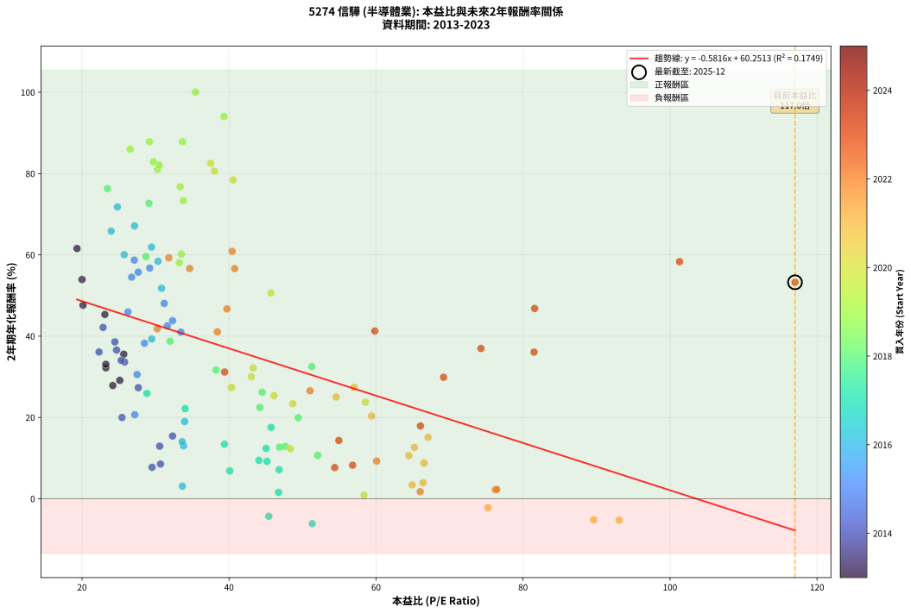
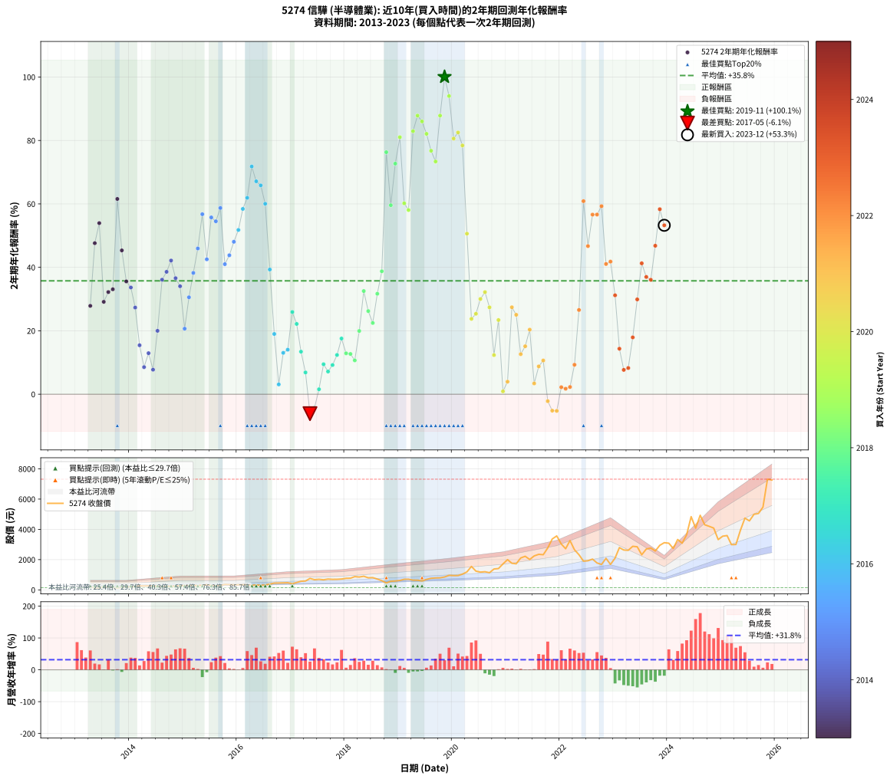

# 5274 信驊 - 本益比與未來報酬率分析

!!! info "報告資訊"
    - **股票代號**: 5274
    - **公司名稱**: 信驊
    - **產業別**: 半導體業
    - **分析期間**: 2013-2023 (129 個數據點)
    - **資料來源**: Type 12 (ShowMonthlyK_ChartFlow) 月收盤價與本益比
    - **報酬率口徑**: 含現金股利 (簡化: 年度合計，假設每年7/1入帳)
    - **報告生成時間**: 2026-01-13 13:50:12 CST

## 📈 視覺化圖表

### 圖表1: 本益比 vs 未來報酬率關係

*圖表1：5274 信驊 本益比與2年期未來報酬率關係 (2013-2023)*

### 圖表2: 歷年買入時點的2年期實際報酬率

*圖表2：5274 信驊 歷年買入時點的2年期實際報酬率 (2013-2023)*

## 📍 買點訊號說明

本報告提供兩種買點提示訊號（顯示於圖表2的股價子圖中）：

### ▲ 小綠色三角形（回測驗證）
- **計算方式**: 使用全部歷史資料計算本益比第25百分位數
- **用途**: 事後驗證，顯示歷史上哪些時點確實為低估區
- **限制**: 當下無法判斷，僅供回測參考
- **特性**: 後見之明（Look-Ahead Bias）

### ▲ 小橘色三角形（即時訊號）
- **計算方式**: 使用截至當月的過去5年資料計算本益比第25百分位數
- **用途**: 實際投資決策，當時即可判斷
- **優勢**: 可操作性強，符合實務需求
- **特性**: 無後見之明，滾動窗口計算

!!! tip "如何使用兩種訊號"
    - **綠色▲** 幫助理解歷史估值機會，驗證策略有效性
    - **橘色▲** 可作為實際買進參考，但仍需搭配基本面分析
    - 兩種訊號重疊時，表示即時判斷與事後驗證一致，信心度較高
    - 僅有綠色▲時，表示當時無法判斷（需要未來資料才能確認）
    - 僅有橘色▲時，表示即時判斷為買點，但事後可能不是最佳時機

## 📊 估值分析摘要

| 指標 | 數值 |
|:---:|:---:|
| **目前本益比** (2023-12) | **117.00 倍** |
| **歷史平均本益比** | 42.12 倍 |
| **估值水準** | 🔴 相對高估 |
| **預期2年年化報酬率** | **-7.80%** |
| **歷史平均報酬率** | +35.75% |
| **相關係數 (R²)** | 0.1749 |
| **趨勢線斜率** | -0.5816 |

!!! abstract "核心洞察"
    目前本益比顯著高於歷史平均，預期未來報酬率可能較低

    根據歷史數據回測，5274 信驊 在目前本益比 **117.0倍** 的估值水準下，
    預期未來2年年化報酬率約為 **-7.8%**。

    **重要提醒**: 本分析基於歷史數據統計，實際報酬率會受到公司基本面變化、產業趨勢、
    總體經濟環境等多重因素影響。R² = 0.17 表示本益比可解釋約 17.5% 的報酬率變異。

## 📈 歷史估值統計

### 最佳買點 (最高報酬率)

| 項目 | 數值 |
|:---:|:---:|
| 起始時間 | 2019-11 |
| 當時本益比 | 35.44 倍 |
| 起始價格 | 852.0 元 |
| 2年後價格 | 3365.0 元 |
| **2年年化報酬率** | **+100.05%** |

### 最差買點 (最低報酬率)

| 項目 | 數值 |
|:---:|:---:|
| 起始時間 | 2017-05 |
| 當時本益比 | 51.32 倍 |
| 起始價格 | 757.0 元 |
| 2年後價格 | 640.0 元 |
| **2年年化報酬率** | **-6.14%** |

## 🎯 投資啟示

### 本益比與報酬率關係

趨勢線方程式: **y = -0.5816x + 60.2513**

!!! warning "強負相關"
    本益比與未來報酬率呈現強負相關。在高本益比時期買入，未來報酬率顯著較低；
    在低本益比時期買入，未來報酬率顯著較高。**估值紀律至關重要**。

### 估值區間建議

基於歷史數據分析:

- **🟢 低估區** (P/E < 33.7): 預期報酬率較高，可考慮增加持股
- **🟡 合理區** (P/E 33.7-50.5): 預期報酬率符合長期趨勢，正常持有
- **🔴 高估區** (P/E > 50.5): 預期報酬率較低，可考慮減碼或觀望

!!! danger "風險提示"
    - 過去表現不代表未來結果
    - 本分析假設公司基本面無重大結構性變化
    - 產業環境劇變可能使歷史規律失效
    - 應結合公司財報、產業趨勢、總體經濟等多重因素綜合判斷

!!! success "長期投資觀點"
    歷史數據顯示，在合理或低估的估值水準買入並長期持有，
    往往能獲得較佳的投資報酬。**耐心等待好價格**是價值投資的核心原則。

## 📊 數據品質

- **資料來源**: GoodInfo.tw Type 12 (ShowMonthlyK_ChartFlow)
- **資料頻率**: 月度收盤價與本益比
- **回測期間**: 2013-2023
- **數據點數量**: 129 個 (每個點代表一次2年期回測)

### 計算方法說明

1. **2年期年化報酬率**:
   - 對每個歷史時點，計算其後2年的實際投資報酬率
   - 期末價值(不含股利): 期末價格
   - 期末價值(含現金股利): 期末價格 + 持有期間內的現金股利合計 (簡化: 年度合計，假設每年7/1入帳)
   - 公式: 年化報酬率 = [(期末價值/期初價格)^(1/年數) - 1] × 100%

2. **本益比 (P/E Ratio)**:
   - 使用當時的月收盤價與EPS計算
   - 資料來源: Type 12 月度河流圖本益比數據

3. **趨勢線 (Linear Regression)**:
   - 使用最小平方法擬合線性趨勢線
   - R²值衡量本益比對報酬率的解釋能力

---

*本報告由 Stock Analysis System v1.9.0 自動生成*
*數據更新時間: 2026-01-13 13:50:12 CST*

## 📋 月度回測明細表

（每一列對應時間線圖中的一個買入點；可用來對照 SVG 圖上的每個點。）

| 買入月份 | 賣出月份 | 回測期限_年 | 實際持有年數 | 買入本益比_倍 | 買入收盤價_元 | 賣出收盤價_元 | 現金股利合計_元 | 總報酬率_pct | 年化報酬率_pct |
| --- | --- | --- | --- | --- | --- | --- | --- | --- | --- |
| 2013-04 | 2015-04 | 2 | 1.999 | 24.19 | 179.00 | 282.00 | 10.50 | +63.41 | +27.85 |
| 2013-05 | 2015-05 | 2 | 1.999 | 20.14 | 149.00 | 314.00 | 10.50 | +117.79 | +47.62 |
| 2013-06 | 2015-06 | 2 | 1.999 | 20.00 | 148.00 | 340.00 | 10.50 | +136.83 | +53.94 |
| 2013-07 | 2015-07 | 2 | 1.999 | 25.14 | 186.00 | 297.50 | 12.50 | +66.67 | +29.12 |
| 2013-08 | 2015-08 | 2 | 1.999 | 23.24 | 172.00 | 288.00 | 12.50 | +74.71 | +32.20 |
| 2013-09 | 2015-09 | 2 | 1.999 | 23.24 | 172.00 | 292.00 | 12.50 | +77.04 | +33.08 |
| 2013-10 | 2015-10 | 2 | 1.999 | 19.32 | 143.00 | 360.50 | 12.50 | +160.84 | +61.56 |
| 2013-11 | 2015-11 | 2 | 1.999 | 23.11 | 171.00 | 348.50 | 12.50 | +111.11 | +45.33 |
| 2013-12 | 2015-12 | 2 | 1.999 | 25.68 | 190.00 | 336.50 | 12.50 | +83.69 | +35.56 |
| 2014-01 | 2016-01 | 2 | 1.999 | 25.79 | 198.00 | 341.00 | 12.50 | +78.54 | +33.64 |
| 2014-02 | 2016-02 | 2 | 1.999 | 27.66 | 220.00 | 344.00 | 12.50 | +62.05 | +27.32 |
| 2014-03 | 2016-03 | 2 | 2.001 | 32.32 | 266.00 | 342.00 | 12.50 | +33.27 | +15.43 |
| 2014-04 | 2016-04 | 2 | 2.001 | 30.68 | 261.00 | 295.00 | 12.50 | +17.82 | +8.54 |
| 2014-05 | 2016-05 | 2 | 2.001 | 30.57 | 268.50 | 330.00 | 12.50 | +27.56 | +12.93 |
| 2014-06 | 2016-06 | 2 | 2.001 | 29.53 | 267.50 | 298.00 | 12.50 | +16.08 | +7.73 |
| 2014-07 | 2016-07 | 2 | 2.001 | 25.44 | 237.50 | 327.00 | 15.00 | +44.00 | +19.99 |
| 2014-08 | 2016-08 | 2 | 2.001 | 22.31 | 214.50 | 382.50 | 15.00 | +85.31 | +36.10 |
| 2014-09 | 2016-09 | 2 | 2.001 | 24.47 | 242.00 | 450.00 | 15.00 | +92.15 | +38.59 |
| 2014-10 | 2016-10 | 2 | 2.001 | 22.87 | 232.50 | 455.00 | 15.00 | +102.15 | +42.15 |
| 2014-11 | 2016-11 | 2 | 2.001 | 24.70 | 258.00 | 466.50 | 15.00 | +86.63 | +36.58 |
| 2014-12 | 2016-12 | 2 | 2.001 | 25.33 | 271.50 | 473.00 | 15.00 | +79.74 | +34.04 |
| 2015-01 | 2017-01 | 2 | 2.001 | 27.18 | 291.50 | 409.50 | 15.00 | +45.63 | +20.66 |
| 2015-02 | 2017-02 | 2 | 2.001 | 27.49 | 295.00 | 488.00 | 15.00 | +70.51 | +30.56 |
| 2015-03 | 2017-03 | 2 | 2.001 | 28.50 | 306.00 | 570.00 | 15.00 | +91.18 | +38.24 |
| 2015-04 | 2017-04 | 2 | 2.001 | 26.25 | 282.00 | 586.00 | 15.00 | +113.12 | +45.95 |
| 2015-05 | 2017-05 | 2 | 2.001 | 29.21 | 314.00 | 757.00 | 15.00 | +145.86 | +56.75 |
| 2015-06 | 2017-06 | 2 | 2.001 | 31.61 | 340.00 | 676.00 | 15.00 | +103.24 | +42.53 |
| 2015-07 | 2017-07 | 2 | 2.001 | 27.65 | 297.50 | 702.00 | 20.00 | +142.69 | +55.74 |
| 2015-08 | 2017-08 | 2 | 2.001 | 26.75 | 288.00 | 668.00 | 20.00 | +138.89 | +54.51 |
| 2015-09 | 2017-09 | 2 | 2.001 | 27.11 | 292.00 | 716.00 | 20.00 | +152.05 | +58.71 |
| 2015-10 | 2017-10 | 2 | 2.001 | 33.45 | 360.50 | 697.00 | 20.00 | +98.89 | +41.00 |
| 2015-11 | 2017-11 | 2 | 2.001 | 32.32 | 348.50 | 701.00 | 20.00 | +106.89 | +43.80 |
| 2015-12 | 2017-12 | 2 | 2.001 | 31.19 | 336.50 | 718.00 | 20.00 | +119.32 | +48.05 |
| 2016-01 | 2018-01 | 2 | 2.001 | 30.82 | 341.00 | 766.00 | 20.00 | +130.50 | +51.78 |
| 2016-02 | 2018-03 | 2 | 2.081 | 30.34 | 344.00 | 876.00 | 20.00 | +160.47 | +58.42 |
| 2016-03 | 2018-03 | 2 | 1.999 | 29.46 | 342.00 | 876.00 | 20.00 | +161.99 | +61.91 |
| 2016-04 | 2018-04 | 2 | 1.999 | 24.82 | 295.00 | 850.00 | 20.00 | +194.92 | +71.79 |
| 2016-05 | 2018-05 | 2 | 1.999 | 27.15 | 330.00 | 901.00 | 20.00 | +179.09 | +67.12 |
| 2016-06 | 2018-06 | 2 | 1.999 | 23.97 | 298.00 | 799.00 | 20.00 | +174.83 | +65.84 |
| 2016-07 | 2018-07 | 2 | 1.999 | 25.74 | 327.00 | 810.00 | 27.00 | +155.96 | +60.04 |
| 2016-08 | 2018-08 | 2 | 1.999 | 29.48 | 382.50 | 715.00 | 27.00 | +93.99 | +39.31 |
| 2016-09 | 2018-09 | 2 | 1.999 | 33.96 | 450.00 | 610.00 | 27.00 | +41.56 | +18.99 |
| 2016-10 | 2018-10 | 2 | 1.999 | 33.65 | 455.00 | 456.50 | 27.00 | +6.26 | +3.09 |
| 2016-11 | 2018-11 | 2 | 1.999 | 33.81 | 466.50 | 569.00 | 27.00 | +27.76 | +13.04 |
| 2016-12 | 2018-12 | 2 | 1.999 | 33.62 | 473.00 | 588.00 | 27.00 | +30.02 | +14.04 |
| 2017-01 | 2019-01 | 2 | 1.999 | 28.83 | 409.50 | 622.00 | 27.00 | +58.49 | +25.91 |
| 2017-02 | 2019-02 | 2 | 1.999 | 34.03 | 488.00 | 701.00 | 27.00 | +49.18 | +22.16 |
| 2017-03 | 2019-03 | 2 | 1.999 | 39.37 | 570.00 | 706.00 | 27.00 | +28.60 | +13.41 |
| 2017-04 | 2019-04 | 2 | 1.999 | 40.10 | 586.00 | 642.00 | 27.00 | +14.16 | +6.85 |
| 2017-05 | 2019-05 | 2 | 1.999 | 51.32 | 757.00 | 640.00 | 27.00 | -11.89 | -6.14 |
| 2017-06 | 2019-06 | 2 | 1.999 | 45.41 | 676.00 | 592.00 | 27.00 | -8.43 | -4.31 |
| 2017-07 | 2019-07 | 2 | 1.999 | 46.74 | 702.00 | 691.00 | 33.00 | +3.13 | +1.56 |
| 2017-08 | 2019-08 | 2 | 1.999 | 44.07 | 668.00 | 767.00 | 33.00 | +19.76 | +9.44 |
| 2017-09 | 2019-09 | 2 | 1.999 | 46.82 | 716.00 | 789.00 | 33.00 | +14.80 | +7.15 |
| 2017-10 | 2019-10 | 2 | 1.999 | 45.18 | 697.00 | 798.00 | 33.00 | +19.23 | +9.20 |
| 2017-11 | 2019-11 | 2 | 1.999 | 45.04 | 701.00 | 852.00 | 33.00 | +26.25 | +12.37 |
| 2017-12 | 2019-12 | 2 | 1.999 | 45.73 | 718.00 | 959.00 | 33.00 | +38.16 | +17.56 |
| 2018-01 | 2020-01 | 2 | 1.999 | 47.65 | 766.00 | 943.00 | 33.00 | +27.42 | +12.89 |
| 2018-02 | 2020-02 | 2 | 1.999 | 46.87 | 771.00 | 946.00 | 33.00 | +26.98 | +12.69 |
| 2018-03 | 2020-03 | 2 | 2.001 | 52.07 | 876.00 | 1040.00 | 33.00 | +22.49 | +10.67 |
| 2018-04 | 2020-04 | 2 | 2.001 | 49.42 | 850.00 | 1190.00 | 33.00 | +43.88 | +19.94 |
| 2018-05 | 2020-05 | 2 | 2.001 | 51.27 | 901.00 | 1550.00 | 33.00 | +75.69 | +32.52 |
| 2018-06 | 2020-06 | 2 | 2.001 | 44.51 | 799.00 | 1240.00 | 33.00 | +59.32 | +26.20 |
| 2018-07 | 2020-07 | 2 | 2.001 | 44.20 | 810.00 | 1175.00 | 40.00 | +50.00 | +22.46 |
| 2018-08 | 2020-08 | 2 | 2.001 | 38.24 | 715.00 | 1200.00 | 40.00 | +73.43 | +31.67 |
| 2018-09 | 2020-09 | 2 | 2.001 | 31.98 | 610.00 | 1135.00 | 40.00 | +92.62 | +38.76 |
| 2018-10 | 2020-10 | 2 | 2.001 | 23.47 | 456.50 | 1380.00 | 40.00 | +211.06 | +76.30 |
| 2018-11 | 2020-11 | 2 | 2.001 | 28.70 | 569.00 | 1410.00 | 40.00 | +154.83 | +59.58 |
| 2018-12 | 2020-12 | 2 | 2.001 | 29.11 | 588.00 | 1715.00 | 40.00 | +198.47 | +72.70 |
| 2019-01 | 2021-01 | 2 | 2.001 | 30.27 | 622.00 | 2000.00 | 40.00 | +227.97 | +81.03 |
| 2019-02 | 2021-02 | 2 | 2.001 | 33.54 | 701.00 | 1760.00 | 40.00 | +156.78 | +60.19 |
| 2019-03 | 2021-03 | 2 | 2.001 | 33.23 | 706.00 | 1725.00 | 40.00 | +150.00 | +58.06 |
| 2019-04 | 2021-04 | 2 | 2.001 | 29.73 | 642.00 | 2110.00 | 40.00 | +234.89 | +82.92 |
| 2019-05 | 2021-05 | 2 | 2.001 | 29.16 | 640.00 | 2220.00 | 40.00 | +253.12 | +87.84 |
| 2019-06 | 2021-06 | 2 | 2.001 | 26.55 | 592.00 | 2010.00 | 40.00 | +246.28 | +86.01 |
| 2019-07 | 2021-07 | 2 | 2.001 | 30.52 | 691.00 | 2245.00 | 48.00 | +231.84 | +82.09 |
| 2019-08 | 2021-08 | 2 | 2.001 | 33.36 | 767.00 | 2350.00 | 48.00 | +212.65 | +76.75 |
| 2019-09 | 2021-09 | 2 | 2.001 | 33.80 | 789.00 | 2325.00 | 48.00 | +200.76 | +73.36 |
| 2019-10 | 2021-10 | 2 | 2.001 | 33.68 | 798.00 | 2770.00 | 48.00 | +253.13 | +87.84 |
| 2019-11 | 2021-11 | 2 | 2.001 | 35.44 | 852.00 | 3365.00 | 48.00 | +300.59 | +100.05 |
| 2019-12 | 2021-12 | 2 | 2.001 | 39.32 | 959.00 | 3565.00 | 48.00 | +276.75 | +94.01 |
| 2020-01 | 2022-01 | 2 | 2.001 | 38.02 | 943.00 | 3030.00 | 48.00 | +226.41 | +80.59 |
| 2020-02 | 2022-03 | 2 | 2.081 | 37.51 | 946.00 | 3260.00 | 48.00 | +249.68 | +82.51 |
| 2020-03 | 2022-03 | 2 | 1.999 | 40.57 | 1040.00 | 3260.00 | 48.00 | +218.08 | +78.42 |
| 2020-04 | 2022-04 | 2 | 1.999 | 45.68 | 1190.00 | 2650.00 | 48.00 | +126.72 | +50.62 |
| 2020-05 | 2022-05 | 2 | 1.999 | 58.56 | 1550.00 | 2325.00 | 48.00 | +53.10 | +23.75 |
| 2020-06 | 2022-06 | 2 | 1.999 | 46.12 | 1240.00 | 1900.00 | 48.00 | +57.10 | +25.36 |
| 2020-07 | 2022-07 | 2 | 1.999 | 43.04 | 1175.00 | 1925.00 | 61.00 | +69.02 | +30.03 |
| 2020-08 | 2022-08 | 2 | 1.999 | 43.30 | 1200.00 | 2035.00 | 61.00 | +74.67 | +32.19 |
| 2020-09 | 2022-09 | 2 | 1.999 | 40.34 | 1135.00 | 1780.00 | 61.00 | +62.20 | +27.38 |
| 2020-10 | 2022-10 | 2 | 1.999 | 48.34 | 1380.00 | 1680.00 | 61.00 | +26.16 | +12.33 |
| 2020-11 | 2022-11 | 2 | 1.999 | 48.68 | 1410.00 | 2085.00 | 61.00 | +52.20 | +23.39 |
| 2020-12 | 2022-12 | 2 | 1.999 | 58.37 | 1715.00 | 1685.00 | 61.00 | +1.81 | +0.90 |
| 2021-01 | 2023-01 | 2 | 1.999 | 66.39 | 2000.00 | 2100.00 | 61.00 | +8.05 | +3.95 |
| 2021-02 | 2023-02 | 2 | 1.999 | 57.02 | 1760.00 | 2795.00 | 61.00 | +62.27 | +27.41 |
| 2021-03 | 2023-03 | 2 | 1.999 | 54.57 | 1725.00 | 2635.00 | 61.00 | +56.29 | +25.04 |
| 2021-04 | 2023-04 | 2 | 1.999 | 65.22 | 2110.00 | 2615.00 | 61.00 | +26.82 | +12.63 |
| 2021-05 | 2023-05 | 2 | 1.999 | 67.08 | 2220.00 | 2880.00 | 61.00 | +32.48 | +15.11 |
| 2021-06 | 2023-06 | 2 | 1.999 | 59.40 | 2010.00 | 2850.00 | 61.00 | +44.83 | +20.36 |
| 2021-07 | 2023-07 | 2 | 1.999 | 64.92 | 2245.00 | 2320.00 | 80.00 | +6.90 | +3.40 |
| 2021-08 | 2023-08 | 2 | 1.999 | 66.52 | 2350.00 | 2700.00 | 80.00 | +18.30 | +8.77 |
| 2021-09 | 2023-09 | 2 | 1.999 | 64.46 | 2325.00 | 2765.00 | 80.00 | +22.37 | +10.63 |
| 2021-10 | 2023-10 | 2 | 1.999 | 75.24 | 2770.00 | 2570.00 | 80.00 | -4.33 | -2.19 |
| 2021-11 | 2023-11 | 2 | 1.999 | 89.60 | 3365.00 | 2945.00 | 80.00 | -10.10 | -5.19 |
| 2021-12 | 2023-12 | 2 | 1.999 | 93.08 | 3565.00 | 3120.00 | 80.00 | -10.24 | -5.26 |
| 2022-01 | 2024-01 | 2 | 1.999 | 76.22 | 3030.00 | 3085.00 | 80.00 | +4.46 | +2.20 |
| 2022-02 | 2024-02 | 2 | 1.999 | 66.01 | 2720.00 | 2735.00 | 80.00 | +3.49 | +1.73 |
| 2022-03 | 2024-03 | 2 | 2.001 | 76.43 | 3260.00 | 3330.00 | 80.00 | +4.60 | +2.27 |
| 2022-04 | 2024-04 | 2 | 2.001 | 60.08 | 2650.00 | 3085.00 | 80.00 | +19.43 | +9.28 |
| 2022-05 | 2024-05 | 2 | 2.001 | 51.03 | 2325.00 | 3645.00 | 80.00 | +60.22 | +26.56 |
| 2022-06 | 2024-06 | 2 | 2.001 | 40.42 | 1900.00 | 4840.00 | 80.00 | +158.95 | +60.87 |
| 2022-07 | 2024-07 | 2 | 2.001 | 39.72 | 1925.00 | 4080.00 | 65.00 | +115.32 | +46.70 |
| 2022-08 | 2024-08 | 2 | 2.001 | 40.77 | 2035.00 | 4930.00 | 65.00 | +145.45 | +56.62 |
| 2022-09 | 2024-09 | 2 | 2.001 | 34.65 | 1780.00 | 4305.00 | 65.00 | +145.51 | +56.64 |
| 2022-10 | 2024-10 | 2 | 2.001 | 31.81 | 1680.00 | 4200.00 | 65.00 | +153.87 | +59.28 |
| 2022-11 | 2024-11 | 2 | 2.001 | 38.42 | 2085.00 | 4085.00 | 65.00 | +99.04 | +41.05 |
| 2022-12 | 2024-12 | 2 | 2.001 | 30.24 | 1685.00 | 3325.00 | 65.00 | +101.19 | +41.81 |
| 2023-01 | 2025-01 | 2 | 2.001 | 39.40 | 2100.00 | 3550.00 | 65.00 | +72.14 | +31.18 |
| 2023-02 | 2025-02 | 2 | 2.001 | 54.94 | 2795.00 | 3590.00 | 65.00 | +30.77 | +14.34 |
| 2023-03 | 2025-03 | 2 | 2.001 | 54.38 | 2635.00 | 2990.00 | 65.00 | +15.94 | +7.67 |
| 2023-04 | 2025-04 | 2 | 2.001 | 56.81 | 2615.00 | 3000.00 | 65.00 | +17.21 | +8.26 |
| 2023-05 | 2025-05 | 2 | 2.001 | 66.04 | 2880.00 | 3940.00 | 65.00 | +39.06 | +17.91 |
| 2023-06 | 2025-06 | 2 | 2.001 | 69.19 | 2850.00 | 4745.00 | 65.00 | +68.77 | +29.89 |
| 2023-07 | 2025-07 | 2 | 2.001 | 59.84 | 2320.00 | 4560.00 | 72.00 | +99.66 | +41.27 |
| 2023-08 | 2025-08 | 2 | 2.001 | 74.28 | 2700.00 | 4995.00 | 72.00 | +87.67 | +36.96 |
| 2023-09 | 2025-09 | 2 | 2.001 | 81.50 | 2765.00 | 5050.00 | 72.00 | +85.24 | +36.08 |
| 2023-10 | 2025-10 | 2 | 2.001 | 81.58 | 2570.00 | 5470.00 | 72.00 | +115.64 | +46.81 |
| 2023-11 | 2025-11 | 2 | 2.001 | 101.30 | 2945.00 | 7315.00 | 72.00 | +150.83 | +58.33 |
| 2023-12 | 2025-12 | 2 | 2.001 | 117.00 | 3120.00 | 7260.00 | 72.00 | +135.00 | +53.25 |
