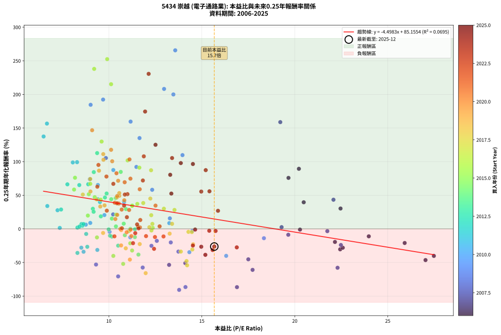
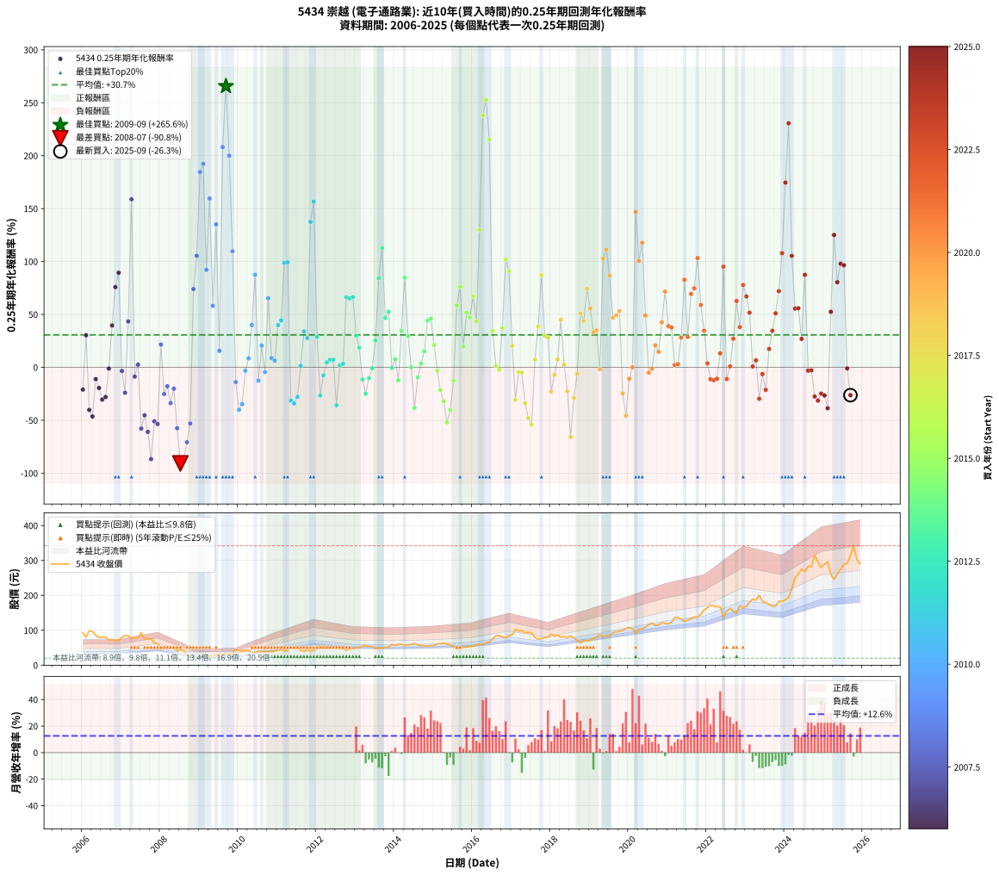

# 5434 崇越 - 本益比與未來報酬率分析

!!! info "報告資訊"
    - **股票代號**: 5434
    - **公司名稱**: 崇越
    - **產業別**: 電子通路業
    - **分析期間**: 2006-2025 (237 個數據點)
    - **資料來源**: Type 12 (ShowMonthlyK_ChartFlow) 月收盤價與本益比
    - **報酬率口徑**: 含現金股利 (簡化: 年度合計，假設每年7/1入帳)
    - **報告生成時間**: 2026-01-04 08:50:40 CST

## 📈 視覺化圖表

### 圖表1: 本益比 vs 未來報酬率關係

*圖表1：5434 崇越 本益比與0.25年期未來報酬率關係 (2006-2025)*

### 圖表2: 歷年買入時點的0.25年期實際報酬率

*圖表2：5434 崇越 歷年買入時點的0.25年期實際報酬率 (2006-2025)*

## 📍 買點訊號說明

本報告提供兩種買點提示訊號（顯示於圖表2的股價子圖中）：

### ▲ 小綠色三角形（回測驗證）
- **計算方式**: 使用全部歷史資料計算本益比第25百分位數
- **用途**: 事後驗證，顯示歷史上哪些時點確實為低估區
- **限制**: 當下無法判斷，僅供回測參考
- **特性**: 後見之明（Look-Ahead Bias）

### ▲ 小橘色三角形（即時訊號）
- **計算方式**: 使用截至當月的過去5年資料計算本益比第25百分位數
- **用途**: 實際投資決策，當時即可判斷
- **優勢**: 可操作性強，符合實務需求
- **特性**: 無後見之明，滾動窗口計算

!!! tip "如何使用兩種訊號"
    - **綠色▲** 幫助理解歷史估值機會，驗證策略有效性
    - **橘色▲** 可作為實際買進參考，但仍需搭配基本面分析
    - 兩種訊號重疊時，表示即時判斷與事後驗證一致，信心度較高
    - 僅有綠色▲時，表示當時無法判斷（需要未來資料才能確認）
    - 僅有橘色▲時，表示即時判斷為買點，但事後可能不是最佳時機

## 📊 估值分析摘要

| 指標 | 數值 |
|:---:|:---:|
| **目前本益比** (2025-09) | **15.67 倍** |
| **歷史平均本益比** | 12.11 倍 |
| **估值水準** | 🔴 相對高估 |
| **預期0.25年年化報酬率** | **+14.67%** |
| **歷史平均報酬率** | +30.66% |
| **相關係數 (R²)** | 0.0695 |
| **趨勢線斜率** | -4.4983 |

!!! abstract "核心洞察"
    目前本益比顯著高於歷史平均，預期未來報酬率可能較低

    根據歷史數據回測，5434 崇越 在目前本益比 **15.7倍** 的估值水準下，
    預期未來0.25年年化報酬率約為 **+14.7%**。

    **重要提醒**: 本分析基於歷史數據統計，實際報酬率會受到公司基本面變化、產業趨勢、
    總體經濟環境等多重因素影響。R² = 0.07 表示本益比可解釋約 7.0% 的報酬率變異。

## 📈 歷史估值統計

### 最佳買點 (最高報酬率)

| 項目 | 數值 |
|:---:|:---:|
| 起始時間 | 2009-09 |
| 當時本益比 | 13.57 倍 |
| 起始價格 | 32.0 元 |
| 0.25年後價格 | 44.2 元 |
| **0.25年年化報酬率** | **+265.61%** |

### 最差買點 (最低報酬率)

| 項目 | 數值 |
|:---:|:---:|
| 起始時間 | 2008-07 |
| 當時本益比 | 13.78 倍 |
| 起始價格 | 44.1 元 |
| 0.25年後價格 | 24.2 元 |
| **0.25年年化報酬率** | **-90.77%** |

## 🎯 投資啟示

### 本益比與報酬率關係

趨勢線方程式: **y = -4.4983x + 85.1554**

!!! warning "強負相關"
    本益比與未來報酬率呈現強負相關。在高本益比時期買入，未來報酬率顯著較低；
    在低本益比時期買入，未來報酬率顯著較高。**估值紀律至關重要**。

### 估值區間建議

基於歷史數據分析:

- **🟢 低估區** (P/E < 9.7): 預期報酬率較高，可考慮增加持股
- **🟡 合理區** (P/E 9.7-14.5): 預期報酬率符合長期趨勢，正常持有
- **🔴 高估區** (P/E > 14.5): 預期報酬率較低，可考慮減碼或觀望

!!! danger "風險提示"
    - 過去表現不代表未來結果
    - 本分析假設公司基本面無重大結構性變化
    - 產業環境劇變可能使歷史規律失效
    - 應結合公司財報、產業趨勢、總體經濟等多重因素綜合判斷

!!! success "長期投資觀點"
    歷史數據顯示，在合理或低估的估值水準買入並長期持有，
    往往能獲得較佳的投資報酬。**耐心等待好價格**是價值投資的核心原則。

## 📊 數據品質

- **資料來源**: GoodInfo.tw Type 12 (ShowMonthlyK_ChartFlow)
- **資料頻率**: 月度收盤價與本益比
- **回測期間**: 2006-2025
- **數據點數量**: 237 個 (每個點代表一次0.25年期回測)

### 計算方法說明

1. **0.25年期年化報酬率**:
   - 對每個歷史時點，計算其後0.25年的實際投資報酬率
   - 期末價值(不含股利): 期末價格
   - 期末價值(含現金股利): 期末價格 + 持有期間內的現金股利合計 (簡化: 年度合計，假設每年7/1入帳)
   - 公式: 年化報酬率 = [(期末價值/期初價格)^(1/年數) - 1] × 100%

2. **本益比 (P/E Ratio)**:
   - 使用當時的月收盤價與EPS計算
   - 資料來源: Type 12 月度河流圖本益比數據

3. **趨勢線 (Linear Regression)**:
   - 使用最小平方法擬合線性趨勢線
   - R²值衡量本益比對報酬率的解釋能力

---

*本報告由 Stock Analysis System v1.9.0 自動生成*
*數據更新時間: 2026-01-04 08:50:40 CST*

## 📋 月度回測明細表

（每一列對應時間線圖中的一個買入點；可用來對照 SVG 圖上的每個點。）

| 買入月份 | 賣出月份 | 回測期限_年 | 實際持有年數 | 買入本益比_倍 | 買入收盤價_元 | 賣出收盤價_元 | 現金股利合計_元 | 總報酬率_pct | 年化報酬率_pct |
| --- | --- | --- | --- | --- | --- | --- | --- | --- | --- |
| 2006-01 | 2006-05 | 0.25 | 0.329 | 25.91 | 92.50 | 85.60 | 0.00 | -7.46 | -21.02 |
| 2006-02 | 2006-05 | 0.25 | 0.246 | 22.46 | 80.20 | 85.60 | 0.00 | +6.73 | +30.27 |
| 2006-03 | 2006-07 | 0.25 | 0.334 | 27.48 | 98.10 | 80.10 | 2.50 | -15.80 | -40.24 |
| 2006-04 | 2006-07 | 0.25 | 0.249 | 27.03 | 96.50 | 80.10 | 2.50 | -14.40 | -46.43 |
| 2006-05 | 2006-08 | 0.25 | 0.252 | 23.98 | 85.60 | 80.60 | 2.50 | -2.92 | -11.10 |
| 2006-06 | 2006-09 | 0.25 | 0.252 | 22.16 | 79.10 | 72.40 | 2.50 | -5.31 | -19.48 |
| 2006-07 | 2006-10 | 0.25 | 0.252 | 22.44 | 80.10 | 73.10 | 0.00 | -8.74 | -30.45 |
| 2006-08 | 2006-12 | 0.25 | 0.334 | 22.58 | 80.60 | 72.20 | 0.00 | -10.42 | -28.07 |
| 2006-09 | 2006-12 | 0.25 | 0.249 | 20.28 | 72.40 | 72.20 | 0.00 | -0.28 | -1.10 |
| 2006-10 | 2007-01 | 0.25 | 0.252 | 20.48 | 73.10 | 79.50 | 0.00 | +8.76 | +39.54 |
| 2006-11 | 2007-03 | 0.25 | 0.329 | 19.66 | 70.20 | 84.50 | 0.00 | +20.37 | +75.83 |
| 2006-12 | 2007-03 | 0.25 | 0.246 | 20.22 | 72.20 | 84.50 | 0.00 | +17.04 | +89.35 |
| 2007-01 | 2007-05 | 0.25 | 0.329 | 21.75 | 79.50 | 78.60 | 0.00 | -1.13 | -3.41 |
| 2007-02 | 2007-05 | 0.25 | 0.246 | 22.48 | 84.10 | 78.60 | 0.00 | -6.54 | -24.00 |
| 2007-03 | 2007-07 | 0.25 | 0.334 | 22.08 | 84.50 | 93.00 | 2.30 | +12.78 | +43.35 |
| 2007-04 | 2007-07 | 0.25 | 0.249 | 19.22 | 75.20 | 93.00 | 2.30 | +26.73 | +158.77 |
| 2007-05 | 2007-08 | 0.25 | 0.252 | 19.65 | 78.60 | 74.50 | 2.30 | -2.29 | -8.79 |
| 2007-06 | 2007-09 | 0.25 | 0.252 | 19.29 | 78.80 | 77.00 | 2.30 | +0.63 | +2.54 |
| 2007-07 | 2007-10 | 0.25 | 0.252 | 22.30 | 93.00 | 74.80 | 0.00 | -19.57 | -57.88 |
| 2007-08 | 2007-12 | 0.25 | 0.334 | 17.50 | 74.50 | 60.90 | 0.00 | -18.26 | -45.31 |
| 2007-09 | 2007-12 | 0.25 | 0.249 | 17.73 | 77.00 | 60.90 | 0.00 | -20.91 | -61.00 |
| 2007-10 | 2008-01 | 0.25 | 0.252 | 16.89 | 74.80 | 45.00 | 0.00 | -39.84 | -86.70 |
| 2007-11 | 2008-03 | 0.25 | 0.331 | 14.11 | 63.70 | 50.30 | 0.00 | -21.04 | -50.98 |
| 2007-12 | 2008-03 | 0.25 | 0.249 | 13.24 | 60.90 | 50.30 | 0.00 | -17.41 | -53.58 |
| 2008-01 | 2008-05 | 0.25 | 0.331 | 10.23 | 45.00 | 48.00 | 0.00 | +6.67 | +21.51 |
| 2008-02 | 2008-05 | 0.25 | 0.249 | 12.29 | 51.60 | 48.00 | 0.00 | -6.98 | -25.19 |
| 2008-03 | 2008-07 | 0.25 | 0.334 | 12.58 | 50.30 | 44.10 | 3.00 | -6.36 | -17.86 |
| 2008-04 | 2008-07 | 0.25 | 0.249 | 13.74 | 52.20 | 44.10 | 3.00 | -9.77 | -33.81 |
| 2008-05 | 2008-08 | 0.25 | 0.252 | 13.33 | 48.00 | 42.35 | 3.00 | -5.52 | -20.19 |
| 2008-06 | 2008-09 | 0.25 | 0.252 | 11.82 | 40.20 | 29.40 | 3.00 | -19.40 | -57.53 |
| 2008-07 | 2008-10 | 0.25 | 0.252 | 13.78 | 44.10 | 24.20 | 0.00 | -45.12 | -90.77 |
| 2008-08 | 2008-12 | 0.25 | 0.334 | 14.12 | 42.35 | 21.65 | 0.00 | -48.88 | -86.58 |
| 2008-09 | 2008-12 | 0.25 | 0.249 | 10.50 | 29.40 | 21.65 | 0.00 | -26.36 | -70.72 |
| 2008-10 | 2009-01 | 0.25 | 0.252 | 9.31 | 24.20 | 20.00 | 0.00 | -17.36 | -53.08 |
| 2008-11 | 2009-03 | 0.25 | 0.329 | 8.98 | 21.55 | 25.85 | 0.00 | +19.95 | +73.98 |
| 2008-12 | 2009-03 | 0.25 | 0.246 | 9.84 | 21.65 | 25.85 | 0.00 | +19.40 | +105.35 |
| 2009-01 | 2009-05 | 0.25 | 0.329 | 9.02 | 20.00 | 28.20 | 0.00 | +41.00 | +184.57 |
| 2009-02 | 2009-05 | 0.25 | 0.246 | 9.69 | 21.65 | 28.20 | 0.00 | +30.25 | +192.32 |
| 2009-03 | 2009-07 | 0.25 | 0.334 | 11.48 | 25.85 | 30.85 | 1.30 | +24.37 | +92.12 |
| 2009-04 | 2009-07 | 0.25 | 0.249 | 11.17 | 25.35 | 30.85 | 1.30 | +26.82 | +159.56 |
| 2009-05 | 2009-08 | 0.25 | 0.252 | 12.33 | 28.20 | 30.35 | 1.30 | +12.23 | +58.12 |
| 2009-06 | 2009-09 | 0.25 | 0.252 | 11.65 | 26.85 | 32.00 | 1.30 | +24.02 | +135.07 |
| 2009-07 | 2009-10 | 0.25 | 0.252 | 13.28 | 30.85 | 32.00 | 0.00 | +3.73 | +15.64 |
| 2009-08 | 2009-12 | 0.25 | 0.334 | 12.97 | 30.35 | 44.20 | 0.00 | +45.63 | +208.17 |
| 2009-09 | 2009-12 | 0.25 | 0.249 | 13.57 | 32.00 | 44.20 | 0.00 | +38.13 | +265.61 |
| 2009-10 | 2010-01 | 0.25 | 0.252 | 13.47 | 32.00 | 42.20 | 0.00 | +31.88 | +199.96 |
| 2009-11 | 2010-03 | 0.25 | 0.329 | 13.96 | 33.40 | 42.60 | 0.00 | +27.54 | +109.71 |
| 2009-12 | 2010-03 | 0.25 | 0.246 | 18.34 | 44.20 | 42.60 | 0.00 | -3.62 | -13.90 |
| 2010-01 | 2010-05 | 0.25 | 0.329 | 16.31 | 42.20 | 35.65 | 0.00 | -15.52 | -40.15 |
| 2010-02 | 2010-05 | 0.25 | 0.246 | 14.33 | 39.60 | 35.65 | 0.00 | -9.97 | -34.72 |
| 2010-03 | 2010-07 | 0.25 | 0.334 | 14.49 | 42.60 | 40.65 | 1.50 | -1.06 | -3.13 |
| 2010-04 | 2010-07 | 0.25 | 0.249 | 13.25 | 41.30 | 40.65 | 1.50 | +2.06 | +8.52 |
| 2010-05 | 2010-08 | 0.25 | 0.252 | 10.82 | 35.65 | 37.30 | 1.50 | +8.84 | +39.96 |
| 2010-06 | 2010-09 | 0.25 | 0.252 | 10.24 | 35.55 | 40.15 | 1.50 | +17.16 | +87.52 |
| 2010-07 | 2010-10 | 0.25 | 0.252 | 11.15 | 40.65 | 39.30 | 0.00 | -3.32 | -12.55 |
| 2010-08 | 2010-12 | 0.25 | 0.334 | 9.76 | 37.30 | 39.70 | 0.00 | +6.43 | +20.53 |
| 2010-09 | 2010-12 | 0.25 | 0.249 | 10.04 | 40.15 | 39.70 | 0.00 | -1.12 | -4.42 |
| 2010-10 | 2011-01 | 0.25 | 0.252 | 9.41 | 39.30 | 44.60 | 0.00 | +13.49 | +65.24 |
| 2010-11 | 2011-03 | 0.25 | 0.329 | 9.00 | 39.20 | 40.30 | 0.00 | +2.81 | +8.79 |
| 2010-12 | 2011-03 | 0.25 | 0.246 | 8.76 | 39.70 | 40.30 | 0.00 | +1.51 | +6.28 |
| 2011-01 | 2011-05 | 0.25 | 0.329 | 9.52 | 44.60 | 49.80 | 0.00 | +11.66 | +39.89 |
| 2011-02 | 2011-05 | 0.25 | 0.246 | 9.40 | 45.50 | 49.80 | 0.00 | +9.45 | +44.26 |
| 2011-03 | 2011-07 | 0.25 | 0.334 | 8.06 | 40.30 | 47.90 | 2.80 | +25.81 | +98.84 |
| 2011-04 | 2011-07 | 0.25 | 0.249 | 8.29 | 42.70 | 47.90 | 2.80 | +18.74 | +99.23 |
| 2011-05 | 2011-08 | 0.25 | 0.252 | 9.38 | 49.80 | 42.50 | 2.80 | -9.04 | -31.34 |
| 2011-06 | 2011-09 | 0.25 | 0.252 | 8.64 | 47.20 | 39.70 | 2.80 | -9.96 | -34.06 |
| 2011-07 | 2011-10 | 0.25 | 0.252 | 8.52 | 47.90 | 44.10 | 0.00 | -7.93 | -27.97 |
| 2011-08 | 2011-12 | 0.25 | 0.334 | 7.36 | 42.50 | 42.70 | 0.00 | +0.47 | +1.42 |
| 2011-09 | 2011-12 | 0.25 | 0.249 | 6.69 | 39.70 | 42.70 | 0.00 | +7.56 | +33.96 |
| 2011-10 | 2012-01 | 0.25 | 0.252 | 7.24 | 44.10 | 46.90 | 0.00 | +6.35 | +27.68 |
| 2011-11 | 2012-03 | 0.25 | 0.331 | 6.49 | 40.55 | 54.00 | 0.00 | +33.17 | +137.42 |
| 2011-12 | 2012-03 | 0.25 | 0.249 | 6.67 | 42.70 | 54.00 | 0.00 | +26.46 | +156.60 |
| 2012-01 | 2012-05 | 0.25 | 0.331 | 7.43 | 46.90 | 51.00 | 0.00 | +8.74 | +28.79 |
| 2012-02 | 2012-05 | 0.25 | 0.249 | 8.84 | 55.10 | 51.00 | 0.00 | -7.44 | -26.68 |
| 2012-03 | 2012-07 | 0.25 | 0.334 | 8.78 | 54.00 | 48.30 | 4.30 | -2.59 | -7.56 |
| 2012-04 | 2012-07 | 0.25 | 0.249 | 8.58 | 52.00 | 48.30 | 4.30 | +1.15 | +4.71 |
| 2012-05 | 2012-08 | 0.25 | 0.252 | 8.53 | 51.00 | 47.60 | 4.30 | +1.76 | +7.19 |
| 2012-06 | 2012-09 | 0.25 | 0.252 | 8.64 | 50.90 | 47.50 | 4.30 | +1.77 | +7.21 |
| 2012-07 | 2012-10 | 0.25 | 0.252 | 8.31 | 48.30 | 43.20 | 0.00 | -10.56 | -35.79 |
| 2012-08 | 2012-12 | 0.25 | 0.334 | 8.31 | 47.60 | 47.90 | 0.00 | +0.63 | +1.90 |
| 2012-09 | 2012-12 | 0.25 | 0.249 | 8.42 | 47.50 | 47.90 | 0.00 | +0.84 | +3.42 |
| 2012-10 | 2013-01 | 0.25 | 0.252 | 7.77 | 43.20 | 49.10 | 0.00 | +13.66 | +66.24 |
| 2012-11 | 2013-03 | 0.25 | 0.329 | 8.41 | 46.05 | 54.30 | 0.00 | +17.92 | +65.14 |
| 2012-12 | 2013-03 | 0.25 | 0.246 | 8.89 | 47.90 | 54.30 | 0.00 | +13.36 | +66.35 |
| 2013-01 | 2013-05 | 0.25 | 0.329 | 9.14 | 49.10 | 53.50 | 0.00 | +8.96 | +29.85 |
| 2013-02 | 2013-05 | 0.25 | 0.246 | 9.57 | 51.30 | 53.50 | 0.00 | +4.29 | +18.58 |
| 2013-03 | 2013-07 | 0.25 | 0.334 | 10.16 | 54.30 | 48.55 | 3.58 | -3.99 | -11.49 |
| 2013-04 | 2013-07 | 0.25 | 0.249 | 10.50 | 56.00 | 48.55 | 3.58 | -6.91 | -24.98 |
| 2013-05 | 2013-08 | 0.25 | 0.252 | 10.06 | 53.50 | 48.50 | 3.58 | -2.65 | -10.12 |
| 2013-06 | 2013-09 | 0.25 | 0.252 | 9.99 | 53.00 | 49.30 | 3.58 | -0.22 | -0.89 |
| 2013-07 | 2013-10 | 0.25 | 0.252 | 9.18 | 48.55 | 51.40 | 0.00 | +5.87 | +25.42 |
| 2013-08 | 2013-12 | 0.25 | 0.334 | 9.19 | 48.50 | 59.50 | 0.00 | +22.68 | +84.41 |
| 2013-09 | 2013-12 | 0.25 | 0.249 | 9.37 | 49.30 | 59.50 | 0.00 | +20.69 | +112.72 |
| 2013-10 | 2014-01 | 0.25 | 0.252 | 9.79 | 51.40 | 56.60 | 0.00 | +10.12 | +46.61 |
| 2013-11 | 2014-03 | 0.25 | 0.329 | 9.88 | 51.70 | 59.40 | 0.00 | +14.89 | +52.59 |
| 2013-12 | 2014-03 | 0.25 | 0.246 | 11.40 | 59.50 | 59.40 | 0.00 | -0.17 | -0.68 |
| 2014-01 | 2014-05 | 0.25 | 0.329 | 10.80 | 56.60 | 58.00 | 0.00 | +2.47 | +7.72 |
| 2014-02 | 2014-05 | 0.25 | 0.246 | 11.40 | 59.90 | 58.00 | 0.00 | -3.17 | -12.26 |
| 2014-03 | 2014-07 | 0.25 | 0.334 | 11.26 | 59.40 | 62.00 | 3.60 | +10.44 | +34.61 |
| 2014-04 | 2014-07 | 0.25 | 0.249 | 10.64 | 56.30 | 62.00 | 3.60 | +16.52 | +84.71 |
| 2014-05 | 2014-08 | 0.25 | 0.252 | 10.92 | 58.00 | 58.30 | 3.60 | +6.72 | +29.48 |
| 2014-06 | 2014-09 | 0.25 | 0.252 | 11.16 | 59.50 | 55.90 | 3.60 | +0.00 | +0.00 |
| 2014-07 | 2014-10 | 0.25 | 0.252 | 11.59 | 62.00 | 54.90 | 0.00 | -11.45 | -38.30 |
| 2014-08 | 2014-12 | 0.25 | 0.334 | 10.86 | 58.30 | 56.40 | 0.00 | -3.26 | -9.44 |
| 2014-09 | 2014-12 | 0.25 | 0.249 | 10.38 | 55.90 | 56.40 | 0.00 | +0.89 | +3.64 |
| 2014-10 | 2015-01 | 0.25 | 0.252 | 10.16 | 54.90 | 56.90 | 0.00 | +3.64 | +15.26 |
| 2014-11 | 2015-03 | 0.25 | 0.329 | 10.13 | 54.90 | 61.90 | 0.00 | +12.75 | +44.09 |
| 2014-12 | 2015-03 | 0.25 | 0.246 | 10.37 | 56.40 | 61.90 | 0.00 | +9.75 | +45.88 |
| 2015-01 | 2015-05 | 0.25 | 0.329 | 10.39 | 56.90 | 60.60 | 0.00 | +6.50 | +21.14 |
| 2015-02 | 2015-05 | 0.25 | 0.246 | 11.08 | 61.10 | 60.60 | 0.00 | -0.82 | -3.28 |
| 2015-03 | 2015-07 | 0.25 | 0.334 | 11.15 | 61.90 | 53.40 | 3.70 | -7.75 | -21.47 |
| 2015-04 | 2015-07 | 0.25 | 0.249 | 11.25 | 62.90 | 53.40 | 3.70 | -9.22 | -32.18 |
| 2015-05 | 2015-08 | 0.25 | 0.252 | 10.77 | 60.60 | 46.65 | 3.70 | -16.91 | -52.08 |
| 2015-06 | 2015-09 | 0.25 | 0.252 | 10.24 | 58.00 | 47.25 | 3.70 | -12.16 | -40.22 |
| 2015-07 | 2015-10 | 0.25 | 0.252 | 9.36 | 53.40 | 51.60 | 0.00 | -3.37 | -12.73 |
| 2015-08 | 2015-12 | 0.25 | 0.334 | 8.13 | 46.65 | 54.40 | 0.00 | +16.61 | +58.43 |
| 2015-09 | 2015-12 | 0.25 | 0.249 | 8.18 | 47.25 | 54.40 | 0.00 | +15.13 | +76.05 |
| 2015-10 | 2016-01 | 0.25 | 0.252 | 8.87 | 51.60 | 54.00 | 0.00 | +4.65 | +19.78 |
| 2015-11 | 2016-03 | 0.25 | 0.331 | 8.92 | 52.20 | 59.90 | 0.00 | +14.75 | +51.49 |
| 2015-12 | 2016-03 | 0.25 | 0.249 | 9.24 | 54.40 | 59.90 | 0.00 | +10.11 | +47.19 |
| 2016-01 | 2016-05 | 0.25 | 0.331 | 9.00 | 54.00 | 64.00 | 0.00 | +18.52 | +67.01 |
| 2016-02 | 2016-05 | 0.25 | 0.249 | 9.56 | 58.50 | 64.00 | 0.00 | +9.40 | +43.43 |
| 2016-03 | 2016-07 | 0.25 | 0.334 | 9.61 | 59.90 | 75.20 | 3.90 | +32.05 | +129.88 |
| 2016-04 | 2016-07 | 0.25 | 0.249 | 9.21 | 58.40 | 75.20 | 3.90 | +35.45 | +237.96 |
| 2016-05 | 2016-08 | 0.25 | 0.252 | 9.91 | 64.00 | 84.00 | 3.90 | +37.34 | +252.47 |
| 2016-06 | 2016-09 | 0.25 | 0.252 | 10.12 | 66.50 | 84.90 | 3.90 | +33.53 | +215.22 |
| 2016-07 | 2016-10 | 0.25 | 0.252 | 11.25 | 75.20 | 81.00 | 0.00 | +7.71 | +34.31 |
| 2016-08 | 2016-12 | 0.25 | 0.334 | 12.36 | 84.00 | 84.40 | 0.00 | +0.48 | +1.43 |
| 2016-09 | 2016-12 | 0.25 | 0.249 | 12.29 | 84.90 | 84.40 | 0.00 | -0.59 | -2.34 |
| 2016-10 | 2017-01 | 0.25 | 0.252 | 11.53 | 81.00 | 87.70 | 0.00 | +8.27 | +37.10 |
| 2016-11 | 2017-03 | 0.25 | 0.329 | 11.01 | 78.60 | 99.00 | 0.00 | +25.95 | +101.85 |
| 2016-12 | 2017-03 | 0.25 | 0.246 | 11.64 | 84.40 | 99.00 | 0.00 | +17.30 | +91.08 |
| 2017-01 | 2017-05 | 0.25 | 0.329 | 12.28 | 87.70 | 93.20 | 0.00 | +6.27 | +20.34 |
| 2017-02 | 2017-05 | 0.25 | 0.246 | 14.49 | 102.00 | 93.20 | 0.00 | -8.63 | -30.66 |
| 2017-03 | 2017-07 | 0.25 | 0.334 | 14.28 | 99.00 | 92.50 | 5.00 | -1.52 | -4.47 |
| 2017-04 | 2017-07 | 0.25 | 0.249 | 14.46 | 98.70 | 92.50 | 5.00 | -1.22 | -4.79 |
| 2017-05 | 2017-08 | 0.25 | 0.252 | 13.87 | 93.20 | 79.00 | 5.00 | -9.87 | -33.81 |
| 2017-06 | 2017-09 | 0.25 | 0.252 | 14.18 | 93.80 | 74.60 | 5.00 | -15.14 | -47.88 |
| 2017-07 | 2017-10 | 0.25 | 0.252 | 14.21 | 92.50 | 76.00 | 0.00 | -17.84 | -54.16 |
| 2017-08 | 2017-12 | 0.25 | 0.334 | 12.34 | 79.00 | 80.90 | 0.00 | +2.41 | +7.37 |
| 2017-09 | 2017-12 | 0.25 | 0.249 | 11.85 | 74.60 | 80.90 | 0.00 | +8.45 | +38.46 |
| 2017-10 | 2018-01 | 0.25 | 0.252 | 12.27 | 76.00 | 89.00 | 0.00 | +17.11 | +87.18 |
| 2017-11 | 2018-03 | 0.25 | 0.329 | 12.96 | 78.90 | 86.00 | 0.00 | +9.00 | +29.99 |
| 2017-12 | 2018-03 | 0.25 | 0.246 | 13.53 | 80.90 | 86.00 | 0.00 | +6.30 | +28.16 |
| 2018-01 | 2018-05 | 0.25 | 0.329 | 14.53 | 89.00 | 81.70 | 0.00 | -8.20 | -22.93 |
| 2018-02 | 2018-05 | 0.25 | 0.246 | 13.27 | 83.20 | 81.70 | 0.00 | -1.80 | -7.12 |
| 2018-03 | 2018-07 | 0.25 | 0.334 | 13.40 | 86.00 | 83.90 | 4.20 | +2.44 | +7.49 |
| 2018-04 | 2018-07 | 0.25 | 0.249 | 12.23 | 80.30 | 83.90 | 4.20 | +9.71 | +45.08 |
| 2018-05 | 2018-08 | 0.25 | 0.252 | 12.18 | 81.70 | 78.00 | 4.20 | +0.61 | +2.45 |
| 2018-06 | 2018-09 | 0.25 | 0.252 | 11.66 | 79.90 | 70.70 | 4.20 | -6.26 | -22.63 |
| 2018-07 | 2018-10 | 0.25 | 0.252 | 11.98 | 83.90 | 64.00 | 0.00 | -23.72 | -65.87 |
| 2018-08 | 2018-12 | 0.25 | 0.334 | 10.91 | 78.00 | 69.60 | 0.00 | -10.77 | -28.90 |
| 2018-09 | 2018-12 | 0.25 | 0.249 | 9.69 | 70.70 | 69.60 | 0.00 | -1.56 | -6.10 |
| 2018-10 | 2019-01 | 0.25 | 0.252 | 8.60 | 64.00 | 71.00 | 0.00 | +10.94 | +51.00 |
| 2018-11 | 2019-03 | 0.25 | 0.329 | 9.34 | 70.80 | 79.80 | 0.00 | +12.71 | +43.94 |
| 2018-12 | 2019-03 | 0.25 | 0.246 | 9.00 | 69.60 | 79.80 | 0.00 | +14.66 | +74.20 |
| 2019-01 | 2019-05 | 0.25 | 0.329 | 9.01 | 71.00 | 82.10 | 0.00 | +15.63 | +55.60 |
| 2019-02 | 2019-05 | 0.25 | 0.246 | 9.54 | 76.50 | 82.10 | 0.00 | +7.32 | +33.20 |
| 2019-03 | 2019-07 | 0.25 | 0.334 | 9.77 | 79.80 | 82.90 | 5.30 | +10.53 | +34.94 |
| 2019-04 | 2019-07 | 0.25 | 0.249 | 10.66 | 88.60 | 82.90 | 5.30 | -0.45 | -1.80 |
| 2019-05 | 2019-08 | 0.25 | 0.252 | 9.71 | 82.10 | 92.80 | 5.30 | +19.49 | +102.76 |
| 2019-06 | 2019-09 | 0.25 | 0.252 | 9.70 | 83.50 | 95.50 | 5.30 | +20.72 | +111.18 |
| 2019-07 | 2019-10 | 0.25 | 0.252 | 9.47 | 82.90 | 97.00 | 0.00 | +17.01 | +86.56 |
| 2019-08 | 2019-12 | 0.25 | 0.334 | 10.43 | 92.80 | 105.50 | 0.00 | +13.69 | +46.82 |
| 2019-09 | 2019-12 | 0.25 | 0.249 | 10.56 | 95.50 | 105.50 | 0.00 | +10.47 | +49.14 |
| 2019-10 | 2020-01 | 0.25 | 0.252 | 10.56 | 97.00 | 108.00 | 0.00 | +11.34 | +53.18 |
| 2019-11 | 2020-03 | 0.25 | 0.331 | 10.66 | 99.50 | 90.60 | 0.00 | -8.94 | -24.64 |
| 2019-12 | 2020-03 | 0.25 | 0.249 | 11.13 | 105.50 | 90.60 | 0.00 | -14.12 | -45.73 |
| 2020-01 | 2020-05 | 0.25 | 0.331 | 11.21 | 108.00 | 104.00 | 0.00 | -3.70 | -10.77 |
| 2020-02 | 2020-05 | 0.25 | 0.249 | 10.62 | 104.00 | 104.00 | 0.00 | +0.00 | +0.00 |
| 2020-03 | 2020-07 | 0.25 | 0.334 | 9.10 | 90.60 | 116.00 | 6.50 | +35.21 | +146.73 |
| 2020-04 | 2020-07 | 0.25 | 0.249 | 10.18 | 103.00 | 116.00 | 6.50 | +18.93 | +100.55 |
| 2020-05 | 2020-08 | 0.25 | 0.252 | 10.12 | 104.00 | 120.00 | 6.50 | +21.63 | +117.61 |
| 2020-06 | 2020-09 | 0.25 | 0.252 | 10.45 | 109.00 | 114.00 | 6.50 | +10.55 | +48.92 |
| 2020-07 | 2020-10 | 0.25 | 0.252 | 10.96 | 116.00 | 114.50 | 0.00 | -1.29 | -5.04 |
| 2020-08 | 2020-12 | 0.25 | 0.334 | 11.17 | 120.00 | 119.50 | 0.00 | -0.42 | -1.24 |
| 2020-09 | 2020-12 | 0.25 | 0.249 | 10.45 | 114.00 | 119.50 | 0.00 | +4.82 | +20.82 |
| 2020-10 | 2021-01 | 0.25 | 0.252 | 10.35 | 114.50 | 118.50 | 0.00 | +3.49 | +14.61 |
| 2020-11 | 2021-03 | 0.25 | 0.329 | 10.83 | 121.50 | 136.50 | 0.00 | +12.35 | +42.52 |
| 2020-12 | 2021-03 | 0.25 | 0.246 | 10.50 | 119.50 | 136.50 | 0.00 | +14.23 | +71.56 |
| 2021-01 | 2021-05 | 0.25 | 0.329 | 10.32 | 118.50 | 132.00 | 0.00 | +11.39 | +38.87 |
| 2021-02 | 2021-05 | 0.25 | 0.246 | 10.53 | 122.00 | 132.00 | 0.00 | +8.20 | +37.67 |
| 2021-03 | 2021-07 | 0.25 | 0.334 | 11.67 | 136.50 | 129.50 | 8.00 | +0.73 | +2.21 |
| 2021-04 | 2021-07 | 0.25 | 0.249 | 11.57 | 136.50 | 129.50 | 8.00 | +0.73 | +2.97 |
| 2021-05 | 2021-08 | 0.25 | 0.252 | 11.09 | 132.00 | 132.50 | 8.00 | +6.44 | +28.11 |
| 2021-06 | 2021-09 | 0.25 | 0.252 | 10.41 | 125.00 | 137.50 | 8.00 | +16.40 | +82.74 |
| 2021-07 | 2021-10 | 0.25 | 0.252 | 10.69 | 129.50 | 138.00 | 0.00 | +6.56 | +28.71 |
| 2021-08 | 2021-12 | 0.25 | 0.334 | 10.85 | 132.50 | 158.00 | 0.00 | +19.25 | +69.38 |
| 2021-09 | 2021-12 | 0.25 | 0.249 | 11.16 | 137.50 | 158.00 | 0.00 | +14.91 | +74.68 |
| 2021-10 | 2022-01 | 0.25 | 0.252 | 11.11 | 138.00 | 165.00 | 0.00 | +19.57 | +103.28 |
| 2021-11 | 2022-03 | 0.25 | 0.329 | 11.66 | 146.00 | 170.00 | 0.00 | +16.44 | +58.92 |
| 2021-12 | 2022-03 | 0.25 | 0.246 | 12.51 | 158.00 | 170.00 | 0.00 | +7.59 | +34.59 |
| 2022-01 | 2022-05 | 0.25 | 0.329 | 12.73 | 165.00 | 167.00 | 0.00 | +1.21 | +3.74 |
| 2022-02 | 2022-05 | 0.25 | 0.246 | 12.94 | 172.00 | 167.00 | 0.00 | -2.91 | -11.28 |
| 2022-03 | 2022-07 | 0.25 | 0.334 | 12.48 | 170.00 | 154.00 | 8.80 | -4.24 | -12.15 |
| 2022-04 | 2022-07 | 0.25 | 0.249 | 12.00 | 167.50 | 154.00 | 8.80 | -2.81 | -10.80 |
| 2022-05 | 2022-08 | 0.25 | 0.252 | 11.69 | 167.00 | 163.50 | 8.80 | +3.17 | +13.21 |
| 2022-06 | 2022-09 | 0.25 | 0.252 | 9.44 | 138.00 | 154.50 | 8.80 | +18.33 | +95.09 |
| 2022-07 | 2022-10 | 0.25 | 0.252 | 10.30 | 154.00 | 149.50 | 0.00 | -2.92 | -11.11 |
| 2022-08 | 2022-12 | 0.25 | 0.334 | 10.70 | 163.50 | 164.00 | 0.00 | +0.31 | +0.92 |
| 2022-09 | 2022-12 | 0.25 | 0.249 | 9.89 | 154.50 | 164.00 | 0.00 | +6.15 | +27.06 |
| 2022-10 | 2023-01 | 0.25 | 0.252 | 9.38 | 149.50 | 169.00 | 0.00 | +13.04 | +62.70 |
| 2022-11 | 2023-03 | 0.25 | 0.329 | 10.44 | 170.00 | 189.00 | 0.00 | +11.18 | +38.05 |
| 2022-12 | 2023-03 | 0.25 | 0.246 | 9.87 | 164.00 | 189.00 | 0.00 | +15.24 | +77.86 |
| 2023-01 | 2023-05 | 0.25 | 0.329 | 10.24 | 169.00 | 200.00 | 0.00 | +18.34 | +66.97 |
| 2023-02 | 2023-05 | 0.25 | 0.246 | 11.00 | 180.50 | 200.00 | 0.00 | +10.80 | +51.64 |
| 2023-03 | 2023-07 | 0.25 | 0.334 | 11.60 | 189.00 | 179.50 | 10.00 | +0.26 | +0.79 |
| 2023-04 | 2023-07 | 0.25 | 0.249 | 11.52 | 186.50 | 179.50 | 10.00 | +1.61 | +6.61 |
| 2023-05 | 2023-08 | 0.25 | 0.252 | 12.43 | 200.00 | 173.00 | 10.00 | -8.50 | -29.72 |
| 2023-06 | 2023-09 | 0.25 | 0.252 | 11.42 | 182.50 | 169.50 | 10.00 | -1.64 | -6.37 |
| 2023-07 | 2023-10 | 0.25 | 0.252 | 11.30 | 179.50 | 169.00 | 0.00 | -5.85 | -21.28 |
| 2023-08 | 2023-12 | 0.25 | 0.334 | 10.97 | 173.00 | 182.50 | 0.00 | +5.49 | +17.36 |
| 2023-09 | 2023-12 | 0.25 | 0.249 | 10.82 | 169.50 | 182.50 | 0.00 | +7.67 | +34.53 |
| 2023-10 | 2024-01 | 0.25 | 0.252 | 10.86 | 169.00 | 187.50 | 0.00 | +10.95 | +51.05 |
| 2023-11 | 2024-03 | 0.25 | 0.331 | 11.83 | 183.00 | 219.00 | 0.00 | +19.67 | +71.96 |
| 2023-12 | 2024-03 | 0.25 | 0.249 | 11.88 | 182.50 | 219.00 | 0.00 | +20.00 | +107.88 |
| 2024-01 | 2024-05 | 0.25 | 0.331 | 11.95 | 187.50 | 262.00 | 0.00 | +39.73 | +174.54 |
| 2024-02 | 2024-05 | 0.25 | 0.249 | 12.14 | 194.50 | 262.00 | 0.00 | +34.70 | +230.60 |
| 2024-03 | 2024-07 | 0.25 | 0.334 | 13.40 | 219.00 | 268.50 | 10.00 | +27.17 | +105.35 |
| 2024-04 | 2024-07 | 0.25 | 0.249 | 14.97 | 249.50 | 268.50 | 10.00 | +11.62 | +55.47 |
| 2024-05 | 2024-08 | 0.25 | 0.252 | 15.41 | 262.00 | 283.00 | 10.00 | +11.83 | +55.88 |
| 2024-06 | 2024-09 | 0.25 | 0.252 | 15.87 | 275.00 | 282.00 | 10.00 | +6.18 | +26.88 |
| 2024-07 | 2024-10 | 0.25 | 0.252 | 15.21 | 268.50 | 314.50 | 0.00 | +17.13 | +87.35 |
| 2024-08 | 2024-12 | 0.25 | 0.334 | 15.74 | 283.00 | 280.00 | 0.00 | -1.06 | -3.14 |
| 2024-09 | 2024-12 | 0.25 | 0.249 | 15.40 | 282.00 | 280.00 | 0.00 | -0.71 | -2.82 |
| 2024-10 | 2025-01 | 0.25 | 0.252 | 16.88 | 314.50 | 290.00 | 0.00 | -7.79 | -27.53 |
| 2024-11 | 2025-03 | 0.25 | 0.329 | 15.58 | 295.50 | 261.00 | 0.00 | -11.68 | -31.47 |
| 2024-12 | 2025-03 | 0.25 | 0.246 | 14.52 | 280.00 | 261.00 | 0.00 | -6.79 | -24.81 |
| 2025-01 | 2025-05 | 0.25 | 0.329 | 14.97 | 290.00 | 262.00 | 0.00 | -9.66 | -26.59 |
| 2025-02 | 2025-05 | 0.25 | 0.246 | 15.19 | 295.50 | 262.00 | 0.00 | -11.34 | -38.63 |
| 2025-03 | 2025-07 | 0.25 | 0.334 | 13.36 | 261.00 | 288.50 | 11.99 | +15.13 | +52.47 |
| 2025-04 | 2025-07 | 0.25 | 0.249 | 12.51 | 245.50 | 288.50 | 11.99 | +22.40 | +125.07 |
| 2025-05 | 2025-08 | 0.25 | 0.252 | 13.30 | 262.00 | 292.00 | 11.99 | +16.03 | +80.43 |
| 2025-06 | 2025-09 | 0.25 | 0.252 | 13.87 | 274.50 | 314.00 | 11.99 | +18.76 | +97.89 |
| 2025-07 | 2025-10 | 0.25 | 0.252 | 14.52 | 288.50 | 342.00 | 0.00 | +18.54 | +96.48 |
| 2025-08 | 2025-12 | 0.25 | 0.334 | 14.64 | 292.00 | 291.00 | 0.00 | -0.34 | -1.02 |
| 2025-09 | 2025-12 | 0.25 | 0.249 | 15.67 | 314.00 | 291.00 | 0.00 | -7.32 | -26.31 |
