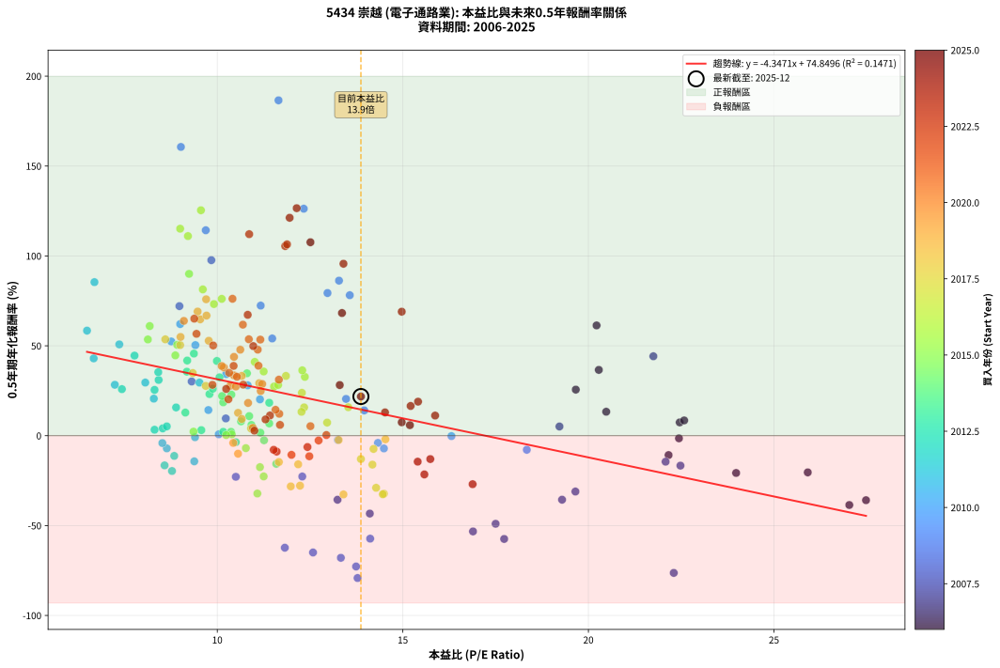
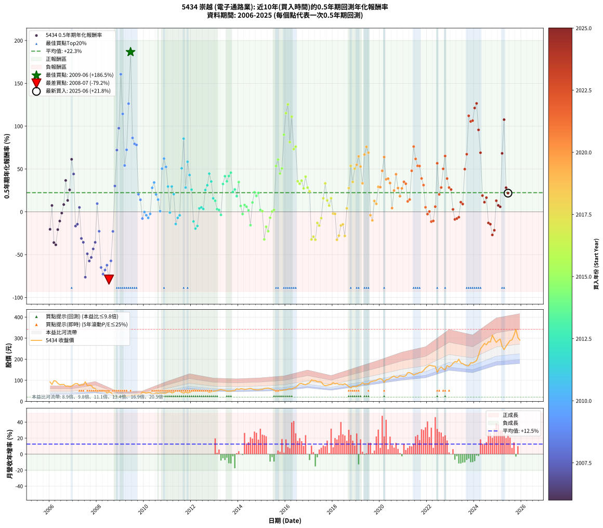

# 5434 崇越 - 本益比與未來報酬率分析

!!! info "報告資訊"
    - **股票代號**: 5434
    - **公司名稱**: 崇越
    - **產業別**: 電子通路業
    - **分析期間**: 2006-2025 (234 個數據點)
    - **資料來源**: Type 12 (ShowMonthlyK_ChartFlow) 月收盤價與本益比
    - **報酬率口徑**: 含現金股利 (簡化: 年度合計，假設每年7/1入帳)
    - **報告生成時間**: 2026-01-04 08:28:11 CST

## 📈 視覺化圖表

### 圖表1: 本益比 vs 未來報酬率關係

*圖表1：5434 崇越 本益比與0.5年期未來報酬率關係 (2006-2025)*

### 圖表2: 歷年買入時點的0.5年期實際報酬率

*圖表2：5434 崇越 歷年買入時點的0.5年期實際報酬率 (2006-2025)*

## 📍 買點訊號說明

本報告提供兩種買點提示訊號（顯示於圖表2的股價子圖中）：

### ▲ 小綠色三角形（回測驗證）
- **計算方式**: 使用全部歷史資料計算本益比第25百分位數
- **用途**: 事後驗證，顯示歷史上哪些時點確實為低估區
- **限制**: 當下無法判斷，僅供回測參考
- **特性**: 後見之明（Look-Ahead Bias）

### ▲ 小橘色三角形（即時訊號）
- **計算方式**: 使用截至當月的過去5年資料計算本益比第25百分位數
- **用途**: 實際投資決策，當時即可判斷
- **優勢**: 可操作性強，符合實務需求
- **特性**: 無後見之明，滾動窗口計算

!!! tip "如何使用兩種訊號"
    - **綠色▲** 幫助理解歷史估值機會，驗證策略有效性
    - **橘色▲** 可作為實際買進參考，但仍需搭配基本面分析
    - 兩種訊號重疊時，表示即時判斷與事後驗證一致，信心度較高
    - 僅有綠色▲時，表示當時無法判斷（需要未來資料才能確認）
    - 僅有橘色▲時，表示即時判斷為買點，但事後可能不是最佳時機

## 📊 估值分析摘要

| 指標 | 數值 |
|:---:|:---:|
| **目前本益比** (2025-06) | **13.87 倍** |
| **歷史平均本益比** | 12.08 倍 |
| **估值水準** | 🟡 合理範圍 |
| **預期0.5年年化報酬率** | **+14.56%** |
| **歷史平均報酬率** | +22.34% |
| **相關係數 (R²)** | 0.1471 |
| **趨勢線斜率** | -4.3471 |

!!! abstract "核心洞察"
    目前本益比接近歷史平均，預期報酬率符合長期趨勢

    根據歷史數據回測，5434 崇越 在目前本益比 **13.9倍** 的估值水準下，
    預期未來0.5年年化報酬率約為 **+14.6%**。

    **重要提醒**: 本分析基於歷史數據統計，實際報酬率會受到公司基本面變化、產業趨勢、
    總體經濟環境等多重因素影響。R² = 0.15 表示本益比可解釋約 14.7% 的報酬率變異。

## 📈 歷史估值統計

### 最佳買點 (最高報酬率)

| 項目 | 數值 |
|:---:|:---:|
| 起始時間 | 2009-06 |
| 當時本益比 | 11.65 倍 |
| 起始價格 | 26.9 元 |
| 0.5年後價格 | 44.2 元 |
| **0.5年年化報酬率** | **+186.55%** |

### 最差買點 (最低報酬率)

| 項目 | 數值 |
|:---:|:---:|
| 起始時間 | 2008-07 |
| 當時本益比 | 13.78 倍 |
| 起始價格 | 44.1 元 |
| 0.5年後價格 | 20.0 元 |
| **0.5年年化報酬率** | **-79.19%** |

## 🎯 投資啟示

### 本益比與報酬率關係

趨勢線方程式: **y = -4.3471x + 74.8496**

!!! warning "強負相關"
    本益比與未來報酬率呈現強負相關。在高本益比時期買入，未來報酬率顯著較低；
    在低本益比時期買入，未來報酬率顯著較高。**估值紀律至關重要**。

### 估值區間建議

基於歷史數據分析:

- **🟢 低估區** (P/E < 9.7): 預期報酬率較高，可考慮增加持股
- **🟡 合理區** (P/E 9.7-14.5): 預期報酬率符合長期趨勢，正常持有
- **🔴 高估區** (P/E > 14.5): 預期報酬率較低，可考慮減碼或觀望

!!! danger "風險提示"
    - 過去表現不代表未來結果
    - 本分析假設公司基本面無重大結構性變化
    - 產業環境劇變可能使歷史規律失效
    - 應結合公司財報、產業趨勢、總體經濟等多重因素綜合判斷

!!! success "長期投資觀點"
    歷史數據顯示，在合理或低估的估值水準買入並長期持有，
    往往能獲得較佳的投資報酬。**耐心等待好價格**是價值投資的核心原則。

## 📊 數據品質

- **資料來源**: GoodInfo.tw Type 12 (ShowMonthlyK_ChartFlow)
- **資料頻率**: 月度收盤價與本益比
- **回測期間**: 2006-2025
- **數據點數量**: 234 個 (每個點代表一次0.5年期回測)

### 計算方法說明

1. **0.5年期年化報酬率**:
   - 對每個歷史時點，計算其後0.5年的實際投資報酬率
   - 期末價值(不含股利): 期末價格
   - 期末價值(含現金股利): 期末價格 + 持有期間內的現金股利合計 (簡化: 年度合計，假設每年7/1入帳)
   - 公式: 年化報酬率 = [(期末價值/期初價格)^(1/年數) - 1] × 100%

2. **本益比 (P/E Ratio)**:
   - 使用當時的月收盤價與EPS計算
   - 資料來源: Type 12 月度河流圖本益比數據

3. **趨勢線 (Linear Regression)**:
   - 使用最小平方法擬合線性趨勢線
   - R²值衡量本益比對報酬率的解釋能力

---

*本報告由 Stock Analysis System v1.9.0 自動生成*
*數據更新時間: 2026-01-04 08:28:11 CST*

## 📋 月度回測明細表

（每一列對應時間線圖中的一個買入點；可用來對照 SVG 圖上的每個點。）

| 買入月份 | 賣出月份 | 回測期限_年 | 實際持有年數 | 買入本益比_倍 | 買入收盤價_元 | 賣出收盤價_元 | 現金股利合計_元 | 總報酬率_pct | 年化報酬率_pct |
| --- | --- | --- | --- | --- | --- | --- | --- | --- | --- |
| 2006-01 | 2006-07 | 0.5 | 0.496 | 25.91 | 92.50 | 80.10 | 2.50 | -10.70 | -20.42 |
| 2006-02 | 2006-08 | 0.5 | 0.498 | 22.46 | 80.20 | 80.60 | 2.50 | +3.62 | +7.39 |
| 2006-03 | 2006-10 | 0.5 | 0.586 | 27.48 | 98.10 | 73.10 | 2.50 | -22.94 | -35.90 |
| 2006-04 | 2006-10 | 0.5 | 0.501 | 27.03 | 96.50 | 73.10 | 2.50 | -21.66 | -38.56 |
| 2006-05 | 2006-12 | 0.5 | 0.586 | 23.98 | 85.60 | 72.20 | 2.50 | -12.73 | -20.74 |
| 2006-06 | 2006-12 | 0.5 | 0.501 | 22.16 | 79.10 | 72.20 | 2.50 | -5.56 | -10.79 |
| 2006-07 | 2007-01 | 0.5 | 0.504 | 22.44 | 80.10 | 79.50 | 0.00 | -0.75 | -1.48 |
| 2006-08 | 2007-03 | 0.5 | 0.580 | 22.58 | 80.60 | 84.50 | 0.00 | +4.84 | +8.48 |
| 2006-09 | 2007-03 | 0.5 | 0.496 | 20.28 | 72.40 | 84.50 | 0.00 | +16.71 | +36.60 |
| 2006-10 | 2007-05 | 0.5 | 0.580 | 20.48 | 73.10 | 78.60 | 0.00 | +7.52 | +13.31 |
| 2006-11 | 2007-05 | 0.5 | 0.496 | 19.66 | 70.20 | 78.60 | 0.00 | +11.97 | +25.62 |
| 2006-12 | 2007-07 | 0.5 | 0.580 | 20.22 | 72.20 | 93.00 | 2.30 | +31.99 | +61.33 |
| 2007-01 | 2007-07 | 0.5 | 0.496 | 21.75 | 79.50 | 93.00 | 2.30 | +19.87 | +44.17 |
| 2007-02 | 2007-08 | 0.5 | 0.498 | 22.48 | 84.10 | 74.50 | 2.30 | -8.68 | -16.66 |
| 2007-03 | 2007-10 | 0.5 | 0.586 | 22.08 | 84.50 | 74.80 | 2.30 | -8.76 | -14.48 |
| 2007-04 | 2007-10 | 0.5 | 0.501 | 19.22 | 75.20 | 74.80 | 2.30 | +2.53 | +5.11 |
| 2007-05 | 2007-12 | 0.5 | 0.586 | 19.65 | 78.60 | 60.90 | 2.30 | -19.59 | -31.08 |
| 2007-06 | 2007-12 | 0.5 | 0.501 | 19.29 | 78.80 | 60.90 | 2.30 | -19.80 | -35.62 |
| 2007-07 | 2008-01 | 0.5 | 0.504 | 22.30 | 93.00 | 45.00 | 0.00 | -51.61 | -76.33 |
| 2007-08 | 2008-03 | 0.5 | 0.583 | 17.50 | 74.50 | 50.30 | 0.00 | -32.48 | -49.01 |
| 2007-09 | 2008-03 | 0.5 | 0.498 | 17.73 | 77.00 | 50.30 | 0.00 | -34.68 | -57.45 |
| 2007-10 | 2008-05 | 0.5 | 0.583 | 16.89 | 74.80 | 48.00 | 0.00 | -35.83 | -53.27 |
| 2007-11 | 2008-05 | 0.5 | 0.498 | 14.11 | 63.70 | 48.00 | 0.00 | -24.65 | -43.33 |
| 2007-12 | 2008-07 | 0.5 | 0.583 | 13.24 | 60.90 | 44.10 | 3.00 | -22.66 | -35.64 |
| 2008-01 | 2008-07 | 0.5 | 0.498 | 10.23 | 45.00 | 44.10 | 3.00 | +4.67 | +9.59 |
| 2008-02 | 2008-08 | 0.5 | 0.501 | 12.29 | 51.60 | 42.35 | 3.00 | -12.11 | -22.72 |
| 2008-03 | 2008-10 | 0.5 | 0.586 | 12.58 | 50.30 | 24.20 | 3.00 | -45.92 | -64.98 |
| 2008-04 | 2008-10 | 0.5 | 0.501 | 13.74 | 52.20 | 24.20 | 3.00 | -47.89 | -72.78 |
| 2008-05 | 2008-12 | 0.5 | 0.586 | 13.33 | 48.00 | 21.65 | 3.00 | -48.65 | -67.94 |
| 2008-06 | 2008-12 | 0.5 | 0.501 | 11.82 | 40.20 | 21.65 | 3.00 | -38.68 | -62.33 |
| 2008-07 | 2009-01 | 0.5 | 0.504 | 13.78 | 44.10 | 20.00 | 0.00 | -54.65 | -79.19 |
| 2008-08 | 2009-03 | 0.5 | 0.580 | 14.12 | 42.35 | 25.85 | 0.00 | -38.96 | -57.28 |
| 2008-09 | 2009-03 | 0.5 | 0.496 | 10.50 | 29.40 | 25.85 | 0.00 | -12.07 | -22.87 |
| 2008-10 | 2009-05 | 0.5 | 0.580 | 9.31 | 24.20 | 28.20 | 0.00 | +16.53 | +30.15 |
| 2008-11 | 2009-05 | 0.5 | 0.496 | 8.98 | 21.55 | 28.20 | 0.00 | +30.86 | +72.07 |
| 2008-12 | 2009-07 | 0.5 | 0.580 | 9.84 | 21.65 | 30.85 | 1.30 | +48.50 | +97.63 |
| 2009-01 | 2009-07 | 0.5 | 0.496 | 9.02 | 20.00 | 30.85 | 1.30 | +60.75 | +160.62 |
| 2009-02 | 2009-08 | 0.5 | 0.498 | 9.69 | 21.65 | 30.35 | 1.30 | +46.19 | +114.27 |
| 2009-03 | 2009-10 | 0.5 | 0.586 | 11.48 | 25.85 | 32.00 | 1.30 | +28.82 | +54.07 |
| 2009-04 | 2009-10 | 0.5 | 0.501 | 11.17 | 25.35 | 32.00 | 1.30 | +31.36 | +72.36 |
| 2009-05 | 2009-12 | 0.5 | 0.586 | 12.33 | 28.20 | 44.20 | 1.30 | +61.35 | +126.26 |
| 2009-06 | 2009-12 | 0.5 | 0.501 | 11.65 | 26.85 | 44.20 | 1.30 | +69.46 | +186.55 |
| 2009-07 | 2010-01 | 0.5 | 0.504 | 13.28 | 30.85 | 42.20 | 0.00 | +36.79 | +86.24 |
| 2009-08 | 2010-03 | 0.5 | 0.580 | 12.97 | 30.35 | 42.60 | 0.00 | +40.36 | +79.35 |
| 2009-09 | 2010-03 | 0.5 | 0.496 | 13.57 | 32.00 | 42.60 | 0.00 | +33.13 | +78.14 |
| 2009-10 | 2010-05 | 0.5 | 0.580 | 13.47 | 32.00 | 35.65 | 0.00 | +11.41 | +20.45 |
| 2009-11 | 2010-05 | 0.5 | 0.496 | 13.96 | 33.40 | 35.65 | 0.00 | +6.74 | +14.06 |
| 2009-12 | 2010-07 | 0.5 | 0.580 | 18.34 | 44.20 | 40.65 | 1.50 | -4.64 | -7.86 |
| 2010-01 | 2010-07 | 0.5 | 0.496 | 16.31 | 42.20 | 40.65 | 1.50 | -0.12 | -0.24 |
| 2010-02 | 2010-08 | 0.5 | 0.498 | 14.33 | 39.60 | 37.30 | 1.50 | -2.02 | -4.01 |
| 2010-03 | 2010-10 | 0.5 | 0.586 | 14.49 | 42.60 | 39.30 | 1.50 | -4.23 | -7.10 |
| 2010-04 | 2010-10 | 0.5 | 0.501 | 13.25 | 41.30 | 39.30 | 1.50 | -1.21 | -2.40 |
| 2010-05 | 2010-12 | 0.5 | 0.586 | 10.82 | 35.65 | 39.70 | 1.50 | +15.57 | +28.01 |
| 2010-06 | 2010-12 | 0.5 | 0.501 | 10.24 | 35.55 | 39.70 | 1.50 | +15.89 | +34.23 |
| 2010-07 | 2011-01 | 0.5 | 0.504 | 11.15 | 40.65 | 44.60 | 0.00 | +9.72 | +20.21 |
| 2010-08 | 2011-03 | 0.5 | 0.580 | 9.76 | 37.30 | 40.30 | 0.00 | +8.04 | +14.26 |
| 2010-09 | 2011-03 | 0.5 | 0.496 | 10.04 | 40.15 | 40.30 | 0.00 | +0.37 | +0.76 |
| 2010-10 | 2011-05 | 0.5 | 0.580 | 9.41 | 39.30 | 49.80 | 0.00 | +26.72 | +50.37 |
| 2010-11 | 2011-05 | 0.5 | 0.496 | 9.00 | 39.20 | 49.80 | 0.00 | +27.04 | +62.09 |
| 2010-12 | 2011-07 | 0.5 | 0.580 | 8.76 | 39.70 | 47.90 | 2.80 | +27.71 | +52.41 |
| 2011-01 | 2011-07 | 0.5 | 0.496 | 9.52 | 44.60 | 47.90 | 2.80 | +13.68 | +29.52 |
| 2011-02 | 2011-08 | 0.5 | 0.498 | 9.40 | 45.50 | 42.50 | 2.80 | -0.44 | -0.88 |
| 2011-03 | 2011-10 | 0.5 | 0.586 | 8.06 | 40.30 | 44.10 | 2.80 | +16.38 | +29.55 |
| 2011-04 | 2011-10 | 0.5 | 0.501 | 8.29 | 42.70 | 44.10 | 2.80 | +9.84 | +20.59 |
| 2011-05 | 2011-12 | 0.5 | 0.586 | 9.38 | 49.80 | 42.70 | 2.80 | -8.63 | -14.28 |
| 2011-06 | 2011-12 | 0.5 | 0.501 | 8.64 | 47.20 | 42.70 | 2.80 | -3.60 | -7.06 |
| 2011-07 | 2012-01 | 0.5 | 0.504 | 8.52 | 47.90 | 46.90 | 0.00 | -2.09 | -4.10 |
| 2011-08 | 2012-03 | 0.5 | 0.583 | 7.36 | 42.50 | 54.00 | 0.00 | +27.06 | +50.78 |
| 2011-09 | 2012-03 | 0.5 | 0.498 | 6.69 | 39.70 | 54.00 | 0.00 | +36.02 | +85.41 |
| 2011-10 | 2012-05 | 0.5 | 0.583 | 7.24 | 44.10 | 51.00 | 0.00 | +15.65 | +28.31 |
| 2011-11 | 2012-05 | 0.5 | 0.498 | 6.49 | 40.55 | 51.00 | 0.00 | +25.77 | +58.43 |
| 2011-12 | 2012-07 | 0.5 | 0.583 | 6.67 | 42.70 | 48.30 | 4.30 | +23.19 | +42.98 |
| 2012-01 | 2012-07 | 0.5 | 0.498 | 7.43 | 46.90 | 48.30 | 4.30 | +12.15 | +25.88 |
| 2012-02 | 2012-08 | 0.5 | 0.501 | 8.84 | 55.10 | 47.60 | 4.30 | -5.81 | -11.26 |
| 2012-03 | 2012-10 | 0.5 | 0.586 | 8.78 | 54.00 | 43.20 | 4.30 | -12.04 | -19.66 |
| 2012-04 | 2012-10 | 0.5 | 0.501 | 8.58 | 52.00 | 43.20 | 4.30 | -8.65 | -16.53 |
| 2012-05 | 2012-12 | 0.5 | 0.586 | 8.53 | 51.00 | 47.90 | 4.30 | +2.35 | +4.05 |
| 2012-06 | 2012-12 | 0.5 | 0.501 | 8.64 | 50.90 | 47.90 | 4.30 | +2.55 | +5.16 |
| 2012-07 | 2013-01 | 0.5 | 0.504 | 8.31 | 48.30 | 49.10 | 0.00 | +1.66 | +3.31 |
| 2012-08 | 2013-03 | 0.5 | 0.580 | 8.31 | 47.60 | 54.30 | 0.00 | +14.08 | +25.47 |
| 2012-09 | 2013-03 | 0.5 | 0.496 | 8.42 | 47.50 | 54.30 | 0.00 | +14.32 | +31.00 |
| 2012-10 | 2013-05 | 0.5 | 0.580 | 7.77 | 43.20 | 53.50 | 0.00 | +23.84 | +44.55 |
| 2012-11 | 2013-05 | 0.5 | 0.496 | 8.41 | 46.05 | 53.50 | 0.00 | +16.18 | +35.34 |
| 2012-12 | 2013-07 | 0.5 | 0.580 | 8.89 | 47.90 | 48.55 | 3.58 | +8.83 | +15.70 |
| 2013-01 | 2013-07 | 0.5 | 0.496 | 9.14 | 49.10 | 48.55 | 3.58 | +6.17 | +12.85 |
| 2013-02 | 2013-08 | 0.5 | 0.498 | 9.57 | 51.30 | 48.50 | 3.58 | +1.52 | +3.08 |
| 2013-03 | 2013-10 | 0.5 | 0.586 | 10.16 | 54.30 | 51.40 | 3.58 | +1.25 | +2.15 |
| 2013-04 | 2013-10 | 0.5 | 0.501 | 10.50 | 56.00 | 51.40 | 3.58 | -1.82 | -3.60 |
| 2013-05 | 2013-12 | 0.5 | 0.586 | 10.06 | 53.50 | 59.50 | 3.58 | +17.91 | +32.47 |
| 2013-06 | 2013-12 | 0.5 | 0.501 | 9.99 | 53.00 | 59.50 | 3.58 | +19.02 | +41.56 |
| 2013-07 | 2014-01 | 0.5 | 0.504 | 9.18 | 48.55 | 56.60 | 0.00 | +16.58 | +35.60 |
| 2013-08 | 2014-03 | 0.5 | 0.580 | 9.19 | 48.50 | 59.40 | 0.00 | +22.47 | +41.80 |
| 2013-09 | 2014-03 | 0.5 | 0.496 | 9.37 | 49.30 | 59.40 | 0.00 | +20.49 | +45.66 |
| 2013-10 | 2014-05 | 0.5 | 0.580 | 9.79 | 51.40 | 58.00 | 0.00 | +12.84 | +23.14 |
| 2013-11 | 2014-05 | 0.5 | 0.496 | 9.88 | 51.70 | 58.00 | 0.00 | +12.19 | +26.12 |
| 2013-12 | 2014-07 | 0.5 | 0.580 | 11.40 | 59.50 | 62.00 | 3.60 | +10.25 | +18.31 |
| 2014-01 | 2014-07 | 0.5 | 0.496 | 10.80 | 56.60 | 62.00 | 3.60 | +15.90 | +34.69 |
| 2014-02 | 2014-08 | 0.5 | 0.498 | 11.40 | 59.90 | 58.30 | 3.60 | +3.34 | +6.81 |
| 2014-03 | 2014-10 | 0.5 | 0.586 | 11.26 | 59.40 | 54.90 | 3.60 | -1.52 | -2.57 |
| 2014-04 | 2014-10 | 0.5 | 0.501 | 10.64 | 56.30 | 54.90 | 3.60 | +3.91 | +7.95 |
| 2014-05 | 2014-12 | 0.5 | 0.586 | 10.92 | 58.00 | 56.40 | 3.60 | +3.45 | +5.96 |
| 2014-06 | 2014-12 | 0.5 | 0.501 | 11.16 | 59.50 | 56.40 | 3.60 | +0.84 | +1.68 |
| 2014-07 | 2015-01 | 0.5 | 0.504 | 11.59 | 62.00 | 56.90 | 0.00 | -8.23 | -15.67 |
| 2014-08 | 2015-03 | 0.5 | 0.580 | 10.86 | 58.30 | 61.90 | 0.00 | +6.17 | +10.87 |
| 2014-09 | 2015-03 | 0.5 | 0.496 | 10.38 | 55.90 | 61.90 | 0.00 | +10.73 | +22.84 |
| 2014-10 | 2015-05 | 0.5 | 0.580 | 10.16 | 54.90 | 60.60 | 0.00 | +10.38 | +18.55 |
| 2014-11 | 2015-05 | 0.5 | 0.496 | 10.13 | 54.90 | 60.60 | 0.00 | +10.38 | +22.06 |
| 2014-12 | 2015-07 | 0.5 | 0.580 | 10.37 | 56.40 | 53.40 | 3.70 | +1.24 | +2.15 |
| 2015-01 | 2015-07 | 0.5 | 0.496 | 10.39 | 56.90 | 53.40 | 3.70 | +0.35 | +0.71 |
| 2015-02 | 2015-08 | 0.5 | 0.498 | 11.08 | 61.10 | 46.65 | 3.70 | -17.59 | -32.18 |
| 2015-03 | 2015-10 | 0.5 | 0.586 | 11.15 | 61.90 | 51.60 | 3.70 | -10.66 | -17.51 |
| 2015-04 | 2015-10 | 0.5 | 0.501 | 11.25 | 62.90 | 51.60 | 3.70 | -12.08 | -22.66 |
| 2015-05 | 2015-12 | 0.5 | 0.586 | 10.77 | 60.60 | 54.40 | 3.70 | -4.13 | -6.94 |
| 2015-06 | 2015-12 | 0.5 | 0.501 | 10.24 | 58.00 | 54.40 | 3.70 | +0.17 | +0.34 |
| 2015-07 | 2016-01 | 0.5 | 0.504 | 9.36 | 53.40 | 54.00 | 0.00 | +1.12 | +2.24 |
| 2015-08 | 2016-03 | 0.5 | 0.583 | 8.13 | 46.65 | 59.90 | 0.00 | +28.40 | +53.53 |
| 2015-09 | 2016-03 | 0.5 | 0.498 | 8.18 | 47.25 | 59.90 | 0.00 | +26.77 | +60.97 |
| 2015-10 | 2016-05 | 0.5 | 0.583 | 8.87 | 51.60 | 64.00 | 0.00 | +24.03 | +44.67 |
| 2015-11 | 2016-05 | 0.5 | 0.498 | 8.92 | 52.20 | 64.00 | 0.00 | +22.61 | +50.53 |
| 2015-12 | 2016-07 | 0.5 | 0.583 | 9.24 | 54.40 | 75.20 | 3.90 | +45.40 | +90.01 |
| 2016-01 | 2016-07 | 0.5 | 0.498 | 9.00 | 54.00 | 75.20 | 3.90 | +46.48 | +115.13 |
| 2016-02 | 2016-08 | 0.5 | 0.501 | 9.56 | 58.50 | 84.00 | 3.90 | +50.26 | +125.39 |
| 2016-03 | 2016-10 | 0.5 | 0.586 | 9.61 | 59.90 | 81.00 | 3.90 | +41.74 | +81.36 |
| 2016-04 | 2016-10 | 0.5 | 0.501 | 9.21 | 58.40 | 81.00 | 3.90 | +45.38 | +111.02 |
| 2016-05 | 2016-12 | 0.5 | 0.586 | 9.91 | 64.00 | 84.40 | 3.90 | +37.97 | +73.21 |
| 2016-06 | 2016-12 | 0.5 | 0.501 | 10.12 | 66.50 | 84.40 | 3.90 | +32.78 | +76.11 |
| 2016-07 | 2017-01 | 0.5 | 0.504 | 11.25 | 75.20 | 87.70 | 0.00 | +16.62 | +35.70 |
| 2016-08 | 2017-03 | 0.5 | 0.580 | 12.36 | 84.00 | 99.00 | 0.00 | +17.86 | +32.72 |
| 2016-09 | 2017-03 | 0.5 | 0.496 | 12.29 | 84.90 | 99.00 | 0.00 | +16.61 | +36.35 |
| 2016-10 | 2017-05 | 0.5 | 0.580 | 11.53 | 81.00 | 93.20 | 0.00 | +15.06 | +27.34 |
| 2016-11 | 2017-05 | 0.5 | 0.496 | 11.01 | 78.60 | 93.20 | 0.00 | +18.58 | +41.03 |
| 2016-12 | 2017-07 | 0.5 | 0.580 | 11.64 | 84.40 | 92.50 | 5.00 | +15.52 | +28.22 |
| 2017-01 | 2017-07 | 0.5 | 0.496 | 12.28 | 87.70 | 92.50 | 5.00 | +11.17 | +23.83 |
| 2017-02 | 2017-08 | 0.5 | 0.498 | 14.49 | 102.00 | 79.00 | 5.00 | -17.65 | -32.27 |
| 2017-03 | 2017-10 | 0.5 | 0.586 | 14.28 | 99.00 | 76.00 | 5.00 | -18.18 | -29.00 |
| 2017-04 | 2017-10 | 0.5 | 0.501 | 14.46 | 98.70 | 76.00 | 5.00 | -17.93 | -32.60 |
| 2017-05 | 2017-12 | 0.5 | 0.586 | 13.87 | 93.20 | 80.90 | 5.00 | -7.83 | -13.00 |
| 2017-06 | 2017-12 | 0.5 | 0.501 | 14.18 | 93.80 | 80.90 | 5.00 | -8.42 | -16.10 |
| 2017-07 | 2018-01 | 0.5 | 0.504 | 14.21 | 92.50 | 89.00 | 0.00 | -3.78 | -7.37 |
| 2017-08 | 2018-03 | 0.5 | 0.580 | 12.34 | 79.00 | 86.00 | 0.00 | +8.86 | +15.75 |
| 2017-09 | 2018-03 | 0.5 | 0.496 | 11.85 | 74.60 | 86.00 | 0.00 | +15.28 | +33.24 |
| 2017-10 | 2018-05 | 0.5 | 0.580 | 12.27 | 76.00 | 81.70 | 0.00 | +7.50 | +13.27 |
| 2017-11 | 2018-05 | 0.5 | 0.496 | 12.96 | 78.90 | 81.70 | 0.00 | +3.55 | +7.29 |
| 2017-12 | 2018-07 | 0.5 | 0.580 | 13.53 | 80.90 | 83.90 | 4.20 | +8.90 | +15.82 |
| 2018-01 | 2018-07 | 0.5 | 0.496 | 14.53 | 89.00 | 83.90 | 4.20 | -1.01 | -2.03 |
| 2018-02 | 2018-08 | 0.5 | 0.498 | 13.27 | 83.20 | 78.00 | 4.20 | -1.20 | -2.40 |
| 2018-03 | 2018-10 | 0.5 | 0.586 | 13.40 | 86.00 | 64.00 | 4.20 | -20.70 | -32.69 |
| 2018-04 | 2018-10 | 0.5 | 0.501 | 12.23 | 80.30 | 64.00 | 4.20 | -15.07 | -27.82 |
| 2018-05 | 2018-12 | 0.5 | 0.586 | 12.18 | 81.70 | 69.60 | 4.20 | -9.67 | -15.93 |
| 2018-06 | 2018-12 | 0.5 | 0.501 | 11.66 | 79.90 | 69.60 | 4.20 | -7.63 | -14.66 |
| 2018-07 | 2019-01 | 0.5 | 0.504 | 11.98 | 83.90 | 71.00 | 0.00 | -15.38 | -28.21 |
| 2018-08 | 2019-03 | 0.5 | 0.580 | 10.91 | 78.00 | 79.80 | 0.00 | +2.31 | +4.01 |
| 2018-09 | 2019-03 | 0.5 | 0.496 | 9.69 | 70.70 | 79.80 | 0.00 | +12.87 | +27.68 |
| 2018-10 | 2019-05 | 0.5 | 0.580 | 8.60 | 64.00 | 82.10 | 0.00 | +28.28 | +53.59 |
| 2018-11 | 2019-05 | 0.5 | 0.496 | 9.34 | 70.80 | 82.10 | 0.00 | +15.96 | +34.83 |
| 2018-12 | 2019-07 | 0.5 | 0.580 | 9.00 | 69.60 | 82.90 | 5.30 | +26.72 | +50.39 |
| 2019-01 | 2019-07 | 0.5 | 0.496 | 9.01 | 71.00 | 82.90 | 5.30 | +24.23 | +54.92 |
| 2019-02 | 2019-08 | 0.5 | 0.498 | 9.54 | 76.50 | 92.80 | 5.30 | +28.24 | +64.72 |
| 2019-03 | 2019-10 | 0.5 | 0.586 | 9.77 | 79.80 | 97.00 | 5.30 | +28.20 | +52.80 |
| 2019-04 | 2019-10 | 0.5 | 0.501 | 10.66 | 88.60 | 97.00 | 5.30 | +15.46 | +33.24 |
| 2019-05 | 2019-12 | 0.5 | 0.586 | 9.71 | 82.10 | 105.50 | 5.30 | +34.96 | +66.81 |
| 2019-06 | 2019-12 | 0.5 | 0.501 | 9.70 | 83.50 | 105.50 | 5.30 | +32.69 | +75.87 |
| 2019-07 | 2020-01 | 0.5 | 0.504 | 9.47 | 82.90 | 108.00 | 0.00 | +30.28 | +69.05 |
| 2019-08 | 2020-03 | 0.5 | 0.583 | 10.43 | 92.80 | 90.60 | 0.00 | -2.37 | -4.03 |
| 2019-09 | 2020-03 | 0.5 | 0.498 | 10.56 | 95.50 | 90.60 | 0.00 | -5.13 | -10.03 |
| 2019-10 | 2020-05 | 0.5 | 0.583 | 10.56 | 97.00 | 104.00 | 0.00 | +7.22 | +12.69 |
| 2019-11 | 2020-05 | 0.5 | 0.498 | 10.66 | 99.50 | 104.00 | 0.00 | +4.52 | +9.28 |
| 2019-12 | 2020-07 | 0.5 | 0.583 | 11.13 | 105.50 | 116.00 | 6.50 | +16.11 | +29.20 |
| 2020-01 | 2020-07 | 0.5 | 0.498 | 11.21 | 108.00 | 116.00 | 6.50 | +13.43 | +28.77 |
| 2020-02 | 2020-08 | 0.5 | 0.501 | 10.62 | 104.00 | 120.00 | 6.50 | +21.63 | +47.83 |
| 2020-03 | 2020-10 | 0.5 | 0.586 | 9.10 | 90.60 | 114.50 | 6.50 | +33.55 | +63.86 |
| 2020-04 | 2020-10 | 0.5 | 0.501 | 10.18 | 103.00 | 114.50 | 6.50 | +17.48 | +37.91 |
| 2020-05 | 2020-12 | 0.5 | 0.586 | 10.12 | 104.00 | 119.50 | 6.50 | +21.15 | +38.75 |
| 2020-06 | 2020-12 | 0.5 | 0.501 | 10.45 | 109.00 | 119.50 | 6.50 | +15.60 | +33.55 |
| 2020-07 | 2021-01 | 0.5 | 0.504 | 10.96 | 116.00 | 118.50 | 0.00 | +2.16 | +4.32 |
| 2020-08 | 2021-03 | 0.5 | 0.580 | 11.17 | 120.00 | 136.50 | 0.00 | +13.75 | +24.85 |
| 2020-09 | 2021-03 | 0.5 | 0.496 | 10.45 | 114.00 | 136.50 | 0.00 | +19.74 | +43.83 |
| 2020-10 | 2021-05 | 0.5 | 0.580 | 10.35 | 114.50 | 132.00 | 0.00 | +15.28 | +27.77 |
| 2020-11 | 2021-05 | 0.5 | 0.496 | 10.83 | 121.50 | 132.00 | 0.00 | +8.64 | +18.21 |
| 2020-12 | 2021-07 | 0.5 | 0.580 | 10.50 | 119.50 | 129.50 | 8.00 | +15.06 | +27.35 |
| 2021-01 | 2021-07 | 0.5 | 0.496 | 10.32 | 118.50 | 129.50 | 8.00 | +16.03 | +35.00 |
| 2021-02 | 2021-08 | 0.5 | 0.498 | 10.53 | 122.00 | 132.50 | 8.00 | +15.16 | +32.76 |
| 2021-03 | 2021-10 | 0.5 | 0.586 | 11.67 | 136.50 | 138.00 | 8.00 | +6.96 | +12.17 |
| 2021-04 | 2021-10 | 0.5 | 0.501 | 11.57 | 136.50 | 138.00 | 8.00 | +6.96 | +14.37 |
| 2021-05 | 2021-12 | 0.5 | 0.586 | 11.09 | 132.00 | 158.00 | 8.00 | +25.76 | +47.87 |
| 2021-06 | 2021-12 | 0.5 | 0.501 | 10.41 | 125.00 | 158.00 | 8.00 | +32.80 | +76.15 |
| 2021-07 | 2022-01 | 0.5 | 0.504 | 10.69 | 129.50 | 165.00 | 0.00 | +27.41 | +61.75 |
| 2021-08 | 2022-03 | 0.5 | 0.580 | 10.85 | 132.50 | 170.00 | 0.00 | +28.30 | +53.63 |
| 2021-09 | 2022-03 | 0.5 | 0.496 | 11.16 | 137.50 | 170.00 | 0.00 | +23.64 | +53.44 |
| 2021-10 | 2022-05 | 0.5 | 0.580 | 11.11 | 138.00 | 167.00 | 0.00 | +21.01 | +38.91 |
| 2021-11 | 2022-05 | 0.5 | 0.496 | 11.66 | 146.00 | 167.00 | 0.00 | +14.38 | +31.15 |
| 2021-12 | 2022-07 | 0.5 | 0.580 | 12.51 | 158.00 | 154.00 | 8.80 | +3.04 | +5.29 |
| 2022-01 | 2022-07 | 0.5 | 0.496 | 12.73 | 165.00 | 154.00 | 8.80 | -1.33 | -2.67 |
| 2022-02 | 2022-08 | 0.5 | 0.498 | 12.94 | 172.00 | 163.50 | 8.80 | +0.17 | +0.35 |
| 2022-03 | 2022-10 | 0.5 | 0.586 | 12.48 | 170.00 | 149.50 | 8.80 | -6.88 | -11.46 |
| 2022-04 | 2022-10 | 0.5 | 0.501 | 12.00 | 167.50 | 149.50 | 8.80 | -5.49 | -10.66 |
| 2022-05 | 2022-12 | 0.5 | 0.586 | 11.69 | 167.00 | 164.00 | 8.80 | +3.47 | +6.00 |
| 2022-06 | 2022-12 | 0.5 | 0.501 | 9.44 | 138.00 | 164.00 | 8.80 | +25.22 | +56.65 |
| 2022-07 | 2023-01 | 0.5 | 0.504 | 10.30 | 154.00 | 169.00 | 0.00 | +9.74 | +20.26 |
| 2022-08 | 2023-03 | 0.5 | 0.580 | 10.70 | 163.50 | 189.00 | 0.00 | +15.60 | +28.36 |
| 2022-09 | 2023-03 | 0.5 | 0.496 | 9.89 | 154.50 | 189.00 | 0.00 | +22.33 | +50.19 |
| 2022-10 | 2023-05 | 0.5 | 0.580 | 9.38 | 149.50 | 200.00 | 0.00 | +33.78 | +65.10 |
| 2022-11 | 2023-05 | 0.5 | 0.496 | 10.44 | 170.00 | 200.00 | 0.00 | +17.65 | +38.81 |
| 2022-12 | 2023-07 | 0.5 | 0.580 | 9.87 | 164.00 | 179.50 | 10.00 | +15.55 | +28.27 |
| 2023-01 | 2023-07 | 0.5 | 0.496 | 10.24 | 169.00 | 179.50 | 10.00 | +12.13 | +25.99 |
| 2023-02 | 2023-08 | 0.5 | 0.498 | 11.00 | 180.50 | 173.00 | 10.00 | +1.39 | +2.80 |
| 2023-03 | 2023-10 | 0.5 | 0.586 | 11.60 | 189.00 | 169.00 | 10.00 | -5.29 | -8.86 |
| 2023-04 | 2023-10 | 0.5 | 0.501 | 11.52 | 186.50 | 169.00 | 10.00 | -4.02 | -7.87 |
| 2023-05 | 2023-12 | 0.5 | 0.586 | 12.43 | 200.00 | 182.50 | 10.00 | -3.75 | -6.32 |
| 2023-06 | 2023-12 | 0.5 | 0.501 | 11.42 | 182.50 | 182.50 | 10.00 | +5.48 | +11.23 |
| 2023-07 | 2024-01 | 0.5 | 0.504 | 11.30 | 179.50 | 187.50 | 0.00 | +4.46 | +9.04 |
| 2023-08 | 2024-03 | 0.5 | 0.583 | 10.97 | 173.00 | 219.00 | 0.00 | +26.59 | +49.83 |
| 2023-09 | 2024-03 | 0.5 | 0.498 | 10.82 | 169.50 | 219.00 | 0.00 | +29.20 | +67.23 |
| 2023-10 | 2024-05 | 0.5 | 0.583 | 10.86 | 169.00 | 262.00 | 0.00 | +55.03 | +112.09 |
| 2023-11 | 2024-05 | 0.5 | 0.498 | 11.83 | 183.00 | 262.00 | 0.00 | +43.17 | +105.48 |
| 2023-12 | 2024-07 | 0.5 | 0.583 | 11.88 | 182.50 | 268.50 | 10.00 | +52.60 | +106.43 |
| 2024-01 | 2024-07 | 0.5 | 0.498 | 11.95 | 187.50 | 268.50 | 10.00 | +48.53 | +121.22 |
| 2024-02 | 2024-08 | 0.5 | 0.501 | 12.14 | 194.50 | 283.00 | 10.00 | +50.64 | +126.55 |
| 2024-03 | 2024-10 | 0.5 | 0.586 | 13.40 | 219.00 | 314.50 | 10.00 | +48.17 | +95.64 |
| 2024-04 | 2024-10 | 0.5 | 0.501 | 14.97 | 249.50 | 314.50 | 10.00 | +30.06 | +68.97 |
| 2024-05 | 2024-12 | 0.5 | 0.586 | 15.41 | 262.00 | 280.00 | 10.00 | +10.69 | +18.92 |
| 2024-06 | 2024-12 | 0.5 | 0.501 | 15.87 | 275.00 | 280.00 | 10.00 | +5.45 | +11.18 |
| 2024-07 | 2025-01 | 0.5 | 0.504 | 15.21 | 268.50 | 290.00 | 0.00 | +8.01 | +16.52 |
| 2024-08 | 2025-03 | 0.5 | 0.580 | 15.74 | 283.00 | 261.00 | 0.00 | -7.77 | -13.01 |
| 2024-09 | 2025-03 | 0.5 | 0.496 | 15.40 | 282.00 | 261.00 | 0.00 | -7.45 | -14.46 |
| 2024-10 | 2025-05 | 0.5 | 0.580 | 16.88 | 314.50 | 262.00 | 0.00 | -16.69 | -27.00 |
| 2024-11 | 2025-05 | 0.5 | 0.496 | 15.58 | 295.50 | 262.00 | 0.00 | -11.34 | -21.56 |
| 2024-12 | 2025-07 | 0.5 | 0.580 | 14.52 | 280.00 | 288.50 | 11.99 | +7.32 | +12.94 |
| 2025-01 | 2025-07 | 0.5 | 0.496 | 14.97 | 290.00 | 288.50 | 11.99 | +3.62 | +7.43 |
| 2025-02 | 2025-08 | 0.5 | 0.498 | 15.19 | 295.50 | 292.00 | 11.99 | +2.87 | +5.85 |
| 2025-03 | 2025-10 | 0.5 | 0.586 | 13.36 | 261.00 | 342.00 | 11.99 | +35.63 | +68.23 |
| 2025-04 | 2025-10 | 0.5 | 0.501 | 12.51 | 245.50 | 342.00 | 11.99 | +44.19 | +107.60 |
| 2025-05 | 2025-12 | 0.5 | 0.586 | 13.30 | 262.00 | 291.00 | 11.99 | +15.65 | +28.16 |
| 2025-06 | 2025-12 | 0.5 | 0.501 | 13.87 | 274.50 | 291.00 | 11.99 | +10.38 | +21.79 |
