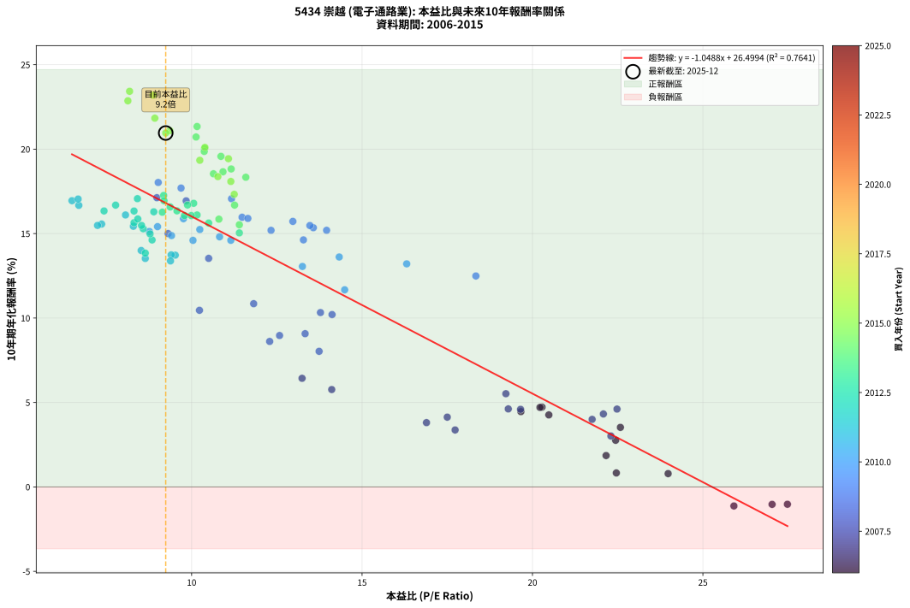
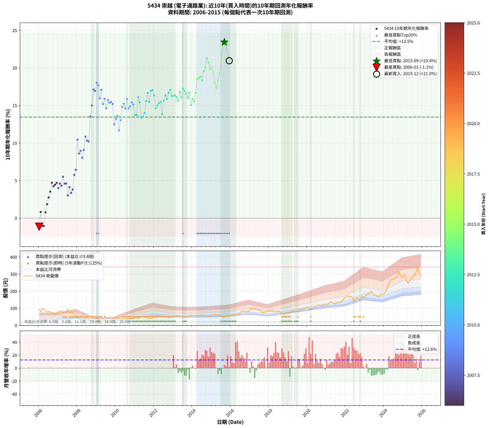

# 5434 崇越 - 本益比與未來報酬率分析

!!! info "報告資訊"
    - **股票代號**: 5434
    - **公司名稱**: 崇越
    - **產業別**: 電子通路業
    - **分析期間**: 2006-2015 (120 個數據點)
    - **資料來源**: Type 12 (ShowMonthlyK_ChartFlow) 月收盤價與本益比
    - **報酬率口徑**: 含現金股利 (簡化: 年度合計，假設每年7/1入帳)
    - **報告生成時間**: 2026-01-10 19:02:14 CST

## 📈 視覺化圖表

### 圖表1: 本益比 vs 未來報酬率關係

*圖表1：5434 崇越 本益比與10年期未來報酬率關係 (2006-2015)*

### 圖表2: 歷年買入時點的10年期實際報酬率

*圖表2：5434 崇越 歷年買入時點的10年期實際報酬率 (2006-2015)*

## 📍 買點訊號說明

本報告提供兩種買點提示訊號（顯示於圖表2的股價子圖中）：

### ▲ 小綠色三角形（回測驗證）
- **計算方式**: 使用全部歷史資料計算本益比第25百分位數
- **用途**: 事後驗證，顯示歷史上哪些時點確實為低估區
- **限制**: 當下無法判斷，僅供回測參考
- **特性**: 後見之明（Look-Ahead Bias）

### ▲ 小橘色三角形（即時訊號）
- **計算方式**: 使用截至當月的過去5年資料計算本益比第25百分位數
- **用途**: 實際投資決策，當時即可判斷
- **優勢**: 可操作性強，符合實務需求
- **特性**: 無後見之明，滾動窗口計算

!!! tip "如何使用兩種訊號"
    - **綠色▲** 幫助理解歷史估值機會，驗證策略有效性
    - **橘色▲** 可作為實際買進參考，但仍需搭配基本面分析
    - 兩種訊號重疊時，表示即時判斷與事後驗證一致，信心度較高
    - 僅有綠色▲時，表示當時無法判斷（需要未來資料才能確認）
    - 僅有橘色▲時，表示即時判斷為買點，但事後可能不是最佳時機

## 📊 估值分析摘要

| 指標 | 數值 |
|:---:|:---:|
| **目前本益比** (2015-12) | **9.24 倍** |
| **歷史平均本益比** | 12.44 倍 |
| **估值水準** | 🟢 相對低估 |
| **預期10年年化報酬率** | **+16.81%** |
| **歷史平均報酬率** | +13.45% |
| **相關係數 (R²)** | 0.7641 |
| **趨勢線斜率** | -1.0488 |

!!! abstract "核心洞察"
    目前本益比顯著低於歷史平均，預期未來報酬率可能較高

    根據歷史數據回測，5434 崇越 在目前本益比 **9.2倍** 的估值水準下，
    預期未來10年年化報酬率約為 **+16.8%**。

    **重要提醒**: 本分析基於歷史數據統計，實際報酬率會受到公司基本面變化、產業趨勢、
    總體經濟環境等多重因素影響。R² = 0.76 表示本益比可解釋約 76.4% 的報酬率變異。

## 📈 歷史估值統計

### 最佳買點 (最高報酬率)

| 項目 | 數值 |
|:---:|:---:|
| 起始時間 | 2015-09 |
| 當時本益比 | 8.18 倍 |
| 起始價格 | 47.2 元 |
| 10年後價格 | 314.0 元 |
| **10年年化報酬率** | **+23.42%** |

### 最差買點 (最低報酬率)

| 項目 | 數值 |
|:---:|:---:|
| 起始時間 | 2006-01 |
| 當時本益比 | 25.91 倍 |
| 起始價格 | 92.5 元 |
| 10年後價格 | 54.0 元 |
| **10年年化報酬率** | **-1.13%** |

## 🎯 投資啟示

### 本益比與報酬率關係

趨勢線方程式: **y = -1.0488x + 26.4994**

!!! warning "強負相關"
    本益比與未來報酬率呈現強負相關。在高本益比時期買入，未來報酬率顯著較低；
    在低本益比時期買入，未來報酬率顯著較高。**估值紀律至關重要**。

### 估值區間建議

基於歷史數據分析:

- **🟢 低估區** (P/E < 10.0): 預期報酬率較高，可考慮增加持股
- **🟡 合理區** (P/E 10.0-14.9): 預期報酬率符合長期趨勢，正常持有
- **🔴 高估區** (P/E > 14.9): 預期報酬率較低，可考慮減碼或觀望

!!! danger "風險提示"
    - 過去表現不代表未來結果
    - 本分析假設公司基本面無重大結構性變化
    - 產業環境劇變可能使歷史規律失效
    - 應結合公司財報、產業趨勢、總體經濟等多重因素綜合判斷

!!! success "長期投資觀點"
    歷史數據顯示，在合理或低估的估值水準買入並長期持有，
    往往能獲得較佳的投資報酬。**耐心等待好價格**是價值投資的核心原則。

## 📊 數據品質

- **資料來源**: GoodInfo.tw Type 12 (ShowMonthlyK_ChartFlow)
- **資料頻率**: 月度收盤價與本益比
- **回測期間**: 2006-2015
- **數據點數量**: 120 個 (每個點代表一次10年期回測)

### 計算方法說明

1. **10年期年化報酬率**:
   - 對每個歷史時點，計算其後10年的實際投資報酬率
   - 期末價值(不含股利): 期末價格
   - 期末價值(含現金股利): 期末價格 + 持有期間內的現金股利合計 (簡化: 年度合計，假設每年7/1入帳)
   - 公式: 年化報酬率 = [(期末價值/期初價格)^(1/年數) - 1] × 100%

2. **本益比 (P/E Ratio)**:
   - 使用當時的月收盤價與EPS計算
   - 資料來源: Type 12 月度河流圖本益比數據

3. **趨勢線 (Linear Regression)**:
   - 使用最小平方法擬合線性趨勢線
   - R²值衡量本益比對報酬率的解釋能力

---

*本報告由 Stock Analysis System v1.9.0 自動生成*
*數據更新時間: 2026-01-10 19:02:14 CST*

## 📋 月度回測明細表

（每一列對應時間線圖中的一個買入點；可用來對照 SVG 圖上的每個點。）

| 買入月份 | 賣出月份 | 回測期限_年 | 實際持有年數 | 買入本益比_倍 | 買入收盤價_元 | 賣出收盤價_元 | 現金股利合計_元 | 總報酬率_pct | 年化報酬率_pct |
| --- | --- | --- | --- | --- | --- | --- | --- | --- | --- |
| 2006-01 | 2016-01 | 10 | 9.999 | 25.91 | 92.50 | 54.00 | 28.58 | -10.72 | -1.13 |
| 2006-02 | 2016-02 | 10 | 9.999 | 22.46 | 80.20 | 58.50 | 28.58 | +8.58 | +0.83 |
| 2006-03 | 2016-03 | 10 | 10.001 | 27.48 | 98.10 | 59.90 | 28.58 | -9.81 | -1.03 |
| 2006-04 | 2016-04 | 10 | 10.001 | 27.03 | 96.50 | 58.40 | 28.58 | -9.86 | -1.03 |
| 2006-05 | 2016-05 | 10 | 10.001 | 23.98 | 85.60 | 64.00 | 28.58 | +8.16 | +0.79 |
| 2006-06 | 2016-06 | 10 | 10.001 | 22.16 | 79.10 | 66.50 | 28.58 | +20.20 | +1.86 |
| 2006-07 | 2016-07 | 10 | 10.001 | 22.44 | 80.10 | 75.20 | 29.98 | +31.31 | +2.76 |
| 2006-08 | 2016-08 | 10 | 10.001 | 22.58 | 80.60 | 84.00 | 29.98 | +41.42 | +3.53 |
| 2006-09 | 2016-09 | 10 | 10.001 | 20.28 | 72.40 | 84.90 | 29.98 | +58.68 | +4.72 |
| 2006-10 | 2016-10 | 10 | 10.001 | 20.48 | 73.10 | 81.00 | 29.98 | +51.82 | +4.26 |
| 2006-11 | 2016-11 | 10 | 10.001 | 19.66 | 70.20 | 78.60 | 29.98 | +54.67 | +4.46 |
| 2006-12 | 2016-12 | 10 | 10.001 | 20.22 | 72.20 | 84.40 | 29.98 | +58.42 | +4.71 |
| 2007-01 | 2017-01 | 10 | 10.001 | 21.75 | 79.50 | 87.70 | 29.98 | +48.03 | +4.00 |
| 2007-02 | 2017-02 | 10 | 10.001 | 22.48 | 84.10 | 102.00 | 29.98 | +56.93 | +4.61 |
| 2007-03 | 2017-03 | 10 | 10.001 | 22.08 | 84.50 | 99.00 | 29.98 | +52.64 | +4.32 |
| 2007-04 | 2017-04 | 10 | 10.001 | 19.22 | 75.20 | 98.70 | 29.98 | +71.12 | +5.52 |
| 2007-05 | 2017-05 | 10 | 10.001 | 19.65 | 78.60 | 93.20 | 29.98 | +56.72 | +4.59 |
| 2007-06 | 2017-06 | 10 | 10.001 | 19.29 | 78.80 | 93.80 | 29.98 | +57.08 | +4.62 |
| 2007-07 | 2017-07 | 10 | 10.001 | 22.30 | 93.00 | 92.50 | 32.68 | +34.60 | +3.02 |
| 2007-08 | 2017-08 | 10 | 10.001 | 17.50 | 74.50 | 79.00 | 32.68 | +49.91 | +4.13 |
| 2007-09 | 2017-09 | 10 | 10.001 | 17.73 | 77.00 | 74.60 | 32.68 | +39.33 | +3.37 |
| 2007-10 | 2017-10 | 10 | 10.001 | 16.89 | 74.80 | 76.00 | 32.68 | +45.30 | +3.81 |
| 2007-11 | 2017-11 | 10 | 10.001 | 14.11 | 63.70 | 78.90 | 32.68 | +75.17 | +5.76 |
| 2007-12 | 2017-12 | 10 | 10.001 | 13.24 | 60.90 | 80.90 | 32.68 | +86.50 | +6.43 |
| 2008-01 | 2018-01 | 10 | 10.001 | 10.23 | 45.00 | 89.00 | 32.68 | +170.40 | +10.46 |
| 2008-02 | 2018-03 | 10 | 10.081 | 12.29 | 51.60 | 86.00 | 32.68 | +130.00 | +8.61 |
| 2008-03 | 2018-03 | 10 | 9.999 | 12.58 | 50.30 | 86.00 | 32.68 | +135.95 | +8.96 |
| 2008-04 | 2018-04 | 10 | 9.999 | 13.74 | 52.20 | 80.30 | 32.68 | +116.44 | +8.03 |
| 2008-05 | 2018-05 | 10 | 9.999 | 13.33 | 48.00 | 81.70 | 32.68 | +138.29 | +9.07 |
| 2008-06 | 2018-06 | 10 | 9.999 | 11.82 | 40.20 | 79.90 | 32.68 | +180.05 | +10.85 |
| 2008-07 | 2018-07 | 10 | 9.999 | 13.78 | 44.10 | 83.90 | 33.88 | +167.08 | +10.32 |
| 2008-08 | 2018-08 | 10 | 9.999 | 14.12 | 42.35 | 78.00 | 33.88 | +164.18 | +10.20 |
| 2008-09 | 2018-09 | 10 | 9.999 | 10.50 | 29.40 | 70.70 | 33.88 | +255.72 | +13.53 |
| 2008-10 | 2018-10 | 10 | 9.999 | 9.31 | 24.20 | 64.00 | 33.88 | +304.47 | +15.00 |
| 2008-11 | 2018-11 | 10 | 9.999 | 8.98 | 21.55 | 70.80 | 33.88 | +385.76 | +17.13 |
| 2008-12 | 2018-12 | 10 | 9.999 | 9.84 | 21.65 | 69.60 | 33.88 | +377.97 | +16.94 |
| 2009-01 | 2019-01 | 10 | 9.999 | 9.02 | 20.00 | 71.00 | 33.88 | +424.40 | +18.03 |
| 2009-02 | 2019-02 | 10 | 9.999 | 9.69 | 21.65 | 76.50 | 33.88 | +409.84 | +17.69 |
| 2009-03 | 2019-03 | 10 | 9.999 | 11.48 | 25.85 | 79.80 | 33.88 | +339.77 | +15.97 |
| 2009-04 | 2019-04 | 10 | 9.999 | 11.17 | 25.35 | 88.60 | 33.88 | +383.16 | +17.06 |
| 2009-05 | 2019-05 | 10 | 9.999 | 12.33 | 28.20 | 82.10 | 33.88 | +311.28 | +15.19 |
| 2009-06 | 2019-06 | 10 | 9.999 | 11.65 | 26.85 | 83.50 | 33.88 | +337.17 | +15.90 |
| 2009-07 | 2019-07 | 10 | 9.999 | 13.28 | 30.85 | 82.90 | 37.88 | +291.51 | +14.63 |
| 2009-08 | 2019-08 | 10 | 9.999 | 12.97 | 30.35 | 92.80 | 37.88 | +330.58 | +15.72 |
| 2009-09 | 2019-09 | 10 | 9.999 | 13.57 | 32.00 | 95.50 | 37.88 | +316.82 | +15.35 |
| 2009-10 | 2019-10 | 10 | 9.999 | 13.47 | 32.00 | 97.00 | 37.88 | +321.50 | +15.48 |
| 2009-11 | 2019-11 | 10 | 9.999 | 13.96 | 33.40 | 99.50 | 37.88 | +311.32 | +15.19 |
| 2009-12 | 2019-12 | 10 | 9.999 | 18.34 | 44.20 | 105.50 | 37.88 | +224.39 | +12.49 |
| 2010-01 | 2020-01 | 10 | 9.999 | 16.31 | 42.20 | 108.00 | 37.88 | +245.69 | +13.21 |
| 2010-02 | 2020-02 | 10 | 9.999 | 14.33 | 39.60 | 104.00 | 37.88 | +258.29 | +13.61 |
| 2010-03 | 2020-03 | 10 | 10.001 | 14.49 | 42.60 | 90.60 | 37.88 | +201.60 | +11.67 |
| 2010-04 | 2020-04 | 10 | 10.001 | 13.25 | 41.30 | 103.00 | 37.88 | +241.12 | +13.05 |
| 2010-05 | 2020-05 | 10 | 10.001 | 10.82 | 35.65 | 104.00 | 37.88 | +297.98 | +14.81 |
| 2010-06 | 2020-06 | 10 | 10.001 | 10.24 | 35.55 | 109.00 | 37.88 | +313.17 | +15.24 |
| 2010-07 | 2020-07 | 10 | 10.001 | 11.15 | 40.65 | 116.00 | 42.88 | +290.85 | +14.60 |
| 2010-08 | 2020-08 | 10 | 10.001 | 9.76 | 37.30 | 120.00 | 42.88 | +336.68 | +15.88 |
| 2010-09 | 2020-09 | 10 | 10.001 | 10.04 | 40.15 | 114.00 | 42.88 | +290.74 | +14.60 |
| 2010-10 | 2020-10 | 10 | 10.001 | 9.41 | 39.30 | 114.50 | 42.88 | +300.46 | +14.88 |
| 2010-11 | 2020-11 | 10 | 10.001 | 9.00 | 39.20 | 121.50 | 42.88 | +319.34 | +15.41 |
| 2010-12 | 2020-12 | 10 | 10.001 | 8.76 | 39.70 | 119.50 | 42.88 | +309.02 | +15.12 |
| 2011-01 | 2021-01 | 10 | 10.001 | 9.52 | 44.60 | 118.50 | 42.88 | +261.84 | +13.72 |
| 2011-02 | 2021-02 | 10 | 10.001 | 9.40 | 45.50 | 122.00 | 42.88 | +262.38 | +13.74 |
| 2011-03 | 2021-03 | 10 | 10.001 | 8.06 | 40.30 | 136.50 | 42.88 | +345.11 | +16.10 |
| 2011-04 | 2021-04 | 10 | 10.001 | 8.29 | 42.70 | 136.50 | 42.88 | +320.10 | +15.43 |
| 2011-05 | 2021-05 | 10 | 10.001 | 9.38 | 49.80 | 132.00 | 42.88 | +251.17 | +13.38 |
| 2011-06 | 2021-06 | 10 | 10.001 | 8.64 | 47.20 | 125.00 | 42.88 | +255.68 | +13.53 |
| 2011-07 | 2021-07 | 10 | 10.001 | 8.52 | 47.90 | 129.50 | 48.08 | +270.73 | +14.00 |
| 2011-08 | 2021-08 | 10 | 10.001 | 7.36 | 42.50 | 132.50 | 48.08 | +324.90 | +15.56 |
| 2011-09 | 2021-09 | 10 | 10.001 | 6.69 | 39.70 | 137.50 | 48.08 | +367.46 | +16.67 |
| 2011-10 | 2021-10 | 10 | 10.001 | 7.24 | 44.10 | 138.00 | 48.08 | +321.95 | +15.48 |
| 2011-11 | 2021-11 | 10 | 10.001 | 6.49 | 40.55 | 146.00 | 48.08 | +378.62 | +16.95 |
| 2011-12 | 2021-12 | 10 | 10.001 | 6.67 | 42.70 | 158.00 | 48.08 | +382.63 | +17.04 |
| 2012-01 | 2022-01 | 10 | 10.001 | 7.43 | 46.90 | 165.00 | 48.08 | +354.33 | +16.34 |
| 2012-02 | 2022-03 | 10 | 10.081 | 8.84 | 55.10 | 170.00 | 48.08 | +295.79 | +14.62 |
| 2012-03 | 2022-03 | 10 | 9.999 | 8.78 | 54.00 | 170.00 | 48.08 | +303.85 | +14.98 |
| 2012-04 | 2022-04 | 10 | 9.999 | 8.58 | 52.00 | 167.50 | 48.08 | +314.58 | +15.28 |
| 2012-05 | 2022-05 | 10 | 9.999 | 8.53 | 51.00 | 167.00 | 48.08 | +321.73 | +15.48 |
| 2012-06 | 2022-06 | 10 | 9.999 | 8.64 | 50.90 | 138.00 | 48.08 | +265.58 | +13.84 |
| 2012-07 | 2022-07 | 10 | 9.999 | 8.31 | 48.30 | 154.00 | 52.58 | +327.70 | +15.64 |
| 2012-08 | 2022-08 | 10 | 9.999 | 8.31 | 47.60 | 163.50 | 52.58 | +353.95 | +16.33 |
| 2012-09 | 2022-09 | 10 | 9.999 | 8.42 | 47.50 | 154.50 | 52.58 | +335.96 | +15.87 |
| 2012-10 | 2022-10 | 10 | 9.999 | 7.77 | 43.20 | 149.50 | 52.58 | +367.78 | +16.68 |
| 2012-11 | 2022-11 | 10 | 9.999 | 8.41 | 46.05 | 170.00 | 52.58 | +383.35 | +17.07 |
| 2012-12 | 2022-12 | 10 | 9.999 | 8.89 | 47.90 | 164.00 | 52.58 | +352.15 | +16.29 |
| 2013-01 | 2023-01 | 10 | 9.999 | 9.14 | 49.10 | 169.00 | 52.58 | +351.29 | +16.27 |
| 2013-02 | 2023-02 | 10 | 9.999 | 9.57 | 51.30 | 180.50 | 52.58 | +354.35 | +16.35 |
| 2013-03 | 2023-03 | 10 | 9.999 | 10.16 | 54.30 | 189.00 | 52.58 | +344.90 | +16.10 |
| 2013-04 | 2023-04 | 10 | 9.999 | 10.50 | 56.00 | 186.50 | 52.58 | +326.93 | +15.62 |
| 2013-05 | 2023-05 | 10 | 9.999 | 10.06 | 53.50 | 200.00 | 52.58 | +372.11 | +16.79 |
| 2013-06 | 2023-06 | 10 | 9.999 | 9.99 | 53.00 | 182.50 | 52.58 | +343.55 | +16.07 |
| 2013-07 | 2023-07 | 10 | 9.999 | 9.18 | 48.55 | 179.50 | 59.00 | +391.25 | +17.26 |
| 2013-08 | 2023-08 | 10 | 9.999 | 9.19 | 48.50 | 173.00 | 59.00 | +378.35 | +16.95 |
| 2013-09 | 2023-09 | 10 | 9.999 | 9.37 | 49.30 | 169.50 | 59.00 | +363.49 | +16.58 |
| 2013-10 | 2023-10 | 10 | 9.999 | 9.79 | 51.40 | 169.00 | 59.00 | +343.58 | +16.07 |
| 2013-11 | 2023-11 | 10 | 9.999 | 9.88 | 51.70 | 183.00 | 59.00 | +368.09 | +16.69 |
| 2013-12 | 2023-12 | 10 | 9.999 | 11.40 | 59.50 | 182.50 | 59.00 | +305.88 | +15.04 |
| 2014-01 | 2024-01 | 10 | 9.999 | 10.80 | 56.60 | 187.50 | 59.00 | +335.51 | +15.85 |
| 2014-02 | 2024-02 | 10 | 9.999 | 11.40 | 59.90 | 194.50 | 59.00 | +323.21 | +15.52 |
| 2014-03 | 2024-03 | 10 | 10.001 | 11.26 | 59.40 | 219.00 | 59.00 | +368.01 | +16.69 |
| 2014-04 | 2024-04 | 10 | 10.001 | 10.64 | 56.30 | 249.50 | 59.00 | +447.96 | +18.54 |
| 2014-05 | 2024-05 | 10 | 10.001 | 10.92 | 58.00 | 262.00 | 59.00 | +453.45 | +18.66 |
| 2014-06 | 2024-06 | 10 | 10.001 | 11.16 | 59.50 | 275.00 | 59.00 | +461.34 | +18.83 |
| 2014-07 | 2024-07 | 10 | 10.001 | 11.59 | 62.00 | 268.50 | 65.40 | +438.54 | +18.33 |
| 2014-08 | 2024-08 | 10 | 10.001 | 10.86 | 58.30 | 283.00 | 65.40 | +497.59 | +19.57 |
| 2014-09 | 2024-09 | 10 | 10.001 | 10.38 | 55.90 | 282.00 | 65.40 | +521.46 | +20.04 |
| 2014-10 | 2024-10 | 10 | 10.001 | 10.16 | 54.90 | 314.50 | 65.40 | +591.98 | +21.34 |
| 2014-11 | 2024-11 | 10 | 10.001 | 10.13 | 54.90 | 295.50 | 65.40 | +557.37 | +20.72 |
| 2014-12 | 2024-12 | 10 | 10.001 | 10.37 | 56.40 | 280.00 | 65.40 | +512.41 | +19.87 |
| 2015-01 | 2025-01 | 10 | 10.001 | 10.39 | 56.90 | 290.00 | 65.40 | +524.60 | +20.10 |
| 2015-02 | 2025-02 | 10 | 10.001 | 11.08 | 61.10 | 295.50 | 65.40 | +490.67 | +19.43 |
| 2015-03 | 2025-03 | 10 | 10.001 | 11.15 | 61.90 | 261.00 | 65.40 | +427.30 | +18.09 |
| 2015-04 | 2025-04 | 10 | 10.001 | 11.25 | 62.90 | 245.50 | 65.40 | +394.27 | +17.32 |
| 2015-05 | 2025-05 | 10 | 10.001 | 10.77 | 60.60 | 262.00 | 65.40 | +440.26 | +18.37 |
| 2015-06 | 2025-06 | 10 | 10.001 | 10.24 | 58.00 | 274.50 | 65.40 | +486.03 | +19.34 |
| 2015-07 | 2025-07 | 10 | 10.001 | 9.36 | 53.40 | 288.50 | 73.69 | +578.25 | +21.10 |
| 2015-08 | 2025-08 | 10 | 10.001 | 8.13 | 46.65 | 292.00 | 73.69 | +683.89 | +22.86 |
| 2015-09 | 2025-09 | 10 | 10.001 | 8.18 | 47.25 | 314.00 | 73.69 | +720.50 | +23.42 |
| 2015-10 | 2025-10 | 10 | 10.001 | 8.87 | 51.60 | 342.00 | 73.69 | +705.59 | +23.20 |
| 2015-11 | 2025-11 | 10 | 10.001 | 8.92 | 52.20 | 302.50 | 73.69 | +620.66 | +21.83 |
| 2015-12 | 2025-12 | 10 | 10.001 | 9.24 | 54.40 | 291.00 | 73.69 | +570.38 | +20.95 |
