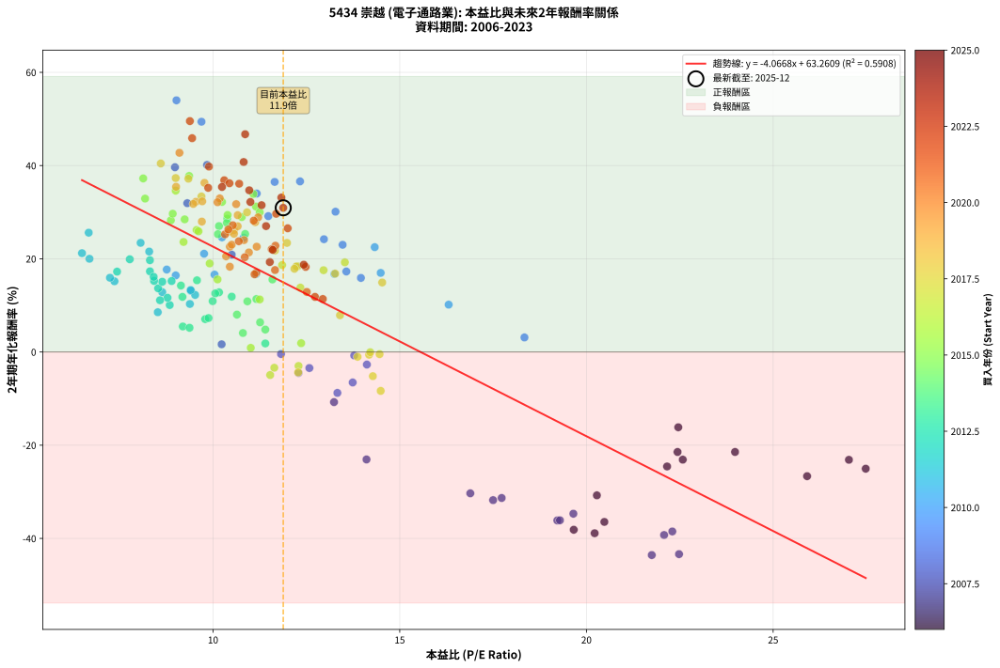
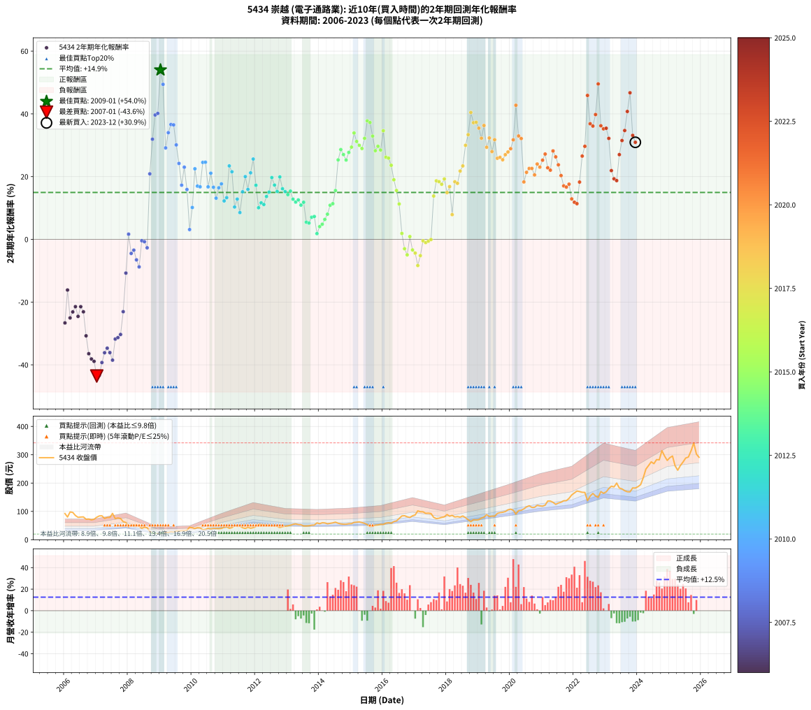

# 5434 崇越 - 本益比與未來報酬率分析

!!! info "報告資訊"
    - **股票代號**: 5434
    - **公司名稱**: 崇越
    - **產業別**: 電子通路業
    - **分析期間**: 2006-2023 (216 個數據點)
    - **資料來源**: Type 12 (ShowMonthlyK_ChartFlow) 月收盤價與本益比
    - **報酬率口徑**: 含現金股利 (簡化: 年度合計，假設每年7/1入帳)
    - **報告生成時間**: 2026-01-04 08:50:42 CST

## 📈 視覺化圖表

### 圖表1: 本益比 vs 未來報酬率關係

*圖表1：5434 崇越 本益比與2年期未來報酬率關係 (2006-2023)*

### 圖表2: 歷年買入時點的2年期實際報酬率

*圖表2：5434 崇越 歷年買入時點的2年期實際報酬率 (2006-2023)*

## 📍 買點訊號說明

本報告提供兩種買點提示訊號（顯示於圖表2的股價子圖中）：

### ▲ 小綠色三角形（回測驗證）
- **計算方式**: 使用全部歷史資料計算本益比第25百分位數
- **用途**: 事後驗證，顯示歷史上哪些時點確實為低估區
- **限制**: 當下無法判斷，僅供回測參考
- **特性**: 後見之明（Look-Ahead Bias）

### ▲ 小橘色三角形（即時訊號）
- **計算方式**: 使用截至當月的過去5年資料計算本益比第25百分位數
- **用途**: 實際投資決策，當時即可判斷
- **優勢**: 可操作性強，符合實務需求
- **特性**: 無後見之明，滾動窗口計算

!!! tip "如何使用兩種訊號"
    - **綠色▲** 幫助理解歷史估值機會，驗證策略有效性
    - **橘色▲** 可作為實際買進參考，但仍需搭配基本面分析
    - 兩種訊號重疊時，表示即時判斷與事後驗證一致，信心度較高
    - 僅有綠色▲時，表示當時無法判斷（需要未來資料才能確認）
    - 僅有橘色▲時，表示即時判斷為買點，但事後可能不是最佳時機

## 📊 估值分析摘要

| 指標 | 數值 |
|:---:|:---:|
| **目前本益比** (2023-12) | **11.88 倍** |
| **歷史平均本益比** | 11.88 倍 |
| **估值水準** | 🟡 合理範圍 |
| **預期2年年化報酬率** | **+14.95%** |
| **歷史平均報酬率** | +14.95% |
| **相關係數 (R²)** | 0.5908 |
| **趨勢線斜率** | -4.0668 |

!!! abstract "核心洞察"
    目前本益比接近歷史平均，預期報酬率符合長期趨勢

    根據歷史數據回測，5434 崇越 在目前本益比 **11.9倍** 的估值水準下，
    預期未來2年年化報酬率約為 **+14.9%**。

    **重要提醒**: 本分析基於歷史數據統計，實際報酬率會受到公司基本面變化、產業趨勢、
    總體經濟環境等多重因素影響。R² = 0.59 表示本益比可解釋約 59.1% 的報酬率變異。

## 📈 歷史估值統計

### 最佳買點 (最高報酬率)

| 項目 | 數值 |
|:---:|:---:|
| 起始時間 | 2009-01 |
| 當時本益比 | 9.02 倍 |
| 起始價格 | 20.0 元 |
| 2年後價格 | 44.6 元 |
| **2年年化報酬率** | **+53.99%** |

### 最差買點 (最低報酬率)

| 項目 | 數值 |
|:---:|:---:|
| 起始時間 | 2007-01 |
| 當時本益比 | 21.75 倍 |
| 起始價格 | 79.5 元 |
| 2年後價格 | 20.0 元 |
| **2年年化報酬率** | **-43.57%** |

## 🎯 投資啟示

### 本益比與報酬率關係

趨勢線方程式: **y = -4.0668x + 63.2609**

!!! warning "強負相關"
    本益比與未來報酬率呈現強負相關。在高本益比時期買入，未來報酬率顯著較低；
    在低本益比時期買入，未來報酬率顯著較高。**估值紀律至關重要**。

### 估值區間建議

基於歷史數據分析:

- **🟢 低估區** (P/E < 9.5): 預期報酬率較高，可考慮增加持股
- **🟡 合理區** (P/E 9.5-14.3): 預期報酬率符合長期趨勢，正常持有
- **🔴 高估區** (P/E > 14.3): 預期報酬率較低，可考慮減碼或觀望

!!! danger "風險提示"
    - 過去表現不代表未來結果
    - 本分析假設公司基本面無重大結構性變化
    - 產業環境劇變可能使歷史規律失效
    - 應結合公司財報、產業趨勢、總體經濟等多重因素綜合判斷

!!! success "長期投資觀點"
    歷史數據顯示，在合理或低估的估值水準買入並長期持有，
    往往能獲得較佳的投資報酬。**耐心等待好價格**是價值投資的核心原則。

## 📊 數據品質

- **資料來源**: GoodInfo.tw Type 12 (ShowMonthlyK_ChartFlow)
- **資料頻率**: 月度收盤價與本益比
- **回測期間**: 2006-2023
- **數據點數量**: 216 個 (每個點代表一次2年期回測)

### 計算方法說明

1. **2年期年化報酬率**:
   - 對每個歷史時點，計算其後2年的實際投資報酬率
   - 期末價值(不含股利): 期末價格
   - 期末價值(含現金股利): 期末價格 + 持有期間內的現金股利合計 (簡化: 年度合計，假設每年7/1入帳)
   - 公式: 年化報酬率 = [(期末價值/期初價格)^(1/年數) - 1] × 100%

2. **本益比 (P/E Ratio)**:
   - 使用當時的月收盤價與EPS計算
   - 資料來源: Type 12 月度河流圖本益比數據

3. **趨勢線 (Linear Regression)**:
   - 使用最小平方法擬合線性趨勢線
   - R²值衡量本益比對報酬率的解釋能力

---

*本報告由 Stock Analysis System v1.9.0 自動生成*
*數據更新時間: 2026-01-04 08:50:42 CST*

## 📋 月度回測明細表

（每一列對應時間線圖中的一個買入點；可用來對照 SVG 圖上的每個點。）

| 買入月份 | 賣出月份 | 回測期限_年 | 實際持有年數 | 買入本益比_倍 | 買入收盤價_元 | 賣出收盤價_元 | 現金股利合計_元 | 總報酬率_pct | 年化報酬率_pct |
| --- | --- | --- | --- | --- | --- | --- | --- | --- | --- |
| 2006-01 | 2008-01 | 2 | 1.999 | 25.91 | 92.50 | 45.00 | 4.80 | -46.16 | -26.64 |
| 2006-02 | 2008-02 | 2 | 1.999 | 22.46 | 80.20 | 51.60 | 4.80 | -29.68 | -16.15 |
| 2006-03 | 2008-03 | 2 | 2.001 | 27.48 | 98.10 | 50.30 | 4.80 | -43.83 | -25.04 |
| 2006-04 | 2008-04 | 2 | 2.001 | 27.03 | 96.50 | 52.20 | 4.80 | -40.93 | -23.13 |
| 2006-05 | 2008-05 | 2 | 2.001 | 23.98 | 85.60 | 48.00 | 4.80 | -38.32 | -21.45 |
| 2006-06 | 2008-06 | 2 | 2.001 | 22.16 | 79.10 | 40.20 | 4.80 | -43.11 | -24.56 |
| 2006-07 | 2008-07 | 2 | 2.001 | 22.44 | 80.10 | 44.10 | 5.30 | -38.33 | -21.45 |
| 2006-08 | 2008-08 | 2 | 2.001 | 22.58 | 80.60 | 42.35 | 5.30 | -40.88 | -23.10 |
| 2006-09 | 2008-09 | 2 | 2.001 | 20.28 | 72.40 | 29.40 | 5.30 | -52.07 | -30.75 |
| 2006-10 | 2008-10 | 2 | 2.001 | 20.48 | 73.10 | 24.20 | 5.30 | -59.64 | -36.45 |
| 2006-11 | 2008-11 | 2 | 2.001 | 19.66 | 70.20 | 21.55 | 5.30 | -61.75 | -38.13 |
| 2006-12 | 2008-12 | 2 | 2.001 | 20.22 | 72.20 | 21.65 | 5.30 | -62.67 | -38.88 |
| 2007-01 | 2009-01 | 2 | 2.001 | 21.75 | 79.50 | 20.00 | 5.30 | -68.18 | -43.57 |
| 2007-02 | 2009-02 | 2 | 2.001 | 22.48 | 84.10 | 21.65 | 5.30 | -67.95 | -43.37 |
| 2007-03 | 2009-03 | 2 | 2.001 | 22.08 | 84.50 | 25.85 | 5.30 | -63.14 | -39.26 |
| 2007-04 | 2009-04 | 2 | 2.001 | 19.22 | 75.20 | 25.35 | 5.30 | -59.24 | -36.14 |
| 2007-05 | 2009-05 | 2 | 2.001 | 19.65 | 78.60 | 28.20 | 5.30 | -57.38 | -34.70 |
| 2007-06 | 2009-06 | 2 | 2.001 | 19.29 | 78.80 | 26.85 | 5.30 | -59.20 | -36.11 |
| 2007-07 | 2009-07 | 2 | 2.001 | 22.30 | 93.00 | 30.85 | 4.30 | -62.20 | -38.50 |
| 2007-08 | 2009-08 | 2 | 2.001 | 17.50 | 74.50 | 30.35 | 4.30 | -53.49 | -31.78 |
| 2007-09 | 2009-09 | 2 | 2.001 | 17.73 | 77.00 | 32.00 | 4.30 | -52.86 | -31.32 |
| 2007-10 | 2009-10 | 2 | 2.001 | 16.89 | 74.80 | 32.00 | 4.30 | -51.47 | -30.32 |
| 2007-11 | 2009-11 | 2 | 2.001 | 14.11 | 63.70 | 33.40 | 4.30 | -40.82 | -23.06 |
| 2007-12 | 2009-12 | 2 | 2.001 | 13.24 | 60.90 | 44.20 | 4.30 | -20.36 | -10.75 |
| 2008-01 | 2010-01 | 2 | 2.001 | 10.23 | 45.00 | 42.20 | 4.30 | +3.33 | +1.65 |
| 2008-02 | 2010-03 | 2 | 2.081 | 12.29 | 51.60 | 42.60 | 4.30 | -9.11 | -4.49 |
| 2008-03 | 2010-03 | 2 | 1.999 | 12.58 | 50.30 | 42.60 | 4.30 | -6.76 | -3.44 |
| 2008-04 | 2010-04 | 2 | 1.999 | 13.74 | 52.20 | 41.30 | 4.30 | -12.64 | -6.54 |
| 2008-05 | 2010-05 | 2 | 1.999 | 13.33 | 48.00 | 35.65 | 4.30 | -16.77 | -8.78 |
| 2008-06 | 2010-06 | 2 | 1.999 | 11.82 | 40.20 | 35.55 | 4.30 | -0.87 | -0.44 |
| 2008-07 | 2010-07 | 2 | 1.999 | 13.78 | 44.10 | 40.65 | 2.80 | -1.47 | -0.74 |
| 2008-08 | 2010-08 | 2 | 1.999 | 14.12 | 42.35 | 37.30 | 2.80 | -5.31 | -2.69 |
| 2008-09 | 2010-09 | 2 | 1.999 | 10.50 | 29.40 | 40.15 | 2.80 | +46.09 | +20.88 |
| 2008-10 | 2010-10 | 2 | 1.999 | 9.31 | 24.20 | 39.30 | 2.80 | +73.97 | +31.92 |
| 2008-11 | 2010-11 | 2 | 1.999 | 8.98 | 21.55 | 39.20 | 2.80 | +94.90 | +39.64 |
| 2008-12 | 2010-12 | 2 | 1.999 | 9.84 | 21.65 | 39.70 | 2.80 | +96.30 | +40.14 |
| 2009-01 | 2011-01 | 2 | 1.999 | 9.02 | 20.00 | 44.60 | 2.80 | +137.00 | +53.99 |
| 2009-02 | 2011-02 | 2 | 1.999 | 9.69 | 21.65 | 45.50 | 2.80 | +123.09 | +49.40 |
| 2009-03 | 2011-03 | 2 | 1.999 | 11.48 | 25.85 | 40.30 | 2.80 | +66.73 | +29.15 |
| 2009-04 | 2011-04 | 2 | 1.999 | 11.17 | 25.35 | 42.70 | 2.80 | +79.49 | +34.00 |
| 2009-05 | 2011-05 | 2 | 1.999 | 12.33 | 28.20 | 49.80 | 2.80 | +86.52 | +36.60 |
| 2009-06 | 2011-06 | 2 | 1.999 | 11.65 | 26.85 | 47.20 | 2.80 | +86.22 | +36.49 |
| 2009-07 | 2011-07 | 2 | 1.999 | 13.28 | 30.85 | 47.90 | 4.30 | +69.21 | +30.10 |
| 2009-08 | 2011-08 | 2 | 1.999 | 12.97 | 30.35 | 42.50 | 4.30 | +54.20 | +24.20 |
| 2009-09 | 2011-09 | 2 | 1.999 | 13.57 | 32.00 | 39.70 | 4.30 | +37.50 | +17.27 |
| 2009-10 | 2011-10 | 2 | 1.999 | 13.47 | 32.00 | 44.10 | 4.30 | +51.25 | +23.00 |
| 2009-11 | 2011-11 | 2 | 1.999 | 13.96 | 33.40 | 40.55 | 4.30 | +34.28 | +15.89 |
| 2009-12 | 2011-12 | 2 | 1.999 | 18.34 | 44.20 | 42.70 | 4.30 | +6.33 | +3.12 |
| 2010-01 | 2012-01 | 2 | 1.999 | 16.31 | 42.20 | 46.90 | 4.30 | +21.33 | +10.16 |
| 2010-02 | 2012-02 | 2 | 1.999 | 14.33 | 39.60 | 55.10 | 4.30 | +50.00 | +22.49 |
| 2010-03 | 2012-03 | 2 | 2.001 | 14.49 | 42.60 | 54.00 | 4.30 | +36.85 | +16.97 |
| 2010-04 | 2012-04 | 2 | 2.001 | 13.25 | 41.30 | 52.00 | 4.30 | +36.32 | +16.74 |
| 2010-05 | 2012-05 | 2 | 2.001 | 10.82 | 35.65 | 51.00 | 4.30 | +55.12 | +24.53 |
| 2010-06 | 2012-06 | 2 | 2.001 | 10.24 | 35.55 | 50.90 | 4.30 | +55.27 | +24.59 |
| 2010-07 | 2012-07 | 2 | 2.001 | 11.15 | 40.65 | 48.30 | 7.10 | +36.29 | +16.73 |
| 2010-08 | 2012-08 | 2 | 2.001 | 9.76 | 37.30 | 47.60 | 7.10 | +46.65 | +21.08 |
| 2010-09 | 2012-09 | 2 | 2.001 | 10.04 | 40.15 | 47.50 | 7.10 | +35.99 | +16.60 |
| 2010-10 | 2012-10 | 2 | 2.001 | 9.41 | 39.30 | 43.20 | 7.10 | +27.99 | +13.12 |
| 2010-11 | 2012-11 | 2 | 2.001 | 9.00 | 39.20 | 46.05 | 7.10 | +35.59 | +16.43 |
| 2010-12 | 2012-12 | 2 | 2.001 | 8.76 | 39.70 | 47.90 | 7.10 | +38.54 | +17.69 |
| 2011-01 | 2013-01 | 2 | 2.001 | 9.52 | 44.60 | 49.10 | 7.10 | +26.01 | +12.24 |
| 2011-02 | 2013-02 | 2 | 2.001 | 9.40 | 45.50 | 51.30 | 7.10 | +28.35 | +13.28 |
| 2011-03 | 2013-03 | 2 | 2.001 | 8.06 | 40.30 | 54.30 | 7.10 | +52.36 | +23.42 |
| 2011-04 | 2013-04 | 2 | 2.001 | 8.29 | 42.70 | 56.00 | 7.10 | +47.78 | +21.55 |
| 2011-05 | 2013-05 | 2 | 2.001 | 9.38 | 49.80 | 53.50 | 7.10 | +21.69 | +10.30 |
| 2011-06 | 2013-06 | 2 | 2.001 | 8.64 | 47.20 | 53.00 | 7.10 | +27.33 | +12.83 |
| 2011-07 | 2013-07 | 2 | 2.001 | 8.52 | 47.90 | 48.55 | 7.88 | +17.81 | +8.53 |
| 2011-08 | 2013-08 | 2 | 2.001 | 7.36 | 42.50 | 48.50 | 7.88 | +32.66 | +15.17 |
| 2011-09 | 2013-09 | 2 | 2.001 | 6.69 | 39.70 | 49.30 | 7.88 | +44.03 | +20.00 |
| 2011-10 | 2013-10 | 2 | 2.001 | 7.24 | 44.10 | 51.40 | 7.88 | +34.42 | +15.93 |
| 2011-11 | 2013-11 | 2 | 2.001 | 6.49 | 40.55 | 51.70 | 7.88 | +46.93 | +21.20 |
| 2011-12 | 2013-12 | 2 | 2.001 | 6.67 | 42.70 | 59.50 | 7.88 | +57.80 | +25.60 |
| 2012-01 | 2014-01 | 2 | 2.001 | 7.43 | 46.90 | 56.60 | 7.88 | +37.49 | +17.24 |
| 2012-02 | 2014-03 | 2 | 2.081 | 8.84 | 55.10 | 59.40 | 7.88 | +22.11 | +10.07 |
| 2012-03 | 2014-03 | 2 | 1.999 | 8.78 | 54.00 | 59.40 | 7.88 | +24.59 | +11.63 |
| 2012-04 | 2014-04 | 2 | 1.999 | 8.58 | 52.00 | 56.30 | 7.88 | +23.42 | +11.10 |
| 2012-05 | 2014-05 | 2 | 1.999 | 8.53 | 51.00 | 58.00 | 7.88 | +29.18 | +13.67 |
| 2012-06 | 2014-06 | 2 | 1.999 | 8.64 | 50.90 | 59.50 | 7.88 | +32.38 | +15.07 |
| 2012-07 | 2014-07 | 2 | 1.999 | 8.31 | 48.30 | 62.00 | 7.18 | +43.23 | +19.69 |
| 2012-08 | 2014-08 | 2 | 1.999 | 8.31 | 47.60 | 58.30 | 7.18 | +37.57 | +17.30 |
| 2012-09 | 2014-09 | 2 | 1.999 | 8.42 | 47.50 | 55.90 | 7.18 | +32.80 | +15.25 |
| 2012-10 | 2014-10 | 2 | 1.999 | 7.77 | 43.20 | 54.90 | 7.18 | +43.71 | +19.89 |
| 2012-11 | 2014-11 | 2 | 1.999 | 8.41 | 46.05 | 54.90 | 7.18 | +34.81 | +16.12 |
| 2012-12 | 2014-12 | 2 | 1.999 | 8.89 | 47.90 | 56.40 | 7.18 | +32.74 | +15.22 |
| 2013-01 | 2015-01 | 2 | 1.999 | 9.14 | 49.10 | 56.90 | 7.18 | +30.51 | +14.25 |
| 2013-02 | 2015-02 | 2 | 1.999 | 9.57 | 51.30 | 61.10 | 7.18 | +33.10 | +15.38 |
| 2013-03 | 2015-03 | 2 | 1.999 | 10.16 | 54.30 | 61.90 | 7.18 | +27.22 | +12.80 |
| 2013-04 | 2015-04 | 2 | 1.999 | 10.50 | 56.00 | 62.90 | 7.18 | +25.14 | +11.88 |
| 2013-05 | 2015-05 | 2 | 1.999 | 10.06 | 53.50 | 60.60 | 7.18 | +26.69 | +12.57 |
| 2013-06 | 2015-06 | 2 | 1.999 | 9.99 | 53.00 | 58.00 | 7.18 | +22.98 | +10.91 |
| 2013-07 | 2015-07 | 2 | 1.999 | 9.18 | 48.55 | 53.40 | 7.30 | +25.03 | +11.82 |
| 2013-08 | 2015-08 | 2 | 1.999 | 9.19 | 48.50 | 46.65 | 7.30 | +11.24 | +5.47 |
| 2013-09 | 2015-09 | 2 | 1.999 | 9.37 | 49.30 | 47.25 | 7.30 | +10.65 | +5.19 |
| 2013-10 | 2015-10 | 2 | 1.999 | 9.79 | 51.40 | 51.60 | 7.30 | +14.59 | +7.05 |
| 2013-11 | 2015-11 | 2 | 1.999 | 9.88 | 51.70 | 52.20 | 7.30 | +15.09 | +7.28 |
| 2013-12 | 2015-12 | 2 | 1.999 | 11.40 | 59.50 | 54.40 | 7.30 | +3.70 | +1.83 |
| 2014-01 | 2016-01 | 2 | 1.999 | 10.80 | 56.60 | 54.00 | 7.30 | +8.30 | +4.07 |
| 2014-02 | 2016-02 | 2 | 1.999 | 11.40 | 59.90 | 58.50 | 7.30 | +9.85 | +4.81 |
| 2014-03 | 2016-03 | 2 | 2.001 | 11.26 | 59.40 | 59.90 | 7.30 | +13.13 | +6.36 |
| 2014-04 | 2016-04 | 2 | 2.001 | 10.64 | 56.30 | 58.40 | 7.30 | +16.70 | +8.02 |
| 2014-05 | 2016-05 | 2 | 2.001 | 10.92 | 58.00 | 64.00 | 7.30 | +22.93 | +10.87 |
| 2014-06 | 2016-06 | 2 | 2.001 | 11.16 | 59.50 | 66.50 | 7.30 | +24.03 | +11.36 |
| 2014-07 | 2016-07 | 2 | 2.001 | 11.59 | 62.00 | 75.20 | 7.60 | +33.55 | +15.55 |
| 2014-08 | 2016-08 | 2 | 2.001 | 10.86 | 58.30 | 84.00 | 7.60 | +57.12 | +25.33 |
| 2014-09 | 2016-09 | 2 | 2.001 | 10.38 | 55.90 | 84.90 | 7.60 | +65.47 | +28.61 |
| 2014-10 | 2016-10 | 2 | 2.001 | 10.16 | 54.90 | 81.00 | 7.60 | +61.38 | +27.02 |
| 2014-11 | 2016-11 | 2 | 2.001 | 10.13 | 54.90 | 78.60 | 7.60 | +57.01 | +25.29 |
| 2014-12 | 2016-12 | 2 | 2.001 | 10.37 | 56.40 | 84.40 | 7.60 | +63.12 | +27.70 |
| 2015-01 | 2017-01 | 2 | 2.001 | 10.39 | 56.90 | 87.70 | 7.60 | +67.49 | +29.39 |
| 2015-02 | 2017-02 | 2 | 2.001 | 11.08 | 61.10 | 102.00 | 7.60 | +79.38 | +33.91 |
| 2015-03 | 2017-03 | 2 | 2.001 | 11.15 | 61.90 | 99.00 | 7.60 | +72.21 | +31.21 |
| 2015-04 | 2017-04 | 2 | 2.001 | 11.25 | 62.90 | 98.70 | 7.60 | +69.00 | +29.98 |
| 2015-05 | 2017-05 | 2 | 2.001 | 10.77 | 60.60 | 93.20 | 7.60 | +66.34 | +28.95 |
| 2015-06 | 2017-06 | 2 | 2.001 | 10.24 | 58.00 | 93.80 | 7.60 | +74.83 | +32.20 |
| 2015-07 | 2017-07 | 2 | 2.001 | 9.36 | 53.40 | 92.50 | 8.90 | +89.89 | +37.77 |
| 2015-08 | 2017-08 | 2 | 2.001 | 8.13 | 46.65 | 79.00 | 8.90 | +88.42 | +37.24 |
| 2015-09 | 2017-09 | 2 | 2.001 | 8.18 | 47.25 | 74.60 | 8.90 | +76.72 | +32.91 |
| 2015-10 | 2017-10 | 2 | 2.001 | 8.87 | 51.60 | 76.00 | 8.90 | +64.53 | +28.25 |
| 2015-11 | 2017-11 | 2 | 2.001 | 8.92 | 52.20 | 78.90 | 8.90 | +68.20 | +29.67 |
| 2015-12 | 2017-12 | 2 | 2.001 | 9.24 | 54.40 | 80.90 | 8.90 | +65.07 | +28.46 |
| 2016-01 | 2018-01 | 2 | 2.001 | 9.00 | 54.00 | 89.00 | 8.90 | +81.30 | +34.62 |
| 2016-02 | 2018-03 | 2 | 2.081 | 9.56 | 58.50 | 86.00 | 8.90 | +62.22 | +26.18 |
| 2016-03 | 2018-03 | 2 | 1.999 | 9.61 | 59.90 | 86.00 | 8.90 | +58.43 | +25.89 |
| 2016-04 | 2018-04 | 2 | 1.999 | 9.21 | 58.40 | 80.30 | 8.90 | +52.74 | +23.61 |
| 2016-05 | 2018-05 | 2 | 1.999 | 9.91 | 64.00 | 81.70 | 8.90 | +41.56 | +18.99 |
| 2016-06 | 2018-06 | 2 | 1.999 | 10.12 | 66.50 | 79.90 | 8.90 | +33.53 | +15.57 |
| 2016-07 | 2018-07 | 2 | 1.999 | 11.25 | 75.20 | 83.90 | 9.20 | +23.80 | +11.28 |
| 2016-08 | 2018-08 | 2 | 1.999 | 12.36 | 84.00 | 78.00 | 9.20 | +3.81 | +1.89 |
| 2016-09 | 2018-09 | 2 | 1.999 | 12.29 | 84.90 | 70.70 | 9.20 | -5.89 | -2.99 |
| 2016-10 | 2018-10 | 2 | 1.999 | 11.53 | 81.00 | 64.00 | 9.20 | -9.63 | -4.94 |
| 2016-11 | 2018-11 | 2 | 1.999 | 11.01 | 78.60 | 70.80 | 9.20 | +1.78 | +0.89 |
| 2016-12 | 2018-12 | 2 | 1.999 | 11.64 | 84.40 | 69.60 | 9.20 | -6.64 | -3.38 |
| 2017-01 | 2019-01 | 2 | 1.999 | 12.28 | 87.70 | 71.00 | 9.20 | -8.55 | -4.37 |
| 2017-02 | 2019-02 | 2 | 1.999 | 14.49 | 102.00 | 76.50 | 9.20 | -15.98 | -8.34 |
| 2017-03 | 2019-03 | 2 | 1.999 | 14.28 | 99.00 | 79.80 | 9.20 | -10.10 | -5.19 |
| 2017-04 | 2019-04 | 2 | 1.999 | 14.46 | 98.70 | 88.60 | 9.20 | -0.91 | -0.46 |
| 2017-05 | 2019-05 | 2 | 1.999 | 13.87 | 93.20 | 82.10 | 9.20 | -2.04 | -1.03 |
| 2017-06 | 2019-06 | 2 | 1.999 | 14.18 | 93.80 | 83.50 | 9.20 | -1.17 | -0.59 |
| 2017-07 | 2019-07 | 2 | 1.999 | 14.21 | 92.50 | 82.90 | 9.50 | -0.11 | -0.05 |
| 2017-08 | 2019-08 | 2 | 1.999 | 12.34 | 79.00 | 92.80 | 9.50 | +29.49 | +13.81 |
| 2017-09 | 2019-09 | 2 | 1.999 | 11.85 | 74.60 | 95.50 | 9.50 | +40.75 | +18.65 |
| 2017-10 | 2019-10 | 2 | 1.999 | 12.27 | 76.00 | 97.00 | 9.50 | +40.13 | +18.39 |
| 2017-11 | 2019-11 | 2 | 1.999 | 12.96 | 78.90 | 99.50 | 9.50 | +38.15 | +17.55 |
| 2017-12 | 2019-12 | 2 | 1.999 | 13.53 | 80.90 | 105.50 | 9.50 | +42.15 | +19.24 |
| 2018-01 | 2020-01 | 2 | 1.999 | 14.53 | 89.00 | 108.00 | 9.50 | +32.02 | +14.91 |
| 2018-02 | 2020-02 | 2 | 1.999 | 13.27 | 83.20 | 104.00 | 9.50 | +36.42 | +16.81 |
| 2018-03 | 2020-03 | 2 | 2.001 | 13.40 | 86.00 | 90.60 | 9.50 | +16.40 | +7.88 |
| 2018-04 | 2020-04 | 2 | 2.001 | 12.23 | 80.30 | 103.00 | 9.50 | +40.10 | +18.35 |
| 2018-05 | 2020-05 | 2 | 2.001 | 12.18 | 81.70 | 104.00 | 9.50 | +38.92 | +17.85 |
| 2018-06 | 2020-06 | 2 | 2.001 | 11.66 | 79.90 | 109.00 | 9.50 | +48.31 | +21.77 |
| 2018-07 | 2020-07 | 2 | 2.001 | 11.98 | 83.90 | 116.00 | 11.80 | +52.32 | +23.40 |
| 2018-08 | 2020-08 | 2 | 2.001 | 10.91 | 78.00 | 120.00 | 11.80 | +68.97 | +29.97 |
| 2018-09 | 2020-09 | 2 | 2.001 | 9.69 | 70.70 | 114.00 | 11.80 | +77.93 | +33.37 |
| 2018-10 | 2020-10 | 2 | 2.001 | 8.60 | 64.00 | 114.50 | 11.80 | +97.34 | +40.45 |
| 2018-11 | 2020-11 | 2 | 2.001 | 9.34 | 70.80 | 121.50 | 11.80 | +88.28 | +37.18 |
| 2018-12 | 2020-12 | 2 | 2.001 | 9.00 | 69.60 | 119.50 | 11.80 | +88.65 | +37.32 |
| 2019-01 | 2021-01 | 2 | 2.001 | 9.01 | 71.00 | 118.50 | 11.80 | +83.52 | +35.44 |
| 2019-02 | 2021-02 | 2 | 2.001 | 9.54 | 76.50 | 122.00 | 11.80 | +74.90 | +32.23 |
| 2019-03 | 2021-03 | 2 | 2.001 | 9.77 | 79.80 | 136.50 | 11.80 | +85.84 | +36.29 |
| 2019-04 | 2021-04 | 2 | 2.001 | 10.66 | 88.60 | 136.50 | 11.80 | +67.38 | +29.35 |
| 2019-05 | 2021-05 | 2 | 2.001 | 9.71 | 82.10 | 132.00 | 11.80 | +75.15 | +32.32 |
| 2019-06 | 2021-06 | 2 | 2.001 | 9.70 | 83.50 | 125.00 | 11.80 | +63.83 | +27.98 |
| 2019-07 | 2021-07 | 2 | 2.001 | 9.47 | 82.90 | 129.50 | 14.50 | +73.70 | +31.77 |
| 2019-08 | 2021-08 | 2 | 2.001 | 10.43 | 92.80 | 132.50 | 14.50 | +58.41 | +25.84 |
| 2019-09 | 2021-09 | 2 | 2.001 | 10.56 | 95.50 | 137.50 | 14.50 | +59.16 | +26.14 |
| 2019-10 | 2021-10 | 2 | 2.001 | 10.56 | 97.00 | 138.00 | 14.50 | +57.22 | +25.37 |
| 2019-11 | 2021-11 | 2 | 2.001 | 10.66 | 99.50 | 146.00 | 14.50 | +61.31 | +26.99 |
| 2019-12 | 2021-12 | 2 | 2.001 | 11.13 | 105.50 | 158.00 | 14.50 | +63.51 | +27.85 |
| 2020-01 | 2022-01 | 2 | 2.001 | 11.21 | 108.00 | 165.00 | 14.50 | +66.20 | +28.90 |
| 2020-02 | 2022-03 | 2 | 2.081 | 10.62 | 104.00 | 170.00 | 14.50 | +77.40 | +31.72 |
| 2020-03 | 2022-03 | 2 | 1.999 | 9.10 | 90.60 | 170.00 | 14.50 | +103.64 | +42.74 |
| 2020-04 | 2022-04 | 2 | 1.999 | 10.18 | 103.00 | 167.50 | 14.50 | +76.70 | +32.95 |
| 2020-05 | 2022-05 | 2 | 1.999 | 10.12 | 104.00 | 167.00 | 14.50 | +74.52 | +32.13 |
| 2020-06 | 2022-06 | 2 | 1.999 | 10.45 | 109.00 | 138.00 | 14.50 | +39.91 | +18.30 |
| 2020-07 | 2022-07 | 2 | 1.999 | 10.96 | 116.00 | 154.00 | 16.80 | +47.24 | +21.36 |
| 2020-08 | 2022-08 | 2 | 1.999 | 11.17 | 120.00 | 163.50 | 16.80 | +50.25 | +22.59 |
| 2020-09 | 2022-09 | 2 | 1.999 | 10.45 | 114.00 | 154.50 | 16.80 | +50.26 | +22.60 |
| 2020-10 | 2022-10 | 2 | 1.999 | 10.35 | 114.50 | 149.50 | 16.80 | +45.24 | +20.53 |
| 2020-11 | 2022-11 | 2 | 1.999 | 10.83 | 121.50 | 170.00 | 16.80 | +53.74 | +24.01 |
| 2020-12 | 2022-12 | 2 | 1.999 | 10.50 | 119.50 | 164.00 | 16.80 | +51.30 | +23.02 |
| 2021-01 | 2023-01 | 2 | 1.999 | 10.32 | 118.50 | 169.00 | 16.80 | +56.79 | +25.24 |
| 2021-02 | 2023-02 | 2 | 1.999 | 10.53 | 122.00 | 180.50 | 16.80 | +61.72 | +27.19 |
| 2021-03 | 2023-03 | 2 | 1.999 | 11.67 | 136.50 | 189.00 | 16.80 | +50.77 | +22.81 |
| 2021-04 | 2023-04 | 2 | 1.999 | 11.57 | 136.50 | 186.50 | 16.80 | +48.94 | +22.06 |
| 2021-05 | 2023-05 | 2 | 1.999 | 11.09 | 132.00 | 200.00 | 16.80 | +64.24 | +28.18 |
| 2021-06 | 2023-06 | 2 | 1.999 | 10.41 | 125.00 | 182.50 | 16.80 | +59.44 | +26.29 |
| 2021-07 | 2023-07 | 2 | 1.999 | 10.69 | 129.50 | 179.50 | 18.80 | +53.13 | +23.76 |
| 2021-08 | 2023-08 | 2 | 1.999 | 10.85 | 132.50 | 173.00 | 18.80 | +44.75 | +20.33 |
| 2021-09 | 2023-09 | 2 | 1.999 | 11.16 | 137.50 | 169.50 | 18.80 | +36.95 | +17.04 |
| 2021-10 | 2023-10 | 2 | 1.999 | 11.11 | 138.00 | 169.00 | 18.80 | +36.09 | +16.67 |
| 2021-11 | 2023-11 | 2 | 1.999 | 11.66 | 146.00 | 183.00 | 18.80 | +38.22 | +17.58 |
| 2021-12 | 2023-12 | 2 | 1.999 | 12.51 | 158.00 | 182.50 | 18.80 | +27.41 | +12.88 |
| 2022-01 | 2024-01 | 2 | 1.999 | 12.73 | 165.00 | 187.50 | 18.80 | +25.03 | +11.83 |
| 2022-02 | 2024-02 | 2 | 1.999 | 12.94 | 172.00 | 194.50 | 18.80 | +24.01 | +11.37 |
| 2022-03 | 2024-03 | 2 | 2.001 | 12.48 | 170.00 | 219.00 | 18.80 | +39.88 | +18.26 |
| 2022-04 | 2024-04 | 2 | 2.001 | 12.00 | 167.50 | 249.50 | 18.80 | +60.18 | +26.54 |
| 2022-05 | 2024-05 | 2 | 2.001 | 11.69 | 167.00 | 262.00 | 18.80 | +68.14 | +29.65 |
| 2022-06 | 2024-06 | 2 | 2.001 | 9.44 | 138.00 | 275.00 | 18.80 | +112.90 | +45.87 |
| 2022-07 | 2024-07 | 2 | 2.001 | 10.30 | 154.00 | 268.50 | 20.00 | +87.34 | +36.84 |
| 2022-08 | 2024-08 | 2 | 2.001 | 10.70 | 163.50 | 283.00 | 20.00 | +85.32 | +36.10 |
| 2022-09 | 2024-09 | 2 | 2.001 | 9.89 | 154.50 | 282.00 | 20.00 | +95.47 | +39.78 |
| 2022-10 | 2024-10 | 2 | 2.001 | 9.38 | 149.50 | 314.50 | 20.00 | +123.74 | +49.54 |
| 2022-11 | 2024-11 | 2 | 2.001 | 10.44 | 170.00 | 295.50 | 20.00 | +85.59 | +36.20 |
| 2022-12 | 2024-12 | 2 | 2.001 | 9.87 | 164.00 | 280.00 | 20.00 | +82.93 | +35.22 |
| 2023-01 | 2025-01 | 2 | 2.001 | 10.24 | 169.00 | 290.00 | 20.00 | +83.43 | +35.41 |
| 2023-02 | 2025-02 | 2 | 2.001 | 11.00 | 180.50 | 295.50 | 20.00 | +74.79 | +32.18 |
| 2023-03 | 2025-03 | 2 | 2.001 | 11.60 | 189.00 | 261.00 | 20.00 | +48.68 | +21.92 |
| 2023-04 | 2025-04 | 2 | 2.001 | 11.52 | 186.50 | 245.50 | 20.00 | +42.36 | +19.30 |
| 2023-05 | 2025-05 | 2 | 2.001 | 12.43 | 200.00 | 262.00 | 20.00 | +41.00 | +18.73 |
| 2023-06 | 2025-06 | 2 | 2.001 | 11.42 | 182.50 | 274.50 | 20.00 | +61.37 | +27.01 |
| 2023-07 | 2025-07 | 2 | 2.001 | 11.30 | 179.50 | 288.50 | 21.99 | +72.97 | +31.49 |
| 2023-08 | 2025-08 | 2 | 2.001 | 10.97 | 173.00 | 292.00 | 21.99 | +81.50 | +34.69 |
| 2023-09 | 2025-09 | 2 | 2.001 | 10.82 | 169.50 | 314.00 | 21.99 | +98.22 | +40.76 |
| 2023-10 | 2025-10 | 2 | 2.001 | 10.86 | 169.00 | 342.00 | 21.99 | +115.38 | +46.72 |
| 2023-11 | 2025-11 | 2 | 2.001 | 11.83 | 183.00 | 302.50 | 21.99 | +77.32 | +33.13 |
| 2023-12 | 2025-12 | 2 | 2.001 | 11.88 | 182.50 | 291.00 | 21.99 | +71.50 | +30.93 |
