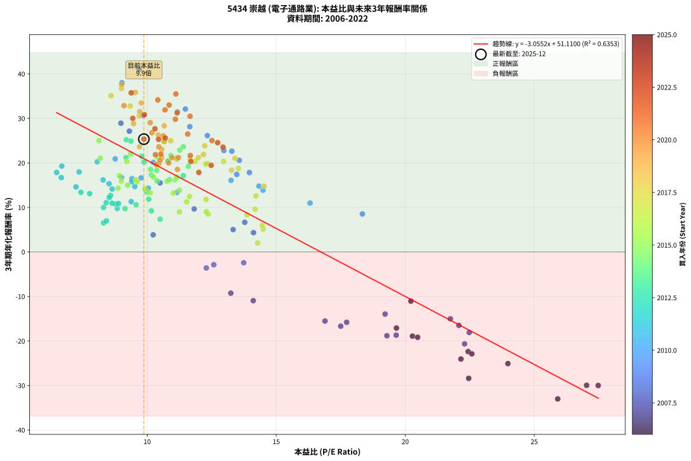
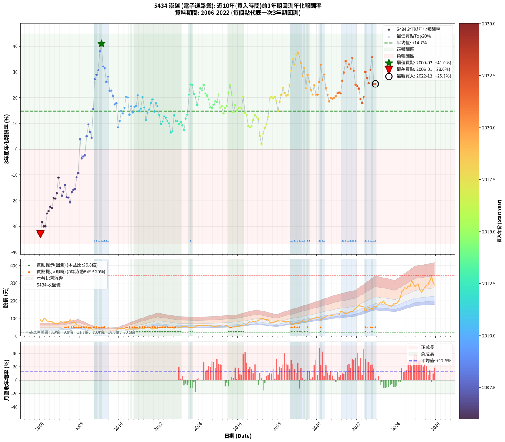

# 5434 崇越 - 本益比與未來報酬率分析

!!! info "報告資訊"
    - **股票代號**: 5434
    - **公司名稱**: 崇越
    - **產業別**: 電子通路業
    - **分析期間**: 2006-2022 (204 個數據點)
    - **資料來源**: Type 12 (ShowMonthlyK_ChartFlow) 月收盤價與本益比
    - **報酬率口徑**: 含現金股利 (簡化: 年度合計，假設每年7/1入帳)
    - **報告生成時間**: 2026-01-06 23:04:15 CST

## 📈 視覺化圖表

### 圖表1: 本益比 vs 未來報酬率關係

*圖表1：5434 崇越 本益比與3年期未來報酬率關係 (2006-2022)*

### 圖表2: 歷年買入時點的3年期實際報酬率

*圖表2：5434 崇越 歷年買入時點的3年期實際報酬率 (2006-2022)*

## 📍 買點訊號說明

本報告提供兩種買點提示訊號（顯示於圖表2的股價子圖中）：

### ▲ 小綠色三角形（回測驗證）
- **計算方式**: 使用全部歷史資料計算本益比第25百分位數
- **用途**: 事後驗證，顯示歷史上哪些時點確實為低估區
- **限制**: 當下無法判斷，僅供回測參考
- **特性**: 後見之明（Look-Ahead Bias）

### ▲ 小橘色三角形（即時訊號）
- **計算方式**: 使用截至當月的過去5年資料計算本益比第25百分位數
- **用途**: 實際投資決策，當時即可判斷
- **優勢**: 可操作性強，符合實務需求
- **特性**: 無後見之明，滾動窗口計算

!!! tip "如何使用兩種訊號"
    - **綠色▲** 幫助理解歷史估值機會，驗證策略有效性
    - **橘色▲** 可作為實際買進參考，但仍需搭配基本面分析
    - 兩種訊號重疊時，表示即時判斷與事後驗證一致，信心度較高
    - 僅有綠色▲時，表示當時無法判斷（需要未來資料才能確認）
    - 僅有橘色▲時，表示即時判斷為買點，但事後可能不是最佳時機

## 📊 估值分析摘要

| 指標 | 數值 |
|:---:|:---:|
| **目前本益比** (2022-12) | **9.87 倍** |
| **歷史平均本益比** | 11.91 倍 |
| **估值水準** | 🟡 合理範圍 |
| **預期3年年化報酬率** | **+20.95%** |
| **歷史平均報酬率** | +14.71% |
| **相關係數 (R²)** | 0.6353 |
| **趨勢線斜率** | -3.0552 |

!!! abstract "核心洞察"
    目前本益比接近歷史平均，預期報酬率符合長期趨勢

    根據歷史數據回測，5434 崇越 在目前本益比 **9.9倍** 的估值水準下，
    預期未來3年年化報酬率約為 **+21.0%**。

    **重要提醒**: 本分析基於歷史數據統計，實際報酬率會受到公司基本面變化、產業趨勢、
    總體經濟環境等多重因素影響。R² = 0.64 表示本益比可解釋約 63.5% 的報酬率變異。

## 📈 歷史估值統計

### 最佳買點 (最高報酬率)

| 項目 | 數值 |
|:---:|:---:|
| 起始時間 | 2009-02 |
| 當時本益比 | 9.69 倍 |
| 起始價格 | 21.6 元 |
| 3年後價格 | 55.1 元 |
| **3年年化報酬率** | **+41.04%** |

### 最差買點 (最低報酬率)

| 項目 | 數值 |
|:---:|:---:|
| 起始時間 | 2006-01 |
| 當時本益比 | 25.91 倍 |
| 起始價格 | 92.5 元 |
| 3年後價格 | 20.0 元 |
| **3年年化報酬率** | **-33.01%** |

## 🎯 投資啟示

### 本益比與報酬率關係

趨勢線方程式: **y = -3.0552x + 51.1100**

!!! warning "強負相關"
    本益比與未來報酬率呈現強負相關。在高本益比時期買入，未來報酬率顯著較低；
    在低本益比時期買入，未來報酬率顯著較高。**估值紀律至關重要**。

### 估值區間建議

基於歷史數據分析:

- **🟢 低估區** (P/E < 9.5): 預期報酬率較高，可考慮增加持股
- **🟡 合理區** (P/E 9.5-14.3): 預期報酬率符合長期趨勢，正常持有
- **🔴 高估區** (P/E > 14.3): 預期報酬率較低，可考慮減碼或觀望

!!! danger "風險提示"
    - 過去表現不代表未來結果
    - 本分析假設公司基本面無重大結構性變化
    - 產業環境劇變可能使歷史規律失效
    - 應結合公司財報、產業趨勢、總體經濟等多重因素綜合判斷

!!! success "長期投資觀點"
    歷史數據顯示，在合理或低估的估值水準買入並長期持有，
    往往能獲得較佳的投資報酬。**耐心等待好價格**是價值投資的核心原則。

## 📊 數據品質

- **資料來源**: GoodInfo.tw Type 12 (ShowMonthlyK_ChartFlow)
- **資料頻率**: 月度收盤價與本益比
- **回測期間**: 2006-2022
- **數據點數量**: 204 個 (每個點代表一次3年期回測)

### 計算方法說明

1. **3年期年化報酬率**:
   - 對每個歷史時點，計算其後3年的實際投資報酬率
   - 期末價值(不含股利): 期末價格
   - 期末價值(含現金股利): 期末價格 + 持有期間內的現金股利合計 (簡化: 年度合計，假設每年7/1入帳)
   - 公式: 年化報酬率 = [(期末價值/期初價格)^(1/年數) - 1] × 100%

2. **本益比 (P/E Ratio)**:
   - 使用當時的月收盤價與EPS計算
   - 資料來源: Type 12 月度河流圖本益比數據

3. **趨勢線 (Linear Regression)**:
   - 使用最小平方法擬合線性趨勢線
   - R²值衡量本益比對報酬率的解釋能力

---

*本報告由 Stock Analysis System v1.9.0 自動生成*
*數據更新時間: 2026-01-06 23:04:15 CST*

## 📋 月度回測明細表

（每一列對應時間線圖中的一個買入點；可用來對照 SVG 圖上的每個點。）

| 買入月份 | 賣出月份 | 回測期限_年 | 實際持有年數 | 買入本益比_倍 | 買入收盤價_元 | 賣出收盤價_元 | 現金股利合計_元 | 總報酬率_pct | 年化報酬率_pct |
| --- | --- | --- | --- | --- | --- | --- | --- | --- | --- |
| 2006-01 | 2009-01 | 3 | 3.001 | 25.91 | 92.50 | 20.00 | 7.80 | -69.95 | -33.01 |
| 2006-02 | 2009-02 | 3 | 3.001 | 22.46 | 80.20 | 21.65 | 7.80 | -63.28 | -28.39 |
| 2006-03 | 2009-03 | 3 | 3.001 | 27.48 | 98.10 | 25.85 | 7.80 | -65.70 | -29.99 |
| 2006-04 | 2009-04 | 3 | 3.001 | 27.03 | 96.50 | 25.35 | 7.80 | -65.65 | -29.96 |
| 2006-05 | 2009-05 | 3 | 3.001 | 23.98 | 85.60 | 28.20 | 7.80 | -57.94 | -25.07 |
| 2006-06 | 2009-06 | 3 | 3.001 | 22.16 | 79.10 | 26.85 | 7.80 | -56.19 | -24.05 |
| 2006-07 | 2009-07 | 3 | 3.001 | 22.44 | 80.10 | 30.85 | 6.60 | -53.25 | -22.38 |
| 2006-08 | 2009-08 | 3 | 3.001 | 22.58 | 80.60 | 30.35 | 6.60 | -54.16 | -22.89 |
| 2006-09 | 2009-09 | 3 | 3.001 | 20.28 | 72.40 | 32.00 | 6.60 | -46.69 | -18.91 |
| 2006-10 | 2009-10 | 3 | 3.001 | 20.48 | 73.10 | 32.00 | 6.60 | -47.20 | -19.17 |
| 2006-11 | 2009-11 | 3 | 3.001 | 19.66 | 70.20 | 33.40 | 6.60 | -43.02 | -17.09 |
| 2006-12 | 2009-12 | 3 | 3.001 | 20.22 | 72.20 | 44.20 | 6.60 | -29.64 | -11.06 |
| 2007-01 | 2010-01 | 3 | 3.001 | 21.75 | 79.50 | 42.20 | 6.60 | -38.62 | -15.01 |
| 2007-02 | 2010-02 | 3 | 3.001 | 22.48 | 84.10 | 39.60 | 6.60 | -45.07 | -18.10 |
| 2007-03 | 2010-03 | 3 | 3.001 | 22.08 | 84.50 | 42.60 | 6.60 | -41.78 | -16.49 |
| 2007-04 | 2010-04 | 3 | 3.001 | 19.22 | 75.20 | 41.30 | 6.60 | -36.30 | -13.96 |
| 2007-05 | 2010-05 | 3 | 3.001 | 19.65 | 78.60 | 35.65 | 6.60 | -46.25 | -18.69 |
| 2007-06 | 2010-06 | 3 | 3.001 | 19.29 | 78.80 | 35.55 | 6.60 | -46.51 | -18.82 |
| 2007-07 | 2010-07 | 3 | 3.001 | 22.30 | 93.00 | 40.65 | 5.80 | -50.05 | -20.65 |
| 2007-08 | 2010-08 | 3 | 3.001 | 17.50 | 74.50 | 37.30 | 5.80 | -42.15 | -16.67 |
| 2007-09 | 2010-09 | 3 | 3.001 | 17.73 | 77.00 | 40.15 | 5.80 | -40.32 | -15.81 |
| 2007-10 | 2010-10 | 3 | 3.001 | 16.89 | 74.80 | 39.30 | 5.80 | -39.71 | -15.52 |
| 2007-11 | 2010-11 | 3 | 3.001 | 14.11 | 63.70 | 39.20 | 5.80 | -29.36 | -10.94 |
| 2007-12 | 2010-12 | 3 | 3.001 | 13.24 | 60.90 | 39.70 | 5.80 | -25.29 | -9.26 |
| 2008-01 | 2011-01 | 3 | 3.001 | 10.23 | 45.00 | 44.60 | 5.80 | +12.00 | +3.85 |
| 2008-02 | 2011-03 | 3 | 3.080 | 12.29 | 51.60 | 40.30 | 5.80 | -10.66 | -3.59 |
| 2008-03 | 2011-03 | 3 | 2.998 | 12.58 | 50.30 | 40.30 | 5.80 | -8.35 | -2.87 |
| 2008-04 | 2011-04 | 3 | 2.998 | 13.74 | 52.20 | 42.70 | 5.80 | -7.09 | -2.42 |
| 2008-05 | 2011-05 | 3 | 2.998 | 13.33 | 48.00 | 49.80 | 5.80 | +15.83 | +5.02 |
| 2008-06 | 2011-06 | 3 | 2.998 | 11.82 | 40.20 | 47.20 | 5.80 | +31.84 | +9.66 |
| 2008-07 | 2011-07 | 3 | 2.998 | 13.78 | 44.10 | 47.90 | 5.60 | +21.32 | +6.66 |
| 2008-08 | 2011-08 | 3 | 2.998 | 14.12 | 42.35 | 42.50 | 5.60 | +13.58 | +4.34 |
| 2008-09 | 2011-09 | 3 | 2.998 | 10.50 | 29.40 | 39.70 | 5.60 | +54.08 | +15.51 |
| 2008-10 | 2011-10 | 3 | 2.998 | 9.31 | 24.20 | 44.10 | 5.60 | +105.37 | +27.13 |
| 2008-11 | 2011-11 | 3 | 2.998 | 8.98 | 21.55 | 40.55 | 5.60 | +114.15 | +28.92 |
| 2008-12 | 2011-12 | 3 | 2.998 | 9.84 | 21.65 | 42.70 | 5.60 | +123.09 | +30.69 |
| 2009-01 | 2012-01 | 3 | 2.998 | 9.02 | 20.00 | 46.90 | 5.60 | +162.50 | +37.98 |
| 2009-02 | 2012-02 | 3 | 2.998 | 9.69 | 21.65 | 55.10 | 5.60 | +180.37 | +41.04 |
| 2009-03 | 2012-03 | 3 | 3.001 | 11.48 | 25.85 | 54.00 | 5.60 | +130.56 | +32.10 |
| 2009-04 | 2012-04 | 3 | 3.001 | 11.17 | 25.35 | 52.00 | 5.60 | +127.22 | +31.46 |
| 2009-05 | 2012-05 | 3 | 3.001 | 12.33 | 28.20 | 51.00 | 5.60 | +100.71 | +26.13 |
| 2009-06 | 2012-06 | 3 | 3.001 | 11.65 | 26.85 | 50.90 | 5.60 | +110.43 | +28.14 |
| 2009-07 | 2012-07 | 3 | 3.001 | 13.28 | 30.85 | 48.30 | 8.60 | +84.44 | +22.63 |
| 2009-08 | 2012-08 | 3 | 3.001 | 12.97 | 30.35 | 47.60 | 8.60 | +85.17 | +22.79 |
| 2009-09 | 2012-09 | 3 | 3.001 | 13.57 | 32.00 | 47.50 | 8.60 | +75.31 | +20.57 |
| 2009-10 | 2012-10 | 3 | 3.001 | 13.47 | 32.00 | 43.20 | 8.60 | +61.88 | +17.41 |
| 2009-11 | 2012-11 | 3 | 3.001 | 13.96 | 33.40 | 46.05 | 8.60 | +63.62 | +17.83 |
| 2009-12 | 2012-12 | 3 | 3.001 | 18.34 | 44.20 | 47.90 | 8.60 | +27.83 | +8.53 |
| 2010-01 | 2013-01 | 3 | 3.001 | 16.31 | 42.20 | 49.10 | 8.60 | +36.73 | +10.99 |
| 2010-02 | 2013-02 | 3 | 3.001 | 14.33 | 39.60 | 51.30 | 8.60 | +51.26 | +14.79 |
| 2010-03 | 2013-03 | 3 | 3.001 | 14.49 | 42.60 | 54.30 | 8.60 | +47.65 | +13.87 |
| 2010-04 | 2013-04 | 3 | 3.001 | 13.25 | 41.30 | 56.00 | 8.60 | +56.42 | +16.08 |
| 2010-05 | 2013-05 | 3 | 3.001 | 10.82 | 35.65 | 53.50 | 8.60 | +74.19 | +20.32 |
| 2010-06 | 2013-06 | 3 | 3.001 | 10.24 | 35.55 | 53.00 | 8.60 | +73.28 | +20.11 |
| 2010-07 | 2013-07 | 3 | 3.001 | 11.15 | 40.65 | 48.55 | 10.68 | +45.71 | +13.37 |
| 2010-08 | 2013-08 | 3 | 3.001 | 9.76 | 37.30 | 48.50 | 10.68 | +58.66 | +16.63 |
| 2010-09 | 2013-09 | 3 | 3.001 | 10.04 | 40.15 | 49.30 | 10.68 | +49.39 | +14.31 |
| 2010-10 | 2013-10 | 3 | 3.001 | 9.41 | 39.30 | 51.40 | 10.68 | +57.97 | +16.46 |
| 2010-11 | 2013-11 | 3 | 3.001 | 9.00 | 39.20 | 51.70 | 10.68 | +59.14 | +16.75 |
| 2010-12 | 2013-12 | 3 | 3.001 | 8.76 | 39.70 | 59.50 | 10.68 | +76.78 | +20.91 |
| 2011-01 | 2014-01 | 3 | 3.001 | 9.52 | 44.60 | 56.60 | 10.68 | +50.85 | +14.68 |
| 2011-02 | 2014-02 | 3 | 3.001 | 9.40 | 45.50 | 59.90 | 10.68 | +55.12 | +15.76 |
| 2011-03 | 2014-03 | 3 | 3.001 | 8.06 | 40.30 | 59.40 | 10.68 | +73.90 | +20.25 |
| 2011-04 | 2014-04 | 3 | 3.001 | 8.29 | 42.70 | 56.30 | 10.68 | +56.86 | +16.19 |
| 2011-05 | 2014-05 | 3 | 3.001 | 9.38 | 49.80 | 58.00 | 10.68 | +37.91 | +11.31 |
| 2011-06 | 2014-06 | 3 | 3.001 | 8.64 | 47.20 | 59.50 | 10.68 | +48.69 | +14.13 |
| 2011-07 | 2014-07 | 3 | 3.001 | 8.52 | 47.90 | 62.00 | 11.48 | +53.41 | +15.33 |
| 2011-08 | 2014-08 | 3 | 3.001 | 7.36 | 42.50 | 58.30 | 11.48 | +64.19 | +17.97 |
| 2011-09 | 2014-09 | 3 | 3.001 | 6.69 | 39.70 | 55.90 | 11.48 | +69.73 | +19.28 |
| 2011-10 | 2014-10 | 3 | 3.001 | 7.24 | 44.10 | 54.90 | 11.48 | +50.52 | +14.60 |
| 2011-11 | 2014-11 | 3 | 3.001 | 6.49 | 40.55 | 54.90 | 11.48 | +63.70 | +17.85 |
| 2011-12 | 2014-12 | 3 | 3.001 | 6.67 | 42.70 | 56.40 | 11.48 | +58.97 | +16.71 |
| 2012-01 | 2015-01 | 3 | 3.001 | 7.43 | 46.90 | 56.90 | 11.48 | +45.80 | +13.39 |
| 2012-02 | 2015-03 | 3 | 3.080 | 8.84 | 55.10 | 61.90 | 11.48 | +33.18 | +9.75 |
| 2012-03 | 2015-03 | 3 | 2.998 | 8.78 | 54.00 | 61.90 | 11.48 | +35.89 | +10.77 |
| 2012-04 | 2015-04 | 3 | 2.998 | 8.58 | 52.00 | 62.90 | 11.48 | +43.04 | +12.68 |
| 2012-05 | 2015-05 | 3 | 2.998 | 8.53 | 51.00 | 60.60 | 11.48 | +41.34 | +12.23 |
| 2012-06 | 2015-06 | 3 | 2.998 | 8.64 | 50.90 | 58.00 | 11.48 | +36.50 | +10.94 |
| 2012-07 | 2015-07 | 3 | 2.998 | 8.31 | 48.30 | 53.40 | 10.88 | +33.09 | +10.00 |
| 2012-08 | 2015-08 | 3 | 2.998 | 8.31 | 47.60 | 46.65 | 10.88 | +20.86 | +6.52 |
| 2012-09 | 2015-09 | 3 | 2.998 | 8.42 | 47.50 | 47.25 | 10.88 | +22.38 | +6.97 |
| 2012-10 | 2015-10 | 3 | 2.998 | 7.77 | 43.20 | 51.60 | 10.88 | +44.63 | +13.10 |
| 2012-11 | 2015-11 | 3 | 2.998 | 8.41 | 46.05 | 52.20 | 10.88 | +36.98 | +11.07 |
| 2012-12 | 2015-12 | 3 | 2.998 | 8.89 | 47.90 | 54.40 | 10.88 | +36.29 | +10.88 |
| 2013-01 | 2016-01 | 3 | 2.998 | 9.14 | 49.10 | 54.00 | 10.88 | +32.14 | +9.74 |
| 2013-02 | 2016-02 | 3 | 2.998 | 9.57 | 51.30 | 58.50 | 10.88 | +35.25 | +10.60 |
| 2013-03 | 2016-03 | 3 | 3.001 | 10.16 | 54.30 | 59.90 | 10.88 | +30.35 | +9.24 |
| 2013-04 | 2016-04 | 3 | 3.001 | 10.50 | 56.00 | 58.40 | 10.88 | +23.72 | +7.35 |
| 2013-05 | 2016-05 | 3 | 3.001 | 10.06 | 53.50 | 64.00 | 10.88 | +39.96 | +11.86 |
| 2013-06 | 2016-06 | 3 | 3.001 | 9.99 | 53.00 | 66.50 | 10.88 | +46.00 | +13.44 |
| 2013-07 | 2016-07 | 3 | 3.001 | 9.18 | 48.55 | 75.20 | 11.20 | +77.96 | +21.18 |
| 2013-08 | 2016-08 | 3 | 3.001 | 9.19 | 48.50 | 84.00 | 11.20 | +96.29 | +25.20 |
| 2013-09 | 2016-09 | 3 | 3.001 | 9.37 | 49.30 | 84.90 | 11.20 | +94.93 | +24.91 |
| 2013-10 | 2016-10 | 3 | 3.001 | 9.79 | 51.40 | 81.00 | 11.20 | +79.38 | +21.50 |
| 2013-11 | 2016-11 | 3 | 3.001 | 9.88 | 51.70 | 78.60 | 11.20 | +73.69 | +20.20 |
| 2013-12 | 2016-12 | 3 | 3.001 | 11.40 | 59.50 | 84.40 | 11.20 | +60.67 | +17.12 |
| 2014-01 | 2017-01 | 3 | 3.001 | 10.80 | 56.60 | 87.70 | 11.20 | +74.73 | +20.44 |
| 2014-02 | 2017-02 | 3 | 3.001 | 11.40 | 59.90 | 102.00 | 11.20 | +88.98 | +23.63 |
| 2014-03 | 2017-03 | 3 | 3.001 | 11.26 | 59.40 | 99.00 | 11.20 | +85.52 | +22.87 |
| 2014-04 | 2017-04 | 3 | 3.001 | 10.64 | 56.30 | 98.70 | 11.20 | +95.20 | +24.97 |
| 2014-05 | 2017-05 | 3 | 3.001 | 10.92 | 58.00 | 93.20 | 11.20 | +80.00 | +21.64 |
| 2014-06 | 2017-06 | 3 | 3.001 | 11.16 | 59.50 | 93.80 | 11.20 | +76.47 | +20.84 |
| 2014-07 | 2017-07 | 3 | 3.001 | 11.59 | 62.00 | 92.50 | 12.60 | +69.52 | +19.23 |
| 2014-08 | 2017-08 | 3 | 3.001 | 10.86 | 58.30 | 79.00 | 12.60 | +57.12 | +16.25 |
| 2014-09 | 2017-09 | 3 | 3.001 | 10.38 | 55.90 | 74.60 | 12.60 | +55.99 | +15.97 |
| 2014-10 | 2017-10 | 3 | 3.001 | 10.16 | 54.90 | 76.00 | 12.60 | +61.38 | +17.29 |
| 2014-11 | 2017-11 | 3 | 3.001 | 10.13 | 54.90 | 78.90 | 12.60 | +66.67 | +18.56 |
| 2014-12 | 2017-12 | 3 | 3.001 | 10.37 | 56.40 | 80.90 | 12.60 | +65.78 | +18.35 |
| 2015-01 | 2018-01 | 3 | 3.001 | 10.39 | 56.90 | 89.00 | 12.60 | +78.56 | +21.31 |
| 2015-02 | 2018-02 | 3 | 3.001 | 11.08 | 61.10 | 83.20 | 12.60 | +56.79 | +16.17 |
| 2015-03 | 2018-03 | 3 | 3.001 | 11.15 | 61.90 | 86.00 | 12.60 | +59.29 | +16.78 |
| 2015-04 | 2018-04 | 3 | 3.001 | 11.25 | 62.90 | 80.30 | 12.60 | +47.69 | +13.88 |
| 2015-05 | 2018-05 | 3 | 3.001 | 10.77 | 60.60 | 81.70 | 12.60 | +55.61 | +15.88 |
| 2015-06 | 2018-06 | 3 | 3.001 | 10.24 | 58.00 | 79.90 | 12.60 | +59.48 | +16.83 |
| 2015-07 | 2018-07 | 3 | 3.001 | 9.36 | 53.40 | 83.90 | 13.10 | +81.65 | +22.01 |
| 2015-08 | 2018-08 | 3 | 3.001 | 8.13 | 46.65 | 78.00 | 13.10 | +95.28 | +24.99 |
| 2015-09 | 2018-09 | 3 | 3.001 | 8.18 | 47.25 | 70.70 | 13.10 | +77.35 | +21.04 |
| 2015-10 | 2018-10 | 3 | 3.001 | 8.87 | 51.60 | 64.00 | 13.10 | +49.42 | +14.32 |
| 2015-11 | 2018-11 | 3 | 3.001 | 8.92 | 52.20 | 70.80 | 13.10 | +60.73 | +17.13 |
| 2015-12 | 2018-12 | 3 | 3.001 | 9.24 | 54.40 | 69.60 | 13.10 | +52.02 | +14.98 |
| 2016-01 | 2019-01 | 3 | 3.001 | 9.00 | 54.00 | 71.00 | 13.10 | +55.74 | +15.91 |
| 2016-02 | 2019-03 | 3 | 3.080 | 9.56 | 58.50 | 79.80 | 13.10 | +58.80 | +16.20 |
| 2016-03 | 2019-03 | 3 | 2.998 | 9.61 | 59.90 | 79.80 | 13.10 | +55.09 | +15.76 |
| 2016-04 | 2019-04 | 3 | 2.998 | 9.21 | 58.40 | 88.60 | 13.10 | +74.14 | +20.33 |
| 2016-05 | 2019-05 | 3 | 2.998 | 9.91 | 64.00 | 82.10 | 13.10 | +48.75 | +14.16 |
| 2016-06 | 2019-06 | 3 | 2.998 | 10.12 | 66.50 | 83.50 | 13.10 | +45.26 | +13.26 |
| 2016-07 | 2019-07 | 3 | 2.998 | 11.25 | 75.20 | 82.90 | 14.50 | +29.52 | +9.01 |
| 2016-08 | 2019-08 | 3 | 2.998 | 12.36 | 84.00 | 92.80 | 14.50 | +27.74 | +8.51 |
| 2016-09 | 2019-09 | 3 | 2.998 | 12.29 | 84.90 | 95.50 | 14.50 | +29.56 | +9.02 |
| 2016-10 | 2019-10 | 3 | 2.998 | 11.53 | 81.00 | 97.00 | 14.50 | +37.65 | +11.25 |
| 2016-11 | 2019-11 | 3 | 2.998 | 11.01 | 78.60 | 99.50 | 14.50 | +45.04 | +13.20 |
| 2016-12 | 2019-12 | 3 | 2.998 | 11.64 | 84.40 | 105.50 | 14.50 | +42.18 | +12.46 |
| 2017-01 | 2020-01 | 3 | 2.998 | 12.28 | 87.70 | 108.00 | 14.50 | +39.68 | +11.79 |
| 2017-02 | 2020-02 | 3 | 2.998 | 14.49 | 102.00 | 104.00 | 14.50 | +16.18 | +5.13 |
| 2017-03 | 2020-03 | 3 | 3.001 | 14.28 | 99.00 | 90.60 | 14.50 | +6.16 | +2.01 |
| 2017-04 | 2020-04 | 3 | 3.001 | 14.46 | 98.70 | 103.00 | 14.50 | +19.05 | +5.98 |
| 2017-05 | 2020-05 | 3 | 3.001 | 13.87 | 93.20 | 104.00 | 14.50 | +27.15 | +8.33 |
| 2017-06 | 2020-06 | 3 | 3.001 | 14.18 | 93.80 | 109.00 | 14.50 | +31.66 | +9.60 |
| 2017-07 | 2020-07 | 3 | 3.001 | 14.21 | 92.50 | 116.00 | 16.00 | +42.70 | +12.58 |
| 2017-08 | 2020-08 | 3 | 3.001 | 12.34 | 79.00 | 120.00 | 16.00 | +72.15 | +19.84 |
| 2017-09 | 2020-09 | 3 | 3.001 | 11.85 | 74.60 | 114.00 | 16.00 | +74.26 | +20.33 |
| 2017-10 | 2020-10 | 3 | 3.001 | 12.27 | 76.00 | 114.50 | 16.00 | +71.71 | +19.74 |
| 2017-11 | 2020-11 | 3 | 3.001 | 12.96 | 78.90 | 121.50 | 16.00 | +74.27 | +20.33 |
| 2017-12 | 2020-12 | 3 | 3.001 | 13.53 | 80.90 | 119.50 | 16.00 | +67.49 | +18.75 |
| 2018-01 | 2021-01 | 3 | 3.001 | 14.53 | 89.00 | 118.50 | 16.00 | +51.12 | +14.75 |
| 2018-02 | 2021-02 | 3 | 3.001 | 13.27 | 83.20 | 122.00 | 16.00 | +65.87 | +18.37 |
| 2018-03 | 2021-03 | 3 | 3.001 | 13.40 | 86.00 | 136.50 | 16.00 | +77.33 | +21.03 |
| 2018-04 | 2021-04 | 3 | 3.001 | 12.23 | 80.30 | 136.50 | 16.00 | +89.91 | +23.83 |
| 2018-05 | 2021-05 | 3 | 3.001 | 12.18 | 81.70 | 132.00 | 16.00 | +81.15 | +21.90 |
| 2018-06 | 2021-06 | 3 | 3.001 | 11.66 | 79.90 | 125.00 | 16.00 | +76.47 | +20.84 |
| 2018-07 | 2021-07 | 3 | 3.001 | 11.98 | 83.90 | 129.50 | 19.80 | +77.95 | +21.18 |
| 2018-08 | 2021-08 | 3 | 3.001 | 10.91 | 78.00 | 132.50 | 19.80 | +95.26 | +24.98 |
| 2018-09 | 2021-09 | 3 | 3.001 | 9.69 | 70.70 | 137.50 | 19.80 | +122.49 | +30.54 |
| 2018-10 | 2021-10 | 3 | 3.001 | 8.60 | 64.00 | 138.00 | 19.80 | +146.56 | +35.09 |
| 2018-11 | 2021-11 | 3 | 3.001 | 9.34 | 70.80 | 146.00 | 19.80 | +134.18 | +32.79 |
| 2018-12 | 2021-12 | 3 | 3.001 | 9.00 | 69.60 | 158.00 | 19.80 | +155.46 | +36.69 |
| 2019-01 | 2022-01 | 3 | 3.001 | 9.01 | 71.00 | 165.00 | 19.80 | +160.28 | +37.55 |
| 2019-02 | 2022-02 | 3 | 3.001 | 9.54 | 76.50 | 172.00 | 19.80 | +150.72 | +35.84 |
| 2019-03 | 2022-03 | 3 | 3.001 | 9.77 | 79.80 | 170.00 | 19.80 | +137.84 | +33.48 |
| 2019-04 | 2022-04 | 3 | 3.001 | 10.66 | 88.60 | 167.50 | 19.80 | +111.40 | +28.33 |
| 2019-05 | 2022-05 | 3 | 3.001 | 9.71 | 82.10 | 167.00 | 19.80 | +127.53 | +31.52 |
| 2019-06 | 2022-06 | 3 | 3.001 | 9.70 | 83.50 | 138.00 | 19.80 | +88.98 | +23.63 |
| 2019-07 | 2022-07 | 3 | 3.001 | 9.47 | 82.90 | 154.00 | 23.30 | +113.87 | +28.83 |
| 2019-08 | 2022-08 | 3 | 3.001 | 10.43 | 92.80 | 163.50 | 23.30 | +101.29 | +26.26 |
| 2019-09 | 2022-09 | 3 | 3.001 | 10.56 | 95.50 | 154.50 | 23.30 | +86.18 | +23.01 |
| 2019-10 | 2022-10 | 3 | 3.001 | 10.56 | 97.00 | 149.50 | 23.30 | +78.14 | +21.22 |
| 2019-11 | 2022-11 | 3 | 3.001 | 10.66 | 99.50 | 170.00 | 23.30 | +94.27 | +24.77 |
| 2019-12 | 2022-12 | 3 | 3.001 | 11.13 | 105.50 | 164.00 | 23.30 | +77.54 | +21.08 |
| 2020-01 | 2023-01 | 3 | 3.001 | 11.21 | 108.00 | 169.00 | 23.30 | +78.06 | +21.20 |
| 2020-02 | 2023-03 | 3 | 3.080 | 10.62 | 104.00 | 189.00 | 23.30 | +104.13 | +26.07 |
| 2020-03 | 2023-03 | 3 | 2.998 | 9.10 | 90.60 | 189.00 | 23.30 | +134.33 | +32.85 |
| 2020-04 | 2023-04 | 3 | 2.998 | 10.18 | 103.00 | 186.50 | 23.30 | +103.69 | +26.78 |
| 2020-05 | 2023-05 | 3 | 2.998 | 10.12 | 104.00 | 200.00 | 23.30 | +114.71 | +29.03 |
| 2020-06 | 2023-06 | 3 | 2.998 | 10.45 | 109.00 | 182.50 | 23.30 | +88.81 | +23.61 |
| 2020-07 | 2023-07 | 3 | 2.998 | 10.96 | 116.00 | 179.50 | 26.80 | +77.84 | +21.17 |
| 2020-08 | 2023-08 | 3 | 2.998 | 11.17 | 120.00 | 173.00 | 26.80 | +66.50 | +18.54 |
| 2020-09 | 2023-09 | 3 | 2.998 | 10.45 | 114.00 | 169.50 | 26.80 | +72.19 | +19.87 |
| 2020-10 | 2023-10 | 3 | 2.998 | 10.35 | 114.50 | 169.00 | 26.80 | +71.00 | +19.60 |
| 2020-11 | 2023-11 | 3 | 2.998 | 10.83 | 121.50 | 183.00 | 26.80 | +72.67 | +19.99 |
| 2020-12 | 2023-12 | 3 | 2.998 | 10.50 | 119.50 | 182.50 | 26.80 | +75.15 | +20.56 |
| 2021-01 | 2024-01 | 3 | 2.998 | 10.32 | 118.50 | 187.50 | 26.80 | +80.84 | +21.85 |
| 2021-02 | 2024-02 | 3 | 2.998 | 10.53 | 122.00 | 194.50 | 26.80 | +81.39 | +21.97 |
| 2021-03 | 2024-03 | 3 | 3.001 | 11.67 | 136.50 | 219.00 | 26.80 | +80.07 | +21.66 |
| 2021-04 | 2024-04 | 3 | 3.001 | 11.57 | 136.50 | 249.50 | 26.80 | +102.42 | +26.49 |
| 2021-05 | 2024-05 | 3 | 3.001 | 11.09 | 132.00 | 262.00 | 26.80 | +118.79 | +29.81 |
| 2021-06 | 2024-06 | 3 | 3.001 | 10.41 | 125.00 | 275.00 | 26.80 | +141.44 | +34.14 |
| 2021-07 | 2024-07 | 3 | 3.001 | 10.69 | 129.50 | 268.50 | 28.80 | +129.57 | +31.91 |
| 2021-08 | 2024-08 | 3 | 3.001 | 10.85 | 132.50 | 283.00 | 28.80 | +135.32 | +33.00 |
| 2021-09 | 2024-09 | 3 | 3.001 | 11.16 | 137.50 | 282.00 | 28.80 | +126.03 | +31.23 |
| 2021-10 | 2024-10 | 3 | 3.001 | 11.11 | 138.00 | 314.50 | 28.80 | +148.77 | +35.49 |
| 2021-11 | 2024-11 | 3 | 3.001 | 11.66 | 146.00 | 295.50 | 28.80 | +122.12 | +30.47 |
| 2021-12 | 2024-12 | 3 | 3.001 | 12.51 | 158.00 | 280.00 | 28.80 | +95.44 | +25.02 |
| 2022-01 | 2025-01 | 3 | 3.001 | 12.73 | 165.00 | 290.00 | 28.80 | +93.21 | +24.54 |
| 2022-02 | 2025-02 | 3 | 3.001 | 12.94 | 172.00 | 295.50 | 28.80 | +88.54 | +23.53 |
| 2022-03 | 2025-03 | 3 | 3.001 | 12.48 | 170.00 | 261.00 | 28.80 | +70.47 | +19.45 |
| 2022-04 | 2025-04 | 3 | 3.001 | 12.00 | 167.50 | 245.50 | 28.80 | +63.76 | +17.87 |
| 2022-05 | 2025-05 | 3 | 3.001 | 11.69 | 167.00 | 262.00 | 28.80 | +74.13 | +20.30 |
| 2022-06 | 2025-06 | 3 | 3.001 | 9.44 | 138.00 | 274.50 | 28.80 | +119.78 | +30.01 |
| 2022-07 | 2025-07 | 3 | 3.001 | 10.30 | 154.00 | 288.50 | 31.99 | +108.11 | +27.67 |
| 2022-08 | 2025-08 | 3 | 3.001 | 10.70 | 163.50 | 292.00 | 31.99 | +98.16 | +25.60 |
| 2022-09 | 2025-09 | 3 | 3.001 | 9.89 | 154.50 | 314.00 | 31.99 | +123.94 | +30.82 |
| 2022-10 | 2025-10 | 3 | 3.001 | 9.38 | 149.50 | 342.00 | 31.99 | +150.16 | +35.74 |
| 2022-11 | 2025-11 | 3 | 3.001 | 10.44 | 170.00 | 302.50 | 31.99 | +96.76 | +25.30 |
| 2022-12 | 2025-12 | 3 | 3.001 | 9.87 | 164.00 | 291.00 | 31.99 | +96.94 | +25.34 |
