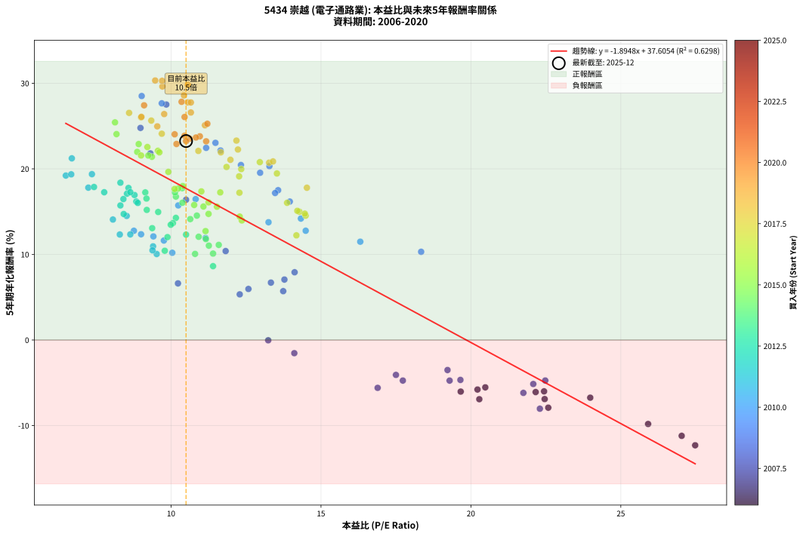

# 5434 崇越 - 本益比與未來報酬率分析

!!! info "報告資訊"
    - **股票代號**: 5434
    - **公司名稱**: 崇越
    - **產業別**: 電子通路業
    - **分析期間**: 2006-2020 (180 個數據點)
    - **資料來源**: Type 12 (ShowMonthlyK_ChartFlow) 月收盤價與本益比
    - **報酬率口徑**: 含現金股利 (簡化: 年度合計，假設每年7/1入帳)
    - **報告生成時間**: 2026-01-06 23:04:22 CST

## 📈 視覺化圖表

### 圖表1: 本益比 vs 未來報酬率關係

*圖表1：5434 崇越 本益比與5年期未來報酬率關係 (2006-2020)*

### 圖表2: 歷年買入時點的5年期實際報酬率

*圖表2：5434 崇越 歷年買入時點的5年期實際報酬率 (2006-2020)*

## 📍 買點訊號說明

本報告提供兩種買點提示訊號（顯示於圖表2的股價子圖中）：

### ▲ 小綠色三角形（回測驗證）
- **計算方式**: 使用全部歷史資料計算本益比第25百分位數
- **用途**: 事後驗證，顯示歷史上哪些時點確實為低估區
- **限制**: 當下無法判斷，僅供回測參考
- **特性**: 後見之明（Look-Ahead Bias）

### ▲ 小橘色三角形（即時訊號）
- **計算方式**: 使用截至當月的過去5年資料計算本益比第25百分位數
- **用途**: 實際投資決策，當時即可判斷
- **優勢**: 可操作性強，符合實務需求
- **特性**: 無後見之明，滾動窗口計算

!!! tip "如何使用兩種訊號"
    - **綠色▲** 幫助理解歷史估值機會，驗證策略有效性
    - **橘色▲** 可作為實際買進參考，但仍需搭配基本面分析
    - 兩種訊號重疊時，表示即時判斷與事後驗證一致，信心度較高
    - 僅有綠色▲時，表示當時無法判斷（需要未來資料才能確認）
    - 僅有橘色▲時，表示即時判斷為買點，但事後可能不是最佳時機

## 📊 估值分析摘要

| 指標 | 數值 |
|:---:|:---:|
| **目前本益比** (2020-12) | **10.50 倍** |
| **歷史平均本益比** | 12.03 倍 |
| **估值水準** | 🟡 合理範圍 |
| **預期5年年化報酬率** | **+17.71%** |
| **歷史平均報酬率** | +14.82% |
| **相關係數 (R²)** | 0.6298 |
| **趨勢線斜率** | -1.8948 |

!!! abstract "核心洞察"
    目前本益比接近歷史平均，預期報酬率符合長期趨勢

    根據歷史數據回測，5434 崇越 在目前本益比 **10.5倍** 的估值水準下，
    預期未來5年年化報酬率約為 **+17.7%**。

    **重要提醒**: 本分析基於歷史數據統計，實際報酬率會受到公司基本面變化、產業趨勢、
    總體經濟環境等多重因素影響。R² = 0.63 表示本益比可解釋約 63.0% 的報酬率變異。

## 📈 歷史估值統計

### 最佳買點 (最高報酬率)

| 項目 | 數值 |
|:---:|:---:|
| 起始時間 | 2019-07 |
| 當時本益比 | 9.47 倍 |
| 起始價格 | 82.9 元 |
| 5年後價格 | 268.5 元 |
| **5年年化報酬率** | **+30.32%** |

### 最差買點 (最低報酬率)

| 項目 | 數值 |
|:---:|:---:|
| 起始時間 | 2006-03 |
| 當時本益比 | 27.48 倍 |
| 起始價格 | 98.1 元 |
| 5年後價格 | 40.3 元 |
| **5年年化報酬率** | **-12.30%** |

## 🎯 投資啟示

### 本益比與報酬率關係

趨勢線方程式: **y = -1.8948x + 37.6054**

!!! warning "強負相關"
    本益比與未來報酬率呈現強負相關。在高本益比時期買入，未來報酬率顯著較低；
    在低本益比時期買入，未來報酬率顯著較高。**估值紀律至關重要**。

### 估值區間建議

基於歷史數據分析:

- **🟢 低估區** (P/E < 9.6): 預期報酬率較高，可考慮增加持股
- **🟡 合理區** (P/E 9.6-14.4): 預期報酬率符合長期趨勢，正常持有
- **🔴 高估區** (P/E > 14.4): 預期報酬率較低，可考慮減碼或觀望

!!! danger "風險提示"
    - 過去表現不代表未來結果
    - 本分析假設公司基本面無重大結構性變化
    - 產業環境劇變可能使歷史規律失效
    - 應結合公司財報、產業趨勢、總體經濟等多重因素綜合判斷

!!! success "長期投資觀點"
    歷史數據顯示，在合理或低估的估值水準買入並長期持有，
    往往能獲得較佳的投資報酬。**耐心等待好價格**是價值投資的核心原則。

## 📊 數據品質

- **資料來源**: GoodInfo.tw Type 12 (ShowMonthlyK_ChartFlow)
- **資料頻率**: 月度收盤價與本益比
- **回測期間**: 2006-2020
- **數據點數量**: 180 個 (每個點代表一次5年期回測)

### 計算方法說明

1. **5年期年化報酬率**:
   - 對每個歷史時點，計算其後5年的實際投資報酬率
   - 期末價值(不含股利): 期末價格
   - 期末價值(含現金股利): 期末價格 + 持有期間內的現金股利合計 (簡化: 年度合計，假設每年7/1入帳)
   - 公式: 年化報酬率 = [(期末價值/期初價格)^(1/年數) - 1] × 100%

2. **本益比 (P/E Ratio)**:
   - 使用當時的月收盤價與EPS計算
   - 資料來源: Type 12 月度河流圖本益比數據

3. **趨勢線 (Linear Regression)**:
   - 使用最小平方法擬合線性趨勢線
   - R²值衡量本益比對報酬率的解釋能力

---

*本報告由 Stock Analysis System v1.9.0 自動生成*
*數據更新時間: 2026-01-06 23:04:22 CST*

## 📋 月度回測明細表

（每一列對應時間線圖中的一個買入點；可用來對照 SVG 圖上的每個點。）

| 買入月份 | 賣出月份 | 回測期限_年 | 實際持有年數 | 買入本益比_倍 | 買入收盤價_元 | 賣出收盤價_元 | 現金股利合計_元 | 總報酬率_pct | 年化報酬率_pct |
| --- | --- | --- | --- | --- | --- | --- | --- | --- | --- |
| 2006-01 | 2011-01 | 5 | 4.999 | 25.91 | 92.50 | 44.60 | 10.60 | -40.32 | -9.81 |
| 2006-02 | 2011-02 | 5 | 4.999 | 22.46 | 80.20 | 45.50 | 10.60 | -30.05 | -6.90 |
| 2006-03 | 2011-03 | 5 | 4.999 | 27.48 | 98.10 | 40.30 | 10.60 | -48.11 | -12.30 |
| 2006-04 | 2011-04 | 5 | 4.999 | 27.03 | 96.50 | 42.70 | 10.60 | -44.77 | -11.20 |
| 2006-05 | 2011-05 | 5 | 4.999 | 23.98 | 85.60 | 49.80 | 10.60 | -29.44 | -6.74 |
| 2006-06 | 2011-06 | 5 | 4.999 | 22.16 | 79.10 | 47.20 | 10.60 | -26.93 | -6.08 |
| 2006-07 | 2011-07 | 5 | 4.999 | 22.44 | 80.10 | 47.90 | 10.90 | -26.59 | -6.00 |
| 2006-08 | 2011-08 | 5 | 4.999 | 22.58 | 80.60 | 42.50 | 10.90 | -33.75 | -7.90 |
| 2006-09 | 2011-09 | 5 | 4.999 | 20.28 | 72.40 | 39.70 | 10.90 | -30.11 | -6.92 |
| 2006-10 | 2011-10 | 5 | 4.999 | 20.48 | 73.10 | 44.10 | 10.90 | -24.76 | -5.53 |
| 2006-11 | 2011-11 | 5 | 4.999 | 19.66 | 70.20 | 40.55 | 10.90 | -26.71 | -6.03 |
| 2006-12 | 2011-12 | 5 | 4.999 | 20.22 | 72.20 | 42.70 | 10.90 | -25.76 | -5.78 |
| 2007-01 | 2012-01 | 5 | 4.999 | 21.75 | 79.50 | 46.90 | 10.90 | -27.30 | -6.18 |
| 2007-02 | 2012-02 | 5 | 4.999 | 22.48 | 84.10 | 55.10 | 10.90 | -21.52 | -4.73 |
| 2007-03 | 2012-03 | 5 | 5.002 | 22.08 | 84.50 | 54.00 | 10.90 | -23.20 | -5.14 |
| 2007-04 | 2012-04 | 5 | 5.002 | 19.22 | 75.20 | 52.00 | 10.90 | -16.36 | -3.51 |
| 2007-05 | 2012-05 | 5 | 5.002 | 19.65 | 78.60 | 51.00 | 10.90 | -21.25 | -4.66 |
| 2007-06 | 2012-06 | 5 | 5.002 | 19.29 | 78.80 | 50.90 | 10.90 | -21.57 | -4.74 |
| 2007-07 | 2012-07 | 5 | 5.002 | 22.30 | 93.00 | 48.30 | 12.90 | -34.19 | -8.03 |
| 2007-08 | 2012-08 | 5 | 5.002 | 17.50 | 74.50 | 47.60 | 12.90 | -18.79 | -4.08 |
| 2007-09 | 2012-09 | 5 | 5.002 | 17.73 | 77.00 | 47.50 | 12.90 | -21.56 | -4.74 |
| 2007-10 | 2012-10 | 5 | 5.002 | 16.89 | 74.80 | 43.20 | 12.90 | -25.00 | -5.59 |
| 2007-11 | 2012-11 | 5 | 5.002 | 14.11 | 63.70 | 46.05 | 12.90 | -7.46 | -1.54 |
| 2007-12 | 2012-12 | 5 | 5.002 | 13.24 | 60.90 | 47.90 | 12.90 | -0.16 | -0.03 |
| 2008-01 | 2013-01 | 5 | 5.002 | 10.23 | 45.00 | 49.10 | 12.90 | +37.78 | +6.62 |
| 2008-02 | 2013-03 | 5 | 5.081 | 12.29 | 51.60 | 54.30 | 12.90 | +30.23 | +5.34 |
| 2008-03 | 2013-03 | 5 | 4.999 | 12.58 | 50.30 | 54.30 | 12.90 | +33.60 | +5.97 |
| 2008-04 | 2013-04 | 5 | 4.999 | 13.74 | 52.20 | 56.00 | 12.90 | +31.99 | +5.71 |
| 2008-05 | 2013-05 | 5 | 4.999 | 13.33 | 48.00 | 53.50 | 12.90 | +38.33 | +6.71 |
| 2008-06 | 2013-06 | 5 | 4.999 | 11.82 | 40.20 | 53.00 | 12.90 | +63.93 | +10.39 |
| 2008-07 | 2013-07 | 5 | 4.999 | 13.78 | 44.10 | 48.55 | 13.48 | +40.66 | +7.06 |
| 2008-08 | 2013-08 | 5 | 4.999 | 14.12 | 42.35 | 48.50 | 13.48 | +46.35 | +7.92 |
| 2008-09 | 2013-09 | 5 | 4.999 | 10.50 | 29.40 | 49.30 | 13.48 | +113.54 | +16.39 |
| 2008-10 | 2013-10 | 5 | 4.999 | 9.31 | 24.20 | 51.40 | 13.48 | +168.10 | +21.81 |
| 2008-11 | 2013-11 | 5 | 4.999 | 8.98 | 21.55 | 51.70 | 13.48 | +202.46 | +24.78 |
| 2008-12 | 2013-12 | 5 | 4.999 | 9.84 | 21.65 | 59.50 | 13.48 | +237.09 | +27.52 |
| 2009-01 | 2014-01 | 5 | 4.999 | 9.02 | 20.00 | 56.60 | 13.48 | +250.41 | +28.51 |
| 2009-02 | 2014-02 | 5 | 4.999 | 9.69 | 21.65 | 59.90 | 13.48 | +238.94 | +27.66 |
| 2009-03 | 2014-03 | 5 | 4.999 | 11.48 | 25.85 | 59.40 | 13.48 | +181.94 | +23.04 |
| 2009-04 | 2014-04 | 5 | 4.999 | 11.17 | 25.35 | 56.30 | 13.48 | +175.27 | +22.45 |
| 2009-05 | 2014-05 | 5 | 4.999 | 12.33 | 28.20 | 58.00 | 13.48 | +153.48 | +20.45 |
| 2009-06 | 2014-06 | 5 | 4.999 | 11.65 | 26.85 | 59.50 | 13.48 | +171.81 | +22.14 |
| 2009-07 | 2014-07 | 5 | 4.999 | 13.28 | 30.85 | 62.00 | 15.78 | +152.13 | +20.32 |
| 2009-08 | 2014-08 | 5 | 4.999 | 12.97 | 30.35 | 58.30 | 15.78 | +144.09 | +19.54 |
| 2009-09 | 2014-09 | 5 | 4.999 | 13.57 | 32.00 | 55.90 | 15.78 | +124.00 | +17.51 |
| 2009-10 | 2014-10 | 5 | 4.999 | 13.47 | 32.00 | 54.90 | 15.78 | +120.88 | +17.18 |
| 2009-11 | 2014-11 | 5 | 4.999 | 13.96 | 33.40 | 54.90 | 15.78 | +111.62 | +16.18 |
| 2009-12 | 2014-12 | 5 | 4.999 | 18.34 | 44.20 | 56.40 | 15.78 | +63.31 | +10.31 |
| 2010-01 | 2015-01 | 5 | 4.999 | 16.31 | 42.20 | 56.90 | 15.78 | +72.23 | +11.49 |
| 2010-02 | 2015-02 | 5 | 4.999 | 14.33 | 39.60 | 61.10 | 15.78 | +94.14 | +14.19 |
| 2010-03 | 2015-03 | 5 | 4.999 | 14.49 | 42.60 | 61.90 | 15.78 | +82.35 | +12.77 |
| 2010-04 | 2015-04 | 5 | 4.999 | 13.25 | 41.30 | 62.90 | 15.78 | +90.51 | +13.76 |
| 2010-05 | 2015-05 | 5 | 4.999 | 10.82 | 35.65 | 60.60 | 15.78 | +114.25 | +16.46 |
| 2010-06 | 2015-06 | 5 | 4.999 | 10.24 | 35.55 | 58.00 | 15.78 | +107.54 | +15.73 |
| 2010-07 | 2015-07 | 5 | 4.999 | 11.15 | 40.65 | 53.40 | 17.98 | +75.60 | +11.92 |
| 2010-08 | 2015-08 | 5 | 4.999 | 9.76 | 37.30 | 46.65 | 17.98 | +73.27 | +11.62 |
| 2010-09 | 2015-09 | 5 | 4.999 | 10.04 | 40.15 | 47.25 | 17.98 | +62.47 | +10.19 |
| 2010-10 | 2015-10 | 5 | 4.999 | 9.41 | 39.30 | 51.60 | 17.98 | +77.05 | +12.11 |
| 2010-11 | 2015-11 | 5 | 4.999 | 9.00 | 39.20 | 52.20 | 17.98 | +79.03 | +12.36 |
| 2010-12 | 2015-12 | 5 | 4.999 | 8.76 | 39.70 | 54.40 | 17.98 | +82.32 | +12.76 |
| 2011-01 | 2016-01 | 5 | 4.999 | 9.52 | 44.60 | 54.00 | 17.98 | +61.39 | +10.05 |
| 2011-02 | 2016-02 | 5 | 4.999 | 9.40 | 45.50 | 58.50 | 17.98 | +68.09 | +10.95 |
| 2011-03 | 2016-03 | 5 | 5.002 | 8.06 | 40.30 | 59.90 | 17.98 | +93.25 | +14.08 |
| 2011-04 | 2016-04 | 5 | 5.002 | 8.29 | 42.70 | 58.40 | 17.98 | +78.88 | +12.33 |
| 2011-05 | 2016-05 | 5 | 5.002 | 9.38 | 49.80 | 64.00 | 17.98 | +64.62 | +10.48 |
| 2011-06 | 2016-06 | 5 | 5.002 | 8.64 | 47.20 | 66.50 | 17.98 | +78.99 | +12.34 |
| 2011-07 | 2016-07 | 5 | 5.002 | 8.52 | 47.90 | 75.20 | 19.08 | +96.83 | +14.50 |
| 2011-08 | 2016-08 | 5 | 5.002 | 7.36 | 42.50 | 84.00 | 19.08 | +142.54 | +19.38 |
| 2011-09 | 2016-09 | 5 | 5.002 | 6.69 | 39.70 | 84.90 | 19.08 | +161.92 | +21.23 |
| 2011-10 | 2016-10 | 5 | 5.002 | 7.24 | 44.10 | 81.00 | 19.08 | +126.94 | +17.80 |
| 2011-11 | 2016-11 | 5 | 5.002 | 6.49 | 40.55 | 78.60 | 19.08 | +140.89 | +19.22 |
| 2011-12 | 2016-12 | 5 | 5.002 | 6.67 | 42.70 | 84.40 | 19.08 | +142.34 | +19.36 |
| 2012-01 | 2017-01 | 5 | 5.002 | 7.43 | 46.90 | 87.70 | 19.08 | +127.68 | +17.88 |
| 2012-02 | 2017-03 | 5 | 5.081 | 8.84 | 55.10 | 99.00 | 19.08 | +114.30 | +16.18 |
| 2012-03 | 2017-03 | 5 | 4.999 | 8.78 | 54.00 | 99.00 | 19.08 | +118.67 | +16.94 |
| 2012-04 | 2017-04 | 5 | 4.999 | 8.58 | 52.00 | 98.70 | 19.08 | +126.50 | +17.77 |
| 2012-05 | 2017-05 | 5 | 4.999 | 8.53 | 51.00 | 93.20 | 19.08 | +120.16 | +17.10 |
| 2012-06 | 2017-06 | 5 | 4.999 | 8.64 | 50.90 | 93.80 | 19.08 | +121.77 | +17.27 |
| 2012-07 | 2017-07 | 5 | 4.999 | 8.31 | 48.30 | 92.50 | 19.78 | +132.47 | +18.38 |
| 2012-08 | 2017-08 | 5 | 4.999 | 8.31 | 47.60 | 79.00 | 19.78 | +107.52 | +15.72 |
| 2012-09 | 2017-09 | 5 | 4.999 | 8.42 | 47.50 | 74.60 | 19.78 | +98.70 | +14.72 |
| 2012-10 | 2017-10 | 5 | 4.999 | 7.77 | 43.20 | 76.00 | 19.78 | +121.72 | +17.27 |
| 2012-11 | 2017-11 | 5 | 4.999 | 8.41 | 46.05 | 78.90 | 19.78 | +114.29 | +16.47 |
| 2012-12 | 2017-12 | 5 | 4.999 | 8.89 | 47.90 | 80.90 | 19.78 | +110.19 | +16.02 |
| 2013-01 | 2018-01 | 5 | 4.999 | 9.14 | 49.10 | 89.00 | 19.78 | +121.55 | +17.25 |
| 2013-02 | 2018-02 | 5 | 4.999 | 9.57 | 51.30 | 83.20 | 19.78 | +100.74 | +14.96 |
| 2013-03 | 2018-03 | 5 | 4.999 | 10.16 | 54.30 | 86.00 | 19.78 | +94.81 | +14.27 |
| 2013-04 | 2018-04 | 5 | 4.999 | 10.50 | 56.00 | 80.30 | 19.78 | +78.72 | +12.32 |
| 2013-05 | 2018-05 | 5 | 4.999 | 10.06 | 53.50 | 81.70 | 19.78 | +89.68 | +13.66 |
| 2013-06 | 2018-06 | 5 | 4.999 | 9.99 | 53.00 | 79.90 | 19.78 | +88.08 | +13.47 |
| 2013-07 | 2018-07 | 5 | 4.999 | 9.18 | 48.55 | 83.90 | 20.40 | +114.83 | +16.53 |
| 2013-08 | 2018-08 | 5 | 4.999 | 9.19 | 48.50 | 78.00 | 20.40 | +102.89 | +15.20 |
| 2013-09 | 2018-09 | 5 | 4.999 | 9.37 | 49.30 | 70.70 | 20.40 | +84.79 | +13.07 |
| 2013-10 | 2018-10 | 5 | 4.999 | 9.79 | 51.40 | 64.00 | 20.40 | +64.20 | +10.43 |
| 2013-11 | 2018-11 | 5 | 4.999 | 9.88 | 51.70 | 70.80 | 20.40 | +76.40 | +12.02 |
| 2013-12 | 2018-12 | 5 | 4.999 | 11.40 | 59.50 | 69.60 | 20.40 | +51.26 | +8.63 |
| 2014-01 | 2019-01 | 5 | 4.999 | 10.80 | 56.60 | 71.00 | 20.40 | +61.48 | +10.06 |
| 2014-02 | 2019-02 | 5 | 4.999 | 11.40 | 59.90 | 76.50 | 20.40 | +61.77 | +10.10 |
| 2014-03 | 2019-03 | 5 | 4.999 | 11.26 | 59.40 | 79.80 | 20.40 | +68.69 | +11.03 |
| 2014-04 | 2019-04 | 5 | 4.999 | 10.64 | 56.30 | 88.60 | 20.40 | +93.61 | +14.13 |
| 2014-05 | 2019-05 | 5 | 4.999 | 10.92 | 58.00 | 82.10 | 20.40 | +76.72 | +12.06 |
| 2014-06 | 2019-06 | 5 | 4.999 | 11.16 | 59.50 | 83.50 | 20.40 | +74.62 | +11.80 |
| 2014-07 | 2019-07 | 5 | 4.999 | 11.59 | 62.00 | 82.90 | 22.10 | +69.35 | +11.11 |
| 2014-08 | 2019-08 | 5 | 4.999 | 10.86 | 58.30 | 92.80 | 22.10 | +97.08 | +14.54 |
| 2014-09 | 2019-09 | 5 | 4.999 | 10.38 | 55.90 | 95.50 | 22.10 | +110.38 | +16.04 |
| 2014-10 | 2019-10 | 5 | 4.999 | 10.16 | 54.90 | 97.00 | 22.10 | +116.94 | +16.76 |
| 2014-11 | 2019-11 | 5 | 4.999 | 10.13 | 54.90 | 99.50 | 22.10 | +121.49 | +17.24 |
| 2014-12 | 2019-12 | 5 | 4.999 | 10.37 | 56.40 | 105.50 | 22.10 | +126.24 | +17.74 |
| 2015-01 | 2020-01 | 5 | 4.999 | 10.39 | 56.90 | 108.00 | 22.10 | +128.65 | +17.99 |
| 2015-02 | 2020-02 | 5 | 4.999 | 11.08 | 61.10 | 104.00 | 22.10 | +106.38 | +15.60 |
| 2015-03 | 2020-03 | 5 | 5.002 | 11.15 | 61.90 | 90.60 | 22.10 | +82.07 | +12.73 |
| 2015-04 | 2020-04 | 5 | 5.002 | 11.25 | 62.90 | 103.00 | 22.10 | +98.89 | +14.74 |
| 2015-05 | 2020-05 | 5 | 5.002 | 10.77 | 60.60 | 104.00 | 22.10 | +108.09 | +15.78 |
| 2015-06 | 2020-06 | 5 | 5.002 | 10.24 | 58.00 | 109.00 | 22.10 | +126.03 | +17.71 |
| 2015-07 | 2020-07 | 5 | 5.002 | 9.36 | 53.40 | 116.00 | 24.90 | +163.86 | +21.41 |
| 2015-08 | 2020-08 | 5 | 5.002 | 8.13 | 46.65 | 120.00 | 24.90 | +210.61 | +25.43 |
| 2015-09 | 2020-09 | 5 | 5.002 | 8.18 | 47.25 | 114.00 | 24.90 | +193.97 | +24.06 |
| 2015-10 | 2020-10 | 5 | 5.002 | 8.87 | 51.60 | 114.50 | 24.90 | +170.16 | +21.98 |
| 2015-11 | 2020-11 | 5 | 5.002 | 8.92 | 52.20 | 121.50 | 24.90 | +180.46 | +22.90 |
| 2015-12 | 2020-12 | 5 | 5.002 | 9.24 | 54.40 | 119.50 | 24.90 | +165.44 | +21.55 |
| 2016-01 | 2021-01 | 5 | 5.002 | 9.00 | 54.00 | 118.50 | 24.90 | +165.56 | +21.56 |
| 2016-02 | 2021-03 | 5 | 5.081 | 9.56 | 58.50 | 136.50 | 24.90 | +175.90 | +22.11 |
| 2016-03 | 2021-03 | 5 | 4.999 | 9.61 | 59.90 | 136.50 | 24.90 | +169.45 | +21.93 |
| 2016-04 | 2021-04 | 5 | 4.999 | 9.21 | 58.40 | 136.50 | 24.90 | +176.37 | +22.55 |
| 2016-05 | 2021-05 | 5 | 4.999 | 9.91 | 64.00 | 132.00 | 24.90 | +145.16 | +19.65 |
| 2016-06 | 2021-06 | 5 | 4.999 | 10.12 | 66.50 | 125.00 | 24.90 | +125.41 | +17.65 |
| 2016-07 | 2021-07 | 5 | 4.999 | 11.25 | 75.20 | 129.50 | 29.00 | +110.77 | +16.08 |
| 2016-08 | 2021-08 | 5 | 4.999 | 12.36 | 84.00 | 132.50 | 29.00 | +92.26 | +13.97 |
| 2016-09 | 2021-09 | 5 | 4.999 | 12.29 | 84.90 | 137.50 | 29.00 | +96.11 | +14.42 |
| 2016-10 | 2021-10 | 5 | 4.999 | 11.53 | 81.00 | 138.00 | 29.00 | +106.17 | +15.57 |
| 2016-11 | 2021-11 | 5 | 4.999 | 11.01 | 78.60 | 146.00 | 29.00 | +122.65 | +17.36 |
| 2016-12 | 2021-12 | 5 | 4.999 | 11.64 | 84.40 | 158.00 | 29.00 | +121.56 | +17.25 |
| 2017-01 | 2022-01 | 5 | 4.999 | 12.28 | 87.70 | 165.00 | 29.00 | +121.21 | +17.21 |
| 2017-02 | 2022-02 | 5 | 4.999 | 14.49 | 102.00 | 172.00 | 29.00 | +97.06 | +14.53 |
| 2017-03 | 2022-03 | 5 | 4.999 | 14.28 | 99.00 | 170.00 | 29.00 | +101.01 | +14.99 |
| 2017-04 | 2022-04 | 5 | 4.999 | 14.46 | 98.70 | 167.50 | 29.00 | +99.09 | +14.77 |
| 2017-05 | 2022-05 | 5 | 4.999 | 13.87 | 93.20 | 167.00 | 29.00 | +110.30 | +16.03 |
| 2017-06 | 2022-06 | 5 | 4.999 | 14.18 | 93.80 | 138.00 | 29.00 | +78.04 | +12.23 |
| 2017-07 | 2022-07 | 5 | 4.999 | 14.21 | 92.50 | 154.00 | 32.80 | +101.95 | +15.09 |
| 2017-08 | 2022-08 | 5 | 4.999 | 12.34 | 79.00 | 163.50 | 32.80 | +148.48 | +19.97 |
| 2017-09 | 2022-09 | 5 | 4.999 | 11.85 | 74.60 | 154.50 | 32.80 | +151.07 | +20.22 |
| 2017-10 | 2022-10 | 5 | 4.999 | 12.27 | 76.00 | 149.50 | 32.80 | +139.87 | +19.13 |
| 2017-11 | 2022-11 | 5 | 4.999 | 12.96 | 78.90 | 170.00 | 32.80 | +157.03 | +20.78 |
| 2017-12 | 2022-12 | 5 | 4.999 | 13.53 | 80.90 | 164.00 | 32.80 | +143.26 | +19.46 |
| 2018-01 | 2023-01 | 5 | 4.999 | 14.53 | 89.00 | 169.00 | 32.80 | +126.74 | +17.79 |
| 2018-02 | 2023-02 | 5 | 4.999 | 13.27 | 83.20 | 180.50 | 32.80 | +156.37 | +20.72 |
| 2018-03 | 2023-03 | 5 | 4.999 | 13.40 | 86.00 | 189.00 | 32.80 | +157.91 | +20.87 |
| 2018-04 | 2023-04 | 5 | 4.999 | 12.23 | 80.30 | 186.50 | 32.80 | +173.10 | +22.26 |
| 2018-05 | 2023-05 | 5 | 4.999 | 12.18 | 81.70 | 200.00 | 32.80 | +184.94 | +23.30 |
| 2018-06 | 2023-06 | 5 | 4.999 | 11.66 | 79.90 | 182.50 | 32.80 | +169.46 | +21.93 |
| 2018-07 | 2023-07 | 5 | 4.999 | 11.98 | 83.90 | 179.50 | 38.60 | +159.95 | +21.06 |
| 2018-08 | 2023-08 | 5 | 4.999 | 10.91 | 78.00 | 173.00 | 38.60 | +171.28 | +22.09 |
| 2018-09 | 2023-09 | 5 | 4.999 | 9.69 | 70.70 | 169.50 | 38.60 | +194.34 | +24.10 |
| 2018-10 | 2023-10 | 5 | 4.999 | 8.60 | 64.00 | 169.00 | 38.60 | +224.38 | +26.54 |
| 2018-11 | 2023-11 | 5 | 4.999 | 9.34 | 70.80 | 183.00 | 38.60 | +212.99 | +25.64 |
| 2018-12 | 2023-12 | 5 | 4.999 | 9.00 | 69.60 | 182.50 | 38.60 | +217.67 | +26.01 |
| 2019-01 | 2024-01 | 5 | 4.999 | 9.01 | 71.00 | 187.50 | 38.60 | +218.45 | +26.07 |
| 2019-02 | 2024-02 | 5 | 4.999 | 9.54 | 76.50 | 194.50 | 38.60 | +204.71 | +24.97 |
| 2019-03 | 2024-03 | 5 | 5.002 | 9.77 | 79.80 | 219.00 | 38.60 | +222.81 | +26.40 |
| 2019-04 | 2024-04 | 5 | 5.002 | 10.66 | 88.60 | 249.50 | 38.60 | +225.17 | +26.58 |
| 2019-05 | 2024-05 | 5 | 5.002 | 9.71 | 82.10 | 262.00 | 38.60 | +266.14 | +29.62 |
| 2019-06 | 2024-06 | 5 | 5.002 | 9.70 | 83.50 | 275.00 | 38.60 | +275.57 | +30.28 |
| 2019-07 | 2024-07 | 5 | 5.002 | 9.47 | 82.90 | 268.50 | 43.30 | +276.11 | +30.32 |
| 2019-08 | 2024-08 | 5 | 5.002 | 10.43 | 92.80 | 283.00 | 43.30 | +251.61 | +28.58 |
| 2019-09 | 2024-09 | 5 | 5.002 | 10.56 | 95.50 | 282.00 | 43.30 | +240.63 | +27.76 |
| 2019-10 | 2024-10 | 5 | 5.002 | 10.56 | 97.00 | 314.50 | 43.30 | +268.86 | +29.82 |
| 2019-11 | 2024-11 | 5 | 5.002 | 10.66 | 99.50 | 295.50 | 43.30 | +240.50 | +27.76 |
| 2019-12 | 2024-12 | 5 | 5.002 | 11.13 | 105.50 | 280.00 | 43.30 | +206.44 | +25.09 |
| 2020-01 | 2025-01 | 5 | 5.002 | 11.21 | 108.00 | 290.00 | 43.30 | +208.61 | +25.27 |
| 2020-02 | 2025-03 | 5 | 5.081 | 10.62 | 104.00 | 261.00 | 43.30 | +192.59 | +23.53 |
| 2020-03 | 2025-03 | 5 | 4.999 | 9.10 | 90.60 | 261.00 | 43.30 | +235.87 | +27.42 |
| 2020-04 | 2025-04 | 5 | 4.999 | 10.18 | 103.00 | 245.50 | 43.30 | +180.39 | +22.90 |
| 2020-05 | 2025-05 | 5 | 4.999 | 10.12 | 104.00 | 262.00 | 43.30 | +193.55 | +24.04 |
| 2020-06 | 2025-06 | 5 | 4.999 | 10.45 | 109.00 | 274.50 | 43.30 | +191.56 | +23.87 |
| 2020-07 | 2025-07 | 5 | 4.999 | 10.96 | 116.00 | 288.50 | 48.79 | +190.76 | +23.80 |
| 2020-08 | 2025-08 | 5 | 4.999 | 11.17 | 120.00 | 292.00 | 48.79 | +183.99 | +23.22 |
| 2020-09 | 2025-09 | 5 | 4.999 | 10.45 | 114.00 | 314.00 | 48.79 | +218.23 | +26.06 |
| 2020-10 | 2025-10 | 5 | 4.999 | 10.35 | 114.50 | 342.00 | 48.79 | +241.30 | +27.83 |
| 2020-11 | 2025-11 | 5 | 4.999 | 10.83 | 121.50 | 302.50 | 48.79 | +189.13 | +23.66 |
| 2020-12 | 2025-12 | 5 | 4.999 | 10.50 | 119.50 | 291.00 | 48.79 | +184.34 | +23.25 |
